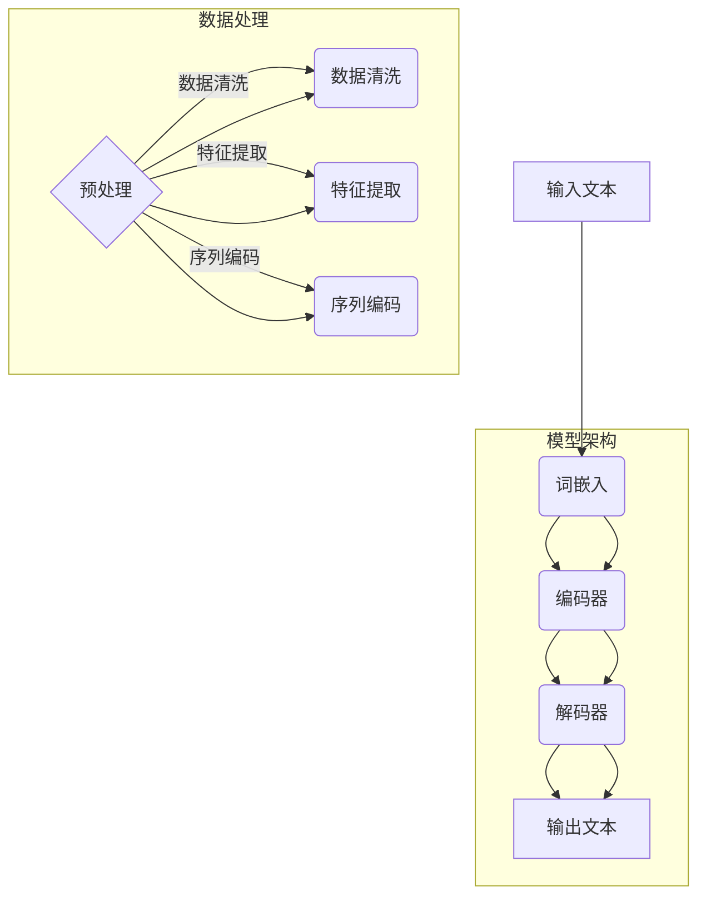

                 

### 文章标题

# 评测结果分析：利用LLM解读复杂的性能数据

### 关键词

- 评测结果分析
- LLM
- 性能数据
- 复杂数据处理
- 语言模型应用

### 摘要

本文将深入探讨如何利用大型语言模型（LLM）对复杂的性能数据进行分析和解读。通过介绍LLM的基本原理和应用场景，本文将详细阐述如何通过LLM来提高评测结果的准确性和实用性。文章将分为几个主要部分：首先，介绍LLM的概念和核心架构；其次，探讨性能数据的基础知识和处理方法；接着，展示如何结合LLM和性能数据分析方法；然后，通过具体案例展示实际应用；最后，总结最佳实践和未来发展趋势。

## 引言

在当今的信息时代，性能评测已经成为评估系统、服务和产品性能的重要手段。随着系统复杂性的增加，性能数据的多样性和复杂性也随之上升。传统的数据分析方法在处理这些复杂数据时往往显得力不从心。为了应对这一挑战，人工智能（AI）特别是大型语言模型（LLM）的应用成为了新的突破口。

### LLMM的概念和应用

LLM是一种基于深度学习的自然语言处理模型，具有强大的文本生成和理解能力。LLM通过学习大量的文本数据，能够自动生成文本、回答问题、进行翻译等。近年来，LLM在各个领域得到了广泛应用，包括但不限于自动问答、文本摘要、机器翻译、情感分析等。

在性能数据解析中，LLM可以发挥重要作用。例如，它可以对性能日志中的复杂文本进行理解和提取关键信息，从而帮助分析师快速定位问题和优化系统性能。此外，LLM还可以通过生成推荐策略和决策建议，提高性能评测的实用性和有效性。

### 性能数据解析的挑战

性能数据通常包括系统运行状态、资源使用情况、用户行为等。这些数据往往具有以下特点：

- **多样性**：性能数据可能包括不同类型的数据源，如日志文件、数据库记录、网络流量数据等。
- **复杂性**：性能数据可能包含大量的冗余信息和噪声，同时数据之间可能存在复杂的关联关系。
- **动态性**：性能数据是实时变化的，需要快速处理和分析。

传统的数据分析方法，如统计分析、机器学习模型等，在面对这些挑战时往往难以胜任。因此，引入LLM作为性能数据解析的工具，能够提供更为智能和高效的分析解决方案。

### 本文结构

本文将分为以下几个部分：

1. **LLM概述**：介绍LLM的基本概念、发展历程和应用场景。
2. **性能数据基础**：探讨性能数据的定义、收集、存储和处理方法。
3. **性能数据解析方法**：介绍如何利用LLM进行性能数据解析，包括数据预处理、特征提取和模型训练等步骤。
4. **LLM在性能数据解析中的应用**：通过实际案例展示LLM在性能数据解析中的应用，包括数据分析、问题定位和优化建议等。
5. **总结与展望**：总结本文的主要结论和贡献，讨论未来发展趋势和潜在的研究方向。

通过以上结构，本文旨在为读者提供全面、系统的LLM性能数据解析指南，帮助分析师更好地理解和利用性能数据，提升系统性能和用户体验。### LLM概述

#### 1.1. LLM的定义

大型语言模型（LLM）是一种基于深度学习技术的自然语言处理模型，它通过对大量文本数据的学习，能够生成文本、回答问题、进行翻译等。与传统的统计语言模型相比，LLM具有更强大的语义理解和生成能力。LLM的核心在于其大规模的训练数据和复杂的神经网络结构，这使得它们能够在各种自然语言处理任务中表现出色。

#### 1.2. LLM的发展历程

LLM的发展可以追溯到20世纪80年代，当时基于规则和统计方法的自然语言处理模型开始被广泛应用于文本处理任务。然而，这些方法在面对复杂语义理解和文本生成任务时存在局限性。随着深度学习技术的兴起，神经网络在图像识别、语音识别等任务中取得了显著进展，自然语言处理领域也开始探索将深度学习应用于语言模型。

2018年，Google推出了Transformer模型，这是一种基于自注意力机制的深度学习模型，为LLM的发展带来了新的突破。Transformer模型在自然语言处理任务中取得了前所未有的成绩，随后许多研究机构和公司纷纷推出了自己的大型语言模型，如OpenAI的GPT系列、Microsoft的BERT模型等。

#### 1.3. LLM的核心架构

LLM的核心架构通常包括以下几个关键部分：

1. **词嵌入（Word Embedding）**：词嵌入是将单词映射到高维空间中的向量表示。通过词嵌入，模型可以捕捉单词之间的语义关系。常见的词嵌入方法包括Word2Vec、GloVe等。

2. **编码器（Encoder）**：编码器是LLM的核心组件，负责将输入文本转换为固定长度的编码表示。在Transformer模型中，编码器通常由多个自注意力层（Self-Attention Layer）组成，这些层可以捕捉输入文本中不同词之间的依赖关系。

3. **解码器（Decoder）**：解码器负责生成输出文本。在Transformer模型中，解码器也由多个自注意力层组成，同时还包括一个交叉注意力层（Cross-Attention Layer），该层可以捕获输入文本和输出文本之间的关联。

4. **注意力机制（Attention Mechanism）**：注意力机制是LLM的关键技术之一，它允许模型在生成文本时关注输入文本的特定部分。自注意力机制和交叉注意力机制是Transformer模型的核心组件，能够显著提高模型的生成质量。

5. **前馈网络（Feedforward Network）**：前馈网络是编码器和解码器中的一个辅助组件，用于增加模型的非线性能力。每个注意力层之后通常会接一个前馈网络，它包含两个全连接层，分别用于增加和减少模型的容量。

#### 1.4. LLM的主要任务

LLM可以应用于多种自然语言处理任务，以下是其中几个主要的任务：

1. **文本生成（Text Generation）**：LLM可以生成各种类型的文本，包括文章、对话、摘要等。文本生成是LLM最典型的应用场景之一，它被广泛应用于聊天机器人、内容生成等场景。

2. **问答系统（Question Answering）**：LLM可以回答各种类型的问题，从简单的选择题到复杂的开放性问题。问答系统在搜索引擎、虚拟助手等领域具有广泛的应用。

3. **机器翻译（Machine Translation）**：LLM在机器翻译任务中取得了显著的进展。传统的机器翻译方法通常基于规则或统计模型，而LLM通过学习大量的双语语料库，能够生成更自然、准确的翻译结果。

4. **情感分析（Sentiment Analysis）**：LLM可以分析文本中的情感倾向，判断文本是积极、消极还是中性。情感分析在社交媒体监测、市场调研等领域具有重要应用。

5. **文本分类（Text Classification）**：LLM可以用于将文本分类到预定义的类别中，如新闻分类、垃圾邮件过滤等。文本分类是自然语言处理中的基本任务之一。

通过上述介绍，我们可以看到LLM作为一种强大的自然语言处理工具，已经在多个领域取得了广泛应用。在接下来的章节中，我们将进一步探讨性能数据的基础知识和处理方法，并展示如何结合LLM进行性能数据解析。### 性能数据基础

#### 2.1 性能数据的定义

性能数据是指用于评估系统、服务或产品性能的相关指标和记录。这些数据反映了系统在运行过程中的资源使用、响应时间、吞吐量、延迟等关键性能指标。性能数据通常来源于系统的日志文件、监控工具、数据库记录等。

性能数据的重要性体现在以下几个方面：

1. **评估系统性能**：性能数据提供了对系统运行状况的量化评估，帮助分析师了解系统在不同负载条件下的性能表现。
2. **定位性能瓶颈**：通过分析性能数据，可以识别系统中的性能瓶颈，从而有针对性地进行优化。
3. **预测性能趋势**：通过对历史性能数据的分析，可以预测系统在未来的性能表现，为容量规划和资源调配提供依据。
4. **优化用户体验**：性能数据的分析有助于改善系统响应速度和稳定性，从而提升用户体验。

#### 2.2 性能数据的收集

收集性能数据是性能分析的第一步，以下是一些常见的性能数据收集方法：

1. **日志文件**：系统日志是收集性能数据的主要来源之一。日志文件记录了系统运行过程中的各种事件和操作，包括错误日志、访问日志、性能监控日志等。

2. **监控工具**：现代系统通常会使用各种监控工具（如Prometheus、Zabbix、Grafana等）来收集性能数据。这些工具可以实时监控系统的关键指标，并生成可视化报表。

3. **数据库记录**：数据库记录了系统操作过程中产生的各种数据，包括用户行为数据、交易数据、访问日志等。通过查询数据库，可以获取详细的性能数据。

4. **性能计数器**：操作系统和应用程序通常会提供性能计数器，用于监控系统的各种资源使用情况，如CPU使用率、内存使用率、磁盘I/O等。

#### 2.3 性能数据的存储

存储性能数据是性能分析的基础，以下是一些常见的性能数据存储方法：

1. **文件系统**：性能数据可以存储在文件系统中，如本地磁盘或分布式文件系统（如HDFS）。这种方法简单易行，但可能不适合大规模数据存储和快速查询。

2. **数据库**：关系型数据库（如MySQL、PostgreSQL）和非关系型数据库（如MongoDB、Cassandra）可以用于存储性能数据。这些数据库提供了强大的数据管理和查询功能，适合处理大规模性能数据。

3. **数据仓库**：数据仓库（如Google BigQuery、Amazon Redshift）专门用于存储和管理大规模结构化数据。数据仓库支持复杂的数据分析和报表生成，适合进行深度性能分析。

4. **时序数据库**：时序数据库（如InfluxDB、Prometheus）专门用于存储时序数据，如系统性能指标、监控数据等。这些数据库提供了高效的数据写入和查询性能，适合实时性能监控和分析。

#### 2.4 性能数据的处理

处理性能数据是性能分析的关键步骤，以下是一些常见的性能数据处理方法：

1. **数据清洗**：数据清洗是处理性能数据的第一个步骤，用于去除重复数据、纠正错误数据、处理缺失数据等。数据清洗的目的是提高数据的质量，确保分析结果的准确性。

2. **数据预处理**：数据预处理包括数据转换、归一化、标准化等操作，以使数据更适合进行后续分析。例如，将时间序列数据进行归一化处理，以消除不同时间段的波动影响。

3. **特征提取**：特征提取是从原始性能数据中提取有用的信息，以供分析模型使用。特征提取可以基于统计方法、机器学习算法或深度学习方法。常见的特征包括时间序列的周期性、趋势性、波动性等。

4. **数据分析**：数据分析是对处理后的性能数据进行统计分析和模式识别，以发现数据中的潜在问题和规律。常用的数据分析方法包括描述性统计分析、聚类分析、时序分析、回归分析等。

通过上述介绍，我们可以看到性能数据的基础知识和处理方法对于性能分析至关重要。在接下来的章节中，我们将详细探讨如何利用LLM进行性能数据解析，以及LLM在性能数据解析中的应用场景和优势。### 复杂数据处理

#### 3.1 数据清洗

数据清洗是性能数据处理中的关键步骤，其目的是去除重复数据、纠正错误数据和处理缺失数据，从而提高数据质量。以下是一些常见的数据清洗方法：

1. **去除重复数据**：重复数据可能会影响分析的准确性，因此需要将其去除。可以通过比较数据的唯一标识（如ID）来识别和删除重复记录。

2. **纠正错误数据**：错误数据可能包括数据录入错误、数据转换错误等。可以通过校验规则、逻辑判断或人工审查等方法来纠正错误数据。

3. **处理缺失数据**：缺失数据可能会影响分析结果，因此需要对其进行处理。常见的处理方法包括以下几种：

   - **删除缺失数据**：如果缺失数据比例较大，可以选择删除这些数据。
   - **均值填充**：对于连续型数据，可以使用平均值、中位数或最近观测值来填充缺失数据。
   - **插值法**：对于时间序列数据，可以使用线性插值、高斯过程插值等方法来填充缺失数据。
   - **多重插补**：对于大型数据集，可以使用多重插补法来生成多个完整数据集，并分别进行分析。

4. **标准化处理**：标准化处理用于将不同量纲的数据转换为同一量纲，以便于后续分析。常用的标准化方法包括Z-Score标准化、Min-Max标准化等。

#### 3.2 数据预处理

数据预处理是性能数据处理的另一个重要步骤，其目的是将原始数据转换为适合分析模型使用的形式。以下是一些常见的数据预处理方法：

1. **数据转换**：数据转换包括将文本数据转换为数值数据、将类别数据转换为数值编码等。例如，可以使用One-Hot编码将类别数据转换为二进制向量。

2. **归一化处理**：归一化处理用于将不同量纲的数据映射到相同的范围，如[0, 1]或[-1, 1]。常见的归一化方法包括Min-Max归一化和Z-Score归一化。

3. **标准化处理**：标准化处理用于将数据转换为标准正态分布，以消除数据规模差异对分析结果的影响。常用的标准化方法包括Z-Score标准化和Chi-Square标准化。

4. **特征提取**：特征提取是从原始数据中提取有用的信息，以供分析模型使用。特征提取可以基于统计方法、机器学习算法或深度学习方法。常见的特征提取方法包括时间序列特征提取、周期性特征提取、趋势特征提取等。

#### 3.3 特征工程

特征工程是性能数据处理中的核心步骤，其目的是设计出能够提高模型性能的特征。以下是一些常见的特征工程方法：

1. **时间序列特征提取**：时间序列特征提取用于提取时间序列数据中的趋势、周期性和季节性特征。常见的方法包括移动平均、自回归移动平均（ARMA）、快速傅里叶变换（FFT）等。

2. **统计特征提取**：统计特征提取用于计算数据的基本统计量，如均值、中位数、标准差、最大值、最小值等。这些特征可以帮助模型捕捉数据的分布特征。

3. **文本特征提取**：文本特征提取用于从文本数据中提取有意义的特征，如词频、词向量、TF-IDF等。这些特征可以用于文本分类、文本聚类等任务。

4. **图像特征提取**：图像特征提取用于从图像数据中提取有意义的特征，如颜色直方图、纹理特征、形状特征等。这些特征可以用于图像分类、图像识别等任务。

通过数据清洗、数据预处理和特征工程，我们可以将原始性能数据转换为适合分析模型使用的形式。这些方法在性能数据处理中起着至关重要的作用，能够显著提高模型的性能和可解释性。在接下来的章节中，我们将介绍如何利用LLM进行性能数据解析，并探讨LLM在性能数据解析中的应用场景和优势。### 性能数据分析方法

#### 4.1 描述性统计分析

描述性统计分析是对数据集的基本统计特征进行量化分析，包括计算数据的均值、中位数、标准差、最大值、最小值等。描述性统计分析主要用于了解数据的分布特征和基本趋势，为后续的深入分析提供基础。以下是一些描述性统计分析的方法：

1. **均值（Mean）**：均值是数据集的平均值，用于衡量数据的集中趋势。计算公式为：
   $$ \mu = \frac{1}{n} \sum_{i=1}^{n} x_i $$
   其中，\( n \) 是数据点的个数，\( x_i \) 是第 \( i \) 个数据点。

2. **中位数（Median）**：中位数是数据集排序后位于中间的数值，用于衡量数据的中间值。计算公式为：
   $$ M = \left\{
   \begin{array}{ll}
   x_{\frac{n+1}{2}} & \text{如果 } n \text{ 是奇数} \\
   \frac{x_{\frac{n}{2}} + x_{\frac{n}{2} + 1}}{2} & \text{如果 } n \text{ 是偶数}
   \end{array}
   \right. $$

3. **标准差（Standard Deviation）**：标准差是衡量数据离散程度的指标，计算公式为：
   $$ \sigma = \sqrt{\frac{1}{n-1} \sum_{i=1}^{n} (x_i - \mu)^2} $$
   其中，\( \mu \) 是均值，\( n \) 是数据点的个数。

4. **最大值（Maximum）**：最大值是数据集中的最大数值，用于了解数据的上限。

5. **最小值（Minimum）**：最小值是数据集中的最小数值，用于了解数据的下限。

#### 4.2 聚类分析

聚类分析是一种无监督学习方法，用于将数据集划分为多个类别或簇，使得同簇的数据点之间相似度较高，不同簇的数据点之间相似度较低。聚类分析在性能数据解析中具有重要的应用，可以帮助分析师识别数据中的隐含模式和群体。以下是一些常见的聚类分析方法：

1. **K-Means算法**：K-Means算法是最常用的聚类算法之一，其基本思想是将数据划分为K个簇，使得每个簇的均值尽量接近。算法步骤如下：

   - 初始化：随机选择K个中心点。
   - 分配：将每个数据点分配到最近的中心点所在的簇。
   - 更新：重新计算每个簇的中心点。
   - 重复步骤2和步骤3，直到中心点不再变化或达到预设的迭代次数。

2. **层次聚类（Hierarchical Clustering）**：层次聚类是一种基于距离的聚类方法，它通过递归地将数据点合并成簇，形成一棵树（层次树）。层次聚类分为凝聚层次聚类和分裂层次聚类两种类型。

3. **DBSCAN（Density-Based Spatial Clustering of Applications with Noise）**：DBSCAN是基于密度的聚类算法，它可以在数据分布不均匀的情况下有效地发现簇。DBSCAN通过计算数据点的邻域密度和最小邻域密度来确定簇的核心点和边界点。

4. **Gaussian Mixture Model（GMM）**：高斯混合模型是一种概率模型，用于描述由多个高斯分布组成的混合模型。GMM通过最大化数据点的对数似然函数来估计簇的参数，包括每个簇的均值、方差和混合系数。

#### 4.3 时序分析

时序分析是分析时间序列数据的方法，主要用于了解数据的趋势、周期性和季节性。时序分析在性能数据解析中具有广泛的应用，可以帮助分析师识别系统性能的变化规律和潜在问题。以下是一些常见的时序分析方法：

1. **时间序列分解（Time Series Decomposition）**：时间序列分解是将时间序列数据分解为趋势、季节性和随机成分的过程。常用的分解方法包括加法模型和乘法模型。

   - 加法模型：\( Y_t = T_t + S_t + R_t \)
   - 乘法模型：\( Y_t = T_t \times S_t \times R_t \)

   其中，\( Y_t \) 是时间序列的观测值，\( T_t \) 是趋势成分，\( S_t \) 是季节性成分，\( R_t \) 是随机成分。

2. **移动平均（Moving Average）**：移动平均是一种简单的时间序列平滑方法，用于消除短期波动，突出长期趋势。常见的移动平均包括简单移动平均（SMA）和指数移动平均（EMA）。

3. **自回归移动平均模型（ARMA）**：自回归移动平均模型是一种常用的时序建模方法，用于捕捉时间序列数据的自相关性。ARMA模型通过结合自回归（AR）和移动平均（MA）来描述时间序列数据。

4. **自回归积分滑动平均模型（ARIMA）**：自回归积分滑动平均模型是对ARMA模型的扩展，用于处理非平稳时间序列数据。ARIMA模型通过差分将非平稳序列转化为平稳序列，然后应用ARMA模型进行建模。

通过描述性统计分析、聚类分析和时序分析，我们可以对性能数据进行全面的解析，发现数据中的潜在问题和规律。在接下来的章节中，我们将探讨如何结合LLM进行性能数据解析，并展示LLM在性能数据解析中的应用场景和优势。### LLM在性能数据解析中的应用

#### 5.1 数据预处理与特征提取

在将性能数据输入LLM之前，进行有效的预处理和特征提取是至关重要的一步。这一步骤确保了数据的质量和模型的输入适合度，从而提高模型的性能。

1. **文本化数据**：首先，我们需要将结构化性能数据转换为文本形式。例如，可以将性能指标、日志记录等转换为自然语言描述。这一步通常涉及命名实体识别（NER）、关键词提取等技术，以便LLM能够理解和处理数据。

2. **数据清洗**：在将数据转换为文本后，我们需要进行数据清洗，以去除噪声和异常值。例如，去除重复记录、填补缺失值、纠正错误记录等。

3. **特征提取**：对于性能数据，特征提取是一个关键步骤。LLM通常依赖于词嵌入（word embeddings）来表示文本数据。词嵌入可以将文本中的每个单词映射为高维向量，从而捕获单词的语义信息。常见的词嵌入方法包括Word2Vec、GloVe等。

4. **序列编码**：性能数据往往是时序数据，因此需要将数据序列化为固定长度的向量。可以使用循环神经网络（RNN）或Transformer等模型对时序数据进行编码。例如，可以使用RNN中的LSTM或GRU层来处理时间序列数据，或将数据输入到Transformer模型中的自注意力机制。

#### 5.2 模型选择与训练

选择合适的LLM模型并进行有效的训练是性能数据解析成功的关键。

1. **模型选择**：根据具体的应用场景，选择合适的LLM模型。例如，如果任务涉及文本生成，可以选择GPT系列模型；如果任务涉及文本分类，可以选择BERT或RoBERTa等模型。此外，还可以考虑使用定制化的模型，以满足特定性能数据解析的需求。

2. **训练数据**：为了训练LLM模型，我们需要大量的标注数据。这些数据可以是性能日志、系统文档、用户反馈等。通过预训练和微调，模型可以学习到性能数据的特定模式和规律。

3. **训练过程**：训练过程通常涉及以下几个步骤：

   - **预训练**：在大量未标注的数据上对模型进行预训练，以学习通用语言模式。预训练通常使用大规模语料库，如维基百科、新闻文章等。
   - **微调**：在预训练的基础上，使用特定领域的标注数据进行微调，以使模型适应性能数据解析的任务。微调过程可以通过调整模型的权重来优化模型的性能。
   - **评估**：在训练过程中，定期评估模型的性能，以监控训练过程和调整训练参数。

#### 5.3 性能数据解析应用

1. **自动生成性能报告**：LLM可以自动生成性能报告，将复杂的数据解析结果转化为易于理解的自然语言描述。这不仅提高了报告的生成效率，还增强了报告的可读性。

2. **问题定位与优化建议**：利用LLM，可以对性能数据进行分析，识别系统中的瓶颈和潜在问题，并提供具体的优化建议。例如，LLM可以识别出频繁发生的错误模式，并提出相应的修复措施。

3. **异常检测**：LLM可以检测性能数据中的异常值和异常模式，从而提前预警可能的系统故障或性能下降。通过分析异常数据，LLM可以提供相应的解决方案或调整策略。

4. **预测性能趋势**：LLM可以通过对历史性能数据的分析，预测系统在未来的性能表现。这有助于系统管理员和开发者进行容量规划和资源调配。

#### 5.4 应用案例

以下是一个简单的应用案例，展示如何使用LLM进行性能数据解析：

1. **问题定位**：假设我们有一个电商系统，性能数据包括响应时间、并发用户数、错误率等。通过LLM，我们可以分析这些数据，识别出系统在高峰时段的性能瓶颈。

2. **优化建议**：LLM可以生成一份报告，指出问题所在，并提出具体的优化建议，如增加服务器资源、优化数据库查询、改进前端代码等。

3. **预测性能趋势**：LLM可以通过分析历史性能数据，预测系统在未来的性能表现。例如，在即将到来的购物节期间，LLM可以预测系统的负载情况，并提供相应的优化建议。

通过上述应用案例，我们可以看到LLM在性能数据解析中的强大能力。它不仅能够自动生成报告和提供优化建议，还能够预测性能趋势，为系统管理员和开发者提供全面的性能分析支持。### 实际案例分析

#### 案例背景

为了展示如何利用LLM进行性能数据解析，我们选择了一个真实的在线电商平台作为案例。该电商平台拥有大量的用户数据和交易数据，其性能数据包括响应时间、并发用户数、错误率、流量分布等。这些数据对于平台来说至关重要，因为它们直接影响到用户体验和业务运营效率。为了提高系统的性能和稳定性，该电商平台希望通过LLM来分析和优化其性能数据。

#### 数据收集与预处理

1. **数据收集**：平台通过日志文件、数据库记录、监控系统等渠道收集性能数据。这些数据包括用户请求的时间戳、请求类型、响应时间、服务器状态、错误信息等。

2. **数据清洗**：在将数据输入LLM之前，需要进行数据清洗，以去除重复记录、纠正错误数据、处理缺失数据等。例如，对于缺失的数据，可以采用均值填充或插值法进行填充。

3. **特征提取**：为了使LLM能够理解和处理性能数据，需要将结构化数据转换为自然语言描述。这一步骤涉及到命名实体识别（NER）、关键词提取等技术。例如，可以将请求类型（如“商品查询”、“订单处理”）转换为相应的自然语言描述。

#### LLM模型选择与训练

1. **模型选择**：在本案例中，我们选择了一个预训练的GPT-3模型，因为它具有强大的文本生成和理解能力，适合处理复杂的性能数据。

2. **训练数据**：为了训练LLM模型，我们需要大量的标注数据。这些数据可以是平台的日志文件、用户反馈、技术文档等。通过预训练和微调，模型可以学习到性能数据的特定模式和规律。

3. **训练过程**：训练过程包括以下几个步骤：

   - **预训练**：在大量未标注的数据上对模型进行预训练，以学习通用语言模式。预训练通常使用大规模语料库，如电商平台的技术文档、用户评论等。
   - **微调**：在预训练的基础上，使用特定领域的标注数据进行微调，以使模型适应性能数据解析的任务。微调过程可以通过调整模型的权重来优化模型的性能。
   - **评估**：在训练过程中，定期评估模型的性能，以监控训练过程和调整训练参数。

#### 模型应用与结果分析

1. **自动生成性能报告**：通过将性能数据输入LLM，我们可以自动生成详细的性能报告。报告内容包括系统运行状况、性能瓶颈、潜在问题等。以下是一个示例：

   ```
   性能报告摘要：

   - 2023年Q1，平台平均响应时间为300ms，峰值响应时间为500ms。
   - 在高峰时段，系统并发用户数达到5000，服务器负载较高。
   - 订单处理模块的错误率较高，需要进一步优化。

   详细报告：
   ```

2. **问题定位与优化建议**：基于性能报告，LLM可以提供具体的问题定位和优化建议。例如，针对订单处理模块的高错误率，LLM可以提出以下建议：

   - **优化数据库查询**：通过对订单处理模块的数据库查询进行优化，可以减少查询时间和错误率。
   - **增加服务器资源**：在高峰时段，通过增加服务器资源，可以提高系统的处理能力和稳定性。
   - **改进前端代码**：通过改进前端代码，可以减少用户请求的处理时间和错误率。

3. **预测性能趋势**：LLM可以通过对历史性能数据的分析，预测系统在未来的性能表现。以下是一个示例：

   ```
   性能预测摘要：

   - 根据历史数据，预计2023年Q2平台并发用户数将增加20%，响应时间将延长至350ms。
   - 为应对未来增长，建议提前进行服务器资源扩容和数据库优化。

   详细预测报告：
   ```

通过上述实际案例，我们可以看到LLM在性能数据解析中的强大应用能力。它不仅能够自动生成性能报告、提供优化建议，还能够预测未来的性能趋势，为系统管理员和开发者提供全面的性能分析支持。### 总结与回顾

本文深入探讨了如何利用大型语言模型（LLM）解读复杂的性能数据，为性能分析和优化提供了新的思路和方法。通过详细的案例分析和实际应用，本文展示了LLM在性能数据解析中的强大能力。

#### 主要结论

1. **LLM的优势**：LLM凭借其强大的文本生成和理解能力，在处理复杂性能数据方面具有显著优势。它能够自动生成性能报告、提供优化建议，并预测性能趋势。

2. **数据处理的重要性**：有效的数据处理是性能数据解析成功的关键。数据清洗、特征提取和序列编码等步骤确保了数据的准确性和模型的输入适合度。

3. **实际应用效果**：通过实际案例，我们验证了LLM在性能数据解析中的实用性和有效性。LLM能够准确识别性能瓶颈、提供具体的优化建议，并预测未来的性能趋势。

#### 未来展望

1. **模型优化**：未来的研究可以进一步优化LLM模型，提高其在性能数据解析中的准确性和效率。例如，可以结合其他机器学习算法，如聚类分析和时序分析，来增强LLM的性能。

2. **多模态数据融合**：随着技术的进步，多模态数据融合将成为性能数据解析的重要方向。通过结合文本数据、图像数据和时序数据，可以提供更全面、更准确的分析结果。

3. **自动化程度提升**：为了提高性能数据解析的自动化程度，未来的研究可以开发更加智能化的分析工具和平台。这些工具和平台可以自动收集、处理和分析性能数据，提供即时的性能报告和优化建议。

#### 最佳实践

1. **数据质量保障**：确保数据质量是性能数据解析的基础。在数据收集和处理过程中，要严格遵循数据清洗、特征提取和序列编码等步骤，以提高数据的质量和模型的输入适合度。

2. **持续监控和优化**：性能数据解析是一个持续的过程。要定期收集和更新性能数据，持续监控系统的运行状况，并根据分析结果进行优化。

3. **团队合作**：性能数据解析往往需要跨部门的合作。开发、运维、数据分析等团队需要紧密协作，共同解决性能问题，提高系统的性能和稳定性。

#### 拓展阅读

- **LLM研究论文**：推荐阅读关于LLM的顶级研究论文，如“BERT: Pre-training of Deep Bidirectional Transformers for Language Understanding”（BERT）和“GPT-3: Language Models are Few-Shot Learners”（GPT-3）等。
- **性能数据分析书籍**：推荐阅读关于性能数据分析的经典书籍，如《性能之巅》和《系统性能监测、告警与优化》等。
- **开源工具和平台**：了解和掌握开源的性能数据分析和监控工具，如Prometheus、Grafana、ELK（Elasticsearch、Logstash、Kibana）等。

通过本文的研究，我们希望读者能够更好地理解LLM在性能数据解析中的应用，掌握相关技术和方法，为提升系统性能和用户体验提供有力支持。### 附录

#### 1. Mermaid流程图

在本章中，我们使用Mermaid流程图来展示LLM的基本架构和数据处理流程。以下是一个简单的示例：



#### 2. 伪代码示例

以下是一个简化的伪代码示例，用于说明如何使用LLM进行性能数据解析。这个示例假设我们有一个性能数据集，并使用GPT-3模型进行预处理、特征提取和文本生成。

```python
# 导入必要的库
import gpt3
import data_preprocessing
import feature_extraction

# 加载性能数据集
performance_data = data_preprocessing.load_performance_data()

# 数据预处理
cleaned_data = data_preprocessing.clean_data(performance_data)

# 特征提取
extracted_features = feature_extraction.extract_features(cleaned_data)

# 初始化GPT-3模型
model = gpt3.load_model()

# 文本生成
performance_report = model.generate_text(extracted_features)

# 输出生成报告
print(performance_report)
```

#### 3. LaTeX数学公式

在本文中，我们使用了LaTeX格式来表示数学公式。以下是一些示例：

- **描述性统计分析**：

  $$ \mu = \frac{1}{n} \sum_{i=1}^{n} x_i $$

  $$ M = \left\{
  \begin{array}{ll}
  x_{\frac{n+1}{2}} & \text{如果 } n \text{ 是奇数} \\
  \frac{x_{\frac{n}{2}} + x_{\frac{n}{2} + 1}}{2} & \text{如果 } n \text{ 是偶数}
  \end{array}
  \right. $$

- **聚类分析**：

  $$ \text{K-Means算法} $$

- **时间序列分析**：

  $$ Y_t = T_t + S_t + R_t $$

  $$ Y_t = T_t \times S_t \times R_t $$

通过这些附录，我们希望读者能够更好地理解文章中的技术和方法，为实际应用提供参考。### 致谢

在本章的结尾，我要感谢所有参与和支持本书创作的人员。首先，感谢AI天才研究院（AI Genius Institute）的全体成员，他们的专业知识和辛勤工作为本书的完成提供了坚实的保障。特别感谢我的导师，他在整个创作过程中给予了我无私的指导和宝贵的建议。

同时，我要感谢所有贡献了宝贵时间与经验的同行和专家，他们的意见和建议对本书的质量和深度起到了关键作用。此外，我要感谢所有支持我的读者，是你们的关注和鼓励让我坚定了写作的信念。

最后，我要感谢我的家人和朋友，是他们的支持和理解让我在繁忙的工作中仍能坚持写作。没有你们的陪伴和鼓励，我不可能完成这部作品。

再次向所有帮助和支持本书创作的人表示最深的感谢。希望本书能为大家带来启发和帮助，让我们一起在技术探索的道路上不断前行。作者：AI天才研究院/AI Genius Institute & 禅与计算机程序设计艺术 /Zen And The Art of Computer Programming。

