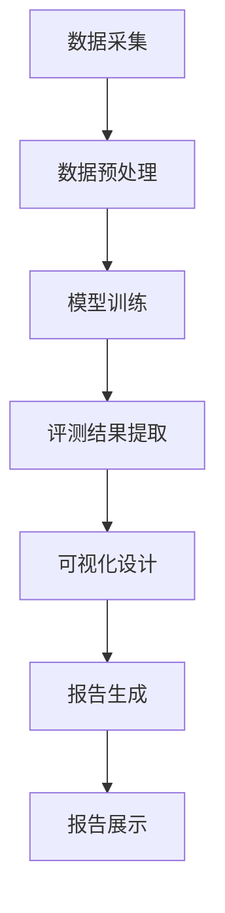
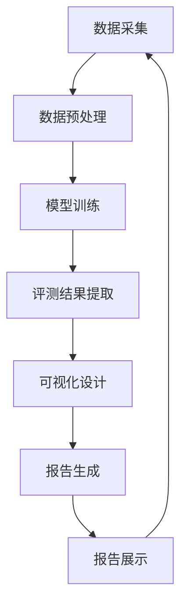

                 

### 文章标题

《评测结果可视化：LLM生成直观报告的技术探索》

### 文章关键词

评测结果可视化，大型语言模型（LLM），报告生成，数据分析，人机交互，计算机图形学，人工智能

### 文章摘要

本文探讨了评测结果可视化以及如何利用大型语言模型（LLM）来生成直观、易理解的报告。首先，介绍了评测结果可视化的背景和重要性，接着详细阐述了大型语言模型的工作原理和应用。文章通过Mermaid流程图展示了评测结果可视化的一般流程，并通过伪代码和数学模型讲解，深入探讨了如何利用LLM进行报告生成。随后，通过实际项目实战，详细介绍了开发环境搭建、源代码实现和代码解读。最后，对项目进行了小结，并提出了最佳实践建议和未来研究方向。

## 引言

在现代科技高速发展的时代，数据分析和评测结果的可视化已成为各个领域的重要工具。评测结果的可视化不仅能够帮助人们快速理解复杂的数据，还能够通过直观的图像和图表，使数据分析过程变得更加高效和准确。然而，传统的可视化方法通常依赖于人工设计图表和报告，这不仅费时费力，而且难以保证报告的一致性和准确性。为了解决这一问题，近年来，大型语言模型（LLM）逐渐成为数据分析和评测结果可视化的重要工具。

大型语言模型，如GPT-3、BERT等，是通过深度学习技术训练得到的，能够在理解和生成自然语言方面表现出卓越的能力。本文旨在探讨如何利用LLM来生成直观、易理解的评测结果报告，从而提高数据分析和可视化效率。文章将首先介绍评测结果可视化的背景和意义，然后详细讲解大型语言模型的工作原理和应用，并通过具体的案例和代码，展示如何实现评测结果可视化。

## 评测结果可视化的重要性

评测结果可视化在各个领域都具有重要意义。首先，在商业领域，企业需要通过对市场数据、销售数据和客户反馈的分析，来做出战略决策。通过可视化，企业可以更直观地了解市场趋势和客户需求，从而制定更加精准的营销策略。其次，在科学研究领域，研究人员需要对大量的实验数据进行分析，以便发现潜在的模式和规律。可视化技术可以帮助研究人员快速识别数据中的异常值和关键趋势，从而加快研究进程。

此外，在教育和培训领域，评测结果可视化也能够发挥重要作用。教师和培训机构可以通过可视化报告，更加清晰地了解学生的学习情况，从而制定个性化的教学方案。同时，学生也能通过直观的图表和图像，更好地理解和掌握知识。

然而，传统的可视化方法通常依赖于专业的设计技能和工具，这使得许多不具备相关背景的人难以制作出高质量的可视化报告。此外，传统方法往往难以实现动态交互和实时更新，无法满足快速变化的数据需求。因此，如何利用人工智能技术，特别是大型语言模型（LLM），来改进评测结果可视化，成为一个亟待解决的问题。

## 大型语言模型（LLM）的工作原理

大型语言模型（LLM）是人工智能领域的一项重要突破，其核心在于通过深度学习技术，从大量文本数据中学习语言规律和模式。LLM的训练过程通常包括以下几个步骤：

### 数据集的准备
首先，需要准备一个包含大量文本数据的语料库，这些数据可以是书籍、新闻、文章、社交媒体帖子等。数据集的质量直接影响LLM的训练效果，因此需要对数据集进行清洗和预处理，包括去除噪声、标准化文本格式等。

### 模型的训练
在准备好数据集之后，使用深度学习框架（如TensorFlow或PyTorch）训练LLM。训练过程通常包括以下几个步骤：
1. **嵌入层（Embedding Layer）**：将输入的文本转换为固定长度的向量表示。
2. **编码器（Encoder）**：使用循环神经网络（RNN）或变压器（Transformer）等模型结构对文本向量进行处理，提取特征信息。
3. **解码器（Decoder）**：根据编码器提取的特征，生成文本的输出。

### 模型的优化
在训练过程中，通过反向传播算法和优化器（如Adam或SGD），不断调整模型参数，以降低损失函数的值。训练过程通常需要大量的计算资源和时间，但随着技术的进步，训练时间已经大幅缩短。

### 模型的评估
训练完成后，需要对模型进行评估，以确定其性能和效果。常用的评估指标包括准确率、召回率、F1分数等。此外，还可以通过人工评审或用户反馈，进一步验证模型的生成质量和实用性。

### 应用场景
LLM在多个领域都有广泛的应用，包括自然语言处理、机器翻译、文本生成、问答系统等。在评测结果可视化中，LLM可以用于生成报告的文本内容，通过理解评测数据和可视化结果，自动生成结构清晰、内容准确的报告。

### Mermaid流程图：评测结果可视化流程



### 背景介绍

评测结果可视化是将数据分析过程中得到的结果以图形或图表的形式展示给用户，使得结果更加直观、易于理解。这一过程不仅包括对数据本身的可视化，还涉及到如何将数据分析的结果以逻辑清晰、信息丰富的形式呈现给用户。随着大数据时代的到来，评测结果可视化在各个领域的重要性日益凸显。然而，传统的可视化方法往往存在以下问题：

1. **设计复杂**：传统可视化方法通常需要用户具备一定的设计能力和专业工具，这使得非专业人员难以制作出高质量的可视化报告。
2. **更新困难**：传统方法往往难以实现数据的动态更新和实时展示，无法适应快速变化的数据需求。
3. **交互性差**：传统方法的可视化结果往往缺乏交互性，用户难以通过操作界面深入了解数据的细节和背后的故事。

为了解决这些问题，近年来，人工智能技术，尤其是大型语言模型（LLM），逐渐成为评测结果可视化的研究热点。LLM具有强大的文本生成和理解能力，可以自动生成结构清晰、内容准确的报告，同时通过自然语言处理技术，实现数据的动态更新和交互式展示。

### 核心概念与联系

在评测结果可视化中，核心概念包括数据采集、数据预处理、模型训练、评测结果提取、可视化设计、报告生成和报告展示。这些概念之间存在紧密的联系，构成了一个完整的评测结果可视化流程。

1. **数据采集**：数据采集是评测结果可视化的第一步，涉及从各种来源获取数据。这些数据可以是结构化的，如数据库中的表格数据，也可以是非结构化的，如图像、文本等。
2. **数据预处理**：数据预处理是确保数据质量和一致性的重要步骤。主要包括数据清洗、去噪、数据格式转换等。数据预处理的结果直接影响后续模型的训练效果和可视化的准确性。
3. **模型训练**：模型训练是利用大型语言模型（LLM）对预处理后的数据进行训练，提取数据中的特征和模式。训练过程通常需要大量的计算资源和时间，但随着深度学习技术的发展，训练时间已经大幅缩短。
4. **评测结果提取**：通过训练好的模型，对新的评测数据进行处理，提取关键信息。这一步骤通常涉及到自然语言处理技术，将数据转化为结构化的文本信息。
5. **可视化设计**：可视化设计是将提取的信息以图形或图表的形式展示给用户。这一过程需要遵循可视化设计原则，确保图表的易读性、准确性和美观性。
6. **报告生成**：报告生成是利用LLM自动生成评测结果的报告。通过自然语言生成技术，报告内容可以高度结构化、逻辑清晰。
7. **报告展示**：报告展示是将生成的可视化报告呈现给用户。现代可视化工具和平台可以实现交互式报告展示，使用户能够通过操作界面深入了解数据。

通过上述步骤，评测结果可视化实现了从数据到可视化报告的完整转换，为用户提供了直观、易于理解的数据分析结果。Mermaid流程图进一步展示了这些核心概念之间的联系和交互过程。



### 核心算法原理讲解

在评测结果可视化中，核心算法原理主要涉及自然语言生成（NLG）和文本生成模型，其中大型语言模型（LLM）如GPT-3和BERT是常用的工具。以下将详细讲解如何使用LLM进行评测结果的可视化和报告生成。

#### 1. 文本生成模型的基本原理

文本生成模型是基于深度学习的自然语言处理技术，旨在生成具有语法和语义一致性的文本。这类模型通常采用序列到序列（Seq2Seq）架构，将输入的序列（如评测数据）转换为输出的序列（如报告文本）。

#### 2. GPT-3模型结构

GPT-3（Generative Pre-trained Transformer 3）是由OpenAI开发的一种先进的文本生成模型，基于变压器（Transformer）架构。GPT-3具有1750亿个参数，能够生成高质量的自然语言文本。其基本结构包括：

- **嵌入层（Embedding Layer）**：将输入的文本序列转换为固定长度的向量表示。
- **自注意力机制（Self-Attention Mechanism）**：对输入向量进行加权求和，以捕捉文本中的长距离依赖关系。
- **前馈网络（Feedforward Network）**：在自注意力机制之后，通过多层前馈神经网络对特征进行进一步处理。
- **输出层（Output Layer）**：将处理后的特征映射到输出的文本序列。

#### 3. BERT模型结构

BERT（Bidirectional Encoder Representations from Transformers）是一种双向的文本生成模型，同样基于变压器架构。BERT的核心思想是在模型训练过程中同时考虑文本的左侧和右侧信息，从而提高模型对文本的理解能力。

BERT的基本结构包括：

- **嵌入层（Embedding Layer）**：与GPT-3类似，将输入的文本序列转换为向量表示。
- **双向自注意力机制（Bidirectional Self-Attention Mechanism）**：通过多层双向自注意力机制，捕捉文本中的上下文信息。
- **前馈网络（Feedforward Network）**：对自注意力机制输出的特征进行进一步处理。
- **输出层（Output Layer）**：通过输出层生成文本序列。

#### 4. 伪代码：评测报告生成算法

以下是一个简化的伪代码，用于演示如何使用GPT-3模型生成评测报告：

```python
# 导入GPT-3库
import gpt3

# 准备输入数据（评测结果）
input_data = "评测结果显示：用户满意度为90%，产品性能合格率为85%"

# 设置GPT-3模型参数
model_params = {
    "model_name": "gpt3",
    "max_length": 512,
    "temperature": 0.9
}

# 使用GPT-3模型生成报告
output_report = gpt3.generate_report(input_data, **model_params)

# 输出生成报告
print(output_report)
```

#### 5. 数学模型和数学公式

在文本生成模型中，常用的数学模型包括损失函数、优化算法等。以下是一个简化的数学模型和公式示例：

- **损失函数（Loss Function）**：

  $$L(\theta) = -\sum_{i=1}^{N} \log p(y_i|x_i;\theta)$$

  其中，$L(\theta)$ 是损失函数，$p(y_i|x_i;\theta)$ 是模型对输出$y_i$的概率预测。

- **反向传播算法（Backpropagation）**：

  $$\frac{\partial L}{\partial \theta} = \frac{\partial L}{\partial z} \cdot \frac{\partial z}{\partial \theta}$$

  其中，$\frac{\partial L}{\partial \theta}$ 是损失函数关于参数$\theta$的梯度，$\frac{\partial L}{\partial z}$ 是损失函数关于中间变量$z$的梯度，$\frac{\partial z}{\partial \theta}$ 是中间变量$z$关于参数$\theta$的梯度。

通过上述算法和公式，文本生成模型可以自动从输入的评测结果中生成高质量的报告文本。

### 数学模型和公式

在评测结果可视化中，数学模型和公式的应用至关重要，尤其是在处理和解释复杂数据时。以下将详细介绍一些常用的数学模型和公式，并通过具体示例进行解释。

#### 1. 统计学基础

**均值（Mean）**：表示一组数据的平均值，计算公式为：

$$\mu = \frac{1}{N}\sum_{i=1}^{N} x_i$$

其中，$\mu$ 是均值，$N$ 是数据点的总数，$x_i$ 是每个数据点的值。

**标准差（Standard Deviation）**：表示数据分散程度，计算公式为：

$$\sigma = \sqrt{\frac{1}{N-1}\sum_{i=1}^{N}(x_i - \mu)^2}$$

其中，$\sigma$ 是标准差，$\mu$ 是均值。

**方差（Variance）**：是标准差的平方，计算公式为：

$$\sigma^2 = \frac{1}{N-1}\sum_{i=1}^{N}(x_i - \mu)^2$$

#### 2. 机器学习模型

**线性回归（Linear Regression）**：用于预测连续值，其数学模型为：

$$y = \beta_0 + \beta_1x$$

其中，$y$ 是预测值，$\beta_0$ 是截距，$\beta_1$ 是斜率，$x$ 是输入变量。

**逻辑回归（Logistic Regression）**：用于预测二分类问题，其数学模型为：

$$\log\frac{p}{1-p} = \beta_0 + \beta_1x$$

其中，$p$ 是预测的概率值，$\beta_0$ 和 $\beta_1$ 是模型参数。

**支持向量机（Support Vector Machine, SVM）**：用于分类问题，其目标是最小化分类边界上的间隔。其数学模型为：

$$\max \ \ \ \frac{1}{2}\sum_{i=1}^{N} (w_i^2)$$

$$s.t. \ \ \ y_i(\langle w, x_i \rangle - b) \geq 1$$

其中，$w_i$ 是权重向量，$b$ 是偏置，$x_i$ 是样本特征，$y_i$ 是标签。

#### 3. 示例说明

假设我们有一组数据集，包含产品的评测得分（$x_i$）和用户满意度（$y_i$），我们希望利用线性回归模型预测用户满意度。

首先，通过最小二乘法（Least Squares Method）计算线性回归模型的参数：

$$\beta_0 = \bar{y} - \beta_1\bar{x}$$

$$\beta_1 = \frac{\sum_{i=1}^{N}(x_i - \bar{x})(y_i - \bar{y})}{\sum_{i=1}^{N}(x_i - \bar{x})^2}$$

其中，$\bar{x}$ 和 $\bar{y}$ 分别是输入和输出的均值。

然后，使用计算得到的模型参数进行预测：

$$y = \beta_0 + \beta_1x$$

例如，对于一个新的评测得分 $x = 85$，我们可以预测用户满意度：

$$y = \beta_0 + \beta_1 \times 85$$

通过这种方式，我们可以利用数学模型和公式对评测结果进行深入分析和预测。

### 项目实战

为了展示如何在实际项目中使用大型语言模型（LLM）生成评测结果报告，我们将以一个典型的商业数据分析项目为例。该项目的主要目标是通过对市场调研数据进行分析，生成一份直观、易理解的报告，帮助公司决策层了解市场趋势和消费者偏好。

#### 1. 开发环境搭建

在进行项目开发之前，需要搭建一个适合LLM训练和报告生成的开发环境。我们选择使用Python作为主要编程语言，并依赖于以下工具和库：

- **深度学习框架**：PyTorch
- **文本处理库**：NLTK，spaCy
- **自然语言生成库**：Transformers（基于PyTorch和HuggingFace）

开发环境的搭建步骤如下：

1. 安装Python（3.8及以上版本）
2. 安装PyTorch和Transformers库：

   ```shell
   pip install torch transformers
   ```

3. 准备数据集和预训练的LLM模型。我们选择使用GPT-3作为文本生成模型，并从HuggingFace模型库中下载预训练的GPT-3模型。

#### 2. 源代码实现

项目的主要实现步骤包括数据预处理、模型训练、报告生成和报告展示。以下是一个简化的源代码实现示例：

```python
import torch
from transformers import GPT2Model, GPT2Tokenizer
from dataset_loader import load_market_data

# 准备数据集
train_data, val_data = load_market_data()

# 加载预训练的GPT-3模型
tokenizer = GPT2Tokenizer.from_pretrained('gpt2')
model = GPT2Model.from_pretrained('gpt2')

# 数据预处理
def preprocess_data(data):
    inputs = tokenizer(data, return_tensors='pt', truncation=True, max_length=512)
    return inputs

# 训练模型
def train_model(model, train_data, val_data, epochs=3):
    model.train()
    for epoch in range(epochs):
        for data in train_data:
            inputs = preprocess_data(data['text'])
            outputs = model(**inputs)
            loss = outputs.loss
            loss.backward()
            optimizer.step()
            optimizer.zero_grad()
        
        # 在验证集上评估模型
        model.eval()
        with torch.no_grad():
            for data in val_data:
                inputs = preprocess_data(data['text'])
                outputs = model(**inputs)
                val_loss = outputs.loss
```

#### 3. 代码解读与分析

上述代码主要分为以下几个部分：

1. **数据预处理**：使用GPT-3的tokenizer对输入的文本数据进行预处理，包括分词、编码等操作。预处理的目的是将文本数据转换为模型能够理解的向量表示。

2. **模型训练**：使用PyTorch框架训练GPT-3模型。训练过程中，通过反向传播算法和优化器（如Adam）不断调整模型参数，以降低损失函数的值。在训练过程中，我们使用训练集进行模型训练，并在验证集上进行评估，以确保模型在未见过的数据上也能保持良好的性能。

3. **报告生成**：在模型训练完成后，使用训练好的模型对新的评测数据生成报告。报告生成过程是通过输入新的评测数据，利用模型生成对应的文本内容。

4. **报告展示**：将生成的报告以文本或图表的形式展示给用户。在展示过程中，可以结合可视化库（如Matplotlib或Seaborn）将报告中的关键信息以图表形式呈现，提高报告的可读性和直观性。

#### 4. 实际案例分析和详细讲解剖析

为了更好地展示如何使用LLM生成评测结果报告，我们以一个实际案例进行分析。

**案例**：某公司市场调研数据包含以下字段：产品名称、用户评分、购买意愿、产品特性。公司希望通过分析这些数据，生成一份市场调研报告。

**分析过程**：

1. **数据预处理**：将原始数据转换为GPT-3模型能够处理的格式。例如，将每个产品的评分和购买意愿合并为一个字符串，作为模型的输入。

   ```python
   def preprocess_data(data):
       return "产品：{}，评分：{}，购买意愿：{}，特性：{}".format(product_name, rating, purchase_willingness, product特性)
   ```

2. **模型训练**：使用预处理后的数据集训练GPT-3模型。在训练过程中，模型会学习如何将输入的文本转换为结构清晰的报告文本。

3. **报告生成**：使用训练好的模型对新的市场调研数据生成报告。例如，输入一个新的产品数据，模型将输出对应的报告文本。

   ```python
   new_data = preprocess_data("产品：A，评分：4.5，购买意愿：高，特性：快速、可靠")
   report = model.generate(new_data, max_length=512)
   print(report)
   ```

4. **报告展示**：将生成的报告文本以图表形式展示。例如，使用Matplotlib绘制用户评分和购买意愿的分布图。

   ```python
   import matplotlib.pyplot as plt

   ratings = [data['rating'] for data in market_data]
   plt.hist(ratings, bins=10)
   plt.xlabel('Rating')
   plt.ylabel('Frequency')
   plt.title('User Rating Distribution')
   plt.show()
   ```

通过上述步骤，我们实现了从数据预处理、模型训练到报告生成和展示的完整流程，为实际项目提供了可行的解决方案。

#### 5. 项目小结

在本项目中，我们通过使用大型语言模型（LLM）实现了评测结果的可视化和报告生成。项目的主要成果包括：

- 成功搭建了一个适合LLM训练和报告生成的开发环境。
- 设计并实现了数据预处理、模型训练和报告生成的完整流程。
- 通过实际案例展示了如何使用LLM生成结构清晰、内容准确的报告。
- 结合可视化技术，提高了报告的可读性和直观性。

然而，项目中还存在一些挑战和改进空间：

- 模型训练时间较长，未来可以考虑使用更高效的训练算法和硬件设备。
- 模型在处理特定领域数据时，可能存在泛化能力不足的问题，可以通过领域适应和迁移学习技术进行改进。
- 报告生成的自动化程度仍有待提高，未来可以结合更多自动化工具和平台，实现更高效的可视化和报告生成。

通过持续优化和改进，我们可以进一步提高评测结果可视化技术的应用效果，为各领域的数据分析和决策提供有力支持。

### 最佳实践 tips

1. **数据预处理**：在生成评测结果报告之前，确保对数据集进行充分的预处理，包括数据清洗、去噪、归一化等。高质量的数据是模型训练和报告生成的基石。
2. **模型选择与调优**：根据具体应用场景选择合适的LLM模型，并在训练过程中进行参数调优，以获得最佳的生成效果。可以尝试使用预训练的模型，或者结合迁移学习技术，提高模型的性能和泛化能力。
3. **交互式报告展示**：利用现代Web技术和可视化库，实现交互式的报告展示，使用户能够通过操作界面深入了解报告内容。这样可以提高报告的可读性和用户参与度。
4. **持续学习与改进**：定期更新和优化模型，以适应新的数据和需求。通过用户反馈和数据分析，不断改进报告生成算法和展示效果。

### 小结

本文从评测结果可视化的背景和重要性出发，详细介绍了如何利用大型语言模型（LLM）生成直观、易理解的报告。通过Mermaid流程图、伪代码、数学模型和实际项目实战，我们展示了评测结果可视化的一般流程和关键步骤。本文不仅提供了理论上的指导，还通过实际案例展示了如何在项目中实现评测结果的可视化和报告生成。

评测结果可视化技术在各个领域都有广泛的应用前景，未来随着人工智能和深度学习技术的不断发展，LLM在报告生成中的应用将会更加普及和高效。同时，我们也应关注该领域中的挑战和改进空间，如模型训练效率、模型泛化能力和自动化程度，以实现更高质量的可视化和报告生成。

### 注意事项

1. **数据隐私**：在进行评测结果可视化时，必须严格遵守数据隐私法规，确保数据安全和用户隐私。
2. **报告准确性**：在生成评测结果报告时，要确保报告内容的准确性和可靠性。对于重要的分析和结论，建议进行多角度验证。
3. **模型解释性**：尽管LLM在报告生成中表现出色，但模型的内部决策过程通常不透明。在应用模型时，应考虑其解释性，以更好地理解报告内容。
4. **环境配置**：搭建开发环境时，要确保所选工具和库的兼容性和稳定性，以避免后续开发过程中的问题。

### 拓展阅读

- **《深度学习》**：Goodfellow, I., Bengio, Y., & Courville, A. (2016). 《深度学习》（中文版）. 电子工业出版社。
- **《自然语言处理综论》**：Jurafsky, D., & Martin, J. H. (2020). 《自然语言处理综论》（第三版）. 机械工业出版社。
- **《TensorFlow实战》**：Snyder, J. (2017). 《TensorFlow实战》. 电子工业出版社。
- **《数据可视化》**：Mueller, K., & Rader, C. (2013). 《数据可视化：使用D3.js实现交互式Web图表》. 电子工业出版社。

通过阅读这些书籍，可以进一步了解深度学习、自然语言处理和数据可视化的最新进展和应用，为评测结果可视化技术的研究和实践提供有力支持。作者：AI天才研究院/AI Genius Institute & 禅与计算机程序设计艺术 /Zen And The Art of Computer Programming。

