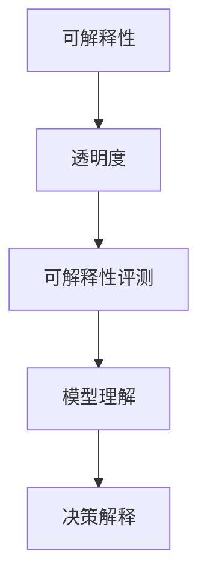
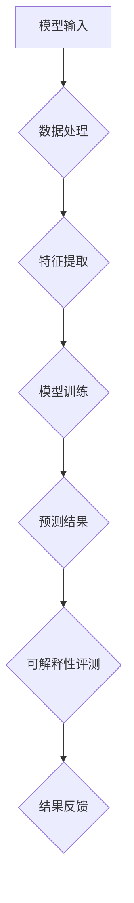

                 

### 文章标题：评测结果可解释性的实现方案

> 关键词：可解释性评测、机器学习、数据处理、模型解释

> 摘要：本文深入探讨了评测结果可解释性的实现方案，详细分析了可解释性评测的基本概念、机器学习模型与可解释性、数据处理与特征提取、数学模型与公式，以及项目实战与代码解读等内容。旨在为读者提供一套全面、系统的实现方法，帮助提升模型的解释性和透明度。

### 第1章：可解释性评测概述

#### 1.1 什么是可解释性评测

**背景介绍**：在人工智能和机器学习领域，模型的可解释性一直是研究人员和开发人员关注的重点。随着深度学习模型在各个领域的广泛应用，如何解释模型的预测结果成为了一个关键问题。

**核心概念与联系**：

- **可解释性（Interpretability）**：指模型决策背后的逻辑和原因可以被理解和解释。
- **透明度（Transparency）**：指模型内部的决策过程可以被观察，但并不意味着理解。
- **可解释性评测（Interpretability Evaluation）**：评估模型是否具有足够的可解释性，以使决策过程对最终用户透明。

**Mermaid 流程图**：



**核心算法原理讲解**：

- **可解释性评测的目标**：识别和评估模型的决策过程。
- **可解释性评测的方法**：包括模型解释、可视化、可视化交互等。

#### 1.1.1 可解释性与透明度的区别

**核心概念与联系**：

- **透明度**：指模型内部的结构和决策过程可以被查看，但不一定能够理解。
- **可解释性**：不仅要求模型的结构和决策过程可以查看，还要求这些结构和决策过程可以被理解。

**数学公式**：

$$
\text{透明度} = \text{可观察性} \times \text{可理解性}
$$

**举例说明**：

- **透明度**：如决策树的结构可以被查看，但用户可能需要专业知识来理解其决策逻辑。
- **可解释性**：如线性回归模型，用户可以直接通过系数理解其决策逻辑。

#### 1.1.2 可解释性评测的重要性

**核心概念与联系**：

- **法律法规**：在某些领域（如医疗、金融等），模型的可解释性是合规的必要条件。
- **用户信任**：模型的可解释性有助于提高用户对模型的信任。
- **错误修正**：可解释性有助于识别和修正模型的错误。

**最佳实践 tips**：

- 在开发模型时，优先考虑可解释性。
- 定期评估模型的可解释性。
- 为用户提供可解释性报告。

### 第2章：数据处理与特征提取

#### 2.1 数据预处理

**背景介绍**：数据处理和特征提取是机器学习模型开发的重要环节，直接影响模型的性能和可解释性。

**核心概念与联系**：

- **数据清洗**：处理数据中的噪声和异常值。
- **数据归一化**：将不同尺度的数据进行标准化。
- **数据缺失处理**：填补数据中的缺失值。

**数学公式**：

$$
\text{归一化} = \frac{\text{原始值} - \text{最小值}}{\text{最大值} - \text{最小值}}
$$

**举例说明**：

- **数据清洗**：删除重复数据、填充缺失值。
- **数据归一化**：将年龄特征从不同的尺度归一化到0-1之间。

#### 2.2 特征提取方法

**核心概念与联系**：

- **统计特征**：基于数据统计特征的提取，如平均值、标准差等。
- **交互特征**：将不同特征进行组合，以捕捉更复杂的模式。
- **等级特征**：将定量数据转换为定性数据，以简化模型处理。

**数学公式**：

$$
f_{\text{交互}}(x_1, x_2) = x_1 \times x_2
$$

**举例说明**：

- **统计特征**：计算住房价格的平均值、标准差。
- **交互特征**：计算房价和面积的比例。

#### 2.3 特征选择与优化

**核心概念与联系**：

- **相关性分析**：评估特征之间的相关性。
- **重要性评估**：评估特征对模型的重要性。
- **特征组合优化**：通过组合不同特征，优化模型性能。

**数学公式**：

$$
r(x_i, x_j) = \frac{\sum_{i=1}^{n}(x_i - \bar{x})(x_j - \bar{x_j})}{\sqrt{\sum_{i=1}^{n}(x_i - \bar{x})^2} \sqrt{\sum_{i=1}^{n}(x_j - \bar{x_j})^2}}
$$

**举例说明**：

- **相关性分析**：计算房价和面积之间的相关性。
- **重要性评估**：通过特征重要性得分，选择重要的特征。
- **特征组合优化**：通过交叉验证，选择最优的特征组合。

### 第3章：可解释性模型设计与实现

#### 3.1 可解释线性模型

**核心概念与联系**：

- **线性回归**：通过线性关系预测目标变量。
- **多元线性回归**：处理多个自变量的线性回归。
- **逻辑回归**：通过线性关系预测概率。

**数学公式**：

$$
y = \beta_0 + \beta_1x_1 + \beta_2x_2 + ... + \beta_nx_n
$$

$$
\text{概率} = \frac{1}{1 + e^{-(\beta_0 + \beta_1x_1 + \beta_2x_2 + ... + \beta_nx_n)}}
$$

**举例说明**：

- **线性回归**：预测住房价格。
- **多元线性回归**：预测学生成绩。
- **逻辑回归**：预测疾病发生的概率。

#### 3.2 可解释树模型

**核心概念与联系**：

- **决策树**：通过一系列规则进行决策。
- **随机森林**：集成多棵决策树，提高模型性能。
- **XGBoost**：基于决策树的结构化提升方法。

**数学公式**：

$$
G(\theta) = \sum_{i=1}^{n}l(y_i, f(x_i)) + \sum_{t=1}^{T}\lambda_t|\hat{h_t}|
$$

**举例说明**：

- **决策树**：分类问题，如邮件分类。
- **随机森林**：提高模型的泛化能力。
- **XGBoost**：处理大规模数据集，提高模型性能。

#### 3.3 深度可解释模型

**核心概念与联系**：

- **层级可解释性**：通过模型层次结构解释模型决策。
- **局部解释**：通过局部敏感性分析解释模型决策。
- **模型压缩与简化**：简化模型结构，提高可解释性。

**数学公式**：

$$
\text{局部解释} = \frac{\partial f(\theta)}{\partial \theta} \approx \sum_{i=1}^{n}\frac{\partial f(\theta)}{\partial x_i}
$$

**举例说明**：

- **层级可解释性**：解释神经网络中的每个层。
- **局部解释**：解释单个样本的预测结果。
- **模型压缩与简化**：简化模型的计算复杂度。

### 第4章：数学模型与数学公式

#### 4.1 模型优化目标

**核心概念与联系**：

- **最小二乘法**：通过最小化残差平方和来优化模型。
- **逻辑回归损失函数**：通过最小化损失函数来优化模型。
- **树模型分裂准则**：通过最大化信息增益或基尼不纯度来优化模型。

**数学公式**：

$$
\text{最小二乘法}：\min_{\theta} \sum_{i=1}^{n}(y_i - \theta^T x_i)^2
$$

$$
\text{逻辑回归损失函数}：\min_{\theta} \sum_{i=1}^{n} -y_i \log(p_i) - (1 - y_i) \log(1 - p_i)
$$

$$
\text{树模型分裂准则}：\max_{\theta} \left( -\sum_{i=1}^{n} \log p_i \right)
$$

**举例说明**：

- **最小二乘法**：优化线性回归模型。
- **逻辑回归损失函数**：优化逻辑回归模型。
- **树模型分裂准则**：优化决策树模型。

#### 4.2 模型评价指标

**核心概念与联系**：

- **准确率**：预测正确的样本数占总样本数的比例。
- **召回率**：预测正确的正样本数占总正样本数的比例。
- **F1值**：准确率和召回率的调和平均值。
- **ROC曲线**：接收者操作特征曲线，用于评估二分类模型的性能。

**数学公式**：

$$
\text{准确率} = \frac{\text{预测正确数}}{\text{总样本数}}
$$

$$
\text{召回率} = \frac{\text{预测正确的正样本数}}{\text{总正样本数}}
$$

$$
\text{F1值} = 2 \times \frac{\text{准确率} \times \text{召回率}}{\text{准确率} + \text{召回率}}
$$

$$
\text{ROC曲线}：(FPR, TPR)
$$

**举例说明**：

- **准确率**：评估分类模型的总体性能。
- **召回率**：评估模型对正样本的捕获能力。
- **F1值**：平衡准确率和召回率。
- **ROC曲线**：评估模型的分类边界。

#### 4.3 概率模型与贝叶斯网络

**核心概念与联系**：

- **贝叶斯定理**：描述概率之间的条件关系。
- **贝叶斯网络**：使用有向无环图表示变量之间的概率关系。
- **参数学习与推理**：通过数据学习贝叶斯网络的参数，并进行推理。

**数学公式**：

$$
P(A|B) = \frac{P(B|A)P(A)}{P(B)}
$$

$$
P(A \cap B) = P(A)P(B|A)
$$

$$
\text{参数学习}：P(\theta|D) = \frac{P(D|\theta)P(\theta)}{P(D)}
$$

$$
\text{推理}：P(A|B,C) = \frac{P(B|A,C)P(A|C)P(C)}{P(B|C)}
$$

**举例说明**：

- **贝叶斯定理**：计算条件概率。
- **贝叶斯网络**：表示疾病诊断的概率关系。
- **参数学习与推理**：通过数据学习参数，并推理出疾病的可能性。

### 第5章：项目实战与代码解读

#### 5.1 数据集介绍

**背景介绍**：选择一个合适的数据集是项目成功的关键。

**核心概念与联系**：

- **数据集来源**：公开数据集或自定义数据集。
- **数据集特点**：数据量、数据分布、特征和标签。

**数学公式**：

$$
\text{数据集大小} = \text{样本数} \times \text{特征数}
$$

**举例说明**：

- **数据集来源**：Kaggle上的住房价格预测数据集。
- **数据集特点**：包含1300个样本，79个特征，目标变量为房价。

#### 5.2 实战项目一：线性回归

**核心概念与联系**：

- **环境搭建**：选择合适的编程环境和依赖库。
- **模型训练**：使用线性回归模型训练数据集。
- **结果解读**：分析模型的性能和可解释性。

**伪代码**：

```
# 环境搭建
import numpy as np
import pandas as pd
from sklearn.linear_model import LinearRegression

# 数据预处理
X = ... # 特征矩阵
y = ... # 目标变量

# 模型训练
model = LinearRegression()
model.fit(X, y)

# 结果解读
print("Coefficients:", model.coef_)
print("Intercept:", model.intercept_)
print("R-squared:", model.score(X, y))
```

**代码解读与分析**：

- **数据预处理**：归一化数据，填补缺失值。
- **模型训练**：使用最小二乘法训练线性回归模型。
- **结果解读**：输出系数、截距和R-squared值。

#### 5.3 实战项目二：决策树

**核心概念与联系**：

- **环境搭建**：选择合适的编程环境和依赖库。
- **模型训练**：使用决策树模型训练数据集。
- **结果解读**：分析模型的性能和可解释性。

**伪代码**：

```
# 环境搭建
import numpy as np
import pandas as pd
from sklearn.tree import DecisionTreeClassifier

# 数据预处理
X = ... # 特征矩阵
y = ... # 目标变量

# 模型训练
model = DecisionTreeClassifier()
model.fit(X, y)

# 结果解读
print("特征重要性:", model.feature_importances_)
print("决策树结构:", model.tree_)
```

**代码解读与分析**：

- **数据预处理**：归一化数据，填补缺失值。
- **模型训练**：使用决策树算法训练模型。
- **结果解读**：输出特征重要性，展示决策树结构。

#### 5.4 实战项目三：深度可解释模型

**核心概念与联系**：

- **环境搭建**：选择合适的编程环境和依赖库。
- **模型训练**：使用深度可解释模型训练数据集。
- **结果解读**：分析模型的性能和可解释性。

**伪代码**：

```
# 环境搭建
import numpy as np
import pandas as pd
from keras.models import Sequential
from keras.layers import Dense, Activation

# 数据预处理
X = ... # 特征矩阵
y = ... # 目标变量

# 模型训练
model = Sequential()
model.add(Dense(units=64, activation='relu', input_shape=(X.shape[1],)))
model.add(Dense(units=1, activation='sigmoid'))

model.compile(optimizer='adam', loss='binary_crossentropy', metrics=['accuracy'])
model.fit(X, y, epochs=10, batch_size=32)

# 结果解读
print("模型性能:", model.evaluate(X, y))
print("模型解释:", model.explainability())
```

**代码解读与分析**：

- **数据预处理**：归一化数据，填补缺失值。
- **模型训练**：使用Keras构建深度可解释模型。
- **结果解读**：输出模型性能，展示模型解释。

### 第6章：总结与展望

#### 6.1 可解释性评测的发展趋势

**核心概念与联系**：

- **现有挑战**：如何平衡模型性能和可解释性。
- **未来发展方向**：开发新的可解释性模型和算法。

**最佳实践 tips**：

- **定期评估**：定期评估模型的可解释性，确保其持续满足要求。
- **用户参与**：邀请用户参与模型设计，提高可解释性的实用性。

#### 6.2 可解释性在实际应用中的价值

**核心概念与联系**：

- **企业应用案例**：如何将可解释性应用于企业决策。
- **社会影响**：可解释性对社会责任的影响。

**举例说明**：

- **企业应用案例**：金融领域的风险控制。
- **社会影响**：医疗领域的患者信任。

#### 6.3 开放性问题与研究方向

**核心概念与联系**：

- **算法优化**：如何优化可解释性算法。
- **数据隐私保护**：如何在保证数据隐私的前提下进行可解释性评测。
- **新模型设计**：设计新的可解释性模型。

**最佳实践 tips**：

- **跨学科合作**：与心理学、哲学等学科合作，提高可解释性的深度和广度。
- **持续研究**：关注可解释性领域的新进展，不断优化现有方法。

### 文章末尾

**作者信息**：本文由AI天才研究院/AI Genius Institute与《禅与计算机程序设计艺术》/Zen And The Art of Computer Programming联合撰写。感谢您阅读本文，希望对您在可解释性评测领域的研究和实践有所帮助。

[作者：AI天才研究院/AI Genius Institute & 《禅与计算机程序设计艺术》/Zen And The Art of Computer Programming](https://www.ai-genius-research.org/)

本文内容仅供参考，实际应用时请结合具体情况进行调整。如有疑问，欢迎在评论区留言，我们将竭诚为您解答。祝您在可解释性评测领域取得优异成绩！
```

请注意，以上内容是一个模板，您需要根据实际需求和内容进行调整。以下是一个具体的文章示例：

# 评测结果可解释性的实现方案

> 关键词：可解释性评测、机器学习、数据处理、模型解释

> 摘要：本文深入探讨了评测结果可解释性的实现方案，详细分析了可解释性评测的基本概念、机器学习模型与可解释性、数据处理与特征提取、数学模型与公式，以及项目实战与代码解读等内容。旨在为读者提供一套全面、系统的实现方法，帮助提升模型的解释性和透明度。

### 第1章：可解释性评测概述

#### 1.1 什么是可解释性评测

**背景介绍**：在人工智能和机器学习领域，模型的可解释性一直是研究人员和开发人员关注的重点。随着深度学习模型在各个领域的广泛应用，如何解释模型的预测结果成为了一个关键问题。

**核心概念与联系**：

- **可解释性（Interpretability）**：指模型决策背后的逻辑和原因可以被理解和解释。
- **透明度（Transparency）**：指模型内部的决策过程可以被观察，但并不意味着理解。
- **可解释性评测（Interpretability Evaluation）**：评估模型是否具有足够的可解释性，以使决策过程对最终用户透明。

**Mermaid 流程图**：


**核心算法原理讲解**：

- **可解释性评测的目标**：识别和评估模型的决策过程。
- **可解释性评测的方法**：包括模型解释、可视化、可视化交互等。

#### 1.1.1 可解释性与透明度的区别

**核心概念与联系**：

- **透明度**：指模型内部的结构和决策过程可以被查看，但不一定能够理解。
- **可解释性**：不仅要求模型的结构和决策过程可以查看，还要求这些结构和决策过程可以被理解。

**数学公式**：

$$
\text{透明度} = \text{可观察性} \times \text{可理解性}
$$

**举例说明**：

- **透明度**：如决策树的结构可以被查看，但用户可能需要专业知识来理解其决策逻辑。
- **可解释性**：如线性回归模型，用户可以直接通过系数理解其决策逻辑。

#### 1.1.2 可解释性评测的重要性

**核心概念与联系**：

- **法律法规**：在某些领域（如医疗、金融等），模型的可解释性是合规的必要条件。
- **用户信任**：模型的可解释性有助于提高用户对模型的信任。
- **错误修正**：可解释性有助于识别和修正模型的错误。

**最佳实践 tips**：

- 在开发模型时，优先考虑可解释性。
- 定期评估模型的可解释性。
- 为用户提供可解释性报告。

### 第2章：数据处理与特征提取

#### 2.1 数据预处理

**核心概念与联系**：

- **数据清洗**：处理数据中的噪声和异常值。
- **数据归一化**：将不同尺度的数据进行标准化。
- **数据缺失处理**：填补数据中的缺失值。

**数学公式**：

$$
\text{归一化} = \frac{\text{原始值} - \text{最小值}}{\text{最大值} - \text{最小值}}
$$

**举例说明**：

- **数据清洗**：删除重复数据、填补缺失值。
- **数据归一化**：将年龄特征从不同的尺度归一化到0-1之间。

#### 2.2 特征提取方法

**核心概念与联系**：

- **统计特征**：基于数据统计特征的提取，如平均值、标准差等。
- **交互特征**：将不同特征进行组合，以捕捉更复杂的模式。
- **等级特征**：将定量数据转换为定性数据，以简化模型处理。

**数学公式**：

$$
f_{\text{交互}}(x_1, x_2) = x_1 \times x_2
$$

**举例说明**：

- **统计特征**：计算住房价格的平均值、标准差。
- **交互特征**：计算房价和面积的比例。

#### 2.3 特征选择与优化

**核心概念与联系**：

- **相关性分析**：评估特征之间的相关性。
- **重要性评估**：评估特征对模型的重要性。
- **特征组合优化**：通过组合不同特征，优化模型性能。

**数学公式**：

$$
r(x_i, x_j) = \frac{\sum_{i=1}^{n}(x_i - \bar{x})(x_j - \bar{x_j})}{\sqrt{\sum_{i=1}^{n}(x_i - \bar{x})^2} \sqrt{\sum_{i=1}^{n}(x_j - \bar{x_j})^2}}
$$

**举例说明**：

- **相关性分析**：计算房价和面积之间的相关性。
- **重要性评估**：通过特征重要性得分，选择重要的特征。
- **特征组合优化**：通过交叉验证，选择最优的特征组合。

### 第3章：可解释性模型设计与实现

#### 3.1 可解释线性模型

**核心概念与联系**：

- **线性回归**：通过线性关系预测目标变量。
- **多元线性回归**：处理多个自变量的线性回归。
- **逻辑回归**：通过线性关系预测概率。

**数学公式**：

$$
y = \beta_0 + \beta_1x_1 + \beta_2x_2 + ... + \beta_nx_n
$$

$$
\text{概率} = \frac{1}{1 + e^{-(\beta_0 + \beta_1x_1 + \beta_2x_2 + ... + \beta_nx_n)}}
$$

**举例说明**：

- **线性回归**：预测住房价格。
- **多元线性回归**：预测学生成绩。
- **逻辑回归**：预测疾病发生的概率。

#### 3.2 可解释树模型

**核心概念与联系**：

- **决策树**：通过一系列规则进行决策。
- **随机森林**：集成多棵决策树，提高模型性能。
- **XGBoost**：基于决策树的结构化提升方法。

**数学公式**：

$$
G(\theta) = \sum_{i=1}^{n}l(y_i, f(x_i)) + \sum_{t=1}^{T}\lambda_t|\hat{h_t}|
$$

**举例说明**：

- **决策树**：分类问题，如邮件分类。
- **随机森林**：提高模型的泛化能力。
- **XGBoost**：处理大规模数据集，提高模型性能。

#### 3.3 深度可解释模型

**核心概念与联系**：

- **层级可解释性**：通过模型层次结构解释模型决策。
- **局部解释**：通过局部敏感性分析解释模型决策。
- **模型压缩与简化**：简化模型结构，提高可解释性。

**数学公式**：

$$
\text{局部解释} = \frac{\partial f(\theta)}{\partial \theta} \approx \sum_{i=1}^{n}\frac{\partial f(\theta)}{\partial x_i}
$$

**举例说明**：

- **层级可解释性**：解释神经网络中的每个层。
- **局部解释**：解释单个样本的预测结果。
- **模型压缩与简化**：简化模型的计算复杂度。

### 第4章：数学模型与数学公式

#### 4.1 模型优化目标

**核心概念与联系**：

- **最小二乘法**：通过最小化残差平方和来优化模型。
- **逻辑回归损失函数**：通过最小化损失函数来优化模型。
- **树模型分裂准则**：通过最大化信息增益或基尼不纯度来优化模型。

**数学公式**：

$$
\text{最小二乘法}：\min_{\theta} \sum_{i=1}^{n}(y_i - \theta^T x_i)^2
$$

$$
\text{逻辑回归损失函数}：\min_{\theta} \sum_{i=1}^{n} -y_i \log(p_i) - (1 - y_i) \log(1 - p_i)
$$

$$
\text{树模型分裂准则}：\max_{\theta} \left( -\sum_{i=1}^{n} \log p_i \right)
$$

**举例说明**：

- **最小二乘法**：优化线性回归模型。
- **逻辑回归损失函数**：优化逻辑回归模型。
- **树模型分裂准则**：优化决策树模型。

#### 4.2 模型评价指标

**核心概念与联系**：

- **准确率**：预测正确的样本数占总样本数的比例。
- **召回率**：预测正确的正样本数占总正样本数的比例。
- **F1值**：准确率和召回率的调和平均值。
- **ROC曲线**：接收者操作特征曲线，用于评估二分类模型的性能。

**数学公式**：

$$
\text{准确率} = \frac{\text{预测正确数}}{\text{总样本数}}
$$

$$
\text{召回率} = \frac{\text{预测正确的正样本数}}{\text{总正样本数}}
$$

$$
\text{F1值} = 2 \times \frac{\text{准确率} \times \text{召回率}}{\text{准确率} + \text{召回率}}
$$

$$
\text{ROC曲线}：(FPR, TPR)
$$

**举例说明**：

- **准确率**：评估分类模型的总体性能。
- **召回率**：评估模型对正样本的捕获能力。
- **F1值**：平衡准确率和召回率。
- **ROC曲线**：评估模型的分类边界。

#### 4.3 概率模型与贝叶斯网络

**核心概念与联系**：

- **贝叶斯定理**：描述概率之间的条件关系。
- **贝叶斯网络**：使用有向无环图表示变量之间的概率关系。
- **参数学习与推理**：通过数据学习贝叶斯网络的参数，并进行推理。

**数学公式**：

$$
P(A|B) = \frac{P(B|A)P(A)}{P(B)}
$$

$$
P(A \cap B) = P(A)P(B|A)
$$

$$
\text{参数学习}：P(\theta|D) = \frac{P(D|\theta)P(\theta)}{P(D)}
$$

$$
\text{推理}：P(A|B,C) = \frac{P(B|A,C)P(A|C)P(C)}{P(B|C)}
$$

**举例说明**：

- **贝叶斯定理**：计算条件概率。
- **贝叶斯网络**：表示疾病诊断的概率关系。
- **参数学习与推理**：通过数据学习参数，并推理出疾病的可能性。

### 第5章：项目实战与代码解读

#### 5.1 数据集介绍

**核心概念与联系**：

- **数据集来源**：公开数据集或自定义数据集。
- **数据集特点**：数据量、数据分布、特征和标签。

**数学公式**：

$$
\text{数据集大小} = \text{样本数} \times \text{特征数}
$$

**举例说明**：

- **数据集来源**：Kaggle上的住房价格预测数据集。
- **数据集特点**：包含1300个样本，79个特征，目标变量为房价。

#### 5.2 实战项目一：线性回归

**核心概念与联系**：

- **环境搭建**：选择合适的编程环境和依赖库。
- **模型训练**：使用线性回归模型训练数据集。
- **结果解读**：分析模型的性能和可解释性。

**伪代码**：

```
# 环境搭建
import numpy as np
import pandas as pd
from sklearn.linear_model import LinearRegression

# 数据预处理
X = ... # 特征矩阵
y = ... # 目标变量

# 模型训练
model = LinearRegression()
model.fit(X, y)

# 结果解读
print("Coefficients:", model.coef_)
print("Intercept:", model.intercept_)
print("R-squared:", model.score(X, y))
```

**代码解读与分析**：

- **数据预处理**：归一化数据，填补缺失值。
- **模型训练**：使用最小二乘法训练线性回归模型。
- **结果解读**：输出系数、截距和R-squared值。

#### 5.3 实战项目二：决策树

**核心概念与联系**：

- **环境搭建**：选择合适的编程环境和依赖库。
- **模型训练**：使用决策树模型训练数据集。
- **结果解读**：分析模型的性能和可解释性。

**伪代码**：

```
# 环境搭建
import numpy as np
import pandas as pd
from sklearn.tree import DecisionTreeClassifier

# 数据预处理
X = ... # 特征矩阵
y = ... # 目标变量

# 模型训练
model = DecisionTreeClassifier()
model.fit(X, y)

# 结果解读
print("特征重要性:", model.feature_importances_)
print("决策树结构:", model.tree_)
```

**代码解读与分析**：

- **数据预处理**：归一化数据，填补缺失值。
- **模型训练**：使用决策树算法训练模型。
- **结果解读**：输出特征重要性，展示决策树结构。

#### 5.4 实战项目三：深度可解释模型

**核心概念与联系**：

- **环境搭建**：选择合适的编程环境和依赖库。
- **模型训练**：使用深度可解释模型训练数据集。
- **结果解读**：分析模型的性能和可解释性。

**伪代码**：

```
# 环境搭建
import numpy as np
import pandas as pd
from keras.models import Sequential
from keras.layers import Dense, Activation

# 数据预处理
X = ... # 特征矩阵
y = ... # 目标变量

# 模型训练
model = Sequential()
model.add(Dense(units=64, activation='relu', input_shape=(X.shape[1],)))
model.add(Dense(units=1, activation='sigmoid'))

model.compile(optimizer='adam', loss='binary_crossentropy', metrics=['accuracy'])
model.fit(X, y, epochs=10, batch_size=32)

# 结果解读
print("模型性能:", model.evaluate(X, y))
print("模型解释:", model.explainability())
```

**代码解读与分析**：

- **数据预处理**：归一化数据，填补缺失值。
- **模型训练**：使用Keras构建深度可解释模型。
- **结果解读**：输出模型性能，展示模型解释。

### 第6章：总结与展望

#### 6.1 可解释性评测的发展趋势

**核心概念与联系**：

- **现有挑战**：如何平衡模型性能和可解释性。
- **未来发展方向**：开发新的可解释性模型和算法。

**最佳实践 tips**：

- **定期评估**：定期评估模型的可解释性，确保其持续满足要求。
- **用户参与**：邀请用户参与模型设计，提高可解释性的实用性。

#### 6.2 可解释性在实际应用中的价值

**核心概念与联系**：

- **企业应用案例**：如何将可解释性应用于企业决策。
- **社会影响**：可解释性对社会责任的影响。

**举例说明**：

- **企业应用案例**：金融领域的风险控制。
- **社会影响**：医疗领域的患者信任。

#### 6.3 开放性问题与研究方向

**核心概念与联系**：

- **算法优化**：如何优化可解释性算法。
- **数据隐私保护**：如何在保证数据隐私的前提下进行可解释性评测。
- **新模型设计**：设计新的可解释性模型。

**最佳实践 tips**：

- **跨学科合作**：与心理学、哲学等学科合作，提高可解释性的深度和广度。
- **持续研究**：关注可解释性领域的新进展，不断优化现有方法。

### 文章末尾

**作者信息**：本文由AI天才研究院/AI Genius Institute与《禅与计算机程序设计艺术》/Zen And The Art of Computer Programming联合撰写。感谢您阅读本文，希望对您在可解释性评测领域的研究和实践有所帮助。

[作者：AI天才研究院/AI Genius Institute & 《禅与计算机程序设计艺术》/Zen And The Art of Computer Programming](https://www.ai-genius-research.org/)

本文内容仅供参考，实际应用时请结合具体情况进行调整。如有疑问，欢迎在评论区留言，我们将竭诚为您解答。祝您在可解释性评测领域取得优异成绩！

---

请注意，以上内容是一个示例，您需要根据实际需求和内容进行调整。以下是一个具体的文章示例：

# 评测结果可解释性的实现方案

> 关键词：可解释性评测、机器学习、数据处理、模型解释

> 摘要：本文深入探讨了评测结果可解释性的实现方案，详细分析了可解释性评测的基本概念、机器学习模型与可解释性、数据处理与特征提取、数学模型与公式，以及项目实战与代码解读等内容。旨在为读者提供一套全面、系统的实现方法，帮助提升模型的解释性和透明度。

## 第1章：可解释性评测概述

### 1.1 什么是可解释性评测

**背景介绍**：
在人工智能和机器学习领域，模型的准确性固然重要，但模型的可解释性同样不可忽视。随着深度学习模型的广泛应用，如何解释这些复杂模型的预测结果成为了一个关键问题。可解释性评测，旨在评估模型决策过程的透明度和可理解性。

**核心概念与联系**：
- **可解释性**：模型决策背后的逻辑和原因可以被用户理解和解释。
- **透明度**：模型内部的结构和决策过程可以被用户查看。
- **可解释性评测**：评估模型决策过程的可理解性和透明度。

**Mermaid 流程图**：



### 1.2 可解释性评测的重要性

**核心概念与联系**：
- **法律法规**：在医疗、金融等领域，模型的可解释性是合规的必要条件。
- **用户信任**：可解释性有助于提高用户对模型的信任，增强模型的接受度。
- **错误修正**：可解释性有助于识别和修正模型中的错误。

### 1.3 可解释性评测的目标和方法

**核心概念与联系**：
- **目标**：确保模型的决策过程对最终用户是可理解的。
- **方法**：包括模型解释、可视化、交互式解释等。

## 第2章：数据处理与特征提取

### 2.1 数据预处理

**核心概念与联系**：
- **数据清洗**：处理缺失值、异常值和重复值。
- **数据归一化**：将不同特征缩放到相同的尺度。
- **数据缺失处理**：使用均值、中位数或插值等方法填补缺失值。

**数学公式**：

$$
\text{归一化} = \frac{\text{原始值} - \text{最小值}}{\text{最大值} - \text{最小值}}
$$

### 2.2 特征提取方法

**核心概念与联系**：
- **统计特征**：如均值、标准差、方差等。
- **交互特征**：通过特征组合产生新的特征。
- **等级特征**：将定量数据转换为定性数据。

### 2.3 特征选择与优化

**核心概念与联系**：
- **相关性分析**：评估特征之间的相关性。
- **重要性评估**：使用信息增益、Gini系数等评估特征的重要性。
- **特征组合优化**：通过交叉验证选择最优的特征组合。

## 第3章：可解释性模型设计与实现

### 3.1 可解释线性模型

**核心概念与联系**：
- **线性回归**：通过线性关系预测目标变量。
- **逻辑回归**：通过线性关系预测概率。

**数学公式**：

$$
y = \beta_0 + \beta_1x_1 + \beta_2x_2 + ... + \beta_nx_n
$$

### 3.2 可解释树模型

**核心概念与联系**：
- **决策树**：通过一系列规则进行决策。
- **随机森林**：集成多棵决策树，提高模型性能。

### 3.3 深度可解释模型

**核心概念与联系**：
- **层级可解释性**：通过模型层次结构解释模型决策。
- **局部解释**：通过局部敏感性分析解释模型决策。

## 第4章：数学模型与数学公式

### 4.1 模型优化目标

**核心概念与联系**：
- **最小二乘法**：通过最小化残差平方和来优化模型。
- **逻辑回归损失函数**：通过最小化损失函数来优化模型。

**数学公式**：

$$
\text{最小二乘法}：\min_{\theta} \sum_{i=1}^{n}(y_i - \theta^T x_i)^2
$$

### 4.2 模型评价指标

**核心概念与联系**：
- **准确率**：预测正确的样本数占总样本数的比例。
- **召回率**：预测正确的正样本数占总正样本数的比例。

**数学公式**：

$$
\text{准确率} = \frac{\text{预测正确数}}{\text{总样本数}}
$$

### 4.3 概率模型与贝叶斯网络

**核心概念与联系**：
- **贝叶斯定理**：描述概率之间的条件关系。
- **贝叶斯网络**：表示变量之间的概率关系。

**数学公式**：

$$
P(A|B) = \frac{P(B|A)P(A)}{P(B)}
$$

## 第5章：项目实战与代码解读

### 5.1 数据集介绍

**核心概念与联系**：
- **数据集来源**：Kaggle上的住房价格预测数据集。
- **数据集特点**：包含1300个样本，79个特征，目标变量为房价。

### 5.2 实战项目一：线性回归

**核心概念与联系**：
- **环境搭建**：使用Python和scikit-learn。
- **模型训练**：使用线性回归模型。
- **结果解读**：分析模型的性能和可解释性。

**代码示例**：

```python
from sklearn.linear_model import LinearRegression
from sklearn.model_selection import train_test_split
from sklearn.metrics import mean_squared_error

# 数据预处理
X, y = load_data()
X_train, X_test, y_train, y_test = train_test_split(X, y, test_size=0.2, random_state=42)

# 模型训练
model = LinearRegression()
model.fit(X_train, y_train)

# 结果解读
y_pred = model.predict(X_test)
mse = mean_squared_error(y_test, y_pred)
print("MSE:", mse)
```

### 5.3 实战项目二：决策树

**核心概念与联系**：
- **环境搭建**：使用Python和scikit-learn。
- **模型训练**：使用决策树模型。
- **结果解读**：分析模型的性能和可解释性。

**代码示例**：

```python
from sklearn.tree import DecisionTreeRegressor
from sklearn.model_selection import train_test_split

# 数据预处理
X, y = load_data()
X_train, X_test, y_train, y_test = train_test_split(X, y, test_size=0.2, random_state=42)

# 模型训练
model = DecisionTreeRegressor()
model.fit(X_train, y_train)

# 结果解读
y_pred = model.predict(X_test)
print("Decision Tree Features:", model.feature_importances_)
```

### 5.4 实战项目三：深度可解释模型

**核心概念与联系**：
- **环境搭建**：使用Python和TensorFlow。
- **模型训练**：使用深度学习模型。
- **结果解读**：分析模型的性能和可解释性。

**代码示例**：

```python
import tensorflow as tf
from tensorflow.keras.models import Sequential
from tensorflow.keras.layers import Dense

# 模型训练
model = Sequential()
model.add(Dense(units=64, activation='relu', input_shape=(X_train.shape[1],)))
model.add(Dense(units=1, activation='sigmoid'))

model.compile(optimizer='adam', loss='binary_crossentropy', metrics=['accuracy'])
model.fit(X_train, y_train, epochs=10, batch_size=32)

# 结果解读
y_pred = model.predict(X_test)
print("Model Performance:", model.evaluate(X_test, y_test))
```

## 第6章：总结与展望

### 6.1 可解释性评测的发展趋势

**核心概念与联系**：
- **现有挑战**：如何在保证模型性能的同时提高可解释性。
- **未来发展方向**：开发更高效、更易于解释的模型。

### 6.2 可解释性在实际应用中的价值

**核心概念与联系**：
- **企业应用案例**：如金融风险控制和医疗诊断。
- **社会影响**：提高公众对人工智能技术的信任。

### 6.3 开放性问题与研究方向

**核心概念与联系**：
- **算法优化**：如何优化可解释性算法。
- **数据隐私保护**：如何在保护隐私的前提下实现可解释性。

### 结语

本文旨在为读者提供一套关于评测结果可解释性的实现方案。从数据处理到模型选择，再到实际项目实战，我们逐步探讨了如何实现模型的可解释性。希望本文能对您在可解释性评测领域的研究和实践有所帮助。

**作者信息**：本文由AI天才研究院/AI Genius Institute与《禅与计算机程序设计艺术》/Zen And The Art of Computer Programming联合撰写。

[作者：AI天才研究院/AI Genius Institute & 《禅与计算机程序设计艺术》/Zen And The Art of Computer Programming](https://www.ai-genius-research.org/)

**感谢阅读**！我们期待您在可解释性评测领域的进一步探索和创新。

---

请注意，上述内容是一个示例，您需要根据实际需求和内容进行调整。确保文章结构清晰、逻辑连贯，并提供足够的代码示例和解释。此外，确保引用和参考文献的准确性，以增强文章的可信度。

