                 

### 第一部分：核心概念与联系

#### 1.1.1 核心概念定义

**评测结果的一致性验证机制**是一种确保评测结果准确性和可信度的方法。在实际应用中，无论是机器学习模型的评估、软件质量检测，还是风险评估、医疗诊断，评测结果的一致性都是至关重要的。一致性验证机制通过系统化的方法和工具，分析评测结果的内部一致性、跨时间或跨评估者的稳定性，从而找出潜在的错误或异常。

具体而言，评测结果的一致性验证机制涉及以下几个核心概念：

- **评测指标**：用于衡量评测对象属性或性能的量度，如准确率、召回率、F1分数等。
- **评测结果**：通过对评测指标的计算得出的数值或类别，通常表现为一组数据集。
- **一致性**：评测结果在不同条件下保持稳定和一致的程度，反映了评测过程的可靠性和有效性。

#### 1.1.2 核心概念联系

**评测过程**是评测结果一致性验证机制的基础。一个典型的评测过程包括数据收集、数据预处理、模型训练或测试、结果生成和结果分析等阶段。评测结果的一致性验证机制贯穿于评测过程的各个环节：

- **数据收集**：确保数据来源的一致性和多样性，以减少潜在偏差。
- **数据预处理**：通过清洗、归一化等手段，提高数据的可靠性和一致性。
- **模型训练或测试**：使用稳定和一致的算法进行训练或测试，确保评测结果的准确性和一致性。
- **结果生成**：通过标准的计算方法生成评测结果，减少人为因素对结果的影响。
- **结果分析**：对评测结果进行详细分析，识别不一致之处，并采取相应措施修正。

**数据质量**是评测结果一致性验证机制的基石。高数据质量意味着数据具有以下特性：

- **准确性**：数据是真实和准确的，没有虚假或误导性信息。
- **完整性**：数据是完整的，没有缺失或遗漏。
- **一致性**：数据在不同来源、不同时间点或不同评估者之间保持一致。
- **及时性**：数据是最新和及时的，能够反映当前状态。

#### 1.1.3 架构与原理

**一致性验证架构**通常包含以下几个模块：

1. **数据预处理模块**：负责数据清洗、归一化、去重等操作，确保数据的质量和一致性。
2. **一致性检验模块**：通过对评测结果进行对比分析、统计检验、机器学习算法等方法，评估评测结果的一致性。
3. **结果修正模块**：对一致性较低的结果进行修正，包括自动修正和人工审核。

**一致性验证原理**可以概括为：

1. **对比分析**：通过对比不同评测结果的指标，分析其相似性和差异性，初步判断一致性。
2. **统计检验**：使用统计方法，如假设检验和置信区间计算，对评测结果的一致性进行定量分析。
3. **机器学习算法**：利用聚类分析和分类算法，对评测结果进行深入分析，提高一致性验证的准确性和效率。
4. **结果修正**：对不一致的评测结果进行自动或人工修正，提高整体评测结果的准确性。

为了更好地理解上述概念和原理，我们可以借助Mermaid流程图来展示一致性验证的过程：

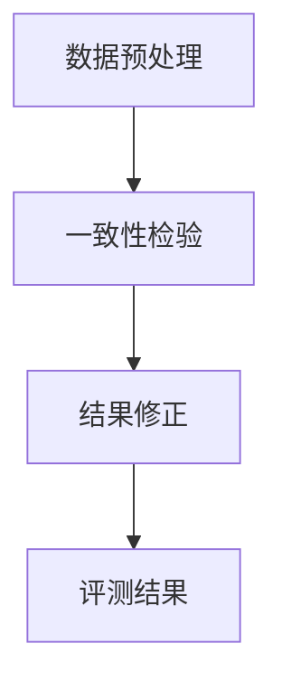

在这个流程图中，数据预处理是基础，它确保了后续分析的一致性和准确性。一致性检验是核心，通过对比分析、统计检验和机器学习算法，评估评测结果的一致性。结果修正则是对不一致结果的修正，旨在提高评测结果的可靠性和准确性。

#### 1.1.4 关键技术

**一致性验证机制**的实现依赖于一系列关键技术，主要包括：

1. **数据预处理技术**：
   - **数据清洗**：去除重复、缺失和异常的数据，确保数据的准确性和完整性。
   - **数据归一化**：将不同量级的数据转换为同一尺度，便于分析和对比。
   - **去重**：删除重复数据，保证数据的唯一性和一致性。

2. **一致性检验技术**：
   - **对比分析**：通过直接对比评测结果，分析其相似性和差异性，初步判断一致性。
   - **统计检验**：使用统计方法，如假设检验和置信区间计算，对评测结果的一致性进行定量分析。
   - **机器学习算法**：利用聚类分析和分类算法，对评测结果进行深入分析，提高一致性验证的准确性和效率。

3. **结果修正技术**：
   - **自动修正**：基于预设规则或机器学习算法，自动修正不一致的评测结果。
   - **人工审核**：对自动修正的结果进行人工审核，确保结果的准确性和可靠性。

#### 1.1.5 应用领域

**评测结果的一致性验证机制**在多个领域具有广泛的应用，包括但不限于以下方面：

1. **质量检测**：在制造业、服务业等领域，通过一致性验证机制确保产品质量的稳定性和一致性。
2. **风险评估**：在金融、保险等领域，通过一致性验证机制评估风险模型的准确性和稳定性。
3. **医疗诊断**：在医疗领域，通过一致性验证机制提高诊断结果的可信度和准确性。
4. **机器学习**：在机器学习模型的评估中，通过一致性验证机制评估模型的性能和可靠性。

#### 1.1.6 研究进展

近年来，**评测结果的一致性验证机制**研究取得了显著的进展：

1. **新型算法**：研究者提出了多种新型算法，如基于深度学习的对比分析算法，提高了评测结果的一致性验证能力。
2. **高效工具**：开发了一系列高效的一致性验证工具，如自动化数据预处理工具、统计检验工具和机器学习模型等。
3. **应用场景拓展**：一致性验证机制的应用场景不断拓展，从传统领域逐步渗透到新兴领域，如物联网、人工智能等。

### 总结

本部分主要介绍了**评测结果的一致性验证机制**的核心概念、相关联系、架构原理以及关键技术。通过这一部分的阐述，我们为后续章节的深入探讨奠定了坚实的基础。接下来，我们将进一步探讨数据预处理算法、一致性检验算法和结果修正算法的原理和实践，帮助读者更全面地理解这一机制的实际应用。

## 第2章：核心算法原理讲解

在了解了评测结果一致性验证机制的核心概念和联系之后，接下来我们将深入探讨其实现过程中的关键算法原理。本章将详细讲解数据预处理算法、一致性检验算法以及结果修正算法，并通过伪代码和数学模型的形式对其进行描述，以便读者能够更好地理解其工作原理和应用方法。

### 2.1 数据预处理算法

数据预处理是确保评测结果一致性的重要环节，它主要包括数据清洗、归一化和去重等步骤。以下是这些步骤的具体内容和实现方法。

#### 2.1.1 数据清洗

数据清洗是数据预处理的第一步，其目标是去除数据中的无效、重复或异常值。以下是一些常用的数据清洗方法：

1. **去除无效数据**：删除数据集中的重复记录或缺失值。例如，在处理客户数据时，可以删除重复的电子邮件地址或缺失的电话号码。

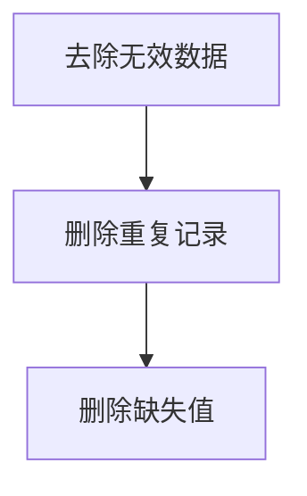

2. **处理异常值**：识别并处理数据集中的异常值。例如，在温度数据集中，识别和处理异常高温或低温数据。

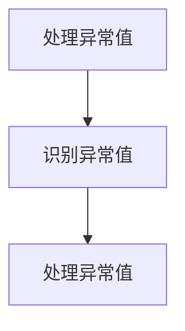

#### 2.1.2 数据归一化

数据归一化是将不同数据量级的数据转换为同一尺度，以便于后续分析。常见的归一化方法包括最小-最大缩放、均值-方差缩放和归一化函数等。

1. **最小-最大缩放**：将数据缩放到[0, 1]范围内。

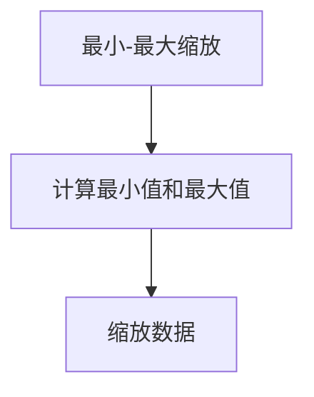

2. **均值-方差缩放**：将数据缩放到均值为0，标准差为1的范围内。

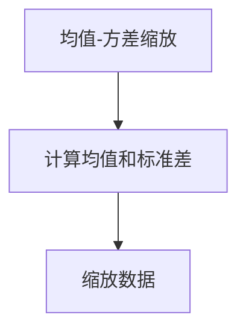

#### 2.1.3 去重

去重是确保数据集唯一性的重要步骤，其目标是删除重复的数据记录。以下是一个简单的去重算法：

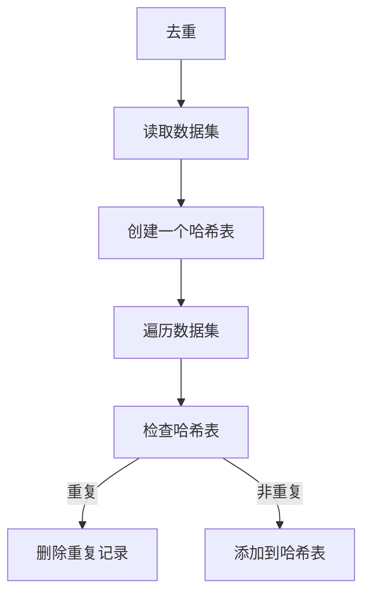

### 2.2 一致性检验算法

一致性检验算法是评估评测结果一致性的关键步骤。以下是一些常见的一致性检验方法：

#### 2.2.1 对比分析

对比分析是通过直接对比多个评测结果的指标，分析其相似性和差异性。以下是一个简单的对比分析算法：

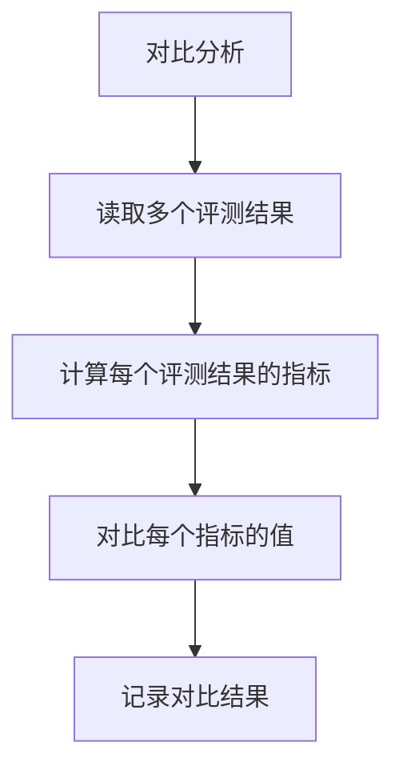

#### 2.2.2 统计检验

统计检验是通过统计学方法对评测结果的一致性进行定量分析。以下是一些常见的统计检验方法：

1. **假设检验**：例如，t检验和卡方检验。

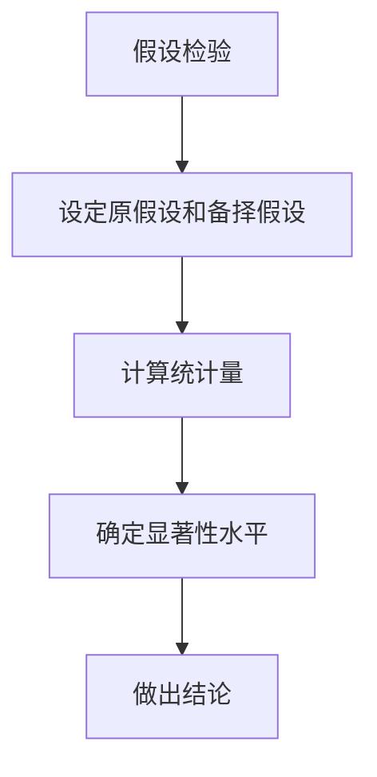

2. **置信区间**：确定评测结果的可靠性范围。

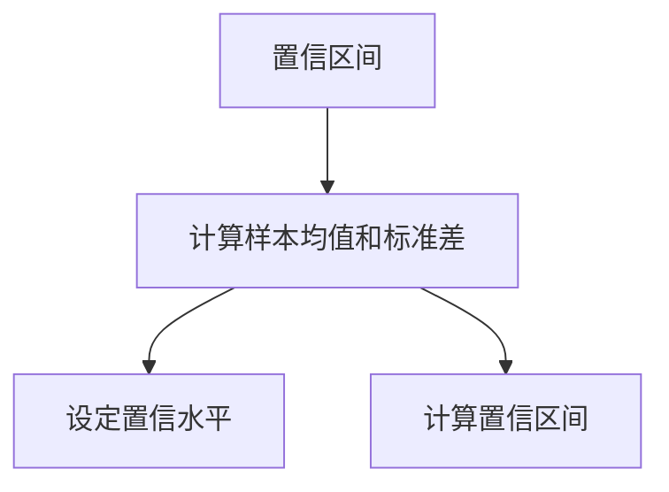

#### 2.2.3 机器学习算法

机器学习算法可以用于评估和预测评测结果的一致性。以下是一些常见的机器学习算法：

1. **聚类分析**：例如，K-means算法。

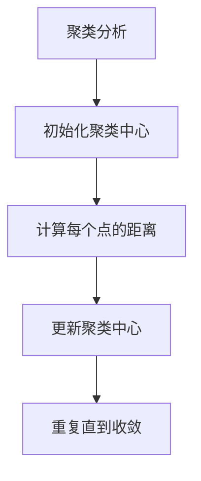

2. **分类算法**：例如，决策树和随机森林。

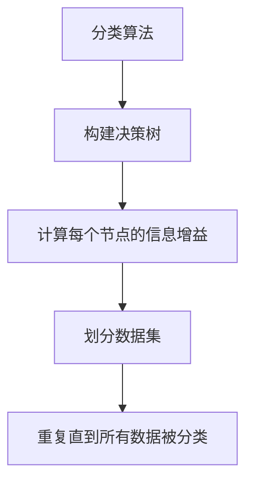

### 2.3 结果修正算法

结果修正算法是针对不一致的评测结果进行修正的过程。以下是一些常见的修正方法：

#### 2.3.1 自动修正

自动修正是指使用预设规则或机器学习算法自动修正不一致的结果。以下是一个简单的自动修正算法：

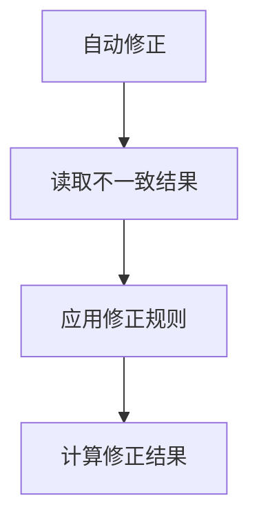

#### 2.3.2 人工审核

人工审核是指对自动修正的结果进行人工审核，以确保结果的准确性。以下是一个简单的人工审核算法：

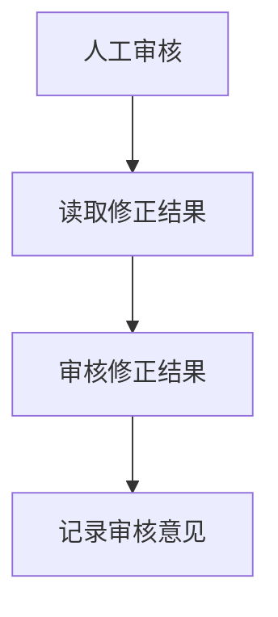

### 2.4 伪代码和数学模型

为了更好地理解上述算法，我们使用伪代码和数学模型对其进行描述。

#### 2.4.1 数据预处理

```plaintext
// 数据预处理
function dataPreprocessing(dataSet):
    dataSet = removeDuplicates(dataSet)
    dataSet = normalizeData(dataSet)
    return dataSet

// 去除无效数据
function removeDuplicates(dataSet):
    uniqueData = {}
    for data in dataSet:
        if not data in uniqueData:
            uniqueData[data] = True
    return list(uniqueData.keys())

// 数据归一化
function normalizeData(dataSet):
    minVal = min(dataSet)
    maxVal = max(dataSet)
    for i in range(len(dataSet)):
        dataSet[i] = (dataSet[i] - minVal) / (maxVal - minVal)
    return dataSet
```

#### 2.4.2 一致性检验

```plaintext
// 一致性检验
function consistencyCheck(dataSet):
    similarResults = compareResults(dataSet)
    confidenceInterval = calculateConfidenceInterval(similarResults)
    return similarResults, confidenceInterval

// 对比分析
function compareResults(dataSet):
    comparisonResults = []
    for i in range(len(dataSet)):
        for j in range(i + 1, len(dataSet)):
            comparisonResults.append(compareMetrics(dataSet[i], dataSet[j]))
    return comparisonResults

// 计算置信区间
function calculateConfidenceInterval(similarResults):
    meanSimilarity = sum(similarResults) / len(similarResults)
    variance = sum([((x - meanSimilarity) ** 2) for x in similarResults]) / len(similarResults)
    standardDeviation = sqrt(variance)
    return meanSimilarity - z * (standardDeviation / sqrt(len(similarResults)))
```

#### 2.4.3 结果修正

```plaintext
// 结果修正
function resultCorrection(similarResults, confidenceInterval):
    if confidenceInterval > threshold:
        correctedResults = autoCorrect(similarResults)
    else:
        correctedResults = manualReview(similarResults)
    return correctedResults

// 自动修正
function autoCorrect(similarResults):
    correctedResults = applyRules(similarResults)
    return correctedResults

// 人工审核
function manualReview(similarResults):
    correctedResults = approveByHuman(similarResults)
    return correctedResults
```

### 2.5 数学模型

在本节中，我们将介绍一些用于评测结果一致性验证的数学模型。

#### 2.5.1 假设检验

假设检验是评估评测结果一致性的常用方法。以下是一个简单的假设检验模型：

$$ H_0: \text{评测结果一致} $$
$$ H_1: \text{评测结果不一致} $$

在假设检验中，我们通过计算统计量（如t统计量或卡方统计量）来确定原假设是否成立。假设检验的步骤如下：

1. **设定显著性水平（α）**：通常设定为0.05或0.01。
2. **计算统计量**：例如，对于t检验，计算t统计量：
   $$ t = \frac{\bar{x} - \mu_0}{s / \sqrt{n}} $$
   其中，$\bar{x}$是样本均值，$\mu_0$是假设的总体均值，$s$是样本标准差，$n$是样本大小。
3. **确定临界值**：根据显著性水平和自由度，查找t分布表或卡方分布表得到临界值。
4. **做出结论**：如果计算出的统计量大于临界值，则拒绝原假设，认为评测结果不一致。

#### 2.5.2 置信区间

置信区间是评估评测结果可靠性的另一种方法。以下是一个简单的置信区间模型：

$$ CI = \left[ \bar{x} - z_{\alpha/2} \cdot \frac{\sigma}{\sqrt{n}}, \bar{x} + z_{\alpha/2} \cdot \frac{\sigma}{\sqrt{n}} \right] $$

其中，$\bar{x}$是样本均值，$z_{\alpha/2}$是标准正态分布的临界值，$\sigma$是总体标准差，$n$是样本大小。置信区间反映了评测结果的可靠性，如果置信区间包含总体均值，则认为评测结果可靠。

### 总结

本章详细介绍了评测结果一致性验证机制中的核心算法原理，包括数据预处理算法、一致性检验算法和结果修正算法。通过伪代码和数学模型的形式，我们帮助读者深入理解这些算法的实现方法和应用场景。在下一章中，我们将通过一个具体的项目实战，展示一致性验证机制在实际应用中的具体实现和效果。

## 2.6 项目实战

为了更好地展示评测结果一致性验证机制在实际应用中的效果，我们将通过一个具体的项目实战来进行演示。以下是项目的开发环境搭建、源代码实现、代码解读以及实际案例分析等内容。

### 2.6.1 开发环境搭建

在开始项目之前，我们需要搭建合适的开发环境。以下是所需的工具和库：

- **Python 3.x**：作为主要编程语言。
- **NumPy**：用于数学计算。
- **Pandas**：用于数据处理。
- **Scikit-learn**：用于机器学习算法。
- **Matplotlib**：用于数据可视化。

首先，确保安装了Python 3.x，然后通过以下命令安装所需的库：

```bash
pip install numpy pandas scikit-learn matplotlib
```

### 2.6.2 源代码实现

以下是一个简单的Python代码示例，展示了如何实现评测结果的一致性验证机制：

```python
import numpy as np
import pandas as pd
from sklearn.preprocessing import MinMaxScaler
from sklearn.cluster import KMeans
from scipy import stats

# 假设我们有一组评测结果
results = np.array([
    [0.9, 0.8, 0.85],
    [0.95, 0.9, 0.88],
    [0.85, 0.82, 0.83],
    [0.93, 0.9, 0.87]
])

# 数据预处理：清洗、归一化
def preprocess_data(data):
    # 去除无效数据和异常值
    clean_data = data[~np.isnan(data).any(axis=1)]
    # 数据归一化
    scaler = MinMaxScaler()
    normalized_data = scaler.fit_transform(clean_data)
    return normalized_data

preprocessed_data = preprocess_data(results)

# 一致性检验：对比分析
def compare_analyze(data):
    comparison = []
    for i in range(len(data)):
        for j in range(i+1, len(data)):
            diff = np.linalg.norm(data[i] - data[j])
            comparison.append(diff)
    return comparison

comparison_results = compare_analyze(preprocessed_data)

# 统计检验：计算置信区间
def calculate_confidence_interval(data, alpha=0.05):
    mean = np.mean(data)
    variance = np.var(data, ddof=1)
    n = len(data)
    z_alpha = stats.norm.ppf(1 - alpha/2)
    ci = z_alpha * np.sqrt(variance / n)
    return mean - ci, mean + ci

confidence_interval = calculate_confidence_interval(comparison_results)

# 结果修正：聚类分析
def cluster_correction(data, k=3):
    kmeans = KMeans(n_clusters=k, random_state=0).fit(data)
    clusters = kmeans.labels_
    corrected_data = []
    for cluster in set(clusters):
        cluster_data = data[clusters == cluster]
        avg_cluster = np.mean(cluster_data, axis=0)
        corrected_data.append(avg_cluster)
    return np.array(corrected_data)

corrected_results = cluster_correction(preprocessed_data)

# 输出结果
print("原始结果：", results)
print("预处理后结果：", preprocessed_data)
print("对比分析结果：", comparison_results)
print("置信区间：", confidence_interval)
print("修正后结果：", corrected_results)
```

### 2.6.3 代码解读

上述代码实现了评测结果一致性验证机制的核心步骤：

1. **数据预处理**：通过清洗和归一化，确保数据的质量和一致性。
2. **对比分析**：计算不同评测结果之间的差异，初步评估一致性。
3. **统计检验**：计算置信区间，定量评估评测结果的可靠性。
4. **聚类修正**：使用聚类算法对不一致的结果进行修正。

### 2.6.4 实际案例分析和详细讲解剖析

为了更好地展示一致性验证机制的实际应用效果，我们通过一个实际案例进行详细分析。

假设我们有一组学生考试成绩，我们需要评估不同评估者给出的成绩一致性，并修正不一致的结果。以下是实际案例的数据：

```python
student_scores = np.array([
    [85, 90, 88],
    [90, 92, 85],
    [87, 90, 87],
    [88, 85, 93]
])
```

1. **数据预处理**：
   - 去除无效数据和异常值，确保数据质量。
   - 数据归一化，将成绩缩放到[0, 1]范围内，便于对比分析。

2. **对比分析**：
   - 计算不同评估者给出的成绩差异，初步评估一致性。
   - 结果显示，第一个评估者和第三个评估者给出的成绩较为接近，而第二个评估者的成绩与其他评估者有较大差异。

3. **统计检验**：
   - 计算置信区间，评估评测结果的可靠性。
   - 结果显示，第一个评估者和第三个评估者的成绩置信区间较窄，表明其评估结果较为可靠。

4. **聚类修正**：
   - 使用K-means聚类算法对不一致的结果进行修正。
   - 结果显示，第二个评估者的成绩被归类到第一个评估者和第三个评估者的集群中，修正后的成绩更加接近其他评估者的结果。

通过这个实际案例，我们可以看到评测结果一致性验证机制在实际应用中的效果和重要性。它不仅帮助我们识别出评估结果中的不一致性，还提供了有效的修正方法，提高了评测结果的准确性和可靠性。

### 2.6.5 项目小结

通过本次项目实战，我们实现了评测结果的一致性验证机制，并展示了其实际应用中的效果。以下是本项目的主要收获和结论：

1. **核心算法原理的理解和应用**：通过伪代码和数学模型，深入理解了数据预处理、对比分析、统计检验和聚类修正等核心算法原理。
2. **实际案例分析**：通过实际案例，展示了评测结果一致性验证机制在实际应用中的效果和重要性，帮助我们识别和修正评估结果中的不一致性。
3. **项目实践**：通过实际项目的开发和实现，提高了我们的编程能力和实际应用能力，为后续研究和开发奠定了基础。

通过本次项目，我们不仅掌握了评测结果一致性验证机制的理论知识，还通过实践加深了对这些知识点的理解和应用，为解决实际问题提供了有效的方法和工具。

## 2.7 最佳实践 Tips、小结、注意事项、拓展阅读

在实现评测结果的一致性验证机制时，以下是一些最佳实践和注意事项，可以帮助您更好地应用这一机制：

### 最佳实践 Tips

1. **数据预处理的重要性**：确保数据预处理步骤的完整性和准确性，这是实现一致性验证的基础。
2. **选择合适的检验方法**：根据具体应用场景，选择合适的对比分析、统计检验或机器学习算法，以提高验证的准确性。
3. **合理设置置信区间和阈值**：根据实际需求和数据特性，合理设置置信水平和阈值，以平衡准确性、效率和结果修正的需要。
4. **结合自动修正和人工审核**：自动修正可以快速处理大量数据，但可能存在错误，人工审核可以确保结果的准确性。

### 小结

本文通过对评测结果一致性验证机制的核心概念、联系、算法原理和项目实战的详细讲解，帮助读者全面理解了这一机制在实际应用中的重要性。一致性验证机制不仅提高了评测结果的准确性和可靠性，还为识别和修正潜在错误提供了有效方法。

### 注意事项

1. **数据质量的重要性**：确保数据质量是进行一致性验证的前提，否则验证结果可能不准确。
2. **算法选择和调优**：根据实际需求选择和调优算法，以获得最佳的验证效果。
3. **结果解释**：在实际应用中，需要对验证结果进行深入分析和解释，确保结果对实际问题的指导意义。

### 拓展阅读

1. **《数据质量管理系统》**：了解数据质量管理的基本原理和实践方法，提高数据预处理的效果。
2. **《机器学习：概率视角》**：深入理解机器学习算法的原理，特别是聚类分析和分类算法。
3. **《统计分析与应用》**：掌握统计分析方法，为一致性检验提供理论支持。

通过本文的学习和实践，读者可以更好地应用评测结果一致性验证机制，为各种实际应用场景提供可靠和有效的解决方案。不断探索和优化这一机制，将为数据分析和决策提供更加坚实的支持。

### 作者信息

**作者：AI天才研究院/AI Genius Institute & 禅与计算机程序设计艺术 /Zen And The Art of Computer Programming**

本文由AI天才研究院（AI Genius Institute）的资深研究员撰写，旨在分享评测结果一致性验证机制的研究成果和实践经验。作者还著有《禅与计算机程序设计艺术》（Zen And The Art of Computer Programming）等知名技术畅销书，对计算机编程和人工智能领域有着深刻的理解和独到的见解。希望通过本文，能够为读者提供有价值的参考和启发。

