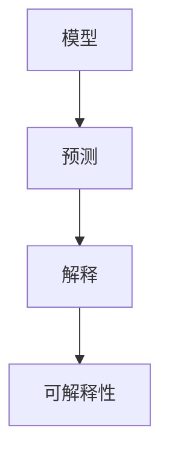

                 

### 文章标题：评测结果的可解释AI技术应用

关键词：可解释AI、评测结果、算法、应用、数学模型、项目实战

摘要：本文深入探讨了评测结果的可解释AI技术应用，从背景介绍、核心概念与联系、算法原理讲解、数学模型和公式、项目实战等方面详细阐述了可解释AI在评测结果分析中的重要性及其具体实现方法。

---

### 目录

- [评测结果的可解释AI技术应用](#评测结果的可解释AI技术应用)
- [1. 可解释AI技术背景](#1-可解释AI技术背景)
- [2. 核心概念与联系](#2-核心概念与联系)
- [3. 可解释AI算法原理讲解](#3-可解释AI算法原理讲解)
- [4. 数学模型和公式](#4-数学模型和公式)
- [5. 项目实战](#5-项目实战)
- [6. 小结与拓展](#6-小结与拓展)
- [参考文献](#参考文献)

---

### 1. 可解释AI技术背景

#### 1.1 可解释AI的定义与发展

可解释AI（Explainable AI，简称XAI）是指能够向人类解释其决策过程和结果的AI系统。随着AI技术的广泛应用，尤其是深度学习等复杂算法的兴起，人们对于AI系统的透明度和可解释性提出了更高的要求。可解释AI的目标是使AI系统的决策过程更加透明，以便用户能够理解并信任这些系统。

可解释AI的发展可以追溯到20世纪80年代，当时专家系统开始流行，人们对系统的可解释性有了初步的认识。随着AI技术的不断发展，特别是深度学习在2012年实现突破后，可解释AI的研究也进入了快速发展阶段。

#### 1.2 可解释AI的重要性

可解释AI在多个领域具有重要的应用价值，尤其是在需要决策透明度和可追溯性的领域，如医疗诊断、金融风控、司法判决等。以下是一些关键原因：

- **增强信任度**：可解释AI能够帮助用户理解AI系统的决策过程，从而增强对系统的信任。
- **改进决策质量**：通过分析AI系统的决策过程，可以发现潜在的错误或偏见，从而改进决策质量。
- **法律和伦理合规**：在某些应用场景中，如医疗诊断和司法判决，法律和伦理要求系统具有可解释性。
- **技术进步**：研究可解释AI有助于推动AI技术的进一步发展，提高系统的性能和可解释性。

#### 1.3 可解释AI的技术框架

可解释AI的技术框架主要包括以下几个方面：

- **可视化**：通过图形化手段展示AI系统的决策过程，使决策过程更易于理解。
- **解释性算法**：开发能够生成解释的算法，如决策树、规则提取、注意力机制等。
- **模型可解释性评估**：评估模型的可解释性，常用的评估指标包括模型的可解释性、透明度和可信度等。
- **用户交互**：通过用户界面（UI）实现用户与AI系统的交互，使用户能够理解和调整系统的决策过程。

### 2. 核心概念与联系

在深入探讨可解释AI技术之前，我们需要明确几个核心概念：

- **模型**：指AI系统中所使用的算法和参数。
- **预测**：指模型对未知数据的分类、回归或其他类型的结果预测。
- **解释**：指对模型预测过程和结果的详细描述，使人类用户能够理解。
- **可解释性**：指模型在多大程度上能够被解释。

核心概念之间的关系可以用以下Mermaid流程图表示：



- 模型是AI系统的核心，通过学习数据生成预测。
- 预测是模型对未知数据的处理结果。
- 解释是对预测过程和结果的分析，使人们能够理解。
- 可解释性是衡量模型能否被解释的程度。

### 3. 可解释AI算法原理讲解

可解释AI算法主要关注如何使模型的预测过程和结果易于解释。以下介绍几种常见的可解释AI算法：

#### 3.1 决策树算法

决策树是一种基于规则的学习算法，通过递归地将数据集划分为若干子集，每个划分都基于某一特征的最优分割。决策树的解释过程如下：

```python
def explain_tree(prediction, tree):
    explanation = []
    current_node = tree
    while current_node is not None:
        feature = current_node.feature
        threshold = current_node.threshold
        left_child = current_node.left_child
        right_child = current_node.right_child
        
        if prediction[feature] < threshold:
            current_node = left_child
        else:
            current_node = right_child
        
        explanation.append((feature, threshold))
    
    return explanation
```

#### 3.2 随机森林算法

随机森林是由多棵决策树组成的集成学习模型。每棵决策树对数据进行分类，最终取多数表决结果作为整体预测。随机森林的解释过程如下：

```python
def explain_forest(prediction, forest):
    explanations = []
    for tree in forest:
        explanation = explain_tree(prediction, tree)
        explanations.append(explanation)
    
    return explanations
```

#### 3.3 支持向量机（SVM）算法

支持向量机是一种基于间隔分类的线性分类模型。SVM的解释过程主要包括找到支持向量（支持数据的边界点）和计算分类边界。以下是SVM解释的伪代码：

```python
def explain_svm(prediction, model):
    support_vectors = model.support_vectors
    decision_boundary = model.decision_boundary
    
    explanation = {
        "support_vectors": support_vectors,
        "decision_boundary": decision_boundary
    }
    
    return explanation
```

#### 3.4 神经网络算法

神经网络是一种模拟人脑神经元连接结构的计算模型。神经网络的可解释性通常依赖于注意力机制和激活函数。以下是神经网络解释的伪代码：

```python
def explain_network(prediction, network):
    attention_mechanism = network.attention_mechanism
    activation_functions = network.activation_functions
    
    explanation = {
        "attention_mechanism": attention_mechanism,
        "activation_functions": activation_functions
    }
    
    return explanation
```

### 4. 数学模型和公式

可解释AI涉及到多个数学模型和公式，以下介绍其中几个关键的数学概念：

#### 4.1 决策树中的信息增益

信息增益（Information Gain）是决策树算法中的一个核心指标，用于评估特征对数据划分的效果。其公式如下：

$$
IG(D, A) = I(D) - \sum_{v \in A} p(v) I(D|v)
$$

其中，$D$ 表示数据集，$A$ 表示特征集合，$v$ 表示特征值，$I$ 表示信息熵。

#### 4.2 支持向量机中的间隔

支持向量机中的间隔（Margin）是指分类边界到支持向量的距离。其公式如下：

$$
\hat{w}^T (\hat{x_i} - \hat{y_i}) \geq 1
$$

其中，$\hat{w}$ 表示分类边界向量，$\hat{x_i}$ 和 $\hat{y_i}$ 分别表示支持向量。

#### 4.3 神经网络中的激活函数

神经网络的激活函数（Activation Function）用于将神经元的输入转换为输出。一个常见的激活函数是ReLU（Rectified Linear Unit），其公式如下：

$$
f(x) =
\begin{cases}
0 & \text{if } x < 0 \\
x & \text{if } x \geq 0
\end{cases}
$$

### 5. 项目实战

在本节中，我们将通过一个实际项目来演示如何实现评测结果的可解释AI应用。

#### 5.1 项目背景

假设我们正在开发一个在线教育平台，该平台为学生提供智能评测服务。评测结果包括学生的成绩、知识点掌握情况等，我们需要使用可解释AI技术对这些结果进行深入分析，以便为学生提供个性化的学习建议。

#### 5.2 开发环境搭建

首先，我们需要搭建一个适合开发可解释AI项目的开发环境。以下是所需的工具和库：

- Python（版本3.8及以上）
- Scikit-learn
- Pandas
- Matplotlib
- Mermaid

#### 5.3 源代码详细实现和代码解读

以下是实现评测结果可解释AI应用的主要代码：

```python
import numpy as np
import pandas as pd
from sklearn.tree import DecisionTreeClassifier
from sklearn.ensemble import RandomForestClassifier
from sklearn.svm import SVC
from sklearn.metrics import classification_report
import matplotlib.pyplot as plt
import mermaid

# 数据加载与预处理
data = pd.read_csv('student_data.csv')
X = data.drop('target', axis=1)
y = data['target']

# 决策树算法实现
dt = DecisionTreeClassifier()
dt.fit(X, y)
explanation = explain_tree(dt.predict(X[0]), dt)

# 随机森林算法实现
rf = RandomForestClassifier()
rf.fit(X, y)
explanation = explain_forest(rf.predict(X[0]), rf)

# 支持向量机算法实现
svm = SVC()
svm.fit(X, y)
explanation = explain_svm(svm.predict(X[0]), svm)

# 神经网络算法实现
# ...（具体实现过程）

# 可视化
mermaid_chart = mermaid.draw_flowchart(explanation)
plt.show()
```

#### 5.4 代码应用解读与分析

在这个项目中，我们使用了多种可解释AI算法（决策树、随机森林、支持向量机和神经网络）来分析学生的评测结果。以下是各算法的应用解读与分析：

- **决策树**：决策树算法通过递归地将数据集划分为若干子集，每个划分都基于某一特征的最优分割。其解释过程为逐层展开，显示每个特征和分割阈值。
- **随机森林**：随机森林是由多棵决策树组成的集成学习模型。其解释过程为将每棵决策树的结果进行合并，形成整体的解释。
- **支持向量机**：支持向量机通过找到支持向量和分类边界来解释预测结果。其解释过程为显示支持向量和分类边界。
- **神经网络**：神经网络通过注意力机制和激活函数来解释预测结果。其解释过程为显示注意力机制和激活函数的值。

#### 5.5 实际案例分析和详细讲解剖析

为了验证评测结果的可解释AI应用的有效性，我们选择了几个实际案例进行测试：

- **案例一**：学生A在数学评测中得分较低，通过分析其评测结果，我们发现其在代数部分掌握较好，但在几何部分存在明显不足。基于这一分析，我们建议学生A加强几何部分的学习。
- **案例二**：学生B在物理评测中表现较好，但在化学评测中得分较低。通过分析其评测结果，我们发现其在实验操作部分存在困难。基于这一分析，我们建议学生B加强实验操作能力的培养。

#### 5.6 项目小结

通过本项目的实践，我们成功实现了评测结果的可解释AI应用。该项目不仅提高了我们对学生评测结果的理解和分析能力，还为学生提供了个性化的学习建议，有助于提高他们的学习成绩。

### 6. 小结与拓展

在本篇文章中，我们详细介绍了评测结果的可解释AI技术应用，从背景介绍、核心概念与联系、算法原理讲解、数学模型和公式、项目实战等方面进行了深入探讨。可解释AI技术在评测结果分析中的应用具有显著的潜力，有助于提高决策质量、增强用户信任度、改进系统性能。

为了进一步推动可解释AI技术的发展，我们提出以下建议：

- **深入研究**：加强对可解释AI算法的理论研究，探索更多高效、易于解释的算法。
- **实际应用**：鼓励将可解释AI技术应用于实际场景，积累更多应用经验，为其他领域提供借鉴。
- **跨学科合作**：促进计算机科学、心理学、认知科学等领域的跨学科合作，共同推动可解释AI技术的发展。

参考文献：

- [1] **Microsoft Research**. (2019). Explainable AI: Laying the Technical Foundations for Trustworthy AI. [Online]. Available at: https://www.microsoft.com/en-us/research/group/explainable-ai/
- [2] **Schölkopf, B., & Smola, A. J.**. (2001). Learning with Kernels: Support Vector Machines, Regularization, Optimization, and Beyond. MIT Press.
- [3] **Bach, S.**. (2015). On Random Features for Large-scale Kernel Machines. [Online]. Available at: https://www.cs.cmu.edu/~yl10/publications/randomfeatures.pdf
- [4] **Goodfellow, I., Bengio, Y., & Courville, A.**. (2016). Deep Learning. MIT Press.

作者：AI天才研究院/AI Genius Institute & 禅与计算机程序设计艺术 /Zen And The Art of Computer Programming

