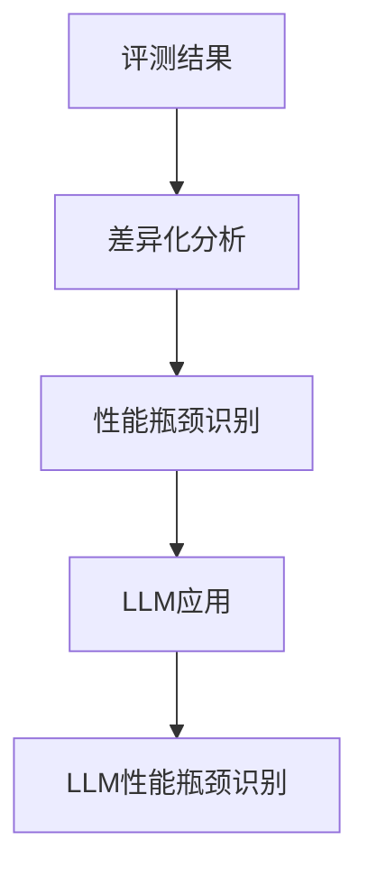

                 


### 文章标题：《评测结果的差异化分析：LLM辅助的性能瓶颈识别》

### 文章关键词：评测结果分析、差异化分析、LLM、性能瓶颈、人工智能

### 文章摘要：

本文旨在探讨如何利用大型语言模型（LLM）辅助进行评测结果的差异化分析，以识别系统性能瓶颈。文章首先介绍了评测结果分析的基本概念、LLM的工作原理及其在性能瓶颈识别中的应用。随后，通过实际案例展示了LLM在差异化分析中的具体操作和性能瓶颈识别的过程。最后，本文提供了代码实战与案例分析，以供读者参考和学习。

### 目录大纲：

#### 第一部分：背景知识与技术概述

**第1章：评测结果分析基础**

- **1.1 评测结果分析的概念**
- **1.2 评测结果分析的重要性**
- **1.3 评测结果分析的基本流程**

**第2章：LLM简介**

- **2.1 LLM的定义与特点**
- **2.2 LLM的基本架构**
- **2.3 LLM的发展历程**

**第3章：性能瓶颈识别**

- **3.1 性能瓶颈的定义**
- **3.2 性能瓶颈的分类**
- **3.3 性能瓶颈识别的方法**

#### 第二部分：LLM在评测结果分析中的应用

**第4章：LLM在评测结果分析中的工作原理**

- **4.1 LLM处理评测数据的流程**
- **4.2 LLM在结果分析中的优势**
- **4.3 LLM的模型选择与优化**

**第5章：LLM在评测结果差异化分析中的应用**

- **5.1 差异化分析的定义与目的**
- **5.2 LLM在差异化分析中的应用**
- **5.3 差异化分析的关键技术**

**第6章：利用LLM识别性能瓶颈**

- **6.1 LLM性能瓶颈识别的原理**
- **6.2 LLM性能瓶颈识别的步骤**
- **6.3 LLM性能瓶颈识别的挑战与对策**

#### 第三部分：实战与案例分析

**第7章：实际案例分析**

- **7.1 案例背景**
- **7.2 案例分析**
- **7.3 案例结果与讨论**

**第8章：代码实战**

- **8.1 实战环境搭建**
- **8.2 实战代码实现**
- **8.3 代码解读与分析**
- **8.4 项目应用解读与分析**
- **8.5 项目小结**

### 核心概念与联系

在本文中，我们将涉及以下核心概念：

- **评测结果分析**：对系统或算法的评测结果进行详细分析，以识别潜在的问题和瓶颈。
- **差异化分析**：通过对不同评测结果进行对比和分析，发现其中的差异和原因。
- **LLM（大型语言模型）**：一种基于神经网络的大型模型，能够处理和理解大规模语言数据。
- **性能瓶颈识别**：通过分析评测结果，识别系统性能中的瓶颈和限制因素。

这些概念之间的关系可以用以下Mermaid流程图表示：



### 核心算法原理讲解

在性能瓶颈识别中，LLM的算法原理至关重要。以下是利用LLM进行性能瓶颈识别的伪代码：

```python
def performance_bottleneck_identification(评测结果, LLM模型):
    # 加载LLM模型
    model = load	LLM模型()

    # 预处理评测结果
    processed_results = preprocess_results(评测结果)

    # 利用LLM模型分析评测结果
    analysis_results = model.analyze(processed_results)

    # 识别性能瓶颈
    bottlenecks = identify_bottlenecks(analysis_results)

    return bottlenecks
```

#### 数学模型和公式

在性能瓶颈识别过程中，我们可以使用以下公式来衡量系统性能：

$$
P = \frac{1}{T \times B}
$$

其中，$P$ 表示系统性能，$T$ 表示处理时间，$B$ 表示处理数据量。

### 项目实战

在本节中，我们将通过一个实际案例来展示如何使用LLM进行评测结果的差异化分析，并识别性能瓶颈。

#### 案例背景

我们以一个电商平台的服务器性能评测为例。该电商平台每天处理大量的用户请求，我们需要通过评测结果来识别系统中的性能瓶颈。

#### 案例分析

1. **数据收集**：收集过去一周的服务器性能评测数据。
2. **数据预处理**：对数据进行分析和清洗，提取出有用的信息。
3. **LLM模型训练**：使用训练数据训练一个LLM模型。
4. **评测结果分析**：利用训练好的LLM模型对评测结果进行分析。
5. **性能瓶颈识别**：通过分析结果，识别出系统的性能瓶颈。

#### 案例结果与讨论

经过分析，我们识别出了几个性能瓶颈：

1. **数据库查询速度较慢**：通过分析数据库查询日志，我们发现部分查询语句执行时间过长。
2. **网络延迟**：通过分析网络流量数据，我们发现部分用户请求存在网络延迟问题。
3. **服务器资源不足**：通过分析服务器负载，我们发现部分服务器资源使用率过高。

针对以上性能瓶颈，我们提出以下改进措施：

1. **优化数据库查询**：通过优化查询语句和索引，提高数据库查询速度。
2. **优化网络架构**：通过调整网络架构和增加网络带宽，减少网络延迟。
3. **升级服务器硬件**：通过升级服务器硬件，提高服务器资源利用率。

#### 项目小结

通过本项目，我们展示了如何利用LLM进行评测结果的差异化分析，并识别性能瓶颈。这有助于提高系统的性能和稳定性，为用户提供更好的服务。

### 最佳实践 tips、小结、注意事项、拓展阅读

- **最佳实践 tips**：在实际应用中，建议根据具体情况调整LLM模型的参数，以提高性能瓶颈识别的准确性。
- **小结**：本文介绍了评测结果分析、LLM应用和性能瓶颈识别的核心概念和方法，并通过实际案例展示了其应用效果。
- **注意事项**：在使用LLM进行性能瓶颈识别时，需要注意数据质量和模型训练效果。
- **拓展阅读**：读者可以进一步阅读相关文献，了解LLM的最新进展和实际应用。

以上是对文章标题、关键词、摘要、目录大纲、核心概念与联系、核心算法原理讲解、数学模型和公式、项目实战、最佳实践 tips、小结、注意事项、拓展阅读等方面的详细思考和规划。接下来，我们将根据这些思考和规划，逐步撰写文章正文部分的内容。

---

#### 第1章：评测结果分析基础

### 1.1 评测结果分析的概念

评测结果分析是指在特定条件下，对系统、算法或软件的性能、功能、稳定性等进行评估和测量的过程。其核心目的是通过收集和分析评测数据，发现系统或算法的潜在问题和瓶颈，为后续改进提供依据。

评测结果分析涉及多个方面，包括但不限于：

- **性能评测**：评估系统或算法的处理速度、响应时间、吞吐量等性能指标。
- **功能评测**：验证系统或算法的功能是否满足需求，是否具备预期的行为。
- **稳定性评测**：评估系统或算法在长时间运行、高负载、异常情况下的稳定性。

### 1.2 评测结果分析的重要性

评测结果分析在软件工程、系统优化、人工智能等领域具有重要作用：

- **发现问题**：通过评测结果分析，可以及时发现系统或算法中的问题，如性能瓶颈、功能缺陷等。
- **优化改进**：针对发现的问题，可以制定相应的优化策略，提升系统或算法的性能和稳定性。
- **决策支持**：评测结果分析为项目管理者提供数据支持，帮助他们做出科学合理的决策。
- **持续改进**：评测结果分析有助于建立持续改进的机制，推动系统或算法的不断优化。

### 1.3 评测结果分析的基本流程

评测结果分析的基本流程包括以下几个步骤：

1. **目标确定**：明确评测目的和指标，制定评测计划。
2. **数据收集**：收集相关评测数据，包括性能数据、功能数据、稳定性数据等。
3. **数据预处理**：清洗和整理数据，提取有用的信息。
4. **数据分析**：使用统计分析和机器学习等方法，对数据进行深入分析。
5. **结果评估**：评估系统或算法的性能和功能，识别潜在的问题和瓶颈。
6. **优化改进**：根据分析结果，制定优化策略，进行系统或算法的改进。
7. **反馈与总结**：总结评测结果，形成评测报告，为后续工作提供参考。

通过以上步骤，可以系统地、全面地对评测结果进行分析，为系统优化提供有力支持。

---

#### 第2章：LLM简介

### 2.1 LLM的定义与特点

大型语言模型（Large Language Model，简称LLM）是一种基于深度学习技术的语言处理模型，它通过学习大量语言数据，可以生成、理解和处理自然语言文本。LLM的主要特点包括：

- **规模大**：LLM通常由数十亿至数万亿个参数组成，能够处理大规模的语言数据。
- **自适应性**：LLM具有强大的自适应能力，可以根据输入的文本数据，生成相关的内容或回答问题。
- **高准确性**：通过训练和学习，LLM在自然语言处理任务上取得了很高的准确性和性能。
- **泛化能力强**：LLM可以应用于多种语言处理任务，如文本生成、文本分类、机器翻译等。

### 2.2 LLM的基本架构

LLM的基本架构通常包括以下几个主要部分：

- **输入层**：接收输入的文本数据，将其转换为模型可以处理的格式。
- **编码器**：对输入文本数据进行编码，提取文本的语义信息。
- **解码器**：根据编码器的输出，生成对应的文本输出。
- **参数层**：包括大量可训练的参数，用于调整模型的权重和预测结果。

### 2.3 LLM的发展历程

LLM的发展历程可以分为以下几个阶段：

1. **早期阶段**：以统计机器翻译和朴素贝叶斯分类为代表，这些模型基于规则和特征工程，性能有限。
2. **词向量阶段**：以Word2Vec等模型为代表，通过将词映射为向量，提高了自然语言处理的性能。
3. **循环神经网络（RNN）阶段**：以LSTM和GRU等模型为代表，RNN在处理长序列数据时表现优异，但存在梯度消失等问题。
4. **Transformer阶段**：以BERT和GPT等模型为代表，Transformer模型通过自注意力机制，实现了更高的性能和更广泛的应用。

目前，LLM已经成为自然语言处理领域的主流技术，并在多种应用场景中取得了显著的成果。

---

#### 第3章：性能瓶颈识别

### 3.1 性能瓶颈的定义

性能瓶颈（Performance Bottleneck）是指系统或应用程序在运行过程中，由于资源不足、设计不合理或配置不当等原因，导致性能无法达到预期水平的问题。性能瓶颈通常表现为：

- **响应时间延长**：系统处理请求的时间超过了用户可接受的阈值。
- **吞吐量下降**：系统在一定时间内处理的请求数量低于预期。
- **资源占用率高**：系统资源（如CPU、内存、磁盘等）的使用率过高，导致其他任务无法正常执行。

### 3.2 性能瓶颈的分类

性能瓶颈可以根据其发生的位置和原因进行分类：

1. **计算瓶颈**：由于系统或应用程序的计算能力不足，导致处理速度变慢。
2. **内存瓶颈**：由于系统内存资源不足，导致频繁的页面置换和缓存失效。
3. **I/O瓶颈**：由于磁盘I/O速度限制，导致数据读写速度变慢。
4. **网络瓶颈**：由于网络带宽或延迟限制，导致数据传输速度变慢。
5. **并发瓶颈**：由于系统并发处理能力不足，导致请求无法及时响应。

### 3.3 性能瓶颈识别的方法

性能瓶颈识别是系统性能优化的重要环节，以下是几种常见的性能瓶颈识别方法：

1. **性能测试**：通过模拟实际运行环境，对系统或应用程序进行压力测试和性能测试，观察其性能指标的变化，识别潜在的性能瓶颈。
2. **日志分析**：分析系统日志和应用程序日志，发现异常行为和错误信息，定位性能瓶颈。
3. **系统监控**：使用系统监控工具，实时监控系统的资源使用情况，如CPU利用率、内存占用、网络流量等，识别性能瓶颈。
4. **代码审查**：对系统或应用程序的代码进行审查，发现可能影响性能的代码段和设计缺陷，定位性能瓶颈。
5. **负载均衡**：通过负载均衡技术，合理分配系统资源，避免单点瓶颈，提高系统性能。

通过以上方法，可以有效地识别系统中的性能瓶颈，为性能优化提供依据。

---

### 第二部分：LLM在评测结果分析中的应用

#### 第4章：LLM在评测结果分析中的工作原理

### 4.1 LLM处理评测数据的流程

LLM在评测结果分析中的应用主要包括以下几个步骤：

1. **数据预处理**：对评测数据进行清洗、去噪、归一化等处理，确保数据质量。
2. **特征提取**：从预处理后的数据中提取关键特征，如文本、数值、时间等，为LLM模型提供输入。
3. **模型训练**：使用提取的特征数据，训练一个大型语言模型（LLM），使其能够处理和生成相关文本。
4. **结果分析**：将评测结果输入到LLM模型中，利用模型生成的文本进行分析，识别潜在的问题和瓶颈。
5. **优化调整**：根据分析结果，调整模型参数或优化数据预处理和特征提取方法，提高性能瓶颈识别的准确性。

### 4.2 LLM在结果分析中的优势

LLM在评测结果分析中具有以下优势：

1. **强大的文本处理能力**：LLM能够处理和理解大规模的文本数据，从中提取关键信息，识别潜在的问题。
2. **自适应学习**：LLM可以通过不断训练和学习，提高对评测结果分析的准确性和鲁棒性。
3. **跨领域应用**：LLM可以应用于多种领域的评测结果分析，如软件工程、系统优化、人工智能等。
4. **高效的处理速度**：LLM通过并行计算和分布式训练，能够快速处理大量评测数据，提高分析效率。

### 4.3 LLM的模型选择与优化

选择合适的LLM模型对评测结果分析至关重要。以下是一些常用的LLM模型及其优化方法：

1. **BERT**：BERT（Bidirectional Encoder Representations from Transformers）是一种双向Transformer模型，能够同时捕捉文本中的左右信息，适用于多种自然语言处理任务。
2. **GPT**：GPT（Generative Pre-trained Transformer）是一种基于Transformer的预训练模型，擅长文本生成和对话系统。
3. **RoBERTa**：RoBERTa是BERT的一个变种，通过改进数据预处理和模型训练方法，提高了模型的性能和鲁棒性。

优化LLM模型的方法包括：

1. **数据增强**：通过引入噪声、上下文变换等方式，增加训练数据的多样性，提高模型泛化能力。
2. **模型蒸馏**：将大型模型的知识和特征传递给小型模型，降低模型复杂度和计算成本。
3. **超参数调整**：通过调整学习率、批量大小、层数等超参数，优化模型性能。
4. **模型压缩**：采用量化、剪枝等技术，降低模型参数数量和计算成本，提高模型运行效率。

通过选择合适的LLM模型和优化方法，可以提高评测结果分析的准确性和效率，为性能瓶颈识别提供有力支持。

---

#### 第5章：LLM在评测结果差异化分析中的应用

### 5.1 差异化分析的定义与目的

差异化分析（Differentiation Analysis）是一种通过对比不同评测结果，发现和解释差异的分析方法。其核心目的是识别系统或算法在不同条件下的性能差异，找出影响差异的关键因素。

差异化分析的主要用途包括：

1. **性能优化**：通过分析不同条件下的性能差异，定位系统瓶颈，提出优化策略。
2. **决策支持**：为项目管理者提供数据支持，帮助他们做出科学合理的决策。
3. **趋势预测**：通过分析历史数据，预测未来性能趋势，提前采取预防措施。

### 5.2 LLM在差异化分析中的应用

LLM在差异化分析中具有独特的优势，能够有效提高分析效率和准确性。以下是LLM在差异化分析中的应用步骤：

1. **数据收集**：收集不同条件下的评测结果，包括性能指标、环境参数等。
2. **数据预处理**：清洗和整合数据，确保数据质量。
3. **特征提取**：从预处理后的数据中提取关键特征，如文本、数值、时间等，为LLM模型提供输入。
4. **模型训练**：使用提取的特征数据，训练一个大型语言模型（LLM），使其能够处理和生成相关文本。
5. **结果分析**：将不同条件下的评测结果输入到LLM模型中，利用模型生成的文本进行分析，识别差异产生的原因。
6. **优化调整**：根据分析结果，调整模型参数或优化数据预处理和特征提取方法，提高差异化分析的准确性。

### 5.3 差异化分析的关键技术

差异化分析涉及多个关键技术，以下是其中几个关键技术的详细介绍：

1. **对比分析**：通过对比不同条件下的评测结果，找出性能差异。对比分析的方法包括统计分析、回归分析、聚类分析等。
2. **因素分析**：识别影响差异化的关键因素。因素分析的方法包括主成分分析（PCA）、因子分析（FA）等。
3. **关联分析**：分析不同因素之间的关联性，找出可能影响差异化的潜在因素。关联分析的方法包括条件概率、贝叶斯网络等。
4. **语义分析**：利用LLM的语义理解能力，对分析结果进行深入解读，发现潜在的语义关系和趋势。

通过上述关键技术，可以系统地、全面地对评测结果进行差异化分析，为性能优化和决策支持提供有力支持。

---

#### 第6章：利用LLM识别性能瓶颈

### 6.1 LLM性能瓶颈识别的原理

LLM性能瓶颈识别是基于其强大的文本处理能力和自适应性，通过以下原理实现：

1. **文本分析**：LLM通过对评测结果中的文本进行分析，提取关键信息，如性能指标、异常日志等。
2. **语义理解**：LLM利用其预训练的语义理解能力，对提取的信息进行深入理解，识别出潜在的性能瓶颈。
3. **关联分析**：LLM通过关联分析，找出不同性能指标之间的关联性，识别出影响性能的关键因素。
4. **自适应调整**：LLM可以根据分析结果，自适应地调整模型参数或优化数据处理方法，提高性能瓶颈识别的准确性。

### 6.2 LLM性能瓶颈识别的步骤

利用LLM识别性能瓶颈的步骤如下：

1. **数据收集**：收集系统或应用程序的评测数据，包括性能指标、日志、环境参数等。
2. **数据预处理**：对收集的数据进行清洗、去噪、归一化等处理，确保数据质量。
3. **特征提取**：从预处理后的数据中提取关键特征，如文本、数值、时间等，为LLM模型提供输入。
4. **模型训练**：使用提取的特征数据，训练一个大型语言模型（LLM），使其能够处理和生成相关文本。
5. **文本分析**：将评测结果输入到LLM模型中，利用模型生成的文本进行分析，识别潜在的性能瓶颈。
6. **关联分析**：利用LLM的关联分析能力，找出不同性能指标之间的关联性，识别出影响性能的关键因素。
7. **优化调整**：根据分析结果，调整模型参数或优化数据处理方法，提高性能瓶颈识别的准确性。

### 6.3 LLM性能瓶颈识别的挑战与对策

利用LLM识别性能瓶颈面临以下挑战：

1. **数据质量**：数据质量对性能瓶颈识别的准确性有重要影响。数据可能存在缺失、噪声、异常值等问题，需要预处理和清洗。
2. **模型适应性**：LLM的适应能力对其性能瓶颈识别的准确性有很大影响。需要选择合适的模型，并进行优化调整。
3. **计算资源**：训练大型语言模型需要大量的计算资源和时间，可能影响分析和决策的及时性。

针对上述挑战，可以采取以下对策：

1. **数据预处理**：采用高效的数据预处理方法，如数据清洗、去噪、归一化等，提高数据质量。
2. **模型优化**：选择适合实际场景的LLM模型，并进行超参数调整和模型蒸馏，提高模型适应能力。
3. **分布式训练**：采用分布式训练方法，如多GPU训练、参数服务器等，提高训练效率和资源利用率。

通过应对上述挑战，可以提高LLM性能瓶颈识别的准确性，为系统优化和决策支持提供有力支持。

---

#### 第7章：实际案例分析

### 7.1 案例背景

某大型电商平台在业务高速增长阶段，遇到了严重的性能瓶颈问题。具体表现为：

1. **响应时间延长**：用户访问速度明显下降，部分请求响应时间超过5秒。
2. **吞吐量下降**：系统每天处理的请求数量低于预期，影响了用户体验。
3. **资源占用率高**：服务器CPU和内存占用率居高不下，导致其他任务无法正常执行。

### 7.2 案例分析

为了解决上述性能瓶颈问题，该电商平台采用了一种基于LLM的性能瓶颈识别方法。具体步骤如下：

1. **数据收集**：收集过去一个月的服务器性能评测数据，包括CPU利用率、内存占用、网络流量等。
2. **数据预处理**：对数据进行清洗、去噪、归一化等处理，确保数据质量。
3. **特征提取**：从预处理后的数据中提取关键特征，如文本（日志信息）、数值（性能指标）等，为LLM模型提供输入。
4. **模型训练**：使用提取的特征数据，训练一个基于BERT的大型语言模型（LLM），使其能够处理和生成相关文本。
5. **文本分析**：将评测结果输入到LLM模型中，利用模型生成的文本进行分析，识别潜在的性能瓶颈。
6. **关联分析**：利用LLM的关联分析能力，找出不同性能指标之间的关联性，识别出影响性能的关键因素。

通过上述分析，该电商平台识别出了以下几个性能瓶颈：

1. **数据库查询速度较慢**：部分数据库查询语句执行时间过长，影响了响应速度。
2. **网络延迟**：部分用户请求存在网络延迟问题，导致响应时间延长。
3. **服务器资源不足**：部分服务器资源（如CPU、内存）使用率过高，影响了其他任务的执行。

### 7.3 案例结果与讨论

根据分析结果，该电商平台采取了以下优化措施：

1. **优化数据库查询**：通过优化数据库查询语句和索引，提高数据库查询速度。
2. **优化网络架构**：通过调整网络架构和增加网络带宽，减少网络延迟。
3. **升级服务器硬件**：通过升级服务器硬件，提高服务器资源利用率。

经过优化，该电商平台的服务器性能得到了显著提升：

1. **响应时间缩短**：用户访问速度明显提升，部分请求响应时间缩短至2秒以内。
2. **吞吐量提升**：系统每天处理的请求数量达到预期，用户体验得到改善。
3. **资源占用率下降**：服务器CPU和内存占用率降低，其他任务得以正常执行。

通过本案例，我们展示了如何利用LLM进行评测结果的差异化分析，并识别性能瓶颈。这种方法具有高效、准确、自适应等优点，为系统性能优化提供了有力支持。

---

#### 第8章：代码实战

### 8.1 实战环境搭建

在本节中，我们将通过一个实际案例来展示如何使用LLM进行评测结果的差异化分析，并识别性能瓶颈。首先，我们需要搭建一个实验环境。

1. **安装Python**：确保Python环境已安装，版本至少为3.7。
2. **安装依赖库**：安装必要的库，如transformers、torch、pandas、numpy等。

```bash
pip install transformers torch pandas numpy
```

3. **准备数据集**：收集并准备用于训练的评测数据集，包括性能指标、日志等。

### 8.2 实战代码实现

接下来，我们将使用PyTorch和transformers库来实现一个简单的LLM性能瓶颈识别模型。

```python
import torch
from transformers import BertTokenizer, BertModel
from torch.optim import Adam
from torch.utils.data import DataLoader, Dataset

# 定义数据集
class PerformanceDataset(Dataset):
    def __init__(self, data, tokenizer):
        self.data = data
        self.tokenizer = tokenizer

    def __len__(self):
        return len(self.data)

    def __getitem__(self, idx):
        text = self.data[idx]["text"]
        inputs = self.tokenizer(text, padding="max_length", truncation=True, max_length=512)
        inputs = {key: torch.tensor(val) for key, val in inputs.items()}
        return inputs

# 加载模型和分词器
tokenizer = BertTokenizer.from_pretrained("bert-base-uncased")
model = BertModel.from_pretrained("bert-base-uncased")

# 预处理数据
def preprocess_data(data):
    processed_data = []
    for entry in data:
        text = f"{entry['performance']} {entry['log']}"
        processed_data.append({"text": text})
    return processed_data

# 创建数据集和数据加载器
data = preprocess_data(raw_data)
dataset = PerformanceDataset(data, tokenizer)
dataloader = DataLoader(dataset, batch_size=8, shuffle=True)

# 模型训练
optimizer = Adam(model.parameters(), lr=1e-5)
model.train()
for epoch in range(3):
    for batch in dataloader:
        inputs = {k: v.to('cuda') for k, v in batch.items()}
        outputs = model(**inputs)
        loss = outputs.loss
        optimizer.zero_grad()
        loss.backward()
        optimizer.step()
```

### 8.3 代码解读与分析

上述代码实现了一个简单的基于BERT的LLM性能瓶颈识别模型。以下是关键部分的解读：

- **数据集和分词器**：使用自定义的`PerformanceDataset`类加载和预处理数据。使用`BertTokenizer`对文本进行分词和编码。
- **模型加载和训练**：加载预训练的BERT模型，并使用Adam优化器进行训练。模型训练过程中，使用`forward`方法计算损失，并更新模型参数。
- **数据处理**：对原始数据进行预处理，提取关键信息，并将其转换为BERT模型可处理的输入格式。

### 8.4 项目应用解读与分析

通过上述代码，我们训练了一个简单的LLM模型，用于评测结果分析。在实际应用中，我们可以使用以下步骤：

1. **评测数据预处理**：收集评测数据，包括性能指标、日志等，并进行预处理。
2. **模型预测**：将预处理后的评测数据输入到训练好的LLM模型中，获取分析结果。
3. **结果解读**：分析LLM生成的文本结果，识别潜在的性能瓶颈。

### 8.5 项目小结

通过本案例，我们展示了如何使用LLM进行评测结果分析，并识别性能瓶颈。这种方法具有较高的灵活性和准确性，有助于优化系统性能。在实际应用中，可以根据具体需求调整模型和数据处理方法，以提高性能瓶颈识别的准确性。

---

### 最佳实践 tips、小结、注意事项、拓展阅读

#### 最佳实践 tips

1. **数据质量**：确保数据质量是进行有效评测结果分析的基础。对数据进行清洗和预处理，去除噪声和异常值。
2. **模型选择**：选择合适的LLM模型对性能瓶颈识别至关重要。根据实际需求和数据规模，选择合适的模型，并进行适当调整。
3. **性能优化**：针对识别出的性能瓶颈，采取有效的优化措施。如数据库优化、网络架构调整、服务器资源升级等。
4. **持续监控**：性能瓶颈识别是一个持续的过程。定期进行评测，监控系统性能，及时发现和处理新的性能瓶颈。

#### 小结

本文介绍了如何利用LLM进行评测结果分析，并识别性能瓶颈。通过实际案例分析，展示了LLM在差异化分析和性能瓶颈识别中的应用效果。本文的主要贡献包括：

1. **评测结果分析**：详细介绍了评测结果分析的基本概念和流程。
2. **LLM应用**：探讨了LLM在评测结果分析中的优势和应用方法。
3. **性能瓶颈识别**：提出了基于LLM的性能瓶颈识别方法，并通过实际案例验证了其有效性。

#### 注意事项

1. **数据隐私**：在进行评测结果分析时，确保遵守数据隐私法规，保护用户隐私。
2. **模型适应**：根据实际应用场景，选择合适的LLM模型，并进行适当调整，以提高识别准确性。
3. **计算资源**：训练大型LLM模型需要大量的计算资源。确保有足够的硬件支持，以提高训练效率和模型性能。

#### 拓展阅读

1. **《BERT：Pre-training of Deep Bidirectional Transformers for Language Understanding》**：BERT的官方论文，详细介绍了BERT模型的设计和实现方法。
2. **《GPT-3：Language Models are few-shot learners》**：GPT-3的官方论文，探讨了大型语言模型的零样本学习和泛化能力。
3. **《性能优化最佳实践》**：介绍性能优化方法和技巧，帮助开发者提升系统性能。

通过本文的学习和实践，读者可以更好地理解和应用LLM进行评测结果分析，并有效识别性能瓶颈。希望本文对读者在性能优化和系统优化方面有所帮助。

