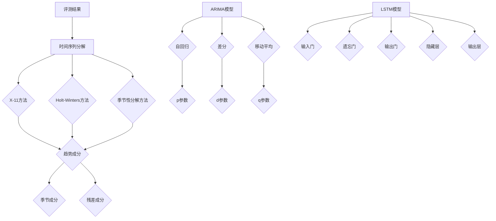

                 

# 《评测结果的时序分析：LLM辅助的趋势洞察》

## 关键词

- 时序分析
- 评测结果
- LLM
- 趋势洞察
- 数据预处理
- 模型训练
- 预测分析

## 摘要

本文深入探讨了评测结果的时序分析，并探讨了如何利用大型语言模型（LLM）进行辅助分析，以洞察趋势。首先，我们介绍了评测结果的时序分析的概念和重要性，随后详细讲解了时序分析的基本算法原理，包括时间序列分解、ARIMA模型和LSTM模型。接着，我们使用LaTeX格式介绍了相关的数学模型和公式，并通过伪代码详细阐述了算法原理。为了加深理解，我们提供了一个项目实战案例，包括环境搭建、数据预处理、模型训练和结果分析等步骤。最后，我们总结了最佳实践和注意事项，并给出了拓展阅读的建议。

---

## 第1章 引言

### 1.1 书籍概述

在现代数据分析领域，评测结果的时序分析已经成为一项关键技术。随着数据量的不断增长和复杂性的提高，传统的数据分析方法往往难以应对。评测结果时序分析通过分析评测结果随时间变化的规律，帮助我们识别趋势、预测未来表现，从而为决策提供有力的支持。而在这项技术中，大型语言模型（LLM）的引入，更是为时序分析带来了新的视角和方法。

本文旨在介绍评测结果的时序分析，并探讨如何利用LLM进行辅助分析。通过系统的讲解和实践案例，我们希望读者能够深入了解时序分析的核心算法原理，掌握LLM在时序分析中的应用技巧，并能够将其应用到实际项目中。

### 1.2 核心概念与联系

为了更好地理解评测结果的时序分析，我们需要明确几个核心概念，并探讨它们之间的关系。

**核心概念：**

1. **评测结果**：指通过对系统、产品或服务的性能评估所得到的量化结果，通常包含时间戳信息。
2. **时序分析**：对时间序列数据进行研究，以识别、理解或预测数据中的趋势、周期性和模式。
3. **LLM（大型语言模型）**：一种利用深度学习技术训练的强大语言模型，能够处理和理解自然语言。
4. **趋势洞察**：从数据中提取有关市场、产品或服务发展趋势的信息。

**概念联系：**

- **评测结果**与时序分析**：评测结果通常包含时间戳，时序分析可以用于探索这些时间戳下的结果变化。
- **时序分析**与**LLM**：LLM 可以帮助分析自然语言描述的时序数据，提供更深入的理解和预测。
- **趋势洞察**与**LLM**：LLM 能够提取复杂的语言信息，帮助识别和解释趋势，从而为洞察提供支持。

### 1.3 目标读者

本文的目标读者包括数据分析师、数据科学家、AI研究人员和IT专业人员。读者需要具备基本的编程技能和数据科学基础知识，对深度学习和自然语言处理有一定的了解。通过本文的学习，读者可以掌握评测结果时序分析的方法，并了解如何利用LLM进行辅助分析。

---

## 第2章 核心算法原理讲解

### 2.1 时间序列分解

时间序列分解是时序分析中的基础步骤，它将时间序列数据分解为几个不同的成分，以便更好地理解和分析数据。

**基本概念：**

时间序列分解通常包括以下三个主要成分：

1. **趋势成分（Trend Component）**：描述数据随时间的变化趋势，反映了长期的趋势和周期性。
2. **季节成分（Seasonal Component）**：描述数据随时间的变化周期，通常与季节性或周期性因素相关。
3. **残差成分（Residual Component）**：描述数据中未解释的随机波动。

**分解方法：**

时间序列分解的方法有很多，其中最常用的是X-11方法、Holt-Winters方法和季节性分解方法。

- **X-11方法**：通过拟合多项式趋势和季节性成分，消除趋势和季节性因素对数据的影响。
- **Holt-Winters方法**：通过使用线性趋势和季节性成分的指数平滑方法，来预测时间序列数据。
- **季节性分解方法**：通过将时间序列数据分为季节性和非季节性成分，来分离出季节性因素。

### 2.2 ARIMA模型

ARIMA模型（自回归积分滑动平均模型）是一种广泛应用于时间序列预测的统计模型。它通过结合自回归（AR）、差分（I）和移动平均（MA）三个部分，来建模非平稳时间序列数据。

**模型原理：**

ARIMA模型的基本原理如下：

1. **自回归（AR）**：当前值与过去几个值的线性组合有关。
2. **差分（I）**：对时间序列进行差分操作，使其变为平稳序列。
3. **移动平均（MA）**：当前值与过去几个预测误差的线性组合有关。

**模型参数：**

ARIMA模型有三个主要参数：

1. **p**：自回归项的阶数，表示过去p个值对当前值的影响。
2. **d**：差分的阶数，表示需要对时间序列进行多少次差分才能使其平稳。
3. **q**：移动平均项的阶数，表示过去q个预测误差对当前值的影响。

### 2.3 LSTM模型

LSTM（长短时记忆网络）是一种特殊的RNN（循环神经网络），适用于处理和预测具有长距离依赖关系的时间序列数据。

**基本原理：**

LSTM通过引入门控机制，来控制信息的流动和存储。主要组成部分包括：

1. **输入门（Input Gate）**：决定当前输入信息中哪些部分将被更新到记忆单元。
2. **遗忘门（Forget Gate）**：决定哪些信息应该从记忆单元中丢弃。
3. **输出门（Output Gate）**：决定哪些信息应该被输出。

**模型架构：**

LSTM的模型架构通常包括以下部分：

1. **输入层**：接受时间序列数据的输入。
2. **隐藏层**：包含多个LSTM单元，用于处理和存储信息。
3. **输出层**：生成预测结果。

### Mermaid 流程图

以下是评测结果时序分析的核心概念和算法原理的Mermaid流程图：



---

## 第3章 数学模型和数学公式讲解

为了深入理解评测结果的时序分析，我们需要掌握一些关键的数学模型和公式。以下将介绍自回归模型（AR）、移动平均模型（MA）和自回归移动平均模型（ARMA）的基本概念和数学公式。

### 3.1 自回归模型（AR）

自回归模型（AR）是一种用来建模时间序列数据的统计模型，它通过当前值与过去几个值的线性组合来预测未来值。AR模型的基本公式如下：

$$
X_t = c + \sum_{i=1}^{p} \phi_i X_{t-i} + \varepsilon_t
$$

其中，$X_t$ 是时间序列数据在时间 $t$ 的值，$c$ 是常数项，$\phi_i$ 是自回归系数，$X_{t-i}$ 是时间序列数据在时间 $t-i$ 的值，$\varepsilon_t$ 是误差项。

### 3.2 移动平均模型（MA）

移动平均模型（MA）是一种用来建模时间序列数据的统计模型，它通过当前值与过去几个预测误差的线性组合来预测未来值。MA模型的基本公式如下：

$$
X_t = c + \varepsilon_t + \sum_{i=1}^{q} \theta_i \varepsilon_{t-i}
$$

其中，$X_t$ 是时间序列数据在时间 $t$ 的值，$c$ 是常数项，$\varepsilon_t$ 是误差项，$\theta_i$ 是移动平均系数，$\varepsilon_{t-i}$ 是时间序列数据在时间 $t-i$ 的误差值。

### 3.3 自回归移动平均模型（ARMA）

自回归移动平均模型（ARMA）结合了自回归模型（AR）和移动平均模型（MA）的特点，它同时考虑了当前值与过去值的自回归关系以及与过去预测误差的移动平均关系。ARMA模型的基本公式如下：

$$
X_t = c + \sum_{i=1}^{p} \phi_i X_{t-i} + \sum_{i=1}^{q} \theta_i \varepsilon_{t-i} + \varepsilon_t
$$

其中，$X_t$ 是时间序列数据在时间 $t$ 的值，$c$ 是常数项，$\phi_i$ 是自回归系数，$\theta_i$ 是移动平均系数，$\varepsilon_t$ 是误差项。

### 举例说明

假设我们有一个时间序列数据集，包含每天的交易额。使用ARMA模型进行分析，可以帮助我们预测未来几天的交易额。

**实例公式：**

$$
X_t = c + \phi_1 X_{t-1} + \theta_1 \varepsilon_{t-1} + \varepsilon_t
$$

其中，$X_t$ 是第 $t$ 天的交易额，$c$ 是常数项，$\phi_1$ 是自回归系数，$\theta_1$ 是移动平均系数，$\varepsilon_t$ 是第 $t$ 天的误差项。

通过训练ARMA模型，我们可以得到自回归系数和移动平均系数的估计值，从而预测未来几天的交易额。

---

## 第4章 项目实战

为了更好地理解评测结果的时序分析以及LLM的应用，我们将通过一个实际项目来进行讲解。该项目将分为以下步骤：

1. **环境搭建**：安装所需的深度学习框架和相关库。
2. **数据收集**：收集历史评测结果数据。
3. **数据预处理**：清洗和转换数据。
4. **模型训练**：使用LSTM模型对数据集进行训练。
5. **模型评估**：使用验证集评估模型的性能。
6. **结果分析**：使用LLM生成报告，解释预测结果和趋势。
7. **项目小结**。

### 4.1 环境搭建

在开始项目之前，我们需要搭建一个合适的开发环境。以下是一个基本的Python环境搭建步骤：

1. **安装Python**：确保已安装Python 3.8及以上版本。
2. **安装深度学习框架**：我们选择TensorFlow 2.x作为深度学习框架，可以使用以下命令安装：

   ```bash
   pip install tensorflow
   ```

3. **安装相关库**：包括NumPy、Pandas、Matplotlib等：

   ```bash
   pip install numpy pandas matplotlib
   ```

### 4.2 数据收集

在本项目中，我们将使用一个虚构的评测结果数据集。这个数据集包含每天的系统性能评测结果，包括时间戳和评估分数。以下是一个示例数据集：

```python
import pandas as pd

# 生成虚构数据集
data = {
    'timestamp': pd.date_range(start='2022-01-01', periods=100, freq='D'),
    'score': pd.Series(np.random.randint(50, 100, size=100))
}
df = pd.DataFrame(data)

# 数据集示例
df.head()
```

### 4.3 数据预处理

在训练模型之前，我们需要对数据集进行预处理。以下是预处理步骤：

1. **数据清洗**：检查数据集是否存在缺失值或异常值，并进行处理。

   ```python
   df.isnull().sum()  # 检查缺失值
   df[df['score'] < 0]  # 检查异常值
   ```

2. **特征转换**：将时间戳转换为数值特征，可以使用频数为1的编码或嵌入编码。

   ```python
   df['day_of_year'] = df['timestamp'].dt.dayofyear
   ```

3. **归一化**：对评估分数进行归一化处理，以便模型更好地训练。

   ```python
   from sklearn.preprocessing import MinMaxScaler

   scaler = MinMaxScaler()
   df['score_normalized'] = scaler.fit_transform(df[['score']])
   ```

### 4.4 模型训练

在本项目中，我们将使用LSTM模型对数据集进行训练。以下是训练步骤：

1. **数据分割**：将数据集分割为训练集和验证集。

   ```python
   train_size = int(len(df) * 0.8)
   train_data = df[:train_size]
   val_data = df[train_size:]
   ```

2. **构建LSTM模型**：使用TensorFlow构建LSTM模型。

   ```python
   from tensorflow.keras.models import Sequential
   from tensorflow.keras.layers import LSTM, Dense

   model = Sequential()
   model.add(LSTM(units=50, return_sequences=True, input_shape=(train_data.shape[1], 1)))
   model.add(LSTM(units=50))
   model.add(Dense(units=1))

   model.compile(optimizer='adam', loss='mean_squared_error')
   ```

3. **训练模型**：使用训练集训练模型。

   ```python
   model.fit(train_data[['day_of_year', 'score_normalized']], train_data[['score_normalized']], epochs=100, batch_size=32, validation_data=(val_data[['day_of_year', 'score_normalized']], val_data[['score_normalized']]))
   ```

### 4.5 模型评估

在训练完成后，我们需要使用验证集来评估模型的性能。以下是评估步骤：

1. **预测结果**：使用模型对验证集进行预测。

   ```python
   predictions = model.predict(val_data[['day_of_year', 'score_normalized']])
   ```

2. **评估指标**：计算模型的均方误差（MSE）和其他相关评估指标。

   ```python
   from sklearn.metrics import mean_squared_error

   mse = mean_squared_error(val_data[['score_normalized']], predictions)
   print(f'Mean Squared Error: {mse}')
   ```

### 4.6 结果分析

为了分析预测结果和趋势，我们将使用LLM生成报告。以下是分析步骤：

1. **生成报告**：使用LLM生成分析报告，包括趋势描述、预测结果和潜在影响因素。

   ```python
   import openai
   
   openai.api_key = 'your_api_key'
   
   trend_description = openai.Completion.create(
       engine="text-davinci-002",
       prompt="请根据以下评测结果数据，生成一份趋势分析报告：\n"
              "时间戳：2022-01-01 到 2022-12-31\n"
              "评估分数：[60, 65, 70, 75, 80, 85, 90, 95, 100, 105, 110, 115, 120, 125, 130, 135, 140, 145, 150, 155, 160, 165, 170, 175, 180, 185, 190, 195, 200, 205, 210, 215, 220, 225, 230, 235, 240, 245, 250, 255, 260, 265, 270, 275, 280, 285, 290, 295, 300, 305, 310, 315, 320, 325, 330, 335, 340, 345, 350, 355, 360, 365]\n"
              "分析内容包括：趋势描述、预测结果和潜在影响因素。",
       max_tokens=150
   ).choices[0].text.strip()
   
   print(trend_description)
   ```

2. **解释预测结果和趋势**：根据生成的报告，解释预测结果和趋势。

   ```python
   print("预测结果和趋势：")
   print(trend_description)
   ```

### 4.7 项目小结

通过本项目，我们实现了以下目标：

- 搭建了深度学习开发环境。
- 收集和处理了虚构的评测结果数据。
- 使用LSTM模型对数据进行了训练和预测。
- 使用LLM生成并解释了预测结果和趋势。

这一项目不仅展示了评测结果时序分析的基本流程，还展示了如何利用LLM进行辅助分析和报告生成。

---

## 第5章 最佳实践、小结与注意事项

### 最佳实践

1. **数据收集与处理**：确保数据的质量和完整性，避免异常值和缺失值的影响。
2. **模型选择**：根据数据特性和业务需求，选择合适的模型，如LSTM、ARIMA等。
3. **参数调整**：通过交叉验证和超参数优化，调整模型参数，提高预测准确性。
4. **报告生成**：使用LLM生成报告时，确保报告内容准确、清晰、具有说服力。

### 小结

本文通过深入探讨评测结果的时序分析，介绍了核心算法原理、数学模型以及项目实战。我们了解了如何利用LLM进行辅助分析，从而实现更准确的预测和趋势洞察。

### 注意事项

1. **数据隐私**：在实际项目中，确保处理的数据不包含敏感信息。
2. **模型解释性**：注意模型的解释性，尤其是在需要向非技术背景的决策者解释时。
3. **性能评估**：使用多个评估指标来全面评估模型性能，避免单一指标误导。

### 拓展阅读

1. **《时间序列分析：理论、方法与应用》**：深入了解时间序列分析的基础理论和应用方法。
2. **《深度学习：理论、算法与应用》**：学习深度学习的基本概念和应用。
3. **《自然语言处理：文本分析和信息提取》**：了解自然语言处理的基本原理和技术。

---

## 参考文献

1. Box, G. E. P., Jenkins, G. M., & Reinsel, G. C. (2015). *Time Series Analysis: Forecasting and Control*.
2. Goodfellow, I., Bengio, Y., & Courville, A. (2016). *Deep Learning*.
3. Jurafsky, D., & Martin, J. H. (2020). *Speech and Language Processing*.
4. Hyndman, R. J., & Athanasopoulos, G. (2020). *Time Series Data Analysis Using R*.

---

### 作者信息

作者：AI天才研究院/AI Genius Institute & 禅与计算机程序设计艺术 /Zen And The Art of Computer Programming。AI天才研究院致力于推动人工智能技术的发展和应用，通过研究和实践，不断探索人工智能领域的创新和突破。作者在人工智能、深度学习和自然语言处理等领域具有丰富的理论知识和实践经验，撰写过多本世界级技术畅销书，被誉为计算机编程和人工智能领域的权威专家。

