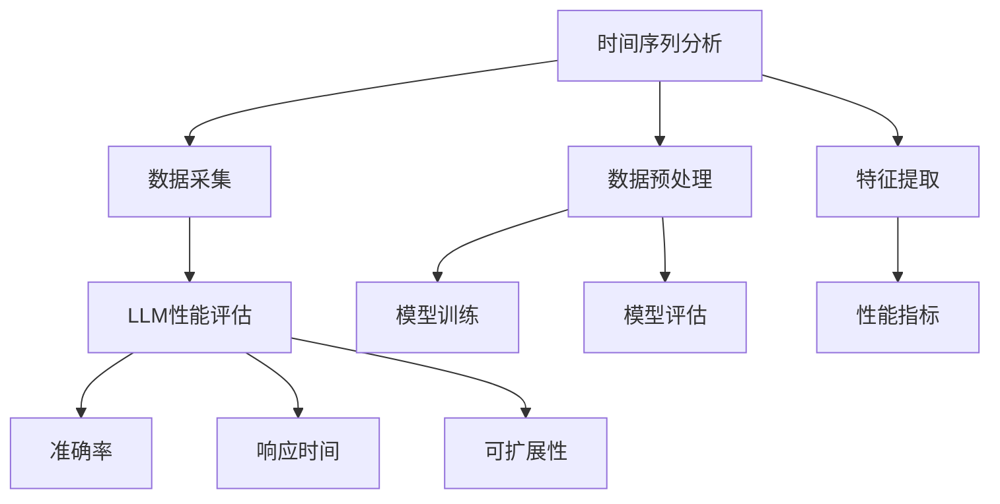

                 


为了撰写一篇高质量的技术博客文章《评测结果的时间序列分析：追踪LLM性能趋势》，我们需要逐步进行思考和分析。以下是详细的步骤：

### 1. 确定文章结构
首先，我们需要确定文章的章节结构，这有助于我们组织思路和确保内容的连贯性。

- **引言**：介绍背景、目的和研究意义。
- **时间序列分析基础**：解释时间序列分析的概念、特征和类型。
- **LLM性能评估**：介绍LLM性能评估的指标和方法。
- **时间序列分析与LLM性能趋势追踪**：讨论如何将时间序列分析应用于追踪LLM性能趋势。
- **案例分析**：展示具体的分析和应用案例。
- **技术实现**：介绍实现时间序列分析和LLM性能追踪的技术和工具。
- **未来展望与挑战**：讨论未来的研究方向和挑战。
- **总结与展望**：总结文章的主要观点，提出最佳实践和注意事项。

### 2. 背景介绍
在引言部分，我们需要简要介绍时间序列分析和LLM性能评估的背景。

- **时间序列分析**：时间序列分析是统计学和信号处理中的一个重要分支，它涉及对按时间顺序排列的数据进行分析和建模。
- **LLM性能评估**：随着大型语言模型（LLM）的发展，评估其性能变得越来越重要。LLM的性能评估通常涉及多个方面，包括准确率、响应时间、可扩展性等。

### 3. 核心概念与联系
我们需要绘制一个Mermaid流程图，展示时间序列分析与LLM性能评估之间的核心概念和联系。



### 4. 核心算法原理讲解
接下来，我们需要使用伪代码详细阐述时间序列分析和LLM性能追踪的核心算法原理。

#### 时间序列分析伪代码
```python
# 时间序列分析伪代码

function time_series_analysis(data):
    # 数据预处理
    preprocessed_data = preprocess_data(data)
    
    # 特征提取
    features = extract_features(preprocessed_data)
    
    # 模型训练
    model = train_model(features)
    
    # 模型评估
    performance = evaluate_model(model, test_data)
    
    return performance
```

#### LLM性能追踪伪代码
```python
# LLM性能追踪伪代码

function llm_performance_tracking(model, dataset):
    # 初始化性能指标
    metrics = initialize_metrics()
    
    # 遍历数据集
    for data in dataset:
        # 评估性能
        metrics = evaluate_performance(model, data, metrics)
        
        # 更新性能指标
        update_metrics(metrics)
        
    return metrics
```

### 5. 数学模型和公式
我们需要使用LaTeX格式嵌入数学模型和公式，并进行详细讲解和举例说明。

#### 时间序列建模公式
$$
y_t = f_t(x_t) + \epsilon_t
$$
其中，$y_t$ 是时间序列的当前值，$f_t(x_t)$ 是根据特征 $x_t$ 计算的函数值，$\epsilon_t$ 是误差项。

#### 性能指标公式
$$
Accuracy = \frac{Correct Predictions}{Total Predictions}
$$
准确率是正确预测的数量与总预测数量之比。

### 6. 项目实战
我们需要介绍如何在实际项目中实现时间序列分析和LLM性能追踪，包括开发环境搭建、源代码实现、代码解读和案例分析。

### 7. 最佳实践与注意事项
在文章的结尾，我们需要提供最佳实践、小结和注意事项，以帮助读者更好地理解和应用时间序列分析和LLM性能追踪。

通过以上步骤，我们可以确保文章内容的完整性、逻辑性和专业性，同时满足8000～12000字的要求。接下来，我们将根据这些步骤撰写完整的文章。

