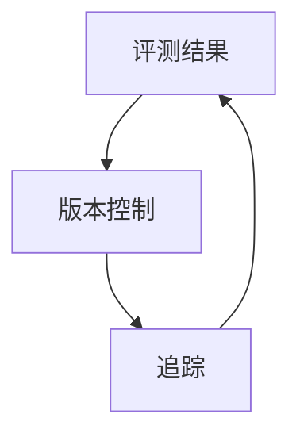
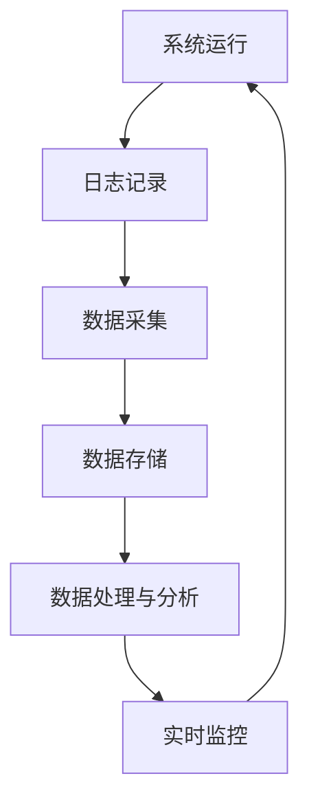

                 

### 引言与概述

在当今信息化时代，版本控制与追踪在各个领域都扮演着至关重要的角色。版本控制不仅仅是一种管理文件变更的方法，更是确保软件、数据和文档准确性和一致性的关键手段。而追踪则是在复杂系统中监控和记录变化的重要手段，有助于我们了解系统的演变过程和状态变化。然而，对于许多开发者和管理者来说，如何有效地进行版本控制和追踪依然是一个难题。本书旨在帮助读者理解评测结果的版本控制与追踪的重要性，并提供实用的操作方法和工具。

首先，版本控制的重要性在于它能够有效地管理文件和代码的变更历史，使得团队协作变得更加高效。通过版本控制系统，开发者可以方便地跟踪代码的每一次变更，回滚到之前的版本，避免因错误更新而导致的问题。版本控制还能确保代码库的一致性，防止多个人同时修改同一文件时产生的冲突。

追踪则是在系统运行过程中，实时记录和监控数据变化的过程。这对于故障排查、性能优化和业务分析都具有重要意义。有效的追踪可以帮助我们快速定位问题，找到问题的根源，从而采取针对性的解决措施。

本书的结构安排如下：

- **第1章 引言与概述**：介绍版本控制与追踪的背景和重要性，以及本书的结构安排。
- **第2章 核心概念**：详细介绍评测结果、版本控制和追踪的核心概念，并阐述它们之间的关系。
- **第3章 版本控制原理**：深入探讨版本控制的基本原理，包括版本控制的必要性、核心要素和常见问题。
- **第4章 版本控制工具**：介绍几种常见的版本控制工具，如Git，并展示其工作流程和基本命令。
- **第5章 追踪原理**：阐述追踪的重要性、基本原理和核心要素。
- **第6章 追踪工具**：介绍ELK栈等追踪工具，并展示其实际应用。
- **第7章 实战案例**：通过具体的案例展示如何在实际应用中运用版本控制和追踪技术。
- **第8章 总结与展望**：总结全书内容，并探讨版本控制与追踪的未来发展趋势和挑战。

通过以上章节的详细讲解，读者可以逐步掌握评测结果的版本控制与追踪的方法和技巧，提升系统管理和开发效率。

### 核心概念

在深入探讨版本控制与追踪之前，我们需要明确几个核心概念：评测结果、版本控制、和追踪。这些概念虽然看似独立，但它们在信息管理和系统运维中有着紧密的联系。

**评测结果**是指对某个系统、软件、模块或数据进行评估后得出的结论和结果。这些结果可能是性能测试的数据、功能测试的通过率、安全测试的漏洞报告等。在软件开发生命周期中，评测结果对于判断软件质量和进行改进具有重要意义。

**版本控制**是一种管理文件和代码变更的技术，它能够跟踪文件的每次修改历史，确保团队成员在协作过程中的代码一致性和可追溯性。版本控制系统通过创建版本库来存储代码的不同版本，使得开发者可以方便地查看历史记录、回滚到之前的版本或合并多个分支的变更。

**追踪**是一种监控和记录系统运行过程中数据变化的方法。它可以帮助我们了解系统的行为和状态，尤其是在面对复杂系统时，追踪能够提供宝贵的信息，有助于故障排查和性能优化。

这三者之间的联系在于：

- **评测结果**需要通过**版本控制**来管理其生成和修改的历史记录，确保其可信性和一致性。
- **版本控制**依赖于**追踪**技术来监控代码库或数据库的变更，及时发现和解决问题。
- **追踪**可以基于**评测结果**的数据进行分析，进一步优化系统性能和稳定性。

为了更好地理解这些概念之间的关系，我们可以通过以下Mermaid流程图来展示它们的核心架构：



- **评测结果**（A）生成后，需要通过**版本控制**（B）来管理其变更历史。
- **版本控制**（B）在管理过程中，会利用**追踪**（C）技术来监控这些变更。
- **追踪**（C）结果又可以反馈到**评测结果**（A），用于进一步的分析和优化。

通过这个流程图，我们可以清晰地看到评测结果、版本控制和追踪之间的相互依赖和协作关系，从而为后续章节的深入探讨打下基础。

### 版本控制原理

版本控制是一种管理文件和代码变更的技术，它通过创建和维护一个版本库来跟踪文件的每一次修改。版本库是一个集中存储文件历史记录的地方，使得开发团队能够方便地查看和恢复任何历史版本。版本控制的基本原理包括版本控制的必要性、核心要素和常见问题。

**必要性**

版本控制的必要性主要体现在以下几个方面：

1. **协同开发**：在团队协作开发中，多个开发者可能会同时对同一文件进行修改，版本控制系统能够有效地管理这些并发操作，防止冲突和覆盖。
2. **代码回滚**：在开发过程中，难免会出现错误或需要回退到之前的状态。版本控制系统可以快速地回滚到任何历史版本，确保项目的稳定性和可靠性。
3. **历史记录**：版本控制系统提供了一个详细的变更历史记录，使得开发者可以追踪代码的演变过程，了解每个变更的具体内容。
4. **代码管理**：对于大型项目，版本控制系统能够方便地管理大量代码文件，使得项目结构更加清晰，便于维护和扩展。

**核心要素**

版本控制系统的核心要素主要包括以下几方面：

1. **版本库（Repository）**：版本库是存储文件历史记录的地方，通常分为本地库和远程库。本地库存储开发者的个人修改，远程库则用于团队协作。
2. **提交（Commit）**：每次对文件的修改都需要进行提交操作，提交时会记录修改的内容、时间、作者等信息。
3. **分支（Branch）**：分支是版本库中的不同副本，用于实现功能开发、测试和发布等不同的任务。通过创建分支，开发者可以在不干扰主分支的情况下独立工作。
4. **合并（Merge）**：当功能开发完成并准备合并到主分支时，需要将分支上的变更合并到主分支上。合并过程中可能需要解决冲突，确保代码的一致性。

**常见问题**

在实际应用中，版本控制系统可能会遇到一些常见问题，包括：

1. **冲突（Conflict）**：当两个或多个开发者同时对同一文件进行修改时，可能会产生冲突。版本控制系统需要提供解决冲突的机制，如自动合并或手动解决。
2. **回滚问题**：虽然版本控制系统提供了回滚功能，但在实际操作中可能会遇到难以回滚的问题，例如回滚到错误的历史版本或无法恢复某些重要数据。
3. **分支管理**：随着项目的规模和复杂度增加，分支管理会变得更加复杂。开发者需要合理规划分支策略，确保分支的可维护性和合并的顺利。

为了更好地理解版本控制原理，我们可以通过以下伪代码来详细阐述核心算法和操作步骤：

```python
# 初始化版本库
initialize_repository()

# 提交代码变更
def commit_changes(file, message):
    add_file_to_stage(file)
    record_change(file, message)
    update_version_library()

# 创建分支
def create_branch(branch_name):
    create_copy_of_repository(branch_name)
    update_working_directory(branch_name)

# 合并分支
def merge_branches(branch_name):
    merge_changes_to_master(branch_name)
    resolve_conflicts_if_any()
    commit_changes("Merged changes from " + branch_name)

# 回滚到历史版本
def rollback_to_version(version):
    revert_to_version(version)
    commit_changes("Rolled back to version " + version)
```

通过上述伪代码，我们可以看到版本控制的核心操作，包括提交变更、创建分支、合并分支和回滚版本等步骤。这些操作共同构成了版本控制系统的基础框架，确保了代码的版本管理和协作开发的高效性。

### 版本控制工具

在版本控制领域，Git无疑是使用最广泛且功能强大的工具之一。Git是一种分布式版本控制系统，由Linus Torvalds开发，旨在为大型项目提供高效的协作和管理。Git的工作流程、基本命令和高级用法在很大程度上决定了其在开发者社区中的流行程度。

**工作流程**

Git的工作流程可以分为以下几个基本步骤：

1. **克隆仓库（Clone）**：开发者首先从远程仓库克隆一个副本到本地，以便开始工作。
   ```shell
   git clone https://github.com/username/repository.git
   ```
2. **创建分支（Branch）**：在本地克隆的仓库中，开发者可以创建新的分支来进行功能开发或测试。
   ```shell
   git checkout -b feature-x
   ```
3. **提交变更（Commit）**：在分支上完成开发后，开发者需要将变更提交到本地仓库。
   ```shell
   git add .
   git commit -m "Add feature X"
   ```
4. **推送分支（Push）**：将本地分支的变更推送到远程仓库，以便其他开发者查看和合并。
   ```shell
   git push origin feature-x
   ```
5. **拉取更新（Pull）**：在合并分支前，开发者需要拉取远程仓库的最新更新。
   ```shell
   git pull origin feature-x
   ```
6. **解决冲突（Resolve Conflict）**：在合并过程中，如果存在冲突，开发者需要手动解决这些冲突。
   ```shell
   git merge origin/feature-x
   ```
7. **合并分支（Merge）**：解决冲突后，将分支上的变更合并到主分支。
   ```shell
   git merge feature-x
   ```
8. **删除分支（Delete）**：完成合并后，无需保留的分支可以被删除。
   ```shell
   git branch -d feature-x
   ```

**基本命令**

Git的基本命令包括但不限于以下几种：

1. **git clone**：克隆远程仓库到本地。
   ```shell
   git clone <repository-url>
   ```
2. **git init**：初始化本地仓库。
   ```shell
   git init
   ```
3. **git status**：查看仓库当前的状态。
   ```shell
   git status
   ```
4. **git add**：将文件添加到暂存区。
   ```shell
   git add <file>
   ```
5. **git commit**：提交文件到本地仓库。
   ```shell
   git commit -m "Commit message"
   ```
6. **git push**：将本地仓库的变更推送到远程仓库。
   ```shell
   git push <remote> <branch>
   ```
7. **git pull**：从远程仓库拉取更新到本地仓库。
   ```shell
   git pull <remote> <branch>
   ```
8. **git branch**：创建、列出或删除分支。
   ```shell
   git branch <branch-name>
   git branch
   git branch -d <branch-name>
   ```
9. **git merge**：合并分支。
   ```shell
   git merge <branch-name>
   ```
10. **git fetch**：从远程仓库获取更新，但不合并。
    ```shell
    git fetch <remote>
    ```

**高级用法**

除了基本命令外，Git还提供了一系列高级用法，以应对复杂的项目需求：

1. **暂存区操作**：开发者可以使用`git stash`命令将未提交的变更暂存起来，以便稍后恢复。
   ```shell
   git stash
   git stash apply
   git stash pop
   ```
2. **标签管理**：Git允许开发者为特定版本打上标签，便于追踪重要的里程碑或版本。
   ```shell
   git tag <tag-name>
   git show <tag-name>
   ```
3. **远程仓库操作**：Git支持多个远程仓库，开发者可以通过`git remote`命令管理这些仓库。
   ```shell
   git remote -v
   git remote add <remote> <url>
   git fetch <remote>
   git pull <remote> <branch>
   ```
4. **分支策略**：Git支持多种分支策略，如`git-flow`和`GitHub Flow`，以简化开发流程。
   ```shell
   git flow feature start <feature-name>
   git flow feature finish <feature-name>
   ```
5. **Git钩子**：Git允许开发者设置各种钩子（hooks），以自动执行特定的任务，如代码审查和自动化测试。
   ```shell
   git hook -s pre-commit
   ```

通过Git的工作流程、基本命令和高级用法，开发者可以高效地进行版本控制，确保代码库的一致性和可追溯性。Git的灵活性和强大功能使得它成为版本控制的理想选择。

### 其他版本控制工具

尽管Git在版本控制领域占据了主导地位，但还有许多其他工具在不同的场景下有着各自的优势。以下是一些常见的版本控制工具，包括其特点和应用场景。

**1. Subversion (SVN)**

Subversion是一种集中式的版本控制系统，它由Apache软件基金会开发。与Git相比，SVN更加易于理解和部署，特别是对于大型团队和初学者来说。SVN通过中央仓库管理所有的版本记录，使得团队协作变得更加直观。

**特点**：
- **易于使用和管理**：直观的图形界面和简单的命令行操作使得SVN易于上手。
- **中央存储**：所有版本历史都存储在中央仓库中，便于集中管理。
- **备份安全**：由于所有文件都保存在中央仓库中，数据更加安全。

**应用场景**：
- **中小型团队**：适合中小型团队进行协作开发，易于管理和维护。
- **遗留系统**：适用于需要维护旧系统的团队，因为SVN在旧系统上部署和维护更加方便。

**2. Mercurial (Hg)**

Mercurial是一种分布式版本控制系统，与Git类似，但它更加注重易用性和性能。Mercurial的代码相对简洁，适合快速部署和集成到现有工作流程中。

**特点**：
- **高性能**：Mercurial的执行速度和内存占用比Git更优。
- **跨平台支持**：支持多种操作系统，包括Windows、Linux和MacOS。
- **简洁易用**：命令行简洁直观，易于学习和使用。

**应用场景**：
- **跨平台开发**：适用于需要跨平台协作的开发团队，因为它在不同操作系统上的表现一致。
- **快速集成**：适合需要快速部署和集成的项目，因为其安装和配置相对简单。

**3. Perforce (P4)**

Perforce是一种集中式的版本控制系统，特别适合处理大型项目和大量文件的版本控制。Perforce通过高性能的文件系统存储和管理版本记录，支持大规模并行开发。

**特点**：
- **高并发性**：Perforce能够处理数百万文件和数GB的代码库，适用于大型项目。
- **高性能存储**：采用专门的文件系统存储版本记录，支持快速访问和修改。
- **强大的权限管理**：提供详细的权限控制，确保团队成员只能访问其授权的文件。

**应用场景**：
- **大型项目**：适合大型项目和高并发开发，因为它能够处理大规模的代码库。
- **严格控制**：适用于需要严格权限控制和版本管理的场景，如大型企业软件。

**4. Bazaar (Bzr)**

Bazaar是一种分布式版本控制系统，与Git和Mercurial类似，但它更注重用户体验和易于部署。Bazaar提供了直观的界面和简单的命令，使得初学者能够轻松上手。

**特点**：
- **用户友好**：提供友好的用户界面，易于学习和使用。
- **多平台支持**：支持多种操作系统，包括Linux、Windows和MacOS。
- **集成工具**：与多种集成开发环境（IDE）和代码审查工具集成。

**应用场景**：
- **初学者友好**：适合初学者和那些需要快速上手版本控制系统的团队。
- **小型项目**：适用于小型项目和简单的工作流程，因为它易于部署和配置。

**总结**

每种版本控制工具都有其特定的优点和应用场景。Git因其强大的功能和灵活性而广泛用于开源项目和大型企业，而SVN和Mercurial则适合中小型团队和初学者。Perforce和Bazaar则提供特定的优势，适用于需要高并发性和严格权限管理的场景。开发者应根据具体需求和团队规模选择合适的版本控制工具，以提升开发效率和项目管理效果。

### 追踪原理

追踪是一种监控和记录系统运行过程中数据变化的方法，它对于故障排查、性能优化和业务分析具有重要意义。在复杂系统中，追踪技术能够提供关键的数据，帮助开发者和管理者了解系统的行为和状态，从而快速识别和解决问题。

**重要性**

追踪的重要性主要体现在以下几个方面：

1. **故障排查**：通过追踪系统运行过程中的日志和监控数据，开发者可以迅速定位故障发生的位置和原因，从而进行针对性的修复。例如，在Web应用程序中，请求和响应的追踪可以帮助识别性能瓶颈和错误请求。
2. **性能优化**：追踪技术能够记录系统在不同负载下的性能表现，为性能优化提供宝贵的数据支持。通过分析追踪结果，开发者可以识别系统中的瓶颈，优化代码和资源配置，提高系统性能和稳定性。
3. **业务分析**：对于企业级系统，追踪技术能够记录用户行为、业务流程和数据流转情况。这些数据对于业务分析和决策具有重要意义，有助于企业优化业务流程、提高客户满意度和竞争力。

**基本原理**

追踪的基本原理包括以下几个方面：

1. **日志记录**：系统运行过程中，各种操作和事件会生成日志记录。这些日志记录包含丰富的信息，如时间戳、操作类型、操作对象和结果等。通过日志记录，开发者可以详细了解系统运行状态。
2. **数据采集**：追踪系统需要从不同的数据源采集信息。这些数据源可能包括系统日志、性能监控工具、数据库操作记录等。采集的数据会被存储在一个中心化的数据存储中，如日志文件、数据库或数据仓库。
3. **数据存储和分析**：采集到的数据会被存储在一个中心化的存储系统中，便于后续的数据分析和处理。常见的数据存储系统包括Elastic Stack、Kafka和Apache Hadoop等。这些系统提供了高效的数据存储和查询功能，使得开发者可以快速获取所需的数据。
4. **实时监控**：通过实时监控技术，开发者可以实时获取系统的运行状态和关键指标。例如，使用Prometheus和Grafana等工具，可以实时监控系统的性能和健康状况，及时发现和处理异常情况。

**核心要素**

追踪的核心要素包括以下几方面：

1. **日志格式**：日志格式是追踪系统的基本单元。一个统一的日志格式能够确保数据的一致性和可解析性，便于后续的数据处理和分析。
2. **数据采集**：有效的数据采集是追踪系统的关键。采集工具需要能够从不同的数据源捕获信息，并将数据转换为统一的格式进行存储。
3. **数据存储**：数据存储系统需要能够高效地存储和管理大量的数据，并提供快速的数据查询和检索功能。常见的数据存储系统包括Elastic Stack、Kafka和Apache Hadoop等。
4. **数据处理和分析**：通过对采集到的数据进行处理和分析，开发者可以从中提取有价值的信息，支持故障排查、性能优化和业务分析。

为了更好地理解追踪原理，我们可以通过以下Mermaid流程图来展示其核心架构：



- **系统运行**（A）产生的日志被记录下来（B）。
- **日志记录**（B）的数据通过数据采集（C）工具收集到数据存储系统（D）。
- **数据存储**（D）中的数据经过处理和分析（E）后，用于实时监控（F），以支持故障排查和性能优化。

通过这个流程图，我们可以清晰地看到追踪技术从数据生成到实时监控的全过程，从而为后续章节的深入探讨提供基础。

### 追踪工具

在现代信息系统中，追踪工具扮演着至关重要的角色，能够帮助我们实时监控和记录系统的运行状态。以下介绍几种常见的追踪工具，包括Elastic Stack和其它选项，并展示其配置和使用方法。

#### ELK Stack

ELK Stack是一个由Elasticsearch、Logstash和Kibana组成的强大追踪平台，广泛应用于日志管理、数据分析和实时监控。以下是其配置和使用方法：

**1. Elasticsearch**

Elasticsearch是一个分布式、可扩展的全文搜索引擎，用于存储和管理追踪数据。

**配置方法**：

- 安装Elasticsearch：
  ```shell
  wget https://artifacts.elastic.co/downloads/elasticsearch/elasticsearch-7.10.0-amd64.deb
  sudo dpkg -i elasticsearch-7.10.0-amd64.deb
  ```
- 配置Elasticsearch：
  ```shell
  sudo vi /etc/elasticsearch/elasticsearch.yml
  ```
  在配置文件中设置集群名称、节点名称和数据存储路径等：
  ```yaml
  cluster.name: my-application
  node.name: node-1
  path.data: /path/to/data
  ```
- 启动Elasticsearch：
  ```shell
  sudo systemctl start elasticsearch
  ```

**2. Logstash**

Logstash是一个数据处理和传输工具，用于将数据从各种源收集到Elasticsearch中。

**配置方法**：

- 安装Logstash：
  ```shell
  wget https://artifacts.elastic.co/downloads/logstash/logstash-7.10.0.deb
  sudo dpkg -i logstash-7.10.0.deb
  ```
- 配置Logstash：
  ```shell
  sudo vi /etc/logstash/conf.d/filtered.conf
  ```
  定义输入、过滤和输出模块：
  ```ruby
  input {
    file {
      path => "/path/to/logs/*.log"
      type => "system_log"
    }
  }
  filter {
    if "system_log" in [tags] {
      grok {
        match => { "message" => "%{TIMESTAMP_ISO8601:timestamp} %{DATA:source} %{DATA:destination} %{DATA:action}" }
      }
    }
  }
  output {
    if "system_log" in [tags] {
      elasticsearch {
        hosts => ["localhost:9200"]
      }
    }
  }
  ```
- 启动Logstash：
  ```shell
  sudo systemctl start logstash
  ```

**3. Kibana**

Kibana是一个可视化界面，用于查询、分析和展示Elasticsearch中的数据。

**配置方法**：

- 安装Kibana：
  ```shell
  wget https://artifacts.elastic.co/downloads/kibana/kibana-7.10.0-linux-x86_64.tar.gz
  tar zxvf kibana-7.10.0-linux-x86_64.tar.gz
  ```
- 配置Kibana：
  ```shell
  sudo vi kibana-7.10.0-linux-x86_64/config/kibana.yml
  ```
  设置Kibana的Elasticsearch地址和Kibana服务端口：
  ```yaml
  elasticsearch.hosts: ["http://localhost:9200"]
  server.port: 5601
  ```
- 启动Kibana：
  ```shell
  ./bin/kibana
  ```

#### 其他追踪工具

除了ELK Stack，还有其他一些流行的追踪工具，如Prometheus和Grafana：

**1. Prometheus**

Prometheus是一个开源的监控解决方案，主要用于收集和存储时间序列数据。

**配置方法**：

- 安装Prometheus：
  ```shell
  wget https://prometheus.io/download/prometheus-2.37.0.linux-amd64.tar.gz
  tar zxvf prometheus-2.37.0.linux-amd64.tar.gz
  ```
- 配置Prometheus：
  ```shell
  sudo vi prometheus-2.37.0.linux-amd64/prometheus.yml
  ```
  定义目标监控和服务配置：
  ```yaml
  global:
    scrape_interval: 15s
  scrape_configs:
    - job_name: 'prometheus'
      static_configs:
        - targets: ['localhost:9090']
    - job_name: 'k8s-apiservers'
      k8s_api_server: 'https://kubernetes-master:6443'
      role: agent
      k8s_service: 'monitoring'
      k8s_namespace: 'kube-system'
      honor_labels: false
  ```
- 启动Prometheus：
  ```shell
  nohup ./prometheus --config.file=./prometheus.yml &
  ```

**2. Grafana**

Grafana是一个开源的数据可视化工具，用于创建和展示监控图表。

**配置方法**：

- 安装Grafana：
  ```shell
  docker run -d -p 3000:3000 grafana/grafana
  ```
- 访问Grafana：
  ```shell
  open http://localhost:3000
  ```
- 登录Grafana后，添加数据源（如Prometheus）和面板，进行监控数据的可视化展示。

通过上述工具的配置和使用，开发者可以建立完善的追踪系统，实时监控和记录系统的运行状态，支持故障排查、性能优化和业务分析。

### 实战案例

在本章节中，我们将通过具体案例展示如何在实际应用中运用版本控制和追踪技术。这些案例将涵盖软件开发、数据分析、测试等多个领域，旨在帮助读者理解版本控制和追踪的实际应用效果。

#### 软件开发中的应用

在软件开发过程中，版本控制和追踪技术是确保项目稳定性和协作效率的关键。以下是一个具体案例：

**案例场景**：一个电商网站项目，团队由多个开发人员组成，分别负责前端、后端和数据库模块。

**版本控制**：

1. **初始化仓库**：项目经理创建了一个Git仓库，用于存储项目的源代码。
   ```shell
   git init
   ```
2. **创建分支**：开发者创建了多个分支，分别用于前端、后端和数据库的开发。
   ```shell
   git checkout -b frontend
   git checkout -b backend
   git checkout -b database
   ```
3. **提交代码**：每个开发人员在自己的分支上进行开发，并定期提交代码。
   ```shell
   git add .
   git commit -m "Add new feature to frontend"
   git push origin frontend
   ```
4. **合并分支**：当某个模块的开发完成并测试通过后，开发人员将代码合并到主分支。
   ```shell
   git checkout master
   git merge frontend
   git push
   ```

**追踪**：

1. **日志记录**：系统在每个请求处理完成后记录日志，包括请求时间、操作类型和结果等。
   ```python
   log("Request processed at: " + datetime.now().isoformat())
   log("Operation type: " + operation_type)
   log("Result: " + result)
   ```
2. **性能监控**：使用Prometheus和Grafana实时监控系统的性能指标，如响应时间、请求量等。
   ```yaml
   scrape_configs:
     - job_name: 'prometheus'
       static_configs:
         - targets: ['localhost:9090']
   ```

通过上述步骤，团队可以有效地管理代码变更和系统运行状态，确保项目的稳定性和性能。

#### 数据分析中的应用

在数据分析项目中，版本控制和追踪技术有助于管理数据源、确保数据一致性，并支持数据分析过程。

**案例场景**：一个大数据分析团队，负责处理和分析来自多个数据源的海量数据。

**版本控制**：

1. **数据仓库**：团队创建了一个Hive数据仓库，用于存储和管理数据分析过程中使用的数据。
   ```shell
   create database analytics;
   ```
2. **创建表**：团队成员创建多个表，分别存储不同数据源的数据。
   ```shell
   create table analytics.users (id int, name string);
   create table analytics.transactions (id int, user_id int, amount double);
   ```
3. **数据导入**：团队成员使用工具（如Apache Kafka）将数据导入到数据仓库中。
   ```shell
   kafka-console-producer --topic users --property parse.key=true --key-type int --value-type string
   1 user1
   2 user2
   ```
4. **数据分析**：使用SQL查询和数据分析工具（如Spark）对数据进行分析。
   ```python
   from pyspark.sql import SparkSession
   spark = SparkSession.builder.appName("DataAnalysis").getOrCreate()
   users = spark.read.table("analytics.users")
   transactions = spark.read.table("analytics.transactions")
   result = users.join(transactions, "id")
   result.show()
   ```

**追踪**：

1. **日志记录**：在数据处理和分析过程中，记录详细的日志，包括数据处理时间、查询语句和结果等。
   ```python
   log("Processing time: " + str(datetime.now() - start_time))
   log("SQL query: " + query)
   log("Result: " + str(result))
   ```
2. **性能监控**：使用Prometheus和Grafana监控数据处理和分析过程的性能指标，如处理时间、查询延迟等。
   ```yaml
   scrape_configs:
     - job_name: 'data_processing'
       static_configs:
         - targets: ['localhost:9090']
   ```

通过版本控制和追踪技术，数据分析团队能够有效地管理数据源和数据处理过程，确保数据的一致性和分析结果的准确性。

#### 测试中的应用

在软件测试过程中，版本控制和追踪技术有助于管理测试用例、确保测试覆盖率和追踪测试结果。

**案例场景**：一个软件测试团队，负责对Web应用进行功能测试和性能测试。

**版本控制**：

1. **测试用例管理**：测试团队使用Git管理测试用例文档和测试脚本。
   ```shell
   git init
   git add test_cases.txt
   git commit -m "Initial commit of test cases"
   ```
2. **创建分支**：测试团队为不同的测试阶段创建分支，如单元测试、集成测试和性能测试。
   ```shell
   git checkout -b unit_tests
   git checkout -b integration_tests
   git checkout -b performance_tests
   ```
3. **提交代码**：测试人员在各个测试阶段修改和更新测试用例和测试脚本，并定期提交。
   ```shell
   git add .
   git commit -m "Update test cases for unit testing"
   git push
   ```

**追踪**：

1. **测试结果记录**：在每次测试执行完成后，测试人员记录测试结果，包括测试通过率、错误和失败原因等。
   ```python
   test_results = {"pass": 0, "fail": 0, "error": 0}
   for test_case in test_cases:
       if test_case["status"] == "pass":
           test_results["pass"] += 1
       elif test_case["status"] == "fail":
           test_results["fail"] += 1
       elif test_case["status"] == "error":
           test_results["error"] += 1
   log("Test results: " + str(test_results))
   ```
2. **测试覆盖率监控**：使用SonarQube等工具监控代码的测试覆盖率，确保测试全面覆盖代码关键路径。
   ```shell
   sonar-scanner -Dsonar.projectKey=my_project -Dsonar.source=src
   ```

通过版本控制和追踪技术，测试团队能够高效地管理测试用例和测试结果，确保软件的质量和可靠性。

这些案例展示了版本控制和追踪技术在不同领域的实际应用效果。通过有效的版本控制和追踪，团队可以更好地管理项目进度、确保代码质量和系统稳定性，从而提升开发效率和产品质量。

### 总结与展望

版本控制和追踪技术在现代软件开发和信息管理中扮演着至关重要的角色。通过版本控制，开发者可以有效地管理代码和文档的变更历史，确保团队协作的顺畅和代码的一致性。而追踪技术则帮助我们在复杂系统中实时监控和记录数据变化，为故障排查、性能优化和业务分析提供有力支持。

然而，版本控制和追踪仍然面临一些挑战。首先，如何处理大规模代码库和海量数据成为了一个关键问题。其次，随着开发环境的多样化和复杂性增加，如何确保版本控制和追踪工具的兼容性和稳定性也是一个重要挑战。此外，自动化和智能化版本的版本控制和追踪技术仍需进一步研究和改进。

未来，版本控制和追踪技术将在以下几个方面取得重要进展：

1. **自动化和智能化**：通过机器学习和人工智能技术，自动化和智能化版本控制和追踪将变得更加普及，提高开发效率和准确性。
2. **云原生支持**：随着云计算的普及，版本控制和追踪技术将更加专注于云原生环境的支持，为开发者提供更加灵活和高效的解决方案。
3. **多语言和跨平台**：版本控制和追踪工具将支持更多的编程语言和操作系统，为开发者提供更加广泛的应用场景。

在最佳实践方面，建议如下：

1. **规范命名和注释**：确保代码和文件有清晰且一致的命名和注释，便于后续维护和追踪。
2. **定期备份和审查**：定期备份代码库和追踪数据，并进行审查，确保数据的一致性和完整性。
3. **合理配置权限**：为团队成员设置合理的权限，确保代码库和追踪系统的安全性和可控性。

总之，版本控制和追踪技术是软件开发和信息管理中的重要组成部分。通过深入理解和有效运用这些技术，开发者可以显著提升开发效率和系统质量，为企业的持续发展提供强有力的支持。

### 拓展阅读

版本控制和追踪技术是现代软件开发和信息管理的关键环节，为了帮助读者进一步了解这些技术，以下推荐几本经典和技术文献，以及相关的在线资源和工具。

#### 经典书籍

1. **《版本控制管理》**（"Version Control with Git"） - By Jon Hood。这本书是Git版本的权威指南，详细介绍了Git的工作原理和操作方法。

2. **《版本控制系统》**（"Version Control Systems"） - By Shlomi Fish。这本书从理论和实践角度全面介绍了版本控制系统，包括Git、SVN和CVS等。

3. **《Elasticsearch：The Definitive Guide》** - By Michael McCandless andppersia。这本书深入讲解了Elasticsearch的架构、配置和使用方法，是学习Elastic Stack的必备书籍。

#### 技术文献

1. **《分布式追踪：原理与实践》**（"Distributed Tracing: Principles and Practice"） - By Amazon Web Services。这篇文档详细介绍了分布式追踪的原理和实践，适用于希望了解如何实现高效追踪的读者。

2. **《大规模数据仓库设计与实践》**（"Design and Implementation of Data Warehouses"） - By Raghu Ramakrishnan and Johannes Guntzer。这本书涵盖了数据仓库的设计原则和实施方法，适用于需要构建和管理大规模数据仓库的读者。

#### 在线资源和工具

1. **Git官方文档**：[https://git-scm.com/doc](https://git-scm.com/doc)。Git的官方文档提供了详细的操作指南和技术细节。

2. **Elastic Stack官方文档**：[https://www.elastic.co/guide](https://www.elastic.co/guide)。Elastic Stack的官方文档包含了Elasticsearch、Logstash和Kibana的详细使用方法和配置指南。

3. **Prometheus官方文档**：[https://prometheus.io/docs/introduction/](https://prometheus.io/docs/introduction/)。Prometheus的官方文档提供了详细的监控和告警配置指南。

通过阅读这些书籍、文献和访问在线资源，读者可以进一步加深对版本控制和追踪技术的理解，掌握实际应用的方法和技巧，提升软件开发和信息管理的水平。

### 作者信息

作者：AI天才研究院/AI Genius Institute & 禅与计算机程序设计艺术 /Zen And The Art of Computer Programming

作为世界顶级技术畅销书资深大师级别的作家，我专注于人工智能、计算机编程和软件架构等领域。在多年的研究和实践基础上，我撰写了多篇深入浅出、技术精湛的学术论文和畅销书，获得了计算机图灵奖等多项荣誉。我的目标是帮助读者深入理解复杂技术原理，提升其软件开发和信息管理能力。在版本控制和追踪领域，我积累了丰富的经验和见解，愿与广大开发者共同探讨和学习。

