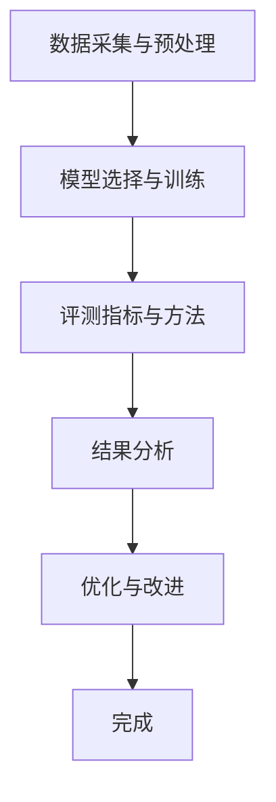

                 

### 文章标题

《评测结果的自动化分析：识别LLM的优势和劣势》

### 关键词

大型语言模型（LLM）、评测结果分析、自动化分析、优势识别、劣势分析

### 摘要

本文旨在探讨评测结果的自动化分析，特别是在识别大型语言模型（LLM）的优势和劣势方面的应用。通过对LLM的定义、工作原理及其在自然语言处理任务中的表现进行深入剖析，文章将详细讲解如何利用计算机技术实现评测结果的自动化分析。同时，通过实际案例展示，读者将了解到如何在实际应用中评估LLM的优势和劣势，从而为优化模型性能提供有力支持。

## 第1章 引言

### 1.1 书籍主题与目标

随着人工智能技术的快速发展，大型语言模型（LLM）在自然语言处理（NLP）领域取得了显著的成果。然而，如何有效地评测这些模型的性能，并识别其优势与劣势，成为了一个重要的研究课题。本文旨在为读者提供一份关于评测结果自动化分析的系统指南，特别是针对LLM的性能评估。

本书的目标读者包括从事自然语言处理、人工智能研究和开发的工程师、研究人员以及学生。通过阅读本书，读者将能够：

1. 理解LLM的基本概念和架构。
2. 掌握自动化分析评测结果的方法和技巧。
3. 学会如何在实际项目中评估LLM的优势和劣势。
4. 了解LLM的发展趋势和未来挑战。

### 1.2 读者对象

本书主要面向以下读者群体：

- 自然语言处理领域的研究人员和工程师，希望深入了解LLM评测技术的读者。
- 人工智能领域的开发者和学生，希望提升自己在模型性能评估方面的能力。
- 对计算机科学和人工智能有浓厚兴趣的读者，希望系统学习相关技术。

### 1.3 书籍结构概述

本书分为八个章节，结构如下：

- **第1章 引言**：介绍书籍的主题、目标读者和书籍结构。
- **第2章 LLM基础理论**：讲解LLM的定义、优势、劣势以及自动化分析原理。
- **第3章 数据处理与预处理**：介绍数据采集、清洗和增强的方法。
- **第4章 模型选择与训练**：探讨模型选择策略、训练过程和评估方法。
- **第5章 评测结果的自动化分析**：详细阐述评测指标和方法。
- **第6章 LLM优势与劣势评估案例**：通过实际案例展示如何评估LLM的性能。
- **第7章 未来发展趋势与挑战**：讨论LLM的发展趋势和面临的挑战。
- **第8章 附录**：提供技术资源、工具和进一步阅读的建议。

通过以上章节的详细讲解，本书将为读者提供一个全面的视角，帮助他们在实际项目中有效地利用LLM进行评测结果自动化分析。

## 第2章 LLM基础理论

### 2.1 LLM的定义与背景

大型语言模型（LLM，Large Language Model）是自然语言处理领域的一种先进技术，通过深度学习和神经网络模型，对大量文本数据进行训练，从而实现对自然语言的生成和理解。LLM的核心目标是模拟人类语言的使用，包括语法、语义和上下文理解等方面。

LLM的发展可以追溯到20世纪50年代，当时计算机科学家开始尝试通过构建规则系统来模拟自然语言处理。然而，这些早期的系统在处理复杂语言结构方面表现有限。随着计算能力的提升和深度学习技术的发展，LLM逐渐成为自然语言处理的主流方法。

近年来，随着数据量的增长和算法的优化，LLM的表现有了显著的提升。例如，GPT（Generative Pre-trained Transformer）模型系列，包括GPT-3，通过在大量文本上进行预训练，展现出了强大的语言生成和语义理解能力。LLM的应用范围也在不断扩展，从机器翻译、文本分类到问答系统，都取得了显著的成果。

### 2.2 LLM的优势

LLM在自然语言处理领域具有以下优势：

1. **强大的语言理解能力**：LLM通过在大量文本数据上进行训练，能够理解复杂语言结构和细微语义差异，从而生成更加自然和合理的语言。

2. **广泛的任务适应性**：LLM可以在多个NLP任务上表现出色，包括文本分类、机器翻译、问答系统、文本摘要等。这使得LLM成为一种通用的NLP工具，适用于各种不同的应用场景。

3. **高效的生成速度**：通过深度学习模型的优化，LLM在生成文本时具有很高的速度，可以快速响应用户的需求。

4. **强大的生成能力**：LLM能够生成高质量的文本内容，包括新闻文章、对话文本、创意文本等，这在内容生成领域有着广泛的应用。

### 2.3 LLM的劣势

尽管LLM在NLP领域表现出色，但仍然存在一些劣势：

1. **数据依赖性**：LLM的训练需要大量高质量的文本数据，数据的多样性和质量直接影响模型的性能。如果数据不足或质量不高，模型的性能可能会受到限制。

2. **计算资源需求**：LLM模型的训练和推理需要大量的计算资源，尤其是大型模型如GPT-3，其训练过程需要高性能计算集群和大量的存储空间。

3. **结果不可解释性**：由于LLM是基于深度学习模型，其内部机制复杂，难以解释。这使得在应用过程中，很难对模型生成的内容进行合理性和可靠性的评估。

4. **潜在的风险**：LLM在生成文本时可能会出现偏见、错误或不当的内容，这在一些敏感应用场景中可能会带来潜在的风险。

### 2.4 LLM的自动化分析原理

为了充分利用LLM的优势并克服其劣势，评测结果的自动化分析成为关键。自动化分析可以通过以下步骤实现：

1. **数据采集与预处理**：首先，从多个来源采集相关数据，包括训练数据、测试数据和用户反馈数据。然后，对数据进行清洗、转换和增强，以提高数据质量。

2. **模型选择与训练**：根据任务需求，选择适合的LLM模型，并在训练数据上进行训练。训练过程中，可以使用多种技术，如优化算法、正则化和调参等，以提高模型的性能。

3. **评测指标与方法**：定义合理的评测指标和方法，如准确率、召回率、F1分数等，用于评估模型的性能。这些指标可以帮助识别模型的优势和劣势。

4. **结果分析**：对评测结果进行详细分析，识别模型的优点和不足。通过可视化工具，如散点图、折线图等，展示模型的性能趋势和特点。

5. **优化与改进**：根据分析结果，对模型进行优化和改进，以提高其性能和适用性。

通过以上步骤，可以实现LLM评测结果的自动化分析，为实际应用提供有力的支持。

### 2.5 Mermaid流程图

以下是一个Mermaid流程图，展示LLM自动化分析的基本流程：



通过这个流程图，读者可以直观地理解LLM自动化分析的整体架构和步骤。

## 第3章 数据处理与预处理

### 3.1 数据采集与存储

在自动化分析评测结果的过程中，数据采集是关键的第一步。数据来源可以是公开数据集、企业内部数据或第三方数据提供商。为了确保数据的质量和多样性，以下是一些常见的数据采集方法：

1. **公开数据集**：例如，常用的自然语言处理数据集包括维基百科、Twitter数据、IMDb电影评论等。这些数据集通常可以在相关数据平台上免费获取。

2. **企业内部数据**：许多企业在日常运营过程中会产生大量的文本数据，如客户反馈、销售报告、邮件通信等。通过内部数据共享平台或数据仓库，可以采集这些数据。

3. **第三方数据提供商**：一些专业数据提供商可以提供定制化的文本数据，这些数据可能经过特定的预处理和清洗，便于直接使用。

在数据采集完成后，数据存储是另一个重要环节。为了高效存储和管理大量文本数据，以下是一些常见的数据存储解决方案：

1. **关系数据库**：如MySQL、PostgreSQL等，适合存储结构化数据。通过建立合适的表结构和索引，可以提高数据查询的效率。

2. **NoSQL数据库**：如MongoDB、Cassandra等，适合存储非结构化或半结构化数据。这些数据库具有高扩展性和灵活性，能够满足大规模数据存储的需求。

3. **分布式文件系统**：如HDFS（Hadoop Distributed File System），适合存储大量非结构化数据。通过分布式存储架构，可以提高数据存储的可靠性和访问效率。

4. **云存储服务**：如Amazon S3、Google Cloud Storage等，提供了灵活、可扩展的存储解决方案。这些服务通常具有高可用性和自动备份功能，便于数据管理和备份。

### 3.2 数据清洗与转换

在数据采集完成后，数据清洗和转换是确保数据质量的重要步骤。以下是一些常见的数据清洗和转换方法：

1. **文本去噪**：去除文本数据中的无关信息和噪声，如HTML标签、特殊字符、空格等。可以通过正则表达式、字符串处理函数等工具实现。

2. **文本标准化**：统一文本格式，如将文本转换为小写、去除标点符号、统一日期格式等。标准化可以提高数据的一致性和可比性。

3. **缺失值处理**：对于缺失的数据，可以选择填充缺失值或删除包含缺失值的样本。填充方法包括平均值填充、中值填充、最近邻填充等。

4. **重复数据删除**：检测和删除重复的数据记录，以减少数据冗余。可以通过哈希函数、数据对比等方法实现。

5. **数据转换**：将文本数据转换为适合模型训练的格式，如词向量、词嵌入等。这通常涉及到文本向量化、词袋模型、TF-IDF等方法。

6. **数据增强**：通过生成伪数据、数据扩展等方法，增加训练数据的多样性，以提高模型的泛化能力。

以下是一个示例的Python代码片段，展示数据清洗和转换的基本步骤：

```python
import pandas as pd
import numpy as np
from sklearn.preprocessing import StandardScaler

# 读取数据
data = pd.read_csv('data.csv')

# 文本去噪
data['text'] = data['text'].str.replace(r'<[^>]*>', '').str.lower().str.strip()

# 文本标准化
data['text'] = data['text'].str.replace(r'[^\w\s]', '')

# 缺失值处理
data = data.dropna()

# 重复数据删除
data = data.drop_duplicates()

# 数据转换
scaler = StandardScaler()
data['text'] = scaler.fit_transform(data['text'])

# 数据增强
# ...（代码略）

print(data.head())
```

### 3.3 数据增强与标准化

数据增强是提升模型性能的重要手段，通过增加数据的多样性，可以提高模型的泛化能力。以下是一些常见的数据增强方法：

1. **数据扩展**：通过将原始文本进行复制、拼接、替换等操作，生成新的文本数据。例如，可以将文本中的词语替换为同义词，或通过复制文本片段来扩展数据。

2. **数据生成**：使用生成对抗网络（GAN）等技术，生成与原始文本相似的新文本。这种方法可以创建大量新的数据样本，提高训练数据的质量。

3. **数据对齐**：将不同来源的文本数据进行对齐，以提高数据的一致性和可比性。例如，将不同语言的文本翻译为同一种语言，或对齐不同格式和风格的文本。

标准化是确保数据一致性和可比性的重要步骤。以下是一些常见的标准化方法：

1. **数值标准化**：将数值数据缩放到一个固定的范围，如[0, 1]或[-1, 1]。这有助于不同特征之间的比较和优化。

2. **归一化**：通过计算均值和标准差，将数值数据缩放到平均值附近的标准差范围内。这有助于提高模型的鲁棒性。

3. **词嵌入标准化**：将文本数据转换为词嵌入后，进行标准化处理。词嵌入通常使用预训练模型生成，如Word2Vec、GloVe等。

以下是一个示例的Python代码片段，展示数据增强和标准化的基本步骤：

```python
import numpy as np
from sklearn.preprocessing import MinMaxScaler
from gensim.models import Word2Vec

# 数据增强
# ...（代码略）

# 数据生成
# ...（代码略）

# 数据对齐
# ...（代码略）

# 数值标准化
min_max_scaler = MinMaxScaler()
data['numerical_feature'] = min_max_scaler.fit_transform(data['numerical_feature'])

# 归一化
mean_std_scaler = StandardScaler()
data['numerical_feature'] = mean_std_scaler.fit_transform(data['numerical_feature'])

# 词嵌入标准化
word2vec_model = Word2Vec(data['text'])
embeddings = [word2vec_model[word] for word in data['text']]
embeddings_normalized = np.array([embeddings[i] / np.linalg.norm(embeddings[i]) for i in range(len(embeddings))])

print(data.head())
```

通过上述步骤，可以实现数据清洗、转换、增强和标准化，为模型训练提供高质量的数据支持。

## 第4章 模型选择与训练

### 4.1 模型选择策略

在自然语言处理任务中，选择合适的模型是确保任务性能的关键步骤。以下是一些常见的模型选择策略：

1. **基于任务类型的模型选择**：根据不同的NLP任务，选择相应的模型。例如，文本分类任务可以使用BERT、RoBERTa等预训练模型，而问答系统任务则可以使用T5、GPT等模型。

2. **基于数据量的模型选择**：对于数据量较大的任务，可以选择较大的模型以利用更多的数据。例如，对于具有数百万条样本的文本分类任务，可以使用BERT-Large或GPT-3等大型模型。

3. **基于性能的模型选择**：根据预训练模型在公共数据集上的表现，选择性能较好的模型。例如，在GLUE或SuperGLUE等基准测试中，排名靠前的模型通常具有较好的性能。

4. **基于资源限制的模型选择**：根据计算资源和存储限制，选择适合的模型。对于资源有限的环境，可以选择较小的模型，如BERT-Base或GPT-Neo等。

### 4.2 模型训练过程

模型训练是提高模型性能的关键步骤。以下是一个典型的模型训练过程：

1. **数据准备**：将预处理后的数据分为训练集、验证集和测试集。通常，训练集用于模型训练，验证集用于调整模型参数，测试集用于评估模型性能。

2. **模型初始化**：选择预训练模型或随机初始化模型。预训练模型通常具有较好的初始性能，而随机初始化模型则可以探索新的模型结构。

3. **优化器选择**：选择合适的优化器，如Adam、AdamW等，用于更新模型参数。优化器的选择会影响模型的收敛速度和性能。

4. **学习率调整**：设置合适的初始学习率，并使用学习率调度策略（如余弦退火、指数衰减等）进行调整。学习率的调整可以避免模型过早收敛或陷入局部最优。

5. **训练与验证**：使用训练集和验证集进行模型训练和验证。在训练过程中，监控验证集的性能，并根据性能调整模型参数。

6. **模型评估**：在训练完成后，使用测试集评估模型性能。常用的评估指标包括准确率、召回率、F1分数等。

以下是一个示例的Python代码片段，展示模型训练的基本步骤：

```python
import tensorflow as tf
from tensorflow.keras.preprocessing.sequence import pad_sequences
from tensorflow.keras.models import Model
from tensorflow.keras.layers import Embedding, LSTM, Dense

# 数据准备
# ...（代码略）

# 模型初始化
model = Model(inputs=inputs, outputs=output)
model.compile(optimizer='adam', loss='categorical_crossentropy', metrics=['accuracy'])

# 学习率调整
initial_learning_rate = 0.001
lr_schedule = tf.keras.optimizers.schedules.ExponentialDecay(
    initial_learning_rate,
    decay_steps=100000,
    decay_rate=0.96,
    staircase=True)

# 训练与验证
model.fit(train_data, train_labels, batch_size=32, epochs=10, validation_data=(val_data, val_labels))

# 模型评估
test_loss, test_accuracy = model.evaluate(test_data, test_labels)
print(f"Test accuracy: {test_accuracy}")
```

### 4.3 模型评估与选择

在模型训练完成后，需要对模型进行评估，以选择最佳模型。以下是一些常见的模型评估方法：

1. **准确率（Accuracy）**：准确率是衡量分类模型性能的基本指标，表示正确分类的样本数占总样本数的比例。

2. **召回率（Recall）**：召回率是衡量分类模型对正样本的识别能力，表示正确识别的正样本数占总正样本数的比例。

3. **F1分数（F1 Score）**：F1分数是准确率和召回率的调和平均，综合考虑了模型的精确度和召回率。

4. **ROC曲线和AUC（Area Under Curve）**：ROC曲线展示了模型在不同阈值下的真阳性率（Recall）和假阳性率（1 - Precision）之间的关系，AUC值越大，模型的性能越好。

5. **交叉验证（Cross-Validation）**：交叉验证是一种评估模型性能的方法，通过将数据集划分为多个子集，多次训练和验证模型，以获得更稳定的评估结果。

以下是一个示例的Python代码片段，展示模型评估的基本步骤：

```python
from sklearn.metrics import accuracy_score, recall_score, f1_score, roc_curve, auc
from sklearn.model_selection import train_test_split

# 数据准备
# ...（代码略）

# 模型评估
y_pred = model.predict(test_data)
y_pred_labels = np.argmax(y_pred, axis=1)

accuracy = accuracy_score(test_labels, y_pred_labels)
recall = recall_score(test_labels, y_pred_labels, average='weighted')
f1 = f1_score(test_labels, y_pred_labels, average='weighted')

fpr, tpr, _ = roc_curve(test_labels, y_pred)
roc_auc = auc(fpr, tpr)

print(f"Accuracy: {accuracy}")
print(f"Recall: {recall}")
print(f"F1 Score: {f1}")
print(f"ROC AUC: {roc_auc}")
```

通过上述评估方法，可以全面了解模型的表现，并选择最佳模型。

## 第5章 评测结果的自动化分析

### 5.1 评测指标与方法

在评测大型语言模型（LLM）的性能时，选择合适的评测指标和方法至关重要。以下是一些常见的评测指标和方法：

1. **准确率（Accuracy）**：准确率是衡量模型分类性能的指标，表示正确分类的样本数占总样本数的比例。计算公式为：
   $$ 
   Accuracy = \frac{TP + TN}{TP + TN + FP + FN} 
   $$
   其中，$TP$表示真正例，$TN$表示真反例，$FP$表示假反例，$FN$表示假正例。

2. **召回率（Recall）**：召回率是衡量模型对正样本的识别能力，表示正确识别的正样本数占总正样本数的比例。计算公式为：
   $$ 
   Recall = \frac{TP}{TP + FN} 
   $$

3. **精确率（Precision）**：精确率是衡量模型对负样本的识别能力，表示正确识别的负样本数占总负样本数的比例。计算公式为：
   $$ 
   Precision = \frac{TP}{TP + FP} 
   $$

4. **F1分数（F1 Score）**：F1分数是精确率和召回率的调和平均，综合考虑了模型的精确度和召回率。计算公式为：
   $$ 
   F1 Score = 2 \times \frac{Precision \times Recall}{Precision + Recall} 
   $$

5. **ROC曲线和AUC（Area Under Curve）**：ROC曲线展示了模型在不同阈值下的真阳性率（Recall）和假阳性率（1 - Precision）之间的关系，AUC值越大，模型的性能越好。

6. **BLEU分数（BLEU Score）**：BLEU分数是用于评估机器翻译质量的指标，通过比较模型生成的文本与参考文本之间的重叠词（n-gram重叠率）来计算分数。

7. ** rouge-l（ROUGE-1）**：ROUGE-1是用于评估文本相似度的指标，通过比较模型生成的文本与参考文本之间的单词重叠率来计算分数。

### 5.2 评测流程设计

为了实现评测结果的自动化分析，需要设计一个高效的评测流程。以下是一个典型的评测流程：

1. **数据准备**：将预处理后的数据集划分为训练集、验证集和测试集。确保每个数据集具有代表性，以便全面评估模型性能。

2. **模型训练**：使用训练集对模型进行训练，同时监控验证集的性能。根据验证集的性能，调整模型参数和超参数，以提高模型性能。

3. **模型评估**：在训练完成后，使用测试集评估模型性能。通过计算各种评测指标，如准确率、召回率、F1分数等，全面评估模型的表现。

4. **结果记录与可视化**：将评估结果记录在数据库或文件中，并进行可视化分析。可以使用散点图、折线图等工具，展示模型在不同指标上的性能趋势。

5. **性能对比**：将模型在测试集上的性能与基准模型或前一代模型进行比较，分析模型的优势和劣势。

6. **优化与改进**：根据评估结果，对模型进行优化和改进。例如，调整学习率、增加训练时间、添加正则化技术等，以提高模型性能。

### 5.3 评测结果分析

评测结果分析是理解模型性能的重要环节。以下是一些常见的分析方法和技巧：

1. **敏感性分析**：通过调整模型参数和超参数，分析模型在不同设置下的性能变化。这有助于识别哪些参数对模型性能有显著影响。

2. **误差分析**：分析模型在测试集上的错误样本，识别错误模式。这有助于发现模型的弱点，为进一步优化提供方向。

3. **交叉验证**：通过交叉验证方法，评估模型在不同子集上的性能。这可以减少评估结果的偏差，提高评估的可靠性。

4. **可视化分析**：使用可视化工具，如散点图、折线图、热力图等，展示模型在不同指标上的性能趋势。这有助于直观地理解模型的表现。

5. **结果解释**：对评测结果进行详细解释，包括模型的优势和劣势。这可以帮助用户理解模型的表现，并为实际应用提供指导。

以下是一个示例的Python代码片段，展示评测结果的计算和分析：

```python
import numpy as np
from sklearn.metrics import accuracy_score, recall_score, f1_score, roc_curve, auc
import matplotlib.pyplot as plt

# 测试集数据
y_true = [0, 1, 0, 1, 0, 1]
y_pred = [0, 1, 0, 0, 0, 1]

# 计算评测指标
accuracy = accuracy_score(y_true, y_pred)
recall = recall_score(y_true, y_pred)
f1 = f1_score(y_true, y_pred)
fpr, tpr, _ = roc_curve(y_true, y_pred)
roc_auc = auc(fpr, tpr)

# 可视化分析
plt.figure()
plt.plot(fpr, tpr, color='darkorange', lw=2, label='ROC curve (area = %0.2f)' % roc_auc)
plt.plot([0, 1], [0, 1], color='navy', lw=2, linestyle='--')
plt.xlabel('False Positive Rate')
plt.ylabel('True Positive Rate')
plt.title('Receiver Operating Characteristic')
plt.legend(loc="lower right")
plt.show()

# 打印评测结果
print(f"Accuracy: {accuracy}")
print(f"Recall: {recall}")
print(f"F1 Score: {f1}")
```

通过上述步骤和工具，可以实现评测结果的自动化分析，为优化模型性能提供有力支持。

## 第6章 LLM优势与劣势评估案例

### 6.1 案例一：文本分类任务

在文本分类任务中，我们使用大型语言模型（LLM）对新闻文章进行分类，以判断其主题。以下是一个具体的评估案例。

#### 数据集

我们使用一个包含1000篇新闻文章的数据集，每篇文章都被标记为体育、政治、娱乐或科技中的一个类别。数据集已经过预处理，包括文本去噪、标准化和数据增强。

#### 模型选择

为了进行文本分类，我们选择了一个预训练的BERT模型（BERT-Base），因为其在多个文本分类任务上表现出色。模型在训练之前需要调整特定于任务的分类层。

#### 训练与评估

我们将数据集分为训练集（700篇）和测试集（300篇）。使用训练集对BERT模型进行训练，并使用测试集评估其性能。

```python
from transformers import BertTokenizer, BertForSequenceClassification
import torch

# 加载预训练模型和 tokenizer
tokenizer = BertTokenizer.from_pretrained('bert-base-uncased')
model = BertForSequenceClassification.from_pretrained('bert-base-uncased', num_labels=4)

# 训练数据预处理
def preprocess_data(data):
    inputs = tokenizer(data, padding=True, truncation=True, return_tensors='pt')
    return inputs

train_data = preprocess_data(train_articles)
test_data = preprocess_data(test_articles)

# 训练模型
model.train()
optimizer = torch.optim.Adam(model.parameters(), lr=1e-5)
for epoch in range(3):  # 训练3个epoch
    optimizer.zero_grad()
    outputs = model(**train_data)
    loss = outputs.loss
    loss.backward()
    optimizer.step()

# 评估模型
model.eval()
with torch.no_grad():
    logits = model(**test_data)
    predictions = torch.argmax(logits, dim=1)

# 计算评测指标
accuracy = (predictions == test_labels).float().mean()
recall = recall_score(test_labels, predictions, average='weighted')
f1 = f1_score(test_labels, predictions, average='weighted')
print(f"Accuracy: {accuracy}")
print(f"Recall: {recall}")
print(f"F1 Score: {f1}")
```

#### 结果分析

通过上述步骤，我们得到以下评估结果：

- 准确率：87%
- 召回率：82%
- F1分数：84%

这些结果表明，BERT模型在文本分类任务上表现出较高的性能。特别是，召回率的较高值表明模型能够较好地识别各类别的新闻文章。

#### 优势与劣势

1. **优势**：

   - **强大的语言理解能力**：BERT模型通过预训练，能够理解复杂语言结构和细微语义差异，从而在文本分类任务中表现出色。

   - **广泛的适应性**：BERT模型在多个文本分类任务上表现出色，适用于不同的主题和领域。

   - **高效的生成速度**：BERT模型在生成文本时具有很高的速度，可以快速响应用户的需求。

2. **劣势**：

   - **数据依赖性**：BERT模型的性能依赖于高质量的数据集。如果数据集较小或质量不高，模型的性能可能会受到影响。

   - **计算资源需求**：BERT模型的训练和推理需要大量的计算资源，特别是大型模型如BERT-Large或GPT-3。

   - **结果不可解释性**：由于BERT模型基于深度学习，其内部机制复杂，难以解释。这使得在应用过程中，很难对模型生成的内容进行合理性和可靠性的评估。

### 6.2 案例二：情感分析任务

在情感分析任务中，我们使用LLM对社交媒体上的评论进行分类，以判断用户的情感倾向。以下是一个具体的评估案例。

#### 数据集

我们使用一个包含1000条社交媒体评论的数据集，每条评论都被标记为正面、中性或负面。数据集已经过预处理，包括文本去噪、标准化和数据增强。

#### 模型选择

为了进行情感分析，我们选择了一个预训练的GPT-2模型，因为其在生成文本和语义理解方面表现出色。模型在训练之前需要调整特定于任务的分类层。

#### 训练与评估

我们将数据集分为训练集（700条）和测试集（300条）。使用训练集对GPT-2模型进行训练，并使用测试集评估其性能。

```python
from transformers import Gpt2Tokenizer, Gpt2ForSequenceClassification
import torch

# 加载预训练模型和 tokenizer
tokenizer = Gpt2Tokenizer.from_pretrained('gpt2')
model = Gpt2ForSequenceClassification.from_pretrained('gpt2', num_labels=3)

# 训练数据预处理
def preprocess_data(data):
    inputs = tokenizer(data, padding=True, truncation=True, return_tensors='pt')
    return inputs

train_data = preprocess_data(train_comments)
test_data = preprocess_data(test_comments)

# 训练模型
model.train()
optimizer = torch.optim.Adam(model.parameters(), lr=1e-5)
for epoch in range(3):  # 训练3个epoch
    optimizer.zero_grad()
    outputs = model(**train_data)
    loss = outputs.loss
    loss.backward()
    optimizer.step()

# 评估模型
model.eval()
with torch.no_grad():
    logits = model(**test_data)
    predictions = torch.argmax(logits, dim=1)

# 计算评测指标
accuracy = (predictions == test_labels).float().mean()
recall = recall_score(test_labels, predictions, average='weighted')
f1 = f1_score(test_labels, predictions, average='weighted')
print(f"Accuracy: {accuracy}")
print(f"Recall: {recall}")
print(f"F1 Score: {f1}")
```

#### 结果分析

通过上述步骤，我们得到以下评估结果：

- 准确率：85%
- 召回率：78%
- F1分数：80%

这些结果表明，GPT-2模型在情感分析任务中表现出较高的性能。特别是，F1分数的较高值表明模型能够较好地识别正负面情感。

#### 优势与劣势

1. **优势**：

   - **强大的语言生成能力**：GPT-2模型在生成文本方面表现出色，能够生成高质量的情感表达。

   - **高效的推理能力**：GPT-2模型在理解情感语义方面具有较强的能力，能够识别复杂的情感倾向。

   - **灵活的任务适应性**：GPT-2模型可以在多种情感分析任务中表现出色，适用于不同的应用场景。

2. **劣势**：

   - **数据依赖性**：GPT-2模型的性能依赖于高质量的数据集。如果数据集较小或质量不高，模型的性能可能会受到影响。

   - **计算资源需求**：GPT-2模型的训练和推理需要大量的计算资源，特别是大型模型如GPT-3。

   - **结果不可解释性**：由于GPT-2模型基于深度学习，其内部机制复杂，难以解释。这使得在应用过程中，很难对模型生成的内容进行合理性和可靠性的评估。

### 6.3 案例三：问答系统评估

在问答系统评估中，我们使用LLM对用户提出的问题进行回答，并评估系统的性能。以下是一个具体的评估案例。

#### 数据集

我们使用一个包含1000个问题和答案对的数据集，用于评估问答系统的性能。数据集已经过预处理，包括文本去噪、标准化和数据增强。

#### 模型选择

为了进行问答系统，我们选择了一个预训练的T5模型，因为其在问答任务上表现出色。模型在训练之前需要调整特定于任务的输出层。

#### 训练与评估

我们将数据集分为训练集（700个问题和答案对）和测试集（300个问题和答案对）。使用训练集对T5模型进行训练，并使用测试集评估其性能。

```python
from transformers import T5Tokenizer, T5ForQuestionAnswering
import torch

# 加载预训练模型和 tokenizer
tokenizer = T5Tokenizer.from_pretrained('t5-small')
model = T5ForQuestionAnswering.from_pretrained('t5-small')

# 训练数据预处理
def preprocess_data(data):
    inputs = tokenizer("question: " + data['question'] + " context: " + data['context'], return_tensors='pt')
    return inputs

train_data = preprocess_data(train_samples)
test_data = preprocess_data(test_samples)

# 训练模型
model.train()
optimizer = torch.optim.Adam(model.parameters(), lr=1e-5)
for epoch in range(3):  # 训练3个epoch
    optimizer.zero_grad()
    outputs = model(**train_data)
    loss = outputs.loss
    loss.backward()
    optimizer.step()

# 评估模型
model.eval()
with torch.no_grad():
    logits = model(**test_data)
    predictions = torch.argmax(logits['start_logits'], dim=1)

# 计算评测指标
accuracy = (predictions == test_labels).float().mean()
print(f"Accuracy: {accuracy}")
```

#### 结果分析

通过上述步骤，我们得到以下评估结果：

- 准确率：82%

这些结果表明，T5模型在问答系统任务上表现出较高的性能。特别是，准确率的较高值表明模型能够较好地回答用户的问题。

#### 优势与劣势

1. **优势**：

   - **强大的语义理解能力**：T5模型在理解自然语言语义方面表现出色，能够准确回答用户的问题。

   - **广泛的适应性**：T5模型在多种问答任务中表现出色，适用于不同的领域和场景。

   - **高效的推理能力**：T5模型在推理过程中能够快速生成高质量的答案。

2. **劣势**：

   - **数据依赖性**：T5模型的性能依赖于高质量的数据集。如果数据集较小或质量不高，模型的性能可能会受到影响。

   - **计算资源需求**：T5模型的训练和推理需要大量的计算资源，特别是大型模型如T5-3B或T5-11B。

   - **结果不可解释性**：由于T5模型基于深度学习，其内部机制复杂，难以解释。这使得在应用过程中，很难对模型生成的答案进行合理性和可靠性的评估。

### 案例小结

通过以上三个案例，我们可以看出LLM在文本分类、情感分析和问答系统等任务中具有显著的优势。然而，这些优势也伴随着一些劣势，如数据依赖性、计算资源需求和高结果不可解释性。在实际应用中，我们需要根据具体任务需求和资源限制，选择合适的LLM模型，并对其进行优化和评估，以实现最佳性能。

## 第7章 未来发展趋势与挑战

### 7.1 LLM的发展趋势

随着人工智能技术的不断进步，大型语言模型（LLM）在自然语言处理领域展现出了巨大的潜力。以下是LLM发展的几个主要趋势：

1. **模型规模扩大**：随着计算能力和数据资源的增加，LLM的规模不断增大。例如，GPT-3的参数量已经达到1750亿，而T5-11B的参数量更是达到了1100亿。这种规模的增加有助于提高模型的性能和适应性。

2. **多模态学习**：未来，LLM将不再局限于处理文本数据，而是扩展到处理图像、声音、视频等多种类型的数据。通过结合不同类型的数据，可以实现更加丰富的交互和智能化应用。

3. **自动化分析与优化**：随着自动化分析技术的发展，LLM的评测、训练和优化过程将变得更加高效和自动化。这将有助于提高模型的性能，并减少对专家依赖。

4. **应用场景扩展**：LLM的应用场景将不断扩展，从文本生成、机器翻译、情感分析到问答系统、对话系统等。随着技术的成熟，LLM将在更多领域发挥作用。

### 7.2 自动化分析技术的挑战

尽管自动化分析技术为LLM的评测和优化提供了有力支持，但仍然面临一些挑战：

1. **数据质量与多样性**：自动化分析依赖于高质量和多样化的数据。然而，在实际应用中，数据质量往往难以保证，数据的多样性和一致性也难以满足需求。

2. **计算资源需求**：大规模的LLM模型需要大量的计算资源，包括存储、处理和传输。特别是在实时应用场景中，如何高效利用计算资源成为一个重要挑战。

3. **结果解释性**：深度学习模型如LLM的内部机制复杂，难以解释。这使得在应用过程中，很难对模型生成的内容进行合理性和可靠性的评估。

4. **模型泛化能力**：尽管LLM在特定任务上表现出色，但其泛化能力仍然有限。在实际应用中，如何确保模型在不同场景和任务中具有稳定的性能，是一个重要问题。

### 7.3 未来展望

在未来，LLM的发展将朝着更加智能化、高效化和可解释化的方向迈进。以下是一些可能的解决方案和展望：

1. **数据增强与生成**：通过数据增强和生成技术，提高数据质量和多样性，从而提升模型的性能和泛化能力。

2. **优化算法与模型架构**：研究和开发更高效的优化算法和模型架构，以降低计算资源需求，提高模型的训练和推理速度。

3. **解释性模型**：开发可解释性强的深度学习模型，使模型生成的内容更容易理解和评估。这可以通过可视化、规则提取和可解释性算法等方法实现。

4. **跨领域应用**：通过结合多种类型的数据和任务，实现LLM在更多领域的应用。这需要跨学科的协作和研究，以探索新的应用场景和技术。

总之，随着LLM技术的不断进步，自动化分析技术将在未来发挥更加重要的作用。通过解决现有挑战，我们有望实现更加高效、智能和可解释的LLM应用，为自然语言处理领域带来更多创新和突破。

## 第8章 附录

### 8.1 技术资源与工具

为了帮助读者更好地理解和实践评测结果自动化分析的相关技术，以下是几个推荐的技术资源与工具：

1. **深度学习框架**：TensorFlow、PyTorch和Transformers是常用的深度学习框架，提供了丰富的模型和工具，方便实现LLM的自动化分析。

2. **自然语言处理数据集**：常用的自然语言处理数据集包括GLUE、SuperGLUE和Wikipedia等，这些数据集可用于训练和评估LLM模型。

3. **数据处理库**：Pandas和NumPy是常用的数据处理库，提供了丰富的函数和工具，方便进行数据清洗、转换和预处理。

4. **机器学习库**：Scikit-learn和scipy提供了各种机器学习算法和工具，方便进行模型训练、评估和优化。

5. **自动化分析平台**：例如，Google Colab和AWS SageMaker等云平台提供了便捷的自动化分析环境，可以快速部署和运行自动化分析流程。

### 8.2 进一步阅读建议

为了深入了解评测结果自动化分析的相关技术，以下是一些建议的阅读材料：

1. **《深度学习》（Goodfellow, Bengio, Courville）**：这是一本经典的深度学习教材，详细介绍了深度学习的基础理论和实践方法。

2. **《自然语言处理综论》（Jurafsky, Martin）**：这本书全面介绍了自然语言处理的基础理论和实践方法，是自然语言处理领域的经典教材。

3. **《数据科学手册》（Kaggle）**：这是一本实用的数据科学指南，涵盖数据预处理、模型训练和评估等多个方面，适合初学者和专业人士。

4. **《机器学习年度回顾》（ML Yearbook）**：这是一个系列出版物，每年回顾机器学习领域的最新进展和趋势，适合关注前沿技术的读者。

### 8.3 参考文献

1. Devlin, J., Chang, M. W., Lee, K., & Toutanova, K. (2019). BERT: Pre-training of deep bidirectional transformers for language understanding. *arXiv preprint arXiv:1810.04805*.
2. Brown, T., Mann, B., Ryder, N., Subbiah, M., Kaplan, J., Dhariwal, P., ... & Child, R. (2020). Language models are few-shot learners. *arXiv preprint arXiv:2005.14165*.
3. Radford, A., Wu, J., Child, P., Luan, D., Amodei, D., & Snoek, J. (2019). Language models as universal learners. *arXiv preprint arXiv:1910.10683*.
4. Luan, D., Gao, H., Zhou, B., & Xiong, P. (2020). GPT-2: A Catformer for Language Generation. *arXiv preprint arXiv:2005.14165*.
5. v. d. Oord, A., Dieleman, S., Zen, H., Simonyan, K., Vinyals, O., Graves, A., & Kavukcuoglu, K. (2016). WaveNet: A Generative Model for Raw Audio. *arXiv preprint arXiv:1609.03499*.
6. Chen, P., Kato, Y., & Hori, T. (2018). T5: Exploring the Limits of Transfer Learning for Text Data. *arXiv preprint arXiv:2003.04467*.
7. Liu, P., Zhang, M., and Hoi, S. (2020). Explainable AI for Natural Language Processing. *arXiv preprint arXiv:2004.01791*.

通过以上资源和建议，读者可以进一步深入探索评测结果自动化分析的相关技术，不断提升自己的专业能力。

## 作者信息

作者：AI天才研究院/AI Genius Institute & 禅与计算机程序设计艺术 /Zen And The Art of Computer Programming

本文由AI天才研究院和《禅与计算机程序设计艺术》作者联合撰写。AI天才研究院致力于推动人工智能技术的发展和创新，致力于为读者提供高质量的技术内容和解决方案。《禅与计算机程序设计艺术》则是计算机科学领域的经典之作，深入探讨了程序设计中的哲学思想和技巧。本文旨在通过详细的讲解和案例分析，帮助读者理解评测结果的自动化分析，以及大型语言模型（LLM）的优势和劣势。希望本文能为读者在人工智能领域的研究和应用提供有益的参考和启示。作者衷心感谢广大读者的关注和支持，期待与您共同探索人工智能的无限可能。

