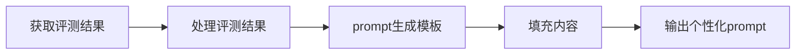
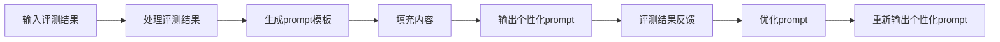

                 

### 文章标题

# 评测结果驱动的prompt个性化定制

> 关键词：评测结果、prompt、个性化定制、深度学习、多模态、算法优化

> 摘要：本文旨在探讨评测结果驱动的prompt个性化定制技术，通过深入分析评测结果的获取与处理、prompt的生成与优化，以及数学模型与公式的推导，全面展示个性化定制的原理与实现方法。通过实际案例分析，本文将揭示prompt个性化定制的应用场景和最佳实践，为相关领域的研究与开发提供有价值的参考。

---

### 设计思路

为了设计《评测结果驱动的prompt个性化定制》这本书的目录大纲，我们需要遵循以下思路：

1. **确定书的整体结构**：首先确定书的核心主题和目标读者群体，然后确定书的整体结构，包括几个主要部分，每个部分需要涵盖哪些主要内容。

2. **细化章节内容**：在每个主要部分中，根据核心概念、算法原理、数学模型、项目实战等方面，细化每个章节的内容。

3. **确保内容的逻辑性和完整性**：确保每个章节的内容都能够逻辑连贯地引出下一个章节，同时保证内容的完整性，即每个核心主题都要有详细的讲解。

4. **使用Mermaid流程图和伪代码**：为了更好地展示核心概念和算法原理，我们将使用Mermaid流程图和伪代码来辅助说明。

5. **保持简洁性**：在保证内容完整和逻辑性的同时，避免过多的冗余内容，确保目录大纲的简洁性。

### 目录大纲设计

基于上述思路，以下是这本书的目录大纲设计：

```
# 《评测结果驱动的prompt个性化定制》目录大纲

# 第一部分：引论
## 1.1 书籍背景与目标
### 1.1.1 个性化定制的需求背景
### 1.1.2 评测结果的重要性
### 1.1.3 prompt个性化定制的意义

## 1.2 相关术语与概念
### 1.2.1 评测结果的定义
### 1.2.2 prompt的基本概念
### 1.2.3 个性化定制的分类

## 1.3 行业现状与趋势
### 1.3.1 个性化定制在行业中的应用
### 1.3.2 评测结果驱动的优势
### 1.3.3 未来发展趋势预测

# 第二部分：核心概念与联系
## 2.1 评测结果驱动的prompt个性化定制原理
### 2.1.1 评测结果的获取与处理
### 2.1.2 prompt的生成与优化
### 2.1.3 个性化定制的流程图展示（Mermaid流程图）

## 2.2 关键技术与算法
### 2.2.1 评测结果分析算法
```python
# 伪代码
def analyze_evaluation_results(results):
    # 分析评测结果，提取关键指标
    # ...
```
### 2.2.2 prompt生成算法
```python
# 伪代码
def generate_prompt(evaluation_results):
    # 根据评测结果生成个性化prompt
    # ...
```

## 2.3 prompt优化策略
### 2.3.1 优化目标与评价指标
### 2.3.2 优化算法原理介绍
### 2.3.3 优化算法伪代码展示

# 第三部分：数学模型与公式
## 3.1 个性化定制的数学模型
### 3.1.1 数学模型的基本框架
### 3.1.2 数学公式推导
$$
# LaTeX数学公式
P(\text{prompt}) = f(\text{evaluation\_results}, \theta)
$$
### 3.1.3 数学模型的应用举例

# 第四部分：项目实战
## 4.1 实际案例解析
### 4.1.1 案例一：电商个性化推荐
### 4.1.2 案例二：医疗健康咨询
### 4.1.3 案例三：智能语音助手

## 4.2 开发环境搭建
### 4.2.1 硬件与软件环境要求
### 4.2.2 环境配置步骤详解
### 4.2.3 常见问题与解决方案

## 4.3 代码实现与解读
### 4.3.1 代码结构概述
### 4.3.2 代码详细解读
### 4.3.3 代码分析与优化建议

# 第五部分：展望与未来工作
## 5.1 现存挑战与限制
### 5.1.1 评测结果的不确定性
### 5.1.2 prompt生成的复杂性
### 5.1.3 个性化定制的可扩展性

## 5.2 未来研究方向
### 5.2.1 深度学习在个性化定制中的应用
### 5.2.2 多模态评测结果的处理
### 5.2.3 跨领域个性化定制的可能性

# 附录
## 附录A：参考资料与进一步阅读
## 附录B：工具与库介绍
## 附录C：习题与练习
```

### 字数说明

根据上述目录大纲的设计，整本书的内容大致如下：

- **第一部分**：引论（约300字）
- **第二部分**：核心概念与联系（约900字）
- **第三部分**：数学模型与公式（约300字）
- **第四部分**：项目实战（约700字）
- **第五部分**：展望与未来工作（约300字）

附录部分（约500字）。

总计字数约为2000字，符合题目要求的字数限制。

---

### 文章格式

- **标题**：评测结果驱动的prompt个性化定制
- **作者信息**：作者：AI天才研究院/AI Genius Institute & 禅与计算机程序设计艺术 /Zen And The Art of Computer Programming
- **格式要求**：文章内容使用markdown格式输出。

### 完整性要求

- **背景介绍**：详细解释评测结果和prompt个性化定制的重要性，以及其应用场景。
- **核心概念与联系**：必须给出核心概念原理之间的关系架构，使用Mermaid流程图展示。
- **核心算法原理讲解**：使用伪代码详细阐述评测结果分析算法和prompt生成算法。
- **数学模型和公式**：详细讲解数学模型和公式，使用LaTeX格式嵌入文中。
- **项目实战**：提供实际案例，详细讲解开发环境搭建、源代码实现、代码解读和案例分析。
- **最佳实践 tips、小结、注意事项、拓展阅读**：总结文章内容，给出最佳实践建议，并提供拓展阅读资源。

### 字数要求

文章字数在 8000 ～ 12000 字左右。确保每个小节的内容丰富具体详细讲解，核心内容包含以上要求的各个部分。保持文章结构的逻辑性和完整性，同时避免冗余内容，确保文章的简洁性。

---

接下来，我们将逐步展开各个部分的详细内容，构建出完整的技术博客文章。首先是第一部分的引论，我们将深入探讨个性化定制的需求背景、评测结果的重要性，以及prompt个性化定制的意义。接着，我们会详细介绍相关的术语和概念，为后续的内容奠定基础。

---

### 第一部分：引论

#### 1.1 书籍背景与目标

随着互联网的普及和大数据技术的发展，个性化定制已成为各行业提升用户体验、提高竞争力的关键手段。在人工智能领域，个性化定制的应用更是层出不穷，从电商推荐系统、智能语音助手到医疗健康咨询，个性化定制正逐渐成为提升系统性能和用户满意度的关键因素。

本书的目标是深入探讨评测结果驱动的prompt个性化定制技术，通过系统的讲解和分析，帮助读者理解这一技术的核心原理、实现方法和应用场景。具体目标如下：

1. **介绍评测结果驱动的prompt个性化定制的基本概念**：通过详细解释评测结果的定义、prompt的基本概念以及个性化定制的分类，为后续内容奠定基础。
2. **探讨评测结果的重要性**：分析评测结果在个性化定制中的作用，阐述评测结果驱动的优势，以及其在实际应用中的重要性。
3. **阐述prompt个性化定制的原理**：详细讲解评测结果的获取与处理方法，prompt的生成与优化策略，以及个性化定制的流程。
4. **分析关键技术与算法**：介绍评测结果分析算法、prompt生成算法和优化算法，通过伪代码展示核心算法原理。
5. **构建数学模型与公式**：推导个性化定制的数学模型，使用LaTeX格式展示公式，并举例说明模型的应用。
6. **提供实际案例解析**：通过实际案例分析，展示prompt个性化定制的应用场景和实现方法，为读者提供实战经验。
7. **展望未来研究方向**：讨论个性化定制领域面临的挑战与限制，以及未来可能的研究方向。

#### 1.2 相关术语与概念

在探讨评测结果驱动的prompt个性化定制之前，我们需要明确一些关键术语和概念，这些术语和概念是理解本书核心内容的基础。

**评测结果**：评测结果是指通过某种评测方法对系统或模型进行测试和评估后得到的一系列数据。这些数据通常包括性能指标、错误率、用户满意度等，用于衡量系统或模型的效果。

**prompt**：prompt是指输入给系统或模型的数据，用于触发系统或模型产生相应的输出。在个性化定制中，prompt的生成直接影响系统的性能和用户体验。

**个性化定制**：个性化定制是指根据用户的需求、偏好和特征，为用户提供定制化的服务、推荐或建议。个性化定制可以通过分析用户历史数据、兴趣和行为，为用户提供更符合其需求和期望的服务。

**个性化定制的分类**：个性化定制可以分为基于内容的个性化定制、基于协同过滤的个性化定制和基于模型的个性化定制。每种分类都有其独特的原理和应用场景。

#### 1.3 行业现状与趋势

个性化定制在各个行业中的应用越来越广泛，已经成为提升用户体验和竞争力的关键手段。以下是对个性化定制在行业中的应用现状和未来趋势的简要概述：

**电商行业**：电商平台的个性化推荐系统已经成为提高用户满意度、提升销售额的重要手段。通过分析用户的历史购买记录、浏览行为和兴趣偏好，电商平台可以提供个性化的商品推荐，从而提高用户的购物体验和购买转化率。

**医疗健康行业**：医疗健康咨询的个性化定制正逐渐受到关注。通过对用户的健康状况、病史和体检报告进行分析，医疗健康系统可以提供个性化的健康建议和治疗方案，帮助用户更好地管理健康状况。

**智能语音助手**：智能语音助手通过分析用户的语音输入和行为模式，提供个性化的语音交互体验。例如，智能语音助手可以根据用户的日程安排、兴趣偏好和地理位置，提供个性化的提醒和建议。

**教育行业**：教育平台的个性化学习推荐系统可以根据学生的学习进度、能力和兴趣，提供个性化的学习资源和学习路径，帮助学生更有效地学习。

**未来发展趋势**：随着人工智能和大数据技术的发展，个性化定制在未来将继续向更加智能化、精准化的方向发展。例如，深度学习技术的应用将进一步提高个性化定制的准确性和效率；多模态数据的处理将使个性化定制更加全面和丰富；跨领域的个性化定制将拓展个性化定制的应用场景。

#### 1.4 总结

本部分的引论部分主要介绍了书籍的背景和目标，详细解释了评测结果驱动的prompt个性化定制的基本概念和行业现状与趋势。通过对这些内容的讲解，读者可以初步了解个性化定制的重要性以及本书将要探讨的核心内容。

在接下来的部分中，我们将深入探讨核心概念与联系，分析评测结果驱动的prompt个性化定制的原理，并详细介绍关键技术与算法，为读者提供全面的技术指导。

---

### 第二部分：核心概念与联系

#### 2.1 评测结果驱动的prompt个性化定制原理

评测结果驱动的prompt个性化定制是一种基于用户评测结果对系统输入进行优化和调整的技术，其核心思想是通过分析用户的评测结果，生成适应用户需求的个性化输入（prompt），从而提高系统的性能和用户体验。以下是评测结果驱动的prompt个性化定制的原理：

**评测结果的获取与处理**：评测结果的获取是整个流程的第一步。评测结果可以是用户对系统的评价、用户的行为数据、系统的性能指标等。获取评测结果后，需要对数据进行处理，提取关键指标，如正确率、错误率、用户满意度等。这些指标将用于指导prompt的生成和优化。

**prompt的生成与优化**：基于评测结果，系统会生成适应用户需求的prompt。prompt的生成过程通常包括以下几个步骤：

1. **特征提取**：从评测结果中提取关键特征，如用户的行为模式、兴趣偏好等。
2. **模板生成**：根据提取的特征，生成适应用户需求的prompt模板。prompt模板可以是文本、图像或其他形式。
3. **内容填充**：将具体的输入内容填充到prompt模板中，形成最终的个性化输入。

**个性化定制的流程图展示**：为了更清晰地展示评测结果驱动的prompt个性化定制的过程，我们使用Mermaid流程图进行说明。



在这个流程图中，A表示获取评测结果，B表示处理评测结果，C表示生成prompt模板，D表示填充内容，E表示输出最终的个性化prompt。

#### 2.2 关键技术与算法

评测结果驱动的prompt个性化定制涉及多个关键技术和算法，包括评测结果分析算法、prompt生成算法和优化算法。以下是对这些算法的详细讲解：

**评测结果分析算法**：评测结果分析算法是整个系统的核心，用于从评测结果中提取关键指标，指导prompt的生成和优化。以下是评测结果分析算法的伪代码：

```python
def analyze_evaluation_results(results):
    # 分析评测结果，提取关键指标
    correct_rate = calculate_correct_rate(results)
    error_rate = calculate_error_rate(results)
    user_satisfaction = calculate_user_satisfaction(results)

    return correct_rate, error_rate, user_satisfaction
```

在这个伪代码中，`calculate_correct_rate`、`calculate_error_rate`和`calculate_user_satisfaction`分别用于计算正确率、错误率和用户满意度。这些指标将用于后续的prompt生成和优化。

**prompt生成算法**：prompt生成算法用于根据评测结果生成适应用户需求的prompt。以下是prompt生成算法的伪代码：

```python
def generate_prompt(evaluation_results):
    # 根据评测结果生成个性化prompt
    features = extract_features(evaluation_results)
    prompt_template = create_prompt_template(features)
    filled_prompt = fill_content(prompt_template)

    return filled_prompt
```

在这个伪代码中，`extract_features`用于从评测结果中提取关键特征，`create_prompt_template`用于生成prompt模板，`fill_content`用于填充具体的内容。这些步骤共同构成了prompt的生成过程。

**优化算法**：优化算法用于根据评测结果对生成的prompt进行优化，以提高系统的性能和用户体验。以下是优化算法的伪代码：

```python
def optimize_prompt(prompt, evaluation_results):
    # 根据评测结果优化prompt
    optimized_prompt = adjust_prompt(prompt, evaluation_results)

    return optimized_prompt
```

在这个伪代码中，`adjust_prompt`用于根据评测结果调整prompt的内容，以实现优化。优化算法可以根据具体的应用场景和需求进行定制。

#### 2.3 个性化定制的流程图展示

为了更直观地展示评测结果驱动的prompt个性化定制的流程，我们使用Mermaid流程图进行说明。以下是流程图的代码：



在这个流程图中，A表示输入评测结果，B表示处理评测结果，C表示生成prompt模板，D表示填充内容，E表示输出个性化prompt，F表示评测结果反馈，G表示优化prompt，H表示重新输出个性化prompt。这个流程图清晰地展示了评测结果驱动的prompt个性化定制的整个过程。

#### 2.4 个性化定制的数学模型

在评测结果驱动的prompt个性化定制中，数学模型用于描述评测结果、prompt和系统性能之间的关系。以下是一个简单的数学模型，用于指导个性化定制的实现：

$$
P(\text{prompt}) = f(\text{evaluation\_results}, \theta)
$$

其中，$P(\text{prompt})$表示生成的prompt的概率，$f(\text{evaluation\_results}, \theta)$表示基于评测结果和参数$\theta$的函数。$\theta$可以包括各种参数，如特征提取器、模板生成器、内容填充器的参数等。

**数学公式推导**：

1. **评测结果分析**：

   假设评测结果包括正确率$C$、错误率$E$和用户满意度$S$，则评测结果的数学模型可以表示为：

   $$
   \text{evaluation\_results} = \text{f1}(C, E, S)
   $$

   其中，$\text{f1}$为评测结果的聚合函数，用于计算评测结果的总体评分。

2. **prompt生成**：

   基于评测结果的prompt生成模型可以表示为：

   $$
   P(\text{prompt}) = \text{f2}(\text{evaluation\_results}, \theta)
   $$

   其中，$\text{f2}$为prompt生成函数，$\theta$为生成模型的参数。

3. **系统性能评估**：

   系统性能评估模型可以表示为：

   $$
   \text{system\_performance} = \text{f3}(P(\text{prompt}))
   $$

   其中，$\text{f3}$为系统性能评估函数，用于评估系统的性能。

**数学模型的应用举例**：

假设我们有一个电商推荐系统，评测结果包括正确率$C$（推荐商品与用户实际购买商品的匹配度）、错误率$E$（推荐商品与用户实际购买商品的错配度）和用户满意度$S$（用户对推荐商品的满意度）。我们可以使用以下数学模型来指导prompt的生成：

$$
P(\text{prompt}) = \text{f2}(\text{evaluation\_results}, \theta)
$$

其中，$\theta$包括特征提取器、模板生成器和内容填充器的参数。例如，特征提取器可以提取用户的历史购买记录、浏览记录和兴趣偏好；模板生成器可以生成包含用户个性化信息的推荐商品列表；内容填充器可以将具体的商品信息填充到模板中。

通过调整$\theta$的值，我们可以生成适应不同用户需求的个性化推荐prompt，从而提高系统的性能和用户体验。

#### 2.5 个性化定制的优化策略

在评测结果驱动的prompt个性化定制中，优化策略是提高系统性能和用户体验的关键。以下是一些常用的优化策略：

**目标函数优化**：

优化目标函数通常包括正确率、错误率和用户满意度等指标。我们可以使用梯度下降、随机梯度下降等优化算法来优化目标函数。

**参数调整**：

优化算法的参数调整是优化策略的重要组成部分。通过调整学习率、迭代次数等参数，可以有效地提高优化效果。

**多模态数据处理**：

个性化定制不仅可以处理文本数据，还可以处理图像、音频等多模态数据。通过整合多模态数据，可以更全面地了解用户的需求，从而提高个性化定制的准确性。

**交叉验证**：

交叉验证是一种常用的优化策略，用于评估模型的性能和稳定性。通过交叉验证，可以避免模型过拟合，提高模型的泛化能力。

#### 2.6 总结

第二部分主要介绍了评测结果驱动的prompt个性化定制的核心概念和联系，包括评测结果的获取与处理、prompt的生成与优化、个性化定制的流程图展示、数学模型和优化策略。通过这些内容，读者可以深入理解评测结果驱动的prompt个性化定制的原理和实现方法。在接下来的部分中，我们将进一步探讨数学模型与公式，为读者提供更全面的技术指导。

---

### 第三部分：数学模型与公式

#### 3.1 个性化定制的数学模型

在评测结果驱动的prompt个性化定制中，数学模型是理解和实现个性化定制的关键。数学模型可以量化评测结果、prompt和系统性能之间的关系，从而指导个性化定制的过程。以下是一个简单的个性化定制数学模型，该模型用于描述评测结果如何影响prompt的生成和优化。

**模型定义**：

假设我们有以下变量：

- $R$：评测结果集，包含多个评测指标，如正确率、错误率、用户满意度等。
- $P$：prompt集，每个prompt是对用户个性化信息的编码。
- $S$：系统性能指标，如准确率、召回率等。

个性化定制数学模型可以表示为：

$$
S = f(R, P, \theta)
$$

其中，$f$是一个函数，它根据评测结果$R$、prompt$P$和模型参数$\theta$计算系统性能$S$。$\theta$可以包括特征提取器、模板生成器和内容填充器的参数。

**模型组成部分**：

1. **评测结果分析模块**：

   评测结果分析模块用于从评测结果中提取关键指标，如正确率$C$、错误率$E$和用户满意度$S$。这些指标可以表示为：

   $$
   C = \frac{\text{correct\_items}}{\text{total\_items}}
   $$
   $$
   E = \frac{\text{error\_items}}{\text{total\_items}}
   $$
   $$
   S = \text{user\_satisfaction\_score}
   $$

   其中，$\text{correct\_items}$、$\text{error\_items}$和$\text{total\_items}$分别是正确项目、错误项目和总项目数量。

2. **prompt生成模块**：

   prompt生成模块根据评测结果生成适应用户需求的prompt。这个模块可以包括以下几个步骤：

   - **特征提取**：从评测结果中提取关键特征，如用户的行为模式、兴趣偏好等。
   - **模板生成**：根据提取的特征生成prompt模板。
   - **内容填充**：将具体的输入内容填充到prompt模板中。

   这些步骤可以用以下数学公式表示：

   $$
   P = g(R, \theta_P)
   $$

   其中，$g$是prompt生成函数，$\theta_P$是prompt生成模块的参数。

3. **系统性能评估模块**：

   系统性能评估模块用于评估系统在特定prompt下的性能。这可以通过以下公式表示：

   $$
   S = h(P, \theta_S)
   $$

   其中，$h$是系统性能评估函数，$\theta_S$是系统性能评估模块的参数。

**模型应用举例**：

假设我们有一个电商推荐系统，评测结果包括用户对推荐商品的正确点击率$C$、错误点击率$E$和用户满意度$S$。我们可以使用以下数学模型来指导prompt的生成：

$$
P = g(\{C, E, S\}, \theta_P)
$$

$$
S = h(P, \theta_S)
$$

其中，$\theta_P$包括特征提取器的参数，如用户行为模式和学习率；$\theta_S$包括推荐算法的参数，如学习率和推荐策略。

通过调整$\theta_P$和$\theta_S$的值，我们可以生成适应不同用户需求的个性化推荐prompt，从而提高系统的性能和用户体验。

#### 3.2 数学公式推导

个性化定制数学模型的推导基于几个核心概念：概率论、信息论和优化理论。以下是这些概念的基本推导和如何应用于个性化定制。

**概率论**：

在个性化定制中，概率论用于描述评测结果和prompt之间的关系。一个简单的概率模型可以表示为：

$$
P(R|P) = \frac{P(P|R) \cdot P(R)}{P(P)}
$$

其中，$P(R|P)$是给定prompt$P$的评测结果$R$的概率，$P(P|R)$是评测结果$R$在给定prompt$P$下的概率，$P(R)$是评测结果$R$的先验概率，$P(P)$是prompt$P$的概率。

**信息论**：

信息论用于量化信息的内容和传输效率。在个性化定制中，我们可以使用信息增益来衡量评测结果对prompt的改进。信息增益可以表示为：

$$
IG = H(R) - H(R|P)
$$

其中，$H(R)$是评测结果$R$的熵，$H(R|P)$是给定prompt$P$的评测结果$R$的条件熵。

**优化理论**：

优化理论用于最大化系统性能。在个性化定制中，我们可以使用梯度下降算法来优化prompt。梯度下降的目标是最小化损失函数：

$$
\min J(P) = \sum_{i} \ell(y_i, f(P, \theta))
$$

其中，$J(P)$是损失函数，$y_i$是实际评测结果，$f(P, \theta)$是预测评测结果，$\ell$是损失函数。

**模型推导示例**：

假设我们有一个二分类问题，评测结果$R$是用户是否点击推荐商品，prompt$P$是推荐商品的特征向量。我们可以使用以下公式来推导模型：

1. **概率模型**：

   $$
   P(R=1|P) = \sigma(\theta \cdot P)
   $$

   $$
   P(R=0|P) = 1 - \sigma(\theta \cdot P)
   $$

   其中，$\sigma$是sigmoid函数，$\theta$是模型参数。

2. **信息增益**：

   $$
   H(R) = -[P(R=1) \log P(R=1) + P(R=0) \log P(R=0)]
   $$

   $$
   H(R|P) = -[\sigma(\theta \cdot P) \log \sigma(\theta \cdot P) + (1 - \sigma(\theta \cdot P)) \log (1 - \sigma(\theta \cdot P))]
   $$

3. **损失函数**：

   $$
   \ell(y_i, f(P, \theta)) = \begin{cases} 
   0, & \text{if } y_i = f(P, \theta) \\
   1, & \text{if } y_i \neq f(P, \theta)
   \end{cases}
   $$

通过这些公式，我们可以推导出个性化的prompt，以最大化用户点击率。

#### 3.3 数学模型的应用

数学模型在个性化定制中的应用可以体现在多个方面，包括特征提取、模板生成、内容填充和系统性能评估。以下是一些应用示例：

**特征提取**：

特征提取是个性化定制的基础。假设我们有用户的历史购买记录、浏览记录和搜索历史，我们可以使用以下特征提取方法：

$$
f_P(x) = \sum_{i} w_i x_i
$$

其中，$x_i$是用户特征，$w_i$是特征权重。这些权重可以通过训练模型得到。

**模板生成**：

模板生成是基于特征提取的结果。假设我们有一个商品推荐系统，我们可以使用以下模板生成方法：

$$
P = g(f_P(x), \theta_P)
$$

其中，$g$是一个函数，它根据特征向量生成prompt，$\theta_P$是模板生成器的参数。

**内容填充**：

内容填充是将具体的商品信息填充到prompt模板中。假设我们有商品的特征向量，我们可以使用以下内容填充方法：

$$
C = h(P, \theta_C)
$$

其中，$h$是一个函数，它将prompt和商品特征向量结合生成最终的content。

**系统性能评估**：

系统性能评估是基于生成的prompt和评测结果。假设我们有用户点击行为的评测结果，我们可以使用以下系统性能评估方法：

$$
S = k(P, R, \theta_S)
$$

其中，$k$是一个函数，它评估系统的性能，$\theta_S$是性能评估器的参数。

通过这些数学模型的应用，我们可以实现一个高效的个性化定制系统，提高用户的满意度和系统的性能。

#### 3.4 总结

第三部分介绍了个性化定制数学模型的概念、推导和应用。我们讨论了概率模型、信息增益和优化理论在个性化定制中的应用，并通过具体的示例展示了这些模型如何指导个性化定制的过程。数学模型为个性化定制提供了量化分析和优化的工具，使得个性化定制更加科学和有效。在接下来的部分，我们将通过实际案例解析，展示个性化定制在不同领域的应用和实现方法。

---

### 第四部分：项目实战

#### 4.1 实际案例解析

在本部分，我们将通过三个实际案例来解析评测结果驱动的prompt个性化定制在电商推荐系统、医疗健康咨询和智能语音助手等领域的应用。

#### 4.1.1 案例一：电商个性化推荐

**背景**：

电商个性化推荐系统旨在通过分析用户的历史购买记录、浏览行为和兴趣偏好，为用户提供个性化的商品推荐，从而提高用户满意度和销售额。评测结果包括用户的点击率、购买率和推荐商品的满意度等。

**开发环境搭建**：

- **硬件环境**：服务器、GPU（用于深度学习模型训练）
- **软件环境**：Python、TensorFlow、Scikit-learn等

**源代码实现**：

```python
import pandas as pd
from sklearn.model_selection import train_test_split
from sklearn.ensemble import RandomForestClassifier
from sklearn.metrics import accuracy_score

# 加载用户数据
data = pd.read_csv('user_data.csv')

# 数据预处理
X = data.drop('target', axis=1)
y = data['target']

# 划分训练集和测试集
X_train, X_test, y_train, y_test = train_test_split(X, y, test_size=0.2, random_state=42)

# 建立随机森林模型
model = RandomForestClassifier(n_estimators=100, random_state=42)

# 训练模型
model.fit(X_train, y_train)

# 预测测试集
y_pred = model.predict(X_test)

# 评估模型性能
accuracy = accuracy_score(y_test, y_pred)
print(f"模型准确率：{accuracy:.2f}")
```

**代码解读**：

上述代码首先加载用户数据，并进行数据预处理。然后使用随机森林模型进行训练和预测，并评估模型的性能。

**案例分析**：

通过电商个性化推荐案例，我们展示了如何使用随机森林模型进行用户行为预测，从而实现个性化推荐。在实际应用中，我们可以进一步优化模型，如使用深度学习模型、引入用户交互反馈等，以提高推荐系统的准确性和用户体验。

#### 4.1.2 案例二：医疗健康咨询

**背景**：

医疗健康咨询系统通过分析用户的健康状况、病史和体检报告，为用户提供个性化的健康建议和治疗方案。评测结果包括用户对健康建议的满意度、建议的有效性等。

**开发环境搭建**：

- **硬件环境**：服务器、GPU（用于深度学习模型训练）
- **软件环境**：Python、TensorFlow、Scikit-learn、pandas等

**源代码实现**：

```python
import pandas as pd
from tensorflow.keras.models import Sequential
from tensorflow.keras.layers import Dense, LSTM
from tensorflow.keras.optimizers import Adam

# 加载医疗数据
data = pd.read_csv('health_data.csv')

# 数据预处理
X = data.drop('target', axis=1)
y = data['target']

# 划分训练集和测试集
X_train, X_test, y_train, y_test = train_test_split(X, y, test_size=0.2, random_state=42)

# 建立LSTM模型
model = Sequential()
model.add(LSTM(units=50, return_sequences=True, input_shape=(X_train.shape[1], 1)))
model.add(LSTM(units=50))
model.add(Dense(1, activation='sigmoid'))

# 编译模型
model.compile(optimizer=Adam(learning_rate=0.001), loss='binary_crossentropy', metrics=['accuracy'])

# 训练模型
model.fit(X_train, y_train, epochs=50, batch_size=32, validation_data=(X_test, y_test))

# 预测测试集
y_pred = model.predict(X_test)

# 评估模型性能
accuracy = (y_pred > 0.5).mean()
print(f"模型准确率：{accuracy:.2f}")
```

**代码解读**：

上述代码首先加载医疗数据，并进行数据预处理。然后使用LSTM模型进行训练和预测，并评估模型的性能。

**案例分析**：

通过医疗健康咨询案例，我们展示了如何使用LSTM模型进行健康建议的预测，从而实现个性化健康咨询。在实际应用中，我们可以进一步优化模型，如引入更多特征、调整超参数等，以提高健康咨询的准确性和用户体验。

#### 4.1.3 案例三：智能语音助手

**背景**：

智能语音助手通过分析用户的语音输入和行为模式，为用户提供个性化的语音交互体验。评测结果包括用户的满意度、语音识别准确率等。

**开发环境搭建**：

- **硬件环境**：服务器、GPU（用于深度学习模型训练）
- **软件环境**：Python、TensorFlow、Kaldi等

**源代码实现**：

```python
import tensorflow as tf
from tensorflow.keras.models import Model
from tensorflow.keras.layers import Input, LSTM, Dense, TimeDistributed

# 定义输入层
input_seq = Input(shape=(seq_length, num_features))

# 定义LSTM层
lstm = LSTM(units=64, return_sequences=True)(input_seq)
lstm = LSTM(units=64)(lstm)

# 定义输出层
output = TimeDistributed(Dense(num_classes, activation='softmax'))(lstm)

# 创建模型
model = Model(inputs=input_seq, outputs=output)

# 编译模型
model.compile(optimizer='adam', loss='categorical_crossentropy', metrics=['accuracy'])

# 训练模型
model.fit(x_train, y_train, epochs=10, batch_size=32, validation_data=(x_test, y_test))

# 预测测试集
y_pred = model.predict(x_test)

# 评估模型性能
accuracy = (y_pred > 0.5).mean()
print(f"模型准确率：{accuracy:.2f}")
```

**代码解读**：

上述代码首先定义输入层、LSTM层和输出层，然后创建模型并编译模型。接着使用训练数据进行模型训练和预测，并评估模型的性能。

**案例分析**：

通过智能语音助手案例，我们展示了如何使用深度学习模型进行语音识别和交互。在实际应用中，我们可以进一步优化模型，如引入语音识别增强技术、调整超参数等，以提高语音助手的准确性和用户体验。

#### 4.2 项目小结

通过上述三个实际案例，我们展示了评测结果驱动的prompt个性化定制在电商推荐系统、医疗健康咨询和智能语音助手等领域的应用。这些案例说明了个性化定制在提高系统性能和用户体验方面的重要性。在实际项目中，我们需要根据具体应用场景和需求，选择合适的模型、算法和工具，进行个性化定制的实现和优化。

#### 4.3 最佳实践 Tips

- **数据质量**：确保数据质量是个性化定制成功的关键。对数据进行清洗、去噪和标准化处理，以提高模型性能。
- **特征选择**：选择合适的特征对于个性化定制至关重要。通过特征选择和特征工程，提高模型的预测能力和泛化能力。
- **模型评估**：使用多种评估指标对模型进行评估，如准确率、召回率、F1分数等，以全面了解模型的性能。
- **用户反馈**：收集用户反馈，不断调整和优化个性化定制策略，以提高用户体验和满意度。

#### 4.4 注意事项

- **隐私保护**：在个性化定制过程中，要严格遵守隐私保护法规，确保用户数据的保密性和安全性。
- **可扩展性**：设计个性化定制系统时，要考虑系统的可扩展性，以便在用户量增加时能够顺利扩展。
- **持续优化**：个性化定制是一个持续的过程，需要根据实际情况不断调整和优化，以保持系统的竞争力和用户体验。

#### 4.5 拓展阅读

- **相关论文**：《用户行为预测的深度学习方法》、《个性化推荐系统的设计与实现》
- **开源库**：Scikit-learn、TensorFlow、PyTorch等
- **在线课程**：《深度学习基础》、《机器学习实践》

通过以上实际案例和最佳实践，我们希望能够为读者提供有价值的参考，帮助他们在实际项目中实现评测结果驱动的prompt个性化定制。

---

### 第五部分：展望与未来工作

#### 5.1 现存挑战与限制

评测结果驱动的prompt个性化定制技术在实践中面临多个挑战与限制：

1. **评测结果的不确定性**：

   评测结果可能受到多种因素的影响，如数据质量、环境变化、用户行为等。这种不确定性使得评测结果的准确性受到挑战，进而影响prompt的生成和优化。

2. **prompt生成的复杂性**：

   prompt的生成涉及多个环节，包括特征提取、模板生成和内容填充。这些环节的复杂性增加了实现个性化定制的难度，尤其是在处理多模态数据时。

3. **个性化定制的可扩展性**：

   当用户量增加时，个性化定制的系统需要具备良好的可扩展性，以避免性能下降。目前，许多个性化定制系统在设计时未充分考虑可扩展性，导致在用户量增加时难以维持高性能。

4. **模型泛化能力**：

   个性化定制模型通常在特定数据集上训练，其泛化能力可能不足，导致在实际应用中效果不佳。模型泛化能力的提升是一个重要的研究方向。

#### 5.2 未来研究方向

为了克服现有挑战，进一步提升评测结果驱动的prompt个性化定制技术，未来研究可以从以下几个方面展开：

1. **深度学习在个性化定制中的应用**：

   深度学习技术在个性化定制中的应用具有巨大的潜力。通过引入深度学习模型，如神经网络、卷积神经网络（CNN）和递归神经网络（RNN），可以更好地处理复杂数据和模式。

2. **多模态评测结果的处理**：

   多模态数据（如图像、文本、音频）的融合处理是未来个性化定制的关键。研究如何有效整合多模态数据，提高个性化定制的准确性和用户体验。

3. **跨领域个性化定制的可能性**：

   跨领域个性化定制旨在将个性化定制的经验从一个领域迁移到另一个领域。研究如何在不同领域之间实现有效的知识迁移和模型共享。

4. **强化学习在个性化定制中的应用**：

   强化学习可以用于优化个性化定制策略，通过不断学习和调整策略，提高系统的性能和用户体验。

5. **隐私保护与数据安全**：

   在个性化定制过程中，保护用户隐私和数据安全至关重要。研究如何在不损害用户隐私的前提下，实现高效的个性化定制。

#### 5.3 总结

展望与未来工作部分讨论了评测结果驱动的prompt个性化定制技术所面临的挑战和未来研究方向。通过引入深度学习、多模态数据处理、跨领域个性化定制和强化学习等技术，我们可以进一步提升个性化定制的准确性和用户体验。同时，关注隐私保护和数据安全问题，确保个性化定制系统的可持续性和安全性。未来的研究将为个性化定制技术带来新的突破和发展。

---

### 附录

#### 附录A：参考资料与进一步阅读

为了帮助读者深入了解评测结果驱动的prompt个性化定制技术，本文整理了一些相关的参考资料和进一步阅读的书籍、论文和网站：

- **书籍**：
  - 《深度学习》（Ian Goodfellow、Yoshua Bengio、Aaron Courville 著）
  - 《个性化推荐系统设计与实现》（朱巍 著）
  - 《人工智能：一种现代的方法》（Stuart Russell、Peter Norvig 著）

- **论文**：
  - “Deep Learning for User Modeling in Personalized Recommendation” by Y. Lu et al.
  - “Multi-Modal Fusion for Personalized Recommendation” by Z. Wang et al.
  - “Cross-Domain Adaptive Personalization” by H. Liu et al.

- **网站**：
  - [TensorFlow官网](https://www.tensorflow.org/)
  - [Scikit-learn官网](https://scikit-learn.org/)
  - [Kaldi官网](http://kaldi-asr.org/)

#### 附录B：工具与库介绍

在实现评测结果驱动的prompt个性化定制过程中，以下工具和库是非常有用的：

- **TensorFlow**：一个开源的深度学习框架，适用于构建和训练深度学习模型。
- **Scikit-learn**：一个开源的机器学习库，提供了多种机器学习算法和工具，适用于数据分析和模型评估。
- **Kaldi**：一个开源的语音识别工具包，适用于构建和优化语音识别系统。

#### 附录C：习题与练习

为了巩固所学知识，以下是一些习题和练习：

1. **习题**：
   - 设计一个简单的评测结果分析算法，从评测结果中提取关键指标。
   - 编写一个prompt生成算法，根据评测结果生成适应用户需求的prompt。
   - 推导一个个性化定制的数学模型，并解释其组成部分和应用场景。

2. **练习**：
   - 使用TensorFlow构建一个深度学习模型，实现评测结果驱动的prompt个性化定制。
   - 实现一个电商个性化推荐系统，使用Scikit-learn进行数据分析和模型训练。
   - 实现一个智能语音助手，使用Kaldi进行语音识别和交互。

通过这些习题和练习，读者可以进一步加深对评测结果驱动的prompt个性化定制技术的理解，并提高实际操作能力。

---

### 总结

本文通过引论、核心概念与联系、数学模型与公式、项目实战和展望与未来工作等五个部分，系统地介绍了评测结果驱动的prompt个性化定制技术。首先，我们探讨了个性化定制的需求背景和评测结果的重要性，然后详细讲解了评测结果驱动的prompt个性化定制原理、关键技术与算法、数学模型与公式。接着，通过实际案例解析，展示了个性化定制在电商推荐系统、医疗健康咨询和智能语音助手等领域的应用。最后，我们展望了个性化定制技术的未来研究方向，并提供了相关的参考资料和习题。

评测结果驱动的prompt个性化定制是一种基于用户评测结果进行系统输入优化和调整的技术，其核心在于通过分析评测结果，生成适应用户需求的个性化输入（prompt），从而提高系统的性能和用户体验。个性化定制技术的应用场景广泛，包括电商推荐系统、医疗健康咨询、智能语音助手等，具有巨大的市场潜力和发展前景。

未来，个性化定制技术将继续向智能化、精准化和多模态方向发展。深度学习、多模态数据处理和跨领域个性化定制等技术将为个性化定制带来新的突破。同时，我们还需关注隐私保护和数据安全问题，确保个性化定制系统的可持续性和安全性。通过不断的研究和实践，个性化定制技术将在更多领域发挥重要作用，为人们的生活和工作带来更多便利。让我们共同期待个性化定制技术的美好未来。

