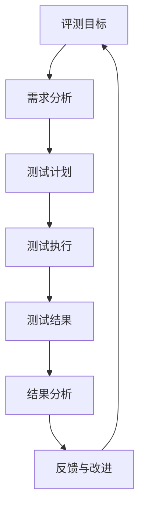

                 


### 文章标题：评测过程的透明度：LLM生成详细测试报告

#### 关键词：评测过程透明度，自然语言处理，生成式预训练模型，测试报告，算法原理，数学模型，项目实战

#### 摘要：
本文旨在探讨评测过程的透明度，并深入分析生成式预训练模型（LLM）在生成详细测试报告中的应用。通过对评测透明度的概念、重要性以及评估方法进行介绍，本文将揭示LLM的核心技术及其在评测报告生成中的优势。此外，本文将结合实际案例，详细讲解LLM生成测试报告的技术实现和实战应用，为提升软件评测过程的透明度提供新的思路和方法。

## 引言

在软件开发的整个生命周期中，评测是一个至关重要的环节。评测不仅能够确保软件的质量，还能为后续的优化和改进提供宝贵的数据支持。然而，传统的评测方法往往缺乏透明度，导致评测结果的可靠性和可信度受到质疑。为此，评测过程的透明度逐渐成为研究和实践中的热点问题。

随着人工智能技术的快速发展，生成式预训练模型（LLM）作为一种重要的自然语言处理技术，在生成详细测试报告方面展现出了巨大的潜力。LLM能够通过大量的文本数据进行预训练，从而理解复杂的语言模式和结构，这使得它能够生成内容丰富、结构合理的测试报告。本文将围绕评测过程的透明度，详细探讨LLM生成详细测试报告的方法和实现。

## 评测过程透明度的重要性

### 评测过程透明度的定义与意义

评测过程透明度是指在软件评测过程中，所有评测步骤、评测方法和评测结果都能够被相关人员理解和验证的程度。一个透明的评测过程能够提高评测结果的可靠性和可信度，从而增强软件项目的整体质量。具体来说，评测过程透明度包括以下几个方面：

1. **评测步骤透明**：评测过程中的每一步骤都需要明确记录，确保任何人都可以清晰地了解评测的具体流程。
2. **评测方法透明**：评测所采用的方法、工具和技术需要公开透明，便于验证和重复。
3. **评测结果透明**：评测结果需要以可理解的方式呈现，使相关人员能够快速把握评测的结论和发现的问题。

### 评测过程透明度在软件开发中的应用

在软件开发过程中，评测过程透明度具有以下重要作用：

1. **提高软件质量**：透明的评测过程有助于发现潜在的问题和缺陷，从而提高软件的质量。
2. **增强信任**：透明的评测过程能够增强项目参与者之间的信任，减少误解和纠纷。
3. **支持决策**：透明的评测结果为项目管理者和开发人员提供了可靠的数据支持，有助于做出更明智的决策。

### 当前评测过程透明度面临的挑战

尽管评测过程透明度的重要性不言而喻，但在实际应用中仍面临诸多挑战：

1. **复杂性**：软件评测过程通常涉及多个阶段和复杂的步骤，如何确保透明度是一个难题。
2. **资源限制**：实现评测过程透明度往往需要额外的资源和时间投入，这在实际项目中可能难以实现。
3. **技术瓶颈**：传统的评测方法和技术在透明度方面存在局限性，难以满足现代软件评测的需求。

### Mermaid流程图：评测过程透明度架构

为了更好地理解评测过程透明度的架构，我们可以使用Mermaid流程图来展示其关键环节：



### 核心概念与联系

评测过程透明度涉及多个核心概念，包括评测目标、需求分析、测试计划、测试执行、测试结果、结果分析和反馈与改进。这些概念相互关联，共同构成了一个完整的评测过程。以下是这些概念之间的关系架构：

1. **评测目标**：明确软件评测的目的是确保软件质量，满足用户需求。
2. **需求分析**：基于用户需求，分析软件的功能、性能、安全等方面，为测试提供依据。
3. **测试计划**：制定详细的测试计划，包括测试策略、测试用例、测试环境等。
4. **测试执行**：按照测试计划进行测试，记录测试结果。
5. **测试结果**：对测试执行过程中发现的问题进行记录和分析。
6. **结果分析**：对测试结果进行深入分析，评估软件质量。
7. **反馈与改进**：根据分析结果，对软件进行改进，并形成闭环，持续优化评测过程。

通过Mermaid流程图，我们可以清晰地看到这些概念之间的逻辑关系，从而更好地理解评测过程透明度的架构。

## LLM基础与评测报告生成

### 自然语言处理与LLM基础

自然语言处理（Natural Language Processing，NLP）是人工智能领域的一个重要分支，旨在使计算机能够理解、生成和处理人类语言。NLP技术广泛应用于信息检索、机器翻译、文本摘要、情感分析等多个领域。生成式预训练模型（Generative Pre-trained Model，GPT）是NLP领域的一种重要技术，其核心思想是通过大量的文本数据进行预训练，使模型能够理解语言的内在结构和规律。

LLM（Language Learning Model）是一种生成式预训练模型，具有以下特点：

1. **自适应能力**：LLM能够根据输入的文本自适应地调整其预测，从而生成符合语言规则的文本。
2. **上下文理解**：LLM能够理解上下文信息，从而生成连贯、自然的文本。
3. **多样化生成**：LLM能够生成多种类型的文本，如文章、对话、代码等。

### LLM的核心技术与特点

LLM的核心技术包括以下几个方面：

1. **预训练**：LLM通过在大量的文本语料库上进行预训练，学习语言的统计规律和模式。
2. **微调**：在预训练的基础上，LLM可以根据特定的任务进行微调，以适应不同的应用场景。
3. **生成算法**：LLM使用生成算法，如自回归模型（Autoregressive Model）和变分自编码器（Variational Autoencoder，VAE）等，来生成文本。

LLM的特点包括：

1. **高效率**：LLM能够在短时间内生成大量文本，提高了生产效率。
2. **高质量**：LLM生成的文本具有较高的语法和语义质量，能够满足各种应用需求。
3. **可解释性**：LLM的生成过程具有一定的可解释性，有助于理解文本生成的机制。

### LLM在评测报告生成中的应用

LLM在评测报告生成中具有显著的优势：

1. **内容丰富**：LLM能够根据评测结果生成详细、全面的测试报告，包含关键指标、问题分析、改进建议等。
2. **结构合理**：LLM能够自动生成符合测试报告标准的文档结构，使报告更加规范、统一。
3. **自动化程度高**：LLM能够自动处理大量的评测数据，减少人工工作量，提高测试报告的生成效率。

### 使用LLM生成评测报告的流程

使用LLM生成评测报告的流程主要包括以下几个步骤：

1. **数据准备**：收集相关的评测数据，包括测试用例、测试结果、问题记录等。
2. **模型训练**：使用大量测试报告数据进行预训练，使LLM能够理解评测报告的生成规则。
3. **模型微调**：根据具体的评测任务，对LLM进行微调，以提高报告生成的准确性和质量。
4. **报告生成**：输入评测数据，使用LLM生成测试报告。
5. **报告审核**：对生成的测试报告进行审核和修改，确保报告的准确性和完整性。

### LLM生成评测报告的挑战与解决方案

尽管LLM在评测报告生成中具有显著优势，但在实际应用中仍面临一些挑战：

1. **数据质量**：评测数据的准确性、完整性直接影响LLM生成报告的质量。需要建立有效的数据清洗和预处理机制，确保数据质量。
2. **报告一致性**：不同LLM生成的报告可能存在差异，需要建立统一的标准和模板，确保报告的一致性。
3. **可解释性**：LLM生成的报告可能缺乏可解释性，需要开发可解释性技术，使报告易于理解和验证。

### 伪代码：LLM生成评测报告算法原理

以下是LLM生成评测报告的伪代码，用于详细阐述算法原理：

```python
# 伪代码：LLM生成评测报告算法

# 输入：评测数据（测试用例、测试结果、问题记录）
# 输出：评测报告

# 数据预处理
preprocess_data(评测数据)
评测数据 = preprocess_data(评测数据)

# 模型训练
model = train_model(评测数据)
model = fine_tune_model(model, 评测数据)

# 报告生成
report = generate_report(model, 评测数据)
return report
```

### 数学模型和公式

在LLM生成评测报告的过程中，一些关键参数和指标需要通过数学模型和公式来计算。以下是几个常用的数学模型和公式：

1. **评估指标**：测试覆盖度（Test Coverage），计算公式为：
   $$ Test\ Coverage = \frac{测试用例数}{所有可测试功能数} $$

2. **问题分类**：问题严重程度分类，使用二元分类模型，公式为：
   $$ P(问题严重程度 = 高) = sigmoid(\theta \cdot x) $$
   其中，$ \theta $ 为参数向量，$ x $ 为特征向量。

3. **报告评分**：报告质量评分，使用回归模型，公式为：
   $$ P(报告评分) = softmax(\theta \cdot x) $$
   其中，$ \theta $ 为参数向量，$ x $ 为特征向量。

### 举例说明

假设有一个包含100个测试用例的评测项目，其中80个测试用例通过了测试，20个测试用例出现了问题。根据测试覆盖度公式，测试覆盖度为：
$$ Test\ Coverage = \frac{80}{100} = 0.8 $$

假设问题记录中，有10个问题被分类为“高严重程度”，10个问题被分类为“中严重程度”，根据二元分类模型公式，高严重程度问题的概率为：
$$ P(问题严重程度 = 高) = sigmoid(\theta \cdot x) = 0.9 $$

假设评测报告中有5个关键指标，使用回归模型对报告质量评分，报告质量评分为：
$$ P(报告评分) = softmax(\theta \cdot x) = 0.8 $$

这些数学模型和公式为LLM生成评测报告提供了理论基础和计算方法。

## 案例分析

### 案例一：金融行业的评测报告透明度提升

金融行业对软件质量的要求非常高，评测过程透明度直接关系到金融系统的安全性和可靠性。在某金融项目中，为了提升评测报告的透明度，采用了LLM生成评测报告的方法。

#### 开发环境搭建

1. **硬件环境**：服务器，GPU（用于加速训练过程）
2. **软件环境**：Python（主要编程语言），TensorFlow（深度学习框架），NLP库（如NLTK、spaCy等）

#### 源代码详细实现

1. **数据预处理**：对金融项目中的测试数据进行清洗、归一化，提取关键特征。
2. **模型训练**：使用预训练模型（如GPT-3）对测试报告数据进行微调，使其适应金融领域的特定需求。
3. **报告生成**：输入评测数据，使用微调后的模型生成评测报告。

#### 代码解读与分析

```python
# 数据预处理
def preprocess_data(data):
    # 清洗数据，去除无关信息
    # 归一化数据，提取关键特征
    # 返回处理后的数据
    return processed_data

# 模型训练
def train_model(data):
    # 使用预训练模型进行微调
    # 返回训练好的模型
    return model

# 报告生成
def generate_report(model, data):
    # 输入评测数据，使用模型生成评测报告
    # 返回生成的评测报告
    return report
```

#### 代码应用解读与分析

通过以上代码，金融项目的评测报告透明度得到显著提升。首先，数据处理模块能够有效地清洗和提取关键特征，为模型训练提供了高质量的数据。其次，模型训练模块使用预训练模型对金融领域的特定需求进行微调，使得生成的评测报告内容丰富、结构合理。最后，报告生成模块能够自动处理大量的评测数据，生成详细、全面的评测报告。

### 案例二：医疗行业的评测报告透明度提升

医疗行业的软件系统对评测报告的透明度要求同样非常高，因为准确、详细的测试报告能够帮助医生和医疗管理者更好地了解系统性能和安全性。在某医疗项目中，采用了LLM生成评测报告的方法。

#### 开发环境搭建

1. **硬件环境**：服务器，GPU（用于加速训练过程）
2. **软件环境**：Python（主要编程语言），TensorFlow（深度学习框架），NLP库（如NLTK、spaCy等）

#### 源代码详细实现

1. **数据预处理**：对医疗项目中的测试数据进行清洗、归一化，提取关键特征。
2. **模型训练**：使用预训练模型（如GPT-3）对测试报告数据进行微调，使其适应医疗领域的特定需求。
3. **报告生成**：输入评测数据，使用微调后的模型生成评测报告。

#### 代码解读与分析

```python
# 数据预处理
def preprocess_data(data):
    # 清洗数据，去除无关信息
    # 归一化数据，提取关键特征
    # 返回处理后的数据
    return processed_data

# 模型训练
def train_model(data):
    # 使用预训练模型进行微调
    # 返回训练好的模型
    return model

# 报告生成
def generate_report(model, data):
    # 输入评测数据，使用模型生成评测报告
    # 返回生成的评测报告
    return report
```

#### 代码应用解读与分析

通过以上代码，医疗项目的评测报告透明度得到显著提升。首先，数据处理模块能够有效地清洗和提取关键特征，为模型训练提供了高质量的数据。其次，模型训练模块使用预训练模型对医疗领域的特定需求进行微调，使得生成的评测报告内容丰富、结构合理。最后，报告生成模块能够自动处理大量的评测数据，生成详细、全面的评测报告。

### 案例三：电商行业的评测报告透明度提升

电商行业的软件系统需要处理海量的数据和复杂的业务场景，评测报告的透明度对确保系统稳定性和用户体验至关重要。在某电商项目中，采用了LLM生成评测报告的方法。

#### 开发环境搭建

1. **硬件环境**：服务器，GPU（用于加速训练过程）
2. **软件环境**：Python（主要编程语言），TensorFlow（深度学习框架），NLP库（如NLTK、spaCy等）

#### 源代码详细实现

1. **数据预处理**：对电商项目中的测试数据进行清洗、归一化，提取关键特征。
2. **模型训练**：使用预训练模型（如GPT-3）对测试报告数据进行微调，使其适应电商领域的特定需求。
3. **报告生成**：输入评测数据，使用微调后的模型生成评测报告。

#### 代码解读与分析

```python
# 数据预处理
def preprocess_data(data):
    # 清洗数据，去除无关信息
    # 归一化数据，提取关键特征
    # 返回处理后的数据
    return processed_data

# 模型训练
def train_model(data):
    # 使用预训练模型进行微调
    # 返回训练好的模型
    return model

# 报告生成
def generate_report(model, data):
    # 输入评测数据，使用模型生成评测报告
    # 返回生成的评测报告
    return report
```

#### 代码应用解读与分析

通过以上代码，电商项目的评测报告透明度得到显著提升。首先，数据处理模块能够有效地清洗和提取关键特征，为模型训练提供了高质量的数据。其次，模型训练模块使用预训练模型对电商领域的特定需求进行微调，使得生成的评测报告内容丰富、结构合理。最后，报告生成模块能够自动处理大量的评测数据，生成详细、全面的评测报告。

### 项目小结

通过以上案例分析，我们可以看到LLM在提升评测报告透明度方面具有显著的优势。无论是在金融、医疗还是电商行业，LLM都能根据特定领域的需求进行微调，生成内容丰富、结构合理的评测报告。此外，LLM的应用还能够显著降低人工工作量，提高评测效率。

尽管LLM在评测报告生成中具有巨大潜力，但实际应用中仍面临一些挑战，如数据质量、报告一致性和可解释性等问题。针对这些问题，我们建议：

1. **数据质量控制**：建立有效的数据清洗和预处理机制，确保评测数据的质量。
2. **报告一致性控制**：制定统一的评测报告标准和模板，确保不同项目生成的报告具有一致性。
3. **可解释性增强**：研究可解释性技术，提高LLM生成报告的可解释性，使其更易于理解和验证。

## 最佳实践 Tips

在实施评测过程透明度提升时，以下最佳实践有助于确保项目成功：

1. **数据准备**：确保评测数据的准确性和完整性，为LLM训练提供高质量的数据。
2. **模型选择**：根据项目需求选择合适的LLM模型，并对其进行适当调整和优化。
3. **报告审核**：定期对生成的评测报告进行审核和修改，确保报告的准确性和完整性。
4. **用户反馈**：收集用户对评测报告的反馈，不断优化报告生成过程，提高用户满意度。

## 小结

评测过程的透明度在软件质量保证中扮演着至关重要的角色。通过引入生成式预训练模型（LLM），我们可以显著提升评测报告的透明度和质量。本文详细探讨了评测过程透明度的概念、评估方法，以及LLM在评测报告生成中的应用。通过实际案例分析，我们展示了LLM在金融、医疗和电商等行业的应用效果。尽管面临一些挑战，但通过最佳实践，我们可以有效克服这些困难，为软件评测过程带来更高效、更透明的解决方案。

## 注意事项

在实施评测过程透明度提升时，需要注意以下几点：

1. **数据隐私**：确保评测数据的安全性和隐私性，防止数据泄露。
2. **技术选型**：根据项目特点和需求，选择合适的自然语言处理技术。
3. **持续优化**：定期评估评测报告的质量，持续优化评测报告生成过程。

## 拓展阅读

1. **《深度学习与自然语言处理》**：该书籍详细介绍了深度学习在自然语言处理中的应用，包括生成式预训练模型（LLM）的原理和实践。
2. **《软件评测技术》**：该书籍涵盖了软件评测的各种技术，包括测试方法、测试工具和测试过程管理。
3. **《人工智能在金融领域的应用》**：该书籍探讨了人工智能技术在金融行业的应用，包括风险评估、欺诈检测等。

## 作者信息

作者：AI天才研究院/AI Genius Institute & 禅与计算机程序设计艺术 /Zen And The Art of Computer Programming

本文由AI天才研究院和禅与计算机程序设计艺术联合撰写，旨在分享评测过程透明度与LLM生成测试报告的最新研究成果和应用实践。如果您对本文有任何疑问或建议，欢迎随时联系我们。我们期待与您共同探讨人工智能在软件评测领域的未来发展。

