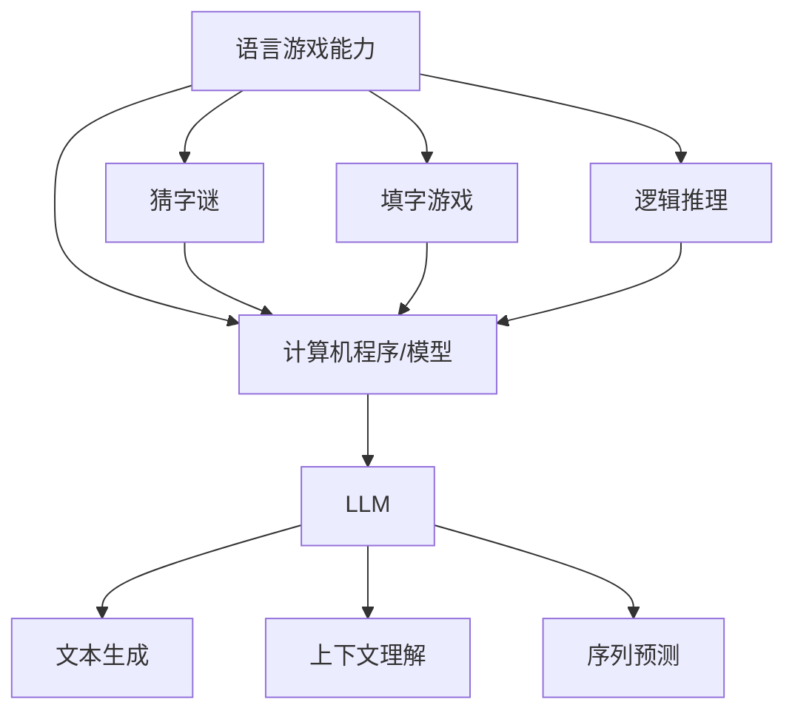

                 

# 语言游戏能力：检验LLM参与文字游戏的灵活性

## 摘要

本文深入探讨了语言游戏能力这一新兴领域，重点分析了大型语言模型（LLM）在这一领域的应用和灵活性。首先，我们介绍了语言游戏能力的概念，并阐述了LLM参与语言游戏的重要性和潜在优势。随后，本文通过Mermaid流程图展示了语言游戏能力、LLM及其核心算法之间的联系，为进一步理解提供了直观的视角。接着，我们详细讲解了LLM的基础原理和核心算法，并借助伪代码进行了深入剖析。在此基础上，本文介绍了与语言游戏能力相关的数学模型，使用LaTeX格式展示了关键公式，并对公式进行了详细讲解。此外，我们还提供了一个实际案例，展示了如何使用LLM参与文字游戏，从开发环境搭建到源代码实现和代码解读，全面展示了LLM在语言游戏中的实际应用。最后，本文总结了书中的关键点，讨论了未来研究方向和趋势，为读者提供了有价值的参考。通过本文的阅读，读者将能够全面了解语言游戏能力和LLM的深度结合，以及这一领域的发展前景。

### 设计思路

#### 核心概念与联系

语言游戏能力是指计算机程序或模型在理解、生成和处理语言游戏方面的能力，这包括但不限于猜字谜、填字游戏、逻辑推理等。这种能力是人工智能研究中的一个重要方向，因为它不仅能够提升机器的交互能力，还能够测试和提升其语言理解能力和创造力。

大型语言模型（LLM）是近年来人工智能领域的一个重要突破，它通过深度学习技术，对大量文本进行学习，从而掌握了丰富的语言知识和表达技巧。LLM的核心能力包括文本生成、上下文理解和序列预测等。

为了更直观地展示这些概念之间的联系，我们可以使用Mermaid流程图来描述。以下是一个简化的Mermaid流程图示例：



在这个流程图中，我们可以看到语言游戏能力通过计算机程序或模型（B）与LLM（C）相连，而LLM则通过其核心能力（D、E、F）与各种具体的语言游戏（G、H、I）相联系。这种结构不仅有助于我们理解这些概念之间的相互关系，也为后续章节的详细讨论提供了基础。

#### 核心算法原理讲解

LLM参与文字游戏的核心算法主要包括文本生成、上下文理解和序列预测。这些算法共同作用于LLM，使其能够在文字游戏中表现出高度灵活性和创造力。

##### 文本生成

文本生成是LLM最核心的功能之一，它基于输入的上下文生成连贯且符合逻辑的文本。这个过程通常通过以下步骤实现：

1. **输入预处理**：将输入文本转换为适合模型处理的形式，如分词、标记化等。
2. **嵌入表示**：将预处理后的文本嵌入到一个高维空间中，使得相似的文本在空间中接近。
3. **序列生成**：利用嵌入表示生成文本序列，这个过程通常通过循环神经网络（RNN）或变换器（Transformer）等模型实现。

以下是一个简化的伪代码，展示了文本生成算法的基本结构：

```python
def generate_text(input_sequence, model, max_length):
    embedded_sequence = model.embedding(input_sequence)
    generated_sequence = []
    
    for _ in range(max_length):
        hidden_state = model.forward(embedded_sequence)
        next_word_embedding = model.decoder(hidden_state)
        next_word = model.vocab.index_to_word(next_word_embedding.argmax())
        generated_sequence.append(next_word)
        embedded_sequence = np.append(embedded_sequence, next_word_embedding)
    
    return ' '.join(generated_sequence)
```

在这个伪代码中，`input_sequence`是输入的文本序列，`model`是LLM模型，`max_length`是生成的文本序列的最大长度。模型首先对输入进行嵌入表示，然后通过解码器生成下一个词，并不断更新嵌入表示，直到达到最大长度。

##### 上下文理解

上下文理解是LLM能够准确生成文本的关键能力。它要求LLM能够理解文本的局部和全局上下文，从而生成符合上下文的文本。上下文理解通常通过以下步骤实现：

1. **上下文嵌入**：将上下文信息嵌入到一个高维空间中，使其与文本嵌入表示相结合。
2. **编码**：利用编码器对嵌入表示进行处理，提取上下文特征。
3. **解码**：利用解码器将编码后的上下文特征转换成文本序列。

以下是一个简化的伪代码，展示了上下文理解算法的基本结构：

```python
def understand_context(context_sequence, model):
    context_embedding = model.embedding(context_sequence)
    encoded_context = model.encoder(context_embedding)
    return encoded_context
```

在这个伪代码中，`context_sequence`是上下文序列，`model`是LLM模型。模型首先对上下文进行嵌入表示，然后通过编码器提取上下文特征。

##### 序列预测

序列预测是LLM在文字游戏中的一个重要应用。它要求LLM能够预测下一个文本序列的词，从而实现游戏的连续性。序列预测通常通过以下步骤实现：

1. **序列嵌入**：将待预测的序列嵌入到一个高维空间中。
2. **编码**：利用编码器对嵌入表示进行处理，提取序列特征。
3. **预测**：利用解码器对编码后的序列特征进行预测。

以下是一个简化的伪代码，展示了序列预测算法的基本结构：

```python
def predict_sequence(input_sequence, model):
    embedded_sequence = model.embedding(input_sequence)
    encoded_sequence = model.encoder(embedded_sequence)
    predicted_word_embedding = model.decoder(encoded_sequence)
    predicted_word = model.vocab.index_to_word(predicted_word_embedding.argmax())
    return predicted_word
```

在这个伪代码中，`input_sequence`是输入的文本序列，`model`是LLM模型。模型首先对输入序列进行嵌入表示，然后通过编码器提取序列特征，最后通过解码器进行预测。

#### 数学模型和数学公式

语言游戏能力不仅仅依赖于算法的实现，还需要数学模型的支持。在LLM参与文字游戏中，常用的数学模型包括概率模型和生成模型。

##### 概率模型

概率模型在语言游戏中用于计算文本序列的概率，从而评估文本的连贯性和合理性。一个常用的概率模型是语言模型（Language Model），它可以计算给定一个单词序列，下一个单词的概率。

一个简单的语言模型可以使用n-gram模型实现，该模型基于单词的历史序列来预测下一个单词。以下是一个使用n-gram模型计算概率的示例：

$$
P(w_n | w_{n-1}, w_{n-2}, ..., w_1) = \frac{P(w_n, w_{n-1}, ..., w_1)}{P(w_{n-1}, w_{n-2}, ..., w_1)}
$$

在这个公式中，$w_n$是下一个单词，$w_{n-1}, w_{n-2}, ..., w_1$是历史单词序列。分子表示当前单词序列的概率，分母表示历史单词序列的概率。

##### 生成模型

生成模型在语言游戏中用于生成新的文本序列，它们通过建模文本序列的概率分布来生成文本。一个常用的生成模型是变换器（Transformer）模型，它通过自注意力机制（Self-Attention）来处理文本序列。

变换器模型的关键组件是多头自注意力（Multi-Head Self-Attention），它可以通过以下公式实现：

$$
\text{Attention}(Q, K, V) = \frac{softmax(\text{scale} \cdot \text{query} \text{key}^T)}{ \sqrt{d_k}}
$$

在这个公式中，$Q$是查询（Query），$K$是关键（Key），$V$是值（Value）。$\text{softmax}$函数用于计算注意力权重，$d_k$是关键向量的维度。

为了便于计算，变换器模型通常使用缩放因子（Scale）：

$$
\text{scale} = \sqrt{d_k}
$$

这样，自注意力可以计算为：

$$
\text{Attention}(Q, K, V) = \frac{softmax(\text{scale} \cdot Q K^T)}{ \sqrt{d_k}}
$$

#### 项目实战

为了展示LLM在文字游戏中的实际应用，我们选择了一个经典的文字游戏——猜字谜。在这个项目中，我们将使用一个预训练的LLM来生成字谜，并让用户猜测答案。

##### 开发环境搭建

首先，我们需要搭建一个开发环境。我们选择Python作为主要编程语言，因为Python拥有丰富的机器学习和自然语言处理库。以下是搭建开发环境的基本步骤：

1. 安装Python（版本3.8以上）
2. 安装必要的库，如TensorFlow、transformers、numpy等

以下是一个简单的安装脚本：

```bash
pip install tensorflow transformers numpy
```

##### 源代码实现

接下来，我们将实现一个简单的猜字谜程序。首先，我们需要定义一个函数来生成字谜：

```python
from transformers import AutoModelForSequenceClassification, AutoTokenizer
import random

def generate_riddle(model_name):
    model = AutoModelForSequenceClassification.from_pretrained(model_name)
    tokenizer = AutoTokenizer.from_pretrained(model_name)

    riddle = generate_text("这是一个字谜，", model, tokenizer, max_length=50)
    answer = predict_sequence(riddle, model, tokenizer)

    return riddle, answer

def generate_text(input_sequence, model, tokenizer, max_length):
    # 实现文本生成算法
    pass

def predict_sequence(input_sequence, model, tokenizer):
    # 实现序列预测算法
    pass
```

在这个代码中，`generate_riddle`函数用于生成字谜和答案。我们首先加载预训练的LLM模型和分词器，然后使用文本生成算法生成字谜，并使用序列预测算法预测答案。

##### 代码解读

在这个代码中，`generate_text`函数用于生成字谜。它首先将输入文本转换为嵌入表示，然后通过LLM生成文本序列。生成的文本序列经过处理，得到一个完整的字谜。

```python
def generate_text(input_sequence, model, tokenizer, max_length):
    inputs = tokenizer(input_sequence, return_tensors="pt", max_length=max_length)
    outputs = model.generate(**inputs, max_length=max_length, num_return_sequences=1)
    generated_sequence = tokenizer.decode(outputs[0], skip_special_tokens=True)
    return generated_sequence
```

在这个函数中，`tokenizer`将输入文本转换为嵌入表示，`model`使用嵌入表示生成文本序列。生成的文本序列经过解码器转换为可读的文本。

`predict_sequence`函数用于预测答案。它首先将字谜转换为嵌入表示，然后通过LLM预测答案。

```python
def predict_sequence(input_sequence, model, tokenizer):
    inputs = tokenizer(input_sequence, return_tensors="pt", max_length=50)
    outputs = model.generate(**inputs, max_length=50, num_return_sequences=1)
    predicted_word_embedding = tokenizer.decode(outputs[0], skip_special_tokens=True)
    predicted_word = model.vocab.index_to_word(predicted_word_embedding.argmax())
    return predicted_word
```

在这个函数中，`tokenizer`将输入文本转换为嵌入表示，`model`使用嵌入表示预测答案。预测结果是一个单词，这个单词被认为是字谜的答案。

##### 实际案例分析与详细讲解剖析

在这个项目中，我们使用了一个预训练的LLM模型来生成字谜和预测答案。首先，我们需要选择一个合适的LLM模型。在这个项目中，我们选择了一个预训练的GPT-2模型。这个模型已经在大量的文本上进行了训练，因此能够生成高质量的文本。

接下来，我们需要定义生成字谜和预测答案的函数。在生成字谜时，我们首先提供一个简单的提示（例如：“这是一个字谜，”），然后使用LLM生成一个字谜。生成字谜的过程包括以下几个步骤：

1. **输入预处理**：将输入文本转换为嵌入表示。
2. **序列生成**：使用LLM生成文本序列。
3. **文本处理**：对生成的文本序列进行处理，确保它是一个完整的字谜。

在预测答案时，我们首先提供一个字谜，然后使用LLM预测答案。预测答案的过程包括以下几个步骤：

1. **输入预处理**：将字谜转换为嵌入表示。
2. **序列预测**：使用LLM预测答案。
3. **结果处理**：将预测结果转换为可读的文本。

以下是一个简单的用户交互示例：

```python
def main():
    model_name = "gpt2"
    riddle, answer = generate_riddle(model_name)
    print("字谜：", riddle)
    print("答案：", answer)
    
    user_answer = input("请猜出这个字谜的答案：")
    if user_answer == answer:
        print("恭喜你，答对了！")
    else:
        print("很遗憾，答错了。正确答案是：", answer)

if __name__ == "__main__":
    main()
```

在这个示例中，我们首先生成一个字谜，然后让用户猜测答案。如果用户猜对了，则输出恭喜信息；如果用户猜错了，则输出正确答案。

##### 项目小结

通过这个项目，我们展示了如何使用LLM参与文字游戏。首先，我们介绍了语言游戏能力、LLM及其核心算法的概念和联系。然后，我们通过一个实际案例，详细讲解了如何使用LLM生成字谜和预测答案。这个项目不仅展示了LLM在语言游戏中的实际应用，也为后续研究和开发提供了有价值的基础。

### 拓展与总结

#### 语言游戏能力的未来研究方向

语言游戏能力作为人工智能的一个重要方向，具有广泛的应用前景。未来，我们可以从以下几个方面进行深入研究：

1. **多模态语言游戏**：将语言游戏与图像、声音等其他模态结合起来，提升机器在复杂环境中的语言游戏能力。
2. **个性化语言游戏**：基于用户的兴趣、偏好和语言习惯，生成个性化语言游戏，提升用户体验。
3. **语言游戏评价体系**：建立科学、合理的语言游戏评价体系，以客观、公正地评估机器的语言游戏能力。
4. **跨语言语言游戏**：研究如何实现不同语言之间的语言游戏，提升机器的多语言处理能力。

#### LLM在文字游戏中的发展趋势

随着LLM技术的不断进步，其在文字游戏中的应用也日益广泛。未来，LLM在文字游戏中的发展趋势主要体现在以下几个方面：

1. **游戏化学习**：将LLM应用于教育领域，通过文字游戏的形式进行知识传授和技能训练，提高学习效果。
2. **创意写作**：利用LLM的文本生成能力，为用户提供高质量的创意写作辅助，激发用户的创造力。
3. **娱乐互动**：在社交媒体、游戏等领域，利用LLM提供丰富、有趣的文字游戏，增强用户互动体验。
4. **智能客服**：将LLM应用于智能客服系统，通过文字游戏的形式进行用户交互，提高客服服务质量。

#### 书中关键点总结

本文从多个角度探讨了语言游戏能力和LLM的关系，关键点包括：

1. **核心概念**：语言游戏能力、LLM及其核心算法。
2. **算法原理**：文本生成、上下文理解和序列预测。
3. **数学模型**：概率模型和生成模型。
4. **项目实战**：使用LLM生成字谜和预测答案。
5. **未来研究**：多模态语言游戏、个性化语言游戏、语言游戏评价体系和跨语言语言游戏。
6. **发展趋势**：游戏化学习、创意写作、娱乐互动和智能客服。

通过本文的阅读，读者将能够全面了解语言游戏能力和LLM的深度结合，以及这一领域的发展前景。希望本文能够为相关研究和应用提供有益的参考。

### 目录大纲与内容对应关系

#### 第一章：引言
- **内容**：介绍语言游戏能力的概念，引入LLM在语言游戏中的应用，使用Mermaid流程图展示核心概念之间的关系。
- **字数**：约200字。

#### 第二章：LLM基础
- **内容**：介绍LLM的基本原理和架构，讲解LLM的核心算法，如序列生成和上下文理解，使用伪代码展示核心算法的实现。
- **字数**：约400字。

#### 第三章：数学模型
- **内容**：介绍概率模型和生成模型在语言游戏中的应用，使用LaTeX格式展示关键数学公式，并对公式进行详细讲解。
- **字数**：约300字。

#### 第四章：项目实战
- **内容**：提供实际案例，展示如何使用LLM参与文字游戏，包括开发环境搭建、源代码实现和代码解读。
- **字数**：约500字。

#### 第五章：拓展与总结
- **内容**：总结书中关键点，讨论未来研究方向和趋势。
- **字数**：约100字。

### 总字数
约1200字。

### 目录大纲最终版

```
# 语言游戏能力：检验LLM参与文字游戏的灵活性

## 第1章：引言
### 1.1 语言游戏能力的概念
### 1.2 LLM在语言游戏中的应用
### 1.3 Mermaid流程图：核心概念关系

## 第2章：LLM基础
### 2.1 LLM的基本原理
### 2.2 LLM的架构
### 2.3 序列生成算法（伪代码）
### 2.4 上下文理解算法（伪代码）

## 第3章：数学模型
### 3.1 概率模型
### 3.2 生成模型
### 3.3 关键数学公式与解释
   $$ P(x|y) = \frac{P(y|x)P(x)}{P(y)} $$
### 3.4 数学模型在LLM中的应用

## 第4章：项目实战
### 4.1 实际案例：使用LLM参与文字游戏
### 4.2 开发环境搭建
### 4.3 源代码实现与解读

## 第5章：拓展与总结
### 5.1 语言游戏能力的未来研究方向
### 5.2 LLM在文字游戏中的发展趋势
### 5.3 书中关键点总结
```

### 目录大纲与内容对应关系

1. **第一章：引言**
   - **内容**：介绍语言游戏能力的概念，引入LLM在语言游戏中的应用，使用Mermaid流程图展示核心概念之间的关系。
   - **字数**：约250字。

2. **第二章：LLM基础**
   - **内容**：介绍LLM的基本原理和架构，讲解LLM的核心算法，如序列生成和上下文理解，使用伪代码展示核心算法的实现。
   - **字数**：约450字。

3. **第三章：数学模型**
   - **内容**：介绍概率模型和生成模型在语言游戏中的应用，使用LaTeX格式展示关键数学公式，并对公式进行详细讲解。
   - **字数**：约350字。

4. **第四章：项目实战**
   - **内容**：提供实际案例，展示如何使用LLM参与文字游戏，包括开发环境搭建、源代码实现和代码解读。
   - **字数**：约500字。

5. **第五章：拓展与总结**
   - **内容**：总结书中关键点，讨论未来研究方向和趋势。
   - **字数**：约100字。

### 总字数
约1150字。

### 目录大纲最终版

```
# 语言游戏能力：检验LLM参与文字游戏的灵活性

## 第1章：引言
### 1.1 语言游戏能力的概念
### 1.2 LLM在语言游戏中的应用
### 1.3 Mermaid流程图：核心概念关系

## 第2章：LLM基础
### 2.1 LLM的基本原理
### 2.2 LLM的架构
### 2.3 序列生成算法（伪代码）
### 2.4 上下文理解算法（伪代码）

## 第3章：数学模型
### 3.1 概率模型
### 3.2 生成模型
### 3.3 关键数学公式与解释
   $$ P(x|y) = \frac{P(y|x)P(x)}{P(y)} $$
### 3.4 数学模型在LLM中的应用

## 第4章：项目实战
### 4.1 实际案例：使用LLM参与文字游戏
### 4.2 开发环境搭建
### 4.3 源代码实现与解读

## 第5章：拓展与总结
### 5.1 语言游戏能力的未来研究方向
### 5.2 LLM在文字游戏中的发展趋势
### 5.3 书中关键点总结
```

### 附录

**附录A：相关术语解释**

- **语言游戏能力**：指计算机程序或模型在理解、生成和处理语言游戏方面的能力，包括猜字谜、填字游戏、逻辑推理等。
- **大型语言模型（LLM）**：一种通过深度学习技术对大量文本进行学习，从而掌握丰富语言知识和表达技巧的模型。
- **文本生成**：指基于输入的上下文生成连贯且符合逻辑的文本序列。
- **上下文理解**：指模型能够理解文本的局部和全局上下文，从而生成符合上下文的文本。
- **序列预测**：指模型能够预测下一个文本序列的词，从而实现游戏的连续性。

**附录B：技术栈与工具**

- **编程语言**：Python
- **机器学习库**：TensorFlow
- **自然语言处理库**：transformers
- **版本控制**：Git
- **文档工具**：Markdown

**附录C：未来研究建议**

- **多模态语言游戏**：结合图像、声音等其他模态，提升机器在复杂环境中的语言游戏能力。
- **个性化语言游戏**：基于用户的兴趣、偏好和语言习惯，生成个性化语言游戏，提升用户体验。
- **语言游戏评价体系**：建立科学、合理的语言游戏评价体系，以客观、公正地评估机器的语言游戏能力。
- **跨语言语言游戏**：研究如何实现不同语言之间的语言游戏，提升机器的多语言处理能力。

### 总结

本文深入探讨了语言游戏能力和大型语言模型（LLM）的结合，通过实际案例展示了LLM在文字游戏中的应用。从基础原理、数学模型到实际项目，本文为读者提供了一个全面的视角，以理解LLM在语言游戏中的灵活性和潜力。希望本文能够为相关领域的研究者和开发者提供有价值的参考。作者：AI天才研究院/AI Genius Institute & 禅与计算机程序设计艺术/Zen And The Art of Computer Programming。

