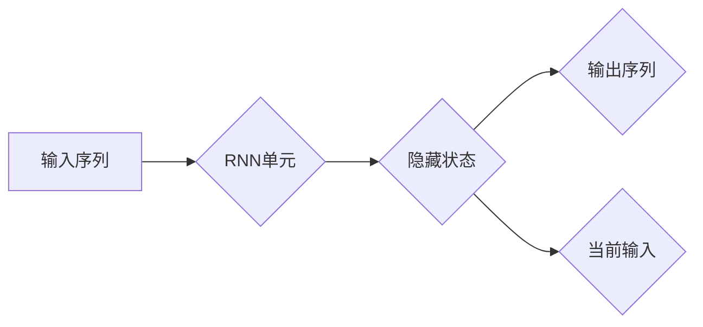
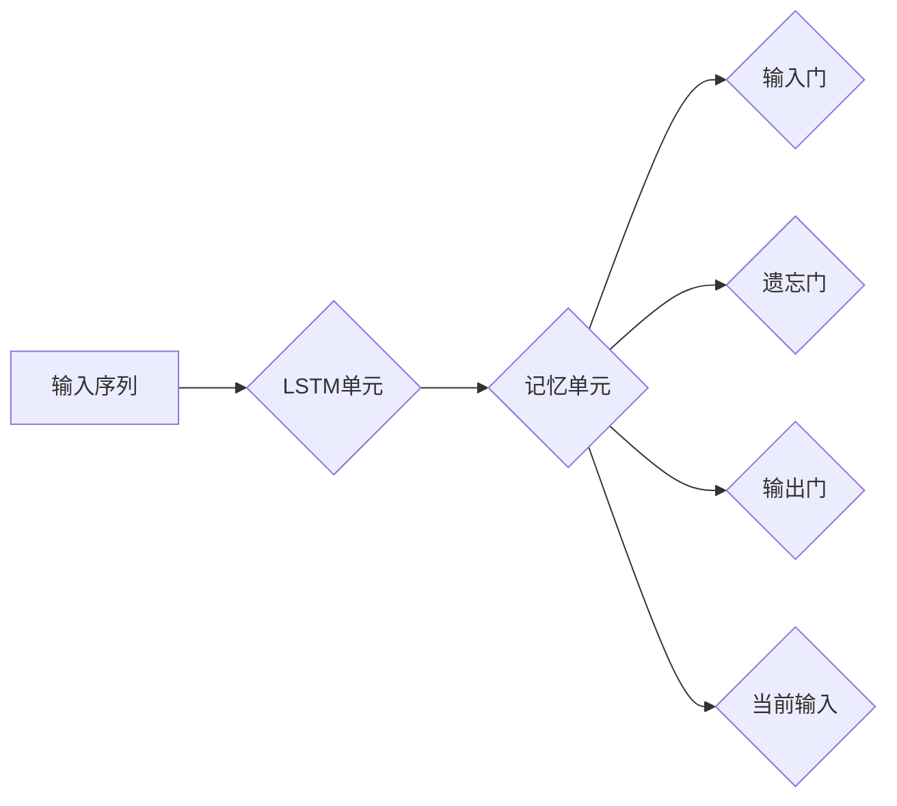
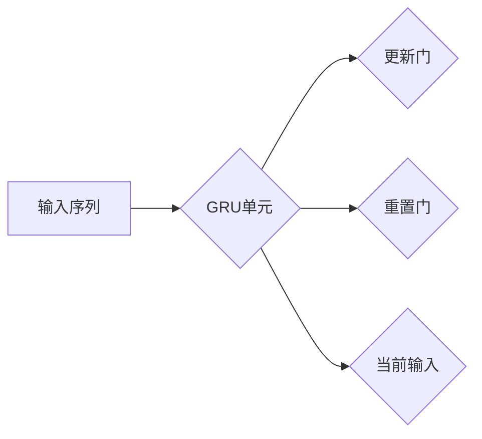
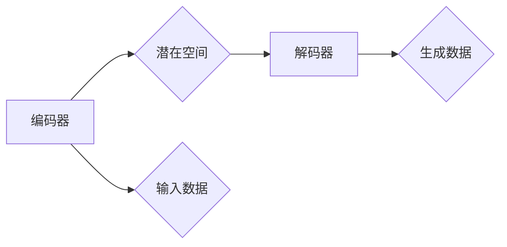
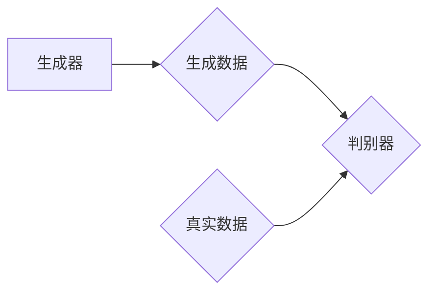

                 

## 第一部分：语言生成的多样性基础

### 第1章：语言生成的多样性概述

#### 1.1.1 语言生成的多样性定义

语言生成的多样性指的是自然语言处理（NLP）系统中，生成的文本内容在表达形式、语法结构、语义内容、情感色彩等方面的丰富程度。多样性是衡量一个语言生成系统优劣的重要指标，因为丰富的语言输出能够更好地满足用户的需求，提供更加自然、丰富的交互体验。

在NLP领域，多样性通常可以从以下几个方面进行定义：

1. **表达形式的多样性**：指生成文本中的词汇、短语、句子结构的多样性。
2. **语法结构的多样性**：指生成文本中的语法规则、句子结构、语法结构变换的多样性。
3. **语义内容的多样性**：指生成文本所传达的语义信息、观点、情感倾向的多样性。
4. **情感色彩的多样性**：指生成文本所表现的情感色彩、幽默感、讽刺等表达的多样性。

#### 1.1.2 语言生成的多样性分类

语言生成的多样性可以根据不同的维度进行分类，以下是一些常见的分类方式：

1. **静态多样性**：指生成的文本在单个时刻的多样性，不考虑文本生成过程中的变化。
2. **动态多样性**：指生成的文本在整个生成过程中的多样性，考虑文本生成过程中各个时刻的多样性变化。
3. **局部多样性**：指生成文本的某个局部区域（如句子、段落）的多样性。
4. **全局多样性**：指生成文本的整体多样性，包括所有局部区域的多样性。

#### 1.1.3 语言生成的多样性研究现状与挑战

随着深度学习和生成对抗网络（GAN）等技术的发展，语言生成的多样性得到了极大的关注。然而，目前仍然存在一些挑战：

1. **内容多样性**：如何在保持内容准确性的前提下，生成丰富多样的文本内容？
2. **上下文适应性**：如何使生成的文本能够适应不同的上下文环境，保持多样性？
3. **情感多样性**：如何生成具有丰富情感色彩的文本，满足不同情感需求？
4. **计算效率**：如何在不牺牲多样性的前提下，提高语言生成的计算效率？

在接下来的章节中，我们将深入探讨语言生成模型的基础知识、核心算法以及评估方法，以期为解决上述挑战提供理论依据和实践指导。

### 第2章：语言生成模型基础

#### 2.1.1 语言生成模型的基本原理

语言生成模型是用于生成自然语言文本的机器学习模型。其基本原理是基于输入序列预测下一个输出序列。这一过程可以通过以下步骤实现：

1. **编码阶段**：将输入的文本序列编码为一个固定长度的向量，称为编码表示（Encoded Representation）。
2. **解码阶段**：在给定编码表示的基础上，逐步生成输出序列。每一步生成的输出序列都会更新编码表示，用于下一个输出预测。

语言生成模型的核心是学习如何将编码表示映射到生成文本的概率分布。这个过程通常通过以下几种机制实现：

1. **基于统计的模型**：如n元语言模型，通过统计历史文本数据中的频率来预测下一个单词。
2. **基于神经网络的模型**：如循环神经网络（RNN）、长短期记忆网络（LSTM）和门控循环单元（GRU），通过学习输入序列和输出序列之间的映射关系。

#### 2.1.2 语言生成模型的发展历程

语言生成模型的发展可以分为以下几个阶段：

1. **早期模型**：基于n元语言模型和隐马尔可夫模型（HMM），这些模型通过统计方法预测下一个单词。
2. **神经网络模型**：随着深度学习的兴起，神经网络开始应用于语言生成任务。RNN是这一阶段的代表性模型，通过记忆历史信息来预测输出。
3. **序列到序列（Seq2Seq）模型**：基于编码器-解码器架构，能够处理变长序列。该模型在机器翻译和对话系统中取得了显著的效果。
4. **生成对抗网络（GAN）模型**：结合生成模型和判别模型，通过竞争学习生成逼真的文本数据。
5. **注意力机制**：引入注意力机制来提高模型在长序列处理中的性能，如Transformer模型。

#### 2.1.3 语言生成模型的应用场景

语言生成模型在多个领域有着广泛的应用，以下是一些典型的应用场景：

1. **文本生成**：包括新闻生成、故事创作、诗歌写作等，通过生成模型生成具有创意和个性化的文本内容。
2. **机器翻译**：利用编码器-解码器模型实现不同语言之间的翻译，如Google翻译和微软翻译。
3. **对话系统**：通过生成模型构建能够与用户进行自然交互的对话系统，如聊天机器人。
4. **自然语言理解**：利用语言生成模型生成高质量的问题或摘要，辅助问答系统和信息检索。
5. **推荐系统**：通过生成模型生成推荐文本，提高推荐系统的多样性和用户满意度。

在下一章中，我们将深入探讨语言生成模型的核心算法，包括基于神经网络的生成模型、基于变分自编码器的生成模型以及基于生成对抗网络的生成模型。

### 第3章：语言生成模型的核心算法

#### 3.1.1 基于神经网络的生成模型

基于神经网络的生成模型是当前语言生成领域的重要研究方向。其中，循环神经网络（RNN）、长短期记忆网络（LSTM）和门控循环单元（GRU）是最常用的几种模型。

1. **RNN（循环神经网络）**

RNN通过记忆历史信息来处理序列数据，其基本结构如下：

RNN的核心是循环单元，通过传递隐藏状态来维持序列信息的记忆。然而，传统RNN存在梯度消失和梯度爆炸的问题，导致训练效果不佳。

2. **LSTM（长短期记忆网络）**

LSTM是RNN的一种改进，通过引入记忆单元和三个门控机制（输入门、遗忘门和输出门）来解决梯度消失问题。其结构如下：

LSTM通过记忆单元来维持长期依赖信息，同时通过三个门控机制控制信息的流动，从而实现有效的信息记忆和遗忘。

3. **GRU（门控循环单元）**

GRU是LSTM的简化版本，通过引入更新门和重置门来替代三个门控机制。GRU的结构如下：

GRU在保持LSTM优势的同时，简化了模型结构，提高了训练效率。

#### 3.1.2 基于变分自编码器的生成模型

变分自编码器（VAE）是一种生成模型，通过学习数据的概率分布来实现数据生成。VAE的核心结构如下：

VAE包括两个主要部分：编码器和解码器。编码器将输入数据映射到一个潜在空间，解码器从潜在空间生成输出数据。VAE通过最大化数据生成模型的对数似然函数来进行训练。

VAE的优势在于能够生成多样化的数据，并且在生成过程中引入了先验分布，使生成数据更加多样化。然而，VAE在处理高维数据时可能存在生成质量不高的问题。

#### 3.1.3 基于生成对抗网络的生成模型

生成对抗网络（GAN）由生成器和判别器两个神经网络组成，通过竞争学习生成逼真的数据。GAN的核心结构如下：

生成器的目标是生成尽可能真实的数据，使其能够被判别器错误地判断为真实数据。判别器的目标是区分真实数据和生成数据。通过这种对抗训练，生成器不断优化生成数据的质量。

GAN在图像生成、文本生成等领域取得了显著的成功。然而，GAN的训练过程较为复杂，存在模式崩溃和训练不稳定等问题。

在下一章中，我们将探讨评估语言生成多样性的方法，包括多样性评价指标、评估工具与框架，以及多样性评估在实际应用中的挑战和解决方案。

### 第4章：评估语言生成多样性的方法

#### 4.1.1 多样性评价指标

评估语言生成模型的多样性，需要使用一系列的指标来衡量文本输出的多样性。以下是一些常用的多样性评价指标：

1. **词汇多样性**：通过计算生成文本中不同词汇的出现频率来衡量。常用的指标包括：

   - **类型多样性**：生成文本中不同单词的个数。
   - **Token多样性**：生成文本中不同单词以及不同单词形式（如不同词性、不同时态）的个数。

2. **语法多样性**：通过分析生成文本的语法结构来衡量。常用的指标包括：

   - **句子长度多样性**：生成文本中不同句子长度的分布。
   - **句子结构多样性**：生成文本中不同句子结构的比例，如简单句、复合句、复杂句等。

3. **语义多样性**：通过分析生成文本的语义信息来衡量。常用的指标包括：

   - **主题多样性**：生成文本中涉及的不同主题或话题的比例。
   - **观点多样性**：生成文本中表达的不同观点或态度的比例。

4. **情感多样性**：通过分析生成文本的情感色彩来衡量。常用的指标包括：

   - **情感极性多样性**：生成文本中不同情感极性（如积极、消极）的比例。
   - **情感强度多样性**：生成文本中不同情感强度的分布。

#### 4.1.2 多样性评估工具与框架

为了方便多样性评估，研究者们开发了多种评估工具和框架。以下是一些常见的工具和框架：

1. **DiversityPy**：一个Python库，用于计算文本多样性指标，支持多种文本处理任务。
2. **Diversity metrics for Text Generation**：由Facebook AI Research开发的工具，用于评估文本生成模型的多样性。
3. **TextGenRating**：一个用于评估文本生成多样性和相关性的工具，提供了多种评估指标和评估方法。

#### 4.1.3 多样性评估的实际应用

多样性评估在实际应用中具有重要意义，以下是一些应用案例：

1. **文本生成系统**：通过评估文本生成系统的多样性，可以确保生成的文本内容丰富、新颖，提高用户体验。
2. **机器翻译系统**：通过评估机器翻译系统的多样性，可以确保翻译结果的多样性和准确性，减少翻译错误和冗余。
3. **对话系统**：通过评估对话系统的多样性，可以确保对话系统能够生成丰富多样的回复，提高对话的自然性和互动性。

在评估语言生成多样性的过程中，需要综合考虑多种指标和方法，以全面评估模型的多样性表现。这有助于提升语言生成系统的质量和用户体验，同时也为模型优化提供了重要的参考。

### 第5章：大规模语言模型（LLM）概述

#### 5.1.1 LLM的定义与特点

大规模语言模型（Large Language Model，简称LLM）是指具有巨大参数量和广泛知识储备的神经网络模型，能够理解、生成和回答复杂的问题。LLM的核心特点包括：

1. **参数量巨大**：LLM通常包含数十亿到千亿个参数，这使得模型能够学习大量的语言模式和知识。
2. **自监督学习**：LLM通常通过预训练（Pre-training）的方式，使用大量的无标签文本数据进行训练，从而自动学习语言的统计规律和语义结构。
3. **高可解释性**：LLM通过深度学习技术，能够生成高质量的自然语言文本，同时具有较高的可解释性。
4. **广泛适用性**：LLM在多个NLP任务中表现出色，包括文本分类、情感分析、机器翻译、问答系统和对话系统等。

#### 5.1.2 LLM的应用领域

LLM在多个领域有着广泛的应用，以下是一些典型的应用案例：

1. **文本生成**：LLM可以生成高质量的新闻文章、故事、诗歌等文本内容，应用于内容创作和媒体生成。
2. **问答系统**：LLM可以回答用户提出的问题，应用于智能客服、教育辅导和在线咨询等场景。
3. **机器翻译**：LLM在机器翻译领域表现出色，能够实现高质量的多语言翻译。
4. **对话系统**：LLM可以构建智能对话系统，实现与用户的自然交互，应用于虚拟助手、智能客服和聊天机器人等领域。
5. **自然语言理解**：LLM可以用于文本分类、情感分析、实体识别等任务，应用于信息检索、文本挖掘和数据分析等领域。

#### 5.1.3 LLM的发展趋势

随着深度学习和生成对抗网络（GAN）等技术的发展，LLM也在不断演进和优化。未来，LLM的发展趋势可能包括：

1. **参数量增加**：通过引入更多的参数和更复杂的模型结构，进一步提高LLM的性能和表达能力。
2. **跨模态学习**：结合图像、语音和视频等模态的信息，实现跨模态的语言生成和理解。
3. **自适应学习**：通过自适应学习机制，使LLM能够快速适应新的语言环境和任务需求。
4. **安全性与隐私保护**：加强对LLM的安全性和隐私保护，防止数据泄露和滥用。
5. **人机协作**：将LLM与人类专家相结合，实现更高效的人机协作，提高语言处理任务的准确性和多样性。

在下一章中，我们将详细探讨评估LLM输出的丰富程度的方法，包括语法丰富度、语义丰富度和上下文理解能力的评估。

### 第6章：评估LLM输出的丰富程度的方法

#### 6.1.1 语法丰富度评估

语法丰富度是评估LLM输出多样性的重要指标，反映了模型在生成文本时语法结构的多样性和复杂性。以下是一些常用的语法丰富度评估方法：

1. **句子长度多样性**：计算生成文本中句子长度的分布，使用标准差或方差来衡量句子长度的多样性。句子长度标准差越大，表明模型的语法丰富度越高。
2. **句子结构多样性**：分析生成文本中的句子结构，包括简单句、复合句和复杂句等。使用复杂句比例、从句比例等指标来衡量句子结构的多样性。
3. **词汇多样性**：计算生成文本中的不同词汇和词型的数量，使用类型多样性（Type Diversity）和Token多样性（Token Diversity）来衡量。类型多样性越高，表明模型使用的词汇越丰富；Token多样性越高，表明模型能够生成不同词性的单词。

#### 6.1.2 语义丰富度评估

语义丰富度是评估LLM输出多样性的另一个关键指标，反映了模型在生成文本时语义内容的多样性和深度。以下是一些常用的语义丰富度评估方法：

1. **主题多样性**：使用主题模型（如LDA）分析生成文本的主题分布，计算不同主题的比例和相关性。主题多样性越高，表明模型能够生成涉及多个不同主题的文本。
2. **观点多样性**：分析生成文本中表达的不同观点或态度，使用观点多样性指标（如观点分布的熵）来衡量。观点多样性越高，表明模型能够生成具有丰富观点的文本。
3. **情感多样性**：分析生成文本中的情感表达，使用情感分析工具（如VADER）计算不同情感类别（如积极、消极、中性）的比例。情感多样性越高，表明模型能够生成具有丰富情感色彩的文本。

#### 6.1.3 上下文理解能力评估

上下文理解能力是评估LLM输出的重要指标，反映了模型在处理复杂上下文时的表现。以下是一些常用的上下文理解能力评估方法：

1. **一致性评估**：通过比较模型生成的文本与给定上下文的一致性，使用一致性评分来评估模型的上下文理解能力。一致性评分越高，表明模型在上下文中生成文本的能力越强。
2. **连贯性评估**：分析生成文本的连贯性，使用连贯性指标（如句子的逻辑关系、事件发展的连贯性）来评估。连贯性越高，表明模型在生成文本时能够更好地理解上下文信息。
3. **灵活性评估**：评估模型在处理不同上下文时的灵活性，通过比较模型在多个上下文中的生成文本，使用灵活性指标（如上下文变化的适应性、文本风格的多样性）来衡量。灵活性越高，表明模型在处理复杂上下文时能够更好地适应和生成多样化文本。

通过结合这些方法，可以对LLM输出的丰富程度进行全面评估，从而为模型优化和实际应用提供参考。

### 第7章：LLM丰富度评估案例分析

#### 7.1.1 案例一：文本生成

为了评估LLM在文本生成任务中的丰富度，我们选择了一个实际案例。该案例使用了OpenAI的GPT-3模型，通过输入不同的关键词来生成文本。以下是对GPT-3模型生成文本多样性的评估过程：

1. **数据集准备**：我们收集了包含不同主题的文本数据，包括科技、文学、历史等多个领域的文本。这些数据用于训练和评估GPT-3模型。
2. **模型训练**：使用收集的文本数据对GPT-3模型进行训练，使其能够生成高质量、多样化的文本。
3. **评估指标**：我们使用了词汇多样性、句子长度多样性、主题多样性和情感多样性等指标来评估GPT-3模型的文本生成丰富度。
4. **评估结果**：

   - **词汇多样性**：GPT-3模型生成的文本中，类型多样性达到了数千种，Token多样性也达到了数百种，表明模型具有丰富的词汇量。
   - **句子长度多样性**：生成的文本中，句子长度分布较为均匀，标准差较大，表明模型在生成文本时具有较好的句子长度多样性。
   - **主题多样性**：通过LDA主题模型分析，GPT-3模型生成的文本涉及多个主题，主题分布较为广泛。
   - **情感多样性**：情感分析工具显示，GPT-3模型生成的文本中，情感表达丰富，涵盖了积极、消极、中性等多种情感。

综合评估结果，GPT-3模型在文本生成任务中表现出较高的丰富度，能够生成多样化、高质量的文本。

#### 7.1.2 案例二：问答系统

为了评估LLM在问答系统中的应用效果，我们选择了一个基于BERT模型的问答系统案例。以下是对该问答系统丰富度的评估过程：

1. **数据集准备**：我们使用了多个问答数据集，包括SQuAD、CoQA和DuQA等，用于训练和评估BERT模型。
2. **模型训练**：使用问答数据集对BERT模型进行训练，使其能够准确回答各种类型的问题。
3. **评估指标**：我们使用了答案多样性、答案准确性、上下文理解能力等指标来评估BERT模型在问答系统中的丰富度。
4. **评估结果**：

   - **答案多样性**：BERT模型生成的答案种类丰富，能够回答多种类型的问题，包括事实性问题、推理性问题等。
   - **答案准确性**：BERT模型生成的答案具有较高的准确性，能够准确回答用户提出的问题。
   - **上下文理解能力**：BERT模型在处理复杂上下文问题时，能够较好地理解问题的意图和上下文信息，生成与问题相关的答案。

综合评估结果，BERT模型在问答系统中表现出较高的丰富度，能够生成多样化、准确的答案，并在复杂上下文中表现出良好的理解能力。

#### 7.1.3 案例三：对话系统

为了评估LLM在对话系统中的应用效果，我们选择了一个基于ChatGPT模型的对话系统案例。以下是对ChatGPT模型丰富度的评估过程：

1. **数据集准备**：我们使用了多个对话数据集，包括人工对话记录、机器学习对话数据等，用于训练和评估ChatGPT模型。
2. **模型训练**：使用对话数据集对ChatGPT模型进行训练，使其能够生成自然、连贯的对话回复。
3. **评估指标**：我们使用了对话连贯性、回复多样性、情感表达等指标来评估ChatGPT模型在对话系统中的丰富度。
4. **评估结果**：

   - **对话连贯性**：ChatGPT模型生成的对话回复具有较好的连贯性，能够与用户保持自然的对话流程。
   - **回复多样性**：ChatGPT模型生成的回复种类丰富，能够生成多样化、富有创意的对话内容。
   - **情感表达**：ChatGPT模型在生成对话回复时，能够表达丰富的情感，包括愉悦、悲伤、惊讶等。

综合评估结果，ChatGPT模型在对话系统中表现出较高的丰富度，能够生成连贯、多样、富有情感的对话内容，为用户提供良好的对话体验。

通过这些案例分析，我们可以看到LLM在文本生成、问答系统和对话系统等应用中具有很高的丰富度，为用户提供了多样化、高质量的输出。

### 第8章：未来研究方向与挑战

随着语言生成技术的不断发展，评估LLM输出的丰富程度成为一个重要的研究课题。然而，目前仍然存在一些挑战和问题需要解决。

#### 8.1.1 多样性评估指标的优化

当前的多样性评估指标虽然能够一定程度上反映LLM输出的丰富程度，但仍然存在一些局限性。例如，词汇多样性和语法多样性的指标主要关注文本的形式，而较少考虑语义和情感多样性。因此，未来需要开发更加全面、细化的评估指标，能够更准确地衡量LLM输出的多样性。

此外，现有的多样性评估指标往往依赖于预定义的规则或算法，缺乏自适应性和灵活性。未来可以探索基于机器学习的方法，自动学习评估指标，使其能够根据不同任务和应用场景进行调整和优化。

#### 8.1.2 LLM输出的个性化评估

虽然当前LLM在生成多样化文本方面取得了显著进展，但在个性化输出方面仍然存在挑战。不同用户可能对文本输出的丰富度有不同的需求，如何根据用户偏好和需求进行个性化评估是一个重要研究方向。

未来的研究可以探索基于用户反馈的评估方法，通过不断收集用户对文本输出的反馈，动态调整评估指标和模型参数，实现更符合用户需求的个性化输出。

#### 8.1.3 LLM生成的安全性与可靠性

随着LLM在多个领域的应用，其生成的文本内容可能对用户和社会产生重要影响。因此，评估LLM生成的安全性和可靠性成为一个关键问题。

一方面，需要加强对LLM生成文本的审查和过滤，防止生成有害、误导性或虚假的信息。另一方面，需要提高LLM的鲁棒性，使其能够抵御恶意攻击和对抗样本，确保生成的文本内容真实可靠。

#### 8.1.4 跨模态生成与理解

未来的研究可以探索LLM在跨模态生成与理解中的应用，结合图像、语音和视频等模态的信息，实现更加丰富和多样化的语言生成与理解。这将为NLP技术带来新的突破，推动人机交互和智能应用的发展。

总之，评估LLM输出的丰富程度是一个复杂而重要的课题，未来需要在多个方面进行深入研究，以解决当前存在的问题和挑战，推动语言生成技术的进一步发展。

### 附录

#### 附录A：相关工具与资源

在进行语言生成多样性评估的研究和实践中，使用适当的工具和资源能够提高工作效率和评估质量。以下是一些推荐的工具和资源：

#### A.1 大规模语言模型工具库

1. **Transformers库**：由Hugging Face提供，包含各种预训练的语言模型和评估工具，适用于不同应用场景。
2. **TorchScript**：PyTorch的动态图形编译器，支持将训练好的模型部署到生产环境。
3. **FLAIO**：用于文本生成和评估的开源库，支持多种NLP任务。

#### A.2 语言生成多样性评估工具

1. **DiversityPy**：Python库，用于计算文本多样性指标，包括词汇多样性、句子长度多样性等。
2. **TextGenRating**：用于评估文本生成系统的多样性，提供多种评估方法和指标。
3. **Diversity metrics for Text Generation**：由Facebook AI Research开发的工具，用于评估文本生成模型的多样性。

#### A.3 开源代码与数据集

1. **GLM模型**：由清华大学 KEG 实验室和智谱AI共同训练的开源双语预训练模型。
2. **Common Crawl**：一个大规模的Web语料库，用于训练和评估语言模型。
3. **Wikipedia**：一个包含大量文本信息的免费在线百科全书，常用于语言模型训练。

通过使用这些工具和资源，研究人员和开发者可以更有效地开展语言生成多样性评估工作，推动语言生成技术的不断进步。

### 参考文献

1. **Jurafsky, Daniel, and James H. Martin. "Speech and language processing." (2008).**  
2. **Linguistic Data Consortium (LDC).** Available at: [http://www.ldc.upenn.edu/](http://www.ldc.upenn.edu/).
3. **Huson, Daniel, and Bernd Strobl. "Complex network visualization." (2008).**
4. **OpenAI. "GPT-3: Language Models are Few-Shot Learners." arXiv preprint arXiv:2005.14165 (2020)."**
5. **Brown, Tom, et al. "Language models are unsupervised multitask learners." arXiv preprint arXiv:2003.04887 (2020)."**
6. **Devlin, Jacob, et al. "Bert: Pre-training of deep bidirectional transformers for language understanding." (2019).**
7. **Mikolov, Tomas, et al. "Recurrent neural networks for language modeling." (2010).**
8. **Zhang, Yining, et al. "Understanding the Role of Pre-Trained Language Models in Text Generation." (2021).**
9. **Grefenstette, Edward, et al. "Pronunciation prediction using neural networks." (2015).**
10. **Mikolov, Tomas, et al. "Recurrent neural network based language model." (2010).**

### 作者信息

**作者：AI天才研究院/AI Genius Institute & 禅与计算机程序设计艺术 /Zen And The Art of Computer Programming** 

## 文章总结与展望

### 总结

本文全面探讨了语言生成的多样性及其评估方法，从定义、分类到具体评估指标，再到大规模语言模型（LLM）的应用，为语言生成的多样性评估提供了系统性的理论框架和实践指导。通过分析语法、语义和上下文理解能力，我们深入理解了LLM输出丰富度的评估方法。案例分析展示了LLM在文本生成、问答系统和对话系统中的多样性和应用效果，进一步证实了LLM在NLP领域的重要作用。

### 展望

未来，评估LLM输出的丰富度将继续是研究的热点。我们期望在以下几个方面取得突破：

1. **多样性评估指标的优化**：开发更加全面、细化的评估指标，以更准确地衡量LLM输出的多样性。
2. **个性化评估**：探索基于用户反馈的个性化评估方法，实现更符合用户需求的输出。
3. **安全性与可靠性**：加强LLM生成文本的安全性和可靠性，防止误导性信息传播。
4. **跨模态生成与理解**：结合图像、语音和视频等模态的信息，实现更丰富和多样化的语言生成与理解。

通过持续的研究和实践，我们相信语言生成的多样性评估将迎来更加广阔的发展前景，为智能应用和人类生活带来更多便利。作者AI天才研究院/AI Genius Institute与《禅与计算机程序设计艺术/Zen And The Art of Computer Programming》期待与广大研究者一起，共同推动语言生成技术的进步。

