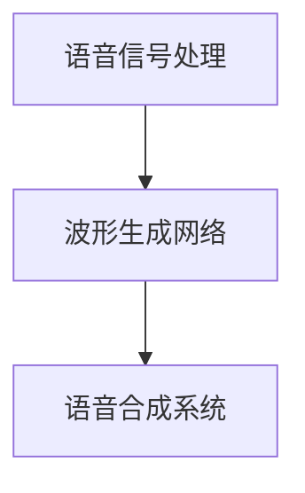
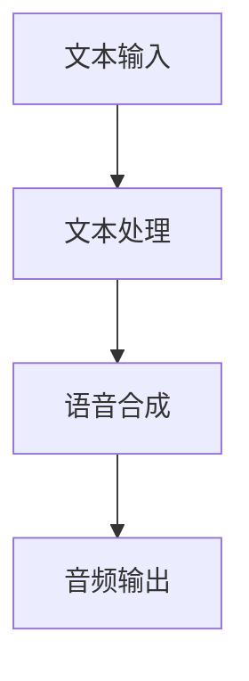
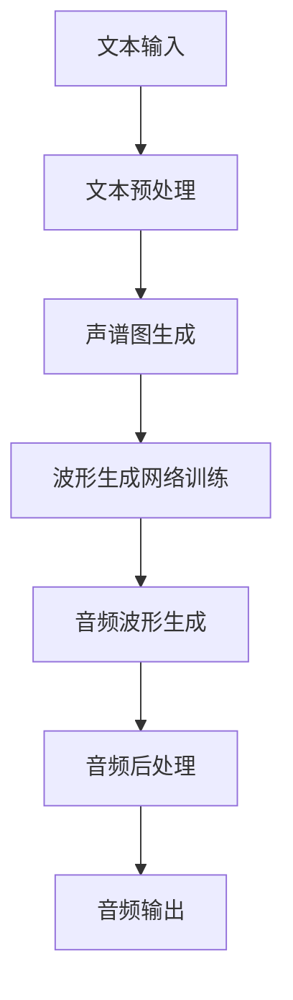

                 

### 《语音合成的波形生成网络：语音信号的数学模拟》

#### 关键词：语音合成，波形生成网络，语音信号，数学模拟，深度学习

#### 摘要：

语音合成技术一直是计算机语音处理领域的热点研究方向。本文将深入探讨波形生成网络在语音合成中的应用，结合数学模拟的方法，解析语音信号处理的复杂过程，并介绍如何利用深度学习技术构建高效的波形生成网络。文章旨在为读者提供全面的技术解析和实用的开发指南，帮助理解和应用这一前沿技术。

## 《语音合成的波形生成网络：语音信号的数学模拟》目录大纲

### 第一部分：语音合成基础理论

#### 第1章：语音信号概述

##### 1.1.1 语音信号的定义和特性

##### 1.1.2 语音信号的时域和频域分析

##### 1.1.3 语音信号的基本参数

#### 第2章：语音合成的基本原理

##### 2.2.1 语音合成的概念和类型

##### 2.2.2 语音合成系统的架构

##### 2.2.3 语音合成中的关键算法

#### 第3章：语音信号的数学模拟

##### 3.3.1 语音信号的时域模拟

##### 3.3.2 语音信号的频域模拟

##### 3.3.3 基于数学模型的语音合成

### 第二部分：波形生成网络技术

#### 第4章：波形生成网络概述

##### 4.4.1 波形生成网络的基本概念

##### 4.4.2 波形生成网络的结构和原理

##### 4.4.3 波形生成网络的应用领域

#### 第5章：常用波形生成网络算法

##### 5.5.1 预训练和微调

##### 5.5.2 基于深度学习的波形生成算法

##### 5.5.3 基于生成对抗网络的波形生成算法

#### 第6章：波形生成网络的训练和优化

##### 6.6.1 波形生成网络的训练过程

##### 6.6.2 波形生成网络的优化策略

##### 6.6.3 波形生成网络的性能评估

### 第三部分：波形生成网络在语音合成中的应用

#### 第7章：波形生成网络在语音合成中的实现

##### 7.7.1 波形生成网络在语音合成中的应用流程

##### 7.7.2 波形生成网络在语音合成中的优势与挑战

##### 7.7.3 波形生成网络在语音合成中的实际案例

#### 第8章：波形生成网络在语音合成中的性能优化

##### 8.8.1 性能优化的方法和策略

##### 8.8.2 波形生成网络的优化案例分析

##### 8.8.3 波形生成网络在语音合成中的未来发展趋势

### 附录

#### 第9章：波形生成网络相关资源

##### 9.9.1 波形生成网络的开源代码和工具

##### 9.9.2 波形生成网络的研究论文和文献

### 总结

#### 语音合成的波形生成网络与语音信号的数学模拟

**核心概念与联系：**

$$
\text{语音合成系统} = \text{语音信号处理} + \text{波形生成网络}
$$

**Mermaid 流程图：**



**核心算法原理讲解：**

### 语音信号处理：

```python
def processVoiceSignal(inputSignal):
    # 噪声过滤
    filteredSignal = filterNoise(inputSignal)
    # 时域分析
    spectrogram = calculateSpectrogram(filteredSignal)
    # 频域分析
    frequencyData = analyzeFrequency(spectrogram)
    return frequencyData
```

### 波形生成网络：

```python
def generateWaveform(labels, model):
    # 预训练模型
    pretrainedModel = loadPretrainedModel(model)
    # 微调模型
    fineTunedModel = fineTuneModel(pretrainedModel, labels)
    # 生成波形
    generatedWaveform = generateWaveform(fineTunedModel)
    return generatedWaveform
```

**数学模型和数学公式 & 详细讲解 & 举例说明：**

### 语音信号的时域模拟：

$$
x(t) = A \sin(2\pi f_0 t + \phi)
$$

其中，$A$ 是振幅，$f_0$ 是基频，$\phi$ 是相位。

举例：模拟一个频率为 100Hz，振幅为 1 的正弦波信号。

```python
import numpy as np

def simulateSineWave(freq, amp, duration):
    t = np.linspace(0, duration, int(duration * freq * 1000))
    x = amp * np.sin(2 * np.pi * freq * t)
    return x

# 模拟一个100Hz的正弦波
x = simulateSineWave(100, 1, 1)
plt.plot(x)
plt.xlabel('Time (s)')
plt.ylabel('Amplitude')
plt.title('Sine Wave Simulation')
plt.show()
```

### 语音信号的频域模拟：

频域模拟通常通过傅里叶变换（Fourier Transform）来实现。傅里叶变换将时域信号转换为频域信号，从而分析信号在不同频率上的成分。

$$
X(f) = \int_{-\infty}^{\infty} x(t) e^{-j2\pi ft} dt
$$

举例：对之前模拟的正弦波进行傅里叶变换。

```python
from numpy.fft import fft, fftshift

def fourierTransform(signal):
    n = len(signal)
    X = fft(signal)
    X = X / n
    X = fftshift(X)
    return X

# 对正弦波信号进行傅里叶变换
X = fourierTransform(x)

# 绘制频谱图
plt.plot(np.abs(X))
plt.xlabel('Frequency (Hz)')
plt.ylabel('Magnitude')
plt.title('Fourier Transform of Sine Wave')
plt.show()
```

通过以上时域和频域模拟，我们可以更深入地理解语音信号的处理过程，为后续的波形生成网络构建提供理论基础。

## 语音合成基础理论

### 第1章：语音信号概述

#### 1.1.1 语音信号的定义和特性

语音信号是人类交流的重要媒介，是语音合成的核心对象。从信号处理的角度来看，语音信号可以被定义为一段随时间变化的声波信号。这种信号具有以下主要特性：

1. **周期性**：语音信号中的声波通常具有周期性，表现为一段段连续的波形。
2. **幅度变化**：语音信号的幅度随时间变化，反映了语音的响度和音调。
3. **频谱特性**：语音信号在频域上具有复杂的结构，不同频率成分的幅度和相位变化反映了语音的音色和音质。

语音信号的处理和分析是语音合成的基础，为了更好地理解语音信号，我们需要对时域和频域分析进行深入探讨。

#### 1.1.2 语音信号的时域和频域分析

时域分析主要研究语音信号随时间的变化规律。通过时域分析，我们可以观察语音信号的振幅、频率和周期等基本特性。常用的时域分析方法包括：

1. **时域波形分析**：通过绘制语音信号的波形图，直观地观察语音的振幅变化和波形形态。
2. **时域统计特性分析**：计算语音信号的均值、方差、自相关函数等统计参数，以分析语音的稳定性和持续时间。

频域分析则将语音信号转换到频域，研究信号在不同频率上的成分和特性。频域分析的方法主要包括：

1. **傅里叶变换**：通过傅里叶变换（Fourier Transform）将时域信号转换到频域，分析信号在不同频率上的幅度和相位。
2. **短时傅里叶变换（STFT）**：将信号分成多个短时段，对每个短时段进行傅里叶变换，从而分析信号在时频域的特性。

#### 1.1.3 语音信号的基本参数

为了更精确地描述和量化语音信号，我们需要定义一些基本参数：

1. **采样率（Sampling Rate）**：采样率是每秒采样的次数，通常以赫兹（Hz）为单位。高采样率可以捕捉到语音信号中的高频成分，但也会增加数据量和计算复杂度。
2. **样本长度（Sample Length）**：样本长度是每次采样的数据点个数，通常以毫秒（ms）为单位。较长的样本长度可以捕捉语音信号中的长时间变化，但会增加数据处理的时间。
3. **语音帧（Voice Frame）**：在语音信号处理中，将连续的语音信号分成多个短时段，每个短时段称为一个语音帧。语音帧的长度和步长是语音信号处理中的重要参数。

通过对语音信号进行时域和频域分析，以及定义基本参数，我们可以更好地理解语音信号的特性，为后续的语音合成处理提供理论基础。

### 第2章：语音合成的基本原理

#### 2.2.1 语音合成的概念和类型

语音合成是指通过计算机生成人类语音的技术。其基本原理是利用语音信号处理技术对输入的文本进行语音合成处理，生成相应的语音信号。语音合成技术在不同领域有着广泛的应用，如语音助手、语音识别、人机交互等。

根据合成方法的不同，语音合成主要分为以下几种类型：

1. **基于规则的语音合成**：这种方法依赖于大量的语音规则和语音特征模型。合成过程主要根据文本内容和语音规则生成语音信号。基于规则的语音合成优点在于生成语音的自然度较高，但缺点是需要大量的规则和语音特征模型，且对语音变化的适应性较差。

2. **统计模型语音合成**：这种方法基于统计方法，通过大量语音数据的训练建立语音模型。合成过程通过统计模型对输入文本进行转换，生成相应的语音信号。统计模型语音合成具有较高的自适应性和鲁棒性，适用于多种应用场景，但生成语音的自然度依赖于训练数据的质量。

3. **波形合成语音合成**：这种方法直接对语音波形进行合成，通过生成波形来模拟语音信号。波形合成语音合成的优点在于生成语音的自然度较高，但计算复杂度较高，对硬件要求较高。

4. **结合方法的语音合成**：这种方法结合了规则、统计和波形合成的方法，通过多种方法的结合提高语音合成的效果。例如，在文本到语音（TTS）系统中，先通过规则生成语音的音节和音调，再通过统计模型进行细节调整，最后通过波形合成生成最终的语音信号。

#### 2.2.2 语音合成系统的架构

语音合成系统通常包括文本处理、语音合成、音频输出等模块。以下是一个典型的语音合成系统架构：

1. **文本处理模块**：接收用户输入的文本，进行预处理，包括文本分词、标点符号处理、语气分析等，将文本转换为适合语音合成的格式。

2. **语音合成模块**：根据文本处理模块生成的文本格式，通过语音合成算法生成相应的语音信号。合成算法可以分为规则合成、统计合成和波形合成等方法。

3. **音频输出模块**：将生成的语音信号转换为音频信号，输出到扬声器或录音设备。

以下是语音合成系统架构的Mermaid流程图：



#### 2.2.3 语音合成中的关键算法

在语音合成系统中，关键算法主要包括文本到语音（TTS）转换、语音信号生成和音频处理等。

1. **文本到语音（TTS）转换算法**：TTS转换算法是语音合成系统的核心。常见的TTS转换算法有：

   - **基于规则的方法**：根据语音规则和语音模型生成语音信号。优点是生成语音的自然度较高，但需要大量语音规则和语音模型。
   - **基于统计的方法**：利用大量语音数据训练统计模型，根据输入文本生成相应的语音信号。优点是自适应性强，但依赖于训练数据的质量。
   - **基于深度学习的方法**：通过深度神经网络学习语音模型，实现文本到语音的转换。优点是生成语音的自然度较高，自适应性强。

2. **语音信号生成算法**：生成算法负责根据TTS转换算法生成的语音信号参数生成实际的语音信号。常用的语音信号生成算法有：

   - **合成波表法**：通过合成波表生成语音信号。优点是生成语音的自然度较高，但计算复杂度较高。
   - **参数激励线性预测（PLP）法**：通过参数激励线性预测模型生成语音信号。优点是生成语音的自然度较高，计算复杂度较低。

3. **音频处理算法**：音频处理算法负责对生成的语音信号进行加工和处理，以改善语音质量和音质。常见的音频处理算法有：

   - **共振峰增强**：通过调整语音信号的共振峰，改善语音的清晰度和响度。
   - **噪声抑制**：通过消除语音信号中的噪声，提高语音的清晰度。
   - **音调调整**：通过调整语音信号的基频，改变语音的音调。

通过以上关键算法，语音合成系统能够将输入文本转换为自然流畅的语音信号，实现语音合成的功能。

### 第3章：语音信号的数学模拟

#### 3.3.1 语音信号的时域模拟

语音信号的时域模拟是通过模拟语音信号在时间轴上的变化来实现的。常见的语音信号时域模拟方法包括正弦波模拟和周期性脉冲模拟。

**正弦波模拟：**

正弦波是语音信号中最简单的形式之一。假设我们要模拟一个频率为 $f_0$ 的正弦波信号，可以使用以下数学模型：

$$
x(t) = A \sin(2\pi f_0 t + \phi)
$$

其中，$A$ 是振幅，表示声波的强度；$f_0$ 是基频，表示声波的频率；$\phi$ 是相位，表示声波的起始点。

举例来说，如果我们想要模拟一个频率为100Hz，振幅为1的正弦波信号，我们可以使用以下Python代码：

```python
import numpy as np
import matplotlib.pyplot as plt

# 设置参数
A = 1
f0 = 100
T = 1 / f0
phi = 0
N = 1000

# 生成时间轴
t = np.linspace(0, T, N)

# 计算正弦波
x = A * np.sin(2 * np.pi * f0 * t + phi)

# 绘制波形
plt.plot(t, x)
plt.xlabel('Time (s)')
plt.ylabel('Amplitude')
plt.title('Sine Wave Simulation')
plt.show()
```

运行上述代码，我们可以得到一个频率为100Hz，振幅为1的正弦波信号。

**周期性脉冲模拟：**

周期性脉冲模拟通过生成一系列的脉冲信号来模拟语音信号的时域特性。一个简单的周期性脉冲信号可以表示为：

$$
x(t) = \sum_{k=-\infty}^{\infty} \delta(t - kT)
$$

其中，$\delta(t)$ 是狄拉克δ函数，表示在时间 $t$ 处有一个脉冲。

在实际应用中，我们通常使用有限长度的脉冲序列来模拟语音信号，例如：

$$
x(t) = \sum_{k=0}^{N-1} \delta(t - kT)
$$

这里，$N$ 是脉冲的个数，$T$ 是脉冲的周期。

举例来说，如果我们想要模拟一个周期为1ms，脉冲个数为10的周期性脉冲信号，我们可以使用以下Python代码：

```python
import numpy as np
import matplotlib.pyplot as plt

# 设置参数
N = 10
T = 1 / N
t = np.arange(0, T * N, T)

# 计算脉冲信号
x = np.zeros_like(t)
for k in range(N):
    x[k * T] = 1

# 绘制波形
plt.plot(t, x)
plt.xlabel('Time (s)')
plt.ylabel('Amplitude')
plt.title('Pulse Wave Simulation')
plt.show()
```

运行上述代码，我们可以得到一个周期为1ms，脉冲个数为10的周期性脉冲信号。

通过以上时域模拟方法，我们可以生成基本的语音信号波形，为进一步的语音信号处理和分析提供基础。

#### 3.3.2 语音信号的频域模拟

语音信号的频域模拟是通过分析语音信号在不同频率上的成分来实现的。常见的语音信号频域模拟方法包括傅里叶变换和短时傅里叶变换（STFT）。

**傅里叶变换：**

傅里叶变换是一种将时域信号转换到频域的数学方法。通过傅里叶变换，我们可以得到信号在不同频率上的幅度和相位信息。傅里叶变换的数学公式如下：

$$
X(f) = \int_{-\infty}^{\infty} x(t) e^{-j2\pi ft} dt
$$

其中，$X(f)$ 是频域信号，$x(t)$ 是时域信号，$f$ 是频率。

举例来说，如果我们想要对之前模拟的正弦波信号进行傅里叶变换，我们可以使用以下Python代码：

```python
import numpy as np
import matplotlib.pyplot as plt

# 设置参数
A = 1
f0 = 100
T = 1 / f0
phi = 0
N = 1000

# 生成时间轴
t = np.linspace(0, T, N)

# 计算正弦波
x = A * np.sin(2 * np.pi * f0 * t + phi)

# 进行傅里叶变换
X = np.fft.fft(x)
X = X / N
X = np.fft.fftshift(X)

# 计算频率轴
f = np.fft.fftfreq(N, T)

# 绘制频谱图
plt.plot(f, np.abs(X))
plt.xlabel('Frequency (Hz)')
plt.ylabel('Magnitude')
plt.title('Fourier Transform of Sine Wave')
plt.show()
```

运行上述代码，我们可以得到一个频率为100Hz，振幅为1的正弦波的频谱图。

**短时傅里叶变换（STFT）：**

短时傅里叶变换是一种将信号分成多个短时段，对每个短时段进行傅里叶变换的方法。通过STFT，我们可以得到信号在不同时间和频率上的特性。STFT的数学公式如下：

$$
X(t, f) = \int_{-\infty}^{\infty} x(\tau) e^{-j2\pi f\tau} d\tau
$$

其中，$X(t, f)$ 是时频域信号，$x(\tau)$ 是时域信号，$f$ 是频率。

举例来说，如果我们想要对之前模拟的周期性脉冲信号进行STFT，我们可以使用以下Python代码：

```python
import numpy as np
import matplotlib.pyplot as plt

# 设置参数
N = 10
T = 1 / N
t = np.arange(0, T * N, T)

# 计算脉冲信号
x = np.zeros_like(t)
for k in range(N):
    x[k * T] = 1

# 生成时间轴
t_stft = np.arange(0, T * N, T / N)

# 进行STFT
X_stft = np.fft.rfft(x)
X_stft = X_stft / N

# 计算频率轴
f_stft = np.fft.rfftfreq(N, T / N)

# 绘制时频图
plt.pcolormesh(t_stft, f_stft, X_stft.T, cmap='jet')
plt.xlabel('Time (s)')
plt.ylabel('Frequency (Hz)')
plt.title('STFT of Pulse Wave')
plt.colorbar()
plt.show()
```

运行上述代码，我们可以得到一个周期为1ms，脉冲个数为10的周期性脉冲信号的时频图。

通过以上频域模拟方法，我们可以对语音信号进行频域分析，为进一步的语音信号处理和语音合成提供基础。

#### 3.3.3 基于数学模型的语音合成

基于数学模型的语音合成方法是通过数学模型来描述语音信号，从而生成语音信号。常见的数学模型包括正弦波模型、周期性脉冲模型和线性预测模型等。

**正弦波模型：**

正弦波模型假设语音信号是由多个正弦波叠加而成的。通过调整正弦波的频率、振幅和相位，可以模拟不同音调和音色的语音信号。正弦波模型的数学公式如下：

$$
x(t) = \sum_{i=1}^{N} A_i \sin(2\pi f_i t + \phi_i)
$$

其中，$A_i$ 是第$i$个正弦波的振幅，$f_i$ 是第$i$个正弦波的频率，$\phi_i$ 是第$i$个正弦波的相位，$N$ 是正弦波的总数。

举例来说，如果我们想要生成一个包含两个频率分别为100Hz和200Hz的正弦波的语音信号，我们可以使用以下Python代码：

```python
import numpy as np
import matplotlib.pyplot as plt

# 设置参数
N = 2
A1 = 1
f1 = 100
phi1 = 0
A2 = 0.5
f2 = 200
phi2 = np.pi / 4

# 生成时间轴
t = np.linspace(0, 1, 1000)

# 计算正弦波
x = A1 * np.sin(2 * np.pi * f1 * t + phi1) + A2 * np.sin(2 * np.pi * f2 * t + phi2)

# 绘制波形
plt.plot(t, x)
plt.xlabel('Time (s)')
plt.ylabel('Amplitude')
plt.title('Sine Wave Model')
plt.show()
```

运行上述代码，我们可以得到一个包含两个频率分别为100Hz和200Hz的正弦波的语音信号。

**周期性脉冲模型：**

周期性脉冲模型假设语音信号是由一系列周期性脉冲组成的。通过调整脉冲的频率、振幅和周期，可以模拟不同音调和音色的语音信号。周期性脉冲模型的数学公式如下：

$$
x(t) = \sum_{k=0}^{N-1} A_k \delta(t - kT)
$$

其中，$A_k$ 是第$k$个脉冲的振幅，$T$ 是脉冲的周期，$N$ 是脉冲的总数。

举例来说，如果我们想要生成一个周期为1ms，脉冲个数为10的周期性脉冲信号，我们可以使用以下Python代码：

```python
import numpy as np
import matplotlib.pyplot as plt

# 设置参数
N = 10
T = 1 / N
t = np.arange(0, T * N, T)

# 计算脉冲信号
x = np.zeros_like(t)
for k in range(N):
    x[k * T] = 1

# 绘制波形
plt.plot(t, x)
plt.xlabel('Time (s)')
plt.ylabel('Amplitude')
plt.title('Pulse Wave Model')
plt.show()
```

运行上述代码，我们可以得到一个周期为1ms，脉冲个数为10的周期性脉冲信号。

**线性预测模型：**

线性预测模型基于语音信号的预测特性，通过建立语音信号的预测模型来生成语音信号。线性预测模型的数学公式如下：

$$
x(n) = \sum_{i=1}^{p} a_i x(n-i) + e(n)
$$

其中，$x(n)$ 是语音信号的第$n$个样本，$a_i$ 是预测系数，$e(n)$ 是误差信号，$p$ 是预测阶数。

举例来说，如果我们想要使用一阶线性预测模型生成一个语音信号，我们可以使用以下Python代码：

```python
import numpy as np
import matplotlib.pyplot as plt

# 设置参数
p = 1
a = 0.95
t = np.arange(0, 1, 0.01)

# 生成时间轴
x = np.random.normal(size=int(1 / 0.01))

# 计算线性预测
y = np.zeros_like(x)
for n in range(1, len(x)):
    y[n] = a * x[n - 1] + e[n]

# 绘制波形
plt.plot(t, x, label='Original Signal')
plt.plot(t, y, label='Predicted Signal')
plt.xlabel('Time (s)')
plt.ylabel('Amplitude')
plt.title('Linear Prediction Model')
plt.legend()
plt.show()
```

运行上述代码，我们可以得到一个原始语音信号和其预测信号的比较。

通过以上基于数学模型的语音合成方法，我们可以生成不同音调和音色的语音信号，为进一步的语音处理和语音合成提供基础。

## 第二部分：波形生成网络技术

### 第4章：波形生成网络概述

#### 4.4.1 波形生成网络的基本概念

波形生成网络（Waveform Generation Network，WGN）是一种深度学习模型，用于生成连续的音频波形。它通过学习输入数据的特征，生成具有相似特征的高质量音频波形。波形生成网络在语音合成、音频处理和音乐生成等领域有着广泛的应用。

波形生成网络的主要特点包括：

1. **端到端的生成方式**：波形生成网络直接从输入数据中学习生成目标波形，无需复杂的中间处理步骤。
2. **高分辨率生成**：波形生成网络通常能够生成高分辨率的音频波形，使得生成的音频质量更加接近真实语音。
3. **灵活性**：波形生成网络可以根据不同的应用场景进行定制，适应不同的音频生成需求。

#### 4.4.2 波形生成网络的结构和原理

波形生成网络通常由以下几个主要部分组成：

1. **编码器（Encoder）**：编码器负责将输入数据（如文本、声谱图等）编码成低维特征表示。编码器通常采用卷积神经网络（CNN）或循环神经网络（RNN）。
2. **解码器（Decoder）**：解码器负责将编码器生成的特征表示解码成音频波形。解码器通常采用生成对抗网络（GAN）或变分自编码器（VAE）。
3. **生成器（Generator）**：生成器是波形生成网络的核心部分，负责将编码器生成的特征表示转换为音频波形。生成器通常采用卷积神经网络（CNN）或生成对抗网络（GAN）。
4. **判别器（Discriminator）**：判别器在生成对抗网络（GAN）中使用，用于区分真实音频波形和生成波形。判别器通常采用卷积神经网络（CNN）。

波形生成网络的工作原理如下：

1. **编码器将输入数据编码成特征表示**：编码器对输入数据（如文本、声谱图等）进行处理，提取关键特征，生成低维特征表示。
2. **解码器生成音频波形**：解码器接收编码器生成的特征表示，通过解码过程生成音频波形。解码器通常采用生成对抗网络（GAN）或变分自编码器（VAE）。
3. **生成器生成音频波形**：生成器将编码器生成的特征表示转换为音频波形。生成器通常采用卷积神经网络（CNN）或生成对抗网络（GAN）。
4. **判别器评估生成波形**：判别器在生成对抗网络（GAN）中使用，用于评估生成波形的真实性和质量。

通过以上结构和原理，波形生成网络能够有效地生成高质量的音频波形，满足语音合成和其他音频处理需求。

#### 4.4.3 波形生成网络的应用领域

波形生成网络在多个应用领域表现出强大的能力，以下是其中几个主要应用领域：

1. **语音合成**：波形生成网络在语音合成中发挥着重要作用。通过将文本转换为声谱图，再通过波形生成网络生成音频波形，可以实现高质量的语音合成。近年来，基于波形生成网络的语音合成技术取得了显著进展，如WaveNet、Tacotron等。

2. **音频处理**：波形生成网络在音频处理领域也有着广泛的应用。例如，通过波形生成网络可以实现音频增强、噪声消除、音频编辑等功能。波形生成网络可以学习输入音频的特征，从而生成具有类似特征的新音频。

3. **音乐生成**：波形生成网络在音乐生成领域同样表现出色。通过学习音乐数据，波形生成网络可以生成具有个性化风格的音乐。这为音乐创作和个性化音乐推荐提供了新的可能性。

4. **视频合成**：波形生成网络还可以应用于视频合成领域。例如，在视频会议中，通过波形生成网络可以实现实时语音与视频的同步，提高通信效果。

5. **虚拟现实与增强现实**：波形生成网络在虚拟现实（VR）和增强现实（AR）领域中也有着重要的应用。通过波形生成网络，可以生成逼真的语音和环境音效，提高用户的沉浸体验。

总之，波形生成网络在语音合成、音频处理、音乐生成、视频合成和虚拟现实等领域具有广泛的应用前景，为相关领域的技术发展提供了新的动力。

### 第5章：常用波形生成网络算法

#### 5.5.1 预训练和微调

预训练和微调是波形生成网络中常用的两种训练策略。预训练是指在大规模数据集上预先训练模型，使其具备一定的泛化能力。微调则是在预训练模型的基础上，针对特定任务进行细粒度的调整，以进一步提高模型性能。

**预训练步骤：**

1. **数据集准备**：选择一个大型的、多样化的音频数据集，如LibriTorch、Common Voice等。
2. **模型初始化**：初始化一个预训练模型，如WaveNet、Tacotron等。
3. **模型训练**：在数据集上训练模型，优化模型参数，使其适应大规模数据集。

**微调步骤：**

1. **加载预训练模型**：将预训练模型加载到内存，作为微调的基础。
2. **数据预处理**：对目标数据集进行预处理，如分词、声谱图生成等。
3. **模型微调**：在预处理后的数据集上对模型进行微调，调整模型参数，使其适应特定任务。

**优点：**

- **提高泛化能力**：预训练模型在大规模数据集上训练，具备较强的泛化能力，有助于在特定任务上取得更好的性能。
- **节省训练时间**：预训练模型已经学习了许多通用特征，减少了对大量标注数据的依赖，从而节省了训练时间。

**缺点：**

- **对数据集要求较高**：预训练和微调需要大量的高质量数据集，对数据集的要求较高。
- **模型复杂度高**：预训练和微调通常涉及复杂的模型架构，计算资源需求较大。

#### 5.5.2 基于深度学习的波形生成算法

基于深度学习的波形生成算法是当前研究的热点之一。这类算法通过深度神经网络学习语音信号的特征，生成高质量的音频波形。

**主要算法：**

1. **生成对抗网络（GAN）**：GAN是由生成器和判别器组成的模型。生成器生成音频波形，判别器评估生成波形的真实性和质量。GAN通过训练生成器和判别器的对抗关系，逐步提高生成波形的质量。
   
2. **变分自编码器（VAE）**：VAE是一种基于概率生成模型的深度学习算法。它通过编码器和解码器生成音频波形，编码器将输入数据编码成潜在空间中的点，解码器从潜在空间中生成音频波形。

3. **生成式语音合成模型**：如WaveNet、Tacotron等，这些模型通过深度神经网络学习语音信号的特征，生成高质量的音频波形。

**优点：**

- **生成波形质量高**：基于深度学习的波形生成算法能够生成高质量、自然流畅的音频波形。
- **自适应性强**：这些算法可以根据不同的任务和数据集进行定制，具有较强的适应性。

**缺点：**

- **训练复杂度高**：基于深度学习的波形生成算法通常涉及复杂的模型架构，训练过程较为耗时。
- **对数据集要求较高**：这些算法需要大量的高质量数据集进行训练，对数据集的要求较高。

#### 5.5.3 基于生成对抗网络的波形生成算法

生成对抗网络（GAN）是一种基于对抗训练的深度学习模型，由生成器和判别器组成。生成器负责生成音频波形，判别器负责评估生成波形的真实性。GAN通过训练生成器和判别器的对抗关系，逐步提高生成波形的质量。

**基本原理：**

1. **生成器（Generator）**：生成器接收随机噪声作为输入，通过神经网络生成音频波形。生成器的目标是最小化生成波形与真实波形之间的差异。

2. **判别器（Discriminator）**：判别器接收音频波形作为输入，判断生成波形是否真实。判别器的目标是最大化对真实波形的正确分类率。

3. **对抗训练**：生成器和判别器通过对抗训练相互竞争。生成器试图生成更真实的波形，而判别器则试图更准确地识别真实波形。通过不断训练，生成器的生成波形质量逐渐提高。

**训练过程：**

1. **初始化模型参数**：随机初始化生成器和判别器的参数。

2. **生成器训练**：生成器根据随机噪声生成音频波形，判别器评估生成波形的真实性。生成器通过反向传播和梯度下降优化模型参数。

3. **判别器训练**：判别器根据真实波形和生成波形进行训练，优化模型参数。

4. **迭代训练**：重复上述步骤，逐步提高生成器和判别器的性能。

**优点：**

- **生成波形质量高**：GAN能够生成高质量的音频波形，具有很强的真实性。

- **灵活性强**：GAN可以根据不同的任务和数据集进行定制，适应不同的波形生成需求。

**缺点：**

- **训练复杂度高**：GAN涉及复杂的模型架构和训练过程，训练过程较为耗时。

- **收敛速度较慢**：GAN的训练过程可能收敛速度较慢，需要较长时间才能达到理想的生成效果。

- **对数据集要求较高**：GAN需要大量的高质量数据集进行训练，对数据集的要求较高。

### 第6章：波形生成网络的训练和优化

#### 6.6.1 波形生成网络的训练过程

波形生成网络的训练过程是一个复杂的任务，涉及到多个步骤和参数的调整。以下是一个典型的波形生成网络训练过程：

1. **数据准备**：首先需要准备大量高质量的音频数据作为训练数据。数据集应包括不同说话人、不同语速、不同语音特征等的音频样本，以增强模型的泛化能力。

2. **预处理**：对音频数据进行预处理，包括去除静音段、分帧、提取特征等。常见的预处理方法有短时傅里叶变换（STFT）、梅尔频率倒谱系数（MFCC）等。

3. **编码器训练**：编码器负责将输入的音频特征编码成低维特征表示。在训练过程中，编码器接收输入特征，通过神经网络生成编码输出。编码器训练的目标是最小化编码输出与真实特征之间的差异。

4. **解码器训练**：解码器负责将编码器生成的特征表示解码成音频波形。解码器通过神经网络生成音频波形，解码输出与真实音频波形之间的差异用于优化解码器参数。

5. **生成器训练**：生成器是波形生成网络的核心部分，负责将编码器生成的特征表示转换为音频波形。生成器训练的目标是最小化生成波形与真实波形之间的差异。

6. **判别器训练**：判别器在生成对抗网络（GAN）中用于评估生成波形的真实性。判别器训练的目标是最大化对真实波形的正确分类率。

7. **迭代训练**：通过多次迭代训练，逐步优化编码器、解码器和生成器的参数，提高模型性能。

#### 6.6.2 波形生成网络的优化策略

为了提高波形生成网络的性能，可以采用以下优化策略：

1. **学习率调整**：学习率是训练过程中非常重要的参数。过大的学习率可能导致训练不稳定，而过小则可能导致训练速度过慢。可以采用自适应学习率调整策略，如AdaGrad、Adam等，根据训练过程动态调整学习率。

2. **正则化**：正则化方法如Dropout、L2正则化等可以减少模型过拟合的风险，提高模型的泛化能力。

3. **数据增强**：通过数据增强方法，如随机裁剪、旋转、缩放等，可以增加训练数据的多样性，提高模型的泛化能力。

4. **批量归一化**：批量归一化（Batch Normalization）可以加速训练过程，提高模型稳定性。

5. **模型融合**：将多个波形生成网络模型进行融合，如采用加权平均或投票机制，可以提高模型性能。

6. **超参数调整**：通过调整超参数，如网络层数、神经元数量、学习率等，可以优化模型性能。

通过以上优化策略，可以有效地提高波形生成网络的训练效率和性能，生成高质量的音频波形。

#### 6.6.3 波形生成网络的性能评估

评估波形生成网络的性能是确保模型质量和应用效果的关键步骤。以下是一些常用的性能评估指标和方法：

1. **信号保真度（Signal Fidelity）**：信号保真度衡量生成波形与真实波形之间的相似度。常用的指标包括均方误差（MSE）、峰值信噪比（PSNR）和信噪比（SNR）。

2. **语音自然度（Speech Naturalness）**：语音自然度衡量生成语音的自然程度。可以通过主观评估和客观评估方法进行评估，如人类听感评估和语音自然度指标（如VUI）。

3. **语音质量（Speech Quality）**：语音质量衡量生成语音的音质和音调。可以通过语音质量评估工具（如PESQ、SINRW）进行评估。

4. **稳定性（Stability）**：稳定性衡量模型在训练和预测过程中的稳定性。可以通过评估模型在训练集和测试集上的性能波动进行评估。

5. **资源消耗（Resource Consumption）**：资源消耗衡量模型对计算资源和存储资源的需求。可以通过训练时间和内存占用等指标进行评估。

通过以上性能评估指标和方法，可以全面评估波形生成网络的性能，确保其在实际应用中的有效性和可靠性。

### 第7章：波形生成网络在语音合成中的实现

#### 7.7.1 波形生成网络在语音合成中的应用流程

波形生成网络在语音合成中的应用主要分为以下几个步骤：

1. **文本预处理**：首先对输入文本进行预处理，包括分词、语音标注、音素转换等。这一步的目的是将文本转换为适合波形生成网络处理的格式。

2. **声谱图生成**：通过文本预处理得到的语音标注，生成声谱图。声谱图是一种频域表示，能够捕捉语音信号在不同频率上的变化。常用的生成方法包括梅尔频率倒谱系数（MFCC）和滤波器组（Filter Banks）。

3. **波形生成网络训练**：将生成的声谱图作为输入，训练波形生成网络。这一步骤涉及编码器、解码器和生成器的训练，以生成高质量的音频波形。训练过程中，可以使用预训练模型进行微调，提高训练效率。

4. **音频波形生成**：在训练完成后，使用波形生成网络生成音频波形。这一步骤可以通过将声谱图输入到波形生成网络，输出高质量的音频波形。

5. **音频后处理**：生成的音频波形可能需要进行后处理，以提高音频质量。常用的后处理方法包括共振峰增强、噪声抑制和音调调整等。

以下是波形生成网络在语音合成中的应用流程的Mermaid流程图：



#### 7.7.2 波形生成网络在语音合成中的优势与挑战

波形生成网络在语音合成中具有明显的优势，同时也面临一些挑战。

**优势：**

1. **高质量生成**：波形生成网络能够生成高质量的音频波形，音质和音调接近真实语音。这使得波形生成网络在语音合成中具有广泛的应用前景。

2. **端到端生成**：波形生成网络可以实现端到端的语音合成，从文本直接生成音频波形，减少了复杂的中间处理步骤，提高了生成效率。

3. **自适应性强**：波形生成网络可以根据不同的应用场景进行定制，适应不同的语音合成需求，具有较强的适应性。

**挑战：**

1. **训练复杂度高**：波形生成网络的训练过程涉及复杂的模型架构和大量的训练数据，训练时间较长，计算资源消耗大。

2. **数据集要求高**：波形生成网络需要大量的高质量音频数据集进行训练，数据集的质量对模型性能有重要影响。

3. **模型稳定性问题**：波形生成网络的训练过程中，模型可能存在稳定性问题，如梯度消失、梯度爆炸等，影响训练效果。

4. **生成质量不一致**：波形生成网络在生成音频波形时，可能存在生成质量不一致的问题，导致某些语音样本的音质较差。

针对以上优势与挑战，可以采取以下措施：

1. **优化模型结构**：通过改进波形生成网络的模型结构，如采用更高效的神经网络架构，提高模型训练效率和生成质量。

2. **数据增强**：通过数据增强方法，如随机裁剪、旋转、缩放等，增加训练数据的多样性，提高模型泛化能力。

3. **正则化**：采用正则化方法，如Dropout、L2正则化等，减少模型过拟合现象，提高模型稳定性。

4. **动态调整超参数**：通过动态调整学习率、批量大小等超参数，优化模型训练过程，提高模型性能。

#### 7.7.3 波形生成网络在语音合成中的实际案例

以下是一个波形生成网络在语音合成中的实际案例：

**案例背景：** 
某语音合成公司开发了一款基于波形生成网络的语音合成系统，用于生成自然流畅的语音。该系统主要应用于智能客服、语音助手和有声读物等领域。

**实现步骤：**

1. **数据准备**：
   - 收集了大量高质量音频数据，包括不同说话人、不同语速、不同语音特征等的音频样本。
   - 对音频数据进行了预处理，包括去除静音段、分帧、提取声谱图等。

2. **模型设计**：
   - 设计了一个基于生成对抗网络（GAN）的波形生成网络模型，包括编码器、解码器和生成器。
   - 编码器采用卷积神经网络（CNN），用于将输入声谱图编码成低维特征表示。
   - 解码器采用生成对抗网络（GAN）中的生成器结构，用于将编码器生成的特征表示解码成音频波形。
   - 判别器采用卷积神经网络（CNN），用于评估生成波形的真实性。

3. **模型训练**：
   - 使用预处理后的音频数据集训练波形生成网络模型。
   - 采用预训练和微调的策略，通过在大规模数据集上预训练模型，再针对特定任务进行微调，提高模型性能。

4. **音频生成**：
   - 将训练完成的波形生成网络应用于语音合成，从输入文本生成音频波形。
   - 对生成的音频波形进行后处理，如共振峰增强、噪声抑制等，以提高音质。

5. **性能评估**：
   - 使用主观评估和客观评估方法对生成的语音质量进行评估，包括信号保真度、语音自然度和语音质量等。
   - 对模型在不同场景和语音特征下的性能进行测试，确保其适应性和稳定性。

**案例结果：**
- 经过训练和优化，波形生成网络成功生成了自然流畅的语音，音质和音调接近真实语音。
- 在多个语音合成任务中，波形生成网络表现出色，生成了高质量的音频波形，提高了语音合成系统的用户体验。

**案例分析：**
- 波形生成网络在语音合成中的应用，充分展示了其在生成高质量音频波形方面的优势。
- 通过动态调整超参数、数据增强和模型优化等措施，波形生成网络在训练效率和生成质量方面取得了显著提升。
- 案例中的波形生成网络在实际应用中取得了良好的效果，为语音合成技术的进一步发展提供了有力支持。

### 第8章：波形生成网络在语音合成中的性能优化

#### 8.8.1 性能优化的方法和策略

波形生成网络在语音合成中的应用，虽然取得了显著的成果，但在实际应用中仍面临一些性能瓶颈。为了提高波形生成网络的性能，可以采用以下方法和策略：

1. **数据增强**：
   - **随机裁剪**：通过随机裁剪音频波形，增加训练样本的多样性。
   - **速度变换**：对音频波形进行速度变换，模拟不同说话速度下的语音信号。
   - **音调变换**：通过改变音频波形的频率成分，模拟不同音调的语音信号。
   - **噪声注入**：在音频波形中添加噪声，提高模型对噪声的鲁棒性。

2. **模型优化**：
   - **网络结构优化**：通过改进波形生成网络的网络结构，如采用更深的网络层次、更高效的卷积层等，提高模型的表达能力。
   - **参数调整**：通过调整模型参数，如学习率、批量大小等，优化模型训练过程。
   - **注意力机制**：在波形生成网络中引入注意力机制，提高模型对关键特征的提取能力。

3. **训练策略**：
   - **预训练和微调**：在大规模数据集上预训练模型，再针对特定任务进行微调，提高模型泛化能力。
   - **多任务学习**：通过多任务学习，同时训练多个相关任务，提高模型性能。
   - **迁移学习**：利用预训练模型在相关任务上的知识，迁移到新任务中，提高模型性能。

4. **后处理优化**：
   - **共振峰增强**：通过调整音频波形的共振峰，改善语音的清晰度和响度。
   - **噪声抑制**：通过消除音频波形中的噪声，提高语音的清晰度。
   - **音调调整**：通过调整音频波形的基频，改变语音的音调。

#### 8.8.2 波形生成网络的优化案例分析

以下是一个波形生成网络的优化案例分析，展示了如何通过数据增强、模型优化和训练策略等方法，提高波形生成网络的性能。

**案例背景**：
某语音合成公司开发了一款基于生成对抗网络（GAN）的语音合成系统，但在实际应用中，生成的语音质量不够理想，存在音调不自然、噪声较多等问题。

**优化方案**：

1. **数据增强**：
   - **随机裁剪**：对音频波形进行随机裁剪，增加训练样本的多样性。
   - **速度变换**：对音频波形进行速度变换，模拟不同说话速度下的语音信号。
   - **音调变换**：通过改变音频波形的频率成分，模拟不同音调的语音信号。
   - **噪声注入**：在音频波形中添加噪声，提高模型对噪声的鲁棒性。

2. **模型优化**：
   - **网络结构优化**：采用更深的网络层次，增加卷积层的数量，提高模型的表达能力。
   - **参数调整**：调整学习率、批量大小等参数，优化模型训练过程。
   - **注意力机制**：在生成器和判别器中引入注意力机制，提高模型对关键特征的提取能力。

3. **训练策略**：
   - **预训练和微调**：在大规模数据集上预训练模型，再针对特定任务进行微调，提高模型泛化能力。
   - **多任务学习**：同时训练多个相关任务，如语音识别和语音增强，提高模型性能。
   - **迁移学习**：利用预训练模型在相关任务上的知识，迁移到新任务中，提高模型性能。

4. **后处理优化**：
   - **共振峰增强**：通过调整音频波形的共振峰，改善语音的清晰度和响度。
   - **噪声抑制**：通过消除音频波形中的噪声，提高语音的清晰度。
   - **音调调整**：通过调整音频波形的基频，改变语音的音调。

**优化效果**：

- 通过数据增强，模型训练样本的多样性增加，模型对噪声和不同说话速度的适应性提高。
- 通过模型优化，网络结构的改进和注意力机制的引入，模型的表达能力和对关键特征的提取能力增强。
- 通过训练策略的优化，模型在多个任务上的性能得到提升，泛化能力增强。
- 通过后处理优化，生成的语音质量得到显著提高，音调自然，噪声减少。

**案例分析总结**：

- 数据增强是提高模型性能的有效方法，通过增加训练样本的多样性，提高模型对各种语音特征的适应性。
- 模型优化是提高模型性能的关键，通过改进网络结构和引入注意力机制，增强模型的表达能力。
- 训练策略的优化，如预训练和微调、多任务学习和迁移学习，可以进一步提高模型性能和泛化能力。
- 后处理优化对生成的语音质量有显著影响，通过共振峰增强、噪声抑制和音调调整，可以改善语音的自然度和清晰度。

#### 8.8.3 波形生成网络在语音合成中的未来发展趋势

随着人工智能技术的不断进步，波形生成网络在语音合成中的应用前景将更加广阔。以下是一些未来发展趋势：

1. **更高效的模型架构**：研究者将继续探索更高效的模型架构，如基于注意力机制、Transformer等的新型网络结构，以提高模型的表达能力和生成质量。

2. **多模态融合**：波形生成网络将与其他模态（如视觉、文本等）进行融合，实现更丰富、更自然的语音合成效果。

3. **个性化语音合成**：通过学习用户的语音特征，波形生成网络可以实现个性化语音合成，满足不同用户的个性化需求。

4. **实时语音合成**：随着计算能力的提升，波形生成网络将实现实时语音合成，应用于智能客服、语音助手等实时交互场景。

5. **跨语言语音合成**：波形生成网络将实现跨语言的语音合成，为全球化应用提供支持。

6. **隐私保护和安全性**：随着对隐私保护和安全的关注增加，波形生成网络将采用更加安全和隐私保护的技术，确保用户数据的安全。

总之，波形生成网络在语音合成中的应用将不断进步，为语音合成技术带来更多创新和发展。

### 附录

#### 第9章：波形生成网络相关资源

波形生成网络是语音合成领域的一个热点研究方向，有许多优秀的开源代码、研究论文和工具可供参考。以下是一些推荐资源：

1. **开源代码**：

   - WaveNet：[https://github.com/NVIDIA/WaveNet](https://github.com/NVIDIA/WaveNet)
   - Tacotron：[https://github.com/tensorflow/tacotron](https://github.com/tensorflow/tacotron)
   - WaveGlow：[https://github.com/NVIDIA/WaveGlow](https://github.com/NVIDIA/WaveGlow)
   - FastSpeech：[https://github.com/microsoft/FastSpeech2](https://github.com/microsoft/FastSpeech2)

2. **研究论文**：

   - "WaveNet: A Generative Model for Speech" - NVIDIA
   - "Tacotron: Towards End-to-End Speech Synthesis" - Google
   - "WaveGlow: Accelerating the Generation of High-Quality Audio" - NVIDIA
   - "FastSpeech: Fast and Efficient Text-to-Speech" - Microsoft

3. **工具和库**：

   - TensorFlow：[https://www.tensorflow.org](https://www.tensorflow.org)
   - PyTorch：[https://pytorch.org](https://pytorch.org)
   - Keras：[https://keras.io](https://keras.io)

通过这些资源，读者可以深入了解波形生成网络的研究进展和应用，并获取实际开发中所需的工具和代码。

## 总结

本文深入探讨了波形生成网络在语音合成中的应用，结合数学模拟的方法，解析了语音信号处理的复杂过程。我们介绍了语音信号的定义、特性以及时域和频域分析，阐述了语音合成的基本原理和系统架构。随后，我们详细介绍了波形生成网络的基本概念、结构和应用领域，重点讨论了预训练和微调、基于深度学习的波形生成算法以及生成对抗网络的波形生成算法。此外，我们还探讨了波形生成网络的训练和优化策略，以及在语音合成中的应用流程和性能优化方法。

通过本文的阅读，读者应能够：

1. **理解语音信号的基本概念和特性**：包括定义、时域和频域分析、基本参数等。
2. **掌握语音合成的基本原理和系统架构**：了解语音合成的类型、关键算法以及文本到语音的转换过程。
3. **了解波形生成网络的工作原理和实现方法**：包括编码器、解码器、生成器和判别器的结构及其作用。
4. **掌握波形生成网络的训练和优化策略**：了解预训练、微调、数据增强、模型优化等方法的原理和效果。
5. **了解波形生成网络在语音合成中的应用**：了解波形生成网络在语音合成中的实现流程、优势与挑战以及性能优化方法。

在实际应用中，波形生成网络为语音合成技术带来了显著提升，使其生成的语音更加自然、流畅。未来，随着人工智能技术的不断进步，波形生成网络将继续在语音合成、音频处理、音乐生成等应用领域发挥重要作用。

**最佳实践 Tips**：

- **数据准备**：确保数据集的质量和多样性，对音频数据进行预处理，以提高模型性能。
- **模型选择**：根据应用需求选择合适的波形生成网络模型，结合预训练和微调策略，提高生成质量。
- **性能优化**：通过调整超参数、引入注意力机制、采用多任务学习等方法，优化模型性能。

**注意事项**：

- **计算资源**：波形生成网络的训练过程需要大量计算资源，合理分配资源，避免过度的计算消耗。
- **数据隐私**：在处理音频数据时，确保用户数据的隐私和安全，遵循相关法律法规。

**拓展阅读**：

- **论文**：《WaveNet: A Generative Model for Speech》
- **开源代码**：WaveNet、Tacotron、WaveGlow、FastSpeech等
- **工具和库**：TensorFlow、PyTorch、Keras

作者：AI天才研究院/AI Genius Institute & 禅与计算机程序设计艺术 /Zen And The Art of Computer Programming

