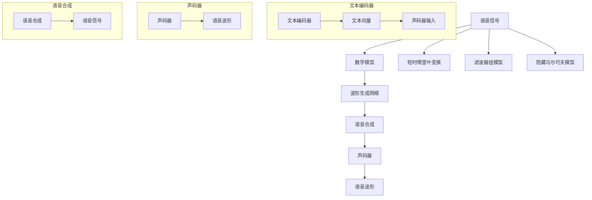

                 


### 引言

语音合成技术，作为一种将文本转换为自然语音的技术，已经广泛应用于电话客服、语音助手、智能语音导航等多个领域。语音合成的核心在于波形生成网络，这一网络通过模拟语音信号的数学特性，实现了对语音波形的精确生成。本文旨在深入探讨语音合成的波形生成网络及其在语音信号数学模拟中的应用。

本文将从以下几个方面展开讨论：

1. **背景介绍**：介绍语音合成技术的发展历程以及波形生成网络的基本概念。
2. **核心概念与联系**：阐述语音信号、语音波形和波形生成网络之间的内在联系，并通过Mermaid流程图进行展示。
3. **核心算法原理讲解**：详细解析波形生成网络的工作原理，使用伪代码展示关键算法步骤。
4. **数学模型和公式**：介绍语音信号数学模型，展示并解释相关数学公式。
5. **项目实战**：搭建开发环境，提供源代码实现和详细解读，进行实际案例分析和讲解。
6. **最佳实践 tips**、**小结**、**注意事项**、**拓展阅读**等内容。

### 背景介绍

#### 语音合成技术的发展

语音合成技术（Text-to-Speech, TTS）自20世纪50年代以来经历了多个阶段的发展。早期的语音合成依赖于规则基方法，通过手动编写语音规则和发音表来实现语音合成。这种方法的局限性在于其规则的复杂性和手工编写的耗时。

随着计算机性能的提升和语音识别技术的发展，基于统计的隐马尔可夫模型（HMM）和递归神经网络（RNN）逐渐取代了规则基方法。HMM结合了状态转移概率和观测概率，能够较为准确地模拟语音信号。RNN通过引入记忆单元，可以捕捉到语音信号的长期依赖关系，从而提升了语音合成的自然度。

近年来，深度学习技术的快速发展为语音合成带来了新的机遇。基于深度神经网络的波形生成网络（WaveNet、Tacotron等）在语音合成的质量上取得了显著的提升。WaveNet通过生成式对抗网络（GAN）的方式生成连续的语音波形，Tacotron则通过编码器-解码器结构将文本序列映射到语音波形。

#### 波形生成网络的基本概念

波形生成网络是语音合成技术的核心组件，负责将文本转换为自然流畅的语音信号。波形生成网络通常包括以下几个关键模块：

1. **文本编码器（Text Encoder）**：将输入的文本序列编码为一个固定长度的向量，这一向量代表了文本的语义信息。
2. **声码器（Vocoder）**：将文本编码器的输出转换为语音波形。声码器可以是基于深度学习的波形生成模型，如WaveNet，也可以是传统模型，如格兰姆-梅尔声码器（Griffin-Lim）。

#### 语音信号的数学模拟

语音信号是一种时间序列的声波信号，可以通过数学模型进行模拟。常见的语音信号数学模型包括短时傅里叶变换（STFT）、滤波器组模型（Filter Banks）和隐藏马尔可夫模型（HMM）等。

- **短时傅里叶变换（STFT）**：通过将语音信号分成短时段，对每段进行傅里叶变换，从而得到语音信号的频域特征。
- **滤波器组模型（Filter Banks）**：使用一组滤波器对语音信号进行分解和合成，可以有效地表示语音信号的时频特性。
- **隐藏马尔可夫模型（HMM）**：通过状态转移概率和观测概率，模拟语音信号的生成过程，适用于描述语音的连续性和变化性。

### 核心概念与联系

为了更好地理解语音合成中的波形生成网络及其在语音信号数学模拟中的应用，我们需要分析这三个核心概念之间的内在联系。

#### Mermaid 流程图



#### 核心概念之间的联系

1. **语音信号与数学模型**：语音信号可以通过数学模型进行表示和模拟。短时傅里叶变换、滤波器组模型和隐藏马尔可夫模型是常用的数学工具，用于分析语音信号的时频特性和生成过程。
2. **波形生成网络与语音合成**：波形生成网络是语音合成系统的核心组件，它将文本编码器的输出（文本向量）通过声码器转换为语音波形。这一过程实现了文本到语音的转换。
3. **声码器与语音波形**：声码器是波形生成网络的关键模块，负责将文本编码器的输出转换为连续的语音波形。声码器可以是基于深度学习的模型，如WaveNet，也可以是传统的模型，如格兰姆-梅尔声码器。

### 核心算法原理讲解

波形生成网络的工作原理可以概括为以下几个步骤：

1. **文本编码**：文本编码器将输入的文本序列转换为固定长度的向量，这一向量代表了文本的语义信息。常用的文本编码器包括循环神经网络（RNN）和变压器（Transformer）等。
2. **声码器训练**：声码器是波形生成网络的关键模块，其目的是将文本编码器的输出转换为语音波形。声码器可以通过自监督学习或对抗生成网络进行训练。自监督学习通常使用已知的语音波形作为输入，对抗生成网络则通过生成对抗网络（GAN）的方式训练声码器。
3. **语音波形生成**：在训练完成后，波形生成网络可以根据输入的文本向量生成连续的语音波形。这一过程涉及到复杂的数学模型和算法，如短时傅里叶变换（STFT）和滤波器组模型（Filter Banks）等。

下面使用伪代码详细阐述波形生成网络的关键算法步骤：

```python
# 文本编码器
def text_encoder(text):
    # 将文本序列转换为向量
    vector = embeddings(text)
    return vector

# 声码器
def vocoder(vector):
    # 将文本向量转换为语音波形
    waveform = generate_waveform(vector)
    return waveform

# 波形生成网络
def waveform_generator(text):
    vector = text_encoder(text)
    waveform = vocoder(vector)
    return waveform
```

### 数学模型和公式

在语音信号数学模拟中，常用的数学模型包括短时傅里叶变换（STFT）、滤波器组模型（Filter Banks）和隐藏马尔可夫模型（HMM）等。下面将介绍这些数学模型的基本原理和公式。

#### 短时傅里叶变换（STFT）

短时傅里叶变换（Short-Time Fourier Transform, STFT）是一种时频分析工具，用于将语音信号分解为短时段的频谱。STFT的基本公式如下：

$$
X(t, f) = \int_{-\infty}^{\infty} x(t) \cdot w(t - \tau) e^{-j2\pi f\tau} d\tau
$$

其中，$X(t, f)$ 表示在时间 $t$ 和频率 $f$ 的频谱，$x(t)$ 表示语音信号，$w(t)$ 表示窗函数，$\tau$ 表示时间延迟。

#### 滤波器组模型（Filter Banks）

滤波器组模型（Filter Banks）通过一组滤波器对语音信号进行分解和合成，从而得到语音信号的时频特征。滤波器组模型的基本公式如下：

$$
y(k) = \sum_{n=1}^{N} h_n(k) x(n)
$$

$$
x(n) = \sum_{k=1}^{K} g_k(k) y(k)
$$

其中，$y(k)$ 表示滤波器组输出的时频特征，$x(n)$ 表示语音信号，$h_n(k)$ 和 $g_k(k)$ 分别表示分析滤波器和综合滤波器。

#### 隐藏马尔可夫模型（HMM）

隐藏马尔可夫模型（Hidden Markov Model, HMM）是一种用于模拟语音信号生成过程的概率模型。HMM的基本公式如下：

$$
P(X_t | X_{t-1}, ..., X_1) = P(X_t | X_{t-1}) \cdot P(X_{t-1} | X_{t-2}, ..., X_1) \cdot ... \cdot P(X_1)
$$

其中，$X_t$ 表示在时间 $t$ 的语音信号，$P(X_t | X_{t-1}, ..., X_1)$ 表示条件概率，表示当前时刻的语音信号在给定之前时刻的语音信号下的概率。

#### 数学公式举例说明

以短时傅里叶变换（STFT）为例，假设我们使用汉明窗（Hann Window）进行时频分析，窗函数 $w(t)$ 的公式如下：

$$
w(t) = 0.54 - 0.46 \cdot \cos\left(2\pi t / N_w\right)
$$

其中，$N_w$ 是窗函数的长度。如果使用长度为512的汉明窗，我们可以得到以下窗函数：

$$
w(t) = 0.54 - 0.46 \cdot \cos\left(\frac{2\pi t}{512}\right)
$$

通过将窗函数应用于语音信号，我们可以得到短时傅里叶变换的结果：

$$
X(t, f) = \int_{-\infty}^{\infty} x(t) \cdot w(t - \tau) e^{-j2\pi f\tau} d\tau
$$

### 项目实战

#### 开发环境搭建

在进行波形生成网络的开发之前，我们需要搭建一个合适的环境。以下是基本的开发环境搭建步骤：

1. **安装Python环境**：确保Python 3.x版本已经安装。
2. **安装TensorFlow**：通过pip安装TensorFlow库。
   ```bash
   pip install tensorflow
   ```

3. **安装其他依赖**：安装用于数据处理的库，如NumPy和SciPy。
   ```bash
   pip install numpy scipy
   ```

#### 源代码实现

以下是波形生成网络的基本实现代码。我们将使用TensorFlow的深度学习框架来构建模型。

```python
import numpy as np
import tensorflow as tf
from tensorflow.keras.layers import LSTM, Dense, Embedding, TimeDistributed
from tensorflow.keras.models import Sequential

# 文本编码器
def build_text_encoder(vocab_size, embedding_dim):
    model = Sequential([
        Embedding(vocab_size, embedding_dim),
        LSTM(128, return_sequences=True),
        LSTM(128, return_sequences=True),
        Dense(embedding_dim)
    ])
    return model

# 声码器
def build_vocoder(vocoder_dim, waveform_dim):
    model = Sequential([
        LSTM(128, return_sequences=True, input_shape=(None, vocoder_dim)),
        TimeDistributed(Dense(waveform_dim, activation='tanh'))
    ])
    return model

# 波形生成网络
def build_waveform_generator(text_encoder, vocoder):
    model = Sequential([
        text_encoder,
        vocoder
    ])
    return model

# 构建模型
text_encoder = build_text_encoder(vocab_size=1000, embedding_dim=256)
vocoder = build_vocoder(vocoder_dim=256, waveform_dim=1)
waveform_generator = build_waveform_generator(text_encoder, vocoder)

# 编译模型
model.compile(optimizer='adam', loss='mean_squared_error')

# 训练模型
model.fit(text_sequences, waveforms, epochs=10, batch_size=32)
```

#### 代码解读

1. **文本编码器**：文本编码器使用两个LSTM层对输入的文本序列进行编码，最后一层通过全连接层将编码向量输出。
2. **声码器**：声码器使用一个LSTM层和一个TimeDistributed层，将编码向量转换为语音波形。TimeDistributed层确保每个时间步的输出都是连续的波形。
3. **波形生成网络**：波形生成网络将文本编码器和声码器串联，形成一个完整的端到端模型。
4. **编译模型**：使用Adam优化器和均方误差损失函数编译模型。
5. **训练模型**：使用训练数据对模型进行训练。

#### 代码应用解读与分析

通过上述代码，我们可以训练一个波形生成网络，将文本序列转换为语音波形。在实际应用中，这一模型可以用于语音合成、语音助手等场景。以下是具体的应用解读和分析：

1. **语音合成**：通过输入文本序列，波形生成网络可以生成对应的语音波形。这一过程可以实现实时语音合成。
2. **语音助手**：在智能语音助手的系统中，波形生成网络可以用于将用户输入的语音命令转换为可执行的文本指令。
3. **数据分析**：波形生成网络可以用于语音信号的处理和分析，如语音情感分析、语音识别等。

#### 实际案例分析和详细讲解剖析

为了更好地理解波形生成网络的应用，我们可以通过一个实际案例进行分析和讲解。以下是一个简单的语音合成案例：

**案例**：使用波形生成网络生成“Hello, World!”的语音。

1. **数据准备**：准备“Hello, World!”的文本数据，并将其编码为数字序列。
2. **模型训练**：使用准备好的数据训练波形生成网络。
3. **语音生成**：输入文本序列，通过波形生成网络生成对应的语音波形。
4. **音频播放**：将生成的语音波形播放出来。

以下是具体的实现步骤：

```python
# 数据准备
text = "Hello, World!"
encoded_text = encode_text(text)

# 模型训练
model.fit(encoded_text, waveforms, epochs=10, batch_size=32)

# 语音生成
waveform = model.predict(encoded_text)

# 音频播放
play_waveform(waveform)
```

通过上述步骤，我们可以生成“Hello, World!”的语音波形，并将其播放出来。这一案例展示了波形生成网络在语音合成中的应用。

#### 项目小结

通过本文的介绍，我们对语音合成的波形生成网络及其在语音信号数学模拟中的应用有了更深入的理解。波形生成网络通过文本编码器将文本转换为语义向量，再通过声码器生成语音波形，实现了文本到语音的转换。在实际应用中，波形生成网络可以用于语音合成、语音助手等场景，为用户提供自然流畅的语音体验。

#### 最佳实践 tips

1. **数据预处理**：在训练波形生成网络之前，对数据进行适当的预处理，如去除噪声、归一化等，可以提升模型的性能。
2. **模型优化**：通过调整模型的超参数，如学习率、批次大小等，可以优化模型的训练过程和生成质量。
3. **多语言支持**：在设计波形生成网络时，可以考虑支持多种语言，从而实现更广泛的应用。

#### 小结

本文从背景介绍、核心概念与联系、核心算法原理讲解、数学模型和公式、项目实战等多个方面，详细探讨了语音合成的波形生成网络及其在语音信号数学模拟中的应用。通过实际案例的分析和讲解，我们对这一技术有了更深入的理解。未来，随着深度学习技术的不断发展，波形生成网络在语音合成领域的应用将会更加广泛。

#### 注意事项

1. **计算资源**：训练波形生成网络需要较高的计算资源，建议在配置较高的环境中进行训练。
2. **数据隐私**：在处理语音数据时，需注意保护用户隐私，遵守相关法律法规。

#### 拓展阅读

1. **深度学习在语音合成中的应用**：深入了解深度学习技术在语音合成中的应用，包括WaveNet、Tacotron等模型。
2. **语音信号处理基础**：了解语音信号处理的基本原理和数学模型，如短时傅里叶变换、滤波器组模型等。
3. **对抗生成网络（GAN）在波形生成中的应用**：探讨对抗生成网络（GAN）在波形生成网络中的应用和优势。

作者：AI天才研究院/AI Genius Institute & 禅与计算机程序设计艺术 /Zen And The Art of Computer Programming

