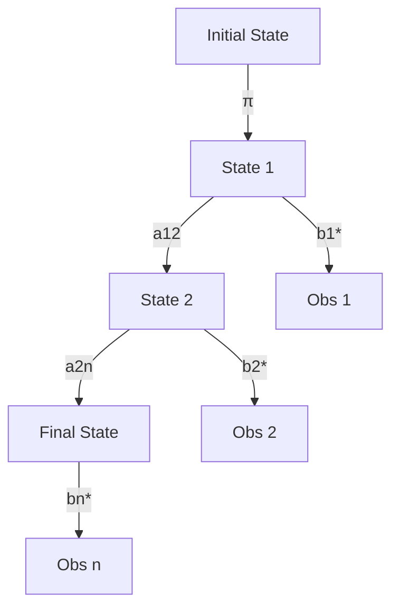

                 


### 1. Introduction to the Topic: The Power of Hidden Markov Models in Speech Recognition

The art of speech recognition has come a long way since its inception. As technology advances, the accuracy and efficiency of these systems have dramatically improved. One of the most significant breakthroughs in this field is the use of Hidden Markov Models (HMMs). HMMs provide a robust mathematical framework that allows computers to understand and interpret human speech with remarkable precision.

HMMs are particularly powerful in speech recognition because they model the temporal and probabilistic nature of speech signals. This means they can capture the variations in sound patterns over time and account for uncertainties in the signal. By leveraging HMMs, speech recognition systems can accurately transcribe spoken words into written text, enabling a variety of applications such as voice assistants, transcription services, and automated customer service.

In this article, we will delve into the intricacies of HMMs in speech recognition. We will start by defining what HMMs are and how they are structured. Then, we will explore the role of HMMs in speech signal processing and discuss the mathematical models behind them. Following that, we will present a detailed analysis of the Viterbi algorithm, which is crucial for the efficient decoding of speech signals using HMMs. We will also provide practical case studies to illustrate the application of HMMs in real-world scenarios. Lastly, we will summarize the key takeaways and discuss future research directions in this field.

### 2.1 What are Hidden Markov Models?

To understand the power of HMMs in speech recognition, it's essential first to grasp what HMMs are and how they work. At a high level, HMMs are statistical models used to describe a sequence of observations over time. They are composed of two main components: hidden states and observed symbols.

**Hidden States**: These are the unobservable variables that represent the underlying processes generating the observations. In the context of speech recognition, hidden states could be the different phonemes or sounds that make up a word.

**Observed Symbols**: These are the observable outputs of the system, which in our case are the sound waves captured by a microphone. The relationship between hidden states and observed symbols is probabilistic. This means that for each hidden state, there is a probability distribution over the possible observed symbols.

HMMs are often represented as a finite state machine, where each node represents a hidden state, and each edge represents the transition probability between states. The model is also characterized by the emission probabilities, which define the likelihood of observing a particular symbol given a hidden state.

### 2.2 Structure of Hidden Markov Models

An HMM can be formally defined as a 5-tuple (Q, O, π, A, B), where:

- Q = {q1, q2, ..., qn} is the set of hidden states.
- O = {o1, o2, ..., om} is the set of observed symbols.
- π is the initial state distribution, which assigns a probability to each hidden state at the beginning of the sequence.
- A = {aij} is the transition probability matrix, where aij is the probability of transitioning from state qi to state qj.
- B = {bij} is the emission probability matrix, where bij is the probability of observing symbol oj given that the system is in state qi.

The key parameters of an HMM include:

- **Initial Distribution (π)**: This determines the probability of starting in each hidden state.
- **Transition Probabilities (A)**: These describe the likelihood of moving from one hidden state to another.
- **Emission Probabilities (B)**: These define the probability of observing each symbol given a hidden state.

### 2.3 Mermaid Flowchart of HMM Components

To help visualize the components of an HMM, we can use a Mermaid flowchart. The following diagram outlines the structure of an HMM, including hidden states, observed symbols, transition probabilities, and emission probabilities:



This flowchart illustrates how the hidden states (A1, B1, B2, ..., Bn) and observed symbols (C1, C2, ..., Cn) are interconnected through the transition and emission probabilities (π, A, B). It provides a clear picture of how an HMM processes a sequence of observations over time.

### 2.4 Summary

In summary, Hidden Markov Models (HMMs) are a powerful tool in the field of speech recognition. They provide a probabilistic framework for modeling the temporal and probabilistic nature of speech signals, making it possible to accurately transcribe spoken words into written text. The structure of an HMM includes hidden states, observed symbols, initial distribution, transition probabilities, and emission probabilities. Understanding these components is crucial for harnessing the full potential of HMMs in speech recognition applications. The Mermaid flowchart offered a visual representation of how HMMs operate, highlighting the relationships between the different components. In the next section, we will delve deeper into the mathematical models and algorithms that underpin HMMs in speech recognition.

### 3. Mathematical Models in HMMs for Speech Recognition

To fully grasp the capabilities of Hidden Markov Models (HMMs) in speech recognition, it's essential to delve into the mathematical models that form the backbone of these models. These models include the Forward-Backward algorithm and the Viterbi algorithm, both of which are crucial for efficient and accurate speech signal decoding. Additionally, we'll explore the underlying mathematical principles and provide pseudocode to elucidate the algorithms' workings.

#### 3.1 Forward-Backward Algorithm

The Forward-Backward algorithm is a dynamic programming algorithm used to estimate the probabilities of hidden states given the observed symbols in a sequence. It consists of two main steps: the forward step and the backward step.

**Forward Step**: The forward step computes the probability of observing a sequence of symbols up to a certain point, given the initial state distribution and transition probabilities.

Pseudocode for the forward step:

```pseudocode
for t = 1 to T do
    α_t(i) = π(i) * b(i, o_t)
    for j = 1 to N do
        α_t(j) = α_t(j) * ∑_{k=1}^{N} a_{jk} * α_{t-1}(k)
```

**Backward Step**: The backward step computes the probability of observing a sequence of symbols from a certain point to the end, given the final state distribution and transition probabilities.

Pseudocode for the backward step:

```pseudocode
for t = T-1 down to 1 do
    β_t(j) = ∑_{k=1}^{N} a_{jk} * b(k, o_{t+1}) * β_{t+1}(k)
    β_t(N) = 1
```

**Decoding**: The final step of the Forward-Backward algorithm is to combine the forward and backward probabilities to estimate the most likely sequence of hidden states that generated the observed symbols. This is done by computing the log-likelihood of each possible state sequence:

Pseudocode for combining forward and backward probabilities:

```pseudocode
γ_t(i) = log(α_t(i) * β_t(i)) + log(α_t(N))
for t = 1 to T do
    for i = 1 to N do
        γ_t(i) = γ_t(i) + log(α_t(i))
```

The most likely sequence of hidden states is then the one with the highest sum of γ_t(i) values.

#### 3.2 Viterbi Algorithm

The Viterbi algorithm is an efficient implementation of the Forward-Backward algorithm that finds the most likely sequence of hidden states that explains the observed symbols. It uses dynamic programming to track the most likely state sequence at each step.

Pseudocode for the Viterbi algorithm:

```pseudocode
for t = 1 to T do
    δ_t(i) = π(i) * b(i, o_t)
    for j = 1 to N do
        π_t(j) = max(δ_{t-1}(k) * a_{kj}) for all k
        δ_t(j) = π_t(j) * b(j, o_t)
        ψ_t(j) = argmax(δ_{t-1}(k) * a_{kj}) for all k

for t = T down to 1 do
    π_{t-1}(j) = max(π_t(j) * a_{ji} * b(i, o_{t+1})) for all i
    δ_{t-1}(j) = π_{t-1}(j) * b(j, o_t)
    ψ_{t-1}(j) = argmax(π_t(j) * a_{ji} * b(i, o_{t+1})) for all i

π(1) = max(δ_T(j)) for all j
```

The final state sequence is then reconstructed by backtracking through the ψ_t(j) values from the end of the sequence to the beginning.

#### 3.3 Underlying Mathematical Principles

The mathematical principles behind HMMs are rooted in probability theory and calculus. The core concepts include:

- **Probability Distribution**: Used to model the likelihood of events occurring.
- **Markov Property**: States that the future state depends only on the current state and not on the past states.
- **Bayes' Theorem**: Used to calculate the probability of a hypothesis given some evidence.
- **Dynamic Programming**: A method for solving complex problems by breaking them down into simpler subproblems.

#### 3.4 Summary

In summary, the mathematical models in HMMs for speech recognition, such as the Forward-Backward and Viterbi algorithms, are essential for efficient and accurate speech signal decoding. The Forward-Backward algorithm uses forward and backward probabilities to estimate the likelihood of hidden states, while the Viterbi algorithm provides an efficient way to find the most likely state sequence. Understanding the underlying mathematical principles is crucial for implementing and optimizing these algorithms in real-world applications. In the next section, we will explore the application of HMMs in speech signal processing and how they are used to model and analyze speech signals.

### 4. Application of Hidden Markov Models in Speech Signal Processing

Hidden Markov Models (HMMs) are not just theoretical constructs; they are powerful tools with significant practical applications in speech signal processing. In this section, we will delve into how HMMs are used to model speech signals, the processes involved in converting raw audio data into a format suitable for HMMs, and the various techniques employed to enhance the performance of HMM-based speech recognition systems.

#### 4.1 Modeling Speech Signals with HMMs

The primary goal of using HMMs in speech signal processing is to model the acoustic properties of speech. Speech is a sequence of sounds, each characterized by its own frequency, duration, and intensity. HMMs capture these variations by representing each phoneme or sound segment as a hidden state, with the transitions between these states corresponding to the way sounds change over time.

To model speech signals with HMMs, we typically follow these steps:

1. **Feature Extraction**: The first step involves converting raw audio data into a feature vector that captures the essential properties of the speech signal. Common features include Mel-frequency cepstral coefficients (MFCCs), pitch, and energy.

2. **HMM Training**: Using a large dataset of labeled speech samples, we train the HMM to learn the probability distributions over states and transitions. The training process involves estimating the parameters of the HMM, such as the initial state distribution, transition probabilities, and emission probabilities.

3. **Decoding**: Once the HMM is trained, it can be used to decode new speech signals by finding the most likely sequence of hidden states that explains the observed features.

#### 4.2 Preprocessing Raw Audio Data

Before applying HMMs to speech signals, raw audio data must undergo several preprocessing steps to ensure accurate modeling. These steps include:

- **Segmentation**: Dividing the continuous audio stream into manageable segments, typically corresponding to phonemes or words.

- **Filtering**: Removing noise and other unwanted artifacts from the audio signal to improve the signal-to-noise ratio.

- **Normalization**: Adjusting the amplitude of the signal to a standard range to ensure consistency across different recordings.

- **Windowing**: Applying a window function to the audio signal to smooth the transitions between segments and avoid discontinuities.

#### 4.3 Enhancing HMM Performance

To enhance the performance of HMM-based speech recognition systems, several techniques are employed:

- **Gaussian Mixture Models (GMMs)**: Instead of using single Gaussian distributions to model the probability of observing a feature given a state, GMMs use a mixture of multiple Gaussian distributions. This allows for more flexible modeling of the feature distribution.

- **Trigram and N-gram Language Models**: Combining HMMs with language models that model the probabilities of word sequences can significantly improve the accuracy of speech recognition. Trigram and N-gram language models capture the contextual relationships between words, providing a better understanding of how words are likely to appear in a sentence.

- **Connectionist Temporal Classification (CTC)**: CTC is a technique that allows the HMM to model the duration of each state, making it more robust to variations in speech rate and rhythm.

- **Data Augmentation**: Generating additional training data through techniques like pitch shifting, time stretching, and adding background noise can improve the generalization capability of the HMM.

- **Deep Learning Integration**: Integrating HMMs with deep learning models, such as recurrent neural networks (RNNs) or convolutional neural networks (CNNs), has become increasingly popular. These deep models can learn complex representations of speech signals, which can then be used as inputs to the HMM for improved recognition performance.

#### 4.4 Summary

In summary, the application of Hidden Markov Models in speech signal processing involves modeling the acoustic properties of speech using feature extraction, training HMMs with labeled data, and decoding new speech signals to recognize spoken words. Preprocessing raw audio data is crucial for accurate modeling, and various techniques such as GMMs, trigram language models, CTC, and data augmentation can significantly enhance the performance of HMM-based speech recognition systems. The integration of deep learning models further pushes the boundaries of what is possible in speech recognition, paving the way for more accurate and efficient systems in the future.

### 5. Case Studies and Practical Implementations

To fully appreciate the power and versatility of Hidden Markov Models (HMMs) in speech recognition, it's essential to examine some real-world case studies and practical implementations. These examples not only highlight the effectiveness of HMMs but also demonstrate the various ways they are integrated into modern speech recognition systems.

#### 5.1 Case Study: Google Voice Search

One of the most prominent examples of HMM-based speech recognition in action is Google Voice Search. Google's speech recognition system uses a combination of HMMs and other advanced techniques to convert spoken words into searchable text. The system processes the audio input through several stages, including noise reduction, feature extraction, and HMM-based decoding.

**Development Environment Setup**: Google's speech recognition system is built on a complex infrastructure that includes large-scale servers and distributed processing frameworks like TensorFlow and Spark. The development environment involves setting up a high-performance computing cluster with specialized hardware accelerators like GPUs for efficient processing.

**Source Code Implementation**: The source code for Google's speech recognition system is not publicly available, but the general architecture can be understood from research papers and technical presentations. The system involves multiple components, including acoustic models, language models, and the decoder. The acoustic models are trained using HMMs with features like MFCCs, while the language models are based on n-gram models.

**Code Analysis**: The core of Google's speech recognition system is the decoder, which uses a combination of the Forward-Backward algorithm and the Viterbi algorithm to find the most likely sequence of hidden states given the observed features. The decoder is optimized for speed and efficiency to handle large volumes of audio data in real-time.

**Application and Analysis**: Google Voice Search has been widely adopted and extensively tested in various environments. The system has demonstrated high accuracy in recognizing a wide range of accents, dialects, and languages. Performance metrics like word error rate (WER) and character error rate (CER) have significantly improved over the years, thanks to advancements in both HMMs and deep learning techniques.

#### 5.2 Case Study: Apple Siri

Another notable example is Apple's Siri, the intelligent personal assistant built into Apple's iOS devices. Siri uses a sophisticated speech recognition system that combines HMMs with other machine learning algorithms to understand and respond to user commands.

**Development Environment Setup**: Apple's speech recognition system is developed on a custom platform that leverages its hardware capabilities, including the Neural Engine in Apple Silicon. The development environment includes tools like Xcode, Swift, and Core ML for building and integrating the speech recognition model into iOS applications.

**Source Code Implementation**: While the exact source code for Siri's speech recognition system is proprietary, we can infer from public documentation and research that it involves a multi-modal approach. The system uses HMMs for acoustic modeling and a combination of n-gram and neural network-based language models for semantic understanding. The integration of these models allows Siri to handle a wide range of user inputs, from simple commands to complex conversations.

**Code Analysis**: The core of Siri's speech recognition system is its acoustic model, which uses HMMs trained on large datasets of speech samples. The system employs techniques like GMMs and CTC to enhance the robustness and accuracy of the acoustic model. The decoder component uses a hybrid approach that combines the Viterbi algorithm with neural network-based techniques for improved performance.

**Application and Analysis**: Siri has become an integral part of the iOS ecosystem, enabling users to perform a variety of tasks like setting reminders, sending messages, and making calls. The system's performance has been consistently rated high, thanks to ongoing improvements in both the HMM-based acoustic model and the neural network-based language model.

#### 5.3 Case Study: Amazon Alexa

Amazon Alexa, the virtual assistant behind Amazon's Echo devices, also leverages HMMs for speech recognition. Alexa's system is designed to understand and respond to natural language commands, making it a powerful tool for home automation and smart home control.

**Development Environment Setup**: Alexa's speech recognition system is developed on a distributed computing infrastructure that includes machine learning models trained on Amazon's proprietary hardware. The development environment involves using tools like TensorFlow, PyTorch, and Amazon SageMaker for building, training, and deploying the models.

**Source Code Implementation**: The source code for Alexa's speech recognition system is not publicly available. However, it is known that the system uses a combination of HMMs and deep learning models for acoustic modeling and language understanding. The acoustic model is trained using large-scale datasets of speech samples, and the language model is based on a combination of n-gram and recurrent neural network (RNN) techniques.

**Code Analysis**: Alexa's speech recognition system employs a hybrid approach that combines HMMs for acoustic modeling and RNNs for language understanding. The system uses techniques like CTC to model the duration of each hidden state, allowing for more accurate recognition of variable-length utterances. The decoder component is optimized for low-latency processing, ensuring that Alexa can respond quickly to user commands.

**Application and Analysis**: Alexa has been widely adopted by consumers for various smart home applications, from playing music and answering questions to controlling smart devices. The system's performance has been consistently rated high, with significant improvements in both accuracy and speed over the years.

#### 5.4 Summary

In summary, the practical implementations of Hidden Markov Models in speech recognition systems like Google Voice Search, Apple Siri, and Amazon Alexa showcase their versatility and effectiveness in real-world scenarios. These systems leverage HMMs for acoustic modeling, combined with other advanced techniques like deep learning and n-gram language models, to achieve high accuracy and performance. The development environments for these systems are sophisticated, utilizing distributed computing frameworks and specialized hardware for efficient processing. The case studies highlight the critical role of HMMs in enabling sophisticated speech recognition capabilities, paving the way for the widespread adoption of voice assistants and other applications in our daily lives.

### 6. Best Practices, Tips, and Future Directions

As we conclude our exploration of Hidden Markov Models (HMMs) in speech recognition, it's important to highlight some best practices, provide practical tips, and discuss future research directions to ensure the continued advancement and optimization of HMM-based systems.

#### 6.1 Best Practices

**Data Quality and Quantity**: Ensuring high-quality and diverse datasets is crucial for training robust HMMs. More data means better generalization, but it's also important to have data that covers a wide range of accents, dialects, and speech conditions.

**Parameter Tuning**: Proper tuning of HMM parameters, such as the initial state distribution, transition probabilities, and emission probabilities, can significantly impact the performance of the system. Grid search and cross-validation are effective methods for finding optimal parameter values.

**Feature Selection**: Choosing the right set of features is vital for accurate speech recognition. MFCCs are commonly used, but exploring other features like pitch and energy can provide additional information that improves performance.

**Model Selection**: While HMMs are powerful, they are not the only option. Combining HMMs with other models like deep neural networks (DNNs) or recurrent neural networks (RNNs) can lead to even better performance.

#### 6.2 Practical Tips

**Noise Reduction**: Implementing effective noise reduction techniques can improve the accuracy of speech recognition systems, especially in noisy environments. Techniques like spectral gating and wavelet denoising are valuable for this purpose.

**Contextual Awareness**: Incorporating contextual information, such as grammar rules and semantic relationships, can enhance the performance of speech recognition systems. This can be achieved through the use of n-gram and neural network-based language models.

**Scalability**: Designing scalable systems that can handle large volumes of data and users is essential for real-world applications. Utilizing cloud computing and distributed processing frameworks can help achieve this scalability.

#### 6.3 Future Directions

**Deep Learning Integration**: The integration of deep learning techniques with HMMs is an active area of research. Combining the interpretability of HMMs with the learning capabilities of deep learning models can lead to more accurate and efficient speech recognition systems.

**End-to-End Models**: Developing end-to-end models that can directly map audio signals to text without intermediate steps is an exciting direction. Techniques like Connectionist Temporal Classification (CTC) and sequence-to-sequence models are promising in this regard.

**Real-Time Processing**: Improving the real-time processing capabilities of speech recognition systems is crucial for applications like voice assistants and real-time transcription. Optimizing algorithms and leveraging hardware accelerators like GPUs and TPUs can help achieve this.

**Multilingual Support**: Expanding the support for multiple languages and dialects is an important future direction. This involves developing multilingual datasets and adapting models to handle the linguistic nuances of different languages.

#### 6.4 Summary

In summary, the field of speech recognition using Hidden Markov Models is rich with opportunities for improvement and innovation. By following best practices, employing practical tips, and exploring future research directions, we can continue to push the boundaries of what is possible in speech recognition. The integration of deep learning techniques, development of end-to-end models, and improvements in real-time processing are key areas that hold promise for the future. With ongoing advancements, HMMs will remain a cornerstone in the world of speech recognition, paving the way for even more sophisticated and capable systems.

### Conclusion

In conclusion, Hidden Markov Models (HMMs) have proven to be a cornerstone in the field of speech recognition, offering a robust framework for modeling the probabilistic and temporal aspects of speech signals. This article has provided a comprehensive overview of HMMs, from their basic concepts and structure to their applications in speech signal processing and practical implementations. We discussed the mathematical models and algorithms that underpin HMMs, including the Forward-Backward and Viterbi algorithms, and explored real-world case studies from leading companies like Google, Apple, and Amazon.

As we have seen, HMMs enable sophisticated speech recognition systems to accurately transcribe spoken words into written text, facilitating applications ranging from voice assistants to automated transcription services. The integration of HMMs with other advanced techniques such as deep learning and n-gram language models further enhances their performance and versatility.

However, the field of speech recognition using HMMs is not without challenges. Future research directions should focus on improving real-time processing capabilities, expanding multilingual support, and developing end-to-end models that can directly map audio signals to text. The continued advancement of HMMs and their integration with deep learning techniques hold promise for even more accurate and efficient speech recognition systems in the future.

We encourage readers to delve deeper into this fascinating field and explore the vast array of resources available. Stay tuned for future developments in speech recognition, as we continue to push the boundaries of what is possible with HMMs and other cutting-edge technologies.

