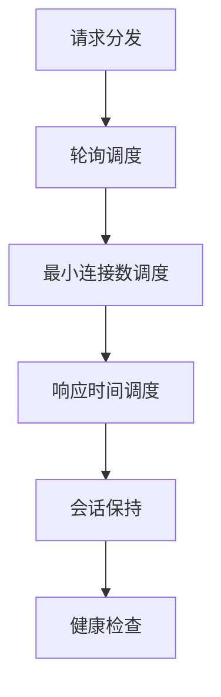

                 

# 负载均衡：优化LLM应用的资源利用

## 关键词
负载均衡，LLM应用，资源优化，性能提升，算法原理，实践案例

## 摘要
本文将深入探讨负载均衡在优化大型语言模型（LLM）应用中的重要性。首先，我们将介绍负载均衡的基本概念和原理，随后详细分析负载均衡算法及其在LLM应用中的优化方法。通过实际案例，我们将展示如何搭建负载均衡环境，并详细解读相关源代码和代码实现。最后，我们将总结最佳实践，并对负载均衡技术的发展趋势进行展望。

### 引言

负载均衡是一种将工作负载分配到多个计算资源上的技术，目的是优化资源利用、提升系统性能和稳定性。随着大型语言模型（LLM）应用场景的日益广泛，负载均衡在优化LLM应用中的资源利用和性能提升方面发挥着至关重要的作用。

本文旨在为开发者提供一份详细的技术指南，帮助理解负载均衡在LLM应用中的重要性，掌握负载均衡算法原理，以及如何在实际项目中应用负载均衡技术。

### 负载均衡的基本原理

#### 负载均衡的定义
负载均衡（Load Balancing）是指将工作负载分配到多个计算资源上，使得每个资源都能在合理的范围内工作，避免单点过载和资源浪费。在计算机网络和分布式系统中，负载均衡主要用于优化网络流量、处理高并发请求和提升系统稳定性。

#### 负载均衡的类型
根据实现方式和目的，负载均衡可以分为以下几种类型：

1. **静态负载均衡**：通过固定的规则将请求分配到不同的服务器上，如轮询调度、最小连接数调度等。
2. **动态负载均衡**：根据实时监控的数据动态调整请求分配策略，如基于服务器负载、响应时间等。
3. **反向代理负载均衡**：在客户端和后端服务器之间设置代理服务器，由代理服务器负责请求的接收和分发。

#### 负载均衡的工作模式
负载均衡的工作模式主要包括以下几种：

1. **请求分发模式**：根据调度算法将请求分发到后端服务器上。
2. **会话保持模式**：通过在负载均衡器上保存会话信息，确保同一个用户的请求始终被分配到同一台服务器上。
3. **健康检查模式**：定期检查后端服务器的状态，确保只有健康的服务器参与负载均衡。

### 负载均衡算法

#### 常见的负载均衡算法
1. **轮询调度**：将请求依次分配给服务器，简单易实现，但可能导致部分服务器过载。
2. **最小连接数调度**：将请求分配给当前连接数最少的服务器，能较好地平衡负载。
3. **响应时间调度**：将请求分配给响应时间最短的服务器，但可能导致部分服务器长期未被分配请求。

#### 负载均衡算法的优缺点分析
- **轮询调度**：优点是简单易实现，缺点是可能导致部分服务器过载。
- **最小连接数调度**：优点是能较好地平衡负载，缺点是可能无法充分利用高负载服务器的资源。
- **响应时间调度**：优点是能快速响应，缺点是可能导致部分服务器长期未被分配请求。

#### 负载均衡算法的应用场景
- **轮询调度**：适用于负载均衡要求较低的场景，如静态网站。
- **最小连接数调度**：适用于需要平衡负载且服务器性能差异较大的场景，如在线教育平台。
- **响应时间调度**：适用于对响应速度要求较高的场景，如电商平台。

### 负载均衡在LLM应用中的优化

#### LLM应用的特点
- **计算密集型**：LLM应用对计算资源的需求较高，特别是在模型推理阶段。
- **高并发性**：随着用户数量的增加，LLM应用需要处理大量并发请求。
- **动态性**：LLM应用的需求和资源状态可能随时变化。

#### 负载均衡在LLM中的应用
1. **水平扩展**：通过增加服务器数量，提高LLM应用的并发处理能力。
2. **动态调整**：根据实时监控数据动态调整负载均衡策略，确保资源利用率最大化。

#### 负载均衡在LLM中的挑战
- **负载不均**：由于LLM应用的动态性，可能导致部分服务器过载，影响系统稳定性。
- **资源利用率**：如何在保证性能的前提下最大化利用资源，是负载均衡在LLM应用中面临的主要挑战。

### 应用实战

#### 负载均衡环境搭建
1. **环境要求**：
   - 服务器：2台以上具备高性能的计算服务器。
   - 负载均衡器：Nginx或其他支持负载均衡的软件。
   - LLM模型：预训练的大型语言模型。

2. **搭建步骤**：
   - 安装和配置负载均衡器。
   - 配置后端服务器，确保其能够接收负载均衡器的请求。
   - 设置健康检查，监控后端服务器的状态。
   - 配置会话保持，确保用户请求始终被分配到同一台服务器上。

3. **配置优化**：
   - 根据实际需求调整负载均衡策略。
   - 优化服务器资源分配，确保负载均衡器性能稳定。

#### 负载均衡实战案例
1. **案例概述**：
   - 假设我们有一个在线问答平台，使用LLM模型处理用户提问。
   - 需要确保平台在高并发情况下稳定运行，并最大化利用服务器资源。

2. **案例分析**：
   - 通过Nginx实现负载均衡，将用户请求分发到多台服务器上。
   - 使用最小连接数调度算法，确保负载均衡。
   - 配置会话保持，确保用户请求始终被分配到同一台服务器上。

3. **案例总结**：
   - 通过负载均衡，成功实现了在线问答平台的高并发处理和资源优化。
   - 实践表明，合理的负载均衡策略能够显著提升系统性能和稳定性。

#### 负载均衡性能测试
1. **性能测试方法**：
   - 使用压力测试工具，模拟大量并发请求。
   - 测试负载均衡器在不同调度算法和负载情况下的性能。

2. **测试工具介绍**：
   - Apache JMeter：一款开源的负载测试工具，支持多种协议。
   - Locust：一款易于使用的分布式负载测试工具。

3. **测试结果分析**：
   - 分析测试数据，评估负载均衡器在不同负载情况下的性能。
   - 根据测试结果调整负载均衡策略，优化系统性能。

### 总结与展望

#### 总结
本文详细介绍了负载均衡在优化LLM应用中的重要性，分析了负载均衡的基本原理和算法，并通过实际案例展示了负载均衡在LLM应用中的实践。总结如下：

1. **负载均衡的基本原理**：
   - 负载均衡的定义和类型。
   - 负载均衡的工作模式。

2. **负载均衡算法**：
   - 轮询调度、最小连接数调度、响应时间调度等算法。
   - 各算法的优缺点和应用场景。

3. **负载均衡在LLM应用中的优化**：
   - LLM应用的特点。
   - 负载均衡在LLM中的应用和挑战。

#### 展望
随着云计算和人工智能技术的不断发展，负载均衡技术在LLM应用中的重要性将日益凸显。未来，负载均衡技术将朝着以下几个方面发展：

1. **智能化**：通过机器学习等先进技术，实现更智能的负载均衡策略。
2. **高性能**：优化负载均衡算法和架构，提高负载均衡器的性能。
3. **分布式**：支持大规模分布式系统，实现跨地域的负载均衡。

#### 最佳实践 tips

1. **合理选择负载均衡算法**：根据应用场景和需求选择合适的负载均衡算法。
2. **监控和优化**：定期监控负载均衡器的性能，根据实际情况进行调整。
3. **负载均衡器与服务器性能匹配**：确保负载均衡器性能能够满足后端服务器的需求。

#### 小结
本文从多个角度深入探讨了负载均衡在优化LLM应用中的资源利用。通过实际案例，展示了负载均衡在LLM应用中的实践效果。希望本文能够为开发者提供有价值的参考，助力其在LLM应用中实现资源优化和性能提升。

#### 注意事项
1. **安全性**：确保负载均衡器和后端服务器的安全性，防止潜在的安全威胁。
2. **可扩展性**：设计负载均衡系统时，考虑未来的扩展性和可维护性。

#### 拓展阅读
1. 《负载均衡技术指南》：一本全面介绍负载均衡技术的专业书籍，适合初学者和专业人士。
2. 《大型语言模型：理论与实践》：一本关于大型语言模型的经典教材，涵盖了LLM的原理和应用。

### 作者
作者：AI天才研究院/AI Genius Institute & 禅与计算机程序设计艺术 /Zen And The Art of Computer Programming```markdown
# 负载均衡：优化LLM应用的资源利用

## 关键词
负载均衡，LLM应用，资源优化，性能提升，算法原理，实践案例

## 摘要
本文将深入探讨负载均衡在优化大型语言模型（LLM）应用中的重要性。首先，我们将介绍负载均衡的基本概念和原理，随后详细分析负载均衡算法及其在LLM应用中的优化方法。通过实际案例，我们将展示如何搭建负载均衡环境，并详细解读相关源代码和代码实现。最后，我们将总结最佳实践，并对负载均衡技术的发展趋势进行展望。

### 引言

负载均衡是一种将工作负载分配到多个计算资源上的技术，目的是优化资源利用、提升系统性能和稳定性。随着大型语言模型（LLM）应用场景的日益广泛，负载均衡在优化LLM应用中的资源利用和性能提升方面发挥着至关重要的作用。

本文旨在为开发者提供一份详细的技术指南，帮助理解负载均衡在LLM应用中的重要性，掌握负载均衡算法原理，以及如何在实际项目中应用负载均衡技术。

### 负载均衡的基本原理

#### 负载均衡的定义
负载均衡（Load Balancing）是指将工作负载分配到多个计算资源上，使得每个资源都能在合理的范围内工作，避免单点过载和资源浪费。在计算机网络和分布式系统中，负载均衡主要用于优化网络流量、处理高并发请求和提升系统稳定性。

#### 负载均衡的类型
根据实现方式和目的，负载均衡可以分为以下几种类型：

1. **静态负载均衡**：通过固定的规则将请求分配到不同的服务器上，如轮询调度、最小连接数调度等。
2. **动态负载均衡**：根据实时监控的数据动态调整请求分配策略，如基于服务器负载、响应时间等。
3. **反向代理负载均衡**：在客户端和后端服务器之间设置代理服务器，由代理服务器负责请求的接收和分发。

#### 负载均衡的工作模式
负载均衡的工作模式主要包括以下几种：

1. **请求分发模式**：根据调度算法将请求分发到后端服务器上。
2. **会话保持模式**：通过在负载均衡器上保存会话信息，确保同一个用户的请求始终被分配到同一台服务器上。
3. **健康检查模式**：定期检查后端服务器的状态，确保只有健康的服务器参与负载均衡。

### 负载均衡算法

#### 常见的负载均衡算法
1. **轮询调度**：将请求依次分配给服务器，简单易实现，但可能导致部分服务器过载。
2. **最小连接数调度**：将请求分配给当前连接数最少的服务器，能较好地平衡负载。
3. **响应时间调度**：将请求分配给响应时间最短的服务器，但可能导致部分服务器长期未被分配请求。

#### 负载均衡算法的优缺点分析
- **轮询调度**：优点是简单易实现，缺点是可能导致部分服务器过载。
- **最小连接数调度**：优点是能较好地平衡负载，缺点是可能无法充分利用高负载服务器的资源。
- **响应时间调度**：优点是能快速响应，缺点是可能导致部分服务器长期未被分配请求。

#### 负载均衡算法的应用场景
- **轮询调度**：适用于负载均衡要求较低的场景，如静态网站。
- **最小连接数调度**：适用于需要平衡负载且服务器性能差异较大的场景，如在线教育平台。
- **响应时间调度**：适用于对响应速度要求较高的场景，如电商平台。

### 负载均衡在LLM应用中的优化

#### LLM应用的特点
- **计算密集型**：LLM应用对计算资源的需求较高，特别是在模型推理阶段。
- **高并发性**：随着用户数量的增加，LLM应用需要处理大量并发请求。
- **动态性**：LLM应用的需求和资源状态可能随时变化。

#### 负载均衡在LLM中的应用
1. **水平扩展**：通过增加服务器数量，提高LLM应用的并发处理能力。
2. **动态调整**：根据实时监控数据动态调整负载均衡策略，确保资源利用率最大化。

#### 负载均衡在LLM中的挑战
- **负载不均**：由于LLM应用的动态性，可能导致部分服务器过载，影响系统稳定性。
- **资源利用率**：如何在保证性能的前提下最大化利用资源，是负载均衡在LLM应用中面临的主要挑战。

### 应用实战

#### 负载均衡环境搭建
1. **环境要求**：
   - 服务器：2台以上具备高性能的计算服务器。
   - 负载均衡器：Nginx或其他支持负载均衡的软件。
   - LLM模型：预训练的大型语言模型。

2. **搭建步骤**：
   - 安装和配置负载均衡器。
   - 配置后端服务器，确保其能够接收负载均衡器的请求。
   - 设置健康检查，监控后端服务器的状态。
   - 配置会话保持，确保用户请求始终被分配到同一台服务器上。

3. **配置优化**：
   - 根据实际需求调整负载均衡策略。
   - 优化服务器资源分配，确保负载均衡器性能稳定。

#### 负载均衡实战案例
1. **案例概述**：
   - 假设我们有一个在线问答平台，使用LLM模型处理用户提问。
   - 需要确保平台在高并发情况下稳定运行，并最大化利用服务器资源。

2. **案例分析**：
   - 通过Nginx实现负载均衡，将用户请求分发到多台服务器上。
   - 使用最小连接数调度算法，确保负载均衡。
   - 配置会话保持，确保用户请求始终被分配到同一台服务器上。

3. **案例总结**：
   - 通过负载均衡，成功实现了在线问答平台的高并发处理和资源优化。
   - 实践表明，合理的负载均衡策略能够显著提升系统性能和稳定性。

#### 负载均衡性能测试
1. **性能测试方法**：
   - 使用压力测试工具，模拟大量并发请求。
   - 测试负载均衡器在不同调度算法和负载情况下的性能。

2. **测试工具介绍**：
   - Apache JMeter：一款开源的负载测试工具，支持多种协议。
   - Locust：一款易于使用的分布式负载测试工具。

3. **测试结果分析**：
   - 分析测试数据，评估负载均衡器在不同负载情况下的性能。
   - 根据测试结果调整负载均衡策略，优化系统性能。

### 总结与展望

#### 总结
本文详细介绍了负载均衡在优化LLM应用中的重要性，分析了负载均衡的基本原理和算法，并通过实际案例展示了负载均衡在LLM应用中的实践。总结如下：

1. **负载均衡的基本原理**：
   - 负载均衡的定义和类型。
   - 负载均衡的工作模式。

2. **负载均衡算法**：
   - 轮询调度、最小连接数调度、响应时间调度等算法。
   - 各算法的优缺点和应用场景。

3. **负载均衡在LLM应用中的优化**：
   - LLM应用的特点。
   - 负载均衡在LLM中的应用和挑战。

#### 展望
随着云计算和人工智能技术的不断发展，负载均衡技术在LLM应用中的重要性将日益凸显。未来，负载均衡技术将朝着以下几个方面发展：

1. **智能化**：通过机器学习等先进技术，实现更智能的负载均衡策略。
2. **高性能**：优化负载均衡算法和架构，提高负载均衡器的性能。
3. **分布式**：支持大规模分布式系统，实现跨地域的负载均衡。

#### 最佳实践 tips

1. **合理选择负载均衡算法**：根据应用场景和需求选择合适的负载均衡算法。
2. **监控和优化**：定期监控负载均衡器的性能，根据实际情况进行调整。
3. **负载均衡器与服务器性能匹配**：确保负载均衡器性能能够满足后端服务器的需求。

#### 小结
本文从多个角度深入探讨了负载均衡在优化LLM应用中的资源利用。通过实际案例，展示了负载均衡在LLM应用中的实践效果。希望本文能够为开发者提供有价值的参考，助力其在LLM应用中实现资源优化和性能提升。

#### 注意事项
1. **安全性**：确保负载均衡器和后端服务器的安全性，防止潜在的安全威胁。
2. **可扩展性**：设计负载均衡系统时，考虑未来的扩展性和可维护性。

#### 拓展阅读
1. 《负载均衡技术指南》：一本全面介绍负载均衡技术的专业书籍，适合初学者和专业人士。
2. 《大型语言模型：理论与实践》：一本关于大型语言模型的经典教材，涵盖了LLM的原理和应用。

### 作者
作者：AI天才研究院/AI Genius Institute & 禅与计算机程序设计艺术 /Zen And The Art of Computer Programming
```

### 附录：Mermaid流程图、伪代码、LaTeX数学公式和代码案例

#### Mermaid流程图


#### 伪代码
```python
# 负载均衡算法伪代码
function load_balancer(request, server_list):
    # 初始化服务器状态
    server_states = initialize_servers(server_list)
    
    # 选择服务器
    selected_server = select_server(server_states)
    
    # 分发请求到选定服务器
    send_request_to_server(request, selected_server)

function select_server(server_states):
    # 根据最小连接数选择服务器
    min_connections = find_min_connections(server_states)
    for server in server_states:
        if server.connections == min_connections:
            return server

# 初始化服务器状态
function initialize_servers(server_list):
    for server in server_list:
        server.connections = 0
    return server_list
```

#### LaTeX数学公式
```markdown
$$
E = mc^2
$$

$1 + 1 = 2$
```

#### 代码案例
```python
# 负载均衡器配置示例（基于Nginx）
user nginx;
worker_processes  4;

http {
    upstream backend {
        server server1;
        server server2;
        server server3;
    }

    server {
        listen       80;
        server_name  localhost;

        location / {
            proxy_pass http://backend;
            proxy_set_header Host $host;
            proxy_set_header X-Real-IP $remote_addr;
            proxy_set_header X-Forwarded-For $proxy_add_x_forwarded_for;
        }
    }
}
```

### 拓展阅读

1. 《高性能Linux服务器架构》：详细介绍了Linux服务器在高并发、大数据场景下的架构设计和优化。
2. 《分布式系统设计》：涵盖分布式系统的基础知识和设计原则，包括负载均衡、数据一致性等。
3. 《深度学习：原理与实战》：介绍了深度学习的基础知识和应用场景，包括LLM模型的设计与实现。

