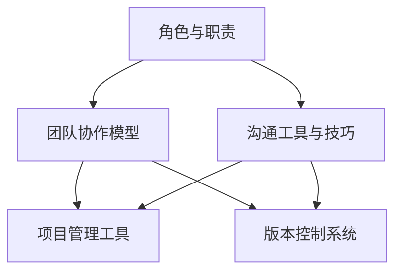
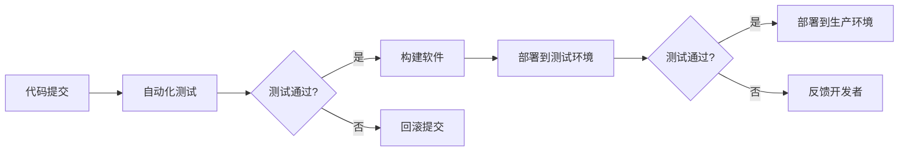
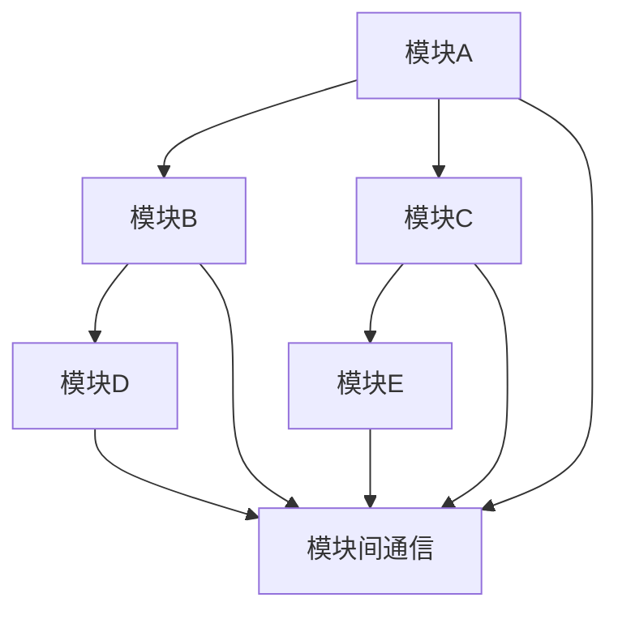
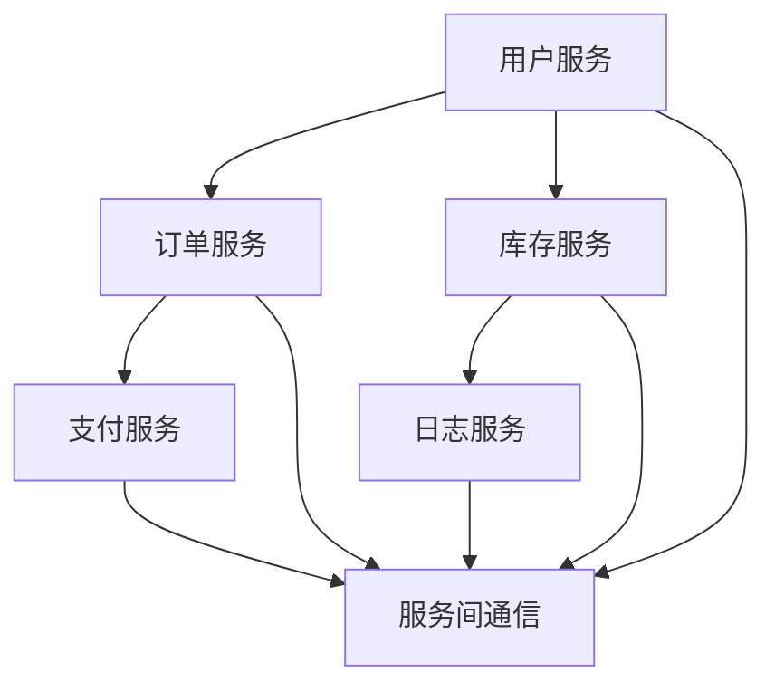
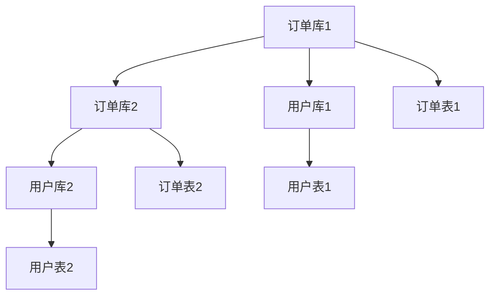
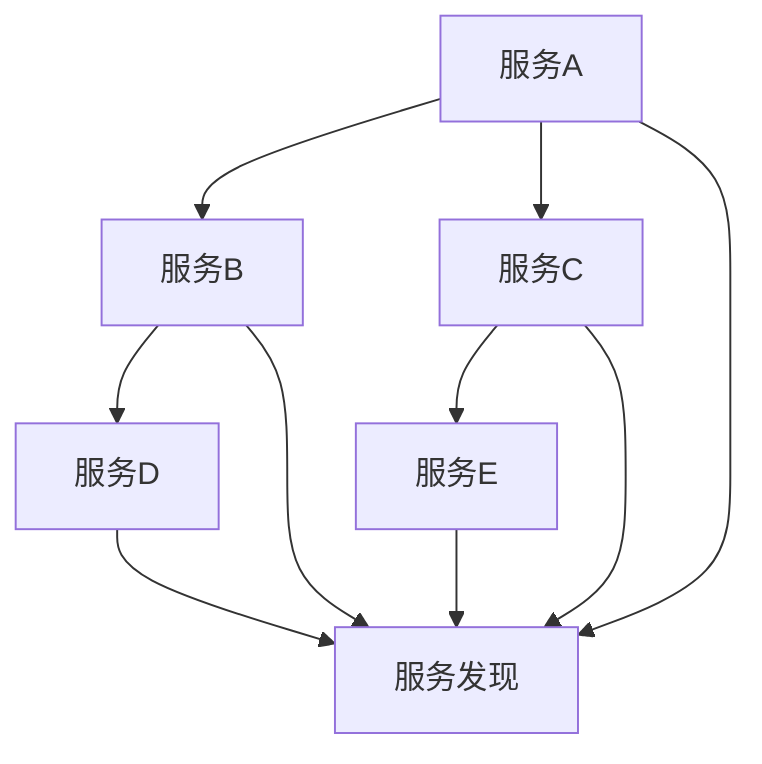

                 

### 背景介绍

随着技术的迅猛发展和市场需求的日益复杂，大型应用的开发已经成为现代软件开发中不可或缺的一部分。无论是电子商务平台、金融科技应用，还是企业级管理系统，它们的开发不仅涉及庞大的代码库，还需要跨多个团队、多个职能部门的协作。在这种背景下，跨团队协作成为解决大型应用开发挑战的关键。

跨团队协作不仅仅是指在同一个项目中有多个团队参与，它更强调不同团队之间如何高效沟通、协同工作，以共同达成项目目标。在传统单团队开发模式下，每个团队可以相对独立地进行工作，但在大型应用开发中，这种模式往往无法满足需求。由于项目的复杂性和多样性，不同的团队需要共享资源、同步进度、协调变更，这种跨团队协作变得尤为重要。

然而，跨团队协作并非易事。首先，不同团队之间的职责划分可能存在模糊地带，导致责任不清晰。其次，团队成员之间可能存在沟通障碍，信息传递不及时或不准确，从而影响项目的进展。此外，不同团队在技术栈、工作方法和文化背景上可能存在差异，这也增加了协作的难度。

为了应对这些挑战，企业需要探索最佳实践，以确保跨团队协作的高效和顺畅。本文将深入探讨跨团队协作的重要性，核心概念，技术基础，以及大型应用开发中的挑战和解决方案，旨在为读者提供一套完整的跨团队协作指南。

通过系统地介绍跨团队协作的理论基础、技术基础和实战案例，本文希望帮助读者理解跨团队协作的核心原理和实践方法，从而提升大型应用开发的效率和质量。文章将分四个主要部分进行讨论：第一部分介绍跨团队协作的重要性及核心概念；第二部分探讨跨团队协作的技术基础；第三部分分析大型应用开发的挑战与解决方案；第四部分通过实际案例进行深入剖析。最后，本文将总结最佳实践，提供注意事项和拓展阅读建议，以帮助读者在实际工作中更好地应用所学知识。

### 核心概念与联系

在探讨跨团队协作的最佳实践之前，我们需要明确几个核心概念，并理解它们之间的联系。这些核心概念包括角色与职责、团队协作模型、沟通工具与技巧，以及项目管理工具和版本控制系统。

#### 角色与职责

跨团队协作的首要任务是明确每个团队成员的角色和职责。在大型应用开发中，常见的关键角色包括项目经理、技术专家、设计师、产品经理等。

- **项目经理**：项目经理负责整体项目规划和协调，确保项目按时、按预算完成。他们需要与不同团队保持紧密沟通，解决冲突，确保项目目标的实现。
- **技术专家**：技术专家负责技术决策和实现，他们在团队中担任技术指导角色，解决复杂的技术问题，并提供技术解决方案。
- **设计师**：设计师负责用户界面设计和用户体验，确保应用的可访问性和美观性。他们与产品经理和技术团队紧密合作，确保设计能够满足用户需求。
- **产品经理**：产品经理负责产品规划和需求管理，他们需要了解市场需求，定义产品功能，并与设计、开发团队协作，确保产品能够满足用户需求。

每个角色的职责不同，但彼此之间需要紧密协作，形成高效的工作流程。

#### 团队协作模型

团队协作模型是指导团队如何协同工作的方法论。以下是几种常见的团队协作模型：

- **Scrum**：Scrum是一种迭代和增量的敏捷开发方法，强调短周期的迭代（Sprint）和持续交付。项目经理和开发团队在每次迭代中共同定义和实现一个可交付的产品增量。
- **Kanban**：Kanban基于看板管理方法，强调工作流程的透明性和可视化。团队成员在板上可视化任务状态，确保每个任务都能够及时完成。
- **统一过程（UP）**：统一过程是一种基于迭代和增量的软件开发过程，强调需求管理和迭代开发。它将软件开发过程分为四个迭代阶段：初始阶段、细化阶段、构造阶段和移交阶段。

这些协作模型各有特点，但核心目标都是提高团队协作效率，确保项目按时、高质量完成。

#### 沟通工具与技巧

有效的沟通是跨团队协作成功的关键。以下是几种常用的沟通工具和技巧：

- **线上会议工具**：如Zoom、Microsoft Teams、Google Meet等，这些工具支持视频、音频和聊天功能，便于远程团队进行实时沟通。
- **项目管理工具**：如JIRA、Trello、Asana等，这些工具可以帮助团队进行任务分配、进度跟踪和协作管理，确保项目按时完成。
- **版本控制系统**：如Git，版本控制系统帮助团队协作开发，确保代码的一致性和可追溯性。

#### 项目管理工具和版本控制系统

项目管理工具和版本控制系统在跨团队协作中起着至关重要的作用：

- **项目管理工具**：项目管理工具如JIRA、Trello等，可以帮助团队制定任务、跟踪进度、分配资源，并确保所有团队成员对项目进展有清晰的了解。
- **版本控制系统**：版本控制系统如Git，可以确保代码的一致性和可追溯性。团队成员可以在自己的本地环境中进行开发，并将更改推送到中央仓库，其他成员可以随时查看和合并这些更改。

#### 核心概念之间的联系

角色与职责确保了团队中有明确的分工和协作基础；团队协作模型提供了具体的工作流程和方法论；沟通工具与技巧以及项目管理工具和版本控制系统则确保了团队的高效协作和项目的顺利进行。这些核心概念相互关联，共同构成了跨团队协作的基础。

以下是核心概念之间的联系架构的Mermaid流程图：



通过理解这些核心概念及其相互关系，我们可以为跨团队协作建立一个坚实的基础，从而有效应对大型应用开发中的各种挑战。

### 敏捷开发方法

敏捷开发方法是一种强调灵活性和响应速度的软件开发方法论，特别适用于复杂和多变的大型应用项目。它强调团队协作、客户需求和快速迭代，从而在项目过程中不断调整和优化，确保最终产品能够满足用户需求。

#### 敏捷开发的概念

敏捷开发起源于20世纪90年代末期，其核心理念是快速响应变化、持续交付高质量产品。敏捷开发的基石是《敏捷宣言》，该宣言提出了“个体和互动重于过程和工具”，“可工作的软件重于详尽的文档”，“客户协作重于合同谈判”，“响应变化重于遵循计划”等原则。敏捷开发的核心目标是缩短开发周期，提高交付质量，并通过持续反馈和改进，使项目能够更好地适应变化。

#### 敏捷开发的实践

敏捷开发的实践包括几个关键概念和工具：

1. **用户故事**：用户故事是一种简单明了的需求描述方法，通常遵循“作为XX，我想要YY，以便ZZ”的格式。用户故事帮助团队聚焦于用户需求，确保开发工作始终围绕用户价值进行。

2. **迭代开发**：迭代开发是将整个项目分为多个短周期（通常为2-4周）的迭代。在每个迭代中，团队会定义、开发、测试和交付一个可工作的软件增量。迭代过程允许团队在项目早期发现问题并及时调整，从而提高项目的成功率和质量。

3. **持续集成**：持续集成是一种开发实践，要求开发者在每次提交代码时都进行自动化测试和构建。这样可以确保每次代码提交都不会破坏现有的功能，并快速发现潜在的问题。持续集成通过自动化工具实现，如Jenkins、Travis CI等。

以下是敏捷开发中迭代开发的伪代码：

```python
def iteration lifespan(iteration_length):
    while not end_of_project:
        plan_user_stories()
        develop_user_stories()
        test_user_stories()
        deliver_incremental_software()
        gather_feedback()
        adjust_for_next_iteration()
        wait(iteration_length)
```

#### 持续集成与持续部署

持续集成（CI）和持续部署（CD）是敏捷开发中至关重要的实践。持续集成确保每次代码提交都是可集成和可测试的，从而减少集成过程中出现的问题。持续部署则将持续集成的理念扩展到部署阶段，确保每次代码更改都可以快速、安全地部署到生产环境。

以下是一个简化的持续集成和持续部署的流程图：



通过这种方式，开发团队能够确保每次代码更改都经过严格的测试，并且可以快速、安全地部署到生产环境中。

#### 敏捷开发的优点

敏捷开发方法具有以下优点：

1. **快速响应变化**：通过短周期迭代和持续反馈，敏捷开发能够快速适应需求变化，确保项目能够持续满足用户需求。
2. **提高交付质量**：持续集成和持续部署确保每次代码提交都是可测试和可部署的，从而提高软件质量。
3. **团队协作**：敏捷开发强调团队合作和沟通，通过每日站会、迭代回顾等机制，增强团队成员之间的协作和信任。
4. **用户价值优先**：用户故事和迭代开发确保开发工作始终围绕用户价值进行，从而提高用户满意度。

总的来说，敏捷开发方法为大型应用开发提供了一种灵活、高效、协作的解决方案。通过理解其核心概念和实践，开发团队能够更好地应对复杂和多变的项目需求，提高项目成功率和软件质量。

### DevOps文化

DevOps是一种软件开发和运维的实践方法，旨在通过开发（Development）和运维（Operations）之间的紧密协作，实现快速、可靠且高质量的软件交付。DevOps文化的核心在于打破开发和运维之间的壁垒，促进团队协作，从而提高软件交付的速度和稳定性。

#### DevOps的起源与定义

DevOps的概念最早可以追溯到2009年，当时由Patrick Debois在爱尔兰的一次技术会议上首次提出。DevOps的核心理念是消除开发、测试和运维之间的障碍，通过文化、流程和工具的整合，实现持续交付和快速反馈。

DevOps不仅仅是一种技术实践，更是一种文化变革。它强调持续集成（CI）、持续部署（CD）和自动化测试，目标是实现从代码提交到生产环境自动化的高效交付流程。DevOps的关键原则包括：

- **自动化**：通过自动化工具实现从代码提交到部署的整个流程，减少人为干预，提高效率和稳定性。
- **协作**：促进开发和运维团队之间的沟通与合作，共同承担责任。
- **反馈**：通过快速反馈和持续改进，及时发现问题并采取措施，确保软件交付的质量。
- **可靠性**：确保软件在生产和预生产环境中的可靠性和稳定性。

#### DevOps的核心实践

1. **持续集成（CI）**：持续集成是一种软件开发实践，要求开发者在每次提交代码时都进行自动化测试和构建。这样可以确保每次代码提交都不会破坏现有的功能，并快速发现潜在的问题。CI通过自动化工具实现，如Jenkins、Travis CI等。

   持续集成的伪代码示例：

   ```python
   function commit_code():
       run_tests()
       if tests_pass():
           build_software()
       else:
           report_failure()
   ```

2. **持续部署（CD）**：持续部署是持续集成的扩展，它将自动化理念应用到部署阶段，确保每次代码更改都可以快速、安全地部署到生产环境。持续部署通过自动化工具和脚本实现，如Kubernetes、Ansible等。

   持续部署的流程图：

   ```mermaid
   flowchart LR
       A[代码提交] --> B[自动化测试]
       B --> C{测试通过?}
       C -->|是| D[构建软件]
       D --> E[部署到测试环境]
       E --> F{测试通过?}
       F -->|是| G[部署到生产环境]
       F -->|否| H[回滚提交]
   ```

3. **自动化测试**：自动化测试是确保软件质量和稳定性的重要手段。通过自动化测试，开发团队可以在每次代码提交时快速发现和修复缺陷，从而提高软件质量。常见的自动化测试工具包括Selenium、Junit等。

4. **容器化技术**：容器化技术，如Docker，为持续集成和持续部署提供了强大的支持。容器化使得开发环境与生产环境更加一致，从而减少部署过程中的意外和问题。通过容器化，开发团队能够轻松地将应用程序部署到各种环境中，确保一致性和可移植性。

#### DevOps的优势

1. **提高交付速度**：通过持续集成和持续部署，开发团队能够快速发现和修复问题，从而缩短交付周期，提高软件交付的速度。
2. **提高软件质量**：自动化测试和容器化技术确保软件在不同环境中的稳定性，从而提高软件质量。
3. **促进团队协作**：DevOps强调开发和运维之间的协作，打破传统的壁垒，促进团队间的沟通和合作，共同承担责任。
4. **降低成本**：通过自动化和优化流程，DevOps可以显著降低运维成本和人力资源成本。

总的来说，DevOps文化为现代软件开发和运维提供了一种高效、可靠和协作的解决方案。通过理解其核心实践和优势，开发团队能够更好地应对复杂的应用需求，实现快速、高质量的软件交付。

### 敏捷测试与质量保证

敏捷测试与质量保证是确保软件项目成功的关键环节。在敏捷开发方法中，测试被纳入整个开发流程中，而不是作为开发完成后的一步。这种做法不仅提高了软件质量，还确保了项目能够快速响应变化。

#### 自动化测试

自动化测试是敏捷开发中不可或缺的一部分。通过自动化测试，开发团队能够在每次代码提交时快速检测和修复缺陷，从而确保软件质量。常见的自动化测试工具有Selenium、JUnit、TestNG等。

以下是自动化测试的基本流程：

1. **编写测试用例**：首先，根据需求和设计文档，开发测试用例，明确每个测试用例的目标和预期结果。
2. **执行测试用例**：使用自动化测试工具执行测试用例，检测软件功能是否符合预期。
3. **报告与反馈**：测试用例执行完成后，生成报告，记录测试结果和发现的缺陷，并将反馈发送给开发团队。

以下是自动化测试的伪代码示例：

```python
def execute_tests():
    for test_case in test_cases:
        run_test(test_case)
        if test_result != expected_result:
            report_failure(test_case)
```

#### 持续集成与持续部署

持续集成（CI）和持续部署（CD）是敏捷开发中确保软件质量的重要手段。持续集成通过自动化构建和测试确保每次代码提交都是可集成的，持续部署则确保每次代码更改都可以安全、快速地部署到生产环境。

以下是CI/CD的基本流程：

1. **代码提交**：开发者在版本控制系统上提交代码。
2. **构建**：自动化工具构建代码，生成可执行的软件包。
3. **测试**：运行自动化测试，检测新代码是否引入了缺陷。
4. **部署**：如果测试通过，软件包被部署到测试或生产环境。

以下是CI/CD的伪代码示例：

```python
def ci_cd流程():
    if代码提交():
        build软件包()
        run_tests()
        if测试通过():
            deploy_to测试环境()
        else:
            report_issues()
```

#### 质量管理策略

敏捷开发中的质量保证不仅仅是测试，还包括整个开发流程中的多个方面。以下是一些常用的质量保证策略：

1. **持续反馈**：通过定期的代码审查、迭代回顾和用户反馈，开发团队能够及时发现问题并采取措施。
2. **快速迭代**：通过短周期的迭代，开发团队能够快速发现和修复缺陷，确保软件质量。
3. **代码审查**：代码审查是一种团队合作方式，通过团队内部成员相互审查代码，确保代码质量和一致性。
4. **用户故事地图**：用户故事地图帮助开发团队了解用户需求，确保开发工作始终围绕用户价值进行。

通过这些策略，敏捷开发团队能够持续提高软件质量，确保项目成功。

总的来说，敏捷测试与质量保证是敏捷开发的核心组成部分。通过自动化测试、持续集成与持续部署，以及有效的质量保证策略，开发团队能够确保软件项目的成功。

### 大型应用开发的挑战

在开发大型应用时，团队会面临一系列独特的挑战，这些挑战包括项目复杂度、时间与资源管理，以及需求变更管理。有效应对这些挑战，对于确保项目按时、按预算、高质量完成至关重要。

#### 项目复杂度

大型应用通常具有庞大的代码库和复杂的系统架构，这使得项目管理变得更加困难。项目复杂度的增加主要体现在以下几个方面：

1. **代码库规模庞大**：大型应用往往包含数百万行代码，这使得代码维护和升级变得复杂。团队需要有效地组织和管理代码库，确保代码的可读性和可维护性。
2. **系统架构复杂**：大型应用通常采用分布式系统架构，包括多个模块、服务和数据库。这些组件之间的交互和依赖关系复杂，需要精确的架构设计和高效的通信机制。
3. **技术栈多样化**：大型应用可能需要多种编程语言、框架和工具，这使得团队的技术栈更加多样化。这要求团队成员具备广泛的技术知识和跨技术的协作能力。

#### 时间与资源管理

在大型应用开发中，时间与资源管理是确保项目顺利推进的关键。以下是一些时间与资源管理方面的挑战：

1. **进度控制**：大型应用项目通常需要较长的开发周期。团队需要制定详细的进度计划，并确保每个阶段的工作都能按时完成，以避免延期风险。
2. **资源分配**：在资源有限的情况下，如何合理分配开发资源（如人力、设备、预算等）是项目管理的一大挑战。团队需要根据项目需求和优先级，动态调整资源分配，确保关键任务得到足够的支持。
3. **风险管理**：大型应用项目面临多种风险，如技术风险、市场风险、资源风险等。团队需要建立有效的风险管理机制，及时识别和应对潜在风险，确保项目顺利推进。

#### 需求变更管理

需求变更管理是大型应用开发中常见且重要的挑战。以下是需要关注的需求变更管理方面：

1. **需求频繁变更**：在大型应用开发过程中，客户和产品经理可能会根据市场变化、用户反馈等因素提出新的需求或对现有需求进行修改。这些需求变更往往会对项目进度和资源产生重大影响。
2. **变更影响评估**：在处理需求变更时，团队需要评估变更对项目各个方面（如时间、资源、质量等）的影响，并制定相应的应对策略。
3. **变更控制流程**：为了确保需求变更能够有序、有效地进行，团队需要建立完善的变更控制流程，包括需求变更的提出、评估、审批、实施和验证等步骤。

#### 应对策略

针对上述挑战，团队可以采取以下策略：

1. **模块化开发**：将大型应用拆分成多个模块，每个模块由不同的团队负责开发和维护。这有助于降低项目复杂度，提高开发效率。
2. **敏捷开发方法**：采用敏捷开发方法，通过短周期迭代和持续交付，快速响应需求变化，确保项目能够持续满足用户需求。
3. **资源优化分配**：建立科学的资源管理机制，通过实时监控和调整资源分配，确保项目关键任务得到充分支持。
4. **有效的沟通与协作**：建立高效的沟通机制，确保团队内部和跨团队之间的信息传递及时、准确，提高协作效率。
5. **需求变更管理流程**：建立需求变更管理流程，确保每个需求变更都经过严格的评估和审批，减少变更对项目的负面影响。

通过以上策略，团队能够更有效地应对大型应用开发中的各种挑战，确保项目的顺利推进和成功交付。

### 解决方案与实践

为了有效地应对大型应用开发中的挑战，团队需要采取一系列具体的解决方案和最佳实践。这些解决方案不仅涉及技术层面，还包括项目管理、资源优化和团队协作等多个方面。以下是一些关键策略和实用技巧：

#### 模块化开发

模块化开发是将大型应用拆分成多个独立模块的过程，每个模块负责特定的功能或服务。模块化开发有助于降低项目复杂度，提高开发效率，同时方便后期维护和升级。

1. **模块划分**：首先，根据功能、数据依赖和业务逻辑等因素，将应用拆分成多个模块。每个模块应具有明确的职责和边界，以便于独立开发和测试。
2. **模块通信**：模块之间应通过标准的接口进行通信，如RESTful API、消息队列等。这有助于确保模块之间的松耦合，提高系统的可维护性和扩展性。
3. **模块独立部署**：模块可以独立部署和升级，这样在某个模块出现问题时，不会影响整个系统的运行。此外，独立部署可以优化资源使用，提高系统性能。

以下是一个简化的模块划分和通信架构的Mermaid流程图：



#### 架构设计原则

架构设计是确保大型应用稳定、可靠和可扩展的关键。以下是一些常见的架构设计原则：

1. **分层架构**：采用分层架构，将应用分为表示层、业务逻辑层、数据访问层等。这有助于提高系统的模块化和可维护性。
2. **微服务架构**：将应用拆分为多个独立的微服务，每个微服务负责特定的业务功能。微服务之间通过轻量级协议（如HTTP/REST）进行通信。微服务架构有助于提高系统的灵活性和可扩展性。
3. **分布式系统**：采用分布式系统架构，将应用部署在多个服务器和数据中心上，以提高系统的可用性和性能。分布式系统需要解决数据一致性和服务协调等问题。

以下是一个简化的微服务架构的Mermaid流程图：



#### 数据库设计

数据库设计是确保数据一致性和系统性能的关键。以下是一些数据库设计原则：

1. **规范化**：通过规范化减少数据冗余，提高数据一致性。常见的规范化方法包括第一范式（1NF）、第二范式（2NF）和第三范式（3NF）。
2. **索引优化**：合理设计索引可以提高查询性能。索引应根据常用的查询条件进行设计，避免过度索引。
3. **分库分表**：对于大数据量的应用，可以通过分库分表来提高查询性能和系统扩展性。分库分表需要考虑数据一致性、查询优化和负载均衡等问题。

以下是一个简化的分库分表的Mermaid流程图：



#### 分布式系统与微服务架构

分布式系统与微服务架构是应对大型应用复杂性的有效策略。以下是一些关键点：

1. **服务拆分**：根据业务逻辑和功能将应用拆分为多个微服务，每个服务负责特定的业务功能。这有助于提高系统的灵活性和可扩展性。
2. **服务发现**：通过服务发现机制，确保服务实例可以动态发现和注册，提高系统的可用性和容错性。
3. **负载均衡**：通过负载均衡机制，将请求分配到多个服务实例上，提高系统的性能和响应速度。
4. **分布式事务**：对于需要跨服务的业务操作，可以通过分布式事务确保数据的一致性。常见的分布式事务解决方案包括最终一致性、两阶段提交（2PC）和三阶段提交（3PC）。

以下是一个简化的分布式系统的Mermaid流程图：



#### 实战案例

以下是一个简单的实战案例，展示如何在实际项目中应用上述解决方案。

**项目背景**：一个电商平台的开发，包含用户管理、商品管理、订单管理、支付等模块。

**解决方案**：

1. **模块化开发**：将电商平台的各个模块（如用户管理、商品管理、订单管理、支付等）进行模块化划分，每个模块由独立的团队负责开发和维护。

2. **微服务架构**：采用微服务架构，将电商平台的各个功能拆分为多个微服务，如用户服务、商品服务、订单服务、支付服务等。微服务之间通过RESTful API进行通信。

3. **数据库设计**：采用分库分表策略，根据数据量和查询需求，将订单表和用户表分库分表，提高查询性能和系统扩展性。

4. **分布式系统**：将微服务部署在多个服务器上，通过负载均衡和分布式服务发现，确保系统的可用性和性能。

**实施步骤**：

1. **模块划分**：根据功能需求，将电商平台拆分为用户管理模块、商品管理模块、订单管理模块、支付模块等。
2. **微服务开发**：针对每个模块，构建独立的微服务，并设计API接口。
3. **数据库设计**：设计订单数据库和用户数据库，并进行分库分表。
4. **部署与运维**：将微服务部署在云服务器上，配置负载均衡和服务发现机制。

**效果评估**：

通过模块化开发、微服务架构、数据库设计优化和分布式系统部署，电商平台的开发效率显著提高，系统性能和可靠性得到大幅提升。同时，项目的可维护性和扩展性也得到了增强，能够更好地应对未来业务需求的变化。

总的来说，模块化开发、微服务架构、数据库设计优化和分布式系统部署是应对大型应用开发挑战的有效解决方案。通过结合实际案例，开发团队能够更好地理解和应用这些方法，确保项目的成功和持续发展。

### 案例分析

在本节中，我们将深入分析两个实际案例：电子商务平台和金融科技项目的跨团队协作实践。通过这两个案例，我们将展示如何在实际工作中应用跨团队协作的最佳实践，以应对大型应用开发的挑战。

#### 案例一：电子商务平台

**背景**：一个大型电商平台，拥有复杂的系统架构和多样化的功能模块，包括用户管理、商品管理、订单处理、支付系统、推荐系统等。

**挑战**：由于项目规模庞大，涉及多个团队，包括前端开发、后端开发、UI设计、运维等。团队之间的沟通不畅、资源分配不均和需求频繁变更等问题，都对项目的进度和质量造成了影响。

**解决方案与实践**：

1. **模块化开发**：将电商平台拆分成多个独立模块，每个模块由专门的团队负责开发。例如，用户管理模块由用户团队负责，支付系统模块由支付团队负责。这有助于降低项目复杂度，提高开发效率。

2. **敏捷开发与Scrum**：采用Scrum敏捷开发方法，通过短周期迭代和持续交付，确保团队能够快速响应需求变更。每个迭代结束时，团队进行回顾会议，总结经验教训，持续优化开发流程。

3. **持续集成与持续部署（CI/CD）**：通过CI/CD实践，确保每次代码提交都会经过自动化测试和构建，从而减少集成过程中的问题。同时，使用自动化工具实现快速部署，确保系统能够快速响应市场变化。

4. **沟通工具与技巧**：使用Zoom、Slack等沟通工具，确保团队成员之间能够实时交流。定期组织线上会议和站会，确保项目进度和问题的及时沟通。

5. **用户故事地图**：使用用户故事地图来确保开发工作始终围绕用户价值进行。每个迭代开始时，团队会根据用户故事地图确定优先级，确保开发资源得到最有效的利用。

**效果**：通过上述实践，电子商务平台的开发团队显著提高了协作效率，项目进度和质量得到了有效保障。系统能够快速响应市场需求，用户满意度显著提升。

#### 案例二：金融科技项目

**背景**：一个金融科技公司开发了一款面向客户的支付应用程序，项目涉及银行、支付处理、风险管理等多个领域。

**挑战**：金融科技项目要求高安全性和高可靠性，同时涉及多个团队，包括前端开发、后端开发、UI设计、数据科学、风险管理等。项目复杂度高，需求变更频繁，团队之间的协作面临诸多挑战。

**解决方案与实践**：

1. **DevOps文化**：通过引入DevOps文化，打破开发和运维之间的壁垒，促进团队协作。采用持续集成（CI）和持续部署（CD）实践，确保软件交付的速度和质量。

2. **微服务架构**：采用微服务架构，将支付应用程序拆分为多个微服务，如支付处理服务、账户管理服务、风险管理服务等。这有助于提高系统的灵活性和可扩展性。

3. **服务网格**：使用服务网格（如Istio）实现微服务之间的通信和安全性，确保服务之间的数据传输高效且安全。

4. **自动化测试**：通过自动化测试，确保每次代码提交都是可测试和可部署的。采用Selenium、JUnit等工具进行功能测试和单元测试，提高软件质量。

5. **需求变更管理**：建立需求变更管理流程，确保每个需求变更都经过严格的评估和审批。采用看板（Kanban）工具，实时跟踪和管理需求变更，确保项目进度不受影响。

**效果**：通过上述实践，金融科技项目的开发团队成功提高了项目交付速度和软件质量，同时确保了系统的高安全性和高可靠性。客户对应用程序的满意度显著提升，市场竞争力得到增强。

#### 总结

通过上述两个案例，我们可以看到跨团队协作的最佳实践在实际项目中的应用效果。模块化开发、敏捷开发、DevOps文化、自动化测试和有效的沟通工具等实践方法，帮助开发团队有效地应对大型应用开发中的挑战。这些实践不仅提高了项目的效率和质量，还增强了团队之间的协作和信任，为企业的持续发展奠定了坚实的基础。

### 最佳实践 Tips

在跨团队协作中，为了确保项目的顺利推进和高效完成，以下是一些最佳实践和注意事项：

1. **明确职责和角色**：在项目开始前，明确每个团队成员的职责和角色，确保责任清晰。避免因职责模糊导致的协作障碍。

2. **定期沟通和反馈**：定期组织团队会议，确保团队成员之间的沟通畅通。鼓励团队成员提供反馈，及时解决问题，提高团队协作效率。

3. **采用敏捷开发方法**：敏捷开发方法如Scrum和Kanban有助于提高团队响应变化的能力，确保项目按计划推进。

4. **自动化测试**：通过自动化测试，确保每次代码提交都是可测试和可部署的，减少集成和部署过程中的问题。

5. **持续集成与持续部署（CI/CD）**：引入CI/CD实践，提高软件交付的速度和质量，确保系统稳定性和可靠性。

6. **使用合适的工具**：选择合适的沟通工具（如Zoom、Slack）、项目管理工具（如JIRA、Trello）和版本控制系统（如Git），确保团队协作的高效和顺畅。

7. **建立需求变更管理流程**：制定需求变更管理流程，确保需求变更能够有序、高效地处理，减少对项目进度的影响。

8. **注重团队建设**：通过团队建设活动，增强团队成员之间的信任和协作，提高团队整体绩效。

9. **持续学习和改进**：鼓励团队成员持续学习新技术和方法，通过迭代和反思，不断优化项目管理和协作流程。

10. **风险管理**：建立有效的风险管理机制，识别和应对潜在风险，确保项目能够顺利推进。

通过遵循这些最佳实践，开发团队能够更好地应对大型应用开发中的挑战，提高项目成功率和团队协作效率。

### 小结

本文通过系统地介绍跨团队协作的理论基础、技术基础和实战案例，深入探讨了如何应对大型应用开发中的各种挑战。我们从角色与职责、团队协作模型、沟通工具与技巧，到敏捷开发方法、DevOps文化、敏捷测试与质量保证，再到具体的大型应用开发解决方案和实际案例分析，提供了全面的跨团队协作指南。

跨团队协作不仅是大型应用开发成功的关键，也是现代企业高效运作的核心。通过本文的探讨，我们希望读者能够深入理解跨团队协作的核心原理和实践方法，并在实际工作中灵活应用。

在未来的项目中，读者可以尝试以下应用方向：

1. **明确职责和角色**：确保团队中的每个成员都清楚自己的职责和角色，避免协作中的模糊地带。
2. **引入敏捷开发方法**：如Scrum或Kanban，通过短周期迭代和持续交付，提高项目响应速度和质量。
3. **实施DevOps文化**：通过持续集成和持续部署，实现快速、可靠的软件交付。
4. **自动化测试与质量保证**：确保每次代码提交都经过严格的测试，提高软件质量。
5. **模块化开发与微服务架构**：降低项目复杂度，提高系统的灵活性和可扩展性。

通过实践这些方法，开发团队能够更高效地协作，确保项目的成功交付，为企业的持续发展提供强有力的支持。

### 注意事项

在跨团队协作过程中，以下注意事项对于确保项目的顺利进行至关重要：

1. **沟通障碍**：团队之间的有效沟通是项目成功的关键。确保定期召开会议，使用合适的沟通工具（如Zoom、Slack），并制定明确的沟通计划。
2. **资源分配**：合理分配资源，特别是在资源紧张的情况下，要确保关键任务得到充分支持。建立资源监控机制，及时调整资源分配。
3. **需求变更**：需求变更不可避免，但应建立严格的变更管理流程，确保每次变更都经过评估和审批，减少对项目进度的影响。
4. **风险管理**：识别和应对潜在风险，建立有效的风险管理机制。定期进行风险评估，并制定应对策略。
5. **团队协作**：培养团队合作精神，通过团队建设活动增强团队成员之间的信任和协作。

通过关注这些注意事项，开发团队能够更好地应对跨团队协作中的挑战，确保项目的顺利进行。

### 拓展阅读

为了帮助读者更深入地了解跨团队协作和大型应用开发的相关内容，以下是几本推荐的拓展阅读材料：

1. **《Scrum精髓：实践指南》** - 作者：杰夫·萨瑟兰（Jeff Sutherland）。本书详细介绍了Scrum敏捷开发方法，提供了实用的实践指南和案例。
   
2. **《DevOps：实践指南》** - 作者：约翰·阿尔文（John Alvin）。本书介绍了DevOps文化的核心实践，如持续集成和持续部署，以及如何在实际项目中应用。

3. **《持续交付：发布可靠软件的系统方法》** - 作者：Jez Humble、David Farley。本书详细阐述了持续交付的方法论，包括自动化测试、持续集成和部署等实践。

4. **《大型软件开发：实践与经验》** - 作者：Ian Sommerville。本书探讨了大型应用开发的挑战和解决方案，提供了丰富的实战案例和经验总结。

5. **《团队协作工具与应用》** - 作者：Mike Cohn。本书介绍了多种团队协作工具和技巧，如项目管理工具、沟通工具等，帮助团队提高协作效率。

通过阅读这些书籍，读者可以更全面地了解跨团队协作和大型应用开发的最佳实践，从而在实际工作中更好地应用所学知识。

