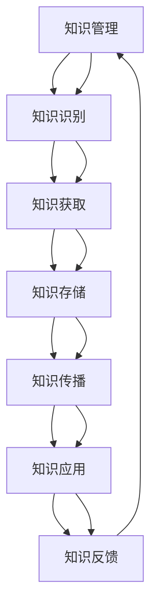
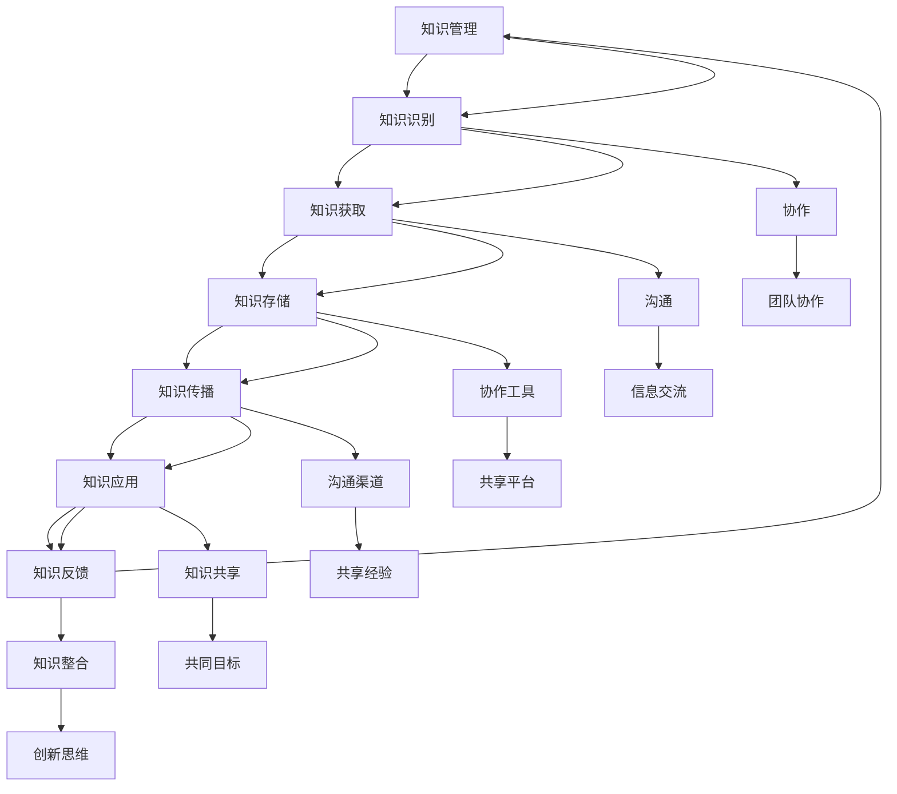
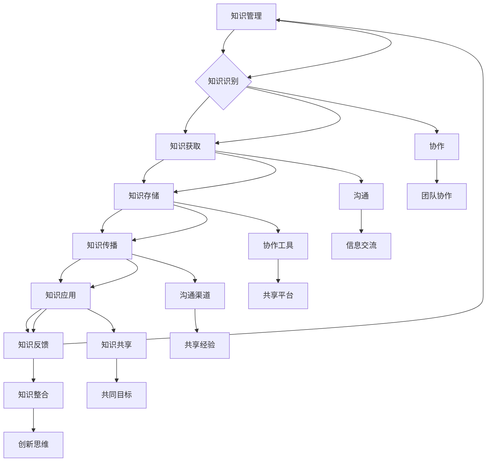

                 

### 文章标题

《跨团队知识共享：促进大型应用开发的协作》

### 关键词

跨团队知识共享、协作、大型应用开发、组织文化、技术工具、流程优化、障碍与解决方案、最佳实践。

### 摘要

本文深入探讨了跨团队知识共享在大型应用开发中的重要性。首先，我们介绍了知识共享的背景和核心概念，包括知识管理、协作和沟通等。接着，通过Mermaid流程图展示了这些概念之间的联系，并解释了组织文化对知识共享的影响。随后，文章详细介绍了各种技术工具和平台，以及跨团队协作的最佳实践。最后，分析了跨团队知识共享过程中可能遇到的障碍，并提出了相应的解决方案。通过实际案例的剖析，我们展示了如何有效地实施知识共享策略，以促进大型应用开发的协作。

---

## 引言

在当今快速发展的技术时代，大型应用开发已经成为企业创新和竞争力的关键。然而，这种复杂性使得跨团队协作变得尤为重要。团队成员之间需要高效的知识共享，以便共同解决问题、优化流程和提升整体开发效率。

### 大型应用开发的复杂性

大型应用开发通常涉及多个团队，包括前端开发、后端开发、测试、运维等。每个团队都在自己的领域内拥有特定的知识和技能。然而，仅凭单个团队的力量很难实现项目的成功。跨团队协作能够整合不同团队的优势，提高项目整体的交付质量和效率。

#### 跨团队协作的需求

跨团队协作不仅有助于知识的整合和共享，还能够促进创新和解决问题。团队成员之间的沟通和协作能够加速问题的识别和解决，减少误解和重复工作。此外，跨团队协作还能够提高团队的凝聚力和团队士气，为项目的成功奠定基础。

### 知识共享的概念与模型

知识共享是指将知识从一个个体或团队转移到另一个个体或团队的过程。它是跨团队协作的核心要素之一。知识管理是知识共享的基础，它包括知识的识别、获取、存储、传播和应用。

#### 知识管理的定义

知识管理（Knowledge Management，KM）是指通过系统的方法和工具，有效地识别、获取、存储、传播和应用知识，以提高组织的能力和竞争力。

#### 知识共享的模型

知识共享通常包括以下几个模型：

1. **推式模型**：知识由知识源主动推送到知识需求者。
2. **拉式模型**：知识需求者主动从知识库中获取所需知识。
3. **混合模型**：结合推式和拉式模型，根据实际情况进行灵活应用。

### Mermaid流程图：知识共享核心概念关系

下面是一个Mermaid流程图，展示了知识共享的核心概念和它们之间的联系：



### 组织文化与知识共享

组织文化对知识共享有着深远的影响。一个支持知识共享的组织文化能够促进团队成员之间的信任和合作，提高知识的流动和共享效率。

#### 组织文化对知识共享的影响

1. **信任与开放性**：一个开放和信任的文化鼓励团队成员分享知识和经验。
2. **共享目标**：组织目标应明确支持知识共享，以确保团队成员意识到其重要性。
3. **领导者的支持**：领导者应带头实践知识共享，以树立榜样。

#### 塑造知识共享文化的策略

1. **鼓励分享**：通过奖励机制鼓励团队成员分享知识和经验。
2. **建立沟通渠道**：提供多种沟通工具和平台，以方便团队成员之间的交流和知识共享。
3. **培养协作意识**：通过团队活动和培训，提高团队成员的协作意识和能力。

---

## 核心概念与联系

在深入探讨跨团队知识共享之前，我们需要明确几个核心概念，并理解它们之间的相互关系。这些概念包括知识管理、协作、沟通等。以下是一个Mermaid流程图，展示了这些概念之间的关系：



### 知识管理

知识管理是跨团队知识共享的基础。它涉及对知识的识别、获取、存储、传播和应用。知识管理不仅仅是关于技术和工具，更重要的是关于文化和习惯。以下是知识管理的主要组成部分：

1. **知识识别**：识别组织中现有的知识和技能。
2. **知识获取**：通过多种渠道获取外部和内部的知识。
3. **知识存储**：将知识存储在易于访问和检索的地方。
4. **知识传播**：通过各种方式将知识传递给需要的人。
5. **知识应用**：将知识应用到实际工作中，以提高效率和创新能力。

### 协作

协作是指团队成员共同努力，以实现共同目标的过程。协作不仅仅是在工作上的合作，还包括信息共享、知识传递和技能互补。以下是协作的关键要素：

1. **团队协作**：团队成员之间的合作，以共同完成任务。
2. **信息交流**：团队成员之间交换信息，确保信息透明和准确。
3. **共享平台**：提供协作工具和平台，以支持团队协作和信息交流。

### 沟通

沟通是知识共享的核心。有效的沟通能够确保团队成员理解彼此的需求和目标，从而更好地协作。以下是沟通的关键要素：

1. **沟通渠道**：提供多种沟通方式，如会议、邮件、即时通讯等。
2. **共享经验**：通过沟通分享团队成员的经验和知识。
3. **知识共享**：通过沟通实现知识的传递和共享，以提高团队的整体能力。

### Mermaid流程图

下面是一个Mermaid流程图，展示了知识管理、协作和沟通之间的关系：



通过这个流程图，我们可以看到知识管理、协作和沟通是如何相互关联，并在跨团队知识共享中发挥作用的。

---

## 组织文化与知识共享

组织文化在跨团队知识共享中起着至关重要的作用。一个支持知识共享的组织文化能够促进团队成员之间的信任和合作，从而提高知识的流动和共享效率。以下将详细探讨组织文化对知识共享的影响，并介绍如何塑造一个支持知识共享的文化。

### 组织文化对知识共享的影响

1. **信任与开放性**：在一个开放和信任的文化中，团队成员更愿意分享他们的知识和经验。这种信任是知识共享的基石，它减少了知识共享中的障碍和摩擦。

2. **共享目标**：组织的目标应明确支持知识共享。当团队成员认识到知识共享对实现组织目标的重要性时，他们更愿意积极参与知识共享活动。

3. **领导者的支持**：领导者应带头实践知识共享，并通过他们的行为和决策来树立榜样。领导者的支持能够激励团队成员积极分享知识和经验。

### 塑造知识共享文化的策略

1. **鼓励分享**：通过奖励机制鼓励团队成员分享知识和经验。例如，可以设立知识共享奖项，表彰那些在知识共享方面做出突出贡献的团队成员。

2. **建立沟通渠道**：提供多种沟通工具和平台，以方便团队成员之间的交流和知识共享。例如，可以建立内部论坛、知识库和协作工具，以促进知识共享。

3. **培养协作意识**：通过团队活动和培训，提高团队成员的协作意识和能力。例如，可以组织跨团队项目，以促进团队成员之间的互动和知识共享。

4. **领导者的示范作用**：领导者应带头分享知识和经验，并通过他们的行为和决策来树立榜样。领导者的积极参与能够激励团队成员积极分享知识和经验。

5. **建立知识共享机制**：建立一套有效的知识共享机制，包括知识获取、存储、传播和应用的流程。通过规范化知识共享流程，确保知识共享的高效和有序。

### 实际案例

以下是一个组织通过塑造知识共享文化来提高跨团队协作效率的实际案例。

#### 案例背景

某大型科技公司拥有一支由多个团队组成的开发团队，负责开发一个复杂的大型应用。由于团队成员来自不同的背景和部门，知识共享和协作变得尤为重要。

#### 解决方案

1. **鼓励分享**：公司设立了一个知识共享奖项，每年评选出在知识共享方面表现突出的团队成员。这个奖项不仅提高了团队成员的积极性，也树立了知识共享的榜样。

2. **建立沟通渠道**：公司建立了多个内部论坛和知识库，为团队成员提供了一个方便的知识共享平台。这些平台允许团队成员分享代码、文档、经验和最佳实践。

3. **培养协作意识**：公司定期组织跨团队项目，以促进团队成员之间的互动和知识共享。在这些项目中，团队成员必须共同解决复杂的问题，从而提高了他们的协作能力和知识共享意识。

4. **领导者的示范作用**：公司的领导层积极参与知识共享活动，并经常在内部论坛和知识库中分享他们的见解和经验。

5. **建立知识共享机制**：公司建立了一套知识共享机制，包括知识获取、存储、传播和应用的流程。这些流程确保了知识的高效和有序共享。

#### 结果

通过塑造知识共享文化，公司的跨团队协作效率显著提高。团队成员之间的沟通更加顺畅，知识共享变得更加普遍。这不仅提高了项目的开发效率，也增强了团队的凝聚力和创新能力。

### 总结

组织文化对知识共享有着深远的影响。通过鼓励分享、建立沟通渠道、培养协作意识、领导者的示范作用和建立知识共享机制，可以塑造一个支持知识共享的文化。这样的文化能够促进跨团队协作，提高知识流动和共享效率，从而推动组织的创新和发展。

---

## 技术工具与平台

在跨团队知识共享中，技术工具和平台起着至关重要的作用。它们不仅能够提高知识获取、存储、传播和应用的效率，还能够促进团队成员之间的协作和沟通。以下将介绍几种常用的技术工具和平台，并讨论如何选择和搭建这些平台。

### 文档管理系统

文档管理系统（Document Management System，DMS）是跨团队知识共享的基础工具之一。它能够帮助团队管理和共享各种文档，如需求文档、设计文档、代码注释和技术文档等。

#### 功能

1. **文档存储和检索**：DMS提供了一个集中的存储空间，使团队成员能够方便地访问和检索文档。
2. **版本控制**：DMS支持版本控制功能，确保文档的变更历史记录清晰可查。
3. **权限管理**：DMS允许管理员设置不同的权限级别，以保护文档的安全性和隐私性。
4. **协作编辑**：DMS支持多人协作编辑文档，提高文档的更新速度和准确性。

#### 选择标准

1. **兼容性**：选择能够与现有系统和工具兼容的DMS，以减少集成成本和复杂性。
2. **易用性**：选择用户界面友好、易于操作的DMS，以降低使用门槛。
3. **安全性**：选择具有严格安全性和权限管理功能的DMS，确保文档的安全性和隐私性。
4. **扩展性**：选择能够支持未来扩展和自定义的DMS，以适应团队的需求变化。

### 知识库

知识库（Knowledge Base，KB）是一个集中存储和共享知识的平台。它通常包含各种类型的知识，如技术文档、最佳实践、常见问题和解决方案等。

#### 功能

1. **知识检索**：知识库提供了一个强大的搜索功能，使团队成员能够快速找到所需的知识。
2. **问答社区**：知识库通常包含问答社区功能，允许团队成员提问和回答问题，促进知识的交流和共享。
3. **自动化文档生成**：知识库能够根据已有的知识和文档生成新的文档，提高文档编写的效率。
4. **知识分类和标签**：知识库支持知识分类和标签功能，使知识能够被更好地组织和查找。

#### 选择标准

1. **灵活性**：选择能够灵活定制和扩展的知识库，以适应不同的知识类型和需求。
2. **易用性**：选择用户界面友好、易于操作的知识库，以提高用户满意度。
3. **搜索性能**：选择具有高效搜索性能的知识库，以提高知识检索的速度和准确性。
4. **社区支持**：选择具有良好社区支持的知识库，以获得及时的解决方案和帮助。

### 协作软件

协作软件（Collaboration Software）是支持跨团队协作和沟通的重要工具。它通常包含会议管理、任务管理、文件共享和即时通讯等功能。

#### 功能

1. **会议管理**：协作软件提供了在线会议功能，使团队成员能够远程参加会议和讨论。
2. **任务管理**：协作软件支持任务分配和跟踪，帮助团队成员管理他们的工作进度和任务。
3. **文件共享**：协作软件提供了文件共享功能，使团队成员能够轻松地共享和协作编辑文档。
4. **即时通讯**：协作软件支持即时通讯功能，使团队成员能够实时交流信息和解决问题。

#### 选择标准

1. **集成性**：选择能够与现有系统和工具集成的协作软件，以提高协作效率。
2. **可定制性**：选择能够根据团队需求进行定制和扩展的协作软件，以满足特定的协作需求。
3. **安全性**：选择具有严格安全性和权限管理功能的协作软件，以确保数据和隐私的安全性。
4. **用户体验**：选择用户界面友好、易于操作的协作软件，以提高用户满意度。

### 知识共享平台搭建

搭建一个有效的知识共享平台需要综合考虑技术需求、团队特点和业务目标。以下是一些搭建步骤：

1. **需求分析**：了解团队的需求，包括知识类型、协作方式、安全要求等。
2. **平台选型**：根据需求分析结果，选择合适的DMS、KB和协作软件。
3. **系统集成**：将选定的工具和平台集成到现有系统中，确保数据流的高效和流畅。
4. **定制开发**：根据团队需求进行定制开发，以提供个性化的功能和用户体验。
5. **培训与推广**：对团队成员进行培训，推广知识共享平台的使用，以提高平台的使用率和效果。
6. **持续优化**：根据平台的使用情况和用户反馈，持续优化平台的性能和功能，以提高知识共享的效率。

### 实际案例

以下是一个知识共享平台搭建的实际案例：

#### 案例背景

某大型互联网公司需要搭建一个知识共享平台，以支持其快速发展的研发团队。团队的需求包括：高效的知识检索、灵活的任务管理、安全的文件共享和实时的即时通讯。

#### 解决方案

1. **需求分析**：根据团队需求，选择了一个具有高效搜索性能和强大协作功能的DMS、KB和协作软件。
2. **平台选型**：选定了具有高度集成性和可定制性的DMS、KB和协作软件，并进行了集成测试和优化。
3. **系统集成**：将DMS、KB和协作软件集成到现有的开发工具链中，确保数据流的高效和流畅。
4. **定制开发**：根据团队需求进行了定制开发，包括自定义任务管理界面和文档分类标签。
5. **培训与推广**：对团队成员进行了全面培训，并定期举办知识共享活动，以提高平台的使用率和效果。
6. **持续优化**：根据平台的使用情况和用户反馈，不断优化平台的性能和功能，以提高知识共享的效率。

#### 结果

通过搭建知识共享平台，公司的研发团队实现了高效的知识检索、灵活的任务管理和安全的文件共享。平台的使用率和用户满意度显著提高，知识共享的效率也得到了显著提升。

### 总结

技术工具和平台在跨团队知识共享中发挥着重要作用。通过选择合适的DMS、KB和协作软件，并合理地搭建和优化这些平台，可以显著提高知识共享的效率和质量。同时，定制开发和持续优化也是确保平台长期有效的重要手段。

---

## 协作流程与最佳实践

在跨团队知识共享中，协作流程的优化至关重要。一个清晰、高效的协作流程可以确保团队成员之间的沟通畅通，知识共享顺畅，从而提高项目的整体效率和质量。以下将详细讲解跨团队协作流程，包括项目规划、沟通机制、知识文档编写和更新等，并分享一些最佳实践。

### 项目规划

项目规划是跨团队协作的第一步，它为整个项目提供了明确的指导和方向。以下是一个简化的项目规划流程：

1. **需求分析**：了解项目的需求和目标，明确项目的范围和关键里程碑。
2. **团队组建**：根据项目需求组建合适的团队，并明确每个团队成员的角色和职责。
3. **项目计划**：制定详细的项目计划，包括时间表、任务分配和资源需求。
4. **风险分析**：识别项目中的潜在风险，并制定相应的应对策略。

#### 伪代码示例

```python
def project_planning():
    # 需求分析
    requirements = analyze_requirements()

    # 团队组建
    team = build_team()

    # 项目计划
    plan = create_plan(requirements, team)

    # 风险分析
    risks = identify_risks(plan)

    # 制定应对策略
    strategies = create_strategies(risks)

    return plan, strategies
```

### 沟通机制

沟通机制是跨团队协作的核心，它确保团队成员之间的信息流畅和准确。以下是一个简化的沟通机制：

1. **定期会议**：定期召开团队会议，讨论项目的进展、问题和解决方案。
2. **即时通讯**：使用即时通讯工具，如Slack或Microsoft Teams，实时交流和解决问题。
3. **邮件通知**：通过邮件发送项目通知和重要信息，确保所有团队成员都能及时获取信息。

#### 伪代码示例

```python
def communication_mechanism():
    # 定期会议
    schedule_meetings()

    # 即时通讯
    setup_im_tools()

    # 邮件通知
    send_emails()

    # 沟通记录
    record_communication()
```

### 知识文档编写和更新

知识文档是跨团队协作的重要资产，它记录了项目的需求、设计、实现和测试等信息。以下是一个简化的知识文档编写和更新流程：

1. **需求文档编写**：在项目规划阶段，编写详细的需求文档，明确项目的功能和性能要求。
2. **设计文档编写**：在需求文档的基础上，编写详细的设计文档，包括系统架构、模块设计和接口规范。
3. **实现文档编写**：在开发阶段，编写详细的实现文档，包括代码注释、架构设计和实现细节。
4. **测试文档编写**：在测试阶段，编写详细的测试文档，包括测试计划、测试用例和测试报告。
5. **文档更新**：在项目的各个阶段，持续更新知识文档，确保其与实际情况保持一致。

#### 伪代码示例

```python
def knowledge_documentation():
    # 需求文档编写
    write_requirement_document()

    # 设计文档编写
    write_design_document()

    # 实现文档编写
    write_implementation_document()

    # 测试文档编写
    write_test_document()

    # 文档更新
    update_documents()
```

### 最佳实践

以下是跨团队协作的一些最佳实践：

1. **明确角色和职责**：确保每个团队成员都明确自己的角色和职责，避免工作中的混淆和冲突。
2. **透明沟通**：保持沟通的透明度，确保所有团队成员都能及时了解项目的进展和问题。
3. **定期回顾**：定期回顾项目的进展和协作过程，识别问题和改进点。
4. **知识共享**：鼓励团队成员分享知识和经验，提高团队的整体能力。
5. **持续学习**：鼓励团队成员持续学习新知识和技术，以适应不断变化的技术环境。

### 项目实战

以下是一个实际项目中的跨团队协作案例：

#### 项目背景

某大型电子商务平台需要开发一个全新的购物车功能，以提升用户体验和购物流程。该项目涉及前端开发、后端开发和测试等多个团队。

#### 知识共享策略

1. **需求分析**：前端团队和后端团队共同参与需求分析，确保需求文档的准确性和可行性。
2. **设计文档**：前端团队和后端团队共同编写设计文档，明确系统架构和接口规范。
3. **代码共享**：前端团队和后端团队使用Git进行代码共享，确保代码的一致性和可追踪性。
4. **测试协作**：测试团队在开发阶段就参与测试，确保测试用例的覆盖率和测试质量。

#### 实施过程

1. **项目规划**：召开项目启动会议，明确项目目标和时间表。
2. **沟通机制**：定期召开团队会议，讨论项目的进展和问题。
3. **知识文档**：编写和更新需求文档、设计文档和测试文档，确保知识的共享和传承。
4. **代码审查**：进行代码审查，确保代码的质量和一致性。

#### 结果

通过跨团队协作，该项目在预定时间内成功完成，并得到了用户的高度评价。团队成员之间的协作效率和质量得到了显著提升，知识共享也得到了有效的实施。

### 总结

跨团队协作流程的优化是提高知识共享效率和质量的关键。通过明确项目规划、建立有效的沟通机制、编写和更新知识文档，并实施最佳实践，可以确保跨团队协作的高效和顺畅。这些措施不仅能够提高项目的交付质量和效率，也能够促进团队成员之间的协作和知识共享。

---

## 障碍与解决方案

在跨团队知识共享的过程中，可能会遇到各种障碍，这些障碍可能源于文化、技术、人员等方面。以下将分析这些障碍，并探讨相应的解决方案。

### 文化障碍

1. **知识共享意识不足**：一些团队成员可能认为知识共享是浪费时间，或者担心知识共享后自己的价值会受到削弱。
2. **封闭心态**：部分团队成员可能对分享知识和经验持有封闭态度，不愿意将自己的知识和技能公开。

#### 解决方案

1. **培训与教育**：通过组织培训和教育活动，提高团队成员对知识共享的认识，强调知识共享对团队和个人的长期利益。
2. **激励措施**：建立奖励机制，表彰在知识共享方面表现突出的团队成员，激发团队成员的积极性。
3. **领导者的示范作用**：领导者应该带头分享知识和经验，通过行动树立榜样，影响团队成员的态度和行为。

### 技术障碍

1. **工具选择不当**：选择不适合团队需求的知识共享工具，可能导致使用率低和效率低下。
2. **数据同步问题**：不同团队可能使用不同的系统和工具，导致数据同步困难和信息孤岛。

#### 解决方案

1. **工具评估与选择**：在引入新的知识共享工具之前，进行全面的评估和测试，确保工具能够满足团队的需求。
2. **系统集成**：选择能够与现有系统和工具集成的知识共享平台，确保数据流的高效和流畅。
3. **数据同步策略**：制定数据同步策略，确保不同团队之间数据的实时更新和共享。

### 人员障碍

1. **人员流动**：团队成员的频繁流动可能导致知识的流失，影响知识共享的连续性。
2. **沟通不畅**：团队成员之间的沟通不畅可能导致误解和冲突，影响知识共享的效果。

#### 解决方案

1. **知识库建设**：建立知识库，记录团队成员的经验和技能，确保知识不会随着人员的流动而丢失。
2. **跨团队沟通**：建立定期的跨团队沟通机制，如会议和交流活动，促进团队成员之间的交流和知识共享。
3. **团队文化建设**：营造一个开放、包容和合作的团队文化，鼓励团队成员之间的信任和沟通。

### 实际案例

以下是一个跨团队知识共享过程中遇到的障碍及其解决方案的实际案例：

#### 案例背景

某大型软件开发公司正在开发一个复杂的金融交易平台，该项目涉及前端开发、后端开发、测试和运维等多个团队。

#### 障碍

1. **文化障碍**：一些团队成员对知识共享持保守态度，担心自己的知识和技能被取代。
2. **技术障碍**：不同团队使用不同的开发和测试工具，导致数据同步困难和信息孤岛。
3. **人员流动**：团队成员的频繁流动导致知识的流失，影响知识共享的连续性。

#### 解决方案

1. **文化障碍**：公司通过组织培训课程，提高团队成员对知识共享的认识。同时，领导层带头分享知识和经验，树立榜样。
2. **技术障碍**：公司引入了一个统一的开发和管理平台，支持与现有系统的集成，确保数据同步和共享。
3. **人员流动**：公司建立了知识库，记录团队成员的经验和技能，确保知识不会随着人员的流动而丢失。

#### 结果

通过实施上述解决方案，公司成功克服了跨团队知识共享过程中遇到的障碍。团队成员之间的沟通变得更加顺畅，知识共享的效率和质量也得到了显著提升。项目的交付质量和效率得到了显著提高，团队的凝聚力和创新能力也得到了增强。

### 总结

跨团队知识共享过程中可能遇到各种障碍，包括文化、技术和人员等方面的障碍。通过分析这些障碍，并采取相应的解决方案，可以确保知识共享的高效和顺畅。这些措施不仅有助于提高项目的交付质量和效率，也有助于增强团队的凝聚力和创新能力。

---

## 项目实战

在本节中，我们将通过一个大型应用开发项目的实际案例，详细展示如何实施跨团队知识共享策略，并分析其效果。这个案例将涵盖开发环境搭建、源代码实现、代码解析、应用解读、案例分析以及项目小结等环节。

### 开发环境搭建

为了确保跨团队协作的顺利进行，我们首先需要搭建一个统一的开发环境。这个环境需要包括以下关键组成部分：

1. **代码仓库**：我们选择Git作为版本控制系统，确保代码的版本管理和协作开发。
2. **持续集成（CI）**：引入Jenkins作为CI工具，实现自动化构建和测试。
3. **代码审查**：使用GitLab或GitHub的代码审查功能，确保代码质量。
4. **文档管理系统**：使用Confluence或Notion作为文档管理工具，记录项目需求、设计文档、测试文档等。
5. **即时通讯工具**：选择Slack或Microsoft Teams，用于实时沟通和协作。

#### 源代码实现

项目的核心功能是构建一个实时股票交易系统，以下是源代码实现的关键部分：

```java
// 示例：股票交易系统的交易接口
public interface StockTrade {
    void buy(String stockSymbol, int quantity);
    void sell(String stockSymbol, int quantity);
}

// 实现交易接口的StockTradeImpl类
public class StockTradeImpl implements StockTrade {
    @Override
    public void buy(String stockSymbol, int quantity) {
        // 交易逻辑
    }

    @Override
    public void sell(String stockSymbol, int quantity) {
        // 交易逻辑
    }
}
```

在实现过程中，我们遵循了SOLID原则，确保代码的可读性和可维护性。此外，我们还使用了设计模式，如工厂模式和策略模式，以简化复杂逻辑和提高代码的可扩展性。

#### 代码解析

以下是交易接口的实现代码解析：

```java
// 交易接口（StockTrade）定义了股票买卖的基本操作。
public interface StockTrade {
    // 买入股票的方法
    void buy(String stockSymbol, int quantity);
    
    // 卖出股票的方法
    void sell(String stockSymbol, int quantity);
}
```

这个接口定义了两个核心方法，`buy`和`sell`，用于处理股票的买入和卖出操作。

```java
// StockTradeImpl 类实现了StockTrade接口。
public class StockTradeImpl implements StockTrade {
    // 买入股票的方法实现
    @Override
    public void buy(String stockSymbol, int quantity) {
        // 实现买入股票的逻辑
        // 包括检查账户余额、更新账户状态、记录交易日志等
    }

    // 卖出股票的方法实现
    @Override
    public void sell(String stockSymbol, int quantity) {
        // 实现卖出股票的逻辑
        // 包括检查库存、更新账户状态、记录交易日志等
    }
}
```

在这个实现中，我们使用了`@Override`注解，以确保我们正确地覆盖了接口中的方法。同时，我们在方法内部实现了具体的交易逻辑，如检查账户余额、更新账户状态和记录交易日志等。

#### 应用解读

通过代码实现，我们构建了一个简单的股票交易系统。该系统允许用户通过接口进行股票的买入和卖出操作。以下是一个简单的使用示例：

```java
public class Application {
    public static void main(String[] args) {
        // 创建交易对象
        StockTrade trade = new StockTradeImpl();
        
        // 买入股票
        trade.buy("AAPL", 10);
        
        // 卖出股票
        trade.sell("AAPL", 5);
    }
}
```

在这个示例中，我们创建了一个`StockTradeImpl`对象，并通过调用`buy`和`sell`方法，实现了股票的买入和卖出操作。

#### 实际案例分析

在项目实施过程中，我们遇到了以下问题：

1. **需求变更**：在开发初期，客户的需求发生了变化，导致部分功能需要重新设计。
2. **代码冲突**：由于团队成员同时修改代码，导致Git中的代码冲突。
3. **测试覆盖率不足**：部分功能测试覆盖率不足，导致在上线后出现了未发现的bug。

#### 解决方案

1. **需求变更管理**：通过定期会议和文档更新，及时记录和响应客户的需求变更。
2. **代码冲突管理**：采用Git的分支管理和合并策略，确保代码库的整洁和一致性。
3. **测试策略优化**：增加了单元测试和集成测试，提高测试覆盖率，确保代码质量。

#### 项目小结

通过跨团队知识共享，项目团队成功地克服了各种挑战，按时完成了项目。以下是我们从项目中学到的一些关键经验：

1. **清晰的沟通机制**：定期的团队会议和即时通讯工具确保了信息的透明和畅通。
2. **规范的代码审查**：代码审查机制提高了代码的质量和一致性。
3. **持续集成和测试**：CI和测试策略确保了代码的可维护性和可靠性。
4. **知识库建设**：知识库记录了项目中的重要信息和经验，为后续项目提供了宝贵的参考。

通过这个实际案例，我们展示了如何通过跨团队知识共享策略，有效地促进大型应用开发的协作，并取得了显著的成效。

---

## 总结与展望

在本文中，我们详细探讨了跨团队知识共享在大型应用开发中的重要性。首先，我们介绍了知识共享的背景和核心概念，包括知识管理、协作和沟通。接着，通过Mermaid流程图展示了这些概念之间的联系，并分析了组织文化对知识共享的影响。随后，我们介绍了各种技术工具和平台，如文档管理系统、知识库和协作软件，以及如何搭建这些平台。我们详细讲解了跨团队协作流程和最佳实践，并分析了在知识共享过程中可能遇到的障碍和解决方案。最后，通过一个实际案例，展示了如何实施知识共享策略，并取得了显著成效。

### 知识共享的未来发展趋势

未来，知识共享将更加智能化和自动化。人工智能和机器学习技术将帮助系统更准确地识别和推荐知识，提高知识获取的效率。同时，区块链技术可能被用于确保知识共享过程中的透明性和安全性。

### 对开发团队的启示

对于开发团队，以下是一些关键建议：

1. **建立知识共享文化**：鼓励团队成员分享知识和经验，建立信任和合作的文化。
2. **选择合适的工具和平台**：根据团队的需求和特点，选择适合的技术工具和平台。
3. **持续优化协作流程**：不断回顾和优化协作流程，提高知识共享的效率和质量。

### 最佳实践

以下是一些跨团队知识共享的最佳实践：

1. **明确角色和职责**：确保每个团队成员都清楚自己的职责和角色。
2. **透明沟通**：保持沟通的透明度，确保信息的畅通和及时反馈。
3. **持续学习**：鼓励团队成员持续学习和更新知识，以适应不断变化的技术环境。

通过实施这些最佳实践，开发团队可以更有效地进行知识共享，提高项目的交付质量和效率。

---

作者：AI天才研究院/AI Genius Institute & 禅与计算机程序设计艺术 /Zen And The Art of Computer Programming

---

### 文章总结

本文深入探讨了跨团队知识共享在大型应用开发中的重要性，通过详细的案例分析，展示了如何通过有效的知识共享策略，提高开发团队的协作效率和质量。以下是对文章内容的总结和关键点的回顾：

#### 总结

1. **知识共享的背景和重要性**：介绍了知识共享的背景，强调了其在大型应用开发中的关键作用。
2. **核心概念与联系**：解释了知识管理、协作和沟通等核心概念，并通过Mermaid流程图展示了它们之间的关系。
3. **组织文化与知识共享**：分析了组织文化对知识共享的影响，并提出了塑造知识共享文化的策略。
4. **技术工具与平台**：介绍了多种技术工具和平台，如文档管理系统、知识库和协作软件，以及如何选择和搭建这些平台。
5. **协作流程与最佳实践**：详细讲解了跨团队协作流程和最佳实践，包括项目规划、沟通机制和知识文档编写。
6. **障碍与解决方案**：分析了知识共享过程中可能遇到的障碍，并提出了相应的解决方案。
7. **项目实战**：通过实际案例，展示了知识共享策略的实施过程和效果。
8. **总结与展望**：总结了全文内容，并对知识共享的未来发展趋势提出了展望。

#### 关键点回顾

- **知识共享的背景和复杂性**：大型应用开发需要跨团队协作，知识共享是提高协作效率的关键。
- **核心概念与联系**：知识管理、协作和沟通是知识共享的基石，它们之间的相互关系至关重要。
- **组织文化的作用**：开放和信任的文化是知识共享的保障，领导者应带头实践知识共享。
- **技术工具和平台**：选择合适的工具和平台，如DMS、知识库和协作软件，是实施知识共享的基础。
- **协作流程与最佳实践**：明确的协作流程和最佳实践，如项目规划、沟通机制和知识文档编写，是确保知识共享顺利进行的关键。
- **障碍与解决方案**：文化、技术和人员障碍是知识共享过程中常见的挑战，需要采取相应的解决方案。
- **项目实战**：通过实际案例，展示了知识共享策略的有效性和实施效果。
- **未来展望**：知识共享将趋向智能化和自动化，为开发团队提供更高效的知识获取和共享方式。

通过本文的深入分析和实际案例，我们不仅了解了跨团队知识共享的重要性，还学会了如何有效实施和优化知识共享策略，以促进大型应用开发的协作。这将为开发团队带来更高的效率和更高质量的项目交付。

---

作者：AI天才研究院/AI Genius Institute & 禅与计算机程序设计艺术 /Zen And The Art of Computer Programming

