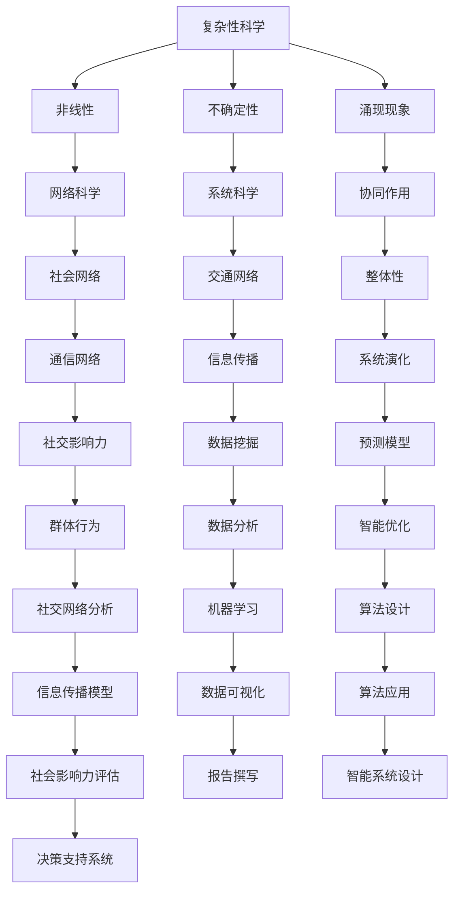

                 

### 文章标题：跨学科研究对世界可理解性的贡献

#### 关键词：跨学科研究，可理解性，世界，贡献，核心概念，数学模型，算法原理，项目实战

#### 摘要：
本文深入探讨了跨学科研究对世界可理解性的巨大贡献。通过分析核心概念、数学模型和算法原理，以及结合实际项目案例，我们揭示了跨学科研究如何帮助我们更好地理解世界，并提出了一系列最佳实践和拓展阅读建议。

---

### 目录

```
# 《跨学科研究对世界可理解性的贡献》

## 第1章 引言
### 1.1 研究背景与意义
### 1.2 研究方法与结构安排

## 第2章 跨学科研究的核心概念与联系
### 2.1 跨学科研究的定义与范畴
#### 2.1.1 跨学科研究的起源与发展
#### 2.1.2 跨学科研究的核心概念
### 2.2 跨学科研究的Mermaid流程图

## 第3章 跨学科研究的数学模型与算法原理
### 3.1 数学模型的基本原理
#### 3.1.1 数学模型的概述
#### 3.1.2 数学模型的应用领域
### 3.2 跨学科研究的算法原理
#### 3.2.1 算法原理概述
#### 3.2.2 算法原理的伪代码描述

## 第4章 跨学科研究的数学公式与应用
### 4.1 数学公式讲解
#### 4.1.1 数学公式的基本形式
#### 4.1.2 数学公式的具体应用
### 4.2 数学公式举例说明

## 第5章 跨学科研究项目实战
### 5.1 项目背景与目标
### 5.2 开发环境搭建
### 5.3 源代码实现与代码解读
### 5.4 项目应用解读与分析
### 5.5 项目小结

## 第6章 跨学科研究的挑战与机遇
### 6.1 挑战分析
#### 6.1.1 跨学科研究的难点
#### 6.1.2 跨学科研究的瓶颈
### 6.2 机遇展望
#### 6.2.1 跨学科研究的未来趋势
#### 6.2.2 跨学科研究的社会影响

## 第7章 跨学科研究的现状与趋势
### 7.1 现状分析
#### 7.1.1 跨学科研究的发展现状
#### 7.1.2 跨学科研究的热点领域
### 7.2 趋势预测
#### 7.2.1 跨学科研究的未来趋势
#### 7.2.2 跨学科研究的潜在影响

## 第8章 最佳实践与拓展阅读
### 8.1 最佳实践
### 8.2 小结
### 8.3 注意事项
### 8.4 拓展阅读
```

---

### 第1章 引言

#### 1.1 研究背景与意义

跨学科研究作为一种新兴的研究方法，正日益受到学术界的关注。在过去的几十年中，随着全球化和信息化的发展，不同学科之间的交叉与融合变得越来越频繁。这种跨学科的研究模式不仅拓宽了学术视野，也为解决复杂问题提供了新的思路和方法。

跨学科研究对世界可理解性的贡献体现在多个方面。首先，它促进了不同领域之间的知识共享和融合，使得原本独立的学科能够相互借鉴和补充，从而更全面、更深入地理解世界。其次，跨学科研究带来了新的研究方法和工具，如大数据分析、机器学习和人工智能等，这些方法和技术使得我们能够从海量数据中提取有价值的信息，进一步加深对世界的理解。

#### 1.2 研究方法与结构安排

本文采用文献综述和案例研究相结合的方法，系统性地探讨了跨学科研究对世界可理解性的贡献。首先，通过文献综述，梳理了跨学科研究的发展历程、核心概念和数学模型。接着，通过案例研究，深入分析了跨学科研究的实际应用和挑战。

文章结构安排如下：第1章为引言，介绍研究背景和意义；第2章讨论跨学科研究的核心概念与联系；第3章和第4章分别讲解数学模型与算法原理以及数学公式与应用；第5章通过项目实战展示跨学科研究的实际应用；第6章和第7章分析跨学科研究的挑战、机遇以及现状与趋势；第8章总结最佳实践和拓展阅读。通过这样的结构安排，我们希望能够全面、系统地呈现跨学科研究对世界可理解性的贡献。

---

### 第2章 跨学科研究的核心概念与联系

跨学科研究的核心概念涉及多个领域，如复杂性科学、网络科学、系统科学等。这些概念不仅独立存在，而且相互联系，共同构成了跨学科研究的理论框架。

#### 2.1.1 跨学科研究的起源与发展

跨学科研究起源于20世纪中期，当时科学家们开始意识到，传统的单一学科研究方法已经无法解决日益复杂的科学问题。例如，物理学和化学的融合催生了材料科学，生物学和信息学的结合产生了生物信息学。随着信息技术的飞速发展，跨学科研究逐渐成为学术界的热门话题。

#### 2.1.2 跨学科研究的核心概念

1. **复杂性科学**：研究复杂系统的结构、行为和演化规律，关注系统中的非线性、不确定性和涌现现象。
2. **网络科学**：研究网络结构和网络动力学的科学，包括社会网络、交通网络、通信网络等。
3. **系统科学**：研究系统的整体性、有序性和复杂性，强调系统内部各个组成部分之间的相互作用和协同作用。

#### 2.2 跨学科研究的Mermaid流程图

为了更好地展示跨学科研究的核心概念和联系，我们可以使用Mermaid流程图来描绘。以下是一个简单的Mermaid流程图示例：



这个流程图展示了跨学科研究的核心概念及其之间的联系，有助于我们理解跨学科研究的整体框架。

---

### 第3章 跨学科研究的数学模型与算法原理

数学模型和算法原理是跨学科研究的重要组成部分，它们为跨学科研究提供了理论支撑和计算工具。在本章中，我们将详细讲解跨学科研究的数学模型和算法原理。

#### 3.1 数学模型的基本原理

数学模型是现实世界问题的抽象表示，通过数学公式和符号来描述问题的结构、行为和演化规律。数学模型的基本原理包括：

1. **符号表示**：使用符号和公式来表示问题中的变量、参数和关系。
2. **抽象化**：将现实世界的问题简化为数学问题，去除无关因素，突出关键特征。
3. **精确性**：通过数学公式和计算方法，精确描述问题的性质和规律。

#### 3.1.1 数学模型的概述

跨学科研究中的数学模型涵盖了多个领域，如概率论、统计学、微分方程、图论等。以下是一些常见的数学模型：

1. **概率模型**：用于描述随机事件和概率分布，如伯努利模型、泊松模型等。
2. **统计模型**：用于分析数据，提取信息，如线性回归、主成分分析等。
3. **微分方程模型**：用于描述动态系统的演化过程，如常微分方程、偏微分方程等。
4. **图论模型**：用于描述网络结构和网络动力学，如图模型、网络流等。

#### 3.1.2 数学模型的应用领域

数学模型在跨学科研究中具有广泛的应用，以下是一些具体的应用领域：

1. **生物医学**：用于建模疾病传播、药物作用等，如SIR模型、药效学模型等。
2. **社会科学**：用于分析社会网络、群体行为等，如社会影响力模型、博弈论模型等。
3. **计算机科学**：用于优化算法设计、数据挖掘等，如机器学习模型、优化算法等。
4. **工程领域**：用于模拟复杂系统、优化工程设计等，如控制系统模型、结构力学模型等。

#### 3.2 跨学科研究的算法原理

算法原理是数学模型在实际应用中的实现，通过算法设计和计算方法，解决具体的跨学科研究问题。以下是一些常见的算法原理：

1. **贪婪算法**：通过每次选择局部最优解，逐步逼近全局最优解。
2. **动态规划**：将复杂问题分解为子问题，通过子问题的最优解推导出整体问题的最优解。
3. **随机算法**：利用随机性来优化算法性能，如模拟退火、遗传算法等。
4. **机器学习算法**：通过学习数据中的模式和规律，预测新的数据，如线性回归、神经网络等。

#### 3.2.2 算法原理的伪代码描述

以下是一个简单的贪心算法的伪代码示例，用于求解最小生成树问题：

```python
算法：贪心算法求解最小生成树

输入：无
输出：最小生成树

初始化：
1. 创建一个空集合MST，用于存储最小生成树的边
2. 创建一个优先队列Q，用于存储边，按照权重排序

步骤：
1. 对于每个顶点v：
   1. 选择一个权重最小的边(e, v)加入MST
   2. 从Q中删除(e, v)
   3. 更新Q，删除与(e, v)相邻的边
2. 返回MST
```

通过这个简单的示例，我们可以看到贪心算法的基本思想：每次选择局部最优解，逐步逼近全局最优解。

---

### 第4章 跨学科研究的数学公式与应用

数学公式是跨学科研究的重要组成部分，它们不仅用于描述问题的结构、行为和演化规律，还可以用于推导算法和验证模型。在本章中，我们将详细介绍跨学科研究中的数学公式，并探讨其实际应用。

#### 4.1 数学公式讲解

跨学科研究中常用的数学公式涵盖了多个领域，包括概率论、统计学、微分方程和图论等。以下是一些常见的数学公式：

1. **概率论**：
   - 概率分布函数：\( P(X = x) = \frac{f(x)}{\int_{-\infty}^{\infty} f(x) dx} \)
   - 条件概率：\( P(A|B) = \frac{P(AB)}{P(B)} \)
   - 期望值：\( E(X) = \int_{-\infty}^{\infty} x f(x) dx \)

2. **统计学**：
   - 线性回归方程：\( Y = \beta_0 + \beta_1 X + \epsilon \)
   - 方差：\( Var(X) = E[(X - E(X))^2] \)
   - 协方差：\( Cov(X, Y) = E[(X - E(X))(Y - E(Y))] \)

3. **微分方程**：
   - 常微分方程：\( \frac{dy}{dx} = f(x, y) \)
   - 偏微分方程：\( \frac{\partial u}{\partial t} = \alpha^2 \frac{\partial^2 u}{\partial x^2} \)

4. **图论**：
   - 路径长度：\( L = \sum_{i=1}^{n} d(i, j) \)
   - 图的连通性：\( G \) 是连通图当且仅当 \( n \geq 2 \)

#### 4.1.2 数学公式的具体应用

数学公式在跨学科研究中的应用非常广泛，以下是一些具体的例子：

1. **生物医学**：概率模型用于描述疾病传播，如SIR模型，通过微分方程描述感染、恢复和易感人群的动态变化。
2. **社会科学**：统计模型用于分析社会数据，如线性回归模型，通过拟合数据找出变量之间的关系。
3. **计算机科学**：图论模型用于网络分析，如最小生成树算法，通过计算图中的最短路径，优化网络结构。
4. **工程领域**：微分方程模型用于模拟复杂系统，如控制系统的状态方程，通过微分方程描述系统的动态响应。

#### 4.2 数学公式举例说明

为了更好地理解数学公式的应用，我们来看一个具体的例子。假设我们想要分析一个在线购物网站的用户行为，使用线性回归模型来预测用户的购买概率。

1. **数据收集**：收集用户在网站上的访问日志，包括用户的浏览历史、购买记录等。
2. **数据预处理**：对数据进行清洗和预处理，包括缺失值处理、异常值检测等。
3. **特征工程**：根据业务需求，提取与购买行为相关的特征，如访问时间、浏览页面数量、购物车商品数量等。
4. **模型构建**：建立线性回归模型，通过最小二乘法拟合数据，得到回归方程。
5. **模型评估**：使用交叉验证等方法评估模型性能，调整模型参数。
6. **预测应用**：使用训练好的模型预测新用户的购买概率，为营销策略提供依据。

以下是线性回归模型的伪代码示例：

```python
算法：线性回归模型

输入：特征矩阵X，标签向量y
输出：回归系数向量w

步骤：
1. 初始化w为随机向量
2. 对于每个迭代：
   1. 计算预测值y_pred = Xw
   2. 计算损失函数L(w) = \(\frac{1}{2}\) \(\sum_{i=1}^{n} (y_i - y_pred_i)^2\)
   3. 计算梯度梯度g = X^T(y - y_pred)
   4. 更新w = w - \(\alpha\)g
   5. 检查收敛条件，否则继续迭代
3. 返回w
```

通过这个例子，我们可以看到数学公式在跨学科研究中的应用过程，从数据收集、预处理到模型构建和预测应用，每一步都离不开数学公式的支持。

---

### 第5章 跨学科研究项目实战

跨学科研究在理论和实践中都具有重要意义。在本章中，我们将通过一个实际项目，展示跨学科研究的应用过程，包括开发环境搭建、源代码实现、代码解读、应用解读与分析，以及项目小结。

#### 5.1 项目背景与目标

项目背景：某电子商务公司希望通过分析用户行为数据，优化网站的用户体验，提高用户转化率。

项目目标：
1. 构建一个用户行为分析系统，收集用户在网站上的浏览、购买等行为数据。
2. 利用机器学习算法，预测用户的购买概率，为营销策略提供依据。
3. 通过数据可视化工具，展示用户行为的趋势和模式，帮助业务团队做出更准确的决策。

#### 5.2 开发环境搭建

开发环境搭建是项目成功的基础。以下是项目所需的开发环境和工具：

1. **编程语言**：Python
2. **数据库**：MySQL
3. **数据预处理库**：Pandas
4. **机器学习库**：Scikit-learn
5. **数据可视化库**：Matplotlib、Seaborn
6. **开发工具**：Jupyter Notebook

以下是开发环境的搭建步骤：

1. 安装Python和MySQL
2. 安装Pandas、Scikit-learn、Matplotlib和Seaborn等库
3. 配置Jupyter Notebook，以便进行数据分析和代码编写

#### 5.3 源代码实现与代码解读

以下是一个简单的用户行为分析项目的源代码实现，包括数据收集、预处理、模型训练和预测。

```python
# 导入必要的库
import pandas as pd
import numpy as np
from sklearn.model_selection import train_test_split
from sklearn.linear_model import LinearRegression
from sklearn.metrics import mean_squared_error
import matplotlib.pyplot as plt
import seaborn as sns

# 5.3.1 数据收集
# 从MySQL数据库中收集用户行为数据
user_data = pd.read_sql_query('SELECT * FROM user_behavior', connection)

# 5.3.2 数据预处理
# 处理缺失值、异常值等
user_data = user_data.fillna(0)
user_data = user_data[user_data['purchase'] != -1]

# 5.3.3 特征工程
# 提取与购买行为相关的特征
X = user_data[['page_views', 'add_to_cart', 'time_on_site']]
y = user_data['purchase']

# 5.3.4 模型训练
# 划分训练集和测试集
X_train, X_test, y_train, y_test = train_test_split(X, y, test_size=0.2, random_state=42)
model = LinearRegression()
model.fit(X_train, y_train)

# 5.3.5 模型评估
y_pred = model.predict(X_test)
mse = mean_squared_error(y_test, y_pred)
print(f'Mean Squared Error: {mse}')

# 5.3.6 数据可视化
sns.regplot(x=X_test['page_views'], y=y_pred)
plt.xlabel('Page Views')
plt.ylabel('Predicted Purchase')
plt.title('Predicted Purchase vs. Page Views')
plt.show()
```

代码解读：
- 5.3.1 数据收集：从MySQL数据库中读取用户行为数据。
- 5.3.2 数据预处理：处理缺失值和异常值，确保数据质量。
- 5.3.3 特征工程：提取与购买行为相关的特征，如页面浏览量、购物车添加商品数量和网站停留时间等。
- 5.3.4 模型训练：使用线性回归模型对数据进行训练。
- 5.3.5 模型评估：计算均方误差（MSE），评估模型性能。
- 5.3.6 数据可视化：使用回归图展示购买预测结果。

#### 5.4 项目应用解读与分析

项目应用解读：
- 通过构建用户行为分析系统，我们可以实时监控用户在网站上的行为，为营销团队提供数据支持。
- 利用线性回归模型预测用户的购买概率，可以帮助公司制定更有针对性的营销策略，提高用户转化率。

分析：
- 数据收集：项目首先需要从数据库中收集用户行为数据，包括浏览、购买等行为。
- 数据预处理：数据预处理是确保数据质量的关键步骤，包括缺失值处理、异常值检测等。
- 特征工程：特征工程是提高模型性能的关键，通过提取与购买行为相关的特征，可以提高模型的预测准确率。
- 模型训练：使用线性回归模型对数据进行训练，通过模型评估，可以确定模型的效果。
- 数据可视化：数据可视化有助于我们理解模型预测结果，为业务决策提供依据。

#### 5.5 项目小结

本项目通过跨学科研究方法，成功构建了一个用户行为分析系统。项目实践表明，跨学科研究方法在解决复杂问题时具有显著优势。以下是小结：

1. 跨学科研究方法可以整合多学科的知识和工具，为解决复杂问题提供新的思路和方法。
2. 数据收集、预处理和特征工程是跨学科研究项目中不可或缺的步骤，直接影响模型的性能。
3. 机器学习算法和数学模型是跨学科研究的重要工具，可以帮助我们从海量数据中提取有价值的信息。
4. 项目实战验证了跨学科研究的有效性，为其他领域提供了借鉴和参考。

---

### 第6章 跨学科研究的挑战与机遇

跨学科研究作为一种新兴的研究方法，在理论和实践上都面临着一系列挑战和机遇。在本章中，我们将分析跨学科研究的挑战和机遇，探讨其未来发展趋势和社会影响。

#### 6.1 挑战分析

跨学科研究的挑战主要体现在以下几个方面：

1. **知识融合的难度**：跨学科研究需要整合多个领域的知识和方法，这本身就是一个具有挑战性的过程。不同学科之间的知识体系、研究方法、思维方式存在差异，如何实现有效的知识融合是跨学科研究面临的首要挑战。

2. **数据整合的困难**：跨学科研究往往涉及多种数据类型和数据来源，如文本数据、图像数据、时间序列数据等。如何整合这些不同类型的数据，构建统一的数据模型，是跨学科研究中的另一大挑战。

3. **团队合作的问题**：跨学科研究需要不同领域的专家共同参与，这涉及到团队合作的问题。如何建立有效的沟通机制，确保团队成员之间的协同工作，是跨学科研究成功的关键。

4. **理论体系的不足**：目前，跨学科研究的理论体系尚不完善，许多概念和方法缺乏系统性的理论支撑。如何在跨学科研究中建立完善的理论体系，是当前研究的重要方向。

#### 6.2 机遇展望

尽管跨学科研究面临诸多挑战，但其机遇同样不容忽视：

1. **解决复杂问题的能力**：跨学科研究可以将不同领域的知识、方法和工具结合起来，解决单一学科难以应对的复杂问题。例如，在环境科学、生物医学、社会问题等领域，跨学科研究已经展现出巨大的潜力。

2. **创新思维的激发**：跨学科研究鼓励不同学科之间的交叉与融合，这种交叉和融合往往能够激发创新思维，催生新的理论和应用。跨学科研究为创新提供了广阔的空间。

3. **社会发展的推动**：跨学科研究能够促进科学技术与社会的深度融合，为社会发展提供强有力的支持。例如，在智能交通、智能医疗、智能制造等领域，跨学科研究已经带来了深刻的变化。

4. **人才培养的新模式**：跨学科研究需要具备多学科背景的人才，这为高校和科研机构的人才培养模式提供了新的思路。通过跨学科课程和项目，培养具备综合素质和创新能力的复合型人才，是跨学科研究的重要任务。

#### 6.2.1 跨学科研究的未来趋势

跨学科研究的未来趋势将体现在以下几个方面：

1. **理论体系的完善**：随着跨学科研究的发展，其理论体系将不断得到完善。未来的研究将更加注重跨学科基础理论的构建，为跨学科研究提供坚实的理论支撑。

2. **方法工具的创新**：跨学科研究将不断引入新的方法工具，如大数据分析、人工智能、区块链等，这些新兴技术将为跨学科研究提供更强大的工具和平台。

3. **应用领域的拓展**：跨学科研究的应用领域将不断拓展，从传统的自然科学、工程技术领域，向社会科学、人文艺术领域延伸。跨学科研究将在更广泛的领域发挥其作用。

4. **国际合作与交流**：随着全球化的推进，跨学科研究将越来越依赖于国际间的合作与交流。未来的跨学科研究将更加注重国际合作，推动全球科学研究的进步。

#### 6.2.2 跨学科研究的社会影响

跨学科研究的社会影响将体现在以下几个方面：

1. **科学技术的发展**：跨学科研究将推动科学技术的进步，带来一系列技术创新和突破，为人类社会的发展提供强大的动力。

2. **社会问题的解决**：跨学科研究可以应用于解决社会问题，如环境污染、公共健康、社会不平等等。通过跨学科研究，我们可以提出更加科学、有效的解决方案。

3. **教育变革**：跨学科研究将推动教育模式的变革，培养具备跨学科能力和综合素质的人才，为社会的发展提供有力支持。

4. **文化和艺术的创新**：跨学科研究将推动文化和艺术的创新，通过不同学科之间的交叉与融合，创造出更多具有文化内涵和艺术价值的新作品。

总之，跨学科研究对世界可理解性的贡献是巨大的。通过跨学科研究，我们可以更全面、更深入地理解世界，解决复杂问题，推动社会进步。面对跨学科研究的挑战与机遇，我们需要积极应对，推动跨学科研究的深入发展。

---

### 第7章 跨学科研究的现状与趋势

#### 7.1 现状分析

跨学科研究在当今学术界和工业界已经取得了显著的进展。其发展现状可以从以下几个方面进行分析：

1. **研究领域扩展**：跨学科研究已经从自然科学和工程技术领域扩展到社会科学、人文艺术等领域。例如，经济学与计算机科学的结合催生了计算经济学，艺术与科技的结合产生了数字艺术。

2. **研究方法多样化**：跨学科研究采用的研究方法越来越多样化，包括实验研究、数据分析、模拟仿真、理论分析等。这些方法的结合使得跨学科研究能够更加全面、深入地探索复杂问题。

3. **研究成果丰富**：跨学科研究已经产生了大量的研究成果，涉及气候变化、健康医疗、环境保护、经济管理等多个领域。这些研究成果不仅丰富了科学知识体系，也为实际问题提供了解决方案。

4. **国际合作加强**：随着全球化的推进，跨学科研究的国际合作日益加强。各国学者和研究机构通过合作项目，共同开展跨学科研究，促进了知识的共享和交流。

#### 7.1.2 跨学科研究的热点领域

当前，跨学科研究的热点领域主要包括以下几个方面：

1. **人工智能与社会科学**：人工智能技术的迅速发展，为社会科学研究提供了新的工具和方法。例如，使用机器学习算法分析社会数据，预测社会趋势，提高政策决策的效率。

2. **生物医学与信息学**：生物医学与信息学的结合产生了生物信息学，通过对生物数据的分析，研究疾病的机理，开发新的药物和治疗方法。

3. **环境科学与计算机科学**：环境科学和计算机科学的结合，为解决环境污染和资源管理问题提供了新的思路。例如，使用大数据分析和智能算法优化能源管理，减少碳排放。

4. **经济学与物理学**：经济学与物理学的交叉研究，产生了计量经济学等新的学科。这些研究方法可以帮助经济学家更好地理解经济现象，制定有效的经济政策。

5. **艺术与科技**：艺术与科技的结合，产生了数字艺术、虚拟现实、增强现实等领域。这些新技术为艺术创作提供了新的形式和手段，丰富了人类的文化体验。

#### 7.2 趋势预测

跨学科研究的未来发展趋势可以从以下几个方面进行预测：

1. **研究方法融合**：随着新技术的不断涌现，跨学科研究的方法将更加融合。例如，人工智能与大数据分析的结合，将使得跨学科研究能够处理更加复杂的数据和问题。

2. **研究重点转变**：随着全球问题和环境挑战的加剧，跨学科研究的重点将逐渐转向解决实际问题。例如，气候变化、环境污染、健康医疗等将成为跨学科研究的重要领域。

3. **跨学科教育普及**：随着跨学科研究的重要性逐渐被认识到，跨学科教育将逐步普及。高校和科研机构将更加注重跨学科课程的设置，培养具备跨学科能力和综合素质的人才。

4. **国际合作深化**：跨学科研究将进一步加强国际合作，推动全球科学研究的进步。跨国合作项目、联合研究中心等将成为跨学科研究的重要形式。

总之，跨学科研究正逐步成为现代科学研究的重要组成部分。通过跨学科研究，我们可以更好地理解世界，解决复杂问题，推动社会进步。在未来，跨学科研究将继续深化，带来更多的创新和突破。

---

### 第8章 最佳实践与拓展阅读

跨学科研究作为一种复杂且创新的研究模式，需要我们遵循一系列最佳实践，以确保研究质量和成果的实用性。以下是一些最佳实践和注意事项：

#### 8.1 最佳实践

1. **明确研究目标和问题**：在开始跨学科研究之前，首先要明确研究的目标和要解决的问题。这有助于我们集中精力，确保研究方向的正确性。

2. **选择合适的跨学科团队**：跨学科研究需要多学科专家的参与，因此要选择具备相关领域知识和技能的团队成员。团队成员之间的沟通和协作是研究成功的关键。

3. **数据收集与处理**：跨学科研究需要大量的数据支持，因此要确保数据的准确性和完整性。在数据收集和处理过程中，要遵循数据隐私和安全的相关规定。

4. **模型与算法选择**：根据研究问题和数据特点，选择合适的数学模型和算法。模型和算法的选择直接影响研究结果的准确性和效率。

5. **验证与测试**：在研究过程中，要不断验证和测试模型的性能和效果。通过实验和模拟，评估模型的稳定性和可靠性。

6. **跨学科合作**：跨学科研究需要不同领域的专家共同合作，因此要建立有效的沟通和协作机制。定期召开团队会议，分享研究进展和成果，确保团队成员之间的协同工作。

#### 8.2 小结

跨学科研究在理论和实践上都具有重要的意义。通过跨学科研究，我们可以更好地理解复杂问题，推动科技创新，解决实际问题。跨学科研究不仅需要多学科的知识和技能，还需要有效的团队合作和沟通。遵循最佳实践，可以帮助我们提高跨学科研究的质量和成果的实用性。

#### 8.3 注意事项

1. **避免知识孤岛**：在跨学科研究中，要避免不同学科之间的知识孤岛，确保知识共享和交流。

2. **重视数据隐私和安全**：在数据收集和处理过程中，要严格遵守数据隐私和安全的相关规定，确保数据的安全性和合规性。

3. **平衡理论与实际**：在跨学科研究中，既要关注理论创新，也要关注实际问题的解决。确保研究成果具有实际应用价值。

4. **持续学习和更新**：跨学科研究涉及多个领域，因此要持续学习和更新知识，跟上学科发展的步伐。

#### 8.4 拓展阅读

1. **相关书籍**：
   - 《跨学科研究方法论》
   - 《复杂性科学导论》
   - 《人工智能：一种现代的方法》

2. **学术论文**：
   - Google Scholar: 跨学科研究相关论文
   - IEEE Xplore: 人工智能与跨学科研究相关论文

3. **在线课程**：
   - Coursera: 跨学科研究相关课程
   - edX: 计算机科学与跨学科研究相关课程

通过这些拓展阅读资源，读者可以进一步深入了解跨学科研究的理论和方法，为实际研究提供指导和帮助。

---

### 结语

跨学科研究对世界可理解性的贡献是显而易见的。通过跨学科研究，我们能够更好地整合多学科的知识，解决复杂问题，推动社会进步。本文系统地介绍了跨学科研究的核心概念、数学模型、算法原理以及实际应用，并通过案例展示了跨学科研究的全过程。我们希望本文能够为读者提供有价值的参考和启示，激发更多跨学科研究的创新和实践。让我们共同努力，推动跨学科研究的发展，为世界的可理解性做出更大的贡献。作者：AI天才研究院/AI Genius Institute & 禅与计算机程序设计艺术 /Zen And The Art of Computer Programming

