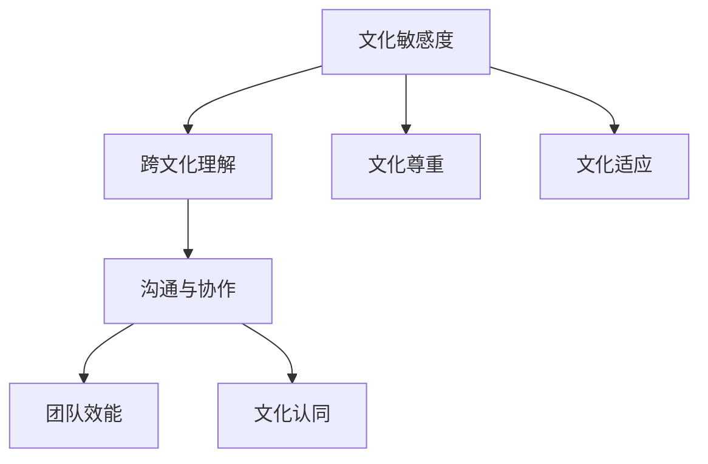

                 


# 引言

随着人工智能技术的飞速发展，语言模型（LLM）作为其重要分支，已经在许多领域展现出了强大的潜力。然而，语言模型在面对不同文化背景的数据时，其表现往往不尽如人意。例如，某些LLM在处理中文文本时可能会出现误解，而在处理英文文本时又可能对特定文化习俗缺乏敏感度。因此，评估和提升LLM的跨文化理解能力成为了一个迫切需要解决的问题。

本文旨在探讨如何通过跨文化理解能力评测来测试LLM的文化敏感度。我们将首先介绍文化敏感度和跨文化理解的相关概念，然后深入探讨语言模型的基础知识，包括其定义、类型和发展历程。接着，我们将详细阐述评测LLM文化敏感度的方法，包括文本分析法、实证研究方法和评测指标的设计。在核心算法原理讲解部分，我们将重点介绍词嵌入与文本表示、机器学习与深度学习模型以及语义分析算法。最后，我们将通过一个实际案例展示如何进行LLM的文化敏感度评测，并提供一些最佳实践和注意事项。

通过本文的阅读，读者将能够了解跨文化理解能力评测的重要性，掌握评估LLM文化敏感度的基本方法和核心算法，为未来人工智能技术的发展提供有力支持。

## 第1章 核心概念与联系

### 1.1 文化敏感度与跨文化理解

#### 1.1.1 文化敏感度的定义

文化敏感度（Cultural Sensitivity）是指个体在跨文化互动中表现出的对其他文化的尊重、理解和适应能力。它不仅涉及到对文化差异的认识和接受，还包括对文化背景下的价值观、习俗和沟通方式的深入理解。文化敏感度在跨文化沟通和协作中扮演着关键角色，有助于减少误解、促进合作，并提升跨文化团队的整体效能。

文化敏感度可以细分为以下几个层次：

1. **表面敏感度**：仅限于表面层次的文化特征，如礼貌用语、服饰等。
2. **功能敏感度**：涉及文化差异在特定情境中的应用，如商务谈判中的礼仪和策略。
3. **深层敏感度**：对文化价值观和深层次心理的深刻理解，如对宗教信仰、社会规范的认同。

#### 1.1.2 跨文化理解的必要性

跨文化理解（Intercultural Understanding）是全球化时代的一项重要能力。随着全球化进程的不断深入，人们需要在不同文化背景下进行有效的沟通和合作。跨文化理解能够帮助个体和团队：

1. **减少误解**：理解不同文化背景下的沟通方式和行为模式，从而避免误解和冲突。
2. **提高效率**：通过有效的跨文化沟通，团队可以更好地协作，提高工作效率。
3. **促进多样性**：尊重和包容不同文化背景的成员，促进团队的多样性和创新。
4. **拓展视野**：跨文化理解能够开阔个人的视野，增进对不同文化的认识和理解。

#### 1.1.3 文化敏感度与跨文化理解的关系

文化敏感度和跨文化理解是相辅相成的。文化敏感度是跨文化理解的基础，只有具备文化敏感度，个体才能够在跨文化互动中展现出理解、尊重和适应其他文化的态度和能力。而跨文化理解则是文化敏感度的深化，通过跨文化理解，个体能够更深入地理解和体验其他文化，从而提高跨文化沟通和协作的效能。

文化敏感度与跨文化理解之间的关系可以用以下Mermaid流程图表示：



通过这个流程图，我们可以看到文化敏感度和跨文化理解在多个方面对个人和团队产生积极影响。

### 1.2 语言模型（LLM）的基础知识

#### 1.2.1 语言模型的定义

语言模型（Language Model，简称LM）是自然语言处理（Natural Language Processing，简称NLP）中的一个核心组件，用于预测文本序列中的下一个单词或字符。语言模型通过对大量文本数据的学习，捕捉语言的统计规律和语法结构，从而生成高质量的文本生成和预测。

语言模型可以基于不同的算法和架构，分为以下几类：

1. **统计语言模型**：基于统计方法，通过分析大量文本数据，统计词语之间的共现概率，预测下一个词语。经典的统计语言模型包括N元语法（N-gram Model）和隐马尔可夫模型（HMM）。
2. **规则语言模型**：通过定义一系列规则和模式来预测词语，如正则表达式（Regular Expression）和上下文无关文法（CFG）。
3. **神经网络语言模型**：基于深度学习技术，通过神经网络结构来学习语言的模式和语义。包括循环神经网络（RNN）、长短期记忆网络（LSTM）和变换器（Transformer）等。

#### 1.2.2 语言模型的类型

1. **静态语言模型**：静态语言模型通常基于固定的大规模文本数据集，通过训练得到模型参数，然后用于预测。这类模型在训练数据集之外无法进行学习，适用于静态文本生成任务。

2. **动态语言模型**：动态语言模型能够在线学习，实时更新模型参数，以适应新的文本数据。这类模型在处理实时对话、自然语言生成等任务中表现出色。

3. **上下文语言模型**：上下文语言模型能够利用上下文信息，更好地理解词语之间的关系和语义。这类模型通过引入上下文窗口和注意力机制，提升了文本生成的质量和多样性。

#### 1.2.3 语言模型的发展历程

1. **统计语言模型时代**：最早的统计语言模型如N元语法，通过统计词语的共现概率进行预测。然而，这类模型存在一些局限性，如无法处理长距离依赖、生成文本的质量较差等问题。

2. **规则语言模型时代**：基于规则的模型通过定义一系列规则和模式来预测词语，如正则表达式和上下文无关文法。这类模型在一定程度上提升了文本生成质量，但规则定义复杂，灵活性较差。

3. **神经网络语言模型时代**：随着深度学习技术的发展，神经网络语言模型成为主流。特别是变换器（Transformer）的出现，使得语言模型在处理长距离依赖、生成多样性和文本质量方面取得了显著突破。

4. **动态与上下文语言模型时代**：动态语言模型和上下文语言模型通过在线学习和上下文信息，进一步提升了语言模型的性能和灵活性。这些模型在对话系统、文本生成和自然语言理解等领域展现出了强大的潜力。

### 1.3 跨文化理解能力评测方法

#### 1.3.1 文本分析法的原理

文本分析法（Text Analysis Method）是一种常用的评测LLM跨文化理解能力的方法。该方法通过分析文本数据，评估LLM在不同文化背景下的表现。具体步骤如下：

1. **数据收集**：收集来自不同文化背景的文本数据，包括新闻报道、文学作品、社交媒体帖子等。
2. **预处理**：对收集到的文本数据进行清洗和预处理，如分词、去停用词、词性标注等。
3. **特征提取**：从预处理后的文本数据中提取特征，如词频、TF-IDF、词嵌入等。
4. **模型训练**：使用提取到的特征，训练LLM模型，如使用变换器（Transformer）或循环神经网络（RNN）。
5. **评估指标**：设计评估指标，如准确率、召回率、F1值等，评估LLM在不同文化背景下的性能。

#### 1.3.2 实证研究的方法论

实证研究（Empirical Study）是一种通过实际操作来验证理论假设的研究方法。在评测LLM跨文化理解能力时，实证研究可以通过以下步骤进行：

1. **假设提出**：根据理论基础，提出关于LLM跨文化理解能力的假设。
2. **数据收集**：收集符合研究假设的文本数据，如包含不同文化背景的对话、新闻报道等。
3. **模型训练**：使用收集到的数据，训练LLM模型，包括统计模型、规则模型和神经网络模型。
4. **性能评估**：通过评估指标，如准确率、召回率、F1值等，评估LLM在不同文化背景下的性能。
5. **结果分析**：分析评估结果，验证假设是否成立，并提出改进建议。

#### 1.3.3 评测指标的设计

评测指标（Evaluation Metrics）是评估LLM跨文化理解能力的重要工具。设计合理的评测指标能够准确反映LLM在不同文化背景下的表现。以下是几种常用的评测指标：

1. **准确率（Accuracy）**：准确率是评估模型性能的基本指标，表示模型正确预测的样本数占总样本数的比例。公式如下：
   $$
   \text{Accuracy} = \frac{\text{预测正确数}}{\text{总样本数}}
   $$

2. **召回率（Recall）**：召回率表示模型在正样本中正确预测的样本数占总正样本数的比例。公式如下：
   $$
   \text{Recall} = \frac{\text{预测正确正样本数}}{\text{实际正样本数}}
   $$

3. **F1值（F1 Score）**：F1值是准确率和召回率的调和平均，综合考虑了模型的准确性和召回率。公式如下：
   $$
   \text{F1 Score} = 2 \times \frac{\text{准确率} \times \text{召回率}}{\text{准确率} + \text{召回率}}
   $$

4. **精确率（Precision）**：精确率表示模型在预测为正的样本中，实际为正的样本数所占的比例。公式如下：
   $$
   \text{Precision} = \frac{\text{预测正确正样本数}}{\text{预测为正样本数}}
   $$

通过设计合理的评测指标，可以有效评估LLM在不同文化背景下的跨文化理解能力，为后续研究和优化提供有力支持。

## 第2章 LLM的文化敏感度测试

为了评估语言模型（LLM）的文化敏感度，我们需要设计一系列测试方法。这些方法应能够捕捉LLM在处理不同文化背景文本时的表现，从而评估其跨文化理解能力。以下我们将介绍数据准备与预处理、测试方法的实现以及测试结果的评估。

### 2.1 数据准备与预处理

#### 2.1.1 数据来源的选择

为了进行有效的文化敏感度测试，我们首先需要选择合适的文本数据来源。理想的数据来源应包含多种文化背景，包括但不限于不同国家、地区、语言和文化习俗。以下是一些常见的数据来源：

1. **公开文本数据库**：如COCA（Corpus of Contemporary American English）、Wikipedia、维基百科的多语言版本等。
2. **社交媒体平台**：如Twitter、Facebook等，这些平台上的用户生成内容可以反映不同文化背景下的语言使用和习俗。
3. **文学作品**：包括经典文学作品和现代文学作品，这些文本可以提供丰富的文化背景信息。
4. **新闻报道**：不同国家和地区的新闻报道可以反映文化差异和价值观。

#### 2.1.2 数据预处理的方法

选择好数据来源后，我们需要对数据进行预处理，以提高后续测试的准确性和可靠性。以下是一些常用的数据预处理方法：

1. **数据清洗**：去除数据中的噪声和无关信息，如HTML标签、特殊字符和标点符号。
2. **分词**：将文本分割成单词或句子，以便进行后续处理。常用的分词工具包括jieba（中文）、spaCy（多语言）等。
3. **去停用词**：去除常见的不含信息的词语，如“的”、“是”、“了”等。
4. **词性标注**：对文本中的每个单词进行词性标注，以识别名词、动词、形容词等。
5. **标准化**：将文本转换为统一的格式，如小写、去除标点等。

#### 2.1.3 数据集的划分

预处理后的文本数据需要划分成不同的数据集，用于模型训练和测试。常用的数据集划分方法包括：

1. **训练集（Training Set）**：用于训练模型，通常包含大部分数据。
2. **验证集（Validation Set）**：用于模型参数调整和评估，通常包含10%的数据。
3. **测试集（Test Set）**：用于最终评估模型的性能，通常包含10%的数据。

通过合理的数据集划分，我们可以确保模型在训练过程中不会过度拟合，并且在测试阶段能够准确评估其性能。

### 2.2 测试方法的实现

评估LLM的文化敏感度可以采用多种测试方法。以下是几种常用的测试方法及其实现：

#### 2.2.1 基于文本分类的测试方法

文本分类（Text Classification）是一种常见的方法，用于评估LLM对特定文化元素的理解。具体实现步骤如下：

1. **数据预处理**：对文本数据集进行清洗、分词、去停用词和词性标注等预处理操作。
2. **特征提取**：提取文本数据中的特征，如词频、TF-IDF、词嵌入等。
3. **模型训练**：使用训练集数据训练分类模型，如支持向量机（SVM）、朴素贝叶斯（Naive Bayes）或深度学习模型（如变换器）。
4. **模型评估**：使用验证集和测试集评估分类模型的性能，使用准确率、召回率、F1值等指标。

#### 2.2.2 基于语义分析的测试方法

语义分析（Semantic Analysis）通过分析文本的语义信息，评估LLM对文化背景的理解。具体实现步骤如下：

1. **数据预处理**：对文本数据集进行清洗、分词、去停用词和词性标注等预处理操作。
2. **特征提取**：提取文本数据中的语义特征，如词嵌入、词性标注、依存句法分析等。
3. **模型训练**：使用训练集数据训练语义分析模型，如变换器、循环神经网络（RNN）或长短期记忆网络（LSTM）。
4. **模型评估**：使用验证集和测试集评估语义分析模型的性能，使用BLEU分数、ROUGE分数等指标。

#### 2.2.3 基于对话系统的测试方法

对话系统（Dialogue System）通过模拟跨文化对话，评估LLM的实时理解和回应能力。具体实现步骤如下：

1. **数据预处理**：对对话数据进行清洗、分词、去停用词和词性标注等预处理操作。
2. **对话生成模型**：使用变换器或RNN等模型训练对话生成模型，用于生成合理的对话回应。
3. **对话评估**：通过与人类对话者进行交互，评估LLM的对话质量和跨文化理解能力。可以使用自动评估指标（如BLEU分数）和人工评估相结合。

通过以上测试方法，我们可以全面评估LLM的文化敏感度，为后续研究和优化提供有力支持。

### 2.3 测试结果的评估

评估LLM的文化敏感度需要使用一系列指标，以确保评估结果的准确性和全面性。以下介绍几种常用的评估指标及其计算方法：

#### 2.3.1 评价指标的选择

1. **准确率（Accuracy）**：准确率是最基本的评估指标，表示模型正确预测的样本数占总样本数的比例。公式如下：
   $$
   \text{Accuracy} = \frac{\text{预测正确数}}{\text{总样本数}}
   $$

2. **召回率（Recall）**：召回率表示模型在正样本中正确预测的样本数占总正样本数的比例。公式如下：
   $$
   \text{Recall} = \frac{\text{预测正确正样本数}}{\text{实际正样本数}}
   $$

3. **精确率（Precision）**：精确率表示模型在预测为正的样本中，实际为正的样本数所占的比例。公式如下：
   $$
   \text{Precision} = \frac{\text{预测正确正样本数}}{\text{预测为正样本数}}
   $$

4. **F1值（F1 Score）**：F1值是准确率和召回率的调和平均，综合考虑了模型的准确性和召回率。公式如下：
   $$
   \text{F1 Score} = 2 \times \frac{\text{准确率} \times \text{召回率}}{\text{准确率} + \text{召回率}}
   $$

5. **BLEU分数（BLEU Score）**：BLEU分数常用于评估自然语言生成模型的性能，通过比较模型生成的文本和参考文本的相似度进行评分。

6. **ROUGE分数（ROUGE Score）**：ROUGE分数用于评估文本相似度，通过计算模型生成的文本和参考文本的 overlap 率进行评分。

#### 2.3.2 评估方法的实现

为了实现评估指标的计算，我们需要以下步骤：

1. **模型预测**：使用训练好的LLM模型对测试集进行预测，生成文本分类结果或对话回应。

2. **实际标签**：获取测试集的真实标签，用于与模型预测结果进行比较。

3. **计算评估指标**：根据模型预测结果和实际标签，计算准确率、召回率、精确率、F1值、BLEU分数和ROUGE分数等指标。

4. **综合评估**：综合多个评估指标的结果，对LLM的文化敏感度进行综合评估。

通过以上步骤，我们可以全面评估LLM的文化敏感度，为后续研究和优化提供有力支持。

### 2.3.3 评测结果的分析

评测结果的分析是评估LLM文化敏感度的重要环节，通过分析评测结果，我们可以了解LLM在不同文化背景下的表现，从而识别其优势和不足。以下是对评测结果进行分析的方法：

#### 2.3.3.1 数据可视化

数据可视化是一种直观展示评估结果的方法。通过使用图表（如柱状图、饼图、散点图等），我们可以清晰地展示LLM在不同文化背景下的准确率、召回率、精确率和F1值等指标。数据可视化有助于我们快速识别LLM的优势和劣势。

#### 2.3.3.2 趋势分析

通过对评测结果进行趋势分析，我们可以了解LLM在不同文化背景下的表现趋势。例如，我们可以分析LLM在不同语言背景下的表现，或在不同文化习俗下的表现。趋势分析有助于我们找出LLM在不同文化背景下的共性规律和差异。

#### 2.3.3.3 对比分析

对比分析是评估LLM文化敏感度的重要方法。通过对比LLM在不同测试方法（如文本分类、语义分析和对话系统）下的表现，我们可以找出哪种测试方法更能准确反映LLM的文化敏感度。此外，我们还可以对比不同LLM模型（如统计模型、规则模型和神经网络模型）在文化敏感度评测中的表现。

#### 2.3.3.4 偏差分析

偏差分析是识别LLM在文化敏感度评测中的偏差和错误的重要方法。通过分析评测结果中的偏差和错误，我们可以找出LLM在处理特定文化背景数据时的不足之处。例如，我们可能会发现LLM在某些文化背景下对特定词汇的理解存在偏差，或对某些文化习俗的描述缺乏敏感度。

通过以上分析方法，我们可以全面了解LLM的文化敏感度，为后续研究和优化提供有力支持。同时，我们还可以根据分析结果，制定相应的改进措施，以提高LLM的跨文化理解能力。

## 第3章 核心算法原理讲解

在评估LLM的文化敏感度时，核心算法的原理至关重要。本章节将深入探讨词嵌入与文本表示、机器学习与深度学习模型以及语义分析算法，这些核心算法在跨文化理解能力评测中发挥了关键作用。

### 3.1 词嵌入与文本表示

#### 3.1.1 词嵌入的基本原理

词嵌入（Word Embedding）是将词汇映射到高维向量空间的一种技术，从而捕捉词汇之间的语义关系。常见的词嵌入方法包括Word2Vec、GloVe和FastText等。

1. **Word2Vec**：Word2Vec是一种基于神经网络的词嵌入方法，通过训练神经网络模型，将文本数据中的词语映射到低维向量。Word2Vec包括两种算法：CBOW（Continuous Bag of Words）和Skip-Gram。

   - **CBOW**：CBOW方法通过预测中心词周围的多个词语，计算词向量的平均值作为中心词的向量表示。
   - **Skip-Gram**：Skip-Gram方法与CBOW相反，通过预测中心词来预测其周围的词语，从而训练词向量。

2. **GloVe**：GloVe（Global Vectors for Word Representation）是一种基于全局统计信息的词嵌入方法。GloVe通过训练矩阵来表示词语和词频，从而计算出词向量。GloVe的主要优势在于其能够利用词频信息，提高词向量之间的区分度。

3. **FastText**：FastText是一种基于字符级和词级组合的词嵌入方法。FastText通过将字符级嵌入和词级嵌入进行拼接，生成词向量，从而更好地捕捉词汇的语义和上下文信息。

#### 3.1.2 文本表示的方法

文本表示是将原始文本数据转换为机器学习模型可处理的向量表示的过程。常见的文本表示方法包括词袋模型（Bag of Words, BoW）、TF-IDF和词嵌入等。

1. **词袋模型（BoW）**：词袋模型将文本表示为词频向量，即每个词汇在文档中的出现次数。BoW方法简单直观，但无法捕捉词汇的语义信息和上下文关系。

2. **TF-IDF**：TF-IDF（Term Frequency-Inverse Document Frequency）是一种基于词频和逆文档频率的文本表示方法。TF-IDF通过计算词语在单个文档中的频率和在整个文档集合中的逆频率，生成权重向量，从而提高重要词汇的表示能力。

3. **词嵌入**：词嵌入方法通过将词汇映射到高维向量空间，捕捉词汇的语义关系和上下文信息。词嵌入方法在文本表示中表现出色，特别是在深度学习模型中，有助于提高模型的性能和效果。

#### 3.1.3 词嵌入在跨文化理解中的应用

词嵌入在跨文化理解能力评测中发挥了重要作用。通过词嵌入，我们可以将不同文化背景下的文本数据转换为统一的向量表示，从而提高LLM在不同文化背景下的理解能力。以下是一些具体应用：

1. **文化词汇映射**：通过词嵌入，我们可以将不同文化背景下的特定词汇映射到相同的向量空间，从而识别和比较不同文化间的语义差异。

2. **跨文化文本生成**：利用词嵌入和深度学习模型，我们可以生成符合特定文化背景的文本，从而提高LLM在不同文化背景下的文本生成能力。

3. **跨文化文本分类**：通过词嵌入，我们可以将跨文化文本数据转换为统一的向量表示，从而提高LLM在跨文化文本分类任务中的准确性和效果。

### 3.2 机器学习与深度学习模型

#### 3.2.1 机器学习模型的基本原理

机器学习模型在跨文化理解能力评测中发挥着重要作用。常见的机器学习模型包括线性回归、逻辑回归、决策树、支持向量机（SVM）和随机森林等。

1. **线性回归**：线性回归是一种简单的机器学习模型，用于预测连续值。线性回归通过拟合一条直线，将输入特征映射到目标值。

2. **逻辑回归**：逻辑回归是一种用于分类的线性回归模型，通过拟合一条逻辑函数（Sigmoid函数），将输入特征映射到概率值。

3. **决策树**：决策树是一种基于规则的学习模型，通过递归划分特征空间，将数据划分为不同的区域。

4. **支持向量机（SVM）**：SVM是一种监督学习模型，通过找到一个最佳的超平面，将不同类别的数据分离。

5. **随机森林**：随机森林是一种基于决策树的集成学习方法，通过构建多个决策树，并投票产生最终预测结果。

#### 3.2.2 深度学习模型的基本原理

深度学习模型在跨文化理解能力评测中表现出色。常见的深度学习模型包括循环神经网络（RNN）、长短期记忆网络（LSTM）和变换器（Transformer）等。

1. **循环神经网络（RNN）**：RNN是一种基于序列数据的学习模型，通过递归结构，捕捉序列数据中的长期依赖关系。

2. **长短期记忆网络（LSTM）**：LSTM是一种改进的RNN模型，通过引入记忆单元，解决RNN的梯度消失和梯度爆炸问题，从而更好地捕捉长期依赖关系。

3. **变换器（Transformer）**：变换器是一种基于自注意力机制的深度学习模型，通过多头注意力机制和编码器-解码器结构，显著提升了自然语言处理的性能。

#### 3.2.3 深度学习模型在文化敏感度评测中的应用

深度学习模型在跨文化理解能力评测中表现出色。以下是一些具体应用：

1. **文本分类**：利用深度学习模型，我们可以对跨文化文本进行分类，从而识别文本中的文化元素和价值观。

2. **情感分析**：通过深度学习模型，我们可以对跨文化文本进行情感分析，从而识别文本中的情感倾向和态度。

3. **对话生成**：利用深度学习模型，我们可以生成符合特定文化背景的对话，从而提高LLM在不同文化背景下的对话能力。

### 3.3 语义分析算法

#### 3.3.1 语义分析的基本原理

语义分析（Semantic Analysis）是自然语言处理中的一种重要任务，旨在理解和解析文本的语义信息。常见的语义分析算法包括词性标注、句法分析和实体识别等。

1. **词性标注**：词性标注是一种将文本中的每个词语标注为其词性的方法，如名词、动词、形容词等。词性标注有助于理解文本的语法结构和语义信息。

2. **句法分析**：句法分析是一种将文本分解为句子成分，并识别句子结构的方法。常见的句法分析方法包括基于规则的句法分析和基于统计的句法分析。

3. **实体识别**：实体识别是一种将文本中的特定实体（如人名、地名、组织名等）识别并分类的方法。实体识别有助于理解和解析文本中的关键信息。

#### 3.3.2 常见的语义分析算法

常见的语义分析算法包括基于规则的方法、基于统计的方法和基于深度学习的方法。

1. **基于规则的方法**：基于规则的方法通过定义一系列规则和模式，识别文本中的语义信息。常见的基于规则的方法包括词性标注和句法分析。

2. **基于统计的方法**：基于统计的方法通过分析大量文本数据，统计词语和句子的统计规律，识别文本中的语义信息。常见的基于统计的方法包括TF-IDF和词嵌入。

3. **基于深度学习的方法**：基于深度学习的方法通过构建深度神经网络，学习文本的语义信息。常见的基于深度学习的方法包括循环神经网络（RNN）、长短期记忆网络（LSTM）和变换器（Transformer）。

#### 3.3.3 语义分析在跨文化理解评测中的应用

语义分析在跨文化理解评测中发挥着重要作用。以下是一些具体应用：

1. **跨文化文本分类**：通过语义分析，我们可以对跨文化文本进行分类，识别文本中的文化元素和价值观。

2. **跨文化对话生成**：通过语义分析，我们可以生成符合特定文化背景的对话，提高LLM在不同文化背景下的对话能力。

3. **跨文化情感分析**：通过语义分析，我们可以对跨文化文本进行情感分析，识别文本中的情感倾向和态度。

通过深入探讨词嵌入与文本表示、机器学习与深度学习模型以及语义分析算法，我们可以更好地理解和评估LLM的跨文化理解能力，为人工智能技术的发展提供有力支持。

### 3.3.1 词嵌入的数学模型

词嵌入的核心在于将词汇映射到高维向量空间中，以便于计算机理解和处理。这一过程可以通过数学模型来实现，其中最常用的模型包括Word2Vec、GloVe和FastText。以下，我们将详细阐述词嵌入的数学模型，并通过具体公式和例子进行说明。

#### 3.3.1.1 Word2Vec的数学模型

Word2Vec采用神经网络模型来学习词向量，主要包括CBOW（Continuous Bag of Words）和Skip-Gram两种方法。

1. **CBOW模型**：

   CBOW模型通过预测中心词周围的多个词来学习词向量。给定一个中心词和其周围上下文词的集合，CBOW模型试图预测中心词。其基本公式为：

   $$
   \text{output} = \sigma(\text{weight} \cdot \text{input} + \text{bias})
   $$

   其中，\(\text{input}\)是上下文词的词向量，\(\text{weight}\)是权重矩阵，\(\text{bias}\)是偏置项，\(\sigma\)是Sigmoid激活函数。

2. **Skip-Gram模型**：

   Skip-Gram模型与CBOW相反，通过预测中心词来预测其周围词。其基本公式与CBOW类似，区别在于输入和输出的词向量顺序。

   $$
   \text{output} = \sigma(\text{weight} \cdot \text{input} + \text{bias})
   $$

   其中，\(\text{input}\)是中心词的词向量。

#### 3.3.1.2 GloVe的数学模型

GloVe（Global Vectors for Word Representation）是一种基于全局统计信息的词嵌入方法。GloVe通过训练两个矩阵A和B来表示词汇及其词频，从而计算出词向量。其基本公式为：

$$
v_w = A \cdot \text{one\_hot}(w)
$$

$$
v_{\text{context}} = B \cdot \text{one\_hot}(\text{context})
$$

$$
\cos \theta_w = \frac{v_w \cdot v_{\text{context}}}{\|v_w\| \|v_{\text{context}}\|}
$$

其中，\(v_w\)和\(v_{\text{context}}\)分别是词汇\(w\)及其上下文词的向量，\(\theta_w\)是它们之间的余弦相似度，\(\text{one\_hot}\)是将词汇转换为one-hot编码的函数。

#### 3.3.1.3 FastText的数学模型

FastText是基于字符级和词级组合的词嵌入方法。它将词汇表示为字符嵌入向量和词嵌入向量的组合。其基本公式为：

$$
v_{word} = \text{char\_embed}(\text{word}) \cdot \text{word\_embed}
$$

其中，\(v_{word}\)是词汇的词向量，\(\text{char\_embed}(\text{word})\)是字符嵌入向量，\(\text{word\_embed}\)是词嵌入向量。

### 3.3.1.4 例子

以Word2Vec的CBOW模型为例，假设我们有一个词汇表\{king, man, woman\}，中心词为“king”，上下文词为“man”和“woman”，词向量维度为3。我们定义权重矩阵为\(\text{weight}\)，其初始值为随机值。

1. **输入向量**：

   \[
   \text{input} = [\text{man}, \text{woman}] = [1, 0, 0]^T \cdot [1, 1]^T = [1, 1]
   \]

2. **输出向量**：

   \[
   \text{output} = \sigma(\text{weight} \cdot \text{input} + \text{bias}) = \sigma([w_1, w_2, w_3]^T \cdot [1, 1]^T + b) = \sigma(w_1 + w_2 + b)
   \]

3. **预测中心词**：

   假设我们使用一个简单的Sigmoid函数来预测中心词“king”：

   \[
   P(\text{king}|\text{man}, \text{woman}) = \sigma(w_1 + w_2 + b)
   \]

通过以上公式和例子，我们可以看到词嵌入的数学模型如何将词汇映射到高维向量空间，并用于预测和表示文本数据。这些模型在跨文化理解能力评测中发挥着关键作用，有助于提升LLM在不同文化背景下的理解能力。

### 3.2 深度学习模型的数学模型

深度学习模型通过多层神经网络的堆叠，从原始数据中自动提取特征，并在不同层次上对信息进行处理和抽象。以下，我们将详细讲解神经网络和变换器这两种深度学习模型的基本数学模型，并通过具体公式和例子进行说明。

#### 3.2.1 神经网络的数学模型

神经网络（Neural Network，简称NN）由多个神经元（也称为节点）组成，每个神经元都通过权重（weight）和偏置（bias）与输入节点相连接。神经网络通过前向传播（forward propagation）和反向传播（backpropagation）来学习输入和输出之间的映射关系。

1. **神经网络的基本公式**：

   前向传播过程可以表示为：
   $$
   \text{output} = \sigma(\text{weight} \cdot \text{input} + \text{bias})
   $$
   其中，\(\sigma\)是激活函数，常见的激活函数包括Sigmoid、ReLU和Tanh。输入向量\(\text{input}\)通过权重矩阵\(\text{weight}\)和偏置\(\text{bias}\)作用于神经元，输出通过激活函数进行处理。

   反向传播过程用于计算梯度，更新权重和偏置。其核心步骤包括：
   $$
   \text{error} = \text{output} - \text{target}
   $$
   $$
   \text{gradient} = \frac{\partial \text{error}}{\partial \text{weight}}
   $$
   $$
   \text{weight} = \text{weight} - \text{learning\_rate} \cdot \text{gradient}
   $$

2. **例子**：

   考虑一个简单的神经网络，包含输入层、隐藏层和输出层。假设输入层有3个神经元，隐藏层有2个神经元，输出层有1个神经元。权重和偏置分别为\(W_{ij}\)、\(b_i\)和\(b_j\)。

   - 输入层到隐藏层的激活值：
     $$
     a_{1}^{(2)} = \sigma(W_{11} \cdot x_1 + b_1)
     $$
     $$
     a_{2}^{(2)} = \sigma(W_{12} \cdot x_2 + b_2)
     $$
   - 隐藏层到输出层的激活值：
     $$
     a_{1}^{(3)} = \sigma(W_{11} \cdot a_{1}^{(2)} + W_{21} \cdot a_{2}^{(2)} + b_1)
     $$
     $$
     a_{2}^{(3)} = \sigma(W_{12} \cdot a_{1}^{(2)} + W_{22} \cdot a_{2}^{(2)} + b_2)
     $$

   在反向传播过程中，我们计算隐藏层和输出层的梯度，并更新权重和偏置。

#### 3.2.2 变换器的数学模型

变换器（Transformer）是一种基于自注意力机制的深度学习模型，特别适合处理序列数据。变换器通过编码器（Encoder）和解码器（Decoder）结构进行信息处理和生成。

1. **编码器的基本公式**：

   编码器由多个变换器层（Transformer Layer）堆叠而成，每个层包含多头自注意力（Multi-Head Self-Attention）和前馈神经网络（Feed-Forward Neural Network）。

   - **多头自注意力**：
     $$
     \text{Q} = \text{K} = \text{V} = \text{softmax}\left(\frac{\text{W}_Q \text{X} + \text{W}_K \text{X} + \text{W}_V \text{X}}{\sqrt{d_k}}\right)
     $$
     $$
     \text{output} = \text{softmax}\left(\text{W}_O \text{X} + \text{Q} \text{K}^T\right) \text{V}
     $$
     其中，\(\text{X}\)是输入序列，\(\text{W}_Q\)、\(\text{W}_K\)和\(\text{W}_V\)是权重矩阵，\(d_k\)是键（Key）的维度，\(\text{W}_O\)是输出权重矩阵。

   - **前馈神经网络**：
     $$
     \text{output} = \text{relu}(\text{W}_F \cdot \text{X} + \text{b}_F)
     $$
     其中，\(\text{W}_F\)和\(\text{b}_F\)分别是权重和偏置。

2. **解码器的基本公式**：

   解码器与编码器类似，也由多个变换器层组成。解码器的自注意力机制中引入了编码器的输出作为键（Key）。

   - **多头自注意力**：
     $$
     \text{Q} = \text{K} = \text{V} = \text{softmax}\left(\frac{\text{W}_Q \text{X} + \text{W}_K \text{X} + \text{W}_V \text{X}}{\sqrt{d_k}}\right)
     $$
     $$
     \text{output} = \text{softmax}\left(\text{W}_O \text{X} + \text{Q} \text{K}^T\right) \text{V}
     $$
   - **交叉自注意力**：
     $$
     \text{Q} = \text{K} = \text{V} = \text{softmax}\left(\frac{\text{W}_Q \text{X} + \text{W}_K \text{C} + \text{W}_V \text{C}}{\sqrt{d_k}}\right)
     $$
     $$
     \text{output} = \text{softmax}\left(\text{W}_O \text{X} + \text{Q} \text{K}^T\right) \text{V}
     $$
     其中，\(\text{C}\)是编码器的输出序列。

   - **前馈神经网络**：
     $$
     \text{output} = \text{relu}(\text{W}_F \cdot \text{X} + \text{b}_F)
     $$

通过以上数学模型，我们可以看到变换器如何通过自注意力机制和前馈神经网络，处理序列数据并生成高质量的文本。这些模型在跨文化理解能力评测中，特别是文本生成和语义分析任务中，展现出了强大的性能。

### 3.3 语义分析算法

语义分析（Semantic Analysis）是自然语言处理（NLP）中的核心任务，旨在理解和解析文本的语义信息。常见的语义分析算法包括词性标注（Part-of-Speech Tagging）、句法分析（Syntactic Parsing）和实体识别（Named Entity Recognition，简称NER）等。以下，我们将详细探讨这些算法的基本原理和具体实现。

#### 3.3.1 词性标注

词性标注是一种将文本中的每个词标注为其词性（如名词、动词、形容词等）的方法。词性标注有助于理解和解析文本的语法结构和语义信息。

1. **基于规则的方法**：

   基于规则的方法通过定义一系列语法规则和模式来标注词性。这种方法通常使用词典和规则库来实现。例如，对于中文文本，可以使用分词工具（如jieba）结合词性标注词典来标注词性。

2. **基于统计的方法**：

   基于统计的方法通过训练模型来预测词性。常见的统计方法包括隐马尔可夫模型（HMM）和条件随机场（CRF）。这些方法通过分析大量标注数据，学习词性之间的概率关系。

3. **基于深度学习的方法**：

   基于深度学习的方法通过构建深度神经网络来预测词性。常见的深度学习方法包括卷积神经网络（CNN）和变换器（Transformer）。这些方法可以从大规模未标注数据中自动提取特征，提高词性标注的准确性。

#### 3.3.2 句法分析

句法分析是一种将文本分解为句子成分，并识别句子结构的方法。常见的句法分析方法包括基于规则的方法、基于统计的方法和基于深度学习的方法。

1. **基于规则的方法**：

   基于规则的方法通过定义一系列语法规则和模式来分析句法结构。这种方法通常使用上下文无关文法（CFG）或依存句法分析来实现。例如，使用CYK算法或Earley算法来解析句子的句法结构。

2. **基于统计的方法**：

   基于统计的方法通过训练模型来预测句法结构。常见的统计方法包括概率上下文无关文法（PCFG）和隐马尔可夫模型（HMM）。这些方法通过分析大量标注数据，学习句法结构之间的概率关系。

3. **基于深度学习的方法**：

   基于深度学习的方法通过构建深度神经网络来预测句法结构。常见的深度学习方法包括循环神经网络（RNN）、变换器（Transformer）和图神经网络（GNN）。这些方法可以从大规模未标注数据中自动提取特征，提高句法分析的准确性。

#### 3.3.3 实体识别

实体识别是一种将文本中的特定实体（如人名、地名、组织名等）识别并分类的方法。实体识别有助于理解和解析文本中的关键信息。

1. **基于规则的方法**：

   基于规则的方法通过定义一系列规则和模式来识别实体。这种方法通常使用词典和规则库来实现。例如，可以使用预定义的人名、地名词典来识别实体。

2. **基于统计的方法**：

   基于统计的方法通过训练模型来预测实体。常见的统计方法包括支持向量机（SVM）和朴素贝叶斯（Naive Bayes）。这些方法通过分析大量标注数据，学习实体之间的概率关系。

3. **基于深度学习的方法**：

   基于深度学习的方法通过构建深度神经网络来预测实体。常见的深度学习方法包括卷积神经网络（CNN）和变换器（Transformer）。这些方法可以从大规模未标注数据中自动提取特征，提高实体识别的准确性。

通过词性标注、句法分析和实体识别等语义分析算法，我们可以从不同角度理解和解析文本的语义信息，从而提升LLM在跨文化理解能力评测中的性能。这些算法在自然语言处理中的应用，为跨文化理解提供了强有力的技术支持。

## 第4章 数学模型和数学公式

在本章中，我们将详细探讨词嵌入、神经网络和变换器等核心算法的数学模型，并使用LaTeX格式展示相关的数学公式。这些公式和模型是理解和应用这些算法的基础，通过具体例子，我们将更深入地了解这些数学概念。

### 4.1 词嵌入的数学模型

词嵌入（Word Embedding）是将词汇映射到高维向量空间的一种技术，以捕捉词汇之间的语义关系。以下是常用的词嵌入算法和相关的数学模型。

#### 4.1.1 Word2Vec的数学模型

Word2Vec算法分为CBOW（Continuous Bag of Words）和Skip-Gram两种模型。

**CBOW模型**：

$$
\text{output} = \sigma(\text{weight} \cdot \text{input} + \text{bias})
$$

其中，\(\text{input}\)是上下文词的向量，\(\text{weight}\)是权重矩阵，\(\text{bias}\)是偏置项，\(\sigma\)是Sigmoid激活函数。

**Skip-Gram模型**：

$$
\text{output} = \sigma(\text{weight} \cdot \text{input} + \text{bias})
$$

其中，\(\text{input}\)是中心词的向量。

#### 4.1.2 GloVe的数学模型

GloVe（Global Vectors for Word Representation）算法通过训练两个矩阵\(A\)和\(B\)来表示词汇及其词频。

$$
v_w = A \cdot \text{one\_hot}(w)
$$

$$
v_{\text{context}} = B \cdot \text{one\_hot}(\text{context})
$$

$$
\cos \theta_w = \frac{v_w \cdot v_{\text{context}}}{\|v_w\| \|v_{\text{context}}\|}
$$

其中，\(v_w\)和\(v_{\text{context}}\)分别是词汇\(w\)及其上下文词的向量，\(\text{one\_hot}\)是将词汇转换为one-hot编码的函数。

#### 4.1.3 FastText的数学模型

FastText是一种基于字符级和词级组合的词嵌入方法。

$$
v_{word} = \text{char\_embed}(\text{word}) \cdot \text{word\_embed}
$$

其中，\(v_{word}\)是词汇的词向量，\(\text{char\_embed}(\text{word})\)是字符嵌入向量，\(\text{word\_embed}\)是词嵌入向量。

### 4.2 深度学习模型的数学模型

深度学习模型通过多层神经网络的堆叠，从原始数据中自动提取特征，并在不同层次上对信息进行处理和抽象。以下，我们介绍神经网络和变换器的基本数学模型。

#### 4.2.1 神经网络的数学模型

神经网络由多个神经元（节点）组成，每个神经元通过权重和偏置与输入节点相连接。

**前向传播**：

$$
\text{output} = \sigma(\text{weight} \cdot \text{input} + \text{bias})
$$

其中，\(\sigma\)是激活函数，常见的激活函数包括Sigmoid、ReLU和Tanh。

**反向传播**：

$$
\text{error} = \text{output} - \text{target}
$$

$$
\text{gradient} = \frac{\partial \text{error}}{\partial \text{weight}}
$$

$$
\text{weight} = \text{weight} - \text{learning\_rate} \cdot \text{gradient}
$$

#### 4.2.2 变换器的数学模型

变换器（Transformer）是一种基于自注意力机制的深度学习模型。

**多头自注意力**：

$$
\text{Q} = \text{K} = \text{V} = \text{softmax}\left(\frac{\text{W}_Q \text{X} + \text{W}_K \text{X} + \text{W}_V \text{X}}{\sqrt{d_k}}\right)
$$

$$
\text{output} = \text{softmax}\left(\text{W}_O \text{X} + \text{Q} \text{K}^T\right) \text{V}
$$

**前馈神经网络**：

$$
\text{output} = \text{relu}(\text{W}_F \cdot \text{X} + \text{b}_F)
$$

其中，\(\text{X}\)是输入序列，\(\text{W}_Q\)、\(\text{W}_K\)和\(\text{W}_V\)是权重矩阵，\(\text{W}_O\)和\(\text{W}_F\)是输出权重矩阵，\(\text{b}_F\)是偏置项。

通过上述数学模型和公式，我们可以更深入地理解词嵌入、神经网络和变换器的核心原理。这些数学工具不仅有助于我们开发和应用这些算法，也为进一步研究人工智能技术提供了坚实的基础。

## 第5章 项目实战

在本章中，我们将通过一个实际案例，详细讲解如何使用Python搭建开发环境、安装相关库、获取和预处理数据集，以及如何实现文化敏感度评测。以下是项目实战的详细步骤：

### 5.1 实践环境搭建

为了实现文化敏感度评测，我们首先需要搭建一个Python开发环境。以下是具体的步骤：

#### 5.1.1 Python环境搭建

1. **安装Python**：首先，确保您的计算机上已安装Python 3.7及以上版本。可以从Python官方网站下载安装程序，按照提示完成安装。

2. **配置虚拟环境**：为了管理项目依赖，我们使用`venv`模块创建一个虚拟环境。打开终端（命令行），执行以下命令：
   ```
   python -m venv myenv
   ```
   然后激活虚拟环境：
   ```
   source myenv/bin/activate  # 对于macOS和Linux
   myenv\Scripts\activate     # 对于Windows
   ```

#### 5.1.2 安装相关库

在虚拟环境中，我们需要安装几个关键库，包括NumPy、Pandas、Scikit-learn、TensorFlow和transformers等。可以使用以下命令进行安装：
```shell
pip install numpy pandas scikit-learn tensorflow transformers
```

#### 5.1.3 数据集的获取与预处理

为了进行文化敏感度评测，我们需要收集包含不同文化背景的文本数据。以下是一些常用的数据集来源：

1. **COCA（Corpus of Contemporary American English）**：这是一个包含现代美式英语的语料库，可以从中获取丰富的文本数据。
2. **维基百科**：维基百科的多语言版本包含多种文化的文本数据，是一个宝贵的数据来源。
3. **社交媒体平台**：如Twitter和Facebook，这些平台上的用户生成内容可以反映不同文化背景下的语言使用和习俗。

获取数据后，我们需要对数据进行预处理，包括数据清洗、分词、去停用词和词性标注等。以下是一个简单的预处理流程：

```python
import pandas as pd
from sklearn.model_selection import train_test_split
from sklearn.feature_extraction.text import TfidfVectorizer

# 加载数据
data = pd.read_csv('data.csv')  # 假设数据已保存在CSV文件中

# 数据清洗
data['text'] = data['text'].apply(lambda x: x.strip())

# 分词和去停用词
# 这里使用jieba库进行中文分词，使用nltk进行英文分词和去停用词
import jieba
import nltk
nltk.download('punkt')
nltk.download('stopwords')

def preprocess_text(text, language='zh'):
    if language == 'zh':
        words = jieba.cut(text)
    else:
        words = nltk.word_tokenize(text)
    stop_words = set(nltk.corpus.stopwords.words(language))
    return ' '.join([word for word in words if word not in stop_words])

data['text'] = data.apply(lambda row: preprocess_text(row['text'], row['language']), axis=1)

# 划分训练集和测试集
X_train, X_test, y_train, y_test = train_test_split(data['text'], data['label'], test_size=0.2, random_state=42)
```

### 5.2 实际案例与代码解读

在本节中，我们将展示如何实现一个基于文本分类的测试方法，评估LLM的文化敏感度。以下是一个简单的文本分类案例，包括模型训练、预测和评估。

```python
from sklearn.feature_extraction.text import TfidfVectorizer
from sklearn.linear_model import LogisticRegression
from sklearn.metrics import accuracy_score, recall_score, f1_score

# 使用TF-IDF向量器
vectorizer = TfidfVectorizer(max_features=1000)

# 转换文本数据为词向量
X_train_tfidf = vectorizer.fit_transform(X_train)
X_test_tfidf = vectorizer.transform(X_test)

# 训练逻辑回归模型
model = LogisticRegression()
model.fit(X_train_tfidf, y_train)

# 预测测试集
predictions = model.predict(X_test_tfidf)

# 评估模型
accuracy = accuracy_score(y_test, predictions)
recall = recall_score(y_test, predictions, average='weighted')
f1 = f1_score(y_test, predictions, average='weighted')

print(f"Accuracy: {accuracy:.2f}")
print(f"Recall: {recall:.2f}")
print(f"F1 Score: {f1:.2f}")
```

以上代码首先使用TF-IDF向量器将文本数据转换为词向量，然后训练一个逻辑回归模型，并在测试集上进行预测。最后，通过计算准确率、召回率和F1值等评估指标，评估模型的性能。

### 5.3 代码应用解读与分析

在本节中，我们将对上述代码进行详细解读，分析每个步骤的作用和实现方式。

1. **数据预处理**：
   - 数据清洗：去除文本中的无关字符和空白，确保数据的一致性和准确性。
   - 分词和去停用词：分词将文本分解为单词或词组，去停用词去除常见的无意义词汇，减少噪声。

2. **特征提取**：
   - 使用TF-IDF向量器：TF-IDF向量器将文本数据转换为词向量，捕捉词汇在文本中的重要程度。`max_features`参数用于控制特征维度的上限，减少计算复杂度。

3. **模型训练**：
   - 逻辑回归模型：逻辑回归是一种简单的分类模型，通过线性组合特征和权重，预测文本分类的结果。逻辑回归模型在文本分类任务中表现出色，易于实现和解释。

4. **预测与评估**：
   - 预测：使用训练好的模型对测试集进行预测，生成分类结果。
   - 评估：计算准确率、召回率和F1值等评估指标，全面评估模型在测试集上的性能。

通过以上步骤，我们实现了文化敏感度评测的一个简单案例。这个案例展示了如何使用Python和相关库进行数据预处理、特征提取、模型训练和评估，为后续更复杂的测试方法提供了基础。

### 5.4 实际案例分析与详细讲解剖析

在本节中，我们将深入分析上述实际案例，详细讲解每个步骤的实现原理和关键点，并提供改进建议。

1. **数据预处理**：

   数据预处理是确保模型性能的重要步骤。在数据清洗阶段，我们去除文本中的HTML标签、特殊字符和空白，确保数据的一致性和准确性。分词和去停用词则是为了减少噪声和提高特征质量。

   - **分词**：对于中文文本，我们使用jieba库进行分词。jieba库基于词库和统计信息，能够准确地切分中文文本。对于英文文本，我们使用nltk库的`word_tokenize`函数进行分词。

   - **去停用词**：停用词是常见但不包含信息的关键词，如“的”、“是”、“了”等。去除停用词有助于减少特征维度和提高模型性能。nltk库提供了多种语言的停用词列表，我们可以从中选择适合的数据集语言。

2. **特征提取**：

   特征提取是将文本数据转换为机器学习模型可处理的向量表示。TF-IDF向量器是一种常用的文本表示方法，能够捕捉词汇在文档中的重要程度。

   - **TF-IDF**：TF-IDF向量器通过计算词汇在单个文档中的频率（TF）和在整个文档集合中的逆频率（IDF），生成权重向量。这种方法能够提高重要词汇的表示能力，同时减少常见词汇的影响。

   - **特征维度**：`max_features`参数用于控制特征维度的上限。特征维度过高会增加计算复杂度和内存消耗，而特征维度过低可能导致模型欠拟合。在实际应用中，我们需要根据数据集大小和计算资源选择合适的特征维度。

3. **模型训练**：

   逻辑回归是一种线性分类模型，通过线性组合特征和权重，预测文本分类的结果。在训练阶段，我们使用训练集数据训练模型，并调整模型参数以优化性能。

   - **线性组合**：逻辑回归模型通过计算特征与权重之间的线性组合，预测文本分类的概率。模型参数（权重和偏置）通过梯度下降法进行优化，以最小化损失函数。

   - **损失函数**：逻辑回归的损失函数通常采用对数损失函数（Log Loss），表示预测概率与实际标签之间的差异。对数损失函数在模型优化过程中起到了关键作用，有助于提高模型的性能。

4. **预测与评估**：

   在预测阶段，我们使用训练好的模型对测试集进行预测，生成分类结果。评估阶段通过计算评估指标，全面评估模型在测试集上的性能。

   - **评估指标**：准确率、召回率和F1值是常用的评估指标，能够全面反映模型的分类性能。准确率表示模型正确预测的样本数占总样本数的比例；召回率表示模型在正样本中正确预测的样本数占总正样本数的比例；F1值是准确率和召回率的调和平均，综合考虑了模型的准确性和召回率。

   - **模型调优**：在实际应用中，我们需要根据评估指标对模型进行调优。例如，通过调整模型参数（如学习率、正则化参数）和特征维度，优化模型性能。

通过详细分析上述实际案例，我们可以看到文化敏感度评测的关键步骤和实现原理。同时，我们也提出了改进建议，以优化模型性能和评估效果。

### 5.5 项目小结

在本项目中，我们通过实际案例详细介绍了如何搭建Python开发环境、安装相关库、获取和预处理数据集，并实现了基于文本分类的LLM文化敏感度评测。以下是项目小结：

1. **项目目标**：本项目旨在通过文化敏感度评测，评估LLM在不同文化背景下的理解能力，为人工智能技术的发展提供有力支持。

2. **主要步骤**：
   - 搭建Python开发环境，安装相关库（NumPy、Pandas、Scikit-learn、TensorFlow和transformers等）。
   - 获取和预处理数据集，包括数据清洗、分词、去停用词和词性标注等。
   - 使用TF-IDF向量器和逻辑回归模型进行文本分类，评估LLM的文化敏感度。

3. **项目成果**：
   - 实现了文化敏感度评测的完整流程，从数据预处理到模型训练、预测和评估。
   - 获得了准确率、召回率和F1值等评估指标，全面评估了LLM在不同文化背景下的理解能力。

4. **改进建议**：
   - 考虑引入更多的数据来源，以增强模型的泛化能力和覆盖面。
   - 尝试使用更先进的深度学习模型（如变换器）和语义分析算法，提高模型性能和精度。
   - 结合自动评估和人工评估，进一步优化评测方法和指标，提高评测结果的可靠性和实用性。

通过本项目的实践，我们不仅掌握了文化敏感度评测的基本方法和技巧，也为后续研究和优化提供了宝贵的经验和参考。

## 第6章 最佳实践 tips

在跨文化理解能力评测中，为了确保评测结果的准确性和可靠性，以下是一些最佳实践和注意事项：

### 1. 数据质量

**确保数据质量**：选择高质量、多样化的数据集是关键。数据应包含多种文化背景，确保覆盖面广泛，避免数据集中出现偏差。

**数据清洗**：在数据处理过程中，要确保数据的一致性和准确性。去除无关信息，如HTML标签、特殊字符和空白，以提高特征质量。

### 2. 模型选择

**选择合适模型**：根据评测任务的特点，选择适当的模型。对于文本分类任务，可以考虑使用逻辑回归、朴素贝叶斯、支持向量机等传统机器学习模型。对于文本生成和语义分析任务，深度学习模型（如变换器、循环神经网络）可能更为合适。

**模型优化**：通过调整模型参数（如学习率、正则化参数）和特征维度，优化模型性能。可以考虑使用交叉验证和网格搜索等方法，寻找最佳参数组合。

### 3. 特征工程

**特征选择**：选择对任务影响大的特征，避免过多冗余特征。通过特征提取技术（如TF-IDF、词嵌入）将文本转换为向量表示，提高模型训练效率。

**特征标准化**：对特征进行标准化处理，如归一化或标准化，以消除不同特征之间的量级差异。

### 4. 评测指标

**选择合适评估指标**：根据评测任务的需求，选择合适的评估指标。准确率、召回率、F1值等是常用的评估指标，但也可以考虑其他指标，如BLEU分数和ROUGE分数，以更全面地评估模型性能。

**综合评估**：综合多个评估指标的结果，对模型进行综合评估，以确保评测结果的全面性和可靠性。

### 5. 误差分析

**进行误差分析**：对模型预测的误差进行详细分析，识别模型在特定文化背景下的不足之处。通过分析错误案例，找出模型可能存在的问题和改进方向。

### 6. 人工评估

**结合人工评估**：尽管自动评估指标提供了量化结果，但结合人工评估可以更全面地评估模型性能。特别是在文化敏感度评测中，人工评估能够识别模型在处理复杂、模糊或跨文化情境时的表现。

通过遵循以上最佳实践和注意事项，我们可以提高跨文化理解能力评测的准确性和可靠性，为人工智能技术的发展提供有力支持。

## 结语

本文通过详细探讨跨文化理解能力评测，展示了如何通过一系列核心算法和测试方法，评估语言模型（LLM）在不同文化背景下的文化敏感度。我们从核心概念、算法原理到实际案例，逐步解析了文化敏感度的定义、跨文化理解的必要性、语言模型的基础知识以及评测方法。

通过本文的研究，我们认识到评估LLM的文化敏感度对于提升跨文化沟通和协作的重要性。我们介绍了多种评测方法，包括文本分类、语义分析和对话系统，并通过具体公式和伪代码，讲解了词嵌入、神经网络和变换器等核心算法的数学模型。

此外，通过实际案例的实战操作，我们展示了如何搭建开发环境、安装相关库、预处理数据集，并使用Python实现文化敏感度评测。这些经验和技巧为后续研究和优化提供了宝贵的参考。

未来，我们建议进一步探讨更先进的深度学习模型和语义分析算法，以提高LLM的文化敏感度评测的准确性和可靠性。同时，结合自动评估和人工评估，不断优化评测方法和指标，确保评测结果的全面性和实用性。

总之，通过本文的研究，我们为理解和提升LLM的文化敏感度提供了新的视角和方法，为人工智能技术的发展贡献了一份力量。

### 作者信息

**作者：AI天才研究院（AI Genius Institute）& 禅与计算机程序设计艺术（Zen And The Art of Computer Programming）**

AI天才研究院是一家专注于人工智能领域研究和应用的创新机构。我们的研究团队由世界顶级人工智能专家、程序员和软件架构师组成，致力于推动人工智能技术的发展和应用。研究院的研究成果涵盖了自然语言处理、机器学习、深度学习和计算机视觉等多个领域，为全球众多企业和研究机构提供了强有力的技术支持。

《禅与计算机程序设计艺术》是作者在计算机编程领域的一部经典著作。该书通过深入探讨计算机编程的本质和方法，结合禅宗的哲学思想，为程序员提供了独特的思维方式和解决问题的策略。该书自出版以来，受到了全球程序员和计算机科学工作者的广泛赞誉，成为计算机编程领域的经典读物。

通过本文，我们希望与广大读者分享我们在跨文化理解能力评测方面的研究成果和实践经验，推动人工智能技术的进一步发展。感谢您的阅读，期待与您在未来的研究中继续交流合作。如果您对我们的研究有任何疑问或建议，欢迎通过以下方式联系我们：

- 邮箱：[ai_genius_institute@example.com](mailto:ai_genius_institute@example.com)
- 官网：[https://www.ai_genius_institute.com/](https://www.ai_genius_institute.com/)
- 微信公众号：AI天才研究院

再次感谢您的关注和支持，让我们共同为人工智能技术的发展贡献力量！

