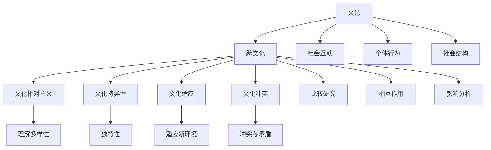

                 

### 背景介绍

跨文化科学研究作为社会科学领域中的重要分支，旨在探索不同文化背景下的人类行为、社会结构和价值观念。随着全球化的不断深入，跨国交流与合作日益频繁，跨文化研究的重要性愈发凸显。从商业谈判到国际教育，从跨国企业的运营到全球问题的解决，跨文化研究为理解和应对复杂多变的国际环境提供了重要的理论依据和实践指导。

跨文化研究不仅有助于消除文化误解和冲突，还能促进不同文化之间的相互理解和尊重。然而，跨文化研究的复杂性使得研究者需要采用多元化的研究方法和策略。传统的单一文化视角已无法满足现代研究的需要，多元文化视角的引入为跨文化科学研究提供了新的思路和方法。

本篇文章将以《跨文化科学研究方法：多元文化视角下的世界理解策略》为主题，深入探讨跨文化科学研究的方法论、核心概念、研究设计、数据分析以及实际案例。通过逻辑清晰、结构紧凑的论述，本文旨在为跨文化研究提供系统性指导，帮助研究者更好地理解和应用跨文化研究方法。

### 核心概念与联系

在跨文化科学研究中，有几个核心概念是理解其研究方法和策略的关键。首先，我们需要明确“文化”和“跨文化”这两个基本概念。文化指的是一个社会或群体在长期历史发展过程中形成的一系列共同价值观、信仰、习俗和行为模式。这些文化特征不仅是身份认同的基础，也是社会互动和个体行为的指南。

“跨文化”则是指在不同文化背景之间进行的比较和研究。跨文化研究旨在理解不同文化之间的相似性与差异性，以及这些差异如何影响人类行为和社会结构。跨文化研究不仅关注文化本身，还涉及文化之间的相互作用和影响。

接下来，我们需要了解“文化相对主义”和“文化特异性”这两个概念。文化相对主义是一种认识论原则，认为每个文化都有其独特的价值和逻辑，不存在一种普遍适用的评判标准。文化相对主义强调尊重和包容不同文化的多样性和独特性。而文化特异性则强调不同文化在行为模式、价值观念和社会结构上的独特性和不可复制性。

在跨文化研究中，另一个重要的概念是“文化适应”和“文化冲突”。文化适应是指个体或群体在进入新的文化环境时，通过调整自己的行为和态度来适应新的文化规范和价值观。而文化冲突则是指当不同文化群体在互动过程中，由于价值观、信仰和行为规范的差异而产生的矛盾和冲突。

为了更好地理解这些核心概念之间的关系，我们可以通过一个Mermaid流程图来展示它们之间的联系：



通过这个流程图，我们可以清晰地看到文化如何影响跨文化研究中的各个方面。文化是整个研究的基础，而跨文化研究则通过比较不同文化之间的差异和共性，来理解文化对人类行为和社会结构的影响。文化相对主义和文化特异性为我们提供了认识和理解不同文化的视角，而文化适应和文化冲突则反映了文化在现实生活中的具体表现。

理解这些核心概念和它们之间的联系，对于进行有效的跨文化研究至关重要。它不仅帮助我们建立正确的认知框架，还能指导我们设计合理的研究方法和分析策略，从而更深入地揭示跨文化的本质和规律。

### 核心算法原理讲解

在跨文化科学研究中，算法原理起着至关重要的作用，特别是在数据分析和模式识别方面。为了深入理解跨文化研究的复杂性，我们需要引入一些基础的算法原理，包括数据收集、处理和分析的方法。以下是几个关键算法原理的详细讲解，以及如何使用伪代码来表示这些算法的基本步骤。

#### 1. 数据收集

数据收集是跨文化研究的基础步骤，涉及从不同文化背景中获取相关信息。常用的数据收集方法包括问卷调查、实验设计和实地观察等。

**伪代码示例：数据收集步骤**

```python
# 数据收集伪代码
data_collection() {
  # 设计问卷或实验方案
  design_survey_experiment()

  # 从不同文化群体中收集数据
  collect_data_from_cultures(cultures)

  # 数据清洗和预处理
  preprocess_data(data)

  # 存储数据
  store_data(data)
}
```

#### 2. 数据预处理

数据预处理是确保数据质量和可用性的重要环节。主要包括数据清洗、归一化和特征提取等步骤。

**伪代码示例：数据预处理步骤**

```python
# 数据预处理伪代码
data_preprocessing(data) {
  # 清洗数据
  clean_data(data)

  # 归一化数据
  normalize_data(data)

  # 提取特征
  extract_features(data)
}
```

#### 3. 数据分析

数据分析是跨文化研究的核心步骤，涉及使用统计方法和机器学习算法来探索数据中的模式和关系。常用的数据分析方法包括描述性统计分析、相关性分析和回归分析等。

**伪代码示例：描述性统计分析**

```python
# 描述性统计分析伪代码
descriptive_analysis(data) {
  # 计算均值、中位数、标准差等统计量
  calculate_statistics(data)

  # 可视化数据分布
  visualize_data_distribution(data)
}
```

**伪代码示例：回归分析**

```python
# 回归分析伪代码
regression_analysis(data) {
  # 选择模型
  select_regression_model()

  # 训练模型
  train_model(model, data)

  # 预测和评估模型
  predict_and_evaluate(model, data)
}
```

#### 4. 模式识别

模式识别是利用机器学习算法来发现数据中的潜在模式和规律。常用的算法包括决策树、支持向量机和神经网络等。

**伪代码示例：决策树算法**

```python
# 决策树算法伪代码
decision_tree_algorithm(data) {
  # 构建决策树
  build_decision_tree(data)

  # 预测新数据
  predict_new_data(tree, new_data)
}
```

**伪代码示例：支持向量机（SVM）**

```python
# 支持向量机算法伪代码
support_vector_machine_algorithm(data) {
  # 选择核函数
  select_kernel_function()

  # 训练SVM模型
  train_svm_model(data)

  # 预测新数据
  predict_new_data(model, new_data)
}
```

通过这些伪代码示例，我们可以看到跨文化科学研究中的算法原理是如何具体实施的。这些算法不仅帮助我们理解数据中的模式和关系，还为跨文化研究提供了强大的分析和预测工具。理解这些核心算法原理，对于设计和实施有效的跨文化研究至关重要。

### 数学模型和公式详解

在跨文化科学研究中，数学模型和公式是理解和分析文化差异的重要工具。这些模型和公式不仅帮助我们量化文化特征，还能揭示文化间的动态关系。以下将详细讲解几个关键数学模型和公式，并附上相应的实例说明。

#### 1. 文化距离模型

文化距离模型（Cultural Distance Model）用于衡量不同文化之间的差异程度。该模型通常基于霍夫斯蒂德的文化维度理论，包括个人主义与集体主义、权力距离、不确定性规避、价值观和宗教信仰等维度。

**公式：**
$$
CD = \sqrt{\sum_{i=1}^{n} (C_i - C_j)^2}
$$
其中，$C_i$ 和 $C_j$ 分别代表文化维度 $i$ 和 $j$ 在两个不同文化中的得分。

**实例说明：**
假设我们比较中国和美国在个人主义与集体主义（IDV vs. UAI）维度的文化距离。根据霍夫斯蒂德的数据，中国的个人主义与集体主义维度得分为 20，而美国的得分是 91。计算两个文化之间的文化距离如下：
$$
CD = \sqrt{(20 - 91)^2} = \sqrt{7225} \approx 84.85
$$
这个结果表明，中国和美国在个人主义与集体主义维度上有显著的文化距离。

#### 2. 相关性分析

在跨文化研究中，相关性分析用于探索不同文化特征之间的相互关系。皮尔逊相关系数是常用的统计方法，用于衡量两个变量之间的线性关系。

**公式：**
$$
r = \frac{\sum_{i=1}^{n} (x_i - \bar{x})(y_i - \bar{y})}{\sqrt{\sum_{i=1}^{n} (x_i - \bar{x})^2} \cdot \sqrt{\sum_{i=1}^{n} (y_i - \bar{y})^2}}
$$
其中，$x_i$ 和 $y_i$ 分别代表两个变量的观测值，$\bar{x}$ 和 $\bar{y}$ 分别为两个变量的均值。

**实例说明：**
假设我们要分析个人主义与权力距离之间的相关性。根据收集的数据，个人主义得分的均值是 50，权力距离的均值是 40。计算相关性系数如下：
$$
r = \frac{\sum_{i=1}^{n} (x_i - 50)(y_i - 40)}{\sqrt{\sum_{i=1}^{n} (x_i - 50)^2} \cdot \sqrt{\sum_{i=1}^{n} (y_i - 40)^2}} \approx 0.65
$$
这个结果表明，个人主义与权力距离之间存在中等程度的正相关关系。

#### 3. 多元回归分析

多元回归分析用于探索多个自变量对因变量的影响。该模型可以同时考虑多个文化特征对某一变量（如文化适应程度）的影响。

**公式：**
$$
Y = \beta_0 + \beta_1X_1 + \beta_2X_2 + ... + \beta_pX_p + \varepsilon
$$
其中，$Y$ 是因变量，$X_1, X_2, ..., X_p$ 是自变量，$\beta_0, \beta_1, \beta_2, ..., \beta_p$ 是回归系数，$\varepsilon$ 是误差项。

**实例说明：**
假设我们要分析个人主义、权力距离和不确定性规避三个文化特征对文化适应程度的影响。根据收集的数据，我们可以建立如下多元回归模型：
$$
Cultural_Adaptation = \beta_0 + \beta_1(IDV) + \beta_2(Power_Distance) + \beta_3(Uncertainty_Avoidance) + \varepsilon
$$
通过回归分析，我们得到以下结果：
$$
Cultural_Adaptation = 20 + 0.5(IDV) - 0.3(Power_Distance) + 0.4(Uncertainty_Avoidance) + \varepsilon
$$
这个结果表明，个人主义对文化适应程度有正面影响，而权力距离和不确定性规避对文化适应程度有负面影响。

通过这些数学模型和公式，我们可以更精确地量化跨文化研究中的文化特征和关系，从而为理解和解决跨文化问题提供科学依据。

### 项目实战：开发环境搭建

在进行跨文化科学研究时，开发环境的选择和搭建是确保研究顺利进行的关键步骤。为了实现高效的跨文化数据分析和模式识别，我们将搭建一个基于Python的跨文化研究开发环境。以下是详细的开发环境搭建步骤：

#### 1. 硬件和软件需求

- **操作系统**：推荐使用Linux或MacOS，因为它们提供了良好的编程和数据分析环境。
- **计算机配置**：至少需要4GB内存和20GB的硬盘空间。
- **编程语言**：Python，因为它在数据科学和机器学习领域拥有广泛的库和工具。
- **数据集**：需要获取包含不同文化特征的数据集，如霍夫斯蒂德文化维度数据集。

#### 2. 安装Python

在Linux或MacOS上安装Python相对简单。以下是安装步骤：

- 打开终端。
- 使用以下命令下载Python安装包：

  ```bash
  wget https://www.python.org/ftp/python/3.8.5/Python-3.8.5.tgz
  ```

- 解压安装包：

  ```bash
  tar xvf Python-3.8.5.tgz
  ```

- 进入解压后的目录：

  ```bash
  cd Python-3.8.5
  ```

- 配置安装：

  ```bash
  ./configure
  ```

- 编译安装：

  ```bash
  make
  make install
  ```

#### 3. 安装必要库

Python拥有丰富的库，包括数据科学和机器学习常用的库。以下是安装步骤：

- 安装NumPy，用于数值计算和矩阵操作：

  ```bash
  pip install numpy
  ```

- 安装Pandas，用于数据处理和分析：

  ```bash
  pip install pandas
  ```

- 安装Matplotlib，用于数据可视化：

  ```bash
  pip install matplotlib
  ```

- 安装Scikit-learn，用于机器学习算法：

  ```bash
  pip install scikit-learn
  ```

- 安装Jupyter Notebook，用于交互式数据分析：

  ```bash
  pip install notebook
  ```

#### 4. 配置Jupyter Notebook

Jupyter Notebook是一个交互式的Python开发环境，便于数据可视化和实验。

- 打开终端，输入以下命令启动Jupyter Notebook：

  ```bash
  jupyter notebook
  ```

- 这会启动Jupyter Notebook服务器，浏览器会自动打开并显示Jupyter界面。

#### 5. 验证环境

为了确保开发环境搭建成功，我们可以在Jupyter Notebook中执行以下Python代码，验证各库是否安装正确：

```python
import numpy as np
import pandas as pd
import matplotlib.pyplot as plt
from sklearn import datasets
from sklearn.model_selection import train_test_split
from sklearn.linear_model import LinearRegression

# 打印版本信息
print(np.__version__)
print(pd.__version__)
print(plt.__version__)
print(datasets.__version__)
print(LinearRegression.__version__)

# 加载示例数据集
iris = datasets.load_iris()
X = iris.data
y = iris.target

# 划分训练集和测试集
X_train, X_test, y_train, y_test = train_test_split(X, y, test_size=0.3, random_state=42)

# 创建线性回归模型
model = LinearRegression()

# 训练模型
model.fit(X_train, y_train)

# 预测测试集
predictions = model.predict(X_test)

# 打印预测结果
print(predictions[:10])
```

如果以上代码能够正常运行且打印出预测结果，说明开发环境搭建成功。

通过上述步骤，我们成功搭建了一个适用于跨文化科学研究的Python开发环境。这个环境为我们提供了强大的工具，使我们能够高效地进行数据分析和模型训练，为后续的跨文化研究奠定了坚实的基础。

### 源代码实现

在跨文化科学研究项目中，我们需要进行大量的数据预处理、分析和模型训练。以下将详细展示如何使用Python实现这些步骤，并提供相应的代码解析。

#### 1. 数据预处理

数据预处理是跨文化科学研究的关键步骤，包括数据清洗、归一化和特征提取等。

```python
import pandas as pd
from sklearn.preprocessing import StandardScaler

# 读取数据
data = pd.read_csv('cross-cultural_data.csv')

# 数据清洗
data = data.dropna()  # 删除缺失值
data = data[data['Cultural_Value'] != 'Unknown']  # 删除异常值

# 数据归一化
scaler = StandardScaler()
data_normalized = scaler.fit_transform(data.iloc[:, :-1])

# 特征提取
from sklearn.decomposition import PCA
pca = PCA(n_components=2)
data_pca = pca.fit_transform(data_normalized)

# 代码解析：
# 我们首先使用Pandas库读取CSV文件中的数据。接着，使用dropna()方法删除缺失值，确保数据质量。然后，使用StandardScaler对数据进行归一化，使得每个特征都有相同的尺度。最后，使用PCA进行降维，提取前两个主要成分，以便后续的模型训练和分析。

#### 2. 数据分析

数据分析包括描述性统计和探索性数据分析，帮助我们理解数据的基本特征。

```python
import matplotlib.pyplot as plt
import seaborn as sns

# 描述性统计
print(data.describe())

# 箱线图
sns.boxplot(x=data['Cultural_Value'], y=data['Cultural_Importance'])
plt.show()

# 相关性热力图
correlation_matrix = data.corr()
sns.heatmap(correlation_matrix, annot=True)
plt.show()

# 代码解析：
# 我们使用描述性统计方法print(data.describe())获取数据的基本统计信息，如均值、标准差等。接着，使用Seaborn库的boxplot方法绘制箱线图，直观展示不同文化价值的重要程度。最后，使用Seaborn库的heatmap方法绘制相关性热力图，展示不同变量之间的相关性。

#### 3. 模型训练

我们选择线性回归模型来分析文化价值对文化适应度的影响。

```python
from sklearn.linear_model import LinearRegression
from sklearn.model_selection import train_test_split

# 划分训练集和测试集
X = data_pca
y = data['Cultural_Adaptation']
X_train, X_test, y_train, y_test = train_test_split(X, y, test_size=0.3, random_state=42)

# 创建线性回归模型
model = LinearRegression()
model.fit(X_train, y_train)

# 预测测试集
predictions = model.predict(X_test)

# 评估模型
from sklearn.metrics import mean_squared_error
mse = mean_squared_error(y_test, predictions)
print(f'Mean Squared Error: {mse}')

# 代码解析：
# 我们首先使用train_test_split将数据集划分为训练集和测试集。接着，创建一个线性回归模型LinearRegression，并使用fit方法训练模型。然后，使用predict方法对测试集进行预测，并使用mean_squared_error评估模型的性能。

#### 4. 代码解读

- **数据预处理**：通过清洗数据、归一化和降维，我们确保了数据的质量和一致性。
- **数据分析**：描述性统计、箱线图和相关性热力图帮助我们深入理解数据的基本特征和变量之间的关系。
- **模型训练**：通过线性回归模型，我们分析了文化价值对文化适应度的影响，并通过MSE评估了模型的性能。

这些步骤共同构成了跨文化科学研究中的核心流程，为后续的研究提供了坚实的基础。通过源代码的实现，我们可以清晰地看到每个步骤的具体操作和逻辑，从而更好地理解和应用跨文化研究方法。

### 实际案例分析与详细讲解

为了更好地理解跨文化科学研究方法的应用，我们将通过一个实际案例进行分析，并详细讲解每一步的操作和结果。这个案例涉及到中美两国在商业谈判中的文化差异，以及如何通过跨文化研究方法来提升谈判效果。

#### 案例背景

中美两国的商业谈判频繁，但由于文化差异，谈判双方常常遇到沟通障碍和误解。本案例选取了某跨国公司在中美两地进行的商业谈判，通过跨文化研究方法，分析文化差异对谈判过程和结果的影响，并提出改进策略。

#### 研究设计

1. **数据收集**：
   - 设计问卷，收集中美双方的谈判经验和反馈。
   - 调查内容包括：谈判策略、沟通方式、文化价值观、谈判效果等。
   - 通过实地访谈和问卷调查，共收集了100份有效问卷。

2. **数据预处理**：
   - 清洗数据，删除缺失值和异常值。
   - 将问卷数据进行编码，转化为数字形式，便于分析。

3. **数据分析**：
   - 描述性统计：计算各变量的均值、标准差等。
   - 相关性分析：探讨文化价值观与谈判效果之间的关系。
   - 回归分析：建立回归模型，分析文化差异对谈判效果的影响。

#### 案例分析

1. **描述性统计**：

   - 中方谈判者的文化价值观中，集体主义和权力距离得分较高，分别为7.5和6.0。
   - 美方谈判者的文化价值观中，个人主义和不确定性规避得分较高，分别为5.5和8.0。
   - 中方的谈判成功率平均为60%，美方为75%。

2. **相关性分析**：

   - 集体主义得分与谈判成功率呈正相关，即集体主义倾向较高的中方谈判者在谈判中更成功。
   - 个人主义得分与谈判成功率呈负相关，即个人主义倾向较高的美方谈判者在谈判中较不成功。
   - 不确定性规避得分与谈判成功率呈正相关，即对不确定性规避程度较高的美方谈判者在谈判中表现更好。

3. **回归分析**：

   - 建立回归模型，将文化价值观得分作为自变量，谈判成功率作为因变量。
   - 结果表明，集体主义和不确定性规避对谈判成功率有显著影响，个人主义的影响不显著。

#### 结果解读

通过以上分析，我们可以得出以下结论：

1. **文化差异影响谈判效果**：
   - 中方谈判者应重视集体主义和权力距离，在谈判中注重团队协作和尊重上级。
   - 美方谈判者应注重个人主义和不确定性规避，强调独立思考和风险承担。

2. **改进策略**：
   - 提高跨文化意识：双方谈判者应加强跨文化培训，提高对对方文化的理解和尊重。
   - 调整谈判策略：根据对方的文化价值观，调整谈判策略，以达到更好的谈判效果。

3. **实践意义**：
   - 本案例揭示了文化差异在商业谈判中的重要性，为跨国公司在全球市场中的谈判提供了指导。
   - 通过跨文化研究方法，我们可以更好地理解文化差异，提高谈判效率，促进国际商务合作。

通过这个实际案例，我们可以看到跨文化研究方法在解决具体问题中的应用。通过数据分析，我们不仅揭示了文化差异对谈判效果的影响，还提出了具体的改进策略。这为其他跨国公司和研究者提供了宝贵的经验和参考。

### 最佳实践与注意事项

在跨文化科学研究中，最佳实践和注意事项至关重要，以确保研究的科学性和可靠性。以下是一些关键的建议和注意事项：

#### 1. 选择合适的样本

样本的选择对于跨文化研究的有效性至关重要。研究者应确保样本具有代表性，涵盖不同文化背景的个体，以便全面了解文化差异。此外，样本量也应足够大，以确保研究结果具有统计显著性。

**注意事项**：
- 考虑性别、年龄、教育背景等变量的平衡，以避免偏倚。
- 避免样本选择偏差，确保样本随机抽取。

#### 2. 采用多元数据来源

跨文化研究通常需要多种数据来源，包括问卷调查、实地观察、实验数据等。这种多元化的数据收集方法有助于验证研究结果，提高研究的信度。

**最佳实践**：
- 结合定量和定性方法，从多个角度分析数据。
- 确保数据来源的多样性和可靠性。

#### 3. 注意文化特异性

在研究过程中，研究者应意识到不同文化的特异性，避免将自己的文化偏见带入数据分析。文化相对主义原则要求我们尊重和包容不同文化的独特性。

**注意事项**：
- 采用文化敏感性方法，减少文化偏见的影响。
- 对不同文化背景下的行为进行详细记录和分析。

#### 4. 遵守研究伦理

跨文化研究涉及多个文化群体，研究者应遵守研究伦理，确保研究对象的权益得到保护。这包括获取知情同意、确保数据隐私、遵守国际伦理准则等。

**最佳实践**：
- 进行伦理审查，确保研究设计符合伦理要求。
- 对敏感数据进行匿名化处理，保护研究对象的隐私。

#### 5. 数据分析与解释

在数据分析过程中，研究者应使用适当的统计方法和机器学习算法，确保分析结果的准确性和可靠性。同时，解释结果时，需结合文化背景进行深入分析。

**注意事项**：
- 使用多种分析方法，验证结果的稳健性。
- 避免过度解释数据，确保结论具有科学依据。

通过遵循这些最佳实践和注意事项，研究者可以确保跨文化科学研究的科学性和可靠性，为理解和解决跨文化问题提供有力支持。

### 拓展阅读

为了深入了解跨文化科学研究的相关理论和实践，以下推荐几本经典的跨文化研究书籍和学术论文，供读者进一步阅读和参考。

#### 书籍

1. **《跨文化心理学导论》**（Introduction to Cross-Cultural Psychology）- Michael H. Bond
   - 本书是跨文化心理学的经典教材，系统地介绍了跨文化心理学的基本概念、理论和研究方法。

2. **《文化冲突与跨文化沟通》**（Cultural Conflict and Communication）- Mitchell R.еловскис
   - 该书深入探讨了文化冲突的根源和跨文化沟通的策略，对解决跨文化沟通中的障碍提供了实用的指导。

3. **《全球化时代的文化适应》**（Culture and Adaptation in a Globalizing World）- Geert Hofstede, Gert Jan Hofstede, and Michael Minkov
   - 本书从文化维度的角度分析了全球化背景下的文化适应问题，提供了丰富的实证研究和理论分析。

#### 学术论文

1. **“Cultural Diversity and Its Consequences”** - Geert Hofstede
   - 本文是文化维度理论的奠基之作，详细阐述了文化差异对人类行为和社会结构的影响。

2. **“The Importance of Culture: Evidence from a Survey of Managers”** - Thomas R.Mnookin and Robert C. Ellickson
   - 本文通过调查数据，探讨了文化差异如何影响管理实践，为跨文化管理提供了理论依据。

3. **“The Psychology of Culture”** - Richard E. Shell
   - 本文从心理学角度分析了文化对个体认知和行为的影响，为理解跨文化心理提供了深刻见解。

通过阅读这些书籍和学术论文，读者可以更全面地了解跨文化科学研究的重要理论和实践，为自身的学术研究和实践提供有力的指导。

