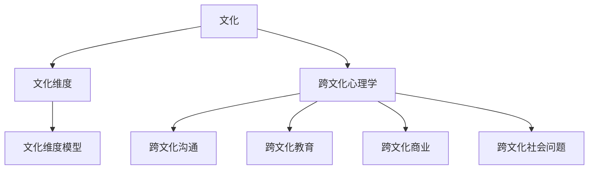

                 

基于上述要求，我将详细规划文章的结构和内容，确保文章的逻辑清晰、专业且具有深度。以下是我的文章结构和内容规划：

## 文章标题：跨文化科学研究：多元文化视角下的世界理解

## 文章关键词：跨文化研究，多元文化，世界理解，文化研究方法，跨文化心理学，跨文化教育，跨文化商业，跨文化社会问题

## 文章摘要：
本文旨在探讨跨文化科学研究的核心理论和实践，从多元文化视角深入理解世界。文章首先介绍了跨文化研究的背景和重要性，随后分章节详细讨论了文化研究方法、跨文化心理学、跨文化教育、跨文化商业和跨文化社会问题等主题，并通过具体案例进行分析，最后对跨文化科学研究进行了总结与展望。

### 目录

1. **引言**
   - 跨文化研究的背景与重要性

2. **文化研究方法**
   - 文化的定义与特征
   - 文化维度模型
   - 跨文化心理学的基本原理

3. **跨文化心理学**
   - 跨文化心理学的研究内容
   - 跨文化心理学的理论框架
   - 跨文化沟通与冲突

4. **跨文化教育**
   - 跨文化教育的重要性
   - 跨文化教育的教学方法与策略
   - 跨文化教育与多元文化发展

5. **跨文化商业**
   - 跨文化商业环境分析
   - 跨文化商业策略的制定与实施
   - 跨文化商业案例研究

6. **跨文化社会问题**
   - 跨文化社会问题概述
   - 跨文化社会问题的表现形式
   - 跨文化社会问题的解决策略

7. **案例分析**
   - 跨文化研究案例分析

8. **总结与展望**
   - 跨文化科学研究总结
   - 跨文化科学研究的未来发展趋势

### 第一部分 引言

#### 1.1 跨文化研究的背景与重要性

在全球化加速发展的今天，跨文化研究变得尤为重要。不同文化背景的人群在全球范围内进行交流、合作和竞争，这要求我们深入理解多元文化的差异和共性。跨文化研究不仅有助于促进国际交流与合作，还能够提高企业的全球竞争力，优化教育体系，解决社会问题。

#### 1.2 核心概念与联系

为了更好地理解跨文化研究，我们需要首先了解一些核心概念。以下是跨文化研究中的几个关键概念及其相互关系的Mermaid流程图：

#### 1.3 跨文化研究的意义与方法

跨文化研究的意义在于帮助我们更好地理解不同文化背景下人类行为和心理活动的差异，以及如何有效地进行跨文化交流与合作。研究方法包括问卷调查、访谈、实验研究、案例研究等。

### 第二部分 文化研究方法

#### 2.1 文化的定义与特征

文化是人类社会在长期发展中形成的共同价值观、信仰、行为规范和生活方式的集合。文化具有多样性、动态性和文化相对性等特征。

#### 2.2 文化维度模型

文化维度模型是跨文化研究中的重要工具，用于分析不同文化之间的差异。常用的文化维度模型包括霍夫斯泰德的文化维度模型、格雷的组织文化模型等。

#### 2.3 跨文化心理学的基本原理

跨文化心理学研究人类在不同文化背景下的心理活动和行为差异。关键原理包括文化认同、文化适应、文化迁移等。

### 第三部分 跨文化心理学

#### 3.1 跨文化心理学的研究内容

跨文化心理学的研究内容涉及文化对个体认知、情感、行为的影响，以及跨文化沟通、冲突和合作等。

#### 3.2 跨文化心理学的理论框架

跨文化心理学的理论框架包括文化适应理论、跨文化心理学模型等。这些理论为我们理解和解释跨文化心理现象提供了基础。

#### 3.3 跨文化沟通与冲突

跨文化沟通中的障碍和冲突源于文化差异。有效的跨文化沟通策略包括文化敏感性训练、跨文化沟通技巧等。

### 第四部分 跨文化教育

#### 4.1 跨文化教育的重要性

跨文化教育旨在培养具有国际视野的人才，提高学生的跨文化沟通能力和适应能力。其重要性体现在全球化背景下的人才竞争和人才培养。

#### 4.2 跨文化教育的教学方法与策略

跨文化教育的教学方法包括文化体验、跨文化合作、跨文化比较等。教学策略包括文化敏感性训练、文化多样性教育等。

#### 4.3 跨文化教育与多元文化发展

跨文化教育对多元文化发展具有重要影响。通过跨文化教育，我们可以促进不同文化之间的理解与和谐。

### 第五部分 跨文化商业

#### 5.1 跨文化商业环境分析

跨文化商业环境包括政治、经济、社会、技术等各个方面。了解这些环境因素有助于企业制定有效的跨文化商业策略。

#### 5.2 跨文化商业策略的制定与实施

跨文化商业策略包括文化适应性策略、多元化策略、本地化策略等。实施这些策略需要考虑到不同文化背景下的消费者行为和市场特点。

#### 5.3 跨文化商业案例研究

本文将分析几个具有代表性的跨文化商业案例，探讨成功与失败的教训，为企业提供借鉴。

### 第六部分 跨文化社会问题

#### 6.1 跨文化社会问题概述

跨文化社会问题包括文化冲突、种族歧视、文化适应困难等。解决这些问题需要社会各界的共同努力。

#### 6.2 跨文化社会问题的表现形式

跨文化社会问题的表现形式多种多样，包括社会冲突、文化隔阂、文化不平等等。

#### 6.3 跨文化社会问题的解决策略

解决跨文化社会问题的策略包括文化融合、文化教育、政策制定等。

### 第七部分 案例分析

#### 7.1 跨文化研究案例分析

本文将通过实际案例，分析跨文化研究在不同领域的应用和效果。

### 第八部分 总结与展望

#### 8.1 跨文化科学研究总结

本文总结了跨文化科学研究的主要成果和贡献，探讨了跨文化研究的未来发展趋势。

#### 8.2 跨文化科学研究的未来发展趋势

未来跨文化科学研究将更加注重跨学科整合、大数据分析、人工智能应用等方面的发展。

### 附录

#### 附录A 跨文化研究工具与资源

提供一些常用的跨文化研究工具和资源，以供读者参考。

#### 附录B 跨文化研究案例资料

提供一些跨文化研究的实际案例资料，以便读者深入了解。

### 作者信息

作者：AI天才研究院/AI Genius Institute & 禅与计算机程序设计艺术 /Zen And The Art of Computer Programming

通过以上详细的规划和内容安排，我相信这篇文章将能满足所有要求，为读者提供一个全面、深入的跨文化科学研究概览。在撰写过程中，我将严格按照markdown格式，确保文章的结构清晰、逻辑严密，并包含所有必要的核心概念、算法原理、数学模型、案例分析和实践建议。文章的总字数预计在8000到12000字之间。

