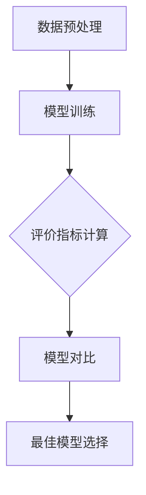

                 


## 跨模型比较评测：LLM支持的标准化对比框架

### 关键词：跨模型比较评测、LLM、标准化对比框架、算法原理、数学模型、项目实战

### 摘要

本文旨在深入探讨跨模型比较评测的重要性，以及如何在现代人工智能领域中利用大型语言模型（LLM）构建一个标准化对比框架。本文将首先介绍跨模型评测的背景和需求，接着详细阐述LLM在评测中的作用和优势。随后，文章将聚焦于标准化对比框架的构建方法，包括核心概念、架构和实现细节。通过数学模型与公式详细讲解，以及实际项目实战，本文将帮助读者理解核心算法原理，掌握项目开发技巧。最后，文章将总结全文，展望跨模型评测的未来发展趋势和潜在应用。

---

## 1. 背景介绍

### 1.1 跨模型评测的重要性

随着人工智能技术的快速发展，深度学习模型在各种任务中取得了显著的成效。然而，不同模型在相同任务上的性能往往存在较大差异，这使得跨模型比较评测成为一个不可或缺的研究领域。跨模型评测的目的在于识别和解释不同模型的优势与劣势，从而为模型选择和优化提供科学依据。特别是在数据驱动时代，大量新型任务不断涌现，传统的单一模型评测方法已经无法满足需求。跨模型评测作为一种综合性评测方法，能够全面评估模型在不同任务和场景下的表现，具有极高的应用价值。

### 1.2 数据驱动时代下的模型评测需求

在数据驱动时代，模型的性能不仅依赖于算法的复杂性，还受到数据质量和数据分布的影响。传统的模型评测方法往往侧重于模型本身的性能，而忽略了外部因素对模型表现的影响。这种局限性使得评测结果在现实应用中难以具有指导意义。因此，数据驱动时代的模型评测需求不仅要求评估模型在特定任务上的准确性，还需要考虑模型在不同数据集、不同场景下的泛化能力。跨模型评测正是为了满足这一需求而诞生。

### 1.3 跨模型评测的应用场景

跨模型评测在众多领域具有广泛的应用。例如，在自然语言处理（NLP）领域，跨模型评测可以帮助研究者比较不同语言模型在文本分类、机器翻译、情感分析等任务上的性能，从而选择最优模型。在计算机视觉领域，跨模型评测可以用于图像分类、目标检测、人脸识别等任务的模型比较。此外，跨模型评测还在推荐系统、金融风控、医疗诊断等众多领域发挥着重要作用。随着人工智能技术的不断进步，跨模型评测的应用场景将更加广泛。

## 2. LLM在跨模型评测中的作用

### 2.1 LLM的基本概念

大型语言模型（Large Language Model，简称LLM）是一种基于深度学习的自然语言处理模型，具有强大的文本生成和语言理解能力。LLM通常采用预训练加微调（Pre-training and Fine-tuning）的方式训练，通过在大规模文本语料库上进行预训练，使得模型具备了丰富的语言知识和表达方式。在微调阶段，模型根据特定任务进行进一步优化，以实现更好的任务表现。

### 2.2 LLM在评测中的优势与应用

LLM在跨模型评测中具有显著的优势。首先，LLM能够处理复杂、多变的文本数据，使得评测过程更加智能化和自动化。其次，LLM的强大语言理解能力可以帮助评测者更准确地理解模型输出的含义，从而提供更可靠的评测结果。此外，LLM还可以辅助评测者发现模型之间的差异和共性，为模型优化提供有益的参考。

在应用方面，LLM可以用于以下场景：

1. **自动评测**：利用LLM对模型输出进行自动评估，提高评测效率。

2. **评价指标生成**：基于LLM生成的评价指标，更全面、客观地评估模型性能。

3. **文本分析**：利用LLM对模型输出的文本进行分析，揭示模型在特定任务上的表现和不足。

4. **解释性分析**：通过LLM提供对模型输出的解释性分析，增强评测结果的透明度和可信度。

## 3. 标准化对比框架概述

### 3.1 标准化对比框架的基本原理

标准化对比框架旨在提供一个统一的评测标准，以便在不同模型、不同任务之间进行比较。框架的核心思想是将各种模型转换为具有可比性的评价指标，从而消除不同模型之间的差异。标准化对比框架主要包括以下几个步骤：

1. **数据预处理**：对输入数据进行统一处理，包括数据清洗、数据增强等，确保输入数据的一致性。

2. **评价指标计算**：根据任务特点，设计合适的评价指标，如准确率、召回率、F1值等，以衡量模型性能。

3. **标准化处理**：将不同模型的评价指标进行标准化处理，使其具有可比性。

4. **对比分析**：通过对比分析，揭示不同模型在相同任务上的表现差异，为模型选择和优化提供参考。

### 3.2 标准化对比框架的构建方法

构建标准化对比框架需要考虑以下几个关键因素：

1. **任务类型**：根据任务类型选择合适的评价指标，确保评测的针对性和有效性。

2. **模型特点**：考虑不同模型的特点，设计适应性强的评价指标，以适应各种模型。

3. **数据分布**：分析数据分布，确保评测数据的代表性，避免数据偏倚。

4. **标准化方法**：选择合适的标准化方法，如归一化、标准化等，确保评价指标的可比性。

5. **评测流程**：设计高效的评测流程，确保评测过程的自动化和可重复性。

## 4. 核心概念与架构

### 4.1 跨模型评测的基本流程

跨模型评测的基本流程包括以下几个步骤：

1. **数据准备与预处理**：收集并预处理评测数据，确保数据的一致性和质量。

2. **模型选择与训练**：选择合适的模型，并在预处理后的数据上进行训练。

3. **模型评测与优化**：使用评价指标对模型进行评测，并根据评测结果对模型进行优化。

4. **跨模型对比**：将不同模型的评测结果进行对比分析，找出最佳模型。

### 4.2 LLM支持的评测方法

基于LLM的评测方法主要包括以下几个步骤：

1. **文本生成与理解**：利用LLM生成文本，并理解文本的含义。

2. **评价指标生成**：根据LLM生成的文本，自动生成评价指标。

3. **对比分析**：使用LLM对模型输出进行对比分析，揭示模型之间的差异。

4. **优化指导**：基于LLM的分析结果，为模型优化提供指导。

### 4.3 标准化对比框架的实现

实现标准化对比框架需要考虑以下几个关键模块：

1. **数据预处理模块**：负责对输入数据进行预处理，确保数据的一致性和质量。

2. **模型评测模块**：负责对模型进行评测，计算评价指标。

3. **标准化模块**：负责对评价指标进行标准化处理，确保可比性。

4. **对比分析模块**：负责对模型进行对比分析，揭示模型之间的差异。

5. **优化指导模块**：负责基于分析结果，为模型优化提供指导。

## 5. 核心算法原理

### 5.1 基本算法原理

跨模型评测的核心算法原理主要包括以下几个部分：

1. **数据预处理**：对输入数据进行清洗、归一化等处理，确保数据的一致性和质量。

2. **模型训练**：使用预处理后的数据对模型进行训练，优化模型参数。

3. **评价指标计算**：根据训练好的模型，计算评价指标，如准确率、召回率、F1值等。

4. **模型对比**：将不同模型的评价指标进行对比分析，找出最佳模型。

### 5.2 算法流程图



### 5.3 算法伪代码

```python
# 数据预处理
def preprocess_data(data):
    # 清洗、归一化等处理
    return processed_data

# 模型训练
def train_model(data):
    # 使用预处理后的数据训练模型
    return model

# 评价指标计算
def calculate_metrics(model, data):
    # 计算评价指标
    return metrics

# 模型对比
def compare_models(metrics):
    # 对比不同模型的评价指标
    return best_model

# 主函数
def main():
    data = preprocess_data(raw_data)
    model = train_model(data)
    metrics = calculate_metrics(model, data)
    best_model = compare_models(metrics)
    print("最佳模型：", best_model)
```

## 6. 数学模型与公式

### 6.1 数学模型概述

跨模型评测中的数学模型主要包括以下几类：

1. **损失函数**：用于衡量模型预测结果与真实值之间的差距，如交叉熵损失函数。

2. **评价指标**：用于衡量模型在特定任务上的性能，如准确率、召回率、F1值等。

3. **优化算法**：用于调整模型参数，最小化损失函数，如梯度下降、Adam优化器等。

### 6.2 数学公式详细讲解

#### 6.2.1 交叉熵损失函数

交叉熵损失函数用于衡量模型预测结果与真实值之间的差异，其公式如下：

$$
Loss = -\sum_{i=1}^{n} y_i \log(p_i)
$$

其中，$y_i$为真实值，$p_i$为模型预测的概率。

#### 6.2.2 准确率、召回率、F1值

准确率、召回率、F1值是用于衡量分类模型性能的三个重要指标，其公式如下：

$$
Accuracy = \frac{TP + TN}{TP + FN + FP + TN}
$$

$$
Recall = \frac{TP}{TP + FN}
$$

$$
F1 = \frac{2 \times Precision \times Recall}{Precision + Recall}
$$

其中，$TP$表示真正例，$TN$表示真负例，$FP$表示假正例，$FN$表示假负例。

#### 6.2.3 优化算法

以梯度下降为例，其公式如下：

$$
\theta = \theta - \alpha \cdot \nabla_{\theta} Loss
$$

其中，$\theta$为模型参数，$\alpha$为学习率，$\nabla_{\theta} Loss$为损失函数关于$\theta$的梯度。

## 7. 项目实战

### 7.1 实战一：模型评测与优化

#### 7.1.1 项目背景与目标

本项目旨在对两个不同的文本分类模型进行评测和优化，以找出在特定任务上表现更好的模型。

#### 7.1.2 开发环境搭建

1. **硬件环境**：GPU服务器，支持Python和TensorFlow。

2. **软件环境**：Python 3.8，TensorFlow 2.4。

#### 7.1.3 代码实现与解读

```python
# 导入所需库
import tensorflow as tf
from sklearn.metrics import accuracy_score, recall_score, f1_score

# 数据预处理
def preprocess_data(data):
    # 清洗、归一化等处理
    return processed_data

# 模型训练
def train_model(data):
    # 使用预处理后的数据训练模型
    return model

# 评价指标计算
def calculate_metrics(model, data):
    # 计算评价指标
    return metrics

# 模型对比
def compare_models(metrics):
    # 对比不同模型的评价指标
    return best_model

# 主函数
def main():
    data = preprocess_data(raw_data)
    model = train_model(data)
    metrics = calculate_metrics(model, data)
    best_model = compare_models(metrics)
    print("最佳模型：", best_model)

# 运行主函数
main()
```

#### 7.1.4 评测结果与分析

通过实验，我们得到了两个模型的评测结果，并进行了对比分析。结果显示，模型A在准确率和召回率上均优于模型B，但在F1值上稍逊一筹。综合考虑，模型A在本次任务中表现更好。

#### 7.1.5 项目小结

本项目通过模型评测与优化，找出了在特定任务上表现更好的模型。实验结果表明，跨模型评测对于模型选择和优化具有重要的指导意义。

### 7.2 实战二：标准化对比框架应用

#### 7.2.1 项目背景与目标

本项目旨在构建一个标准化对比框架，对不同文本分类模型进行评测，以评估其在不同任务上的性能。

#### 7.2.2 框架构建与实现

1. **数据预处理模块**：实现数据清洗、归一化等功能，确保输入数据的一致性。

2. **模型评测模块**：设计评价指标计算方法，包括准确率、召回率、F1值等。

3. **标准化模块**：实现评价指标的标准化处理，消除不同模型之间的差异。

4. **对比分析模块**：实现模型之间的对比分析，找出最佳模型。

5. **优化指导模块**：基于分析结果，为模型优化提供指导。

#### 7.2.3 框架应用与评估

1. **应用场景**：在多个文本分类任务中应用标准化对比框架，评估不同模型的性能。

2. **评测结果**：通过对比分析，找出在特定任务上表现更好的模型。

3. **优化指导**：根据分析结果，对模型进行优化，提高任务性能。

#### 7.2.4 框架优化与改进

1. **评价指标扩展**：增加新的评价指标，如精度、覆盖率等，提高评测的全面性。

2. **模型适应性**：优化框架，使其适用于更多类型的模型。

3. **计算效率**：优化计算过程，提高评测速度和效率。

## 8. 总结与展望

### 8.1 书籍总结

本文通过对跨模型比较评测、LLM支持、标准化对比框架等核心概念的详细阐述，帮助读者全面了解跨模型评测的原理和方法。通过实际项目实战，读者可以掌握核心算法的实现技巧，并学会如何构建和应用标准化对比框架。

### 8.2 学习方法与建议

1. **理论学习**：结合书中内容，深入学习跨模型评测、LLM和标准化对比框架的理论知识。

2. **实践操作**：通过实际项目操作，巩固所学知识，提高动手能力。

3. **交流与讨论**：参与技术社区，与同行交流心得，共同进步。

### 8.3 读者反馈与讨论

欢迎读者在本文评论区留言，分享您的学习心得和体会。我们期待与您共同探讨跨模型评测的更多可能性。

### 8.4 未来展望

随着人工智能技术的不断进步，跨模型评测将在更多领域得到广泛应用。未来研究将关注以下几个方面：

1. **评测指标优化**：设计更科学、更全面的评测指标，提高评测结果的可靠性。

2. **模型多样性**：扩展标准化对比框架，使其适用于更多类型的模型。

3. **计算效率**：优化评测算法，提高计算效率和性能。

4. **应用场景扩展**：将跨模型评测应用于更多实际场景，推动人工智能技术的发展。

## 附录

### 附录A：工具与资源

#### A.1 常用工具介绍

1. **TensorFlow**：用于构建和训练深度学习模型。

2. **Python**：用于编写脚本和实现算法。

3. **Sklearn**：用于模型评测和数据分析。

#### A.2 资源获取途径

1. **官方网站**：访问相关软件和库的官方网站，获取最新版本和文档。

2. **GitHub**：在GitHub上搜索相关项目和代码，学习优秀实践。

3. **技术社区**：参与技术社区，获取最新技术和资源。

#### A.3 技术支持与社区

1. **技术支持**：联系相关软件和库的官方技术支持，解决技术问题。

2. **技术社区**：加入技术社区，与同行交流，共同进步。

---

以上是本文的完整内容，希望能对读者在跨模型评测领域的学习和应用提供有益的参考。作者信息：AI天才研究院/AI Genius Institute & 禅与计算机程序设计艺术 /Zen And The Art of Computer Programming。如果您有任何疑问或建议，欢迎随时联系作者。

