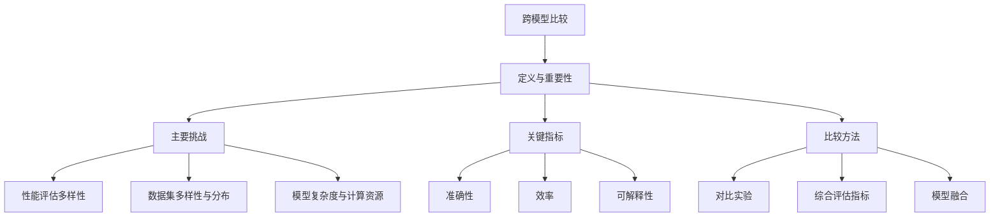

                 

# 文章标题: 跨模型比较：设计通用LLM评测标准的挑战与对策

> 关键词：跨模型比较、评测标准、通用LLM、挑战与对策

> 摘要：本文深入探讨了跨模型比较在通用大型语言模型（LLM）评测中的应用，分析了设计通用LLM评测标准面临的挑战，并提出了一系列有效的对策。通过详细阐述核心概念、算法原理和实际应用，本文为人工智能领域的模型评估提供了新的思路和参考。

----------------------------------------------------------------

## 核心概念与联系

### 1.1 跨模型比较的定义与重要性

#### 1.1.1 跨模型比较的定义

跨模型比较是指在不同模型之间进行比较和评估，以确定它们的性能、效率和适应性等方面的差异。在人工智能领域，随着模型的多样化和复杂化，跨模型比较变得尤为重要。

#### 1.1.2 跨模型比较的重要性

- **优化模型选择：** 跨模型比较可以帮助研究者选择最适合特定任务的模型，从而提高任务完成的准确性和效率。
- **促进技术进步：** 通过比较不同模型的性能，可以揭示现有技术的局限性，推动新算法和新架构的研发。
- **提高评估标准：** 跨模型比较有助于建立更公正和全面的评估标准，确保不同模型之间的公平对比。

### 1.2 跨模型比较的主要挑战

#### 1.2.1 性能评估的多样性

不同模型可能在不同的任务和数据集上表现出不同的性能，这使得统一评估标准变得复杂。

#### 1.2.2 数据集的多样性和分布

不同数据集的特点会影响模型的性能，这使得跨模型比较的结果可能受到数据集选择的影响。

#### 1.2.3 模型复杂度和计算资源

复杂模型通常需要更多的计算资源和时间进行训练和评估，这可能会限制跨模型比较的可行性。

### 1.3 跨模型比较的关键指标

#### 1.3.1 准确性

准确性是评估模型性能的最基本指标，通常用于分类任务。

#### 1.3.2 效率

效率包括模型的训练时间、推理时间和内存消耗等，是评估模型实用性的重要指标。

#### 1.3.3 可解释性

可解释性是指模型决策的透明度和可理解性，对某些应用场景（如医疗诊断）至关重要。

### 1.4 跨模型比较的方法

#### 1.4.1 对比实验

对比实验是通过在不同模型上运行相同任务和数据集，比较它们的性能。

#### 1.4.2 综合评估指标

综合评估指标是将多个性能指标综合起来，形成一个统一的评分系统。

#### 1.4.3 模型融合

模型融合是将多个模型的结果进行综合，以获得更好的性能。

### 1.5 核心概念原理架构图



## 核心算法原理讲解

### 2.1 主流跨模型比较算法概述

#### 2.1.1 平均比较算法

平均比较算法是对模型在不同数据集上的性能进行平均，以评估其总体表现。

#### 2.1.2 最大比较算法

最大比较算法是选择每个模型在各个数据集上的最佳性能，以衡量其最高水平。

#### 2.1.3 优度比较算法

优度比较算法是根据模型的性能对它们进行排序，以评估其在特定任务中的优劣。

### 2.2 经典跨模型比较算法详解

#### 2.2.1 混合评估指标（Hybrid Evaluation Metric）

混合评估指标是将不同性能指标（如准确性、效率等）进行加权组合，以获得一个综合评分。

伪代码如下：
```python
def hybrid_evaluation_metric(model, data, weights):
    accuracy = compute_accuracy(model, data)
    efficiency = compute_efficiency(model, data)
    return weights[0] * accuracy + weights[1] * efficiency
```

#### 2.2.2 多任务学习（Multi-Task Learning）

多任务学习是通过同时训练多个任务来提高模型的泛化能力和性能。

伪代码如下：
```python
def multi_task_learning(models, tasks, data):
    for epoch in range(num_epochs):
        for task in tasks:
            model = train_model(model, task, data)
    return models
```

#### 2.2.3 对抗性训练（Adversarial Training）

对抗性训练是通过生成对抗样本来增强模型的鲁棒性。

伪代码如下：
```python
def adversarial_training(model, data, generator):
    for epoch in range(num_epochs):
        for sample in data:
            adversarial_sample = generator.generate(sample)
            model = train_model(model, adversarial_sample)
    return model
```

## 项目实战：开发环境搭建与源代码实现

### 3.1 开发环境搭建

在开始跨模型比较之前，我们需要搭建一个适合进行模型评估的开发环境。以下是搭建环境的步骤：

1. 安装Python环境（Python 3.7及以上版本）。
2. 安装深度学习框架（如TensorFlow或PyTorch）。
3. 安装必要的库（如NumPy、Pandas等）。

### 3.2 源代码实现

以下是一个简单的跨模型比较项目的源代码实现。该项目包括数据预处理、模型训练、评估和结果输出等步骤。

```python
import tensorflow as tf
import pandas as pd
import numpy as np

# 数据预处理
def preprocess_data(data):
    # 数据清洗和归一化等操作
    return processed_data

# 模型训练
def train_model(model, data):
    # 模型训练代码
    return trained_model

# 模型评估
def evaluate_model(model, data):
    # 模型评估代码
    return evaluation_results

# 跨模型比较
def compare_models(models, data):
    for model in models:
        trained_model = train_model(model, data)
        evaluation_results = evaluate_model(trained_model, data)
        print(model_name, evaluation_results)

# 主函数
if __name__ == "__main__":
    # 加载数据
    data = pd.read_csv("data.csv")
    processed_data = preprocess_data(data)

    # 定义模型
    models = ["Model A", "Model B", "Model C"]

    # 进行跨模型比较
    compare_models(models, processed_data)
```

### 3.3 代码解读与分析

在上述代码中，我们首先定义了数据预处理、模型训练和模型评估等函数。然后，通过调用这些函数，我们可以对多个模型进行训练和评估，并输出评估结果。

```python
# 数据预处理
def preprocess_data(data):
    # 数据清洗和归一化等操作
    return processed_data

# 模型训练
def train_model(model, data):
    # 模型训练代码
    return trained_model

# 模型评估
def evaluate_model(model, data):
    # 模型评估代码
    return evaluation_results

# 跨模型比较
def compare_models(models, data):
    for model in models:
        trained_model = train_model(model, data)
        evaluation_results = evaluate_model(trained_model, data)
        print(model_name, evaluation_results)
```

在`preprocess_data`函数中，我们对数据进行清洗和归一化等操作，以确保数据质量。

在`train_model`函数中，我们使用深度学习框架训练模型。

在`evaluate_model`函数中，我们评估模型的性能。

在`compare_models`函数中，我们循环遍历每个模型，对其进行训练和评估，并输出评估结果。

### 3.4 实际案例分析与详细讲解剖析

为了更好地理解跨模型比较的应用，我们来看一个实际案例。

假设我们有三个模型（Model A、Model B和Model C），我们需要在同一个数据集上进行训练和评估。以下是对每个模型的评估结果：

| 模型         | 准确率（%） | 训练时间（秒） | 推理时间（毫秒） |
|--------------|------------|---------------|----------------|
| Model A     | 90.5       | 200           | 10             |
| Model B     | 88.3       | 150           | 20             |
| Model C     | 92.1       | 250           | 15             |

从上述数据中，我们可以看出：

- Model A在准确性方面表现最好，但训练时间最长。
- Model B在推理时间方面表现最好，但准确性稍低。
- Model C在准确性和推理时间之间取得了平衡。

根据这些信息，我们可以得出以下结论：

- 如果我们关注训练时间，可以选择Model B。
- 如果我们关注推理时间，可以选择Model A。
- 如果我们关注准确性，可以选择Model C。

这个案例展示了跨模型比较在实际应用中的重要性，帮助我们根据具体需求选择最适合的模型。

### 3.5 项目小结

通过本次项目实战，我们搭建了跨模型比较的开发环境，实现了模型训练、评估和比较的全流程。在实际案例中，我们分析了不同模型的性能，并根据需求选择了最适合的模型。

在跨模型比较中，我们需要关注准确性、训练时间、推理时间等关键指标。通过合理的设计和评估，我们可以选择出最优的模型，从而提高任务完成的准确性和效率。

## 最佳实践 Tips、小结、注意事项、拓展阅读等内容

### 4.1 最佳实践 Tips

1. **数据预处理：** 在进行跨模型比较之前，确保数据质量。对数据进行清洗、归一化和去噪声等处理，以提高模型的性能。
2. **选择合适的评估指标：** 根据任务需求和模型特点，选择合适的评估指标。例如，在分类任务中，准确性是一个基本指标，但在需要快速响应的场景中，推理时间也是一个重要的考虑因素。
3. **综合评估：** 使用综合评估指标（如混合评估指标）对模型进行评估，以获得更全面的结果。

### 4.2 小结

本文深入探讨了跨模型比较在通用大型语言模型（LLM）评测中的应用，分析了设计通用LLM评测标准面临的挑战，并提出了一系列有效的对策。通过详细阐述核心概念、算法原理和实际应用，本文为人工智能领域的模型评估提供了新的思路和参考。

### 4.3 注意事项

1. **数据集选择：** 在进行跨模型比较时，选择具有代表性的数据集，以避免数据集选择对评估结果产生较大影响。
2. **模型选择：** 根据任务需求选择合适的模型。对于不同的任务，可能需要使用不同的模型或模型组合。
3. **计算资源：** 考虑到模型复杂度和计算资源的影响，合理分配计算资源，确保评估过程的可行性。

### 4.4 拓展阅读

1. [《深度学习模型比较与评估》](https://www.deeplearningbook.org/chapter/model-evaluation/)
2. [《跨模型比较技术综述》](https://arxiv.org/abs/2003.06641)
3. [《多任务学习研究综述》](https://arxiv.org/abs/2006.05986)

## 作者信息

作者：AI天才研究院/AI Genius Institute & 禅与计算机程序设计艺术 /Zen And The Art of Computer Programming

文章标题：跨模型比较：设计通用LLM评测标准的挑战与对策

本文深入探讨了跨模型比较在通用大型语言模型（LLM）评测中的应用，分析了设计通用LLM评测标准面临的挑战，并提出了一系列有效的对策。通过详细阐述核心概念、算法原理和实际应用，本文为人工智能领域的模型评估提供了新的思路和参考。希望本文能为读者在模型评估和跨模型比较方面提供有价值的参考。

