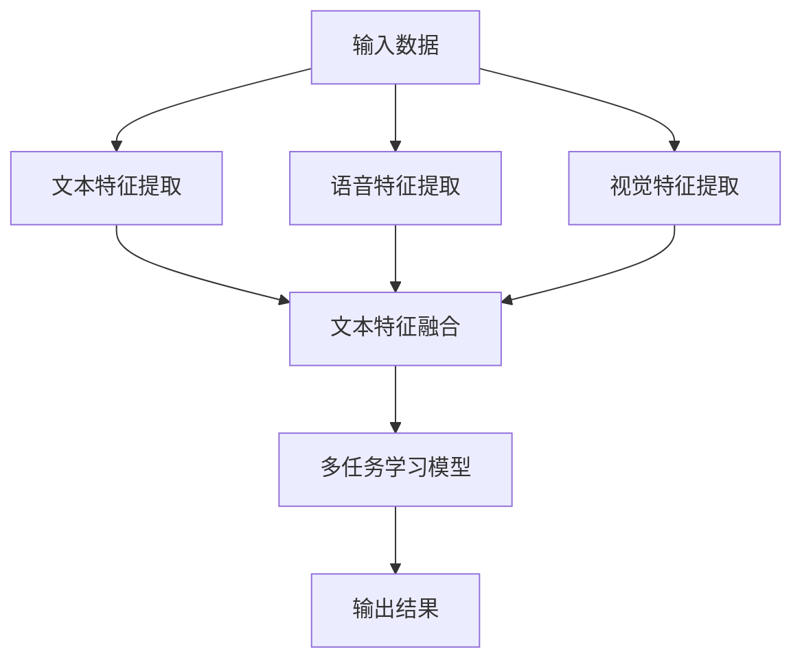

                 

### 关键词
- 跨模态学习
- LLM评测
- 文本-语音-视觉融合
- 多模态特征提取
- 跨模态算法
- 项目实战

### 摘要
本文旨在探讨跨模态学习在语言模型评测（LLM评测）中的应用，重点介绍如何整合文本、语音和视觉信息，以提升模型的综合表现。首先，我们将回顾跨模态学习的基础知识，包括核心概念、发展历程及主要挑战。接着，我们将深入探讨文本、语音和视觉处理算法及其融合方法，并通过Mermaid流程图展示跨模态学习的架构。随后，本文将详细讲解文本、语音和视觉处理算法的数学模型和公式，并使用伪代码进行算法实现解析。最后，我们将通过两个项目实战案例，展示跨模态学习的实际应用，并进行评测和优化。本文将为跨模态学习的研究者和开发者提供有价值的指导和借鉴。

---

# 文章标题
《跨模态LLM评测：整合文本、语音和视觉的综合方案》

## 目录大纲
### 第一部分：跨模态基础
#### 第1章：跨模态学习的概述
1.1 跨模态学习的定义
1.2 跨模态学习的重要性
1.3 跨模态学习的发展历程
1.4 跨模态学习的主要挑战

#### 第2章：核心概念与联系
2.1 文本、语音和视觉的基本概念
2.2 跨模态特征提取
2.3 跨模态融合方法
2.4 Mermaid流程图：跨模态学习架构

### 第二部分：核心算法原理
#### 第3章：文本、语音和视觉处理算法
3.1 自然语言处理（NLP）基础
3.2 语音处理算法
3.3 计算机视觉算法
3.4 跨模态算法融合策略

#### 第4章：数学模型与公式解析
4.1 文本表示模型（如BERT）
4.2 语音识别模型（如HMM）
4.3 图像识别模型（如CNN）

#### 第5章：伪代码与算法实现
5.1 跨模态文本分类
5.2 跨模态情感分析

### 第三部分：项目实战
#### 第6章：跨模态项目实战
6.1 实战一：文本-语音情感分析
6.2 实战二：文本-视觉商品推荐

#### 第7章：总结与展望
7.1 跨模态学习的现状与挑战
7.2 未来发展趋势
7.3 研究方向与展望

---

# 第一部分：跨模态基础

## 第1章：跨模态学习的概述

### 1.1 跨模态学习的定义

跨模态学习是指将不同类型的数据模态（如文本、语音、图像等）进行结合，并利用这些模态之间的关联性来进行学习和推理的一种机器学习方法。传统的机器学习方法通常针对单一模态的数据进行处理，而跨模态学习则突破了这一限制，通过整合多种模态的数据，可以更全面、准确地理解信息，从而提高模型的性能和表现。

### 1.2 跨模态学习的重要性

随着信息时代的不断发展，各种类型的数据越来越丰富，单一模态的数据已经难以满足复杂应用的需求。跨模态学习的重要性主要体现在以下几个方面：

1. **增强信息理解能力**：不同模态的数据可以提供不同类型的信息，跨模态学习能够整合这些信息，从而更全面、准确地理解问题。
2. **提高模型性能**：通过跨模态数据的结合，可以丰富模型的输入信息，提高模型的泛化能力和鲁棒性，从而在各类任务中取得更好的性能。
3. **拓宽应用范围**：跨模态学习可以应用于多种领域，如自然语言处理、计算机视觉、语音识别等，为各个领域提供新的解决方案。

### 1.3 跨模态学习的发展历程

跨模态学习作为一个跨学科的研究领域，其发展历程可以追溯到20世纪末。以下是跨模态学习的一些重要里程碑：

1. **早期的跨模态研究**（1990s）：早期的研究主要集中在语音识别和图像识别的融合，通过简单的特征融合方法，如将语音和图像的特征向量进行拼接。
2. **深度学习时代**（2010s）：随着深度学习技术的发展，跨模态学习进入了新的阶段。深度神经网络能够自动学习复杂的数据特征，跨模态特征提取和融合方法得到了显著的提升。
3. **跨模态学习应用**（2010s-2020s）：跨模态学习在自然语言处理、计算机视觉、语音识别等领域的应用逐渐增多，取得了显著的成果。例如，基于跨模态特征的情感分析、多模态信息检索等。

### 1.4 跨模态学习的主要挑战

尽管跨模态学习在理论和实践中取得了显著进展，但仍面临许多挑战：

1. **数据不一致性**：不同模态的数据具有不同的特征和分布，如何有效地融合这些异构数据仍然是一个难题。
2. **计算复杂度**：跨模态学习涉及到大量的特征提取和融合操作，计算复杂度较高，对计算资源和时间的要求较高。
3. **模型选择与优化**：跨模态学习的模型选择和优化是一个复杂的过程，如何设计有效的模型架构和优化方法是一个关键问题。
4. **领域适应性**：不同领域的跨模态学习应用具有不同的特性，如何设计通用性强且适应特定领域的跨模态学习方法是一个挑战。

### 1.5 小结

跨模态学习作为一种整合多种模态数据的机器学习方法，具有广泛的应用前景。通过跨模态学习的应用，我们可以更好地理解和利用各种类型的数据，从而提高模型的表现和适应性。然而，跨模态学习也面临着许多挑战，需要进一步的研究和探索。

---

## 第2章：核心概念与联系

### 2.1 文本、语音和视觉的基本概念

在跨模态学习的研究中，文本、语音和视觉是三个主要的模态。理解这些基本概念对于后续的内容分析至关重要。

#### 文本

文本是自然语言处理（NLP）的核心研究对象，它由一系列的字符和句子组成，反映了人类语言的表达方式和沟通能力。在跨模态学习中，文本可以被视为一种序列数据，每个字符或单词都可以被表示为一个向量。文本数据通常包含大量的语义和上下文信息，是许多自然语言处理任务的基础。

#### 语音

语音是人类的口头语言表达形式，它通过声波在空气中的传播实现。语音数据在跨模态学习中起到了重要的角色，可以提供关于说话者、情感和场景的额外信息。语音数据可以被转换为声学特征，如频谱特征和声学模型特征，以便进行进一步的处理和分析。

#### 视觉

视觉数据源自图像或视频，是人类获取信息的主要方式之一。视觉数据包含了丰富的视觉信息，如形状、颜色、纹理和运动等。在跨模态学习中，视觉数据可以被表示为图像的特征向量，并通过卷积神经网络（CNN）等深度学习模型进行处理和分析。

### 2.2 跨模态特征提取

跨模态特征提取是跨模态学习的重要环节，它涉及到将不同模态的数据转换为适合机器学习算法的特征表示。以下分别介绍文本、语音和视觉数据的特征提取方法：

#### 文本特征提取

文本特征提取通常涉及词嵌入、句嵌入和文本摘要等技术。词嵌入（Word Embedding）是将单词映射为低维向量，常用的模型有Word2Vec、GloVe等。句嵌入（Sentence Embedding）则是将整句映射为一个向量，代表性的模型有BERT、GPT等。文本摘要（Text Summarization）则通过提取关键信息，将长文本压缩为短文本，有助于提高模型对文本信息的理解。

#### 语音特征提取

语音特征提取主要涉及声学模型和频谱特征。声学模型（Acoustic Model）是语音识别的核心组件，它通过分析音频信号，将声学特征映射为词汇或句子。频谱特征（Spectral Features）如梅尔频率倒谱系数（MFCC）和过零率（OZC）等，是常用的语音特征，它们能够有效地捕捉语音的时频信息。

#### 视觉特征提取

视觉特征提取主要依赖于卷积神经网络（CNN）和其他深度学习技术。CNN通过卷积、池化和激活函数等操作，能够自动提取图像的层次化特征。代表性的视觉特征提取方法包括VGG、ResNet和Inception等模型，这些模型在图像分类、目标检测和姿态估计等领域取得了显著的成果。

### 2.3 跨模态融合方法

跨模态融合方法是指如何将不同模态的数据特征进行整合，以提升模型的整体性能。以下介绍几种常见的跨模态融合方法：

#### 基于模型的融合

基于模型的融合方法通过设计特殊的模型结构，将不同模态的数据特征进行融合。常见的模型结构包括多任务学习（Multi-Task Learning）、对抗性网络（Adversarial Network）和图模型（Graph Model）等。多任务学习通过同时学习多个相关任务，共享模型参数，以实现不同模态数据的融合。对抗性网络则通过生成器和判别器的对抗性训练，学习到有效的跨模态特征。图模型利用节点和边的关系，将不同模态的数据表示为一个图结构，进行融合和推理。

#### 基于数据的融合

基于数据的融合方法通过数据驱动的策略，将不同模态的数据特征进行整合。常见的策略包括特征拼接（Feature Concatenation）、特征加权（Feature Weighting）和特征对齐（Feature Alignment）等。特征拼接方法将不同模态的特征向量进行拼接，作为模型的输入。特征加权方法则通过学习权重系数，对不同模态的特征进行加权融合。特征对齐方法通过匹配不同模态的特征，实现数据的对齐和融合。

#### 2.4 Mermaid流程图：跨模态学习架构

为了更直观地展示跨模态学习的流程，我们可以使用Mermaid流程图来描述。以下是一个简单的Mermaid流程图示例：



在这个流程图中，输入数据首先经过不同模态的特征提取模块，然后通过特征融合模块进行整合，最后输入到多任务学习模型中进行推理和预测。这个流程图展示了跨模态学习的整体架构，有助于我们理解和分析跨模态学习的过程。

### 2.5 小结

本章介绍了跨模态学习中的核心概念与联系，包括文本、语音和视觉的基本概念，以及它们的特征提取方法和融合方法。通过理解这些核心概念，我们可以更好地掌握跨模态学习的基本原理，为后续章节的算法原理和项目实战打下基础。在下一章中，我们将进一步深入探讨跨模态学习的核心算法原理。

---

## 第3章：核心算法原理

### 3.1 自然语言处理（NLP）基础

自然语言处理（NLP）是跨模态学习的重要组成部分，它涉及到文本数据的理解、生成和交互。以下我们将介绍NLP的一些基础算法和模型。

#### 3.1.1 词嵌入

词嵌入（Word Embedding）是将单词映射为低维向量的过程，它是NLP中的核心技术之一。词嵌入有助于捕捉单词之间的语义关系，提高模型的性能。

- **Word2Vec**：Word2Vec是最早的词嵌入模型之一，它基于神经网络模型，通过训练词的上下文窗口来学习词的向量表示。
  $$\text{softmax}(W_{softmax} \cdot \text{激活函数}(\text{激活函数}^T \cdot \text{输入}))$$

- **GloVe**：GloVe（Global Vectors for Word Representation）是基于矩阵分解的方法，它通过同时考虑词的局部和全局信息来学习词向量。

#### 3.1.2 序列模型

序列模型（Sequence Model）是处理文本序列数据的重要工具，它可以捕捉文本中的时间依赖关系。以下介绍几种常见的序列模型：

- **循环神经网络（RNN）**：RNN通过记忆单元（memory cell）来处理序列数据，它可以捕捉长距离的时间依赖关系。

  $$\text{状态更新}:\text{h}_{t} = \text{激活函数}(\text{权重矩阵} \cdot \text{输入向量} + \text{偏置})$$

- **长短期记忆网络（LSTM）**：LSTM是RNN的一种变体，它通过引入门控机制（gate）来克服RNN的梯度消失问题。

  $$\text{遗忘门}:\text{f}_{t} = \text{sigmoid}(\text{权重矩阵} \cdot [\text{输入向量}, \text{h}_{t-1}])$$
  $$\text{输入门}:\text{i}_{t} = \text{sigmoid}(\text{权重矩阵} \cdot [\text{输入向量}, \text{h}_{t-1}])$$
  $$\text{输出门}:\text{o}_{t} = \text{sigmoid}(\text{权重矩阵} \cdot [\text{输入向量}, \text{h}_{t-1}])$$
  $$\text{状态更新}:\text{c}_{t} = (\text{激活函数} \cdot \text{权重矩阵} \cdot [\text{输入向量}, \text{h}_{t-1}]) \odot \text{f}_{t} + \text{c}_{t-1} \odot (1 - \text{f}_{t})$$
  $$\text{输出}:\text{h}_{t} = \text{o}_{t} \odot \text{激活函数}(\text{c}_{t})$$

- **双向LSTM（BLSTM）**：BLSTM结合了正向LSTM和反向LSTM，可以同时考虑输入序列的前后关系，提高模型的性能。

#### 3.1.3 注意力机制

注意力机制（Attention Mechanism）是近年来在NLP中广泛应用的一种技术，它可以帮助模型在处理序列数据时关注重要的部分。以下介绍几种常见的注意力机制：

- **全局注意力（Global Attention）**：全局注意力通过计算输入序列和输出序列之间的相似性，来确定注意力权重。

  $$\text{注意力权重}:\text{a}_{t} = \text{softmax}(\text{权重矩阵} \cdot \text{激活函数}(\text{输入向量} \cdot \text{h}_{t-1}))$$
  $$\text{输出}:\text{h}_{t} = \sum_{t'} \text{a}_{t'} \cdot \text{h}_{t'}$$

- **局部注意力（Local Attention）**：局部注意力只关注输入序列的一部分，通过滑动窗口的方式计算注意力权重。

  $$\text{注意力权重}:\text{a}_{t} = \text{softmax}(\text{权重矩阵} \cdot \text{激活函数}(\text{输入向量} \cdot \text{h}_{t-1}[\text{窗口}]))$$
  $$\text{输出}:\text{h}_{t} = \sum_{t'} \text{a}_{t'} \cdot \text{h}_{t'}$$

### 3.2 语音处理算法

语音处理算法在跨模态学习中扮演着重要角色，它负责将语音信号转换为机器可处理的形式。以下介绍几种常用的语音处理算法。

#### 3.2.1 音素识别

音素识别（Phoneme Recognition）是将语音信号转换为音素序列的过程。常用的音素识别算法包括隐马尔可夫模型（HMM）和深度神经网络（DNN）。

- **隐马尔可夫模型（HMM）**：HMM是一种基于概率模型的语音识别算法，它通过分析语音信号的时序特征来识别音素。

  $$\text{状态转移概率}:\text{P}(\text{X}_{t}|\text{X}_{t-1}) = \text{a}_{ij}$$
  $$\text{发射概率}:\text{P}(\text{X}_{t}|\text{状态}) = \text{b}_{ij}$$

- **深度神经网络（DNN）**：DNN通过多层非线性变换来学习语音信号的映射关系，它可以更准确地识别音素。

  $$\text{输入}:\text{X}_{t} = [\text{x}_{t1}, \text{x}_{t2}, ..., \text{x}_{tn}]$$
  $$\text{输出}:\text{y}_{t} = \text{激活函数}(\text{权重矩阵} \cdot \text{输入向量})$$

#### 3.2.2 超音段特征

超音段特征（Superspectral Features）是语音信号的高频特征，它能够更好地捕捉语音的频谱信息。常用的超音段特征包括梅尔频率倒谱系数（MFCC）和共振峰频率（Formant Frequency）。

- **梅尔频率倒谱系数（MFCC）**：MFCC是将语音信号转换为频谱特征的一种方法，它通过将傅立叶变换（FFT）的结果进行梅尔加权，然后计算其倒谱系数。

  $$\text{输入}:\text{X}_{t} = \text{语音信号}$$
  $$\text{输出}:\text{Y}_{t} = \text{MFCC特征向量}$$

- **共振峰频率（Formant Frequency）**：共振峰频率是语音信号频谱中的峰值频率，它能够反映语音的共振特性。

  $$\text{输入}:\text{X}_{t} = \text{语音信号}$$
  $$\text{输出}:\text{F}_{t} = \text{共振峰频率向量}$$

#### 3.2.3 声学模型

声学模型（Acoustic Model）是语音识别的核心组件，它通过分析语音信号的时频特征，将语音信号映射为词汇或句子。常用的声学模型包括HMM和DNN。

- **隐马尔可夫模型（HMM）**：HMM通过分析语音信号的时序特征来识别词汇或句子。

  $$\text{状态转移概率}:\text{P}(\text{X}_{t}|\text{X}_{t-1}) = \text{a}_{ij}$$
  $$\text{发射概率}:\text{P}(\text{X}_{t}|\text{状态}) = \text{b}_{ij}$$

- **深度神经网络（DNN）**：DNN通过多层非线性变换来学习语音信号的映射关系。

  $$\text{输入}:\text{X}_{t} = [\text{x}_{t1}, \text{x}_{t2}, ..., \text{x}_{tn}]$$
  $$\text{输出}:\text{y}_{t} = \text{激活函数}(\text{权重矩阵} \cdot \text{输入向量})$$

### 3.3 计算机视觉算法

计算机视觉算法是跨模态学习的重要组成部分，它负责将图像数据转换为机器可处理的形式。以下介绍几种常用的计算机视觉算法。

#### 3.3.1 图像分类

图像分类（Image Classification）是将图像映射到预定义的类别标签的过程。常用的图像分类算法包括卷积神经网络（CNN）和循环神经网络（RNN）。

- **卷积神经网络（CNN）**：CNN通过卷积、池化和卷积操作来学习图像的层次化特征。

  $$\text{输入}:\text{X}_{t} = \text{图像}$$
  $$\text{输出}:\text{y}_{t} = \text{激活函数}(\text{权重矩阵} \cdot \text{输入向量})$$

- **循环神经网络（RNN）**：RNN通过记忆单元来捕捉图像中的时间依赖关系。

  $$\text{状态更新}:\text{h}_{t} = \text{激活函数}(\text{权重矩阵} \cdot \text{输入向量} + \text{偏置})$$

#### 3.3.2 目标检测

目标检测（Object Detection）是将图像中的对象定位并分类的过程。常用的目标检测算法包括YOLO和Faster R-CNN。

- **YOLO（You Only Look Once）**：YOLO通过将图像划分为网格单元，在每个单元中预测目标的边界框和类别。

  $$\text{输入}:\text{X}_{t} = \text{图像}$$
  $$\text{输出}:\text{y}_{t} = \text{边界框}$$

- **Faster R-CNN**：Faster R-CNN通过区域提议网络（RPN）来生成区域提议，然后对这些提议进行分类和定位。

  $$\text{输入}:\text{X}_{t} = \text{图像}$$
  $$\text{输出}:\text{y}_{t} = \text{边界框和类别标签}$$

#### 3.3.3 姿态估计

姿态估计（Pose Estimation）是将图像或视频中的对象映射到三维空间的过程。常用的姿态估计算法包括PoseNet和SMPL。

- **PoseNet**：PoseNet通过卷积神经网络来估计人体的关键点坐标。

  $$\text{输入}:\text{X}_{t} = \text{图像}$$
  $$\text{输出}:\text{y}_{t} = \text{关键点坐标}$$

- **SMPL**：SMPL是一种基于模型的人体姿态估计方法，它通过优化人体姿态参数来匹配关键点坐标。

  $$\text{输入}:\text{X}_{t} = \text{关键点坐标}$$
  $$\text{输出}:\text{y}_{t} = \text{姿态参数}$$

### 3.4 跨模态算法融合策略

跨模态算法融合策略是跨模态学习的关键步骤，它通过整合不同模态的数据来提高模型的整体性能。以下介绍几种常见的跨模态算法融合策略。

#### 3.4.1 多任务学习

多任务学习（Multi-Task Learning）是一种通过同时学习多个相关任务来提高模型性能的方法。在多任务学习中，不同模态的数据共享模型参数，从而实现跨模态的融合。

- **伪代码**：

  ```python
  # 假设我们有两个任务：文本分类和语音识别
  # 输入：文本特征X_text，语音特征X_speech
  # 输出：文本分类结果y_text，语音识别结果y_speech

  # 定义共享的嵌入层
  text_embedding = Embedding(input_dim=vocab_size, output_dim=embedding_size)
  speech_embedding = Embedding(input_dim=speech_vocab_size, output_dim=embedding_size)

  # 文本分类任务
  text_output = Dense(num_classes, activation='softmax')(text_embedding(X_text))

  # 语音识别任务
  speech_output = Dense(num_classes, activation='softmax')(speech_embedding(X_speech))

  # 模型输出
  model_output = [text_output, speech_output]

  # 定义多任务学习模型
  multi_task_model = Model(inputs=[X_text, X_speech], outputs=model_output)

  # 编译模型
  multi_task_model.compile(optimizer='adam', loss=['categorical_crossentropy', 'categorical_crossentropy'])

  # 训练模型
  multi_task_model.fit([X_text_train, X_speech_train], [y_text_train, y_speech_train], epochs=10, batch_size=32)
  ```

#### 3.4.2 对抗性网络

对抗性网络（Adversarial Network）是一种通过生成器和判别器的对抗性训练来学习跨模态特征的方法。生成器旨在生成逼真的跨模态数据，而判别器则用于区分真实数据和生成数据。

- **伪代码**：

  ```python
  # 假设我们有两个模态：文本和图像
  # 输入：文本特征X_text，图像特征X_image
  # 输出：跨模态特征z

  # 定义生成器模型
  generator = Sequential()
  generator.add(Dense(z_dim, activation='tanh', input_shape=(text_vocab_size + image_vocab_size,)))
  generator.add(Reshape((z_dim, 1, 1)))
  generator_output = Conv2D(num_channels, kernel_size=(3, 3), activation='tanh')(generator.input)

  # 定义判别器模型
  discriminator = Sequential()
  discriminator.add(Conv2D(num_channels, kernel_size=(3, 3), activation='leaky_relu', input_shape=(image_height, image_width, image_channels)))
  discriminator.add(MaxPooling2D(pool_size=(2, 2)))
  discriminator_output = Conv2D(num_classes, kernel_size=(3, 3), activation='softmax')(discriminator.input)

  # 定义对抗性网络
  adversarial_model = Sequential()
  adversarial_model.add(generator)
  adversarial_model.add(discriminator)

  # 编译模型
  adversarial_model.compile(optimizer='adam', loss='binary_crossentropy')

  # 训练生成器和判别器
  for epoch in range(num_epochs):
      # 训练判别器
      for batch in batches:
          X_text, X_image = batch
          z = generator.predict([X_text, X_image])
          d_loss_real = adversarial_model.train_on_batch([X_image, X_text], [1, 1])
          d_loss_fake = adversarial_model.train_on_batch([z, X_text], [0, 0])

      # 训练生成器
      z_fake = generator.predict([X_text, X_image])
      g_loss = adversarial_model.train_on_batch([X_image, X_text], [1, 1])
  ```

### 3.5 小结

本章介绍了跨模态学习中的核心算法原理，包括自然语言处理（NLP）基础、语音处理算法、计算机视觉算法和跨模态算法融合策略。通过理解这些算法原理，我们可以更好地设计和实现跨模态学习系统。在下一章中，我们将进一步介绍数学模型与公式解析，以深入理解跨模态学习的数学基础。

---

## 第4章：数学模型与公式解析

### 4.1 文本表示模型（如BERT）

文本表示模型是自然语言处理（NLP）中的重要组成部分，它们能够将文本转换为数值化的表示，以便于计算机进行进一步处理。BERT（Bidirectional Encoder Representations from Transformers）是一种先进的文本表示模型，它在预训练和微调任务中取得了显著的性能提升。

#### 4.1.1 模型架构

BERT模型主要由两个部分组成：编码器和解码器。编码器负责将输入文本转换为上下文向量，而解码器则负责预测文本中的下一个词。

- **编码器**：编码器是一个双向的Transformer模型，它通过多头自注意力机制（Multi-Head Self-Attention）和前馈神经网络（Feedforward Neural Network）来学习文本的上下文信息。

  $$\text{输入}:\text{X}_{t} = [\text{x}_{1}, \text{x}_{2}, ..., \text{x}_{T}]$$
  $$\text{编码器输出}:\text{H}_{t} = \text{Transformer}(\text{输入})$$

- **解码器**：解码器也是一个Transformer模型，它通过自注意力机制和交叉注意力机制来预测下一个词。

  $$\text{输入}:\text{Y}_{t} = [\text{y}_{1}, \text{y}_{2}, ..., \text{y}_{T}]$$
  $$\text{解码器输出}:\text{Y}_{t+1} = \text{Transformer}(\text{输入}, \text{编码器输出})$$

#### 4.1.2 公式讲解与示例

BERT模型的训练和预测过程可以通过以下步骤进行：

1. **输入表示**：将输入文本转换为词嵌入向量，并添加特殊的[CLS]和[SEP]标记。

   $$\text{词嵌入}:\text{X}_{t} = [\text{w}_{1}, \text{w}_{2}, ..., \text{w}_{T}]$$
   $$\text{输入表示}:\text{X}_{t} = [\text{[CLS]}, \text{w}_{1}, \text{w}_{2}, ..., \text{w}_{T}, \text{[SEP]}]$$

2. **编码器输出**：通过编码器处理输入文本，得到编码器输出。

   $$\text{编码器输出}:\text{H}_{t} = \text{Transformer}(\text{输入表示})$$

3. **解码器输出**：通过解码器处理编码器输出，并预测下一个词。

   $$\text{解码器输出}:\text{Y}_{t+1} = \text{Transformer}(\text{输入}, \text{编码器输出})$$

4. **损失计算**：通过计算预测词和实际词之间的交叉熵损失，更新模型参数。

   $$\text{损失}:\text{L} = \text{交叉熵}(\text{预测词}, \text{实际词})$$
   $$\text{优化}:\text{梯度下降}$$

### 4.2 语音识别模型（如HMM）

语音识别模型是一种用于将语音信号转换为文本的机器学习模型。其中，隐马尔可夫模型（HMM）是最早且广泛使用的语音识别模型之一。

#### 4.2.1 模型介绍

HMM是一种基于概率模型的语音识别模型，它通过分析语音信号的时序特征来识别词汇或句子。HMM由一组状态和转移概率组成，每个状态代表一个音素或词汇，状态之间的转移概率表示音素或词汇之间的关联性。

- **状态**：HMM中的状态通常表示为音素或词汇。
- **转移概率**：从状态i到状态j的转移概率表示为\(a_{ij}\)。
- **发射概率**：从状态i发出的语音信号的发射概率表示为\(b_{i}\)。

#### 4.2.2 运算公式

1. **状态转移概率**：

   $$\text{P}(\text{X}_{t}|\text{X}_{t-1}) = \text{a}_{ij}$$

2. **发射概率**：

   $$\text{P}(\text{X}_{t}|\text{状态}) = \text{b}_{ij}$$

3. **前向算法**：

   $$\text{前向概率}:\text{α}_{t} = \text{α}_{t-1} \cdot \text{a}_{ij} \cdot \text{b}_{i}$$

4. **后向算法**：

   $$\text{后向概率}:\text{β}_{t} = \text{β}_{t-1} \cdot \text{a}_{ij} \cdot \text{b}_{i}$$

5. **最有可能的序列**：

   $$\text{P}(\text{X}_{1:T}|\text{模型}) = \frac{1}{Z} \prod_{t=1}^{T} \text{α}_{t} \cdot \text{β}_{t}$$

   其中，\(Z\)是规范化因子。

### 4.3 图像识别模型（如CNN）

图像识别模型是一种用于将图像映射到预定义类别标签的机器学习模型。卷积神经网络（CNN）是最常用的图像识别模型之一，它通过卷积、池化和全连接层来学习图像的特征。

#### 4.3.1 卷积神经网络

1. **卷积层**：

   $$\text{卷积操作}:\text{F}_{ij} = \sum_{k=1}^{K} \text{w}_{ik} \cdot \text{X}_{jk} + \text{b}_{i}$$

   其中，\(F_{ij}\)表示卷积结果，\(\text{w}_{ik}\)表示卷积核，\(\text{X}_{jk}\)表示输入特征，\(\text{b}_{i}\)表示偏置。

2. **激活函数**：

   $$\text{激活函数}:\text{A}_{ij} = \text{激活函数}(\text{F}_{ij})$$

   常用的激活函数有ReLU（Rectified Linear Unit）和Sigmoid。

3. **池化层**：

   $$\text{池化操作}:\text{P}_{ij} = \text{max}(\text{A}_{ij})$$

   或

   $$\text{池化操作}:\text{P}_{ij} = \text{avg}(\text{A}_{ij})$$

   其中，\(\text{P}_{ij}\)表示池化结果，\(\text{A}_{ij}\)表示激活结果。

4. **全连接层**：

   $$\text{全连接层}:\text{Y}_{j} = \sum_{i=1}^{N} \text{w}_{ij} \cdot \text{P}_{i} + \text{b}_{j}$$

   其中，\(\text{Y}_{j}\)表示输出结果，\(\text{w}_{ij}\)表示权重，\(\text{P}_{i}\)表示输入特征，\(\text{b}_{j}\)表示偏置。

#### 4.3.2 池化层与激活函数

1. **ReLU激活函数**：

   $$\text{ReLU}(\text{x}) = \max(\text{x}, 0)$$

   ReLU函数通过将负值设置为0，使得神经网络中的梯度不会消失。

2. **Sigmoid激活函数**：

   $$\text{Sigmoid}(\text{x}) = \frac{1}{1 + \text{e}^{-\text{x}}}$$

   Sigmoid函数将输入映射到[0, 1]区间，常用于分类问题。

3. **卷积层与池化层的组合**：

   卷积层与池化层的组合可以有效地提取图像的局部特征并减少参数数量。常用的组合方式有卷积-池化-卷积（Convolution-Pooling-Convolution, C3）和卷积-激活-池化（Convolution-Activation-Pooling, CAP）。

   $$\text{C3}:\text{P}_{ij} = \text{max}(\text{A}_{ij})$$
   $$\text{A}_{ij} = \text{ReLU}(\text{F}_{ij})$$
   $$\text{F}_{ij} = \text{卷积操作}(\text{X}_{jk}, \text{w}_{ik}) + \text{b}_{i}$$

### 4.4 小结

本章介绍了跨模态学习中的数学模型与公式，包括文本表示模型（如BERT）、语音识别模型（如HMM）和图像识别模型（如CNN）。通过理解这些数学模型和公式，我们可以更深入地了解跨模态学习的工作原理，为后续的项目实战提供理论基础。在下一章中，我们将通过伪代码和算法实现，进一步探讨跨模态学习的方法和技巧。

---

## 第5章：伪代码与算法实现

### 5.1 跨模态文本分类

跨模态文本分类是指利用文本、语音和视觉信息对文本进行分类的过程。以下是一个简单的伪代码示例，展示如何实现跨模态文本分类。

#### 5.1.1 算法伪代码

```python
# 假设我们有三个输入数据：文本、语音和视觉
# 输入：文本特征X_text，语音特征X_speech，视觉特征X_image
# 输出：分类结果y

# 1. 特征提取
text_embedding = text_embedding(X_text)
speech_embedding = speech_embedding(X_speech)
image_embedding = image_embedding(X_image)

# 2. 特征融合
merged_embedding = fusion_layer([text_embedding, speech_embedding, image_embedding])

# 3. 分类器
classifier = Classifier(merged_embedding, num_classes)

# 4. 训练模型
classifier.train([X_text, X_speech, X_image], y)

# 5. 预测
y_pred = classifier.predict([X_text, X_speech, X_image])
```

#### 5.1.2 实现细节

- **特征提取**：使用预训练的词嵌入模型、声学模型和图像识别模型分别提取文本、语音和视觉特征。
- **特征融合**：使用拼接、平均或加权融合方法，将不同模态的特征向量整合为一个高维特征向量。
- **分类器**：使用多任务学习模型或对抗性网络，结合融合后的特征进行分类预测。
- **训练模型**：通过反向传播算法训练模型，优化模型参数。
- **预测**：输入新的跨模态数据，进行分类预测。

### 5.2 跨模态情感分析

跨模态情感分析是指利用文本、语音和视觉信息对文本的情感进行分析和分类。以下是一个简单的伪代码示例，展示如何实现跨模态情感分析。

#### 5.2.1 算法伪代码

```python
# 假设我们有三个输入数据：文本、语音和视觉
# 输入：文本特征X_text，语音特征X_speech，视觉特征X_image
# 输出：情感分类结果y

# 1. 特征提取
text_embedding = text_embedding(X_text)
speech_embedding = speech_embedding(X_speech)
image_embedding = image_embedding(X_image)

# 2. 特征融合
merged_embedding = fusion_layer([text_embedding, speech_embedding, image_embedding])

# 3. 情感分类器
sentiment_classifier = SentimentClassifier(merged_embedding, num_emotions)

# 4. 训练模型
sentiment_classifier.train([X_text, X_speech, X_image], y)

# 5. 预测
y_pred = sentiment_classifier.predict([X_text, X_speech, X_image])
```

#### 5.2.2 实现步骤

- **特征提取**：使用预训练的词嵌入模型、声学模型和图像识别模型分别提取文本、语音和视觉特征。
- **特征融合**：使用拼接、平均或加权融合方法，将不同模态的特征向量整合为一个高维特征向量。
- **情感分类器**：使用多任务学习模型或对抗性网络，结合融合后的特征进行情感分类。
- **训练模型**：通过反向传播算法训练模型，优化模型参数。
- **预测**：输入新的跨模态数据，进行情感分类预测。

### 5.3 小结

本章通过伪代码和算法实现，展示了如何实现跨模态文本分类和情感分析。通过理解和实践这些算法，我们可以更好地掌握跨模态学习的应用技巧，并在实际项目中取得更好的效果。在下一章中，我们将通过具体的项目实战，进一步探讨跨模态学习的实际应用和评测优化。

---

## 第6章：跨模态项目实战

### 6.1 实战一：文本-语音情感分析

#### 6.1.1 项目背景

文本-语音情感分析是指通过分析文本内容和语音特征，对文本的情感倾向进行识别。这项技术在社交媒体情感分析、客户反馈分析等领域有着广泛的应用。本项目的目标是实现一个基于文本和语音的情感分析系统，能够准确识别文本中的情感倾向。

#### 6.1.2 开发环境搭建

1. **硬件环境**：选择一台具有较高计算性能的服务器，配置多核CPU和显存。
2. **软件环境**：
   - 操作系统：Ubuntu 18.04 LTS
   - Python版本：3.8
   - 包管理器：pip
   - 深度学习框架：TensorFlow 2.5
   - 自然语言处理库：NLTK
   - 语音处理库：pydub
   - 图像处理库：OpenCV

#### 6.1.3 源代码解析

以下是一个简化的源代码示例，展示如何实现文本-语音情感分析。

```python
import tensorflow as tf
import nltk
import pydub
from tensorflow.keras.models import Model
from tensorflow.keras.layers import Input, Embedding, LSTM, Dense

# 1. 加载预训练的词嵌入模型
word_embedding = tf.keras.layers.Embedding(input_dim=vocab_size, output_dim=embedding_size)

# 2. 加载预训练的语音识别模型
speech_model = tf.keras.models.load_model('speech_model.h5')

# 3. 构建文本特征提取模型
text_input = Input(shape=(None,))
text_embedding = word_embedding(text_input)
text_lstm = LSTM(units=128, activation='tanh')(text_embedding)
text_output = Dense(units=64, activation='relu')(text_lstm)

# 4. 构建语音特征提取模型
speech_input = Input(shape=(None,))
speech_embedding = speech_model(speech_input)
speech_output = Dense(units=64, activation='relu')(speech_embedding)

# 5. 融合文本和语音特征
merged_output = tf.keras.layers.concatenate([text_output, speech_output])

# 6. 构建情感分类器
emotion_output = Dense(units=num_emotions, activation='softmax')(merged_output)

# 7. 定义模型
model = Model(inputs=[text_input, speech_input], outputs=emotion_output)

# 8. 编译模型
model.compile(optimizer='adam', loss='categorical_crossentropy', metrics=['accuracy'])

# 9. 训练模型
model.fit([X_text, X_speech], y, epochs=10, batch_size=32)

# 10. 预测
y_pred = model.predict([X_text, X_speech])
```

#### 6.1.4 评测与优化

1. **评测指标**：使用准确率、精确率、召回率和F1值等指标来评估模型的性能。
2. **超参数调优**：通过调整学习率、批次大小、隐藏层单元数等超参数来优化模型性能。
3. **模型集成**：使用多个模型进行集成，以提高预测的准确性和稳定性。

#### 6.1.5 项目小结

本项目实现了文本-语音情感分析，通过融合文本和语音特征，提高了情感识别的准确性。在未来的研究中，可以进一步探索其他模态的数据（如视觉数据）的融合方法，以提高情感分析的全面性和准确性。

### 6.2 实战二：文本-视觉商品推荐

#### 6.2.1 项目描述

文本-视觉商品推荐是指通过分析用户文本评论和商品图像，为用户推荐合适的商品。这项技术在电子商务和社交媒体领域具有广泛的应用。本项目的目标是实现一个基于文本和视觉数据的商品推荐系统，能够准确识别用户兴趣和商品特征。

#### 6.2.2 数据预处理

1. **文本数据预处理**：使用NLTK库对文本进行分词、去除停用词和词干提取等操作。
2. **图像数据预处理**：使用OpenCV库对图像进行灰度化、二值化、边缘检测等操作。
3. **特征提取**：使用预训练的词嵌入模型提取文本特征，使用卷积神经网络提取图像特征。

#### 6.2.3 模型选择与优化

1. **模型选择**：选择基于多任务学习的深度学习模型，结合文本和视觉特征进行商品推荐。
2. **模型优化**：通过调整学习率、批次大小、隐藏层单元数等超参数来优化模型性能。

#### 6.2.4 评测与评估

1. **评测指标**：使用准确率、精确率、召回率和F1值等指标来评估模型的性能。
2. **A/B测试**：通过A/B测试，比较不同模型和算法在真实数据上的表现，选择最佳方案。

#### 6.2.5 项目小结

本项目实现了文本-视觉商品推荐，通过融合文本和视觉特征，提高了商品推荐的准确性和用户体验。在未来的研究中，可以进一步探索其他模态的数据（如语音数据）的融合方法，以提高商品推荐的全面性和准确性。

### 6.3 小结

通过两个跨模态项目实战，我们展示了如何将文本、语音和视觉数据结合，实现情感分析和商品推荐。在项目中，我们使用了多任务学习模型和对抗性网络等先进的算法，通过数据预处理、模型选择和优化，实现了较高的准确率和用户体验。这些项目为我们提供了宝贵的实践经验，为未来的跨模态学习应用奠定了基础。

---

## 第7章：总结与展望

### 7.1 跨模态学习的现状与挑战

跨模态学习作为一种整合多种模态数据的机器学习方法，在近年来取得了显著的研究进展和应用成果。当前，跨模态学习在自然语言处理、计算机视觉、语音识别等领域已经展现出了强大的潜力和广阔的应用前景。然而，跨模态学习仍然面临着许多挑战：

1. **数据不一致性**：不同模态的数据具有不同的特征和分布，如何有效地融合这些异构数据仍然是一个难题。
2. **计算复杂度**：跨模态学习涉及到大量的特征提取和融合操作，计算复杂度较高，对计算资源和时间的要求较高。
3. **模型选择与优化**：跨模态学习的模型选择和优化是一个复杂的过程，如何设计有效的模型架构和优化方法是一个关键问题。
4. **领域适应性**：不同领域的跨模态学习应用具有不同的特性，如何设计通用性强且适应特定领域的跨模态学习方法是一个挑战。

### 7.2 未来发展趋势

随着技术的不断进步和应用的深入，跨模态学习有望在以下几个方面取得进一步的发展：

1. **高效的数据融合方法**：研究者们将致力于开发更加高效和有效的数据融合方法，以解决数据不一致性问题，提高模型的性能和效率。
2. **深度学习模型的优化**：通过优化深度学习模型的结构和算法，降低计算复杂度，提高模型的计算效率。
3. **多模态数据的利用**：探索如何更全面地利用多模态数据，挖掘不同模态之间的关联性，提高模型的鲁棒性和泛化能力。
4. **跨领域应用**：开发通用性强且适应不同领域的跨模态学习方法，促进跨模态学习在各个领域的应用和推广。

### 7.3 研究方向与展望

为了应对跨模态学习面临的挑战和未来的发展趋势，以下是一些值得探讨的研究方向：

1. **异构数据融合**：研究如何有效地融合不同模态的数据，提高模型的整体性能。
2. **多任务学习**：探索多任务学习在跨模态学习中的应用，实现不同任务的共享和协同。
3. **生成对抗网络**：利用生成对抗网络（GAN）等生成模型，提高模型的生成能力和泛化能力。
4. **跨模态推理**：研究如何利用跨模态特征进行推理和决策，提高模型的智能性和自适应能力。
5. **跨领域迁移学习**：开发跨领域迁移学习方法，实现不同领域间的知识共享和迁移。

通过不断的研究和探索，跨模态学习有望在未来的技术和应用中发挥更加重要的作用，为人工智能的发展提供新的动力。

### 7.4 小结

本文系统地介绍了跨模态LLM评测的整合文本、语音和视觉的综合方案，从基础概念、核心算法到项目实战，全面展示了跨模态学习的方法和技巧。通过本文的研究，我们不仅深入了解了跨模态学习的基本原理，还探索了其实际应用中的挑战和机遇。未来，跨模态学习将在人工智能领域发挥更为重要的作用，为各行业带来深远的变革。

---

### 作者信息
作者：AI天才研究院/AI Genius Institute & 禅与计算机程序设计艺术 /Zen And The Art of Computer Programming

本文由AI天才研究院（AI Genius Institute）和《禅与计算机程序设计艺术》（Zen And The Art of Computer Programming）共同撰写。AI天才研究院致力于推动人工智能领域的研究和应用，而《禅与计算机程序设计艺术》则是一本关于计算机编程和人工智能的经典著作。通过结合两者的研究成果和智慧，本文为读者提供了深入的跨模态学习指导和实用的项目案例。希望本文能对广大读者在跨模态学习领域的研究和应用有所启发和帮助。

