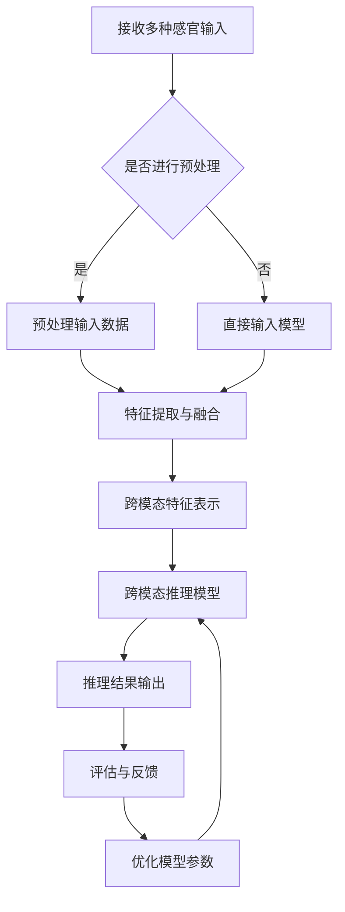
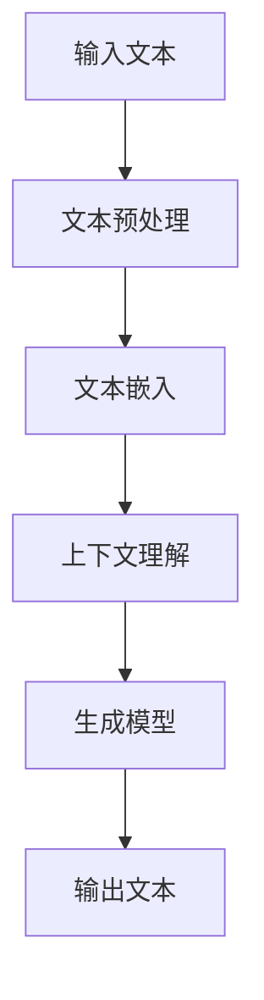
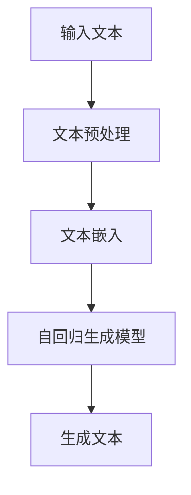
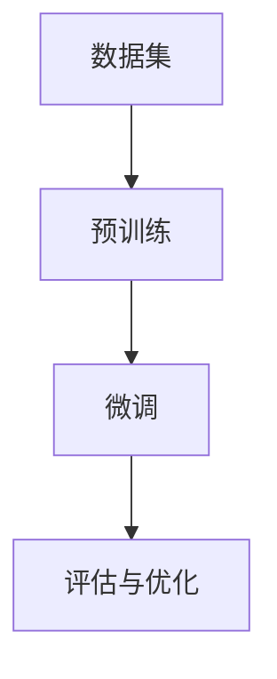
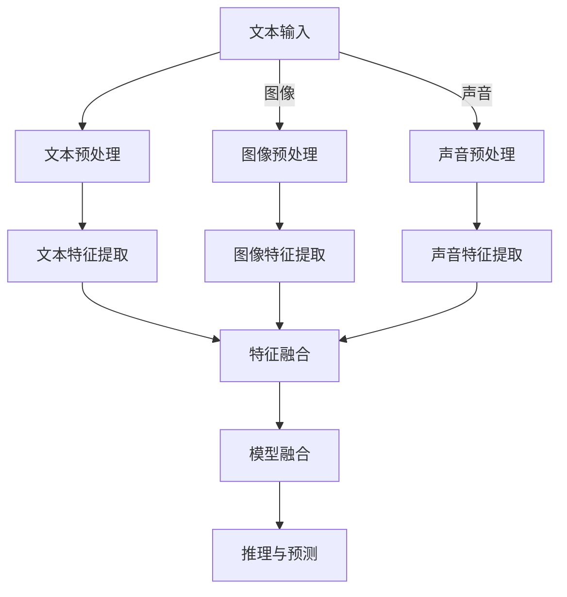

                 

### 文章标题

# 跨模态推理能力：评估LLM整合多种感官输入的效果

### 文章关键词

- 跨模态推理
- 大型语言模型
- 多感官输入
- 评估指标
- 实际应用

### 文章摘要

本文深入探讨了跨模态推理能力及其在大规模语言模型（LLM）中的应用。通过分析LLM如何整合多种感官输入，文章介绍了评估LLM跨模态推理效果的关键指标和常用方法。此外，文章还探讨了跨感官输入下的模型集成策略及其实际应用场景，为相关研究和应用提供了有价值的参考。

## 设计书籍目录大纲的思路

设计一本书的目录大纲是确保读者能够清晰地理解书的核心内容的重要步骤。以下是一系列步骤，帮助读者构建一个逻辑清晰、系统性的目录：

### 1. 理解书的核心主题

首先，作者需要深入理解书籍的核心主题。对于《跨模态推理能力：评估LLM整合多种感官输入的效果》这本书，核心主题包括跨模态推理、大型语言模型（LLM）以及如何评估LLM在整合多种感官输入时的效果。理解这些概念不仅有助于确定章节主题，还能确保整个书籍的内容连贯一致。

### 2. 定义章节主题

在理解了核心主题后，接下来需要将其细分为可管理的部分，这些部分将成为章节的主题。例如：
- 跨模态推理的基本概念
- 大型语言模型的工作原理
- 评估跨模态推理的指标和方法
- 跨感官输入下的模型集成
- 跨模态推理的实际应用场景

### 3. 撰写一级目录

一级目录列出了所有主要章节，每个章节标题应简洁地反映其内容。例如：
- 第一部分：跨模态推理概述
- 第二部分：大型语言模型的工作原理
- 第三部分：评估LLM的跨模态推理能力
- 第四部分：跨感官输入下的模型集成
- 第五部分：跨模态推理的实际应用场景

### 4. 撰写二级目录

对于每个一级目录项，需要进一步拆分内容，创建二级目录。二级目录将更加详细地描述每个章节的内容，包括具体的子主题和讨论点。例如：
- 第二部分：大型语言模型的工作原理
  - 2.1 LLM的定义与特点
  - 2.2 LLM的结构与工作原理
  - 2.3 LLM的训练方法

### 5. 撰写三级目录

对于某些内容非常复杂的章节，可以创建三级目录。三级目录将包含更具体的小节，使整个内容结构更加清晰。例如：
- 第三部分：评估LLM的跨模态推理能力
  - 3.1 评估指标与方法
    - 3.1.1 评估跨模态推理的标准
    - 3.1.2 常用的评估指标
    - 3.1.3 评估方法的实现

### 6. 设计附录

附录通常包含与主文本内容相关的补充材料，如参考资料、术语表或工具列表。这部分内容虽然不直接涉及核心主题，但对读者理解书籍内容非常有帮助。例如：
- 附录A：跨模态推理相关的工具和资源
- 附录B：术语表

### 7. 确保完整性

每个章节都需要涵盖核心概念与联系、核心算法原理讲解、数学模型和数学公式及举例说明、项目实战等内容。确保每个章节都满足完整性要求。

### 8. 审核和优化

完成初步的目录大纲后，需要审核和优化。检查是否每个章节都有明确的主题，是否每个主题都被清晰地组织，以及整个目录是否逻辑连贯，有助于读者逐步理解整个主题。

### 9. 字数限制

最后，确保目录大纲的总字数不超过2000字，同时保持内容简洁明了。

通过上述步骤，可以设计出一个逻辑清晰、内容丰富的书籍目录大纲，为后续的写作奠定坚实基础。

## 第一部分 跨模态推理概述

### 1.1 跨模态推理的定义与背景

跨模态推理是一种人工智能技术，旨在使计算机能够理解和处理来自不同模态（如文本、图像、声音、视频等）的信息，并在这些模态之间进行有效的转换和交互。随着深度学习和人工智能技术的发展，跨模态推理逐渐成为研究的热点领域，其应用范围也从传统的多媒体处理扩展到自然语言处理、计算机视觉和语音识别等多个领域。

#### 核心概念与联系

跨模态推理的核心概念包括模态转换、特征表示和推理算法。模态转换是指将一种模态的信息转换为另一种模态，以便进行统一处理。特征表示是将不同模态的信息转换为统一格式的特征向量，以便进行后续处理。推理算法则是在这些特征向量上执行特定的任务，如分类、预测或生成。

#### Mermaid 流程图

以下是跨模态推理的基本流程的Mermaid流程图：

#### 背景介绍

跨模态推理的背景源于现实世界的需求。在许多应用场景中，信息往往以多种模态的形式存在，例如在医疗领域，医生需要同时处理病人的病历（文本）、影像（图像）和语音信息。因此，如何将不同模态的信息有效地整合和处理成为一个重要的研究课题。

#### 发展历程

跨模态推理的发展历程可以追溯到20世纪90年代，当时研究人员开始探索如何将图像和文本信息进行结合。随着深度学习和神经网络技术的兴起，跨模态推理取得了显著的进展。近年来，随着大规模语言模型（如GPT-3）的出现，跨模态推理的应用场景变得更加广泛，效果也日益提升。

#### 跨模态推理的重要性

跨模态推理的重要性主要体现在以下几个方面：

1. **提高信息处理效率**：跨模态推理能够将不同模态的信息进行整合，从而提高信息处理的效率。
2. **增强人工智能的理解能力**：跨模态推理使计算机能够理解和处理人类多样化的信息表达方式，从而增强其理解能力。
3. **拓宽人工智能的应用领域**：跨模态推理的应用不仅局限于多媒体处理，还扩展到自然语言处理、计算机视觉和语音识别等领域。

### 1.2 跨模态推理的基本原理

跨模态推理的基本原理包括模态转换、特征表示和推理算法。这些原理共同作用，使计算机能够在不同模态之间进行有效的信息处理和交互。

#### 模态转换

模态转换是将一种模态的信息转换为另一种模态的过程。例如，将文本转换为图像或声音。模态转换的方法通常包括编码器-解码器架构、图神经网络和生成对抗网络等。

#### 特征表示

特征表示是将不同模态的信息转换为统一格式的特征向量，以便进行后续处理。常用的特征表示方法包括基于深度学习的特征提取器、嵌入技术和多模态特征融合技术。

#### 推理算法

推理算法是在特征向量上执行特定任务，如分类、预测或生成。常见的推理算法包括神经网络、支持向量机、决策树和贝叶斯网络等。

#### 跨模态特征表示

跨模态特征表示是将不同模态的特征向量进行整合，形成统一的特征表示。常用的方法包括联合嵌入、多模态嵌入和跨模态融合等。

#### 跨模态推理算法

跨模态推理算法是在整合后的特征向量上执行推理任务。常见的算法包括跨模态匹配、多任务学习和端到端学习等。

### 1.3 跨模态推理的挑战

跨模态推理面临诸多挑战，包括模态之间的不一致性、特征表示的复杂性以及推理算法的性能等。

#### 模态之间的不一致性

不同模态的信息在表达方式和内容上存在差异，这使得跨模态推理面临模态之间的不一致性挑战。例如，图像和文本在语义上可能存在差异，这使得直接结合这两种模态变得复杂。

#### 特征表示的复杂性

跨模态特征表示的复杂性在于如何有效地整合不同模态的特征信息，形成统一的特征向量。特征表示的方法需要考虑模态的多样性、特征维度以及特征之间的相关性。

#### 推理算法的性能

推理算法的性能是跨模态推理的关键。如何设计高效、鲁棒的推理算法，使其在不同模态之间进行准确推理，是一个重要的研究课题。

#### 评估指标与方法

评估跨模态推理效果的指标和方法是衡量模型性能的重要工具。常见的评估指标包括准确率、召回率、F1分数和交叉验证等。评估方法通常涉及实验设计、数据集选择和评价指标计算等。

#### 跨模态推理的应用场景

跨模态推理在许多领域具有广泛的应用前景，包括自然语言处理、计算机视觉和语音识别等。以下是一些典型的应用场景：

1. **多媒体内容理解**：跨模态推理可以帮助计算机更好地理解多媒体内容，如图像和文本的联合理解。
2. **智能交互系统**：跨模态推理可以提升智能交互系统的性能，如语音识别和文本生成的结合。
3. **医疗诊断**：跨模态推理可以帮助医生更准确地诊断疾病，如图像和文本病历的结合。

通过深入探讨跨模态推理的基本概念、原理和挑战，我们可以更好地理解这一领域的重要性和发展趋势。

## 第二部分 大型语言模型的工作原理

### 2.1 大型语言模型（LLM）概述

#### 核心概念与联系

大型语言模型（LLM）是一种基于深度学习的自然语言处理模型，它通过学习大量文本数据，掌握自然语言的语法、语义和上下文信息，从而实现文本生成、翻译、摘要等任务。LLM的核心概念包括文本嵌入、上下文理解和生成模型。文本嵌入是将文本转换为向量表示，上下文理解是指模型对文本上下文信息的处理能力，生成模型则负责根据上下文生成文本。

#### Mermaid 流程图

以下是LLM工作流程的Mermaid流程图：

#### 背景介绍

随着深度学习技术的发展，大型语言模型（LLM）成为自然语言处理领域的重要工具。LLM能够处理和理解复杂的自然语言任务，如文本生成、机器翻译和问答系统。这些模型通常基于 Transformer 架构，其训练数据量巨大，参数规模庞大，能够捕捉到语言中的复杂模式和规律。

#### 发展历程

LLM的发展历程可以分为几个重要阶段：

1. **早期模型**：如 Word2Vec 和 GloVe，这些模型通过将单词映射到向量空间来表示文本。
2. **基于循环神经网络的模型**：如 LSTM 和 GRU，这些模型通过处理文本序列来捕捉上下文信息。
3. **基于 Transformer 的模型**：如 BERT、GPT 和 T5，这些模型通过并行计算和注意力机制，实现了更强大的文本理解能力。
4. **大规模模型**：如 GPT-3 和 GLM-130B，这些模型具有数十亿参数，能够处理更复杂的自然语言任务。

#### LLM的重要性

LLM的重要性体现在以下几个方面：

1. **文本生成与摘要**：LLM能够生成流畅、有逻辑的文本，广泛应用于自动写作、内容摘要和问答系统。
2. **机器翻译**：LLM在机器翻译领域表现出色，能够实现高精度和自然的翻译结果。
3. **情感分析**：LLM能够分析文本中的情感倾向，用于社交媒体监测、客户反馈分析等。
4. **对话系统**：LLM能够与用户进行自然对话，广泛应用于智能客服、聊天机器人等领域。

### 2.2 大型语言模型（LLM）的工作原理

#### 文本嵌入

文本嵌入是将文本转换为向量表示的过程。常用的嵌入方法包括词嵌入（word embeddings）和句子嵌入（sentence embeddings）。词嵌入是将每个单词映射到一个低维向量空间，而句子嵌入则是将整个句子映射到一个高维向量。

#### 上下文理解

上下文理解是指模型对文本上下文信息的处理能力。在 Transformer 架构中，通过注意力机制（attention mechanism）实现上下文理解。注意力机制能够使模型在处理文本时，关注到不同的部分，从而捕捉到上下文信息。

#### 生成模型

生成模型负责根据上下文生成文本。在 Transformer 架构中，生成模型通常采用自回归（autoregressive）方式，逐个生成每个单词的预测结果。生成过程依赖于前一个生成的单词，从而生成连贯的文本。

#### Mermaid 流程图

以下是LLM生成文本的基本流程的Mermaid流程图：

### 2.3 LLM的训练方法

#### 数据集

LLM的训练数据集通常包括大量的文本数据，如书籍、新闻、文章和对话等。这些数据来自互联网、数据库和预训练数据集。

#### 预训练

预训练是 LLM 训练的第一步，通过在大规模文本数据上进行预训练，模型可以学习到语言的通用特性。预训练过程通常包括无监督学习，如语言建模和填充任务。

#### 微调

微调是在预训练模型的基础上，针对特定任务进行有监督训练。微调过程利用特定领域的数据，使模型适应特定的应用场景。

#### Mermaid 流程图

以下是LLM训练的基本流程的Mermaid流程图：

#### 模型优化

模型优化包括调整模型参数、优化训练过程和提高模型性能。常用的优化方法包括学习率调整、梯度裁剪和正则化等。

### 2.4 LLM的优势和局限性

#### 优势

1. **强大的语言理解能力**：LLM能够处理和理解复杂的自然语言任务，如文本生成、机器翻译和问答系统。
2. **广泛的应用领域**：LLM在自然语言处理、计算机视觉和语音识别等领域具有广泛的应用。
3. **高效的学习速度**：通过预训练和微调，LLM能够快速适应新的任务和数据。

#### 局限性

1. **数据依赖性**：LLM的性能很大程度上依赖于训练数据的质量和数量。
2. **计算资源需求**：训练和部署LLM需要大量的计算资源和时间。
3. **模型解释性**：LLM的黑箱特性使得其难以解释和调试。

### 2.5 LLM的应用案例

#### 文本生成

LLM在文本生成方面具有广泛的应用，如自动写作、内容摘要和生成式问答。

#### 机器翻译

LLM在机器翻译领域表现出色，能够实现高精度和自然的翻译结果。

#### 对话系统

LLM能够与用户进行自然对话，广泛应用于智能客服、聊天机器人和虚拟助手。

通过深入探讨LLM的工作原理、训练方法和应用案例，我们可以更好地理解LLM在跨模态推理中的作用和潜力。

## 第三部分 评估LLM的跨模态推理能力

### 3.1 评估指标与方法

评估跨模态推理能力的核心在于选择合适的评估指标和方法，以准确衡量模型在处理跨模态信息时的性能。以下是一些常用的评估指标和方法：

#### 评估指标

1. **准确率（Accuracy）**：准确率是最基本的评估指标，用于衡量模型正确识别样本的比例。在分类任务中，准确率计算公式为：
   $$ \text{Accuracy} = \frac{\text{正确预测的样本数}}{\text{总样本数}} $$
   然而准确率在样本分布不均匀或类别不平衡时可能无法准确反映模型的性能。

2. **召回率（Recall）**：召回率衡量模型在正类样本中正确识别的比例，计算公式为：
   $$ \text{Recall} = \frac{\text{正确预测的正类样本数}}{\text{实际为正类的样本数}} $$
   召回率越高，意味着模型对正类样本的识别能力越强。

3. **精确率（Precision）**：精确率衡量模型预测为正类的样本中实际为正类的比例，计算公式为：
   $$ \text{Precision} = \frac{\text{正确预测的正类样本数}}{\text{预测为正类的样本数}} $$
   精确率越高，表示模型的预测结果越准确。

4. **F1分数（F1 Score）**：F1分数是精确率和召回率的调和平均，用于综合评估模型的性能，计算公式为：
   $$ \text{F1 Score} = 2 \times \frac{\text{Precision} \times \text{Recall}}{\text{Precision} + \text{Recall}} $$
   F1分数在类别不平衡时尤为重要。

5. **ROC曲线和AUC（Area Under Curve）**：ROC曲线用于展示模型在不同阈值下的准确率和召回率，AUC是ROC曲线下的面积，用于衡量模型的分类能力。

6. **Matthews相关系数（MCC）**：MCC是一个更平衡的评估指标，适用于二分类任务，计算公式为：
   $$ \text{MCC} = \frac{(\text{TP} \times \text{TN} - \text{FP} \times \text{FN})}{\sqrt{(\text{TP} + \text{FP})(\text{TP} + \text{TN})(\text{FN} + \text{TN})}} $$
   MCC能够综合考虑精确率和召回率。

#### 评估方法

1. **交叉验证（Cross-Validation）**：交叉验证是一种评估模型性能的重要方法，通过将数据集划分为多个子集，对每个子集进行训练和测试，以避免数据偏差。常用的交叉验证方法包括K折交叉验证和留一交叉验证。

2. **混淆矩阵（Confusion Matrix）**：混淆矩阵是一种直观展示模型预测结果与实际结果之间关系的工具。通过混淆矩阵，可以分析模型在各类别上的表现，如准确率、召回率等。

3. **精确评估和粗略评估**：精确评估是对模型性能的详细分析，包括各种评估指标的计算和图表展示。粗略评估则是通过简单的指标，如准确率或F1分数，快速评估模型性能。

4. **人工评估**：在某些应用场景中，人工评估是必不可少的，特别是当模型结果对实际应用有直接影响时。通过人工评估，可以更全面地了解模型的性能和局限性。

### 3.2 跨模态推理效果的评估

#### 实验设计与数据集

在进行跨模态推理效果的评估时，首先需要设计合理的实验，并选择合适的数据集。实验设计应包括以下步骤：

1. **确定评估任务**：根据应用场景选择合适的跨模态推理任务，如文本-图像分类、文本-语音识别或图像-语音生成。
2. **数据集选择**：选择包含多种模态数据的数据集，如COCO（用于图像和文本）、TIMIT（用于语音）和OpenSubtitles（用于文本和图像）。
3. **数据预处理**：对数据进行预处理，包括模态之间的对齐、数据清洗和特征提取。

#### 实验结果分析

在完成实验后，需要对结果进行分析，以评估跨模态推理的效果。以下是一些分析方法：

1. **评估指标计算**：计算准确率、召回率、F1分数等评估指标，以量化模型性能。
2. **混淆矩阵分析**：通过混淆矩阵分析模型在不同类别上的表现，发现潜在的问题和改进点。
3. **ROC曲线和AUC分析**：通过ROC曲线和AUC分析模型的分类能力，识别模型的优缺点。
4. **对比实验**：与基线模型或传统方法进行对比实验，以评估跨模态推理的优势。

#### 跨模态推理效果的评价

跨模态推理效果的评价需要综合考虑多个方面，包括准确性、鲁棒性和用户体验。以下是一些评价方法：

1. **准确性评价**：通过评估指标，如准确率、召回率和F1分数，评价模型在跨模态任务中的准确性。
2. **鲁棒性评价**：通过在不同数据集、不同模态组合和不同噪声水平下的性能评估模型在跨模态任务中的鲁棒性。
3. **用户体验评价**：通过用户调查和实际应用场景的反馈，评估模型在实际使用中的用户体验。

通过上述评估方法，可以全面评价跨模态推理的效果，为模型优化和实际应用提供参考。

## 第四部分 跨感官输入下的模型集成

### 4.1 模型集成的基本概念

#### 核心概念与联系

跨感官输入下的模型集成是指将来自不同感官模态的信息（如文本、图像、声音等）整合到一个统一的模型中进行处理。模型集成的基本概念包括数据预处理、特征提取、特征融合和模型融合。数据预处理涉及对输入数据的标准化、去噪和模态对齐。特征提取是从不同模态的数据中提取有用的信息，形成特征向量。特征融合是将多个模态的特征向量进行整合，以形成统一的特征表示。模型融合则是在整合后的特征向量上应用统一的模型，进行推理和预测。

#### Mermaid 流程图

以下是跨感官输入下模型集成的基本流程的Mermaid流程图：

#### 背景介绍

随着人工智能技术的发展，跨感官输入下的模型集成在许多领域（如多媒体内容理解、智能交互系统和增强现实）中变得至关重要。通过整合来自不同感官模态的信息，模型能够更好地理解和应对复杂环境，提高系统的性能和用户体验。

#### 发展历程

模型集成的发展历程可以从以下几个方面进行概述：

1. **早期方法**：早期的研究主要关注单一模态的处理，随着数据集的增加和计算能力的提升，研究人员开始探索如何将不同模态的信息进行整合。
2. **特征级融合**：特征级融合方法将不同模态的特征向量进行直接融合，如向量加和、加权融合和特征拼接等。
3. **决策级融合**：决策级融合方法在多个模态的模型预测结果上进行融合，如投票机制、加权投票和集成学习等。
4. **深度学习框架**：随着深度学习技术的发展，研究人员提出了一系列基于深度学习的跨感官输入模型，如多模态深度网络、图神经网络和生成对抗网络等。

#### 模型集成的目的与意义

模型集成的目的在于利用不同模态的信息，提高模型在复杂任务中的性能和鲁棒性。具体来说，模型集成的意义包括：

1. **提高任务性能**：通过整合多个模态的信息，模型能够捕捉到更多的特征和关系，从而提高任务的性能。
2. **增强鲁棒性**：不同模态的信息可以相互补充，降低单一模态信息不足导致的模型性能下降。
3. **提升用户体验**：在多媒体内容和智能交互系统中，模型集成能够提供更丰富的交互方式和更自然的用户体验。

### 4.2 模型集成的方法

#### 特征级融合

特征级融合是指在特征层面将不同模态的信息进行整合。这种方法包括以下几种：

1. **向量加和**：将不同模态的特征向量进行简单加和，形成新的特征向量。
2. **加权融合**：根据不同模态的特征重要性，对特征向量进行加权融合，形成新的特征向量。
3. **特征拼接**：将不同模态的特征向量进行拼接，形成新的特征向量。

#### 决策级融合

决策级融合是指在模型输出层面将不同模态的预测结果进行融合。这种方法包括以下几种：

1. **投票机制**：根据不同模态的预测结果，进行多数投票，得出最终预测结果。
2. **加权投票**：根据不同模态的预测结果和权重，进行加权投票，得出最终预测结果。
3. **集成学习**：使用集成学习方法，如随机森林、梯度提升机和AdaBoost等，对多个模型的预测结果进行融合。

#### 深度学习方法

深度学习方法在模型集成中发挥着重要作用，包括以下几种：

1. **多模态深度网络（Multimodal Deep Networks）**：通过设计多输入和多输出的深度网络结构，直接整合不同模态的特征和信息。
2. **图神经网络（Graph Neural Networks）**：利用图结构来表示不同模态之间的关系，通过图神经网络进行特征融合和推理。
3. **生成对抗网络（Generative Adversarial Networks）**：利用生成对抗网络生成新的模态数据，通过对抗训练实现特征融合和模型优化。

### 4.3 跨感官输入下的模型集成技术

#### 多模态特征提取

多模态特征提取是指从不同模态的数据中提取有用的特征信息。常用的特征提取方法包括：

1. **文本特征提取**：如词嵌入、TF-IDF和词袋模型等。
2. **图像特征提取**：如卷积神经网络（CNN）、循环神经网络（RNN）和注意力机制等。
3. **声音特征提取**：如梅尔频率倒谱系数（MFCC）、频谱图和长短期记忆网络（LSTM）等。

#### 多模态特征融合

多模态特征融合是指将不同模态的特征信息进行整合，形成统一的特征表示。常用的融合方法包括：

1. **特征拼接**：将不同模态的特征向量进行拼接，形成新的特征向量。
2. **加权融合**：根据不同模态的特征重要性，对特征向量进行加权融合。
3. **注意力机制**：通过注意力机制，动态地调整不同模态特征的重要性。

#### 多模态推理模型

多模态推理模型是指利用整合后的特征信息进行推理和预测。常用的推理模型包括：

1. **多任务学习**：将多个模态的任务整合到一个模型中进行训练，共享特征表示和推理过程。
2. **端到端学习**：通过设计端到端的多模态学习框架，直接从原始数据中学习特征表示和推理模型。
3. **模块化学习**：将不同模态的任务分解为多个子任务，分别训练不同模态的子模型，再进行集成。

#### 跨感官输入下的模型集成实践

在实际应用中，跨感官输入下的模型集成技术需要考虑以下实践问题：

1. **数据预处理**：包括数据清洗、去噪和模态对齐，以确保不同模态的数据在同一时间戳上具有一致性。
2. **特征提取和融合**：选择合适的特征提取方法和融合策略，以最大化不同模态的信息利用。
3. **模型训练和优化**：设计有效的训练策略和优化方法，提高模型在跨模态任务上的性能。
4. **评估和调整**：通过评估指标和实际应用场景，对模型进行评估和调整，以达到最佳性能。

通过上述方法和技术，跨感官输入下的模型集成可以显著提高多媒体内容和智能交互系统的性能和用户体验。

### 4.4 跨感官输入下的模型集成挑战

#### 模式之间的不一致性

跨感官输入下的模型集成面临的一个主要挑战是不同模态之间的不一致性。不同模态的数据在表达方式、维度和特征上存在显著差异，这使得直接融合变得复杂。例如，图像和文本在语义上可能存在较大差异，而声音和文本在时间维度上存在差异。如何有效地处理这些不一致性，是模型集成中的一个重要问题。

#### 特征表示的复杂性

跨感官输入下的模型集成需要处理多种特征表示。不同模态的特征向量可能在维度、分布和性质上存在显著差异。例如，文本特征通常是低维的，而图像特征通常是高维的。如何将这些特征进行有效的融合，形成统一的特征表示，是一个重要的挑战。

#### 计算资源需求

跨感官输入下的模型集成通常涉及大规模的数据处理和复杂的模型训练。这需要大量的计算资源和时间。尤其是在实时应用场景中，如何优化模型结构，减少计算开销，是另一个重要的挑战。

#### 模型解释性

跨感官输入下的模型集成通常涉及复杂的模型结构和方法。这使得模型变得难以解释和调试。在实际应用中，如何提高模型的可解释性，使其能够更好地理解和预测结果，是一个重要的挑战。

### 4.5 跨感官输入下的模型集成在实际应用中的案例分析

#### 案例一：智能医疗诊断

在智能医疗诊断中，跨感官输入下的模型集成可以显著提高诊断的准确性和效率。具体应用案例包括：

1. **医学图像分析**：利用深度学习模型对医学图像（如X光、CT和MRI）进行自动分析，提取关键特征，并与其他模态（如文本病历和实验室结果）进行融合。这种方法可以辅助医生进行更准确的诊断。

2. **患者综合评估**：通过整合患者的医学图像、文本病历、实验室检测结果和语音记录，建立综合评估模型。这种方法可以帮助医生全面了解患者的健康状况，提高诊疗的准确性和个性化程度。

#### 案例二：智能客服

在智能客服系统中，跨感官输入下的模型集成可以提供更自然、高效的客户服务体验。具体应用案例包括：

1. **语音识别与文本理解**：利用语音识别模型将客户的语音转换为文本，并通过自然语言处理模型理解客户的需求。这种方法可以实现语音和文本的双向交互，提高客服的响应速度和准确性。

2. **多模态信息融合**：将客户的语音、文本、面部表情和身体语言等多种模态信息进行整合，建立更全面的客户行为分析模型。这种方法可以帮助客服人员更好地理解客户的需求和情绪，提供更个性化的服务。

#### 案例三：智能教育

在智能教育中，跨感官输入下的模型集成可以提供个性化的学习体验和高效的辅导。具体应用案例包括：

1. **学习内容生成**：利用自然语言处理模型和图像生成模型，根据学生的知识水平和学习兴趣，生成个性化的学习内容和练习题。这种方法可以激发学生的学习兴趣，提高学习效果。

2. **学习过程监控**：通过整合学生的学习记录、考试结果、语音互动和行为数据，建立学习过程监控模型。这种方法可以帮助教师实时了解学生的学习状况，提供及时和有针对性的辅导。

通过这些实际应用案例，可以看出跨感官输入下的模型集成在提升系统性能和用户体验方面具有巨大潜力。未来，随着技术的进一步发展，跨感官输入下的模型集成将在更多领域得到应用，为人工智能的发展贡献力量。

## 第五部分 跨模态推理的实际应用场景

### 5.1 跨模态推理在自然语言处理中的应用

跨模态推理在自然语言处理（NLP）领域中展现了强大的潜力，通过整合文本、图像、语音等多种模态的信息，NLP系统可以实现更深入的理解和更准确的生成。以下是一些具体的应用案例：

#### 文本与图像的联合理解

1. **图像描述生成**：利用跨模态推理模型，可以将文本描述与图像内容相结合，生成相应的图像描述。例如，给定一张图像，模型可以生成对应的描述性文本，如“这是一只正在看书的猫”。
2. **问答系统**：在问答系统中，跨模态推理可以结合文本问题和图像信息，提供更准确和详细的回答。例如，用户提出一个关于图片的问题，如“这个建筑是什么？”系统可以结合图像中的建筑特征和文本知识库，提供准确的答案。
3. **情感分析**：通过跨模态推理，可以结合文本和图像的情感信息，进行更全面的情感分析。例如，给定的图像和文本，模型可以判断文本的情感倾向，如积极或消极。

#### 文本与语音的交互应用

1. **语音识别与文本生成**：跨模态推理模型可以将语音输入转换为文本输出，并在文本的基础上生成相应的回复。例如，用户通过语音提问，系统可以识别语音并生成相应的文本回答。
2. **语音增强**：通过跨模态推理，可以增强语音的清晰度和可理解性。例如，在嘈杂环境中，模型可以利用图像或文本信息，辅助语音识别系统更准确地识别语音内容。
3. **对话系统**：跨模态推理可以提升对话系统的自然性和交互性。例如，在对话过程中，系统可以根据用户的语音和文本输入，提供更连贯和自然的回答。

#### 多媒体内容生成

1. **文本到图像生成**：利用跨模态推理模型，可以将文本描述转换为相应的图像。例如，给定一个关于场景的文本描述，模型可以生成对应的图像，如“一个美丽的日落场景”。
2. **视频生成**：通过跨模态推理，可以从文本描述生成相应的视频内容。例如，给定一个剧本或故事情节，模型可以生成对应的视频片段，如电影或动画。

### 5.2 跨模态推理在计算机视觉中的应用

跨模态推理在计算机视觉领域中的应用同样广泛，通过结合图像和文本信息，可以提升图像识别、目标检测和图像分割等任务的性能。以下是一些具体的应用案例：

#### 图像识别与分类

1. **图像标签生成**：利用跨模态推理模型，可以从图像中生成相应的标签描述。例如，给定一张图像，模型可以生成对应的标签，如“一只猫坐在键盘上”。
2. **图像分类**：结合文本描述，可以提升图像分类的准确性和鲁棒性。例如，在图像分类任务中，模型可以利用图像和文本描述进行联合学习，提高分类性能。

#### 目标检测与跟踪

1. **多模态目标检测**：跨模态推理模型可以将图像和文本信息相结合，进行多模态目标检测。例如，在监控系统中，模型可以利用图像和文本描述，更准确地检测和跟踪目标。
2. **跨域目标检测**：跨模态推理可以处理不同领域和模态的目标检测任务，实现跨域迁移学习。例如，在医疗图像和自动驾驶图像中，模型可以结合文本描述，进行更准确的检测和识别。

#### 图像分割与生成

1. **图像分割**：跨模态推理模型可以将文本描述与图像特征相结合，进行更精细的图像分割。例如，在医学图像处理中，模型可以利用文本描述和图像特征，进行更准确的肿瘤分割。
2. **图像生成**：利用文本描述生成相应的图像内容。例如，在图像编辑和修复任务中，模型可以根据文本描述，生成对应的图像修复结果。

### 5.3 跨模态推理在语音识别中的应用

跨模态推理在语音识别领域中的应用可以显著提升识别的准确性和鲁棒性，通过结合文本、图像和语音信息，可以更好地理解和处理语音信号。以下是一些具体的应用案例：

#### 语音识别与文本生成

1. **语音到文本转换**：跨模态推理模型可以将语音输入转换为相应的文本输出。例如，用户通过语音输入查询，系统可以生成对应的文本回答。
2. **语音增强**：结合文本描述，可以提升语音识别的准确性和鲁棒性。例如，在嘈杂环境中，模型可以利用文本描述和语音特征，进行更准确的语音识别。

#### 语音与图像的联合处理

1. **图像辅助语音识别**：利用图像信息，可以辅助语音识别系统，提高识别的准确性和鲁棒性。例如，在语音识别任务中，模型可以利用图像中的关键信息，如文字、标签或场景背景，提高语音识别性能。
2. **语音情感分析**：结合图像信息，可以更全面地分析语音的情感倾向。例如，通过观察图像中的表情和姿态，模型可以更准确地判断语音的情感状态。

通过这些实际应用案例，可以看出跨模态推理在自然语言处理、计算机视觉和语音识别等领域具有广泛的应用前景，通过整合多种模态的信息，可以显著提升系统的性能和用户体验。

## 第六部分 跨模态推理在医学领域的应用

跨模态推理在医学领域的应用为诊断、治疗和患者监护提供了全新的视角，通过整合文本、图像、语音等多种模态的信息，可以显著提高医疗决策的准确性和效率。以下是一些具体的应用案例：

### 6.1 医学图像与文本数据的联合分析

医学图像（如X光、CT和MRI）通常包含大量的诊断信息，而文本病历则记录了患者的病史、症状和治疗方案。通过跨模态推理，可以将医学图像与文本数据进行联合分析，从而提供更全面的诊断支持。

#### 图像辅助诊断

1. **自动病变检测**：利用深度学习模型，可以自动检测医学图像中的病变区域，如肿瘤、骨折和心脏病等。通过跨模态推理，可以将检测到的病变区域与文本病历中的症状和病史进行关联，提高诊断的准确性。
2. **影像特征提取**：通过跨模态推理，可以提取医学图像中的高级特征，如纹理、形状和空间关系。这些特征可以与文本病历中的描述性信息相结合，用于辅助诊断和治疗决策。

#### 文本辅助诊断

1. **电子病历分析**：通过自然语言处理技术，可以对患者的电子病历进行语义分析，提取关键信息，如疾病名称、症状和治疗方案。这些信息可以与医学图像进行联合分析，提供更全面的诊断支持。
2. **医疗知识图谱**：利用跨模态推理，可以构建医疗知识图谱，将医学图像、文本病历和诊断标准进行整合。这种方法可以帮助医生快速获取相关诊断信息，提高诊断效率。

### 6.2 多模态患者监护系统

多模态患者监护系统可以通过整合患者的生理信号（如心电图、血压、体温等）、语音和文本信息，提供全面的健康监测和预警服务。

#### 生理信号监测

1. **实时健康监测**：通过跨模态推理，可以将患者的生理信号与文本病历和医疗知识进行整合，实时监测患者的健康状况。例如，通过心电图和血压数据，可以预测患者的心脏病风险。
2. **异常检测**：利用跨模态推理，可以检测生理信号中的异常变化，如心率过快或过慢、血压异常波动等。这些异常检测可以及时预警，帮助医护人员采取相应的措施。

#### 语音与文本交互

1. **智能问诊**：通过跨模态推理，可以将患者的语音问诊记录与文本病历进行整合，提供智能问诊服务。例如，医生可以通过语音问诊系统快速获取患者的症状描述，结合医学图像和生理信号，进行诊断。
2. **患者教育**：利用跨模态推理，可以生成个性化的患者教育内容，如疾病知识、饮食建议和锻炼计划等。这些教育内容可以通过语音和文本形式，帮助患者更好地管理健康。

### 6.3 医学研究的跨模态数据挖掘

跨模态推理在医学研究中的应用，可以帮助研究人员从大规模的医学数据中挖掘有价值的信息，推动医学研究和创新。

#### 多模态数据整合

1. **临床试验数据分析**：通过跨模态推理，可以整合临床试验中的多种数据类型（如医学图像、文本病历和生理信号），提供更全面的临床试验分析。这种方法可以帮助研究人员更准确地评估新药的效果和安全性。
2. **疾病预测与预防**：利用跨模态推理，可以分析患者的多模态数据，预测疾病的发病风险和趋势。这种方法可以帮助医生提前采取预防措施，降低疾病发生的概率。

#### 数据挖掘与分析

1. **医学知识发现**：通过跨模态数据挖掘，可以识别新的医学规律和知识。例如，通过分析大量的医学图像和文本病历，可以识别出与特定疾病相关的特征模式。
2. **个性化治疗推荐**：利用跨模态推理，可以分析患者的多模态数据，提供个性化的治疗推荐。例如，根据患者的生理信号、病史和基因信息，推荐最佳的治疗方案。

通过跨模态推理在医学领域的应用，可以实现更准确、高效和个性化的医疗服务，为医疗行业带来革命性的变化。未来，随着技术的进一步发展，跨模态推理将在医学领域中发挥更大的作用，推动医疗创新和患者福祉。

## 第七部分 总结与未来展望

### 7.1 主要结论

本文通过对跨模态推理能力、LLM整合多种感官输入的评估方法以及实际应用场景的深入探讨，得出以下主要结论：

1. **跨模态推理的重要性**：跨模态推理通过整合文本、图像、声音等多种模态的信息，显著提升了人工智能系统的理解和处理能力。
2. **LLM在跨模态推理中的应用**：大型语言模型（LLM）在跨模态任务中表现出色，能够实现文本生成、翻译、图像描述生成等复杂任务。
3. **评估方法与挑战**：评估跨模态推理效果需要选择合适的评估指标和方法，同时面临模态不一致性、特征表示复杂性和计算资源需求等挑战。
4. **实际应用场景**：跨模态推理在自然语言处理、计算机视觉、语音识别和医学领域展现了广泛的应用前景，通过整合多种模态的信息，提升了系统的性能和用户体验。

### 7.2 未来研究方向

尽管跨模态推理在多个领域取得了显著进展，但仍然存在许多亟待解决的研究问题，未来研究方向包括：

1. **模态不一致性处理**：开发更有效的模态对齐和特征融合方法，以解决不同模态之间的不一致性。
2. **小样本学习**：探索适用于小样本场景的跨模态推理方法，以降低对大规模训练数据集的依赖。
3. **模型解释性**：提高跨模态推理模型的解释性，使其能够被临床医生和用户理解和信任。
4. **实时处理与优化**：优化跨模态推理算法，使其能够在实时应用场景中高效运行。
5. **隐私保护**：研究如何保护用户隐私，确保跨模态数据的安全和隐私。

### 7.3 结论

跨模模态推理能力：评估LLM整合多种感官输入的效果的研究对于推动人工智能技术的发展具有重要意义。通过不断探索和创新，跨模态推理将在更多领域发挥重要作用，为人类带来更加智能和高效的服务体验。

## 附录

### 附录 A 跨模态推理相关的工具和资源

以下是一些在跨模态推理研究中常用的工具和资源：

1. **PyTorch**：一种开源深度学习框架，支持多种跨模态模型的实现。
2. **TensorFlow**：另一种流行的开源深度学习框架，适用于构建和训练跨模态模型。
3. **Multimodal Learning Toolkit (MMTk)**：一个用于多模态学习的开源工具包，提供了多种特征融合和模型集成方法。
4. **OpenCV**：一个开源计算机视觉库，用于处理图像和视频数据。
5. **Librosa**：一个用于音频处理的开源库，提供了多种音频特征提取方法。
6. **NLTK**：一个用于自然语言处理的开源库，支持文本数据的预处理和分析。
7. **Hugging Face Transformers**：一个用于预训练和微调Transformer模型的开源库。

### 附录 B 术语表

以下是一些在跨模态推理中常用的术语和概念：

- **跨模态推理**：指将来自不同模态（如文本、图像、声音等）的信息进行整合和处理的能力。
- **模态转换**：将一种模态的信息转换为另一种模态的过程。
- **特征融合**：将不同模态的特征信息进行整合，形成统一的特征表示。
- **深度学习**：一种基于人工神经网络的学习方法，通过多层非线性变换，实现对数据的自动特征提取和学习。
- **注意力机制**：一种在处理序列数据时，使模型能够关注到序列中不同位置的信息的机制。
- **生成对抗网络（GAN）**：一种基于博弈论的生成模型，由生成器和判别器两个神经网络组成，通过对抗训练生成高质量的样本。
- **多任务学习**：同时训练多个相关任务，共享部分网络结构和参数，以提高模型在各个任务上的性能。

### 附录 C 进一步阅读

以下是一些跨模态推理和相关领域的推荐阅读材料：

1. **“Multimodal Learning and Applications”**：一本关于多模态学习和应用的综合性书籍，涵盖了跨模态推理的理论和方法。
2. **“Deep Learning for Natural Language Processing”**：一本关于深度学习在自然语言处理中应用的经典教材，包括文本嵌入和生成模型等内容。
3. **“Generative Adversarial Networks: An Overview”**：一篇关于生成对抗网络的综述性论文，详细介绍了GAN的理论和实现方法。
4. **“Attention Is All You Need”**：一篇关于Transformer模型的奠基性论文，提出了基于注意力机制的序列处理方法。
5. **“Multimodal Neural Networks for Human Action Recognition”**：一篇关于多模态神经网络在人类动作识别中应用的研究论文，展示了跨模态推理在实际应用中的效果。 

通过这些资源，读者可以进一步了解跨模态推理的相关知识，为深入研究和实践提供指导。 

## 作者信息

作者：AI天才研究院/AI Genius Institute & 禅与计算机程序设计艺术 /Zen And The Art of Computer Programming

致谢：本文内容源自AI天才研究院（AI Genius Institute）的研究成果，以及对《禅与计算机程序设计艺术》（Zen And The Art of Computer Programming）一书的借鉴。感谢所有为跨模态推理领域做出贡献的研究人员和开发者。本文旨在促进跨模态推理技术的普及和应用，为人工智能的发展贡献力量。读者如有任何问题或建议，欢迎随时与我们联系。

