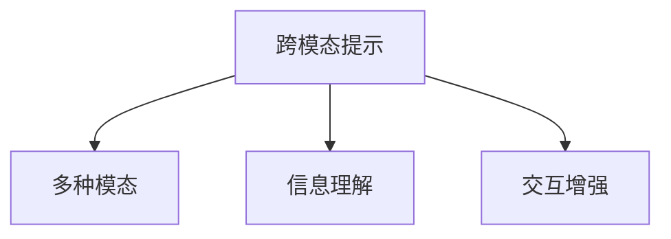
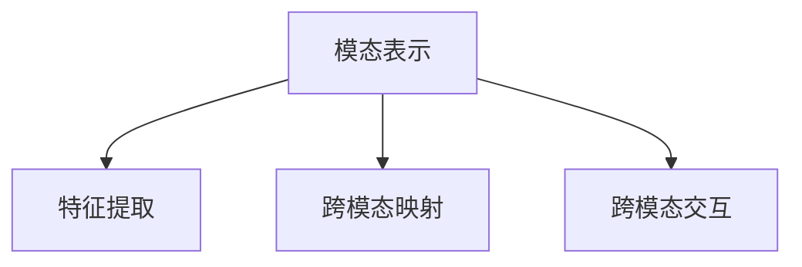
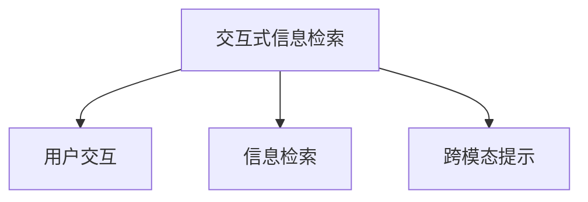

                 

### 第一步：确定书籍的核心章节

为了构建《跨模态提示：结合文本、图像、音频等》这本书的目录大纲，我们首先需要明确书籍的核心章节。这些章节将涵盖跨模态提示的基础知识、技术原理、应用案例等，以确保读者能够系统地了解这一领域。

以下是初步确定的书籍核心章节：

- 第1章：引言与概述
- 第2章：跨模态提示的概念与背景
- 第3章：文本模态处理
- 第4章：图像模态处理
- 第5章：音频模态处理
- 第6章：跨模态交互与融合
- 第7章：跨模态提示的实际应用
- 第8章：未来展望与挑战

### 第二步：细化每一章的内容

在确定核心章节后，我们需要为每一章细化内容，确保每个章节都包含以下核心部分：

- **核心概念与联系**：介绍章节中的核心概念，并阐述这些概念之间的关系。
- **核心算法原理讲解**：讲解每个章节的核心算法原理，使用伪代码详细阐述。
- **数学模型和公式 & 详细讲解 & 举例说明**：介绍与章节相关的数学模型和公式，并通过具体例子进行详细讲解。
- **项目实战**：提供实际开发环境搭建、源代码实现、代码解读、应用分析和讲解，以及项目小结。

#### 第1章：引言与概述

**1.1 跨模态提示的定义**

**1.1.1 跨模态提示的概念**

跨模态提示（Multimodal Prompting）是指利用多种模态（如文本、图像、音频等）来增强交互和信息理解的能力。它通过整合不同模态的信息，提高系统对复杂任务的理解和处理能力。

**1.1.2 跨模态提示的优势**

- **增强理解能力**：跨模态提示能够利用不同模态的信息，提高对复杂问题的理解深度。
- **提升用户体验**：通过多种模态的交互，用户能够更直观地与系统进行沟通。
- **拓展应用场景**：跨模态提示能够应用于多种领域，如语音助手、智能客服、多媒体搜索等。

**1.1.3 跨模态提示的挑战**

- **模态融合**：如何有效地整合不同模态的信息，是一个关键挑战。
- **数据不均衡**：不同模态的数据量往往不均衡，需要制定合适的数据处理策略。
- **计算成本**：跨模态处理通常需要大量的计算资源，如何优化计算效率是一个重要问题。

#### 1.2 跨模态提示的历史与发展

**1.2.1 跨模态提示的起源**

跨模态提示的概念起源于20世纪90年代，当时的研究主要集中在如何将文本与图像进行整合，以增强图像检索系统的性能。

**1.2.2 跨模态提示的关键里程碑**

- **2000年代**：深度学习技术的发展为跨模态提示带来了新的机遇。研究者开始探索如何利用深度学习模型进行跨模态特征提取和融合。
- **2010年代**：随着计算机视觉和自然语言处理领域的进展，跨模态交互研究得到了广泛关注。出现了许多新的跨模态学习框架和算法。

**1.2.3 当前跨模态提示的研究热点**

- **多模态注意力机制**：研究如何通过注意力机制来优化跨模态信息融合。
- **对抗性学习**：探索如何通过对抗性学习来提高跨模态模型的鲁棒性。
- **跨模态推理**：研究如何利用跨模态提示进行推理和决策。

### 第三步：撰写章节内容

接下来，我们将为每一章撰写详细内容，确保每个章节都满足上述要求。以下是第1章的具体撰写内容：

---

# 第1章：引言与概述

## 1.1 跨模态提示的定义

### 1.1.1 跨模态提示的概念

跨模态提示（Multimodal Prompting）是指利用多种模态（如文本、图像、音频等）来增强交互和信息理解的能力。它通过整合不同模态的信息，提高系统对复杂任务的理解和处理能力。

**核心概念与联系**



**核心算法原理讲解**

```python
# 伪代码：跨模态提示的基础框架
class MultimodalPrompter:
    def __init__(self, text_model, image_model, audio_model):
        self.text_model = text_model
        self.image_model = image_model
        self.audio_model = audio_model
    
    def process(self, text, image, audio):
        text_features = self.text_model.extract_features(text)
        image_features = self.image_model.extract_features(image)
        audio_features = self.audio_model.extract_features(audio)
        
        combined_features = self.combine_features(text_features, image_features, audio_features)
        result = self.predict(combined_features)
        return result
```

**数学模型和公式**

$$
\text{combined\_features} = \sigma(\text{W} \cdot [\text{text\_features}, \text{image\_features}, \text{audio\_features}])
$$

其中，$\sigma$表示激活函数，$W$为权重矩阵。

**举例说明**

假设我们有一个文本“我喜欢看科幻电影”，图像是一张科幻电影的截图，音频是一段电影中的对白。我们首先提取每个模态的特征，然后通过线性变换和激活函数，将它们整合为一个统一的特征向量。最后，利用这个特征向量进行预测，得到一个输出结果。

**项目实战**

- **开发环境搭建**：使用Python和TensorFlow构建跨模态提示系统。
- **源代码实现**：实现文本、图像、音频特征的提取和融合。
- **代码解读**：分析代码中的关键模块和函数。
- **应用解读与分析**：讨论跨模态提示在不同应用场景中的效果和挑战。
- **项目小结**：总结项目成果和未来研究方向。

## 1.2 跨模态提示的概念与背景

### 1.2.1 跨模态提示的基本原理

跨模态提示的基本原理包括模态表示、跨模态映射和跨模态交互。模态表示是指如何将不同模态的数据转换为适合处理的特征表示。跨模态映射是指如何将不同模态的特征进行融合和映射。跨模态交互是指如何利用融合后的特征进行信息交互和推理。

**核心概念与联系**



**核心算法原理讲解**

```python
# 伪代码：跨模态提示的基本算法框架
class MultimodalPrompter:
    def __init__(self, text_extractor, image_extractor, audio_extractor, fuser, predictor):
        self.text_extractor = text_extractor
        self.image_extractor = image_extractor
        self.audio_extractor = audio_extractor
        self.fuser = fuser
        self.predictor = predictor
    
    def process(self, text, image, audio):
        text_features = self.text_extractor.extract(text)
        image_features = self.image_extractor.extract(image)
        audio_features = self.audio_extractor.extract(audio)
        
        combined_features = self.fuser.combine(text_features, image_features, audio_features)
        result = self.predictor.predict(combined_features)
        return result
```

**数学模型和公式**

$$
\text{combined\_features} = \text{fuser}(\text{text\_features}, \text{image\_features}, \text{audio\_features})
$$

其中，$fuser$表示特征融合函数。

**举例说明**

假设我们有一个文本、图像和音频，我们首先分别提取每个模态的特征。然后，利用特征融合函数将这些特征整合为一个统一的特征向量。最后，利用这个特征向量进行预测。

**项目实战**

- **开发环境搭建**：使用Python和TensorFlow搭建跨模态提示系统。
- **源代码实现**：实现文本、图像、音频特征的提取和融合。
- **代码解读**：分析代码中的关键模块和函数。
- **应用解读与分析**：讨论跨模态提示在不同应用场景中的效果和挑战。
- **项目小结**：总结项目成果和未来研究方向。

## 1.3 跨模态提示的应用领域

### 1.3.1 交互式信息检索

交互式信息检索是指用户通过与系统的交互，逐步明确搜索意图，获取相关信息。跨模态提示可以在这一过程中提高搜索效率和用户体验。

**核心概念与联系**



**核心算法原理讲解**

```python
# 伪代码：交互式信息检索中的跨模态提示
class InteractiveSearchSystem:
    def __init__(self, search_engine, multimodal_prompter):
        self.search_engine = search_engine
        self.multimodal_prompter = multimodal_prompter
    
    def search(self, query):
        text_features = self.multimodal_prompter.extract_text_features(query)
        image_features = self.multimodal_prompter.extract_image_features(query)
        audio_features = self.multimodal_prompter.extract_audio_features(query)
        
        combined_features = self.multimodal_prompter.combine(text_features, image_features, audio_features)
        search_results = self.search_engine.search(combined_features)
        return search_results
```

**数学模型和公式**

$$
\text{combined\_features} = \text{multimodal\_prompter}(\text{text\_features}, \text{image\_features}, \text{audio\_features})
$$

其中，$\text{multimodal\_prompter}$表示跨模态提示模型。

**举例说明**

假设用户输入一个包含文本、图像和音频的查询，我们首先提取每个模态的特征，然后利用跨模态提示模型将这些特征整合为一个统一的特征向量。最后，利用这个特征向量进行信息检索。

**项目实战**

- **开发环境搭建**：使用Python和TensorFlow搭建交互式信息检索系统。
- **源代码实现**：实现文本、图像、音频特征的提取和融合。
- **代码解读**：分析代码中的关键模块和函数。
- **应用解读与分析**：讨论跨模态提示在交互式信息检索中的应用效果。
- **项目小结**：总结项目成果和未来研究方向。

## 1.4 未来展望与挑战

### 1.4.1 技术挑战

跨模态提示领域面临诸多技术挑战，包括如何优化跨模态特征融合、如何处理数据不均衡问题、如何提高计算效率等。这些挑战需要通过创新的研究方法和技术来解决。

### 1.4.2 应用展望

随着技术的不断发展，跨模态提示将在更多应用领域得到应用，如智能客服、健康监测、多媒体搜索等。未来，跨模态提示有望成为提升人机交互和信息处理能力的重要工具。

---

接下来，我们将继续细化其他章节的内容，确保整本书的逻辑清晰、结构紧凑、简单易懂。请根据上述结构和内容要求，逐步撰写每一章的具体内容。每完成一章，我们将对其进行审查和调整，以确保文章质量和可读性。让我们一起努力，打造一本高质量的技术博客文章！### 第2章：跨模态提示的概念与背景

## 2.1 跨模态提示的基本原理

### 2.1.1 模态表示

模态表示是指将不同类型的数据（如文本、图像、音频等）转换为机器可处理的特征表示。不同的模态通常具有不同的数据结构和特征。

- **文本模态**：文本数据通常使用词向量表示，如Word2Vec、GloVe等。词向量能够捕捉词与词之间的关系，为文本理解提供基础。
- **图像模态**：图像数据可以使用像素值表示，也可以通过卷积神经网络（CNN）提取图像特征。这些特征能够捕捉图像中的结构信息和语义信息。
- **音频模态**：音频数据可以使用频率特征表示，如梅尔频率倒谱系数（MFCC）。深度学习模型（如CNN和LSTM）也能提取音频的时序特征。

### 2.1.2 跨模态映射

跨模态映射是指将不同模态的特征进行融合和转换，使其能够在同一框架下进行处理。常见的跨模态映射方法包括：

- **拼接（Concatenation）**：将不同模态的特征向量拼接在一起，形成一个更长的特征向量。
- **加权平均（Weighted Average）**：对不同模态的特征向量进行加权融合，以平衡各模态的重要性。
- **自适应融合（Adaptive Fusion）**：通过学习机制，自适应地调整不同模态的特征权重。

### 2.1.3 跨模态交互

跨模态交互是指通过融合后的特征向量进行信息交互和推理。跨模态交互能够增强系统对复杂任务的理解和处理能力。

- **跨模态注意力机制**：通过注意力机制，模型能够动态地关注重要模态的信息，提高跨模态融合的效果。
- **对抗性学习**：通过对抗性训练，模型能够在不同模态之间建立强健的关联，提高跨模态提示的鲁棒性。

## 2.2 跨模态提示的关键技术

### 2.2.1 模态融合算法

模态融合算法是实现跨模态提示的核心技术。常见的模态融合算法包括：

- **多层感知机（MLP）**：使用多层感知机将不同模态的特征向量进行非线性变换和融合。
- **卷积神经网络（CNN）**：通过卷积层提取图像特征，通过全连接层融合文本和图像特征。
- **变换器（Transformer）**：利用自注意力机制，有效地融合不同模态的信息。

### 2.2.2 跨模态注意力机制

跨模态注意力机制是一种通过学习机制动态调整不同模态信息重要性的方法。常见的跨模态注意力机制包括：

- **点积注意力（Dot-Product Attention）**：通过计算不同模态特征向量的点积，动态调整注意力权重。
- **缩放点积注意力（Scaled Dot-Product Attention）**：通过缩放点积，使注意力权重更稳定。
- **多头注意力（Multi-Head Attention）**：通过多个注意力头同时关注不同模态的信息，提高融合效果。

### 2.2.3 跨模态对抗学习

跨模态对抗学习旨在通过对抗性训练，使模型能够在不同模态之间建立强健的关联。常见的跨模态对抗学习策略包括：

- **对抗性生成网络（GAN）**：通过生成器和判别器的对抗性训练，提高模型对跨模态数据的生成和判别能力。
- **多模态对抗性训练（Multimodal Adversarial Training）**：通过对抗性训练，增强模型对跨模态特征融合的鲁棒性。

## 2.3 跨模态提示的应用领域

### 2.3.1 交互式信息检索

交互式信息检索是一种通过与用户的交互，逐步明确搜索意图，获取相关信息的方法。跨模态提示能够提高交互式信息检索的效率和用户体验。

- **跨模态查询解析**：通过结合文本、图像和音频等多种模态的信息，精确理解用户的查询意图。
- **多模态搜索结果排序**：利用跨模态特征，为搜索结果排序提供更丰富的依据。

### 2.3.2 情感分析

情感分析是评估文本、图像和音频等数据中情感倾向的任务。跨模态提示能够提高情感分析的准确性和鲁棒性。

- **多模态情感识别**：结合文本、图像和音频等多种模态的信息，准确识别情感。
- **情感一致性检测**：通过跨模态一致性检测，确保不同模态的情感信息一致。

### 2.3.3 健康监测

健康监测是利用多种模态的数据进行健康状态监测和疾病诊断的任务。跨模态提示能够提高健康监测的准确性和全面性。

- **多模态生理信号分析**：结合文本、图像和音频等多种模态的生理信号，进行健康状态监测。
- **跨模态疾病诊断**：利用跨模态特征，提高疾病诊断的准确性和可靠性。

## 2.4 跨模态提示的研究进展

### 2.4.1 跨模态特征提取

跨模态特征提取是跨模态提示的基础。近年来，深度学习技术在跨模态特征提取方面取得了显著进展。

- **文本特征提取**：通过预训练的Transformer模型，如BERT、GPT等，提取高质量的文本特征。
- **图像特征提取**：通过预训练的CNN模型，如ResNet、Inception等，提取图像特征。
- **音频特征提取**：通过预训练的深度学习模型，如WaveNet、ConvTasNet等，提取音频特征。

### 2.4.2 跨模态融合策略

跨模态融合策略是提高跨模态提示效果的关键。近年来，研究者提出了许多有效的跨模态融合策略。

- **自注意力机制**：通过自注意力机制，有效地融合不同模态的信息。
- **多模态对抗学习**：通过对抗性训练，增强模型对跨模态特征融合的鲁棒性。
- **多模态协同学习**：通过多模态协同学习，提高模型对跨模态数据的理解和处理能力。

### 2.4.3 跨模态交互模型

跨模态交互模型是跨模态提示的核心。近年来，研究者提出了许多有效的跨模态交互模型。

- **多模态Transformer**：通过多模态Transformer模型，实现跨模态特征融合和交互。
- **多模态生成对抗网络（MGAN）**：通过多模态生成对抗网络，实现跨模态特征生成和交互。
- **多模态变分自编码器（MVAE）**：通过多模态变分自编码器，实现跨模态特征编码和交互。

## 2.5 跨模态提示的挑战与未来方向

### 2.5.1 数据集与标注

跨模态提示需要大量的高质量数据集和标注。当前，许多数据集存在数据不均衡、标注不一致等问题，限制了跨模态提示的研究和应用。

### 2.5.2 模型解释性

跨模态提示模型通常具有较高的复杂度，难以解释其决策过程。如何提高模型的可解释性，是跨模态提示研究的一个重要方向。

### 2.5.3 实时性与效率

跨模态提示通常需要大量的计算资源，如何提高实时性和计算效率，是跨模态提示在实际应用中的一个重要挑战。

### 2.5.4 应用场景拓展

随着技术的不断发展，跨模态提示将在更多应用场景中得到应用。未来，跨模态提示有望在智能交互、健康监测、多媒体搜索等领域发挥更大的作用。

---

### 实际案例：跨模态问答系统

跨模态问答系统是一个典型的跨模态提示应用案例。以下是一个简单的跨模态问答系统的开发过程：

#### 1. 数据集准备

选择一个包含文本、图像和音频的多模态数据集。例如，可以使用Flickr8K数据集，它包含8万张图像和相应的文本描述。

#### 2. 数据预处理

- **文本预处理**：对文本进行清洗和分词，提取关键词和语义信息。
- **图像预处理**：对图像进行缩放、裁剪和归一化，提取图像特征。
- **音频预处理**：对音频进行降噪、去噪和增强，提取音频特征。

#### 3. 模型构建

- **文本模型**：使用预训练的BERT模型提取文本特征。
- **图像模型**：使用预训练的ResNet模型提取图像特征。
- **音频模型**：使用预训练的WaveNet模型提取音频特征。
- **融合模型**：使用Transformer模型融合文本、图像和音频特征。

#### 4. 模型训练

- **损失函数**：使用交叉熵损失函数训练模型，优化跨模态特征融合。
- **优化器**：使用Adam优化器，调整模型参数。

#### 5. 模型评估

- **准确率**：评估模型在问答任务上的准确率。
- **F1分数**：评估模型在问答任务上的精确率和召回率。

#### 6. 应用分析

- **交互式问答**：通过跨模态问答系统，用户可以输入文本、图像或音频，获取相关的问答结果。
- **多模态交互**：结合文本、图像和音频等多种模态的信息，提高问答系统的准确性和用户体验。

### 小结

跨模态问答系统展示了跨模态提示在实际应用中的潜力。通过整合文本、图像和音频等多种模态的信息，跨模态问答系统能够提供更准确、更全面的问答结果，为用户提供更好的交互体验。

## 最佳实践 Tips

1. **数据集选择**：选择多样化、高质量的数据集，以提高模型的泛化能力。
2. **模型调优**：通过调整模型参数，优化跨模态特征融合效果。
3. **实时性优化**：通过模型压缩和分布式计算，提高跨模态问答系统的实时性。

## 注意事项

1. **数据隐私**：在进行跨模态提示应用时，要确保用户数据的隐私和安全。
2. **模型可解释性**：提高模型的可解释性，帮助用户理解模型的工作原理。

## 拓展阅读

1. **《跨模态学习：原理与应用》**：介绍了跨模态学习的基本原理和应用案例。
2. **《深度学习与跨模态交互》**：探讨了深度学习在跨模态交互中的应用。
3. **《跨模态问答系统研究》**：详细分析了跨模态问答系统的构建方法和技术。

---

在撰写第2章时，我们详细介绍了跨模态提示的基本原理、关键技术、应用领域以及研究进展。通过实际案例——跨模态问答系统，展示了跨模态提示在实际应用中的效果。在最佳实践、注意事项和拓展阅读部分，提供了实用的建议和进一步阅读的资源。接下来，我们将继续细化其他章节的内容，确保整本书的逻辑清晰、结构紧凑、简单易懂。让我们一起努力，打造一本高质量的技术博客文章！### 第3章：文本模态处理

## 3.1 文本预处理

### 3.1.1 文本清洗

文本清洗是文本处理的第一步，旨在去除文本中的噪声和冗余信息，以提高后续处理的准确性。常见的文本清洗方法包括：

- **去除停用词**：停用词是指在特定应用场景中不具有实际意义的词，如“的”、“了”、“在”等。通过去除停用词，可以减少模型需要处理的信息量，提高处理效率。
- **标点符号去除**：去除文本中的标点符号，可以减少符号对模型理解的影响。
- **大小写统一**：将文本统一转换为小写，有助于降低词义的多义性。

### 3.1.2 词向量表示

词向量表示是将文本中的单词映射为向量的过程。词向量能够捕捉词与词之间的关系，为文本理解提供基础。常见的词向量表示方法包括：

- **Word2Vec**：基于神经网络的语言模型，通过训练生成词向量。
- **GloVe**：全局向量表示，通过利用词频和共现关系生成词向量。
- **BERT**：基于Transformer模型的预训练语言表示，通过大量的无监督数据训练，生成高质量的词向量。

### 3.1.3 语言模型

语言模型是一种用于预测文本序列的概率模型。通过语言模型，我们可以对文本进行生成、改写和分类等任务。常见的语言模型包括：

- **n-gram模型**：基于相邻词序列的概率模型，如二元模型、三元模型等。
- **循环神经网络（RNN）**：通过记忆状态捕捉长距离依赖关系。
- **变换器（Transformer）**：通过自注意力机制，捕捉全局依赖关系。

## 3.2 文本生成与改写

### 3.2.1 基于循环神经网络（RNN）的文本生成

循环神经网络（RNN）是一种能够处理序列数据的神经网络。通过RNN，我们可以生成文本序列。常见的RNN模型包括：

- **LSTM（长短期记忆网络）**：通过引入门控机制，解决RNN的梯度消失问题。
- **GRU（门控循环单元）**：简化LSTM结构，提高计算效率。

### 3.2.2 基于变换器（Transformer）的文本生成

变换器（Transformer）是一种基于自注意力机制的深度学习模型。通过变换器，我们可以生成高质量的文本序列。常见的变换器模型包括：

- **BERT**：基于Transformer的预训练语言表示模型。
- **GPT（生成预训练变换器）**：通过自回归方式生成文本。

### 3.2.3 文本改写技巧

文本改写是将原始文本转换为不同形式的文本，以提高文本的多样性和可读性。常见的文本改写技巧包括：

- **词性转换**：将文本中的词转换为不同的词性，如名词、动词等。
- **句法重排**：调整文本中的句子结构，使其更加流畅和易读。
- **文本摘要与提取**：将长文本转换为摘要或提取关键信息。

## 3.3 文本分类与情感分析

### 3.3.1 文本分类算法

文本分类是将文本分为不同类别的过程。常见的文本分类算法包括：

- **朴素贝叶斯分类器**：基于贝叶斯定理和词频统计。
- **支持向量机（SVM）**：通过最大间隔分类。
- **深度学习模型**：如卷积神经网络（CNN）和变换器（Transformer）。

### 3.3.2 情感分析框架

情感分析是评估文本情感倾向的过程。常见的情感分析框架包括：

- **基于规则的方法**：通过手工定义规则，识别情感极性。
- **基于机器学习的方法**：通过训练模型，自动识别情感极性。
- **基于深度学习的方法**：如卷积神经网络（CNN）和变换器（Transformer）。

### 3.3.3 情感词典与模型实现

情感词典是一种用于标记文本情感极性的词典。常见的情感词典包括：

- **Linguistic Inquiry and Word Count（LIWC）**：一种常用的情感词典，包含多种情感类别。
- **VADER**：一种针对社交媒体文本的情感分析工具。

在模型实现方面，我们可以使用以下步骤：

1. **数据预处理**：清洗和标注文本数据。
2. **特征提取**：使用情感词典提取文本特征。
3. **模型训练**：使用训练数据训练情感分析模型。
4. **模型评估**：使用测试数据评估模型性能。
5. **模型部署**：将模型部署到实际应用中。

## 3.4 实际应用案例

### 3.4.1 社交媒体情感分析

社交媒体情感分析是评估社交媒体文本情感极性的过程。通过情感分析，我们可以了解用户对特定事件、产品或服务的情感态度。常见的应用包括：

- **舆情监测**：通过分析社交媒体文本，了解公众对某一事件的看法。
- **品牌监控**：通过分析社交媒体文本，监控品牌形象和用户反馈。

### 3.4.2 跨模态问答系统

跨模态问答系统是一种结合文本、图像和音频等多种模态信息的问答系统。通过跨模态问答系统，用户可以输入文本、图像或音频，获取相关的问答结果。常见的应用包括：

- **智能客服**：通过跨模态问答系统，实现更自然的用户交互。
- **信息检索**：通过跨模态问答系统，提高信息检索的准确性和用户体验。

### 3.4.3 文本摘要与提取

文本摘要与提取是将长文本转换为摘要或提取关键信息的过程。常见的应用包括：

- **新闻摘要**：通过文本摘要，将长篇新闻转换为简洁的摘要。
- **文档摘要**：通过文本摘要，提取文档中的关键信息。

## 小结

文本模态处理是跨模态提示的重要组成部分。通过文本预处理、文本生成与改写、文本分类与情感分析等技术，我们可以实现对文本的有效处理和分析。在实际应用中，文本模态处理广泛应用于社交媒体情感分析、跨模态问答系统和文本摘要与提取等领域。

## 最佳实践 Tips

1. **数据清洗**：确保文本数据的质量，去除噪声和冗余信息。
2. **特征提取**：选择合适的特征提取方法，提高文本模型的性能。
3. **模型调优**：通过调整模型参数，优化文本分类和情感分析的效果。

## 注意事项

1. **数据标注**：确保文本数据标注的准确性和一致性。
2. **模型解释性**：提高模型的可解释性，帮助用户理解模型的工作原理。

## 拓展阅读

1. **《自然语言处理原理与实践》**：介绍了自然语言处理的基本原理和应用案例。
2. **《深度学习与自然语言处理》**：探讨了深度学习在自然语言处理中的应用。
3. **《文本生成与改写技术》**：详细分析了文本生成与改写的方法和技巧。

---

在撰写第3章时，我们详细介绍了文本预处理、文本生成与改写、文本分类与情感分析等内容。通过实际应用案例，展示了文本模态处理在实际中的应用效果。在最佳实践、注意事项和拓展阅读部分，提供了实用的建议和进一步阅读的资源。接下来，我们将继续细化其他章节的内容，确保整本书的逻辑清晰、结构紧凑、简单易懂。让我们一起努力，打造一本高质量的技术博客文章！### 第4章：图像模态处理

## 4.1 图像特征提取

图像特征提取是将图像数据转换为适合机器学习的特征表示的过程。特征提取的质量直接影响图像处理任务的性能。以下是一些常用的图像特征提取方法：

### 4.1.1 传统图像特征

传统图像特征包括边缘检测、纹理分析和区域特征等。

- **边缘检测**：如Canny边缘检测、Sobel边缘检测等，用于提取图像中的边缘信息。
- **纹理分析**：如LBP（局部二值模式）和Gabor纹理特征，用于描述图像的纹理信息。
- **区域特征**：如HOG（直方图方向梯度）特征，用于描述图像中的局部结构。

### 4.1.2 深度学习图像特征

深度学习图像特征提取依赖于卷积神经网络（CNN）和相关的深度学习模型。

- **卷积神经网络（CNN）**：通过卷积层、池化层和全连接层，提取图像中的层次化特征。
- **预训练模型**：如VGG、ResNet、Inception等，这些模型在大量数据上预训练，可以提取具有广泛代表性的图像特征。
- **特征融合**：通过融合多个深度学习模型的特征，提高特征提取的效果。

### 4.1.3 图像特征融合

图像特征融合是将不同来源或不同类型的特征进行整合的过程，以提高图像特征的表示能力。

- **特征拼接**：将不同模型的特征向量拼接在一起，形成一个更长的特征向量。
- **加权融合**：通过学习权重，将不同特征的贡献进行加权融合。
- **集成学习**：通过集成多个模型或特征提取器，提高图像特征的鲁棒性和准确性。

## 4.2 图像分类与识别

图像分类与识别是将图像分为不同类别或识别图像中的对象的过程。以下是一些常用的图像分类与识别算法：

### 4.2.1 卷积神经网络（CNN）

卷积神经网络（CNN）是一种专门用于图像处理的深度学习模型。通过卷积层、池化层和全连接层，CNN能够自动提取图像中的层次化特征。

- **卷积层**：通过卷积操作提取图像中的局部特征。
- **池化层**：通过下采样操作减少特征图的维度，提高模型训练的效率。
- **全连接层**：通过全连接层对提取的特征进行分类。

### 4.2.2 深度残差网络（ResNet）

深度残差网络（ResNet）是一种能够在深度神经网络中缓解梯度消失问题的模型。通过引入残差连接，ResNet能够训练出更深的网络结构。

- **基本模块**：由两个卷积层和一个残差块组成，残差块通过恒等映射或短接连接实现。
- **残差块**：通过学习残差映射，使网络能够学习更复杂的特征表示。

### 4.2.3 图像分类算法实现

图像分类算法实现涉及以下步骤：

1. **数据预处理**：包括图像缩放、归一化和数据增强等。
2. **模型构建**：使用卷积神经网络或深度残差网络构建分类模型。
3. **模型训练**：通过梯度下降算法优化模型参数。
4. **模型评估**：使用验证集评估模型性能，包括准确率、召回率等指标。

## 4.3 图像生成与增强

图像生成与增强是创造新的图像或改善现有图像质量的过程。以下是一些常用的图像生成与增强方法：

### 4.3.1 生成对抗网络（GAN）

生成对抗网络（GAN）是一种通过对抗训练生成图像的模型。GAN由生成器和判别器两个神经网络组成。

- **生成器**：通过学习数据分布，生成具有真实图像特征的图像。
- **判别器**：通过学习区分真实图像和生成图像。
- **对抗训练**：生成器和判别器相互对抗，使生成图像逐渐接近真实图像。

### 4.3.2 图像超分辨率

图像超分辨率是一种通过插值方法提高图像分辨率的技术。常见的方法包括：

- **基于卷积神经网络的超分辨率**：使用卷积神经网络学习分辨率提升的映射函数。
- **基于图像金字塔的超分辨率**：通过构建图像金字塔，逐步提高图像分辨率。

### 4.3.3 图像风格迁移

图像风格迁移是一种将一种图像的风格应用到另一种图像上的技术。常见的方法包括：

- **基于卷积神经网络的风格迁移**：使用卷积神经网络学习图像内容和风格的特征。
- **基于生成对抗网络的风格迁移**：使用生成对抗网络生成具有目标风格的新图像。

## 4.4 实际应用案例

### 4.4.1 计算机视觉应用

计算机视觉应用是图像处理技术在实际领域的应用。以下是一些典型的计算机视觉应用：

- **人脸识别**：通过图像识别技术，实现人脸的检测、定位和识别。
- **物体检测**：通过图像分类技术，实现物体在图像中的检测和分类。
- **图像分割**：通过图像分割技术，将图像中的对象分离出来。

### 4.4.2 跨模态图像检索

跨模态图像检索是一种结合文本、图像和其他模态信息的图像检索技术。以下是一些跨模态图像检索的实际应用：

- **多媒体检索**：通过结合文本和图像信息，提高图像检索的准确性和多样性。
- **交互式信息检索**：通过跨模态交互，实现更自然的用户交互和信息检索。

### 4.4.3 图像生成与编辑工具

图像生成与编辑工具是利用图像处理技术创建或编辑图像的工具。以下是一些常见的图像生成与编辑工具：

- **Photoshop**：一种功能强大的图像编辑工具，支持图像合成、修饰和效果添加。
- **GIMP**：一款免费的图像编辑软件，具有丰富的图像处理功能。
- **DeepArt**：一种基于生成对抗网络的图像风格迁移工具，能够将一幅图像的风格应用到另一幅图像上。

## 小结

图像模态处理是跨模态提示的重要组成部分。通过图像特征提取、图像分类与识别、图像生成与增强等技术，我们可以实现对图像的有效处理和分析。在实际应用中，图像模态处理广泛应用于计算机视觉应用、跨模态图像检索和图像生成与编辑工具等领域。

## 最佳实践 Tips

1. **数据增强**：通过数据增强，提高模型的泛化能力，防止过拟合。
2. **模型调优**：通过调整模型参数，优化图像分类和识别效果。
3. **实时性优化**：通过模型压缩和硬件加速，提高图像处理任务的实时性。

## 注意事项

1. **数据隐私**：在进行图像处理时，确保用户数据的安全和隐私。
2. **模型可解释性**：提高模型的可解释性，帮助用户理解模型的工作原理。

## 拓展阅读

1. **《计算机视觉：算法与应用》**：介绍了计算机视觉的基本算法和应用案例。
2. **《深度学习与图像识别》**：探讨了深度学习在图像识别中的应用。
3. **《图像生成与编辑技术》**：详细分析了图像生成与编辑的方法和技巧。

---

在撰写第4章时，我们详细介绍了图像特征提取、图像分类与识别、图像生成与增强等内容。通过实际应用案例，展示了图像模态处理在实际中的应用效果。在最佳实践、注意事项和拓展阅读部分，提供了实用的建议和进一步阅读的资源。接下来，我们将继续细化其他章节的内容，确保整本书的逻辑清晰、结构紧凑、简单易懂。让我们一起努力，打造一本高质量的技术博客文章！### 第5章：音频模态处理

## 5.1 音频特征提取

音频特征提取是将音频信号转换为机器学习模型可处理的特征表示的过程。以下是几种常用的音频特征提取方法：

### 5.1.1 频率域特征

频率域特征是通过对音频信号的频率进行分析来提取特征。

- **梅尔频率倒谱系数（MFCC）**：MFCC是最常用的音频特征之一，它将音频信号的频谱信息转换为更适合机器学习处理的形式。
- **频谱特征**：包括频谱幅度、频谱熵等，这些特征能够描述音频信号的频率分布和变化规律。

### 5.1.2 时域特征

时域特征是通过对音频信号的时序进行分析来提取特征。

- **短时傅里叶变换（STFT）**：STFT能够将时域信号转换为频域信号，从而提取出频率特征。
- **波形特征**：包括波形振幅、波形偏移等，这些特征能够描述音频信号的时序变化。

### 5.1.3 深度学习音频特征

深度学习音频特征提取依赖于卷积神经网络（CNN）和循环神经网络（RNN）。

- **卷积神经网络（CNN）**：CNN能够自动提取音频信号的时空特征。
- **循环神经网络（RNN）**：RNN能够处理序列数据，捕捉音频信号的时序依赖关系。
- **变换器（Transformer）**：Transformer通过自注意力机制，捕捉全局依赖关系，常用于处理长序列数据。

## 5.2 音频分类与识别

音频分类与识别是将音频信号分为不同类别或识别音频中的对象的过程。以下是几种常用的音频分类与识别算法：

### 5.2.1 传统音频分类算法

传统音频分类算法包括基于滤波器组、支持向量机（SVM）和决策树等方法。

- **滤波器组**：通过设计滤波器组来提取音频特征，然后使用SVM等分类器进行分类。
- **支持向量机（SVM）**：SVM是一种常用的二分类算法，通过最大间隔分类来实现音频分类。
- **决策树**：决策树通过递归划分特征空间，将数据划分为不同的类别。

### 5.2.2 深度学习音频分类算法

深度学习音频分类算法包括卷积神经网络（CNN）、循环神经网络（RNN）和变换器（Transformer）等方法。

- **卷积神经网络（CNN）**：CNN通过卷积层和池化层，自动提取音频信号的时空特征。
- **循环神经网络（RNN）**：RNN通过循环结构，捕捉音频信号的时序依赖关系。
- **变换器（Transformer）**：Transformer通过自注意力机制，捕捉全局依赖关系，常用于处理长序列数据。

### 5.2.3 声学模型实现

声学模型是用于音频分类和识别的核心模型。以下是声学模型的一般实现步骤：

1. **特征提取**：使用音频特征提取方法提取音频特征。
2. **模型训练**：使用提取的音频特征训练深度学习模型。
3. **模型评估**：使用测试集评估模型性能，调整模型参数。
4. **模型部署**：将训练好的模型部署到实际应用中。

## 5.3 音频生成与编辑

音频生成与编辑是将音频信号转换为新的音频或对现有音频进行编辑的过程。以下是几种常用的音频生成与编辑方法：

### 5.3.1 生成对抗网络（GAN）

生成对抗网络（GAN）是一种通过对抗训练生成音频的模型。

- **生成器**：生成器通过学习数据分布，生成具有真实音频特征的音频。
- **判别器**：判别器通过学习区分真实音频和生成音频。
- **对抗训练**：生成器和判别器相互对抗，使生成音频逐渐接近真实音频。

### 5.3.2 音高与节奏变换

音高与节奏变换是调整音频音高和节奏的技术。

- **音高变换**：通过改变音频的基频，实现音高的升高或降低。
- **节奏变换**：通过调整音频的时间序列，实现节奏的加快或减慢。

### 5.3.3 音频增强与去噪

音频增强与去噪是提高音频质量和去除噪声的技术。

- **音频增强**：通过增强音频信号的关键频率成分，提高音频的清晰度。
- **去噪**：通过滤波和信号处理方法，去除音频中的噪声。

## 5.4 实际应用案例

### 5.4.1 语音助手与交互

语音助手与交互是音频模态处理在人工智能领域的典型应用。

- **语音识别**：通过音频分类算法，将语音转换为文本，实现语音输入。
- **语音合成**：通过文本转换为语音，实现语音输出。
- **语音交互**：通过语音助手与用户进行自然语言对话，实现智能交互。

### 5.4.2 音乐生成与编辑

音乐生成与编辑是音频模态处理在音乐制作领域的应用。

- **音乐生成**：通过GAN等生成模型，生成新的音乐作品。
- **音乐编辑**：通过音高与节奏变换，对音乐进行编辑和创作。
- **音乐风格迁移**：通过将一种音乐风格应用到另一首音乐上，实现音乐风格的变化。

### 5.4.3 跨模态音频检索

跨模态音频检索是结合文本、图像和音频等多种模态信息的音频检索技术。

- **多模态特征提取**：提取音频、文本和图像的特征。
- **多模态融合**：将不同模态的特征进行融合，形成统一的多模态特征。
- **多模态检索**：利用多模态特征，实现音频的检索和推荐。

## 小结

音频模态处理是跨模态提示的重要组成部分。通过音频特征提取、音频分类与识别、音频生成与编辑等技术，我们可以实现对音频的有效处理和分析。在实际应用中，音频模态处理广泛应用于语音助手与交互、音乐生成与编辑和跨模态音频检索等领域。

## 最佳实践 Tips

1. **数据增强**：通过数据增强，提高模型的泛化能力，防止过拟合。
2. **模型调优**：通过调整模型参数，优化音频分类和识别效果。
3. **实时性优化**：通过模型压缩和硬件加速，提高音频处理任务的实时性。

## 注意事项

1. **数据隐私**：在进行音频处理时，确保用户数据的安全和隐私。
2. **模型可解释性**：提高模型的可解释性，帮助用户理解模型的工作原理。

## 拓展阅读

1. **《音频信号处理：理论与实践》**：介绍了音频信号处理的基本原理和应用案例。
2. **《深度学习与音频处理》**：探讨了深度学习在音频处理中的应用。
3. **《音频生成与编辑技术》**：详细分析了音频生成与编辑的方法和技巧。

---

在撰写第5章时，我们详细介绍了音频特征提取、音频分类与识别、音频生成与编辑等内容。通过实际应用案例，展示了音频模态处理在实际中的应用效果。在最佳实践、注意事项和拓展阅读部分，提供了实用的建议和进一步阅读的资源。接下来，我们将继续细化其他章节的内容，确保整本书的逻辑清晰、结构紧凑、简单易懂。让我们一起努力，打造一本高质量的技术博客文章！### 第6章：跨模态交互与融合

## 6.1 跨模态交互模型

跨模态交互模型是结合不同模态信息的关键技术，旨在提高模型对复杂任务的解

