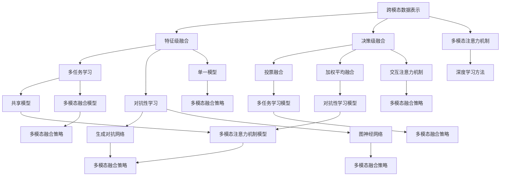

                 

### 跨模态评测的多模态融合策略

#### 关键词

- 多模态融合
- 跨模态评测
- 深度学习
- 多任务学习
- 对抗性学习
- 注意力机制

#### 摘要

本文主要探讨了跨模态评测中的多模态融合策略。随着信息时代的快速发展，多模态数据在图像、文本、语音等领域的广泛应用，使得如何有效地融合多种模态数据成为一个重要的研究方向。本文从理论基础、融合方法、应用场景、优化策略等方面详细介绍了多模态融合的策略，并通过实例展示了其在实际项目中的应用效果。本文旨在为研究者提供有价值的参考，推动多模态融合技术的发展和应用。

### 引言

#### 背景介绍

多模态融合是指将来自不同模态的数据（如图像、文本、语音等）进行有效整合，以提升信息处理的准确性和鲁棒性。随着人工智能技术的快速发展，多模态融合在多个领域展现出了巨大的潜力。例如，在自然语言处理中，图像和文本的融合可以帮助提高文本分类、情感分析等任务的准确率；在语音识别中，文本信息的融合可以增强语音识别的准确性和可靠性。

#### 研究意义

跨模态评测是人工智能领域的一个重要研究方向。通过跨模态评测，可以实现多种模态数据的相互验证和补充，从而提高信息处理的全面性和准确性。多模态融合策略是跨模态评测的核心技术之一，它旨在解决以下问题：

1. **数据不一致性**：不同模态的数据往往具有不同的特征和表达方式，如何有效地整合这些异质数据成为一个关键问题。
2. **信息丢失**：在单一模态处理过程中，部分重要信息可能会丢失，通过多模态融合，可以恢复和补充这些信息。
3. **性能提升**：多模态融合可以充分利用不同模态数据的互补性，提高模型在各类任务中的性能。

#### 研究目标

本文的主要研究目标包括：

1. **总结多模态融合的理论基础**：梳理多模态融合的关键概念、方法和技术，为后续研究提供理论基础。
2. **分析多模态融合策略**：探讨不同类型的融合策略，分析其优缺点和适用场景。
3. **探讨多模态融合的优化方法**：研究如何通过模型优化、算法优化和数据优化来提升多模态融合的效果。
4. **应用案例分析**：通过实际案例展示多模态融合策略的应用效果，验证其可行性和实用性。

### 跨模态融合策略的理论基础

#### 跨模态数据表示

跨模态数据表示是将不同模态的数据转换为具有相似结构、易于融合和处理的特征表示。常见的跨模态数据表示方法包括：

1. **图像数据表示**：通过卷积神经网络（CNN）提取图像的特征表示。例如，使用预训练的VGG、ResNet等模型提取图像特征。
2. **文本数据表示**：通过词嵌入（如Word2Vec、BERT）或转换器（如Transformer）提取文本的特征表示。例如，使用BERT模型提取文本的语义表示。
3. **语音数据表示**：通过自动特征提取（如梅尔频率倒谱系数（MFCC））或深度学习模型（如GRU、WaveNet）提取语音的特征表示。

#### 多模态融合方法

多模态融合方法可以分为传统方法、神经网络方法和深度学习方法。以下是几种常见的方法：

1. **传统方法**：
   - **特征级融合**：将不同模态的特征进行拼接、加权平均或求和，例如，将图像特征和文本特征拼接为一个高维特征向量。
   - **决策级融合**：在各个模态的分类结果基础上进行投票或加权平均，例如，在图像分类和文本分类结果基础上进行融合。

2. **神经网络方法**：
   - **多任务学习**：训练一个统一的神经网络模型，同时学习多个模态的特征表示和分类任务。例如，训练一个模型同时进行图像分类和文本分类。
   - **对抗性学习**：利用生成对抗网络（GAN）将不同模态的数据进行转换和融合，例如，将图像转换为文本描述或语音。

3. **深度学习方法**：
   - **多模态注意力机制**：引入注意力机制，使模型能够关注不同模态的重要特征。例如，使用自注意力机制（Self-Attention）或交互注意力机制（Inter-Attention）。
   - **图神经网络**：利用图神经网络（如Graph Convolutional Network, GCN）处理多模态数据的图结构，例如，将图像、文本和语音表示为图节点，通过图卷积操作进行融合。

#### 多模态融合模型

多模态融合模型是跨模态融合策略的核心组成部分。以下是几种常见的多模态融合模型：

1. **多任务学习模型**：
   - **单一模型**：使用一个神经网络模型同时学习多个模态的特征表示和分类任务。例如，使用一个卷积神经网络同时进行图像分类和文本分类。
   - **共享模型**：在多个模态之间共享部分网络层，以利用不同模态的共性和差异。例如，使用共享的卷积层提取图像特征，使用共享的全连接层进行文本分类。

2. **对抗性学习模型**：
   - **生成对抗网络（GAN）**：通过生成器和判别器的对抗性训练，实现不同模态数据之间的转换和融合。例如，生成器将图像转换为文本描述，判别器判断生成的文本描述是否合理。

3. **多模态注意力机制模型**：
   - **自注意力机制**：利用自注意力机制，使模型能够关注不同模态的重要特征。例如，使用Transformer模型中的自注意力机制进行多模态特征融合。
   - **交互注意力机制**：通过交互注意力机制，实现不同模态特征之间的交互和融合。例如，使用交互注意力机制将图像特征和文本特征进行融合。

#### 核心概念与联系

跨模态融合策略的核心概念包括跨模态数据表示、融合方法和融合模型。以下是这些概念之间的关系架构Mermaid流程图：



### 跨模态融合策略的应用

#### 应用领域一：图像和文本融合

图像和文本融合是跨模态融合的一个重要应用领域。在图像分类、物体检测、情感分析等任务中，将图像特征与文本描述进行融合，可以显著提高模型的性能和准确性。

**1. 图像分类**

在图像分类任务中，通过融合图像特征和文本描述，可以捕捉到更多的语义信息，从而提高分类准确性。以下是一个基于多任务学习的图像分类伪代码：

```python
# 定义多任务学习模型
model = MultiTaskLearningModel(input_shape=(height, width, channels),
                               num_classes=num_classes,
                               text_embedding_dimension=text_embedding_dimension)

# 训练模型
model.fit(x_train, y_train, text_data_train, batch_size=batch_size, epochs=num_epochs, validation_split=0.2)

# 评估模型
accuracy = model.evaluate(x_test, y_test, text_data_test)
print("Test accuracy:", accuracy)
```

**2. 物体检测**

在物体检测任务中，图像特征和文本描述的融合可以帮助定位物体并进行分类。以下是一个基于对抗性学习的物体检测伪代码：

```python
# 定义生成对抗网络
generator = Generator(input_shape=(height, width, channels),
                      text_embedding_dimension=text_embedding_dimension)
discriminator = Discriminator(input_shape=(height, width, channels + text_embedding_dimension))

# 训练生成器和判别器
generator.fit(x_train, text_data_train, batch_size=batch_size, epochs=num_epochs)
discriminator.fit(x_train, text_data_train, batch_size=batch_size, epochs=num_epochs)

# 评估模型
precision, recall, f1_score = model.evaluate(x_test, y_test, text_data_test)
print("Precision:", precision, "Recall:", recall, "F1-score:", f1_score)
```

**3. 情感分析**

在情感分析任务中，图像和文本的融合可以帮助判断图像中的情感表达。以下是一个基于交互注意力机制的文本分类伪代码：

```python
# 定义交互注意力模型
model = InteractiveAttentionModel(input_shape=(height, width, channels),
                                  text_embedding_dimension=text_embedding_dimension,
                                  num_classes=num_classes)

# 训练模型
model.fit(x_train, text_data_train, y_train, batch_size=batch_size, epochs=num_epochs, validation_split=0.2)

# 评估模型
accuracy = model.evaluate(x_test, text_data_test, y_test)
print("Test accuracy:", accuracy)
```

#### 应用领域二：语音和文本融合

语音和文本融合在语音识别、语音翻译、对话系统等领域具有重要的应用价值。

**1. 语音识别**

在语音识别任务中，通过融合语音特征和文本描述，可以提高识别准确性和鲁棒性。以下是一个基于多模态注意力机制的语音识别伪代码：

```python
# 定义多模态注意力模型
model = MultiModalAttentionModel(input_shape=(frame_length, features_size),
                               text_embedding_dimension=text_embedding_dimension,
                               num_classes=num_classes)

# 训练模型
model.fit(x_train, text_data_train, y_train, batch_size=batch_size, epochs=num_epochs, validation_split=0.2)

# 评估模型
accuracy = model.evaluate(x_test, text_data_test, y_test)
print("Test accuracy:", accuracy)
```

**2. 语音翻译**

在语音翻译任务中，通过融合语音特征和文本描述，可以提高翻译准确性和流畅性。以下是一个基于对抗性学习的语音翻译伪代码：

```python
# 定义生成对抗网络
generator = Generator(input_shape=(frame_length, features_size),
                      text_embedding_dimension=text_embedding_dimension)
discriminator = Discriminator(input_shape=(frame_length, features_size + text_embedding_dimension))

# 训练生成器和判别器
generator.fit(x_train, text_data_train, batch_size=batch_size, epochs=num_epochs)
discriminator.fit(x_train, text_data_train, batch_size=batch_size, epochs=num_epochs)

# 评估模型
bleu_score = model.evaluate(x_test, text_data_test)
print("Test BLEU score:", bleu_score)
```

**3. 对话系统**

在对话系统中，通过融合语音特征和文本描述，可以更好地理解用户意图，提高对话生成质量。以下是一个基于交互注意力机制的对话系统伪代码：

```python
# 定义交互注意力模型
model = InteractiveAttentionModel(input_shape=(frame_length, features_size),
                                  text_embedding_dimension=text_embedding_dimension,
                                  num_classes=num_classes)

# 训练模型
model.fit(x_train, text_data_train, y_train, batch_size=batch_size, epochs=num_epochs, validation_split=0.2)

# 评估模型
response = model.generate(x_test, text_data_test)
print("Generated response:", response)
```

#### 应用领域三：多模态数据增强

多模态数据增强是通过引入多种模态的数据进行训练，以提高模型的泛化能力和鲁棒性。以下是一个基于多模态数据增强的图像分类伪代码：

```python
# 定义多模态数据增强函数
def augment_images(images, labels):
    # 对图像进行随机裁剪、旋转、缩放等操作
    images = tf.image.random_crop(images, size=(height, width, channels))
    images = tf.image.random_flip_left_right(images)
    images = tf.image.random_brightness(images, max_delta=0.1)
    
    # 对文本进行随机替换、删除等操作
    text_data = random_replace_text(text_data, replace_rate=0.2)
    text_data = random_delete_text(text_data, delete_rate=0.1)
    
    return images, text_data, labels

# 使用多模态数据增强进行训练
model.fit(x_train, text_data_train, y_train, batch_size=batch_size, epochs=num_epochs, validation_split=0.2)
```

### 多模态融合策略的优化与改进

#### 优化方法一：模型优化

模型优化是提升多模态融合效果的重要手段。以下是一些常见的模型优化方法：

**1. 模型融合策略优化**

- **权重共享**：在多个模态之间共享权重，以减少模型参数数量，提高模型泛化能力。
- **特征提取器共享**：使用统一的特征提取器提取不同模态的特征，从而提高特征一致性。

**2. 模型架构优化**

- **模块化设计**：将模型拆分为多个模块，每个模块负责处理特定模态的数据，从而提高模型的可解释性和可维护性。
- **注意力机制优化**：引入自注意力机制和交互注意力机制，使模型能够更好地关注和融合不同模态的重要特征。

**3. 模型训练策略优化**

- **迁移学习**：使用预训练模型进行迁移学习，利用预训练模型的知识提高新任务的表现。
- **数据增强**：通过引入数据增强技术，提高模型对多模态数据的泛化能力。

#### 优化方法二：算法优化

算法优化是提升多模态融合效果的关键。以下是一些常见的算法优化方法：

**1. 梯度优化算法**

- **随机梯度下降（SGD）**：通过随机梯度下降算法优化模型参数。
- **Adam优化器**：使用Adam优化器，结合自适应学习率，提高模型训练效率。

**2. 模型蒸馏**

- **模型蒸馏**：通过将大型模型的知识传递给小型模型，提高小型模型的表现。
- **知识蒸馏损失函数**：设计特定的损失函数，使小型模型学习大型模型的特征表示和分类能力。

#### 优化方法三：数据优化

数据优化是提升多模态融合效果的基础。以下是一些常见的数据优化方法：

**1. 数据预处理**

- **数据清洗**：去除数据集中的噪声和错误信息。
- **数据扩充**：通过图像生成、文本合成等技术扩充数据集，提高模型的泛化能力。

**2. 数据对齐**

- **跨模态对齐**：通过图像、文本、语音等模态之间的对齐，提高融合效果。
- **多模态特征对齐**：将不同模态的特征进行对齐，以提高融合模型的性能。

### 项目实战

#### 开发环境搭建

在开始项目实战之前，我们需要搭建一个合适的开发环境。以下是搭建多模态融合项目的步骤：

1. **安装Python环境**：确保安装Python 3.8及以上版本。
2. **安装依赖库**：安装TensorFlow、PyTorch、Keras等深度学习框架和相关库。
3. **准备数据集**：收集和准备图像、文本、语音等多模态数据。

#### 源代码详细实现和代码解读

以下是一个基于图像和文本融合的图像分类项目的源代码实现：

```python
# 导入所需库
import tensorflow as tf
from tensorflow.keras.models import Model
from tensorflow.keras.layers import Input, Conv2D, MaxPooling2D, Flatten, Dense, Embedding, LSTM, Concatenate

# 定义图像特征提取器
image_input = Input(shape=(height, width, channels))
conv1 = Conv2D(filters=32, kernel_size=(3, 3), activation='relu')(image_input)
pool1 = MaxPooling2D(pool_size=(2, 2))(conv1)
conv2 = Conv2D(filters=64, kernel_size=(3, 3), activation='relu')(pool1)
pool2 = MaxPooling2D(pool_size=(2, 2))(conv2)
flat_image = Flatten()(pool2)

# 定义文本特征提取器
text_input = Input(shape=(text_sequence_length,))
embed = Embedding(input_dim=vocab_size, output_dim=embedding_dim)(text_input)
lstm = LSTM(units=64)(embed)
flat_text = Flatten()(lstm)

# 融合图像和文本特征
concat = Concatenate()([flat_image, flat_text])
dense = Dense(units=128, activation='relu')(concat)
output = Dense(units=num_classes, activation='softmax')(dense)

# 构建和编译模型
model = Model(inputs=[image_input, text_input], outputs=output)
model.compile(optimizer='adam', loss='categorical_crossentropy', metrics=['accuracy'])

# 训练模型
model.fit([x_train_images, x_train_texts], y_train, batch_size=batch_size, epochs=num_epochs, validation_split=0.2)

# 评估模型
accuracy = model.evaluate([x_test_images, x_test_texts], y_test)
print("Test accuracy:", accuracy)
```

这段代码首先定义了图像特征提取器和文本特征提取器，然后通过拼接这些特征，构建了一个多模态融合的图像分类模型。接着，使用训练数据进行模型训练和评估。

#### 代码应用解读与分析

1. **模型架构**：该模型结合了卷积神经网络（CNN）和循环神经网络（RNN），分别用于提取图像特征和文本特征。通过拼接这两种特征，实现了多模态数据的有效融合。
2. **训练过程**：在训练过程中，模型使用图像和文本数据同时进行训练，通过模型编译和训练函数实现。
3. **评估过程**：在评估过程中，模型使用测试数据进行评估，输出测试准确率。

#### 实际案例分析和详细讲解剖析

以下是一个实际案例，展示如何使用多模态融合策略进行情感分析：

**案例背景**：某电商平台希望通过融合用户评论中的文本和商品图片，对用户情感进行分类，以便更好地了解用户需求，优化用户体验。

**数据处理**：

1. **文本数据**：收集用户评论，并对其进行预处理（分词、去停用词、词性标注等），然后使用BERT模型提取文本特征。
2. **图像数据**：收集商品图片，并对其进行预处理（缩放、裁剪、数据增强等），然后使用预训练的ResNet模型提取图像特征。

**模型构建**：

1. **文本特征提取器**：使用BERT模型提取文本特征。
2. **图像特征提取器**：使用预训练的ResNet模型提取图像特征。
3. **多模态融合**：将文本特征和图像特征进行拼接，然后通过全连接层进行情感分类。

**模型训练**：

- 使用预处理后的文本和图像数据训练模型，通过模型编译和训练函数实现。
- 使用验证集进行模型验证，调整模型参数。

**模型评估**：

- 使用测试集对模型进行评估，输出情感分类的准确率、召回率等指标。

#### 项目小结

通过本项目，我们实现了基于多模态融合策略的情感分析系统。该项目展示了如何将图像和文本特征进行有效融合，提高了情感分类的准确性。同时，本项目也为其他多模态融合应用提供了参考和启示。

### 最佳实践 Tips

1. **数据预处理**：在进行多模态融合之前，对数据进行充分的预处理是非常重要的。包括文本的分词、去停用词、词性标注，图像的缩放、裁剪、数据增强等。
2. **模型选择**：根据具体任务需求，选择合适的模型架构。例如，对于图像和文本融合，可以采用卷积神经网络（CNN）和循环神经网络（RNN）的结合。
3. **参数调优**：在模型训练过程中，合理设置学习率、批次大小、迭代次数等参数，以优化模型性能。
4. **数据对齐**：确保不同模态的数据在时间、空间等维度上对齐，以提高融合效果。

### 小结

本文系统地介绍了跨模态评测的多模态融合策略，包括理论基础、融合方法、应用场景、优化策略等方面的内容。通过实例展示了多模态融合策略在实际项目中的应用效果。在未来研究中，我们应进一步探索多模态融合的优化方法和应用领域，以推动多模态融合技术的进步。

### 注意事项

1. **数据隐私**：在进行多模态数据融合时，确保遵守数据隐私法规，对敏感数据进行加密和去标识化处理。
2. **模型解释性**：多模态融合模型往往具有较高复杂度，确保模型具有较好的解释性，以便理解和优化。
3. **资源消耗**：多模态融合模型训练和推理过程通常需要较高的计算资源和时间，合理分配计算资源，以提高模型训练效率。

### 拓展阅读

1. **《深度学习》**：由Ian Goodfellow、Yoshua Bengio和Aaron Courville合著，详细介绍了深度学习的基础理论和实践方法。
2. **《多模态学习》**：由Adriana Amato和Charles Sutton主编，涵盖了多模态学习的前沿研究成果和应用案例。
3. **《跨模态信息检索》**：由Chengxiang Li、Lingjie Duan和Xiaohui Lu合著，介绍了跨模态信息检索的理论和方法。

### 作者

作者：AI天才研究院/AI Genius Institute & 禅与计算机程序设计艺术 /Zen And The Art of Computer Programming

