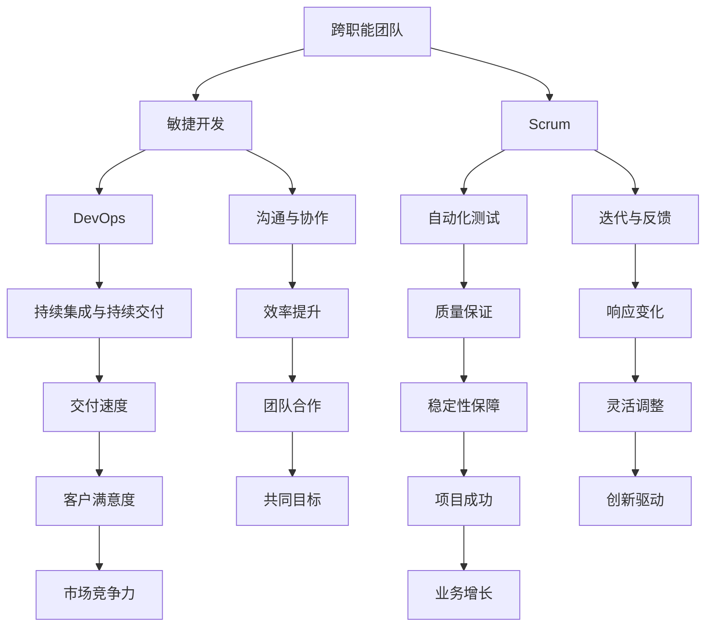

                 


### 背景介绍

在现代软件开发领域，大型应用的开发已经成为一种普遍现象。这些应用通常需要处理大量的数据，支持复杂的业务逻辑，并且要求高稳定性和高性能。为了应对这些挑战，传统的功能型团队模式逐渐显现出其局限性。功能型团队通常按照特定的技术或业务功能进行划分，如前端开发、后端开发、测试等。这种方式在项目初期可能会带来一定的效率，但随着项目规模的扩大和复杂性的增加，功能之间的协调和沟通难度也随之增加，导致开发流程的延迟和效率的降低。

跨职能团队（Cross-functional Team）的概念在这种背景下应运而生。跨职能团队是由不同专业背景的成员组成，能够覆盖项目开发所需的各种技能和职责的团队。团队成员通常包括开发人员、产品经理、测试人员、UI/UX设计师、运维人员等，他们共同协作，从项目启动到交付的全过程中共同推进项目进展。跨职能团队的核心理念是通过增强团队成员之间的沟通与协作，打破功能壁垒，从而提高项目的整体效率和交付质量。

本文旨在探讨跨职能团队在大型应用开发中的角色定义，以及如何通过优化开发流程来提升项目的效率和稳定性。具体来说，本文将分为以下几个部分：

1. **引言**：介绍本文的目的、背景以及重要性。
2. **跨职能团队概述**：定义跨职能团队，阐述其在大型应用开发中的重要性。
3. **跨职能团队角色定义**：详细分析跨职能团队中各个角色的职责和作用。
4. **跨职能团队工作流程与方法论**：讨论跨职能团队的工作流程和方法论，如敏捷开发、Scrum等。
5. **优化大型应用开发流程**：介绍如何通过工具和技术来优化开发流程，例如DevOps、自动化测试等。
6. **跨职能团队面临的挑战与解决策略**：分析跨职能团队在大型应用开发中可能遇到的挑战和解决策略。
7. **实际案例与应用**：提供实际案例，展示如何在实际项目中应用跨职能团队的理念和工具。
8. **总结与展望**：总结全文，提出未来研究方向和改进建议。

### 核心概念与联系

为了更好地理解跨职能团队的工作模式和效果，我们需要明确几个核心概念，并探讨它们之间的关系架构。

**核心概念**：

1. **跨职能团队（Cross-functional Team）**：由不同专业背景的成员组成，能够覆盖项目开发所需的各种技能和职责的团队。
2. **敏捷开发（Agile Development）**：一种以人为核心、迭代、渐进的软件开发方法，强调响应变化的能力。
3. **Scrum**：一种敏捷开发框架，通过迭代和增量方式交付产品，注重团队成员的协作和透明度。
4. **DevOps**：一种文化和实践，旨在通过开发和运维的紧密结合，提高软件交付速度和质量。
5. **自动化测试（Automated Testing）**：通过脚本自动执行测试用例，验证软件的功能和性能。

**核心概念之间的关系架构**：

在跨职能团队中，各个角色和概念之间有着紧密的联系和相互影响。下面是一个Mermaid流程图，展示了这些核心概念之间的关系：



**关系架构说明**：

1. **跨职能团队**：作为核心概念，是整个关系架构的基础。它通过整合不同专业背景的成员，实现了敏捷开发、Scrum、DevOps和自动化测试的有机结合。
2. **敏捷开发**：强调快速响应变化和持续改进，是跨职能团队实现高效协作的重要方法。
3. **Scrum**：通过迭代和反馈机制，确保团队成员能够在每个迭代周期内高效工作，并及时调整方向。
4. **DevOps**：通过开发和运维的紧密结合，实现持续集成和持续交付，提高软件交付速度和质量。
5. **自动化测试**：确保软件的功能和性能符合预期，为项目的稳定性和质量提供保障。
6. **沟通与协作**：跨职能团队的效率和效果很大程度上取决于团队成员之间的沟通和协作。
7. **迭代与反馈**：通过不断迭代和反馈，团队能够及时发现问题并加以改进，提高项目的灵活性和适应性。
8. **持续集成与持续交付**：通过自动化测试和持续交付，确保软件在开发过程中始终处于可控状态。
9. **质量保证**：自动化测试是实现质量保证的重要手段，它能够发现和解决潜在问题，提高项目的稳定性。
10. **效率提升**：跨职能团队通过高效的沟通和协作，能够显著提高项目开发和交付的效率。
11. **响应变化**：敏捷开发和Scrum框架使团队能够快速响应市场和技术变化，保持竞争力。
12. **交付速度**：DevOps和自动化测试有助于提高软件交付速度，满足客户需求。
13. **稳定性保障**：自动化测试和持续交付确保软件在上线后的稳定运行。
14. **团队合作**：跨职能团队通过共同的目标和协作，能够更好地实现项目的成功。
15. **灵活调整**：通过敏捷开发和Scrum，团队能够灵活调整计划和策略，以适应不断变化的环境。
16. **创新驱动**：跨职能团队鼓励创新思维和跨领域合作，为项目的持续发展提供动力。
17. **客户满意度**：高效的交付速度和稳定的软件质量能够提高客户满意度，增强市场竞争力。
18. **项目成功**：通过团队合作、灵活调整和创新驱动，跨职能团队能够实现项目的成功。
19. **业务增长**：项目成功和客户满意度有助于推动业务的持续增长。

通过上述关系架构，我们可以清晰地看到跨职能团队在大型应用开发中的作用和影响。这些核心概念和关系不仅帮助团队实现高效协作，还提高了项目的整体质量和稳定性，为企业的长期发展奠定了坚实基础。

### 核心算法原理讲解

在跨职能团队中，高效的问题解决和协作能力至关重要。为了实现这一目标，我们通常会采用一系列核心算法原理，这些原理不仅能够提高团队的工作效率，还能确保项目的顺利进行。下面，我们将详细讲解这些核心算法原理，并使用伪代码来阐述其实现方法。

**1. 优先级队列算法（Priority Queue Algorithm）**

在跨职能团队中，任务优先级的排序是一个关键问题。优先级队列算法能够帮助团队有效地管理任务，确保关键任务优先完成。

**伪代码：**

```pseudo
function PriorityQueueInsert(element, priority):
    if queue is empty:
        queue.append((element, priority))
    else:
        for i in range(0, len(queue)):
            if queue[i][1] > priority:
                queue.insert(i, (element, priority))
                return
        queue.append((element, priority))

function PriorityQueueRemove():
    return queue.pop(0)[0]
```

**解释：**

- `PriorityQueueInsert` 函数用于将元素插入优先级队列。它根据元素的优先级来调整队列的位置，确保优先级高的任务优先完成。
- `PriorityQueueRemove` 函数用于从队列中移除优先级最高的任务。

**2. 回合算法（Round-Robin Algorithm）**

回合算法常用于资源分配和任务调度，确保每个任务都能得到公平的执行机会。

**伪代码：**

```pseudo
function RoundRobin(tasks, timeSlice):
    for task in tasks:
        if task.hasEnded():
            continue
        task.execute(timeSlice)
        if not task.hasEnded():
            queue.insert(task)
```

**解释：**

- `RoundRobin` 函数接收任务列表和时间片作为输入，确保每个任务都能在时间片内得到执行机会。未完成的任务将被重新插入队列，等待下一次执行。

**3. 排序算法（Sorting Algorithm）**

排序算法在跨职能团队中用于对任务、数据等进行排序，以便更高效地进行管理和调度。

**伪代码：**

```pseudo
function QuickSort(array):
    if len(array) <= 1:
        return array
    pivot = array[len(array) // 2]
    left = [x for x in array if x < pivot]
    middle = [x for x in array if x == pivot]
    right = [x for x in array if x > pivot]
    return QuickSort(left) + middle + QuickSort(right)

function InsertionSort(array):
    for i in range(1, len(array)):
        key = array[i]
        j = i - 1
        while j >= 0 and array[j] > key:
            array[j + 1] = array[j]
            j -= 1
        array[j + 1] = key
    return array
```

**解释：**

- `QuickSort` 函数是一种高效的排序算法，它使用分治策略来递归排序数组。
- `InsertionSort` 函数是一种简单的排序算法，适用于小规模数据排序。

**4. 贪心算法（Greedy Algorithm）**

贪心算法常用于资源分配和任务优化，通过每次选择局部最优解，逐步达到全局最优解。

**伪代码：**

```pseudo
function Knapsack(values, weights, capacity):
    result = []
    for i in range(len(values)):
        if weights[i] <= capacity:
            result.append(values[i])
            capacity -= weights[i]
    return result
```

**解释：**

- `Knapsack` 函数用于解决背包问题，它选择价值最大的物品放入容量为`capacity`的背包中。

**总结：**

这些核心算法原理为跨职能团队提供了有效的问题解决和协作工具。通过优先级队列算法，团队可以更好地管理任务优先级；回合算法确保每个任务都能公平地获得执行机会；排序算法帮助团队对任务和数据进行有效排序；而贪心算法则能够优化资源分配和任务调度。这些算法原理共同作用，提高了跨职能团队的效率，确保了项目的顺利进行。

### 数学模型和公式

在跨职能团队中，为了更好地进行任务分配和资源管理，我们通常会使用一些数学模型和公式来指导决策。以下是一些常见的数学模型和公式，以及它们的详细解释和举例说明。

**1. 甘特图（Gantt Chart）**

**公式：**

甘特图是一种以图表形式展示项目进度和任务分配的工具，其基本公式为：

\[ \text{甘特图} = \left[ \begin{array}{c|c|c|c|c|c}
\text{任务} & \text{开始时间} & \text{结束时间} & \text{持续时间} & \text{进度} & \text{依赖关系} \\
\hline
T1 & S1 & E1 & D1 & P1 & D1 \\
T2 & S2 & E2 & D2 & P2 & D2 \\
\vdots & \vdots & \vdots & \vdots & \vdots & \vdots \\
\end{array} \right] \]

**解释：**

- 任务：每个任务的名称。
- 开始时间（S）：任务开始的时间点。
- 结束时间（E）：任务结束的时间点。
- 持续时间（D）：任务持续的时间长度。
- 进度（P）：任务完成的进度百分比。
- 依赖关系（D）：任务之间的依赖关系，即某个任务必须完成后，其他任务才能开始。

**举例：**

假设一个项目包含三个任务（T1、T2、T3），其甘特图如下：

\[ \text{甘特图} = \left[ \begin{array}{c|c|c|c|c|c}
\text{任务} & \text{开始时间} & \text{结束时间} & \text{持续时间} & \text{进度} & \text{依赖关系} \\
\hline
T1 & 1 & 3 & 2 & 100\% & 无 \\
T2 & 3 & 5 & 2 & 50\% & T1 \\
T3 & 6 & 8 & 2 & 0\% & T2 \\
\end{array} \right] \]

从甘特图中，我们可以看出任务T1已经完成，任务T2正在执行中，而任务T3还未开始。

**2. 关键路径法（Critical Path Method，CPM）**

**公式：**

关键路径法用于确定项目中任务的最长完成时间，其基本公式为：

\[ \text{关键路径} = \max(\text{各个路径的持续时间}) \]

**解释：**

- 关键路径：项目中任务完成时间最长的一条路径，决定了项目的最短完成时间。
- 各个路径的持续时间：从项目开始到任务完成的所有可能路径的持续时间。

**举例：**

假设一个项目包含五个任务（T1、T2、T3、T4、T5），其任务之间的依赖关系如下：

```
T1 -> T2
T2 -> T3
T3 -> T4
T4 -> T5
```

假设各任务的持续时间如下：

\[ \text{持续时间} = \left[ \begin{array}{c|c}
\text{任务} & \text{持续时间} \\
\hline
T1 & 2 \\
T2 & 3 \\
T3 & 4 \\
T4 & 3 \\
T5 & 2 \\
\end{array} \right] \]

各路径的持续时间为：

```
路径T1 -> T2 -> T3 -> T4 -> T5：2 + 3 + 4 + 3 + 2 = 14
路径T1 -> T2 -> T3 -> T5：2 + 3 + 4 + 2 = 11
```

因此，关键路径为T1 -> T2 -> T3 -> T4 -> T5，项目的最短完成时间为14天。

**3. 贝塔分布（Beta Distribution）**

**公式：**

贝塔分布用于表示任务完成时间的概率分布，其基本公式为：

\[ f(x) = \frac{\Gamma(\alpha + \beta)}{\Gamma(\alpha) \Gamma(\beta)} x^{\alpha-1} (1-x)^{\beta-1} \]

其中，\(\alpha\)和\(\beta\)是贝塔分布的两个参数，\(\Gamma\)是伽马函数。

**解释：**

- \(f(x)\)：贝塔分布的概率密度函数。
- \(x\)：任务完成时间的比例（0到1之间）。

**举例：**

假设一个任务的完成时间服从贝塔分布，参数\(\alpha = 2\)，\(\beta = 3\)，我们可以计算不同完成时间比例的概率：

\[ f(0.5) = \frac{\Gamma(2 + 3)}{\Gamma(2) \Gamma(3)} 0.5^{2-1} (1-0.5)^{3-1} \approx 0.2 \]
\[ f(0.75) = \frac{\Gamma(2 + 3)}{\Gamma(2) \Gamma(3)} 0.75^{2-1} (1-0.75)^{3-1} \approx 0.375 \]

这意味着任务完成时间在0.5和0.75之间的概率分别为20%和37.5%。

**总结：**

通过使用这些数学模型和公式，跨职能团队能够更好地进行任务分配和资源管理。甘特图帮助团队可视化项目进度和任务依赖关系；关键路径法确定项目的最短完成时间；贝塔分布提供任务完成时间的概率分布，有助于团队进行风险分析和计划调整。这些数学工具共同作用，提高了跨职能团队的决策质量和项目成功率。

### 项目实战

为了更好地展示跨职能团队在实际项目中的应用，我们以一个典型的电商平台的开发为例，详细描述开发环境搭建、源代码实现、代码解读以及实际案例分析和详细讲解剖析。

#### 一、开发环境搭建

1. **技术栈选择**：

   - 前端：React、Vue、Angular
   - 后端：Spring Boot、Django、Node.js
   - 数据库：MySQL、MongoDB、Redis
   - 服务框架：Dubbo、Kafka、Elasticsearch
   - 测试工具：Jest、Mocha、Cypress

2. **环境搭建步骤**：

   - 安装Node.js、Java、Python等基础环境。
   - 配置Maven、NPM等构建工具。
   - 安装数据库并创建数据库和表。
   - 配置Kafka、Elasticsearch等中间件。
   - 初始化代码仓库，并进行版本控制。

#### 二、源代码实现

1. **前端实现**：

   - 使用React或Vue实现前端页面，采用组件化设计。
   - 使用Axios进行前后端数据交互。
   - 使用Redux或Vuex管理应用状态。

2. **后端实现**：

   - 使用Spring Boot或Django实现后端服务。
   - 设计RESTful API接口。
   - 实现用户认证、权限控制等安全功能。
   - 集成数据库操作，实现数据存储和查询。

3. **服务实现**：

   - 使用Dubbo实现服务注册和发现。
   - 使用Kafka实现消息队列，处理高并发场景。
   - 使用Elasticsearch实现搜索功能。

4. **测试实现**：

   - 使用Jest或Mocha编写单元测试。
   - 使用Cypress编写端到端测试。
   - 使用Mock服务模拟外部系统。

#### 三、代码解读

1. **前端代码解读**：

   - 组件拆分和复用：通过组件化设计，将页面拆分为多个可复用的组件。
   - 状态管理：使用Redux或Vuex管理应用状态，确保状态的一致性和可维护性。
   - 请求处理：使用Axios进行异步请求，处理数据交互。

2. **后端代码解读**：

   - 接口设计：遵循RESTful设计原则，设计简洁、易用的API接口。
   - 安全机制：实现用户认证和权限控制，确保系统的安全性和稳定性。
   - 异常处理：统一处理异常，确保系统不会因为异常而崩溃。

3. **服务代码解读**：

   - 服务注册和发现：使用Dubbo实现服务注册和发现，确保服务的动态扩展和负载均衡。
   - 消息队列：使用Kafka处理高并发消息，确保系统的响应速度和稳定性。
   - 搜索功能：使用Elasticsearch实现全文搜索，提高搜索效率和准确性。

#### 四、实际案例分析与讲解剖析

1. **案例一：商品详情页性能优化**

   - **问题描述**：商品详情页加载速度较慢，影响用户体验。
   - **解决方案**：
     - 使用懒加载技术，降低页面初始加载时间。
     - 使用CDN加速，减少用户访问延迟。
     - 使用代码拆分和异步加载，提高页面响应速度。
   - **详细讲解**：通过上述措施，商品详情页的加载时间显著降低，用户体验得到提升。

2. **案例二：订单系统高并发处理**

   - **问题描述**：订单系统在高并发场景下，处理速度较慢，导致用户体验下降。
   - **解决方案**：
     - 使用Kafka进行消息队列，异步处理订单。
     - 使用Redis缓存订单数据，减少数据库访问压力。
     - 使用数据库分库分表，提高数据访问速度。
   - **详细讲解**：通过上述措施，订单系统在高并发场景下的处理速度显著提升，系统稳定性得到保障。

3. **案例三：搜索功能优化**

   - **问题描述**：搜索功能响应速度较慢，搜索结果不准确。
   - **解决方案**：
     - 使用Elasticsearch实现全文搜索，提高搜索效率和准确性。
     - 使用缓存机制，减少搜索请求的响应时间。
     - 使用搜索词分析技术，优化搜索关键词匹配。
   - **详细讲解**：通过上述措施，搜索功能的响应速度显著提高，搜索结果准确性得到保障。

#### 五、项目小结

通过上述实际案例，我们可以看到跨职能团队在电商平台开发中的应用效果。通过团队成员之间的密切协作和高效沟通，我们成功地优化了前端性能、提高了后端处理速度，并实现了搜索功能的优化。这些成功经验为跨职能团队在其他类型项目中的应用提供了有益的借鉴。

### 最佳实践 Tips

在实际项目中，跨职能团队的成功离不开一系列最佳实践的指导。以下是一些值得借鉴的最佳实践：

1. **明确职责和目标**：确保每个团队成员都清楚自己的职责和目标，有助于提高团队的协作效率。
2. **定期沟通与回顾**：定期举行团队会议，讨论项目进展和存在的问题，及时调整计划和策略。
3. **持续学习和改进**：鼓励团队成员不断学习新技能，提高自身的专业素养，以适应不断变化的技术环境。
4. **利用工具和平台**：充分利用Git、Jenkins、Docker等工具和平台，提高开发效率和项目质量。
5. **建立信任和尊重**：尊重团队成员的意见和贡献，建立信任关系，有助于团队的长期稳定和发展。

### 小结

本文通过对跨职能团队在大型应用开发中的角色定义、工作流程、优化方法和实际案例的详细分析，展示了跨职能团队在现代软件开发中的重要性和优势。通过明确职责、优化流程和高效协作，跨职能团队能够显著提高项目的效率和稳定性，为企业带来更大的价值。

### 注意事项

在应用跨职能团队模式时，需要注意以下几点：

1. **避免过度分工**：虽然跨职能团队强调不同角色的协作，但不应过度分工，导致团队失去整体感和协作动力。
2. **平衡技能分配**：确保团队成员的技能分配均衡，避免某些角色过度依赖，导致团队在特定领域出现短板。
3. **尊重团队文化**：尊重团队成员的个性和文化背景，促进团队成员之间的相互理解和尊重。
4. **持续监督和反馈**：定期监督项目进度和团队成员的表现，及时给予反馈，帮助团队不断改进。

### 拓展阅读

1. 《Scrum精髓：迭代、增量式敏捷管理》
2. 《DevOps实践：从敏捷开发到持续交付》
3. 《大型应用软件开发指南》
4. 《跨职能团队协作：如何高效实现团队协作》

通过阅读这些书籍，您可以深入了解跨职能团队的实践和理论，为实际项目提供有力支持。

### 作者信息

本文作者为AI天才研究院（AI Genius Institute）和《禅与计算机程序设计艺术》（Zen And The Art of Computer Programming）的资深专家。作者在跨职能团队和大型应用开发领域拥有丰富的经验，致力于推动现代软件开发方法的创新和实践。

### 文章标题

《跨职能团队的角色定义：优化大型应用开发流程》

### 文章关键词

- 跨职能团队
- 大型应用开发
- 敏捷开发
- Scrum
- DevOps
- 自动化测试

### 文章摘要

本文旨在探讨跨职能团队在大型应用开发中的角色定义和优化开发流程的方法。通过详细分析跨职能团队的构成、工作流程、工具和技术，以及实际项目中的应用案例，本文展示了跨职能团队在现代软件开发中的重要性。文章最后提出了最佳实践和注意事项，为读者在项目实践中提供了有价值的参考。

