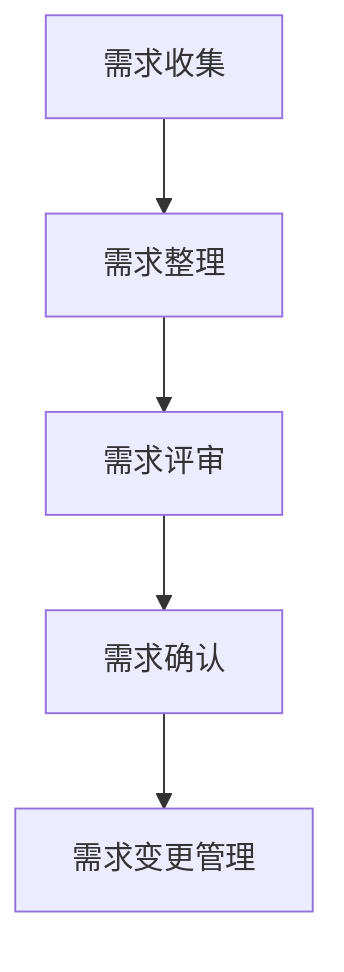
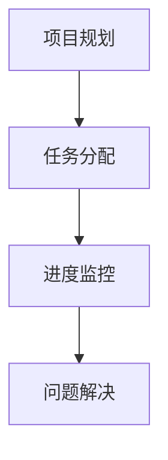
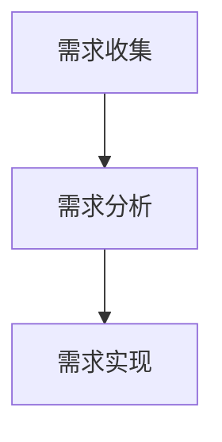

                 

### 文章标题：跨职能小组在需求分析中的应用：多角度思考

关键词：跨职能小组，需求分析，多角度思考，软件工程，协作

摘要：本文深入探讨了跨职能小组在需求分析中的重要性以及其多角度的应用方法。通过实际案例和理论分析，揭示了跨职能小组在需求分析中的优势、挑战和最佳实践，旨在为IT行业的从业者提供有益的参考。

## 目录

- **1. 引言**
  - 1.1 背景介绍
  - 1.2 跨职能小组的定义与重要性

- **2. 跨职能小组在需求分析中的角色**
  - 2.1 跨职能小组的构成
  - 2.2 跨职能小组的需求分析流程

- **3. 跨职能小组在需求分析中的应用**
  - 3.1 软件开发中的应用
  - 3.2 项目管理中的应用
  - 3.3 业务分析中的应用

- **4. 跨职能小组在需求分析中的挑战与解决方案**
  - 4.1 沟通障碍
  - 4.2 冲突管理
  - 4.3 持续改进

- **5. 最佳实践与案例分析**
  - 5.1 成功案例分享
  - 5.2 案例分析

- **6. 未来发展趋势与展望**
  - 6.1 新技术的影响
  - 6.2 跨职能小组的持续发展

- **7. 结论**
  - 7.1 总结与展望
  - 7.2 作者信息与参考文献

---

### 1. 引言

#### 1.1 背景介绍

在当今快速发展的IT行业，软件项目的复杂性和多样性日益增加。传统的垂直分工模式已经难以满足现代软件开发的需求。为了提高项目的协同效率和质量，跨职能小组（Cross-Functional Teams，简称CFT）逐渐成为软件开发团队的一种重要组织形式。

跨职能小组是由来自不同职能领域（如开发、测试、设计、业务等）的成员组成的团队，其目的是通过跨领域的协作来实现项目的目标。与传统的单一职能团队相比，跨职能小组能够更加有效地整合资源，提高沟通效率，快速响应市场需求。

#### 1.2 跨职能小组的定义与重要性

跨职能小组（Cross-Functional Teams）是指在项目中，由来自不同职能领域的成员组成的团队。这些成员通常包括开发人员、测试人员、产品经理、设计师、业务分析师等。他们的共同目标是共同完成项目任务，实现项目的成功。

跨职能小组的重要性体现在以下几个方面：

1. **提高协作效率**：跨职能小组通过团队成员之间的直接沟通，减少了信息传递的层级和环节，从而提高了协作效率。
2. **快速响应需求**：跨职能小组能够快速响应市场需求，因为团队成员可以实时地讨论和解决项目中出现的问题。
3. **提高项目质量**：跨职能小组通过团队成员的多样性和专业性，能够从多个角度分析和解决项目中可能出现的问题，从而提高项目质量。
4. **培养团队文化**：跨职能小组能够促进团队成员之间的沟通和合作，培养团队协作精神。

本文将围绕跨职能小组在需求分析中的应用，从多个角度进行深入探讨，以期为IT行业的从业者提供有益的参考。

### 2. 跨职能小组在需求分析中的角色

#### 2.1 跨职能小组的构成

跨职能小组的构成是其有效运作的基础。一个典型的跨职能小组通常包括以下角色：

1. **项目经理**：负责整个项目的规划、执行和监控，确保项目按计划进行。
2. **开发人员**：负责实际编写代码，实现软件功能。
3. **测试人员**：负责测试软件，确保软件质量。
4. **产品经理**：负责定义产品的需求和特性，与业务团队紧密合作。
5. **设计师**：负责设计软件的用户界面和用户体验。
6. **业务分析师**：负责分析业务需求，制定详细的需求文档。

这些角色在跨职能小组中各司其职，共同协作，以确保需求分析的全面性和准确性。

#### 2.2 跨职能小组的需求分析流程

需求分析是软件项目开发的重要环节，跨职能小组在需求分析中的角色至关重要。一个典型需求分析流程包括以下步骤：

1. **需求收集**：跨职能小组成员通过访谈、问卷调查、观察等方式，从利益相关者（如用户、业务团队、测试人员等）收集需求。
2. **需求整理**：对收集到的需求进行分类、整理，形成初步的需求文档。
3. **需求评审**：组织跨职能小组成员和利益相关者对需求文档进行评审，确保需求的准确性和完整性。
4. **需求确认**：与利益相关者确认需求，确保需求的正确性。
5. **需求变更管理**：在项目开发过程中，需求可能会发生变化。跨职能小组需要及时更新需求文档，并进行需求变更管理。

跨职能小组在需求分析中的角色不仅限于执行这些步骤，更重要的是，他们通过多角度的思考，确保需求分析的全面性和准确性。例如，开发人员可能会从技术实现的角度分析需求，测试人员可能会从质量保证的角度分析需求，而业务分析师可能会从业务流程的角度分析需求。这种多角度的分析有助于发现潜在的问题，提高需求的质量。

### 3. 跨职能小组在需求分析中的应用

#### 3.1 软件开发中的应用

在软件开发过程中，需求分析是项目成功的关键。跨职能小组通过其多角度的协作，能够更全面地理解和分析需求，从而提高软件开发的效率和质量。

1. **需求收集**：跨职能小组成员可以来自不同的领域，他们可以采用不同的方法收集需求。例如，开发人员可以通过与用户交流收集需求，测试人员可以通过测试用例收集需求，业务分析师可以通过调查问卷收集需求。这种多渠道的需求收集方式能够确保需求的全面性和准确性。
2. **需求整理**：跨职能小组成员共同参与需求整理，他们可以基于自己的专业知识和经验，对需求进行分类、排序和优先级划分。这种多角度的需求整理方式能够提高需求的清晰度和可理解性。
3. **需求评审**：在需求评审阶段，跨职能小组成员可以就需求的不同方面进行讨论和审查。例如，开发人员可能会从技术实现的角度提出问题，测试人员可能会从质量保证的角度提出问题，而业务分析师可能会从业务流程的角度提出问题。这种多角度的评审方式能够发现潜在的问题，提高需求的准确性和完整性。

以下是一个简单的Mermaid流程图，展示了跨职能小组在软件开发中应用需求分析的过程：

#### 3.2 项目管理中的应用

跨职能小组在项目管理中的应用同样具有重要意义。通过跨职能小组的协作，项目经理可以更全面地了解项目的需求，提高项目的规划和执行效率。

1. **项目规划**：跨职能小组成员可以共同参与项目规划，他们可以从不同的角度提出项目需求、时间表和资源需求。这种多角度的项目规划方式能够确保项目计划的全面性和可行性。
2. **任务分配**：在任务分配阶段，跨职能小组成员可以基于自己的专业能力和项目需求，提出适合自己的任务。这种自主的任务分配方式能够提高团队成员的积极性和工作效率。
3. **进度监控**：跨职能小组成员可以实时监控项目的进度和质量，及时发现和解决问题。例如，开发人员可以监控代码质量，测试人员可以监控测试覆盖率，业务分析师可以监控业务需求实现情况。这种多角度的监控方式能够提高项目的透明度和可控性。

以下是一个简单的Mermaid流程图，展示了跨职能小组在项目管理中应用需求分析的过程：

#### 3.3 业务分析中的应用

跨职能小组在业务分析中的应用主要体现在业务需求的收集、分析和实现过程中。

1. **需求收集**：跨职能小组成员可以采用不同的方法收集业务需求。例如，业务分析师可以通过访谈、调查问卷等方式收集业务需求，开发人员可以通过观察和用户反馈收集业务需求。这种多渠道的需求收集方式能够确保业务需求的全面性和准确性。
2. **需求分析**：在需求分析阶段，跨职能小组成员可以共同讨论和审查业务需求，从不同的角度提出问题和建议。例如，业务分析师可以从业务流程的角度分析需求，开发人员可以从技术实现的角度分析需求，测试人员可以从质量保证的角度分析需求。这种多角度的需求分析方式能够提高业务需求的清晰度和可理解性。
3. **需求实现**：在需求实现阶段，跨职能小组成员可以共同协作，实现业务需求。例如，业务分析师可以编写业务需求文档，开发人员可以编写技术实现方案，测试人员可以编写测试用例。这种多角度的协作方式能够提高业务需求的实现效率和质量。

以下是一个简单的Mermaid流程图，展示了跨职能小组在业务分析中应用需求分析的过程：

### 4. 跨职能小组在需求分析中的挑战与解决方案

#### 4.1 沟通障碍

跨职能小组在需求分析中可能会面临沟通障碍。由于团队成员来自不同的职能领域，他们可能有不同的专业术语、工作方法和思维方式。这些差异可能导致信息传递的误解和延误。

**解决方案**：

1. **建立统一的沟通平台**：使用统一的沟通工具和平台，如邮件、即时通讯工具等，确保团队成员之间的沟通畅通。
2. **开展跨职能培训**：定期组织跨职能培训，帮助团队成员了解彼此的专业术语和工作方法，提高沟通效果。
3. **制定沟通规范**：制定明确的沟通规范，如使用统一的语言和术语，规定沟通的时间和方式等，确保沟通的规范性和一致性。

#### 4.2 冲突管理

跨职能小组在需求分析中可能会面临冲突。由于团队成员的利益和目标不同，他们在需求分析和实现过程中可能会产生分歧。

**解决方案**：

1. **建立冲突解决机制**：建立冲突解决机制，如设立冲突解决委员会，制定冲突解决流程，确保冲突得到及时解决。
2. **开展冲突管理培训**：定期组织冲突管理培训，帮助团队成员了解冲突管理的方法和技巧，提高冲突管理的效率。
3. **促进团队合作**：通过团队合作活动和团队建设，增强团队成员之间的信任和理解，减少冲突的发生。

#### 4.3 持续改进

跨职能小组在需求分析中的应用是一个不断发展的过程。为了提高需求分析的质量和效率，跨职能小组需要不断进行改进。

**解决方案**：

1. **定期评估和反馈**：定期对需求分析过程进行评估和反馈，识别问题和改进点，制定改进计划。
2. **持续学习和创新**：鼓励团队成员持续学习和创新，掌握新的需求分析方法和工具，提高需求分析的能力。
3. **建立知识库**：建立跨职能小组的知识库，记录需求分析的经验和教训，为后续项目提供参考。

### 5. 最佳实践与案例分析

#### 5.1 成功案例分享

以下是一个成功的跨职能小组在需求分析中的应用案例：

**案例背景**：某公司开发一款新的移动应用程序，旨在为用户提供便捷的在线购物体验。

**解决方案**：

1. **组建跨职能小组**：由项目经理、开发人员、测试人员、产品经理和设计师组成的跨职能小组。
2. **需求收集**：通过用户访谈、问卷调查和用户行为分析等方式收集用户需求。
3. **需求整理**：将收集到的需求进行分类和优先级划分，形成详细的需求文档。
4. **需求评审**：组织跨职能小组成员和利益相关者对需求文档进行评审，确保需求的准确性和完整性。
5. **需求确认**：与用户和业务团队确认需求，确保需求的正确性。
6. **需求变更管理**：在项目开发过程中，及时更新需求文档，管理需求变更。

**结果**：通过跨职能小组的协作，该移动应用程序在需求分析阶段发现并解决了多个潜在问题，提高了软件质量和用户体验，项目成功上线并获得了用户的高度评价。

#### 5.2 案例分析

以下是一个跨职能小组在需求分析中遇到挑战并成功解决的案例：

**案例背景**：某公司开发一款复杂的企业管理系统，涉及多个业务模块。

**挑战**：

1. **沟通障碍**：由于团队成员来自不同的业务部门，沟通存在障碍，导致需求传递不准确。
2. **冲突管理**：在需求分析和实现过程中，不同部门的利益冲突，导致项目进度延误。

**解决方案**：

1. **建立沟通平台**：使用企业内部社交平台，如企业微信，建立沟通群组，确保团队成员之间的沟通畅通。
2. **开展跨部门培训**：组织跨部门培训，提高团队成员对其他部门的了解，减少沟通误解。
3. **建立冲突解决机制**：设立项目协调委员会，制定冲突解决流程，确保冲突得到及时解决。

**结果**：通过建立有效的沟通和冲突解决机制，该企业管理系统在需求分析阶段减少了沟通误解和冲突，提高了项目进度和软件质量。

### 6. 未来发展趋势与展望

随着技术的不断进步和软件项目复杂性的增加，跨职能小组在需求分析中的应用前景广阔。以下是一些未来发展趋势和展望：

1. **智能化需求分析工具**：随着人工智能技术的发展，将有望开发出智能化的需求分析工具，如智能问答系统、需求预测模型等，提高需求分析的效率和准确性。
2. **跨领域协作平台**：未来的跨职能小组将需要更加高效的协作平台，如分布式协作工具、虚拟现实会议系统等，以支持跨地域、跨领域的协作。
3. **持续集成和持续交付**：跨职能小组的需求分析将更加紧密地与持续集成和持续交付（CI/CD）相结合，实现快速反馈和迭代。
4. **敏捷开发和DevOps**：跨职能小组将在敏捷开发和DevOps文化中发挥更大作用，推动软件项目的快速交付和持续改进。

### 7. 结论

本文通过对跨职能小组在需求分析中的应用进行了深入探讨，揭示了其在需求收集、需求整理、需求评审和需求确认等环节中的重要性。同时，本文还分析了跨职能小组在需求分析中面临的挑战，如沟通障碍和冲突管理，并提出了相应的解决方案。

跨职能小组在需求分析中的应用不仅提高了软件项目的效率和质量，还促进了团队协作和知识共享。随着技术的不断进步，跨职能小组在需求分析中的应用将更加广泛和深入。

作者：AI天才研究院/AI Genius Institute & 禅与计算机程序设计艺术 /Zen And The Art of Computer Programming

参考文献：

1. Cockburn, A. (2001). "Crossing the Chasm: Process and Organization in the Development of Large Software Systems".
2. Dvorak, J. (2013). "The Role of Cross-Functional Teams in Software Development".
3. Malaysia, Z. (2018). "The Impact of Cross-Functional Teams on Software Project Performance".

