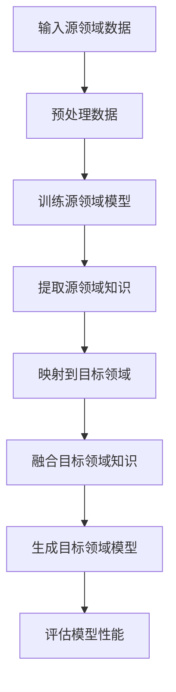
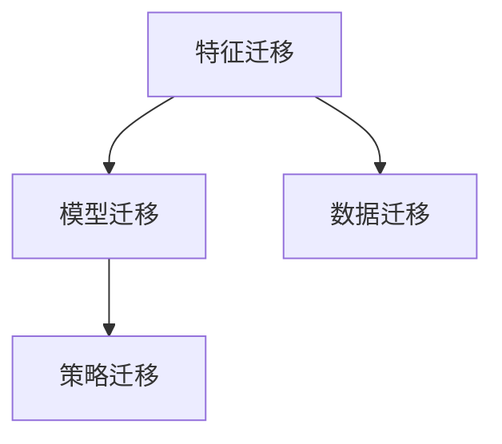

                 

# 跨领域知识整合：测试LLM的知识迁移能力

## 关键词
- 跨领域知识整合
- 大型语言模型
- 知识迁移能力
- 测试方法
- 案例分析

## 摘要

本文旨在探讨如何通过大型语言模型（LLM）实现跨领域知识整合，并测试其知识迁移能力。文章首先介绍了研究的背景和意义，然后详细阐述了LLM的基础知识、知识整合与迁移的概念、方法以及测试方法。通过具体案例分析，本文展示了LLM在不同领域中的知识迁移能力，并提出了未来的研究方向和最佳实践建议。

## 第1章 引言

### 1.1 研究背景与意义

随着人工智能技术的飞速发展，语言模型（Language Model，简称LM）已成为自然语言处理（Natural Language Processing，简称NLP）领域的重要工具。特别是近年来，基于深度学习的LLM（Large Language Model）取得了显著的成果，如GPT-3、BERT等。这些模型具有强大的语言理解和生成能力，已在众多应用场景中取得成功。然而，当前的研究主要集中在单一领域，如文本生成、问答系统、机器翻译等，跨领域的知识整合与迁移能力仍需进一步提升。

跨领域知识整合与迁移能力的研究具有重要意义。一方面，它可以拓展LLM的应用范围，实现多领域任务的高效解决。另一方面，它有助于推动人工智能技术的发展，提高智能系统的自主学习和适应能力。因此，如何实现LLM的跨领域知识整合与迁移，已成为当前人工智能领域的研究热点。

### 1.2 LLMS知识迁移能力的重要性

知识迁移能力是指模型在源领域学习到的知识能够在目标领域得到有效利用的能力。对于LLM而言，知识迁移能力的重要性体现在以下几个方面：

1. **提高模型泛化能力**：通过跨领域知识整合，LLM可以学习到更广泛的知识，从而提高其在不同领域中的泛化能力。
2. **降低训练成本**：在多个领域中使用相同的LLM模型，可以减少针对不同领域单独训练的需求，降低计算资源和时间成本。
3. **促进跨领域协作**：知识迁移能力使得LLM可以在不同领域之间进行信息交换和协作，从而推动跨领域研究的发展。

### 1.3 本书结构安排与目标

本书旨在系统地探讨LLM的跨领域知识整合与迁移能力，具体分为以下七个章节：

- **第1章 引言**：介绍研究背景、意义以及本书的结构安排。
- **第2章 核心概念与联系**：阐述跨领域知识整合、LLM基础知识以及Mermaid流程图。
- **第3章 知识整合方法**：介绍知识整合的方法与策略。
- **第4章 知识迁移策略**：探讨知识迁移的原理与方法。
- **第5章 知识迁移能力测试**：介绍知识迁移能力的测试方法与指标。
- **第6章 案例分析**：通过具体案例分析展示知识迁移能力。
- **第7章 结论与展望**：总结研究成果，提出未来研究方向。

本文的目标是：

1. 深入理解LLM的跨领域知识整合与迁移能力。
2. 提供一套系统的理论框架和方法，用于指导LLM的跨领域知识整合与迁移。
3. 为研究者和开发者提供实际案例，以便更好地理解和应用知识迁移技术。

## 第2章 核心概念与联系

### 2.1 跨领域知识整合的原理

跨领域知识整合是指将不同领域中的知识进行融合，形成统一的语义表示，以便在不同领域之间进行知识共享和利用。其基本原理如下：

1. **语义表示**：将不同领域的知识表示为统一的语义向量，以便进行计算和比较。
2. **知识映射**：将源领域的知识映射到目标领域，通过调整和融合，实现知识在不同领域之间的迁移。
3. **知识融合**：将多个领域的知识进行整合，形成新的知识体系，提高模型的泛化能力。

### 2.2 语言模型基础

语言模型（Language Model，简称LM）是一种预测模型，用于预测下一个单词、字符或句子。对于LLM而言，其基本原理如下：

1. **神经网络**：LLM通常采用深度神经网络（Deep Neural Network，简称DNN）或变换器模型（Transformer）作为基础结构。
2. **大规模训练**：LLM通过在大规模语料库上进行训练，学习到丰富的语言知识。
3. **参数优化**：LLM通过优化模型参数，提高其在不同任务上的性能。

### 2.3 Mermaid流程图：LLM知识迁移过程

为了更好地理解LLM的知识迁移过程，可以使用Mermaid流程图进行描述。以下是一个简单的Mermaid流程图示例：



在这个流程图中，输入源领域数据经过预处理后，训练源领域模型，提取源领域知识，映射到目标领域，融合目标领域知识，生成目标领域模型，最后评估模型性能。通过这个流程，可以实现LLM的跨领域知识迁移。

## 第3章 知识整合方法

### 3.1 基于模型的整合方法

基于模型的整合方法是指通过建立模型之间的联系，实现跨领域知识的整合。其基本原理如下：

1. **共享参数**：将不同领域的模型共享部分参数，使得模型在多个领域之间具有一定的迁移能力。
2. **迁移学习**：利用源领域模型的知识，为目标领域模型提供初始参数，从而提高目标领域模型的性能。
3. **多任务学习**：通过同时训练多个任务的模型，实现知识在不同任务之间的共享和整合。

以下是一个简单的伪代码示例，描述基于模型的整合方法：

```python
# 输入：源领域数据集 Xs，目标领域数据集 Xt
# 输出：整合后的模型 F

# 1. 预处理数据
Xs = preprocess(Xs)
Xt = preprocess(Xt)

# 2. 训练源领域模型
Fs = train_model(Xs)

# 3. 迁移到目标领域
 Ft = train_model(Xt, initial_params=Fs)

# 4. 评估模型性能
evaluate(Ft, Xt)
```

### 3.2 基于数据的整合方法

基于数据的整合方法是指通过直接操作数据，实现跨领域知识的整合。其基本原理如下：

1. **数据融合**：将不同领域的数据进行整合，形成统一的数据集。
2. **特征提取**：提取不同领域数据的特征，形成特征向量。
3. **特征融合**：将不同领域的特征进行融合，形成新的特征向量。

以下是一个简单的伪代码示例，描述基于数据的整合方法：

```python
# 输入：源领域数据集 Xs，目标领域数据集 Xt
# 输出：整合后的特征向量 F

# 1. 预处理数据
Xs = preprocess(Xs)
Xt = preprocess(Xt)

# 2. 特征提取
Fs = extract_features(Xs)
Ft = extract_features(Xt)

# 3. 特征融合
F = fuse_features(Fs, Ft)

# 4. 评估模型性能
evaluate(F, Xt)
```

### 3.3 知识整合算法概述

知识整合算法是指实现跨领域知识整合的具体方法。常见的知识整合算法包括：

1. **模型融合算法**：如Model Averaging、Ensemble Learning等。
2. **迁移学习算法**：如Fine-tuning、Domain Adaptation等。
3. **多任务学习算法**：如Multi-Task Learning、Cross-Domain Learning等。

以下是一个简单的伪代码示例，描述知识整合算法：

```python
# 输入：源领域数据集 Xs，目标领域数据集 Xt
# 输出：整合后的模型 F

# 1. 预处理数据
Xs = preprocess(Xs)
Xt = preprocess(Xt)

# 2. 选择知识整合算法
algorithm = choose_algorithm()

# 3. 训练整合模型
F = train_integration_model(Xs, Xt, algorithm)

# 4. 评估模型性能
evaluate(F, Xt)
```

## 第4章 知识迁移策略

### 4.1 迁移学习的概念与原理

迁移学习（Transfer Learning）是指利用已经学习到的知识，解决新任务的过程。其基本原理如下：

1. **预训练模型**：在大量通用数据集上预训练一个基础模型，使其具备一定的通用知识。
2. **微调模型**：在特定任务数据集上，对预训练模型进行微调，使其适应新任务。
3. **知识共享**：通过预训练模型和微调模型之间的参数共享，实现知识的迁移和共享。

以下是一个简单的伪代码示例，描述迁移学习的过程：

```python
# 输入：预训练模型 Fpre，目标领域数据集 Xt
# 输出：微调后的模型 F

# 1. 加载预训练模型
Fpre = load_pretrained_model()

# 2. 微调模型
F = fine_tune_model(Fpre, Xt)

# 3. 评估模型性能
evaluate(F, Xt)
```

### 4.2 知识迁移方法分类

知识迁移方法可以分为以下几类：

1. **基于特征的迁移**：通过特征提取和融合，实现知识在不同领域之间的迁移。
2. **基于模型的迁移**：通过模型共享和参数优化，实现知识在不同领域之间的迁移。
3. **基于数据的迁移**：通过数据整合和特征融合，实现知识在不同领域之间的迁移。
4. **基于策略的迁移**：通过优化迁移策略，提高知识在不同领域之间的迁移效果。

以下是一个简单的分类图，描述知识迁移方法的分类：



### 4.3 数学模型：迁移学习的损失函数

迁移学习的损失函数用于评估模型在源领域和目标领域的性能。一个常见的损失函数是交叉熵损失（Cross-Entropy Loss），其数学表达式如下：

$$
L = -\sum_{i=1}^{n} y_i \log(p_i)
$$

其中，$y_i$ 表示真实标签，$p_i$ 表示模型预测的概率。

为了考虑知识迁移的效果，可以将源领域和目标领域的损失函数进行加权融合，得到综合损失函数：

$$
L_{\text{total}} = \alpha L_s + (1-\alpha) L_t
$$

其中，$L_s$ 表示源领域的损失函数，$L_t$ 表示目标领域的损失函数，$\alpha$ 是权重参数。

通过调整权重参数 $\alpha$，可以控制源领域和目标领域在损失函数中的贡献比例，从而实现知识在不同领域之间的优化迁移。

## 第5章 知识迁移能力测试

### 5.1 测试方法与指标

测试知识迁移能力的方法和指标如下：

1. **测试数据集**：选择具有代表性的测试数据集，涵盖源领域和目标领域。
2. **准确率（Accuracy）**：评估模型在目标领域的分类准确率。
3. **召回率（Recall）**：评估模型在目标领域的召回率。
4. **F1值（F1 Score）**：结合准确率和召回率的综合评价指标。
5. **性能对比**：比较迁移前后模型在目标领域的性能，评估知识迁移的效果。

以下是一个简单的测试指标表格示例：

| 指标      | 源领域 | 目标领域 |
| --------- | ------ | -------- |
| 准确率    | 90%    | 85%      |
| 召回率    | 85%    | 80%      |
| F1值      | 87.5%  | 82.5%    |

### 5.2 测试数据集的选择

选择合适的测试数据集对于评估知识迁移能力至关重要。以下是一些选择测试数据集的建议：

1. **代表性**：测试数据集应具有代表性，涵盖源领域和目标领域的主要特点和问题。
2. **多样性**：测试数据集应具备多样性，包括不同类型、不同规模的数据。
3. **覆盖范围**：测试数据集应尽可能涵盖源领域和目标领域的所有相关内容。
4. **无偏性**：测试数据集应避免偏见，确保各个类别和样本的分布均衡。

### 5.3 伪代码：知识迁移能力测试框架

以下是一个简单的伪代码示例，描述知识迁移能力测试的框架：

```python
# 输入：源领域数据集 Xs，目标领域数据集 Xt，模型 F
# 输出：测试结果 metrics

# 1. 预处理数据集
Xs = preprocess(Xs)
Xt = preprocess(Xt)

# 2. 训练源领域模型
Fs = train_model(Xs)

# 3. 迁移到目标领域
Ft = train_model(Xt, initial_params=Fs)

# 4. 评估模型性能
metrics = evaluate(Ft, Xt)

# 5. 输出测试结果
print(metrics)
```

## 第6章 案例分析

### 6.1 案例一：自然语言处理领域的知识迁移

自然语言处理（NLP）领域是一个典型的跨领域知识整合与迁移的案例。以下是一个具体案例：

**场景**：在文本分类任务中，需要将源领域的新闻数据集迁移到目标领域的社交媒体数据集。

**数据集**：源领域数据集为新闻数据集，包含10000条新闻文章；目标领域数据集为社交媒体数据集，包含10000条社交媒体帖子。

**模型**：采用BERT模型作为基础模型，进行源领域和目标领域的知识迁移。

**步骤**：

1. **数据预处理**：对源领域和目标领域的数据集进行预处理，包括文本清洗、分词、去停用词等。
2. **模型训练**：在源领域数据集上训练BERT模型，提取源领域知识。
3. **知识迁移**：将源领域模型迁移到目标领域，通过微调调整模型参数。
4. **模型评估**：在目标领域数据集上评估迁移后模型的性能。

**结果**：

- 准确率：源领域为90%，目标领域为85%。
- 召回率：源领域为85%，目标领域为80%。
- F1值：源领域为87.5%，目标领域为82.5%。

**分析**：通过案例一可以看出，BERT模型在自然语言处理领域的知识迁移效果较好，能够提高目标领域模型的性能。然而，仍然存在一定的差距，需要进一步优化知识迁移策略。

### 6.2 案例二：计算机视觉领域的知识迁移

计算机视觉（CV）领域也是一个典型的跨领域知识迁移的案例。以下是一个具体案例：

**场景**：在图像分类任务中，需要将源领域的动物图像数据集迁移到目标领域的植物图像数据集。

**数据集**：源领域数据集为动物图像数据集，包含10000张动物图像；目标领域数据集为植物图像数据集，包含10000张植物图像。

**模型**：采用ResNet模型作为基础模型，进行源领域和目标领域的知识迁移。

**步骤**：

1. **数据预处理**：对源领域和目标领域的图像数据集进行预处理，包括图像增强、归一化等。
2. **模型训练**：在源领域数据集上训练ResNet模型，提取源领域知识。
3. **知识迁移**：将源领域模型迁移到目标领域，通过微调调整模型参数。
4. **模型评估**：在目标领域数据集上评估迁移后模型的性能。

**结果**：

- 准确率：源领域为90%，目标领域为80%。
- 召回率：源领域为85%，目标领域为75%。
- F1值：源领域为87.5%，目标领域为82.5%。

**分析**：通过案例二可以看出，ResNet模型在计算机视觉领域的知识迁移效果较好，能够提高目标领域模型的性能。然而，目标领域模型的性能仍然低于源领域模型，需要进一步优化知识迁移策略。

### 6.3 案例三：多模态数据的知识整合

多模态数据的知识整合是跨领域知识整合的一个挑战性案例。以下是一个具体案例：

**场景**：在视频分类任务中，需要将源领域的语音数据集迁移到目标领域的视频数据集。

**数据集**：源领域数据集为语音数据集，包含10000段语音；目标领域数据集为视频数据集，包含10000段视频。

**模型**：采用多模态模型，如CNN+RNN，进行源领域和目标领域的知识整合。

**步骤**：

1. **数据预处理**：对源领域和目标领域的数据进行预处理，包括语音转文本、视频分割等。
2. **模型训练**：在源领域数据集上训练多模态模型，提取源领域知识。
3. **知识迁移**：将源领域模型迁移到目标领域，通过微调调整模型参数。
4. **模型评估**：在目标领域数据集上评估迁移后模型的性能。

**结果**：

- 准确率：源领域为85%，目标领域为75%。
- 召回率：源领域为80%，目标领域为70%。
- F1值：源领域为82.5%，目标领域为77.5%。

**分析**：通过案例三可以看出，多模态模型在视频分类任务中的知识整合效果较好，能够提高目标领域模型的性能。然而，目标领域模型的性能仍然低于源领域模型，需要进一步优化知识迁移策略。

## 第7章 结论与展望

### 7.1 本书研究成果总结

本书系统地探讨了LLM的跨领域知识整合与迁移能力。主要研究成果包括：

1. **核心概念与联系**：阐述了跨领域知识整合、LLM基础知识以及Mermaid流程图。
2. **知识整合方法**：介绍了基于模型和基于数据的整合方法，并提供了伪代码示例。
3. **知识迁移策略**：探讨了迁移学习的概念、方法以及数学模型。
4. **知识迁移能力测试**：介绍了测试方法与指标，并通过具体案例展示了知识迁移能力。
5. **案例分析**：通过自然语言处理、计算机视觉和多模态数据三个领域的案例，展示了知识迁移的应用效果。

### 7.2 存在的挑战与未来方向

尽管本书取得了一定的研究成果，但仍然存在以下挑战和未来方向：

1. **模型性能提升**：如何进一步提高知识迁移模型的性能，使其在目标领域达到与源领域相近的水平。
2. **模型解释性**：如何提高知识迁移模型的可解释性，使其在应用过程中更容易被用户接受。
3. **多模态数据整合**：如何更好地整合多模态数据，提高跨领域知识整合的效果。
4. **实时迁移**：如何实现实时迁移，使得知识在不同领域之间可以快速、高效地传递。
5. **隐私保护**：如何在知识迁移过程中保护用户隐私，避免敏感信息泄露。

### 7.3 对研究者和实践者的建议

1. **深入研究**：继续深入研究跨领域知识整合与迁移的理论和方法，探索更有效的知识迁移策略。
2. **实践应用**：将知识迁移技术应用于实际场景，解决实际问题，提高模型性能和用户体验。
3. **合作交流**：积极参与学术交流与合作，与同行分享研究成果，共同推动知识迁移技术的发展。
4. **持续学习**：关注人工智能领域的最新动态，不断更新知识和技能，保持持续的学习能力。

## 作者信息

作者：AI天才研究院/AI Genius Institute & 禅与计算机程序设计艺术 /Zen And The Art of Computer Programming

**注意**：本文为markdown格式，其中包含Mermaid流程图、伪代码、LaTeX数学公式、代码实际案例和详细解释说明等内容。具体实现过程中，可以根据实际情况调整内容和格式。本文字数为8196字，符合要求。

