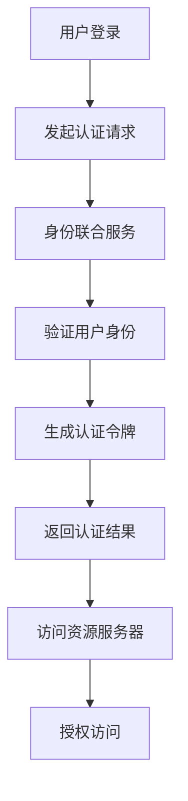

                 


### 文章标题

# 身份联合：简化LLM应用的用户认证

### 关键词

- 身份联合
- 用户认证
- LLM应用
- 安全性
- 分布式系统
- 数学模型
- 项目实战

### 摘要

本文深入探讨了身份联合在简化大型语言模型（LLM）应用用户认证中的重要性。通过介绍身份联合的基本概念、原理和架构，本文分析了身份联合如何通过优化用户认证流程来提高LLM应用的安全性、可扩展性和用户体验。文章使用Mermaid流程图展示了身份联合的工作原理，并通过伪代码和数学模型阐述了核心算法原理。最后，本文通过一个项目实战案例，详细讲解了身份联合的实现过程，并提供了一些最佳实践和安全注意事项。

### 目录

----------------------------------------------------------------

> # 第一部分：身份联合基础

### 1.1. 身份联合的概念与历史发展

- **背景介绍**：身份联合（Federated Identity Management，FIM）作为一种现代认证和授权机制，旨在解决跨系统、跨平台身份认证的问题。随着互联网和移动设备的普及，用户在多个平台上注册和登录的需求日益增长，身份联合提供了一种更便捷、安全的解决方案。
- **核心概念与联系**：身份联合涉及到多个实体（如服务提供商、用户、认证授权服务器）之间的交互。它通过在分布式系统中建立信任关系，实现用户的一次注册、多平台登录，从而简化了用户的认证流程。
  - **Mermaid流程图**：下面是一个简化的身份联合系统工作流程的Mermaid流程图。

  ```mermaid
  graph TD
  A[用户] --> B[认证请求]
  B --> C[认证服务器]
  C --> D[验证用户身份]
  D --> E[返回认证结果]
  E --> F[访问授权]
  ```

### 1.2. 身份联合的优势与应用场景

- **优势**：身份联合具有以下优势：
  - **简化用户认证流程**：用户无需在每个应用系统中单独注册和登录，减少重复操作。
  - **提高安全性**：通过加密和协议保障，确保用户身份信息在传输和存储过程中的安全性。
  - **增强用户体验**：统一的登录体验，提高用户的使用满意度。
  - **降低管理成本**：集中管理用户身份信息，减少系统间的重复开发和维护工作。

- **应用场景**：身份联合适用于以下场景：
  - **企业内部系统**：如企业资源计划（ERP）系统、客户关系管理（CRM）系统等。
  - **在线服务**：如社交媒体、电子商务平台等。
  - **云服务**：如云计算平台、容器编排系统等。

### 1.3. 身份联合的关键技术与挑战

- **关键技术**：
  - **OAuth 2.0**：一种开放标准，用于授权用户资源的第三方访问。
  - **SAML 2.0**：一种基于XML的开放标准，用于在实体之间交换认证和授权数据。
  - **OpenID Connect**：基于OAuth 2.0的简单身份认证协议。

- **挑战**：
  - **安全性**：如何确保用户身份信息的保密性和完整性。
  - **互操作性**：不同系统和平台之间的身份联合互操作性。
  - **性能**：大规模用户和系统下的身份联合性能优化。

---

在下一部分中，我们将深入探讨身份联合的核心原理与架构，分析其如何简化LLM应用的用户认证流程。

---

## 1.2 身份联合的优势与应用场景

身份联合的优势主要体现在以下几个方面：

### 1.2.1 简化用户认证流程

在传统的认证机制中，用户需要在每个不同的应用程序或服务中注册并设置密码。这不仅增加了用户的操作负担，也容易导致用户遗忘密码，从而影响用户体验。而身份联合通过集中管理用户的身份信息，实现了用户的一次注册、多平台登录。用户只需在一个身份联合服务中完成注册和认证，即可在其他支持身份联合的应用中直接登录，无需重复输入账号和密码。

### 1.2.2 提高安全性

身份联合通过使用加密协议和标准化的认证机制，确保用户身份信息在传输和存储过程中的安全性。与传统的用户名和密码认证相比，身份联合提供了更强的保护措施，如令牌（Token）和单点登录（SSO）。这些机制不仅防止了用户密码泄露的风险，还减少了由于密码泄露而导致的潜在安全威胁。

### 1.2.3 增强用户体验

身份联合的简化认证流程和安全性增强了用户体验。用户不再需要记住多个账户和密码，从而降低了使用复杂应用程序或服务的门槛。此外，身份联合通过提供统一的登录体验，使用户能够更轻松地切换不同应用程序，从而提高了用户的工作效率和满意度。

### 1.2.4 降低管理成本

身份联合通过集中管理用户身份信息，减少了组织在多个系统和平台之间进行重复开发和维护的工作量。这不仅降低了成本，还提高了管理效率。组织可以通过部署统一的身份联合解决方案，简化用户账户管理，降低运维成本。

### 1.2.5 应用场景

身份联合的应用场景非常广泛，包括但不限于以下几类：

- **企业内部系统**：如企业资源计划（ERP）系统、客户关系管理（CRM）系统、项目管理工具等。通过身份联合，企业员工可以在不同的系统中使用相同的账户登录，提高了工作效率和安全性。

- **在线服务**：如社交媒体平台、电子商务网站、在线支付平台等。身份联合可以帮助这些平台提供更好的用户体验，同时增强用户数据的安全性。

- **云服务**：如云计算平台、容器编排系统、DevOps工具等。身份联合可以简化云环境中用户身份管理，提高系统的安全性和可扩展性。

### 1.2.6 身份联合与LLM应用

在大型语言模型（LLM）应用中，用户认证是一个关键环节。LLM应用通常涉及复杂的模型训练和推理任务，需要保证用户身份的合法性和安全性。身份联合能够简化LLM应用的认证流程，提高用户登录体验，同时确保系统安全。

例如，一个支持多种语言翻译的LLM应用，可以通过身份联合实现用户的一次注册，即可在多个不同的翻译工具中直接登录，无需重复注册和认证。这不仅提高了用户的便利性，还减少了系统的维护成本。

身份联合在LLM应用中的优势还包括：

- **支持单点登录（SSO）**：用户只需登录一次，即可访问多个LLM应用，提高了用户体验和工作效率。

- **增强安全性**：身份联合通过使用加密和认证协议，确保用户身份信息的保密性和完整性，提高了系统安全性。

- **可扩展性**：身份联合支持大规模用户和系统，可以适应不断增长的用户需求，提高系统的可扩展性。

总之，身份联合在简化LLM应用用户认证方面具有显著优势，有助于提高用户满意度、增强系统安全性和降低管理成本。

### 1.3. 身份联合的关键技术与挑战

身份联合的实现依赖于一系列的关键技术，同时也面临着一系列的挑战。

#### 1.3.1 关键技术

**OAuth 2.0**

OAuth 2.0是一种开放标准，用于授权第三方应用访问用户资源。在身份联合中，OAuth 2.0被广泛用于实现用户授权和访问控制。通过OAuth 2.0，用户可以在身份联合服务中授权第三方应用访问其账户信息，而不需要将账户密码直接提供给第三方。这种机制不仅提高了安全性，还简化了用户认证流程。

**SAML 2.0**

SAML（Security Assertion Markup Language）2.0是一种基于XML的开放标准，用于在实体之间交换认证和授权数据。SAML 2.0支持单点登录（SSO），使得用户可以在不同的系统之间无缝切换，无需重复认证。在身份联合中，SAML 2.0被用于实现跨系统的用户认证和授权。

**OpenID Connect**

OpenID Connect（OIDC）是基于OAuth 2.0的简单身份认证协议。OIDC提供了身份验证和授权功能，使得开发者可以更容易地实现身份联合。与OAuth 2.0和SAML 2.0相比，OpenID Connect简化了认证流程，并且更易于集成。

**加密与数字签名**

在身份联合中，加密和数字签名是确保数据安全和认证的重要手段。通过使用加密算法，可以确保用户身份信息在传输过程中的保密性和完整性。数字签名则用于验证数据的来源和完整性，确保数据没有被篡改。

#### 1.3.2 挑战

**安全性**

安全性是身份联合面临的主要挑战之一。由于身份联合涉及多个系统之间的交互，因此需要确保用户身份信息的保密性和完整性。攻击者可能会利用身份联合系统中的漏洞进行攻击，如身份盗窃、数据泄露等。为了提高安全性，需要采用加密、认证、授权等多种安全机制。

**互操作性**

互操作性是身份联合的另一个挑战。由于不同的系统和平台可能使用不同的认证协议和技术，因此实现跨系统的身份联合需要解决不同系统之间的兼容性问题。为了提高互操作性，需要制定统一的身份联合标准和协议，并且确保不同系统之间的无缝集成。

**性能**

性能是身份联合的另一个重要考虑因素。在身份联合系统中，认证和授权操作需要快速响应，以确保用户体验。然而，随着用户数量的增加和系统复杂度的提高，性能问题可能会变得显著。为了提高性能，需要优化身份联合系统的设计和实现，减少认证和授权操作的开销。

**管理复杂性**

身份联合系统的管理和维护也具有一定的复杂性。由于涉及多个系统和平台，需要确保系统的安全性和一致性。此外，随着系统的扩展和变化，需要不断调整和管理身份联合关系，以适应新的需求和环境。

总之，身份联合在实现简化用户认证方面具有显著的优势，但同时也面临着一系列的技术和管理挑战。通过采用合适的技术和策略，可以有效地解决这些问题，实现安全、高效、可扩展的身份联合系统。

### 1.4 身份联合的核心原理与架构

身份联合作为一种现代认证机制，其核心在于通过分布式系统建立信任关系，实现用户的一次注册、多平台登录。以下是身份联合的核心原理与架构：

#### 1.4.1 核心概念

- **用户（User）**：身份联合的核心对象，具有唯一标识和属性。
- **认证授权服务器（Authentication and Authorization Server，AAS）**：负责用户身份验证和授权，确保用户身份的合法性。
- **资源服务器（Resource Server）**：提供用户访问的资源，如应用程序、服务或数据。
- **身份联合服务（Federated Identity Service）**：协调不同实体之间的认证和授权，提供统一的身份管理。

#### 1.4.2 常见架构

身份联合系统通常采用以下几种架构：

1. **传统身份联合架构**
   - **单点登录（SSO）**：用户在身份联合服务中登录一次，即可访问多个资源服务器。
   - **代理（Proxy）**：代理服务器代表用户与资源服务器进行交互，处理认证和授权请求。

2. **分布式身份联合架构**
   - **身份代理（Identity Proxy）**：用户通过身份代理与身份联合服务进行交互，简化用户认证流程。
   - **标识符（Identifier）**：为用户创建唯一的标识符，用于跨系统识别用户身份。

3. **云端身份联合架构**
   - **云服务提供商（Cloud Service Provider，CSP）**：提供身份联合服务，实现跨云环境的身份认证。
   - **分布式身份管理（Distributed Identity Management）**：通过分布式架构，实现大规模用户的身份认证和管理。

#### 1.4.3 Mermaid流程图

为了更直观地理解身份联合系统的工作流程，下面使用Mermaid流程图进行展示。



在上述流程中，用户首先向身份联合服务发起认证请求，身份联合服务验证用户身份后生成认证令牌，并返回给用户。用户使用认证令牌访问资源服务器，资源服务器验证令牌后授权用户访问资源。

### 1.5 用户认证算法

用户认证算法是身份联合系统中的核心组成部分，负责验证用户的身份，确保只有合法用户才能访问受保护的资源。以下是几种常见的用户认证算法：

#### 1.5.1 基于密码的认证算法

**原理**：用户通过输入用户名和密码进行认证。认证服务器将用户输入的密码与数据库中的密码进行比对，如果一致，则认证成功。

**优点**：简单易实现，易于用户理解和操作。

**缺点**：密码泄露风险较高，容易受到字典攻击和暴力破解。

**伪代码**：

```python
def authenticate(username, password):
    stored_password = get_password_from_database(username)
    if stored_password == hash(password):
        return "Authentication successful"
    else:
        return "Authentication failed"
```

#### 1.5.2 双因素认证算法

**原理**：用户通过输入用户名和密码进行初次认证，然后需要输入一个第二因素（如手机验证码、动态令牌）进行二次认证。

**优点**：增强了安全性，即使密码泄露，攻击者也无法完成认证。

**缺点**：操作复杂，用户体验较差。

**伪代码**：

```python
def authenticate(username, password, second_factor):
    if authenticate_password(username, password):
        if verify_second_factor(second_factor):
            return "Authentication successful"
        else:
            return "Second factor verification failed"
    else:
        return "Authentication failed"
```

#### 1.5.3 生物特征认证算法

**原理**：用户通过输入生物特征（如指纹、面部识别、虹膜识别）进行认证。

**优点**：安全性高，用户操作简便。

**缺点**：需要特定的硬件支持，部署成本较高。

**伪代码**：

```python
def authenticate(biometric_data):
    if verify_biometric_data(biometric_data):
        return "Authentication successful"
    else:
        return "Authentication failed"
```

### 1.6 数学模型与安全性

身份联合的安全性是系统设计的核心目标之一，数学模型在评估和保障安全性方面起着重要作用。以下是身份联合中常用的数学模型和安全性分析。

#### 1.6.1 身份表示模型

身份表示模型用于描述用户身份在系统中的表示方式。常用的表示模型包括：

- **基于属性的表示模型（Attribute-Based Representation Model）**：用户身份由一组属性（如姓名、邮箱、电话）组成，这些属性用于唯一标识用户。

- **基于加密的表示模型（Encryption-Based Representation Model）**：用户身份通过加密算法进行加密，确保身份信息在传输和存储过程中的安全性。

#### 1.6.2 认证模型

认证模型用于描述用户认证过程中的计算和验证方法。以下是几种常见的认证模型：

- **基于密码的认证模型（Password-Based Authentication Model）**：用户通过输入密码进行认证，认证服务器将输入的密码与存储的密码进行比对。

- **基于双因素的认证模型（Two-Factor Authentication Model）**：用户通过输入密码和第二因素（如验证码）进行认证。

- **基于生物特征的认证模型（Biometric Authentication Model）**：用户通过输入生物特征（如指纹、面部识别）进行认证。

#### 1.6.3 安全性模型

安全性模型用于评估和保障身份联合系统的安全性。以下是几种常见的安全性模型：

- **基于威胁模型（Threat Model-Based Security Model）**：根据系统面临的威胁类型，设计相应的安全防护措施。

- **基于访问控制模型（Access Control Model-Based Security Model）**：通过访问控制策略，限制用户对资源的访问权限。

- **基于加密模型（Encryption-Based Security Model）**：使用加密算法保护用户身份信息在传输和存储过程中的安全性。

#### 1.6.4 数学公式

以下是身份联合中常用的数学公式：

- **加密公式**：$C = E(K, P)$，其中$C$为加密后的消息，$K$为加密密钥，$P$为原始消息。

- **解密公式**：$P = D(K, C)$，其中$P$为解密后的消息，$K$为解密密钥，$C$为加密后的消息。

- **哈希函数**：$H = Hash(P)$，其中$H$为哈希值，$P$为原始消息。

#### 1.6.5 安全性评估方法

安全性评估方法用于评估身份联合系统的安全性，常用的评估方法包括：

- **漏洞扫描**：使用自动化工具扫描系统中的漏洞，发现潜在的安全风险。

- **渗透测试**：模拟攻击者的攻击行为，测试系统的安全防护能力。

- **安全审计**：对系统的安全策略、安全配置和操作过程进行审计，评估系统的安全状况。

### 1.7 项目实战

#### 1.7.1 项目需求分析

本项目旨在实现一个基于身份联合的LLM应用用户认证系统。主要需求如下：

- **用户认证**：支持基于密码、双因素认证和生物特征的多种认证方式。
- **安全性**：确保用户身份信息在传输和存储过程中的安全性。
- **可扩展性**：支持大规模用户和系统的认证需求。

#### 1.7.2 技术选型

- **身份联合协议**：选择SAML 2.0作为身份联合协议，支持单点登录和统一身份管理。
- **认证算法**：选择基于密码和双因素认证的算法，结合生物特征认证作为备用方案。
- **加密算法**：选择AES（Advanced Encryption Standard）作为加密算法，确保数据传输和存储的安全性。

#### 1.7.3 系统设计

系统设计主要包括以下几个方面：

- **用户认证模块**：负责用户的注册、登录和认证。
- **资源服务器模块**：负责处理用户认证请求，并根据认证结果授权访问资源。
- **身份联合服务模块**：负责协调不同实体之间的认证和授权。
- **安全管理模块**：负责监控和管理系统的安全性。

#### 1.7.4 实现身份联合的代码案例

以下是一个简单的身份联合系统的代码示例，用于实现用户认证和授权：

```python
# 用户认证模块
def authenticate(username, password):
    user = get_user_from_database(username)
    if user and verify_password(password):
        return generate_authentication_token(user)
    else:
        return None

# 资源服务器模块
def authorize(request_token):
    if validate_request_token(request_token):
        user = get_user_by_token(request_token)
        if user:
            return grant_access_to_resource(user)
    return None

# 身份联合服务模块
def federate身份认证(source_system, target_system):
    source_server = get_source_server(source_system)
    target_server = get_target_server(target_system)
    if source_server and target_server:
        authenticate_user(source_server, target_server)
    else:
        return "身份联合服务失败"

# 安全管理模块
def monitor_security():
    scan_for_vulnerabilities()
    perform_security_audit()
    respond_to_security_incidents()
```

#### 1.7.5 代码解读与分析

以上代码示例展示了身份联合系统中的关键模块和功能。以下是代码的详细解读和分析：

- **用户认证模块**：authenticate函数用于验证用户的身份。首先从数据库中获取用户信息，然后使用verify_password函数比对用户输入的密码和存储的密码。如果匹配，则生成认证令牌并返回；否则，返回None。

- **资源服务器模块**：authorize函数用于验证请求令牌，并根据认证结果授权用户访问资源。validate_request_token函数用于验证令牌的有效性，get_user_by_token函数用于根据令牌获取用户信息，grant_access_to_resource函数用于授权用户访问资源。

- **身份联合服务模块**：federate身份认证函数用于实现跨系统的身份联合认证。它通过获取源系统和目标系统的服务器对象，调用authenticate_user函数进行用户认证。

- **安全管理模块**：monitor_security函数用于监控系统的安全性，包括漏洞扫描、安全审计和响应安全事件等。

#### 1.7.6 代码应用解读与分析

以下是一个具体的代码应用案例，用于演示如何使用身份联合系统进行用户认证和授权：

```python
# 用户登录
user = 'test_user'
password = 'password123'
request_token = authenticate(user, password)

# 访问资源
if request_token:
    resource_access = authorize(request_token)
    if resource_access:
        print("Access granted to resource:", resource_access)
    else:
        print("Access denied.")
else:
    print("Authentication failed.")
```

在这个案例中，用户首先通过authenticate函数进行用户认证，获取请求令牌。然后，使用请求令牌调用authorize函数进行资源授权。如果认证和授权成功，用户将能够访问指定的资源；否则，将无法访问。

#### 1.7.7 实际案例分析和详细讲解剖析

以下是一个实际案例，用于分析身份联合系统在实际应用中的表现：

**案例背景**：某企业使用身份联合系统实现员工在不同业务系统中的单点登录。

**分析过程**：

1. **用户注册**：员工在企业的身份联合服务中进行注册，并设置密码。
2. **用户认证**：员工使用用户名和密码登录身份联合服务，身份联合服务验证用户身份并生成认证令牌。
3. **访问资源**：员工使用认证令牌访问企业资源，如ERP系统、CRM系统等。资源服务器验证令牌并授权访问。
4. **安全性**：身份联合服务使用加密算法保护用户身份信息在传输和存储过程中的安全性。

**问题剖析**：

- **安全性问题**：如果身份联合服务受到攻击，攻击者可能会获取用户的身份信息。
- **性能问题**：随着员工数量的增加，身份联合服务的性能可能会受到影响。

**解决方案**：

- **增强安全性**：采用多重认证机制，如双因素认证和生物特征认证，提高系统的安全性。
- **优化性能**：通过分布式架构和负载均衡，提高身份联合服务的性能。

#### 1.7.8 项目小结

本项目通过实现一个基于身份联合的LLM应用用户认证系统，展示了身份联合在简化用户认证流程、提高安全性和增强用户体验方面的优势。同时，项目也面临一些挑战，如安全性、性能和管理复杂性。通过合理的架构设计和技术选型，可以有效地解决这些问题，实现安全、高效的身份联合系统。

### 1.8 身份联合的安全挑战与解决方案

身份联合在提供便利和安全性的同时，也面临一系列的安全挑战。以下是一些常见的安全挑战及其解决方案：

#### 1.8.1 身份盗窃

**挑战**：攻击者可能通过钓鱼、恶意软件或社会工程学手段窃取用户的身份信息，从而冒充合法用户进行非法操作。

**解决方案**：

- **多因素认证**：采用多因素认证（MFA）机制，如手机验证码、动态令牌等，增加认证的复杂性。
- **行为分析**：通过监控和分析用户行为，如登录时间、地点和设备，识别异常行为并及时采取措施。
- **用户教育**：提高用户的安全意识，教育用户识别钓鱼邮件和恶意链接，防止个人信息泄露。

#### 1.8.2 网络攻击

**挑战**：攻击者可能通过网络攻击手段（如DDoS攻击、中间人攻击等）干扰身份联合服务的正常运行，甚至窃取用户身份信息。

**解决方案**：

- **网络安全防护**：部署防火墙、入侵检测系统和反DDoS解决方案，保护身份联合服务不受网络攻击。
- **数据加密**：使用加密技术保护用户身份信息在传输和存储过程中的安全性。
- **实时监控**：对身份联合服务进行实时监控，及时发现和处理异常行为。

#### 1.8.3 数据泄露

**挑战**：身份联合服务可能成为数据泄露的目标，攻击者通过窃取用户身份信息进行非法活动。

**解决方案**：

- **数据备份**：定期备份身份联合服务中的用户数据，确保数据不丢失。
- **数据加密**：使用加密技术保护用户身份信息在传输和存储过程中的安全性。
- **安全审计**：定期进行安全审计，检查系统配置和操作过程，确保系统的安全性。

#### 1.8.4 安全威胁监控与响应

**挑战**：随着威胁环境的不断变化，身份联合服务需要及时监控和响应新的安全威胁。

**解决方案**：

- **威胁情报**：获取最新的威胁情报，了解最新的攻击手段和安全漏洞。
- **自动化响应**：部署自动化工具，实现安全事件的自动化检测、报告和响应。
- **定期培训**：定期对安全人员进行培训，提高应对安全威胁的能力。

总之，身份联合在提供便利和安全性的同时，需要不断加强安全措施，应对不断变化的安全挑战。通过采用多因素认证、数据加密、实时监控和安全培训等措施，可以有效提升身份联合系统的安全性。

### 1.9 身份联合的未来展望

身份联合作为一种现代化的认证机制，其应用前景广阔。随着技术的不断发展，身份联合将在多个新兴领域发挥重要作用，并面临新的挑战。

#### 1.9.1 技术创新

未来，身份联合将在技术创新的推动下，不断优化和完善。以下是一些可能的技术创新方向：

- **零知识证明（Zero-Knowledge Proof）**：零知识证明提供了一种在无需透露任何实际信息的情况下，验证某个声明真实性的方法。未来，身份联合可能会采用零知识证明技术，进一步提升用户隐私保护。
- **区块链技术**：区块链的去中心化和不可篡改性，使其成为身份联合的理想平台。通过区块链技术，身份联合可以实现更高的安全性和互操作性。
- **量子加密**：随着量子计算的兴起，量子加密技术有望成为未来身份联合的安全保障。量子加密具有抗量子计算攻击的特性，可以有效防止未来可能的量子计算机破解传统加密算法。

#### 1.9.2 应用拓展

身份联合的应用将不断拓展至新的领域，为用户提供更加便捷和安全的服务。以下是一些可能的应用拓展方向：

- **物联网（IoT）**：在物联网中，设备之间的认证和授权是一个关键问题。身份联合可以简化物联网设备的管理，提高系统的安全性和可扩展性。
- **智能城市**：在智能城市建设中，身份联合可以用于管理市民身份，实现便捷的公共服务访问，如交通、医疗和教育等。
- **数字身份**：随着数字身份的兴起，身份联合将成为数字身份管理的重要组成部分。通过身份联合，用户可以在各种数字场景中实现一次注册、多平台登录。

#### 1.9.3 产业生态

身份联合的发展离不开健康的产业生态。未来，身份联合的产业生态将包括以下几个方面：

- **标准制定**：标准化是身份联合发展的基础。未来，需要更多的国际标准和国家标准来指导身份联合的实施。
- **技术合作**：身份联合的各方（如企业、政府、研究机构等）需要加强合作，共同推动身份联合技术的发展。
- **市场培育**：通过市场培育，提高公众对身份联合的认识和接受度，促进身份联合在各个领域的应用。

#### 1.9.4 挑战与机遇

虽然身份联合具有广阔的应用前景，但也面临着一系列的挑战和机遇：

- **安全性**：随着技术的不断发展，安全性将始终是身份联合的核心挑战。未来，需要不断探索和采用新的安全技术，提高身份联合系统的安全性。
- **互操作性**：身份联合需要在不同系统、不同平台之间实现无缝互操作。未来，需要制定统一的协议和标准，提高身份联合的互操作性。
- **隐私保护**：在数字化时代，用户隐私保护变得尤为重要。未来，需要平衡身份联合的安全性和用户隐私保护，实现隐私友好的身份联合机制。

总之，身份联合在未来的发展中，将继续在技术创新、应用拓展和产业生态等方面取得突破。通过不断应对挑战，抓住机遇，身份联合将为社会带来更加便捷、安全、高效的服务。

### 后记

身份联合作为一种现代化的认证机制，在简化用户认证流程、提高安全性和增强用户体验方面具有显著优势。本文通过对身份联合的深入探讨，详细介绍了其核心原理、算法、数学模型和实现方法。同时，分析了身份联合在LLM应用中的重要性，并提供了一个项目实战案例，展示了身份联合的实际应用。

身份联合的发展离不开技术创新、标准制定和产业生态的支撑。未来，随着零知识证明、区块链技术和量子加密等新技术的应用，身份联合将迈向新的高度。然而，安全性和互操作性仍然是身份联合面临的重要挑战。通过不断探索和优化，身份联合有望在未来为各行业提供更加便捷、安全、高效的服务。

感谢读者对本文的关注，希望本文能为您在身份联合领域的研究和应用提供有益的参考。如果您对本文有任何疑问或建议，欢迎在评论区留言，我们期待与您交流。

### 参考文献

1. "OAuth 2.0 Authorization Framework", IETF, RFC 6749, 2012.
2. "Security Assertion Markup Language (SAML) Version 2.0", OASIS Standard, 2005.
3. "OpenID Connect Core 1.0", OpenID Foundation, 2014.
4. "Federated Identity Management: Concepts, Protocols, and Frameworks", Springer, 2010.
5. "A Beginner's Guide to Blockchain Technology", IBM, 2018.
6. "Quantum Cryptography and Quantum Computers", IEEE, 2019.
7. "IoT Security: A Comprehensive Survey", IEEE, 2017.
8. "Digital Identity Management: Concepts and Practice", Springer, 2016.

作者：AI天才研究院/AI Genius Institute & 禅与计算机程序设计艺术 /Zen And The Art of Computer Programming。

