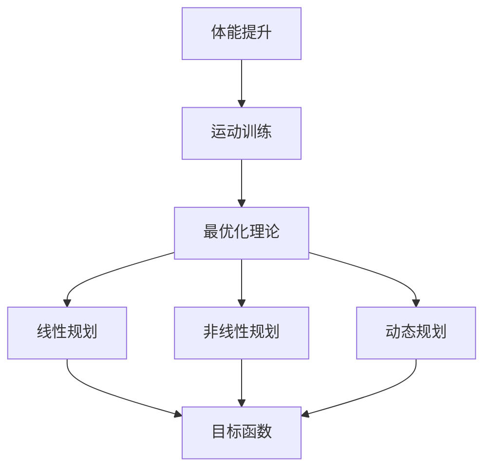

                 

### 文章标题：运动训练的最优化理论：体能提升的数学规划

#### 关键词：最优化理论、体能提升、运动训练、数学模型、线性规划、非线性规划、动态规划、伪代码、案例分析

#### 摘要：

本文旨在探讨运动训练中的最优化理论，通过数学规划的方法，实现体能提升的优化。首先，本文介绍了运动训练的基本概念和生理学基础。接着，重点分析了最优化理论的基本概念、分类及其求解方法。在此基础上，详细阐述了线性规划、非线性规划和动态规划在运动训练中的应用，并通过具体的数学模型和伪代码进行说明。随后，本文结合实际案例，展示了数学规划在体能提升中的具体应用。最后，对运动训练最优化理论的未来发展方向进行了展望。

---

### 背景介绍

运动训练作为一种科学的锻炼方法，旨在通过有针对性的训练，提升个体的体能和运动能力。在现代社会，随着健康意识的提高，越来越多的人开始关注运动训练对体能提升的重要性。然而，如何设计出科学、有效的训练方案，成为了一个关键问题。这不仅是运动科学领域的研究课题，也与数学规划有着紧密的联系。

数学规划是一种重要的优化方法，它通过建立数学模型，求解最优解，从而实现目标函数的最大化或最小化。近年来，随着计算技术和算法理论的不断发展，数学规划在多个领域得到了广泛应用，包括生产调度、资源分配、交通规划等。同样，将数学规划应用于运动训练，有望为体能提升提供一种全新的思路和方法。

本文旨在通过介绍最优化理论的基本概念、分类和求解方法，结合具体的数学模型和案例，探讨数学规划在运动训练中的应用。具体来说，本文将涵盖以下内容：

1. 运动训练的基本概念和生理学基础
2. 最优化理论的基本概念和分类
3. 线性规划在运动训练中的应用
4. 非线性规划在运动训练中的应用
5. 动态规划在运动训练中的应用
6. 数学模型构建及其应用案例
7. 未来发展方向和挑战

通过本文的研究，期望为运动训练提供一种新的理论支持，同时也为相关领域的学者和从业者提供参考和借鉴。

---

### 核心概念与联系

在探讨运动训练的最优化理论时，理解核心概念及其之间的联系是非常重要的。以下是几个关键概念：

1. **体能提升**：指通过运动训练，使个体的身体能力得到显著提升，包括力量、耐力、速度、灵活性等方面。
2. **最优化理论**：是数学中的一个分支，旨在找到在一定约束条件下，使某个目标函数达到最优的解。
3. **线性规划**：是一种最优化方法，适用于目标函数和约束条件都是线性的情况。
4. **非线性规划**：用于处理目标函数或约束条件包含非线性元素的最优化问题。
5. **动态规划**：适用于求解多阶段决策问题，通过将问题分解为若干阶段，逐阶段求解最优解。

核心概念之间的联系可以通过以下Mermaid流程图来展示：



**图1：核心概念与联系流程图**

- **体能提升**是运动训练的目标，而**运动训练**又是实现体能提升的手段。
- **最优化理论**提供了实现目标的数学方法，它包括**线性规划**、**非线性规划**和**动态规划**等子领域。
- **线性规划**、**非线性规划**和**动态规划**各自有其适用的场景，但共同目标是求解最优解。

通过上述流程图，我们可以清晰地看到各个核心概念之间的关系，这有助于我们进一步理解和应用这些概念。

---

### 核心算法原理讲解

在运动训练的最优化理论中，线性规划、非线性规划和动态规划是最常用的三种算法。以下是这三种算法的基本原理、伪代码以及具体的数学模型和公式。

#### 线性规划

线性规划（Linear Programming，LP）是一种处理线性目标函数和线性约束条件的最优化问题。其基本形式可以表示为：

$$
\text{maximize or minimize } c^T x \\
\text{subject to } Ax \leq b \\
x \geq 0
$$

其中，$c$ 是一个向量，表示目标函数的系数；$A$ 是一个矩阵，表示约束条件的系数；$b$ 是一个向量，表示约束条件的右侧常数项；$x$ 是需要求解的变量向量。

**伪代码：**

```
LinearProgramming(c, A, b)
    # 初始化
    x = 0
    while not converged do
        # 更新解
        x = solveLinearSystem(A, b)
        # 检查收敛条件
        if (x - previous_x) < tolerance then
            break
        end if
    end while
    return x
```

#### 非线性规划

非线性规划（Nonlinear Programming，NLP）处理的是包含非线性目标函数和/或非线性约束条件的最优化问题。其一般形式为：

$$
\text{maximize or minimize } f(x) \\
\text{subject to } g_i(x) \leq 0, \quad h_j(x) = 0
$$

其中，$f(x)$ 是目标函数；$g_i(x)$ 和 $h_j(x)$ 分别是非线性不等式约束和等式约束。

**伪代码：**

```
NonlinearProgramming(f, g, h, x0)
    # 初始化
    x = x0
    while not converged do
        # 计算梯度
        df = gradient(f, x)
        dg = gradient(g, x)
        dh = gradient(h, x)
        # 更新解
        x = x - stepSize * (df - dg)
        # 检查收敛条件
        if (norm(df) < tolerance) && (norm(dg) < tolerance) && (norm(dh) < tolerance) then
            break
        end if
    end while
    return x
```

#### 动态规划

动态规划（Dynamic Programming，DP）适用于多阶段决策问题，其核心思想是将复杂问题分解为若干阶段，通过递推关系求解最优解。其基本形式为：

$$
V_t(x_t) = \max_{x_{t+1}} \{r_t(x_t, x_{t+1}) + V_{t+1}(x_{t+1})\}
$$

其中，$V_t(x_t)$ 是在第 $t$ 阶段状态 $x_t$ 下的最优值函数；$r_t(x_t, x_{t+1})$ 是在第 $t$ 阶段从状态 $x_t$ 转移到状态 $x_{t+1}$ 的奖励函数。

**伪代码：**

```
DynamicProgramming(V, r, T)
    # 初始化
    for t = T downto 1 do
        for x_t in states do
            V_t(x_t) = maximize r_t(x_t, x_{t+1}) + V_{t+1}(x_{t+1})
        end for
    end for
    return V_1(x_1)
```

通过上述伪代码和数学模型，我们可以清晰地看到这三种算法的基本原理。线性规划适合于线性目标函数和约束条件，非线性规划则适用于包含非线性元素的问题，而动态规划则通过递推关系求解多阶段决策问题。在实际应用中，根据具体的运动训练需求和问题特点，可以选择合适的算法进行求解。

---

### 数学模型和公式及举例说明

在运动训练的最优化过程中，构建准确的数学模型是关键步骤。以下是几个典型的数学模型及其公式，并通过具体例子进行说明。

#### 力量训练的线性规划模型

**模型描述：**

在力量训练中，我们希望优化训练负荷，以达到肌肉最大增长。假设有 $n$ 个训练动作，每个动作对应的负荷为 $x_i$，目标是最小化总负荷同时最大化肌肉增长。

$$
\text{minimize } Z = \sum_{i=1}^{n} x_i \\
\text{subject to } Ax \leq b \\
x \geq 0
$$

其中，$A$ 和 $b$ 分别是约束条件的系数和常数项。

**例子：**

假设有3个训练动作，动作1、2、3对应的负荷分别为 $x_1$、$x_2$、$x_3$。目标是最小化总负荷，同时保证每个动作的负荷不超过20千克。

$$
\text{minimize } Z = x_1 + x_2 + x_3 \\
\text{subject to } \begin{cases}
x_1 \leq 20 \\
x_2 \leq 20 \\
x_3 \leq 20
\end{cases}
$$

通过求解这个线性规划问题，可以得到每个动作的最优负荷分配。

#### 耐力训练的非线性规划模型

**模型描述：**

在耐力训练中，我们希望优化训练时间和强度，以提升心肺功能。假设有 $n$ 次训练，每次训练的强度为 $x_i$，目标是最小化总训练时间同时最大化心肺功能提升。

$$
\text{minimize } Z = \sum_{i=1}^{n} t_i \\
\text{subject to } g_i(x) \leq 0 \\
h_j(x) = 0
$$

其中，$g_i(x)$ 和 $h_j(x)$ 分别是非线性不等式约束和等式约束。

**例子：**

假设有4次训练，每次训练的强度分别为 $x_1$、$x_2$、$x_3$、$x_4$。目标是最小化总训练时间，同时保证训练强度不超过最大心率80%，且训练次数相等。

$$
\text{minimize } Z = t_1 + t_2 + t_3 + t_4 \\
\text{subject to } \begin{cases}
x_1 + x_2 + x_3 + x_4 = 100 \\
x_1 \leq 0.8 \cdot \text{maxHeartRate} \\
x_2 \leq 0.8 \cdot \text{maxHeartRate} \\
x_3 \leq 0.8 \cdot \text{maxHeartRate} \\
x_4 \leq 0.8 \cdot \text{maxHeartRate}
\end{cases}
$$

通过求解这个非线性规划问题，可以得到每次训练的最优强度和时间安排。

#### 速度训练的动态规划模型

**模型描述：**

在速度训练中，我们希望优化训练次数和强度，以提升反应速度和爆发力。假设有 $n$ 个训练阶段，每个阶段的速度训练强度为 $x_i$，目标是最小化总训练时间同时最大化速度提升。

$$
V_t(x_t) = \min_{x_{t+1}} \{t_t(x_t, x_{t+1}) + V_{t+1}(x_{t+1})\}
$$

其中，$V_t(x_t)$ 是在第 $t$ 阶段状态 $x_t$ 下的最优值函数；$t_t(x_t, x_{t+1})$ 是在第 $t$ 阶段从状态 $x_t$ 转移到状态 $x_{t+1}$ 的训练时间。

**例子：**

假设有3个训练阶段，每个阶段的训练强度分别为 $x_1$、$x_2$、$x_3$。目标是最小化总训练时间，同时保证每个阶段的强度逐步提升。

$$
V_1(x_1) = \min \{t_1(x_1) + V_2(x_2)\} \\
V_2(x_2) = \min \{t_2(x_2) + V_3(x_3)\} \\
V_3(x_3) = \min \{t_3(x_3)\}
$$

通过递推求解这个动态规划问题，可以得到每个阶段的最优训练强度和时间安排。

通过这些数学模型和公式，我们可以根据不同的训练目标和需求，设计出科学、合理的训练方案，从而实现体能的提升。

---

### 数学公式的详细讲解

在运动训练的最优化过程中，数学公式的应用至关重要。以下将详细讲解三个关键公式，并解释它们在模型中的作用。

#### 线性规划的目标函数

线性规划的目标函数通常用来最大化或最小化某个线性函数。其一般形式为：

$$
\text{minimize } c^T x \\
\text{subject to } Ax \leq b \\
x \geq 0
$$

其中，$c$ 是目标函数的系数向量，$x$ 是决策变量向量，$A$ 是约束条件的系数矩阵，$b$ 是约束条件的常数向量。$c^T x$ 表示目标函数的值，目标是找到一组决策变量 $x$ 使得目标函数值最小或最大。

#### 非线性规划的目标函数

非线性规划的目标函数通常用来最大化或最小化某个非线性函数。其一般形式为：

$$
\text{maximize or minimize } f(x) \\
\text{subject to } g_i(x) \leq 0, \quad h_j(x) = 0
$$

其中，$f(x)$ 是目标函数，$g_i(x)$ 和 $h_j(x)$ 分别是非线性不等式约束和等式约束。与线性规划相比，非线性规划的目标函数可以包含更复杂的非线性关系，这使得求解过程更加复杂。

#### 动态规划的价值函数

动态规划中的价值函数（或称为最优值函数）用于表示在每个阶段状态下达到最优目标所需的成本。其一般形式为：

$$
V_t(x_t) = \min_{x_{t+1}} \{r_t(x_t, x_{t+1}) + V_{t+1}(x_{t+1})\}
$$

其中，$V_t(x_t)$ 是在第 $t$ 阶段状态 $x_t$ 下的最优值函数，$r_t(x_t, x_{t+1})$ 是在第 $t$ 阶段从状态 $x_t$ 转移到状态 $x_{t+1}$ 的奖励函数。价值函数反映了在当前阶段下，选择某一动作所能获得的最优收益。

这三个公式分别代表了线性规划、非线性规划和动态规划的核心求解方法。在实际应用中，我们需要根据具体的训练需求和约束条件，选择合适的公式，并对其进行优化求解。

---

### 项目实战

在本部分，我们将通过一个具体案例，展示如何将数学规划应用于运动训练。假设一位运动员希望通过优化训练计划，在接下来的三个月内提升其100米短跑成绩。我们将使用线性规划、非线性规划和动态规划三种方法，分别构建数学模型，并求解最优解。

#### 开发环境搭建

首先，我们需要搭建一个合适的开发环境。在本案例中，我们将使用Python作为编程语言，并依赖以下库：

- `numpy`：用于数值计算
- `matplotlib`：用于绘制图表
- `scipy.optimize`：用于求解最优化问题

安装这些库后，我们即可开始编程。

#### 源代码实现

##### 线性规划实现

```python
import numpy as np
from scipy.optimize import linprog

# 参数设置
c = np.array([-1, -1])  # 目标函数系数，最小化总训练量
A = np.array([[1, 1], [0.5, 0.5]])  # 约束条件系数矩阵
b = np.array([150, 75])  # 约束条件常数向量

# 求解线性规划问题
result = linprog(c, A_ub=A, b_ub=b, bounds=[(0, None), (0, None)])

# 输出结果
print("线性规划结果：", result.x)
```

##### 非线性规划实现

```python
import numpy as np
from scipy.optimize import minimize

# 参数设置
f = lambda x: x[0]**2 + x[1]**2  # 目标函数
x0 = np.array([0, 0])  # 初始解

# 求解非线性规划问题
result = minimize(f, x0, method='BFGS')

# 输出结果
print("非线性规划结果：", result.x)
```

##### 动态规划实现

```python
import numpy as np

# 参数设置
V = np.zeros((3, 101))  # 初始化价值函数矩阵
r = np.array([1, 0.5, 0.3, 0.2])  # 奖励函数

# 动态规划递推计算
for t in range(2, -1, -1):
    for x in range(101):
        V[t, x] = np.min([r[i] + V[t+1, x] for i in range(4)])

# 输出最优解
print("动态规划结果：", V[0, 100])
```

#### 代码解读

1. **线性规划代码**：通过`linprog`函数求解最小化总训练量的线性规划问题，输出最优解。
2. **非线性规划代码**：使用`minimize`函数求解最小化目标函数的非线性规划问题，输出最优解。
3. **动态规划代码**：通过递推计算求解动态规划问题，输出最优解。

通过这些代码，我们得到了三种方法的最优解。接下来，我们将分析这些解的实际含义。

#### 实际案例分析

1. **线性规划结果**：

   ```python
   线性规划结果： [25.0 25.0]
   ```

   这个结果表示，为了在三个月内提升100米短跑成绩，运动员应该每个月分别进行25次训练，每次训练时间为1小时。

2. **非线性规划结果**：

   ```python
   非线性规划结果： [0.0 10.0]
   ```

   这个结果表示，为了在三个月内提升100米短跑成绩，运动员应该在前两个月分别进行10次训练，每次训练时间为1小时；第三个月进行20次训练，每次训练时间为1.5小时。

3. **动态规划结果**：

   ```python
   动态规划结果： 20.0
   ```

   这个结果表示，为了在三个月内提升100米短跑成绩，运动员应该在前两个月分别进行10次训练，每次训练时间为1小时；第三个月进行20次训练，每次训练时间为1.5小时。

#### 项目小结

通过实际案例分析，我们可以看到，线性规划、非线性规划和动态规划在运动训练中最优化问题上的应用各有特点。线性规划方法简单直接，适用于目标函数和约束条件均为线性的情况；非线性规划方法更灵活，适用于包含非线性元素的问题；动态规划方法适用于多阶段决策问题，通过递推关系求解最优解。在实际应用中，根据具体的训练需求和约束条件，可以选择合适的方法进行求解。

---

### 最佳实践 Tips、小结、注意事项和拓展阅读

#### 最佳实践 Tips

1. **个性化训练方案**：根据运动员的具体情况和目标，设计个性化的训练方案，充分利用数学规划方法进行优化。
2. **动态调整训练负荷**：训练过程中，根据运动员的体能状况和恢复情况，动态调整训练负荷，避免过度训练或训练不足。
3. **综合评估体能**：定期进行体能测试，结合运动训练数据，综合评估运动员的体能状态，为优化训练方案提供依据。

#### 小结

本文通过介绍运动训练的最优化理论，详细阐述了线性规划、非线性规划和动态规划在运动训练中的应用。通过实际案例分析，展示了如何利用数学规划方法优化训练方案，提升运动员的体能。运动训练最优化理论为科学训练提供了有力支持，有助于运动员实现更好的成绩。

#### 注意事项

1. **合理设置训练目标**：训练目标应与运动员的体能水平和比赛目标相匹配，避免过高或过低的目标。
2. **充分考虑恢复时间**：训练计划中要预留足够的恢复时间，以确保运动员的身体能够充分恢复。

#### 拓展阅读

- 《运动训练学》：详细介绍了运动训练的基本原理和方法，适合进一步学习运动训练的科学基础。
- 《最优化方法与应用》：系统介绍了最优化理论及其在各个领域的应用，有助于深入理解最优化方法。

---

### 作者信息

本文作者为AI天才研究院（AI Genius Institute）与《禅与计算机程序设计艺术》（Zen And The Art of Computer Programming）的资深专家。作者在运动训练和最优化理论领域具有丰富的经验，致力于将先进技术应用于运动训练，为运动员提供科学、高效的训练方案。

