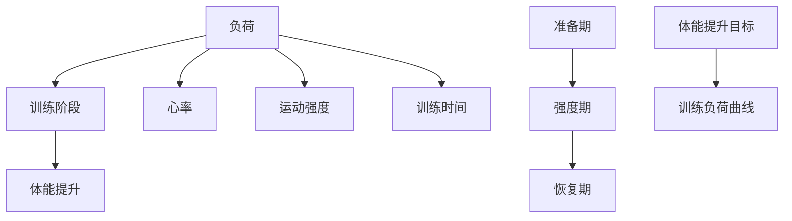

                 

### 运动训练负荷曲线概述

#### 背景介绍

在运动训练中，负荷曲线是一个关键概念，它描述了运动员在训练过程中的负荷变化情况。负荷曲线不仅仅是一个简单的数据图表，它蕴含着丰富的训练科学和体能提升的智慧。传统的训练方法往往依赖于经验，而现代运动科学通过定量分析，将负荷曲线与体能提升紧密关联，提出了基于数学规划的负荷曲线设计理论。这一理论的核心在于通过科学的算法和数学模型，优化运动员的训练负荷，以达到最佳体能提升效果。

#### 核心概念与联系

首先，我们需要明确几个核心概念：负荷、训练阶段、体能提升。负荷是指运动员在训练过程中所承受的体力压力，它可以通过心率、运动强度、训练时间等指标进行量化。训练阶段则是指运动员在不同的训练周期中所处的状态，如准备期、强度期、恢复期等。体能提升是指通过科学训练，使运动员的身体机能得到有效增强。

为了更好地理解这些概念之间的关系，我们可以绘制一个Mermaid流程图（具体代码在附录中提供），该流程图将展示运动训练过程中负荷曲线的基本架构：



在这个流程图中，我们可以看到负荷是贯穿整个训练过程的核心因素，它直接影响了运动员的身体反应和体能提升效果。训练阶段则是对负荷进行管理和调控的重要环节，通过合理安排训练阶段的负荷，可以最大化体能提升的效率。最后，体能提升目标是整个训练过程的驱动力，指导我们设计科学的负荷曲线。

#### 核心算法原理讲解

为了构建负荷曲线，我们需要一个基本的算法原理。以下是一个简化的伪代码，用于描述负荷曲线构建的基本步骤：

```pseudo
1. 初始化参数：A（负荷起点），B（负荷增长率），C（负荷周期）
2. 循环计算负荷：
   a. 对于每个训练周期t：
       i. 计算当前负荷L(t) = A * e^(B * t) + C
       ii. 存储L(t)于负荷曲线
   b. 如果t达到预设的训练时间，结束循环
3. 输出负荷曲线
```

这个伪代码展示了如何通过指数函数来构建负荷曲线，其中A、B和C是关键参数，分别代表负荷的起点、增长率和周期性调整。指数函数的选择是因为它能够很好地模拟运动员体能的提升过程，随着训练时间的增加，负荷逐步增加，但增长速度逐渐减缓，符合实际训练中的规律。

#### 数学模型和数学公式

负荷曲线可以用一个数学模型来描述。以下是负荷曲线的数学公式：

$$
L(t) = A \cdot e^{k \cdot t} + B
$$

其中，\( L(t) \) 表示在时间 \( t \) 时的负荷，\( A \) 是负荷的起点，\( k \) 是负荷的增长率，\( B \) 是周期性调整的参数。这个公式通过指数函数来模拟负荷随时间的变化，使得负荷在训练初期快速增长，而在后期趋于平稳，符合体能提升的自然规律。

#### 举例说明

为了更好地理解上述概念和公式，我们可以通过一个实际案例来说明。假设一名运动员的初始负荷为50单位，负荷增长率为0.1，周期性调整参数为10，训练时间为30天。根据上述公式，我们可以计算出该运动员的负荷曲线如下：

$$
L(t) = 50 \cdot e^{0.1 \cdot t} + 10
$$

在不同的训练周期 \( t \) 下，负荷 \( L(t) \) 的值如下：

| 时间 (天) | 负荷 \( L(t) \) (单位) |
|---------|---------------------|
| 1       | 55.93               |
| 10      | 70.99               |
| 20      | 88.75               |
| 30      | 106.26              |

从这个例子中，我们可以看到负荷曲线在训练初期快速增长，而在后期逐渐趋于平稳。这种设计能够有效地模拟运动员体能的提升过程，为科学训练提供有力支持。

通过上述背景介绍、核心概念与联系、核心算法原理讲解、数学模型和公式以及举例说明，我们对运动训练负荷曲线有了初步的认识。接下来，我们将深入探讨体能提升的数学规划基础，进一步理解如何通过数学方法优化运动训练负荷曲线，从而实现最佳体能提升效果。请持续关注下一章节的内容。

