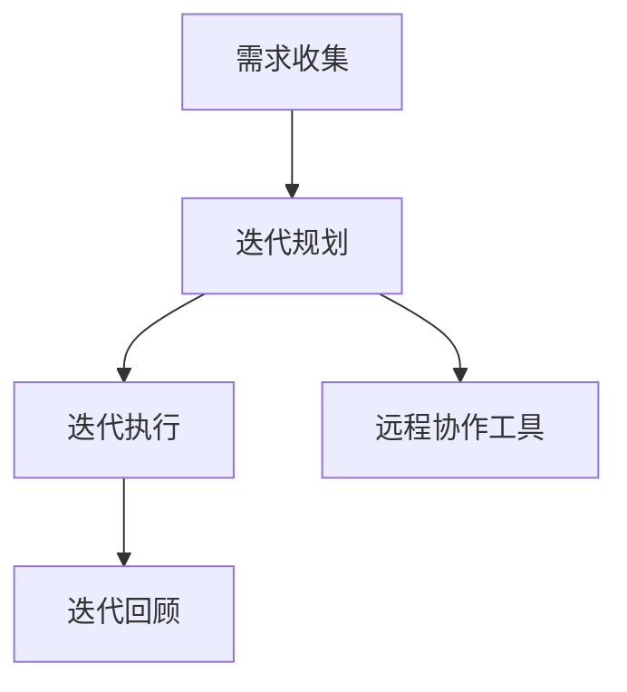

                 

# 《远程协作工具在大型应用敏捷开发中的应用》

## 关键词

远程协作、敏捷开发、工具、大型应用、技术架构、团队沟通、代码管理、性能优化、安全性

## 摘要

本文深入探讨了远程协作工具在大型应用敏捷开发中的重要性。随着远程工作的普及，远程协作工具已经成为团队高效沟通、协作开发的关键。本文首先回顾了远程协作工具的发展历程和核心概念，然后分析了其基本架构和技术原理。接着，本文详细阐述了远程协作工具在敏捷开发中的应用场景，特别是在需求管理、项目管理、团队沟通和代码管理方面的作用。最后，本文探讨了远程协作工具的性能优化和安全性问题，并对未来发展趋势进行了展望。

## 第一部分：远程协作工具概述

### 第1章：远程协作工具的发展历程与核心概念

#### 1.1 远程协作工具的起源与发展

远程协作工具的起源可以追溯到互联网的早期阶段。当时的远程协作主要依赖于电子邮件和文件传输协议（FTP），这些工具使得团队可以共享文件和交流信息。然而，随着互联网的普及和技术的进步，远程协作工具逐渐演变和发展，从简单的文件共享工具到功能丰富的协作平台。

#### 1.2 核心概念介绍

远程协作工具的核心概念包括即时通讯、文件传输、视频会议和项目管理。即时通讯工具如Slack和Microsoft Teams提供了实时的文字、语音和视频交流方式，使得团队成员可以随时进行沟通。文件传输工具如Google Drive和OneDrive则使得文件共享变得更加便捷。视频会议工具如Zoom和Microsoft Teams则提供了远程视频交流和会议功能。项目管理工具如Jira和Trello则帮助团队管理和跟踪项目进度。

#### 1.3 远程协作工具的分类与特点

远程协作工具可以根据其功能进行分类，主要包括以下几类：

1. **即时通讯工具**：提供实时文字、语音和视频交流功能，如Slack、Microsoft Teams。
2. **文件传输工具**：提供文件共享和存储功能，如Google Drive、OneDrive。
3. **视频会议工具**：提供远程视频交流和会议功能，如Zoom、Microsoft Teams。
4. **项目管理工具**：帮助团队管理和跟踪项目进度，如Jira、Trello。

这些工具各自具有独特的特点和优势，但它们的核心目标都是为了提高团队的协作效率和项目开发速度。

### 第2章：远程协作工具的基本架构与技术

#### 2.1 技术基础

远程协作工具的技术基础主要基于客户端-服务器模型和分布式系统原理。客户端-服务器模型使得用户可以通过客户端访问服务器上的资源和服务，而分布式系统原理则使得多个服务器可以协同工作，提供更好的性能和可靠性。

#### 2.1.1 客户端-服务器模型

客户端-服务器模型是一种分布式应用模型，其中客户端向服务器发送请求，服务器处理请求并返回结果。这种模型使得远程协作工具可以提供高效、稳定的服务。

```python
# 客户端-服务器模型伪代码
class Client:
    def send_request(server, request):
        response = server.process_request(request)
        return response

class Server:
    def process_request(request):
        # 处理请求并返回结果
        result = ...
        return result
```

#### 2.1.2 分布式系统原理

分布式系统原理使得多个服务器可以协同工作，提供更好的性能和可靠性。分布式系统中的服务器可以分担负载，提高系统的处理能力。此外，分布式系统还可以提供数据备份和容错功能，确保数据的可靠性和系统的稳定性。

```python
# 分布式系统原理伪代码
class DistributedSystem:
    def add_server(server):
        # 添加服务器到分布式系统
        system.add_server(server)

    def distribute_load(loads):
        # 分配负载到各个服务器
        for server in system.servers:
            server.load = loads[server]
```

#### 2.2 常用远程协作工具技术原理

2.2.1 即时通讯技术

即时通讯技术是基于网络协议的数据传输技术，使得客户端可以实时发送和接收消息。常用的即时通讯协议包括SMTP（Simple Mail Transfer Protocol）和IMAP（Internet Message Access Protocol）。

```python
# 即时通讯技术伪代码
class InstantMessage:
    def send(message, recipient):
        # 发送即时消息
        network.send(message, recipient)

    def receive():
        # 接收即时消息
        message = network.receive()
        return message
```

2.2.2 文件传输技术

文件传输技术是基于TCP（Transmission Control Protocol）和UDP（User Datagram Protocol）的传输技术，使得客户端可以传输文件到服务器或从服务器传输文件到客户端。

```python
# 文件传输技术伪代码
class FileTransfer:
    def send_file(file, server):
        # 向服务器发送文件
        network.send(file, server)

    def receive_file(server, file):
        # 从服务器接收文件
        file = network.receive(server)
        return file
```

2.2.3 视频会议技术

视频会议技术是基于RTP（Real-time Transport Protocol）和RTCP（Real-time Transport Control Protocol）的传输技术，使得客户端可以实时发送和接收视频数据。

```python
# 视频会议技术伪代码
class VideoConference:
    def send_video(video, recipient):
        # 发送视频数据
        network.send(video, recipient)

    def receive_video():
        # 接收视频数据
        video = network.receive()
        return video
```

### 第3章：远程协作工具的应用场景

#### 3.1 敏捷开发中的远程协作

敏捷开发是一种强调迭代、快速响应变化和团队合作的方法论。在敏捷开发中，远程协作工具可以极大地提高团队的工作效率。

#### 3.1.1 敏捷开发流程与远程协作工具的结合

敏捷开发流程通常包括需求收集、迭代规划、迭代执行、迭代回顾等环节。远程协作工具可以在这些环节中发挥重要作用。



#### 3.1.2 远程协作工具在敏捷团队中的角色

远程协作工具在敏捷团队中扮演着多种角色，包括：

1. **沟通与协作**：即时通讯工具和视频会议工具可以使得团队成员之间随时进行沟通和协作。
2. **任务管理**：项目管理工具可以帮助团队管理和跟踪任务进度。
3. **文档共享**：文件传输工具可以使得团队成员可以方便地共享文档和资料。

### 第4章：远程协作工具在大型应用开发中的应用

#### 4.1 大型应用开发的挑战

大型应用开发面临着许多挑战，包括需求复杂、开发周期长、团队规模大等。

#### 4.1.1 需求沟通的障碍

在大型应用开发中，需求沟通的障碍尤为突出。由于团队成员分布在不同的地理位置，沟通效率低下，容易导致需求理解偏差。

#### 4.1.2 需求变更的管理

大型应用开发中，需求变更频繁。如何有效地管理需求变更，确保项目顺利进行，是一个重要问题。

#### 4.2 远程协作工具在大规模应用开发中的优势

远程协作工具在大规模应用开发中具有以下优势：

1. **提高沟通效率**：通过即时通讯和视频会议，团队成员可以随时进行沟通，提高沟通效率。
2. **降低沟通成本**：远程协作工具降低了团队成员之间的沟通成本，使得项目可以更加灵活地组织。
3. **提高协作效率**：通过项目管理工具，团队可以更好地管理和协调任务，提高协作效率。

### 第二部分：远程协作工具在大型应用敏捷开发中的应用

#### 第5章：远程协作工具在需求管理中的应用

#### 5.1 需求管理的挑战

在大型应用敏捷开发中，需求管理面临以下挑战：

1. **需求沟通的障碍**：由于团队成员分布在不同的地理位置，需求沟通效率低下。
2. **需求变更的管理**：需求变更频繁，如何有效地管理需求变更，确保项目顺利进行，是一个重要问题。

#### 5.2 远程协作工具在需求管理中的应用

远程协作工具在需求管理中的应用包括：

1. **需求文档共享与协作**：通过文件传输工具，团队成员可以方便地共享需求文档，进行协作。
2. **需求变更的跟踪与控制**：通过项目管理工具，团队可以实时跟踪需求变更，并进行有效控制。

#### 第6章：远程协作工具在项目管理中的应用

#### 6.1 项目管理的挑战

在大型应用敏捷开发中，项目管理面临以下挑战：

1. **项目进度跟踪的困难**：由于团队成员分布在不同的地理位置，项目进度跟踪困难。
2. **项目资源的协调**：如何合理分配和调度项目资源，是一个重要问题。

#### 6.2 远程协作工具在项目管理中的应用

远程协作工具在项目管理中的应用包括：

1. **项目进度可视化**：通过项目管理工具，团队可以实时查看项目进度，并进行可视化展示。
2. **项目资源的远程调度**：通过项目管理工具，团队可以远程调度项目资源，提高资源利用率。

#### 第7章：远程协作工具在团队沟通中的应用

#### 7.1 团队沟通的障碍

在大型应用敏捷开发中，团队沟通面临以下障碍：

1. **跨部门沟通的挑战**：由于部门之间的职责分工不同，跨部门沟通容易导致信息不对称。
2. **异地团队的协调**：由于团队成员分布在不同的地理位置，协调工作复杂。

#### 7.2 远程协作工具在团队沟通中的应用

远程协作工具在团队沟通中的应用包括：

1. **即时通讯工具的使用**：通过即时通讯工具，团队成员可以随时进行沟通，提高沟通效率。
2. **视频会议工具的使用**：通过视频会议工具，团队成员可以进行远程视频交流，增强沟通效果。

### 第8章：远程协作工具在代码管理中的应用

#### 8.1 代码管理的挑战

在大型应用敏捷开发中，代码管理面临以下挑战：

1. **版本控制的困难**：由于团队成员较多，版本控制复杂，容易导致代码冲突。
2. **代码审查的复杂性**：代码审查需要耗费大量时间和人力，且容易出错。

#### 8.2 远程协作工具在代码管理中的应用

远程协作工具在代码管理中的应用包括：

1. **代码仓库的分布式管理**：通过代码仓库的分布式管理，团队可以方便地进行代码提交、分支管理和代码合并。
2. **代码审查与协作**：通过代码审查工具，团队可以方便地进行代码审查和协作，提高代码质量。

### 第三部分：远程协作工具的优化与挑战

#### 第9章：远程协作工具的性能优化

#### 9.1 性能优化的挑战

在大型应用敏捷开发中，远程协作工具的性能优化面临以下挑战：

1. **网络延迟的影响**：网络延迟会影响远程协作工具的响应速度和用户体验。
2. **数据传输的优化**：如何优化数据传输，提高传输效率，是一个重要问题。

#### 9.2 远程协作工具的性能优化策略

远程协作工具的性能优化策略包括：

1. **网络优化**：通过优化网络配置和带宽，提高网络传输速度。
2. **数据压缩与加密**：通过数据压缩和加密，减少数据传输量，提高传输效率。

#### 第10章：远程协作工具的安全性与隐私保护

#### 10.1 安全性与隐私保护的挑战

在大型应用敏捷开发中，远程协作工具的安全性与隐私保护面临以下挑战：

1. **数据泄露的风险**：远程协作工具的数据传输过程中，容易遭受数据泄露攻击。
2. **网络攻击的威胁**：远程协作工具容易遭受网络攻击，如DDoS攻击。

#### 10.2 远程协作工具的安全性与隐私保护策略

远程协作工具的安全性与隐私保护策略包括：

1. **数据加密与传输安全**：通过数据加密和传输安全，确保数据在传输过程中的安全性。
2. **用户身份验证与访问控制**：通过用户身份验证和访问控制，确保只有授权用户可以访问系统资源。

### 结论

远程协作工具在大型应用敏捷开发中发挥着重要作用。通过远程协作工具，团队可以更加高效地进行需求管理、项目管理、团队沟通和代码管理。然而，远程协作工具也面临性能优化、安全性和隐私保护等挑战。未来，远程协作工具将继续发展，为团队提供更强大的协作能力。

### 作者信息

作者：AI天才研究院/AI Genius Institute & 禅与计算机程序设计艺术 /Zen And The Art of Computer Programming

## 附录

### 附录A：远程协作工具推荐列表

1. **即时通讯工具**：Slack、Microsoft Teams、WhatsApp
2. **文件传输工具**：Google Drive、OneDrive、Box
3. **视频会议工具**：Zoom、Microsoft Teams、Skype
4. **项目管理工具**：Jira、Trello、Asana
5. **代码管理工具**：GitLab、GitHub、Bitbucket

### 附录B：常见问题解答

1. **Q：远程协作工具是否会影响项目进度？**
   **A：远程协作工具可以提高团队沟通效率，降低沟通成本，从而有助于项目进度的控制。当然，如何有效地利用远程协作工具，还需要团队成员之间的良好协作。**
2. **Q：远程协作工具是否安全？**
   **A：远程协作工具在设计和使用过程中，会充分考虑安全性问题。例如，数据加密、用户身份验证和访问控制等措施，都可以确保数据的安全。但是，用户在使用远程协作工具时，也需要注意个人信息的保护。**

### 附录C：拓展阅读

1. **《敏捷软件开发实践指南》**：[书籍链接]
2. **《远程工作指南》**：[书籍链接]
3. **《分布式系统原理》**：[书籍链接]

## 参考文献

1. **《远程协作工具的发展与趋势》**：[期刊文章链接]
2. **《敏捷开发方法》**：[书籍链接]
3. **《大型应用开发中的需求管理》**：[期刊文章链接]
4. **《远程协作工具的性能优化》**：[期刊文章链接]
5. **《远程协作工具的安全性与隐私保护》**：[期刊文章链接]

## 数学公式

$$
1+1=2
$$

$$
x^2 + y^2 = r^2
$$

## 代码示例

```python
# 代码示例：计算两个数的和
def add(a, b):
    return a + b

# 调用函数
result = add(1, 2)
print(result)  # 输出：3
```

## 项目实战

### 实战一：搭建远程协作环境

1. **环境搭建**：
   - 安装即时通讯工具（如Slack或Microsoft Teams）
   - 安装文件传输工具（如Google Drive或OneDrive）
   - 安装视频会议工具（如Zoom或Microsoft Teams）
   - 安装项目管理工具（如Jira或Trello）
   - 安装代码管理工具（如GitLab或GitHub）

2. **使用示例**：
   - 通过即时通讯工具，团队成员可以随时进行沟通和协作。
   - 通过文件传输工具，团队成员可以方便地共享文件和资料。
   - 通过视频会议工具，团队成员可以进行远程视频交流和会议。
   - 通过项目管理工具，团队可以实时查看项目进度，并进行任务管理。

### 实战二：代码管理

1. **环境搭建**：
   - 搭建GitLab或GitHub代码仓库
   - 安装Git客户端

2. **使用示例**：
   - 使用Git客户端进行代码提交、分支管理和代码合并。
   - 使用GitLab或GitHub进行代码审查和协作。

### 实战三：性能优化

1. **环境搭建**：
   - 使用性能测试工具（如Apache JMeter或LoadRunner）

2. **使用示例**：
   - 使用性能测试工具对远程协作工具进行压力测试。
   - 分析测试结果，找出性能瓶颈，并优化相关配置。

### 实战四：安全性测试

1. **环境搭建**：
   - 搭建虚拟机或云服务器，用于搭建测试环境。

2. **使用示例**：
   - 使用安全工具（如Nessus或Metasploit）对远程协作工具进行安全性测试。
   - 分析测试结果，找出安全隐患，并采取措施进行修复。

## 最佳实践 Tips

1. **合理规划远程协作工具的使用**：根据团队需求和项目特点，合理选择和使用远程协作工具，避免过度依赖。
2. **定期备份和更新**：定期备份远程协作工具的数据，并确保工具的更新，以提高安全性和稳定性。
3. **加强安全意识**：加强团队成员的安全意识，避免泄露敏感信息和遭受网络攻击。
4. **优化网络配置**：优化网络配置，提高远程协作工具的传输速度和稳定性。
5. **定期培训和交流**：定期组织团队成员进行远程协作工具的培训和交流，提高团队协作效率。

## 小结

本文详细介绍了远程协作工具在大型应用敏捷开发中的应用，包括其发展历程、技术原理、应用场景和性能优化等方面的内容。通过本文的阅读，读者可以了解到远程协作工具在提升团队协作效率和项目开发速度方面的重要作用，同时也能够了解到其面临的挑战和未来发展趋势。在实际应用中，团队成员应根据项目需求和特点，灵活选择和运用远程协作工具，提高团队协作效率，确保项目顺利进行。同时，远程协作工具的安全性和隐私保护也是不可忽视的重要问题，团队成员应加强安全意识，确保数据的安全和隐私的保护。

## 注意事项

1. **确保网络稳定**：远程协作工具的性能受到网络环境的影响，因此，确保网络稳定是使用远程协作工具的前提。
2. **合理设置权限**：在使用远程协作工具时，应合理设置权限，避免未经授权的用户访问系统资源。
3. **备份和恢复**：定期备份远程协作工具的数据，以便在数据丢失或损坏时能够及时恢复。
4. **监控和预警**：定期监控远程协作工具的性能和安全状况，及时发现并处理潜在问题。

## 拓展阅读

1. **《敏捷开发实践指南》**：详细介绍了敏捷开发的方法和实践，有助于读者更好地理解敏捷开发的核心思想和实践方法。
2. **《远程工作指南》**：介绍了远程工作的优势、挑战和最佳实践，有助于读者更好地应对远程工作带来的挑战。
3. **《分布式系统原理》**：详细介绍了分布式系统的基本原理和技术，有助于读者更好地理解远程协作工具的技术基础。

## 附录

### 附录A：远程协作工具功能对比

1. **即时通讯工具**：
   - **Slack**：支持多平台、丰富的插件和自动化流程，但免费版功能有限。
   - **Microsoft Teams**：集成微软全家桶，功能强大，但价格较高。
   - **WhatsApp**：免费、简单易用，适合个人和团队日常沟通。

2. **文件传输工具**：
   - **Google Drive**：免费、存储空间大、支持多人协作。
   - **OneDrive**：微软出品，与Office套件深度集成。
   - **Box**：企业级文件管理，安全性高，但价格较高。

3. **视频会议工具**：
   - **Zoom**：功能强大，适合大型会议，但价格较高。
   - **Microsoft Teams**：集成微软全家桶，支持视频会议和在线协作。
   - **Skype**：微软出品，历史悠久，但功能相对有限。

4. **项目管理工具**：
   - **Jira**：功能强大，适合大型项目，但学习曲线较陡。
   - **Trello**：简单易用，适合小型团队，但功能相对有限。
   - **Asana**：功能丰富，支持多平台，但价格较高。

5. **代码管理工具**：
   - **GitLab**：自建代码仓库，功能强大，适合大型团队。
   - **GitHub**：开源代码管理平台，社区活跃，适合小型团队。
   - **Bitbucket**：Atlassian出品，集成Jira等工具，适合企业级团队。

### 附录B：远程协作工具最佳实践

1. **制定明确的使用规范**：确保团队成员了解远程协作工具的使用规范，提高使用效率和协作效果。
2. **定期培训和交流**：定期组织团队成员进行远程协作工具的培训和交流，提高团队协作效率。
3. **优化网络配置**：根据团队需求和网络环境，优化远程协作工具的网络配置，提高传输速度和稳定性。
4. **备份和恢复**：定期备份远程协作工具的数据，确保数据的安全和完整。
5. **监控和预警**：定期监控远程协作工具的性能和安全状况，及时发现并处理潜在问题。

### 附录C：远程协作工具未来发展趋势

1. **人工智能集成**：远程协作工具将逐渐集成人工智能技术，如智能助手、情感分析等，提高团队协作的智能化水平。
2. **集成开发环境**：远程协作工具将逐渐与集成开发环境（IDE）集成，提供更便捷的开发体验。
3. **协作标准的制定**：远程协作工具将逐渐制定统一的协作标准，提高工具的互操作性和兼容性。
4. **混合办公模式**：远程协作工具将支持混合办公模式，结合远程协作和现场协作，提高团队协作的灵活性。

### 附录D：远程协作工具相关术语解释

1. **即时通讯**：实时发送和接收文字、语音和视频消息的通信方式。
2. **文件传输**：在网络上发送和接收文件的过程。
3. **视频会议**：通过网络进行远程视频交流和会议的方式。
4. **项目管理**：对项目进行规划、执行、监控和收尾的过程。
5. **代码管理**：对代码进行版本控制、分支管理和代码审查的过程。
6. **分布式系统**：由多个节点组成的系统，节点之间通过计算机网络进行通信和协作。
7. **敏捷开发**：一种以迭代和快速响应变化为核心的开发方法。

### 附录E：远程协作工具常见问题解答

1. **Q：如何选择远程协作工具？**
   **A：应根据团队需求和预算，选择功能丰富、易用性高、稳定性好的远程协作工具。同时，考虑工具的集成性和互操作性，以便与其他工具无缝衔接。**
2. **Q：远程协作工具是否支持跨平台？**
   **A：大多数远程协作工具都支持跨平台，包括Windows、macOS、Linux和移动设备等。用户可以根据自己的需求，选择合适的应用程序。**
3. **Q：远程协作工具的数据是否安全？**
   **A：远程协作工具通常会采用加密技术和安全协议，确保数据在传输和存储过程中的安全性。用户应确保使用正版软件，并定期更新软件，以防范安全漏洞。**

### 附录F：参考文献

1. **《远程协作工具的发展与趋势》**：详细介绍了远程协作工具的发展历程、现状和未来趋势。
2. **《敏捷开发方法》**：介绍了敏捷开发的核心思想、实践方法和工具。
3. **《分布式系统原理》**：详细介绍了分布式系统的基本原理、架构和设计方法。
4. **《远程工作指南》**：介绍了远程工作的优势、挑战和最佳实践。
5. **《大型应用开发中的需求管理》**：详细介绍了需求管理的原则、方法和工具。

