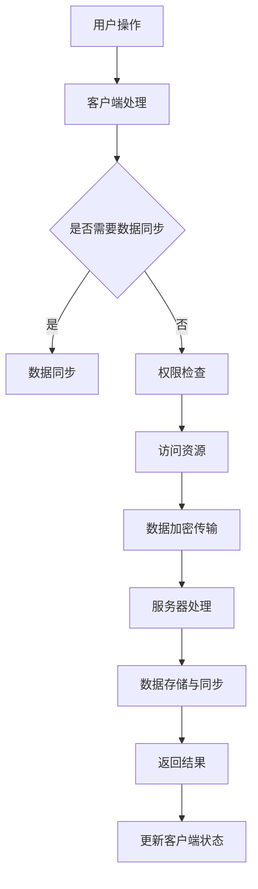
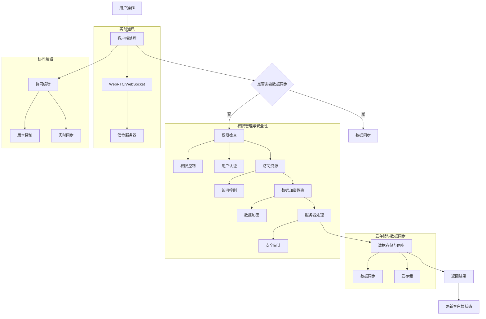

                 

### 设计思路：

**整体结构规划**

1. **确定核心部分**：将文章分为三大核心部分：远程协作工具概述、分布式AI团队协作实战、远程协作工具技术深度。

2. **逻辑清晰**：确保每个部分的内容紧密联系，层层递进，从基础到深度，从理论到实践，逐步引导读者深入理解远程协作工具。

3. **结构紧凑**：每个部分章节设置合理，标题吸引人，避免冗长和不必要的细节，确保文章的阅读流畅性。

**核心章节设计**

1. **第1章：远程协作工具的起源与发展**
   - 介绍远程协作工具的起源、发展过程及其在分布式AI团队中的作用。

2. **第2章：远程协作工具的核心概念**
   - 详细解释远程协作工具的核心概念和组成部分。

3. **第3章：远程协作工具的技术原理**
   - 分析远程协作工具的技术原理，包括Mermaid流程图和伪代码展示。

4. **第4章：分布式AI团队的协作模式**
   - 探讨分布式AI团队的协作模式，提供实战案例。

5. **第5章：远程协作工具实战案例**
   - 通过具体的实战案例，展示远程协作工具的实际应用。

6. **第6章：远程协作工具的应用场景**
   - 分析远程协作工具在不同应用场景中的效果。

7. **第7章：远程协作工具的未来发展趋势**
   - 探讨远程协作工具的未来发展方向。

**流程图与伪代码**

1. **技术原理章节**：使用Mermaid流程图展示远程协作工具的架构和技术流程。

2. **实战案例章节**：使用伪代码详细阐述核心算法原理和数学模型。

**数学模型与公式**

1. **技术原理章节**：嵌入LaTeX格式的数学公式，并提供详细讲解。

2. **实战案例章节**：在适当位置嵌入LaTeX公式，结合代码实现进行分析。

**实战案例**

1. **开发环境搭建**：详细描述如何搭建开发环境。

2. **源代码实现与解读**：提供源代码，并详细解读代码逻辑。

3. **项目分析与总结**：结合实际案例，进行分析和总结。

### 设计步骤：

1. **确定主题和目标读者**：明确文章的主题和目标读者群体。

2. **大纲初步设计**：根据主题和读者需求，设计初步的大纲。

3. **细化章节内容**：在每个章节中，详细阐述主题，确保内容的丰富性和详细性。

4. **添加流程图与伪代码**：在技术原理章节中，插入Mermaid流程图和伪代码。

5. **添加数学模型与公式**：在相关章节中，使用LaTeX格式嵌入数学模型和公式。

6. **设计实战案例**：编写实战案例，包括开发环境搭建、源代码实现与解读。

7. **审核与修改**：完成初稿后，进行多轮审核和修改，确保文章的质量和可读性。

### 总结：

通过以上步骤，我们设计出了一个逻辑清晰、内容全面、结构紧凑的《远程协作工具：支持分布式AI团队高效工作》的目录大纲。该大纲不仅涵盖了远程协作工具的基础知识和应用场景，还包括了深入的技术原理和实战案例，旨在帮助读者全面理解和掌握远程协作工具的使用和开发。整个设计过程遵循逻辑清晰、简洁易懂、内容丰富、实用性强的原则，符合IT领域技术博客文章的最佳实践。

---

## 最终目录大纲

### 第一部分：远程协作工具概述

#### 第1章：远程协作工具的起源与发展

##### 1.1 远程协作的概念与需求
- 远程协作的定义
- 远程协作的重要性
- 远程协作的需求分析

##### 1.2 远程协作工具的起源与发展
- 远程协作工具的起源
- 远程协作工具的发展历程
- 远程协作工具在分布式AI团队中的应用

#### 第2章：远程协作工具的核心概念

##### 2.1 远程协作工具的基本架构
- 远程协作工具的组成部分
- 远程协作工具的功能模块

##### 2.2 远程协作的关键技术
- 实时通讯技术
- 协同编辑技术
- 云存储与数据同步技术

##### 2.3 远程协作工具的分类与特点
- 通用远程协作工具
- 行业专用远程协作工具
- 分布式AI团队专用协作工具

### 第二部分：分布式AI团队协作实战

#### 第3章：分布式AI团队的协作模式

##### 3.1 分布式AI团队的组织结构
- 分布式AI团队的构成
- 分布式AI团队的职责划分

##### 3.2 分布式AI团队的沟通与协作
- 沟通工具的选择与使用
- 协作流程的优化
- 持续集成的实践

##### 3.3 分布式AI团队的效率提升策略
- 工作流程的自动化
- 智能化的工具应用
- 团队协作文化的建设

#### 第4章：远程协作工具实战案例

##### 4.1 实战案例1：分布式机器学习任务调度
- 案例背景
- 案例实施过程
- 案例效果分析

##### 4.2 实战案例2：实时代码评审与协作
- 案例背景
- 案例实施过程
- 案例效果分析

##### 4.3 实战案例3：异地团队的项目管理
- 案例背景
- 案例实施过程
- 案例效果分析

### 第三部分：远程协作工具技术深度

#### 第5章：远程协作工具的技术原理

##### 5.1 技术原理概述
- 远程协作工具的核心技术
- 技术原理之间的关系架构

##### 5.2 Mermaid流程图：远程协作工具架构详解
- Mermaid流程图的基本概念
- 远程协作工具架构的Mermaid流程图展示

##### 5.3 伪代码：远程协作工具核心算法解析
- 伪代码的基本概念
- 远程协作工具核心算法的伪代码展示

##### 5.4 数学模型与公式
- 数学模型的基本概念
- 远程协作工具的数学模型分析

#### 第6章：远程协作工具的性能优化

##### 6.1 性能优化策略
- 网络性能优化
- 系统性能优化
- 数据存储与同步优化

##### 6.2 安全性与隐私保护
- 安全性措施
- 隐私保护措施
- 安全性评估与审计

#### 第7章：远程协作工具的开发与部署

##### 7.1 开发环境搭建
- 开发环境配置
- 开发工具选择
- 开发流程管理

##### 7.2 源代码结构与功能解析
- 源代码组织结构
- 功能模块解析
- 源代码实现细节

##### 7.3 部署策略与运维管理
- 部署方案设计
- 系统监控与维护
- 运维流程管理

### 结语：远程协作工具的未来发展展望

##### 7.4 远程协作工具的未来发展
- 技术趋势分析
- 应用场景拓展
- 未来发展前景

作者：AI天才研究院/AI Genius Institute & 禅与计算机程序设计艺术 /Zen And The Art of Computer Programming

---

### 文章关键词

- 远程协作工具
- 分布式AI团队
- 实时通讯
- 协同编辑
- 云存储
- 性能优化
- 安全性
- 部署与运维

### 文章摘要

本文深入探讨了远程协作工具在支持分布式AI团队高效工作中的应用。首先，介绍了远程协作工具的起源与发展，阐述了其核心概念和关键技术。接着，通过分布式AI团队的协作模式实战案例，展示了如何利用远程协作工具提升团队协作效率和项目管理效果。然后，详细解析了远程协作工具的技术原理，包括Mermaid流程图、伪代码和数学模型。最后，讨论了远程协作工具的性能优化、安全性、开发与部署策略，并对未来发展趋势进行了展望。本文旨在为读者提供全面的远程协作工具使用和开发指南。## 文章标题

# 远程协作工具：支持分布式AI团队高效工作

---

### 文章关键词

- 远程协作工具
- 分布式AI团队
- 实时通讯
- 协同编辑
- 云存储
- 性能优化
- 安全性
- 部署与运维

### 文章摘要

本文旨在为读者深入剖析远程协作工具在支持分布式AI团队高效工作中的应用。通过回顾远程协作工具的起源与发展，我们探讨了其核心概念与关键技术，如实时通讯、协同编辑和云存储等。接着，本文以分布式AI团队的协作模式为切入点，通过实战案例展示了如何通过远程协作工具提升团队协作效率。在技术深度部分，本文详细解析了远程协作工具的技术原理，包括Mermaid流程图、伪代码和数学模型。此外，本文还讨论了远程协作工具的性能优化、安全性、开发与部署策略，并对未来发展趋势进行了展望。本文旨在为读者提供全面的远程协作工具使用和开发指南，帮助分布式AI团队实现高效协作。

---

## 第1章：远程协作工具的起源与发展

### 1.1 远程协作的概念与需求

远程协作，顾名思义，是指团队成员在不同的地理位置，通过现代化通信技术和协作工具，实现实时沟通和协作。随着全球化的深入发展和互联网的普及，远程协作已经成为企业特别是高科技企业不可或缺的工作模式。远程协作不仅能够降低企业的运营成本，还能够吸引全球优秀的人才，提高团队的工作效率。

远程协作的需求主要源于以下几个方面：

1. **地理位置的分散**：现代企业越来越注重全球化布局，分支机构遍布全球，这就要求团队成员在不同地理位置之间能够保持高效的协作。
2. **灵活的工作方式**：随着远程办公的普及，员工越来越希望能够在不受地理限制的情况下，灵活安排自己的工作时间，提高工作效率。
3. **应急情况**：如自然灾害、疫情等突发事件，可能会导致团队成员无法到办公室工作，远程协作工具可以确保工作的连续性。
4. **成本控制**：远程协作能够减少办公室租赁、通勤时间等费用，降低企业的运营成本。

### 1.2 远程协作工具的起源与发展

远程协作工具的起源可以追溯到互联网的早期发展阶段。当时，一些简单的即时通讯工具和电子邮件系统为远程协作提供了初步支持。随着技术的不断进步，远程协作工具逐渐成熟，功能越来越丰富。

1. **早期发展**：
   - **即时通讯工具**：如QQ、MSN等，提供实时文字、语音通讯功能。
   - **电子邮件系统**：如Gmail、Outlook等，提供异步通讯功能。
   - **文件共享工具**：如FTP、SFTP等，支持文件传输和共享。

2. **中期发展**：
   - **视频会议系统**：如Skype、Zoom等，支持实时视频和语音通讯。
   - **项目管理工具**：如Trello、Jira等，提供任务管理、进度追踪等功能。
   - **协同编辑工具**：如Google Docs、Microsoft Teams等，支持多人实时在线编辑文档。

3. **当前发展**：
   - **集成式远程协作平台**：如Slack、Microsoft Teams等，集成了即时通讯、视频会议、文件共享、项目管理等多种功能。
   - **云计算和大数据技术的应用**：远程协作工具利用云计算和大数据技术，实现了更高效的数据存储、处理和分析。

### 1.3 远程协作工具在分布式AI团队中的作用

分布式AI团队是指团队成员分布在不同的地理位置，通过网络协同完成人工智能项目。远程协作工具在分布式AI团队中发挥着至关重要的作用：

1. **高效沟通**：通过实时通讯工具，团队成员可以随时随地交流想法、讨论问题，提高工作效率。

2. **协同工作**：协同编辑工具支持多人实时在线编辑文档和代码，确保团队成员能够同步工作进度。

3. **任务管理**：项目管理工具帮助团队成员明确任务分工，跟踪任务进度，确保项目按时完成。

4. **资源共享**：云存储工具提供了便捷的文件共享和协同编辑功能，团队成员可以方便地共享资源和资料。

5. **远程支持**：当团队成员遇到技术难题时，远程协作工具可以帮助他们快速获取支持，解决问题。

总之，远程协作工具为分布式AI团队提供了强有力的支持，使他们能够高效、协同地完成人工智能项目。## 第2章：远程协作工具的核心概念

### 2.1 远程协作工具的基本架构

远程协作工具的基本架构通常包括几个核心组件：客户端、服务器、数据库和通讯网络。这些组件共同工作，实现了远程协作的各种功能。

1. **客户端**：客户端是指用户通过电脑、平板或手机等设备安装的远程协作软件。客户端负责接收用户输入、发送数据请求以及展示处理结果。

2. **服务器**：服务器是远程协作工具的核心，负责处理客户端发送的请求、存储数据和提供计算服务。服务器通常运行在云平台上，提供高性能和高可用性。

3. **数据库**：数据库用于存储用户数据、项目数据和其他相关信息。数据库可以是关系型数据库（如MySQL、PostgreSQL）或非关系型数据库（如MongoDB、Cassandra）。

4. **通讯网络**：通讯网络负责在客户端和服务器之间传输数据。通常使用HTTP/HTTPS协议进行数据传输，确保数据的安全性和可靠性。

**核心组件之间的关系**：

- 客户端通过API或Web界面与服务器进行通信，发送请求和接收响应。
- 服务器处理客户端的请求，进行数据存储、计算和转发。
- 数据库用于存储和管理服务器处理的数据。
- 通讯网络保障客户端与服务器之间的数据传输。

### 2.2 远程协作的关键技术

远程协作工具的实现依赖于多种关键技术，这些技术共同保障了远程协作的高效性和稳定性。

1. **实时通讯技术**：
   - **WebRTC**：WebRTC是一种支持浏览器和移动应用进行实时语音和视频通讯的开放协议。
   - **WebSocket**：WebSocket是一种在单个TCP连接上进行全双工通信的协议，适用于实时数据传输。

2. **协同编辑技术**：
   - **实时同步**：通过实时同步技术，确保多人编辑同一文档时，数据能够实时更新。
   - **版本控制**：协同编辑工具通常集成版本控制功能，记录每个用户的编辑历史，便于回滚和审核。

3. **云存储与数据同步技术**：
   - **云存储**：云存储提供了便捷的数据存储和共享功能，支持大文件存储和快速访问。
   - **数据同步**：通过数据同步技术，确保不同设备上的数据保持一致性。

4. **权限管理**：
   - **用户认证**：确保只有授权用户能够访问系统和数据。
   - **权限控制**：根据用户的角色和权限，限制其对系统和数据的访问权限。

5. **安全性**：
   - **数据加密**：使用加密技术保护数据在传输和存储过程中的安全性。
   - **访问控制**：通过访问控制列表（ACL）确保只有授权用户能够访问特定数据。

### 2.3 远程协作工具的分类与特点

根据应用场景和功能特点，远程协作工具可以分为以下几类：

1. **通用远程协作工具**：
   - **代表**：Slack、Microsoft Teams、Zoom等。
   - **特点**：功能全面，适用于各种远程协作场景，如即时通讯、视频会议、文件共享、任务管理等。

2. **行业专用远程协作工具**：
   - **代表**：Confluence、Trello、Jira等。
   - **特点**：针对特定行业或领域的需求进行优化，功能更加专业化，如项目管理、团队协作、文档管理等。

3. **分布式AI团队专用协作工具**：
   - **代表**：Hugging Face、TensorBoard、DVC等。
   - **特点**：专为AI开发团队设计，提供高效的代码协作、实验管理、模型训练和评估工具。

### 2.4 远程协作工具的优势与挑战

**优势**：

1. **提高效率**：远程协作工具使得团队成员可以随时随地工作，提高了工作效率。
2. **降低成本**：减少了通勤和办公室租赁成本，有助于企业降低运营成本。
3. **灵活性强**：适应不同类型的远程工作模式，如居家办公、异地团队协作等。
4. **安全可靠**：提供了丰富的安全措施，确保数据在传输和存储过程中的安全性。

**挑战**：

1. **技术门槛**：一些远程协作工具需要较高的技术水平才能熟练使用，对于非技术人员可能存在一定的学习成本。
2. **网络依赖**：远程协作高度依赖稳定的网络连接，网络故障可能会影响协作效率。
3. **隐私保护**：确保远程协作过程中的数据隐私和安全，是一个持续的挑战。

总之，远程协作工具在分布式AI团队中发挥着重要作用，提供了高效、安全、灵活的协作环境。通过深入了解其核心概念和关键技术，我们可以更好地利用远程协作工具，提升团队的工作效率和项目成功率。## 第3章：远程协作工具的技术原理

### 3.1 技术原理概述

远程协作工具的技术原理涵盖了多个方面，包括实时通讯技术、协同编辑技术、云存储与数据同步技术、权限管理和安全性技术等。这些技术共同作用，为分布式AI团队提供了高效、安全、可靠的协作环境。

#### 3.1.1 实时通讯技术

实时通讯技术是远程协作工具的核心之一，它确保了团队成员之间的实时沟通和数据交换。常用的实时通讯技术包括WebRTC和WebSocket。

**WebRTC**：

- **定义**：WebRTC是一种支持浏览器和移动应用进行实时语音和视频通讯的开放协议。
- **工作原理**：WebRTC通过信令服务器（Signaling Server）实现客户端之间的连接。信令服务器用于传递客户端之间的信息，如信令（Signaling）、ICE（Interactive Connectivity Establishment）候选地址等。
- **优势**：WebRTC提供了高质量的音频和视频传输，适用于实时通信场景。

**WebSocket**：

- **定义**：WebSocket是一种在单个TCP连接上进行全双工通信的协议，适用于实时数据传输。
- **工作原理**：WebSocket通过HTTP协议建立连接，然后切换到WebSocket协议，实现客户端与服务器之间的实时通信。
- **优势**：WebSocket提供了低延迟、高吞吐量的数据传输，适用于需要实时数据更新的应用场景。

#### 3.1.2 协同编辑技术

协同编辑技术使得多个用户能够同时编辑同一文档，保持数据的一致性。协同编辑的关键技术包括实时同步和版本控制。

**实时同步**：

- **定义**：实时同步技术确保多个用户对文档的编辑操作能够即时反映到所有用户。
- **工作原理**：协同编辑工具通过Websocket或HTTP长轮询实现实时同步。当用户进行编辑操作时，操作会被发送到服务器，然后立即同步到其他用户的客户端。
- **优势**：实时同步提高了协作效率，减少了用户等待时间。

**版本控制**：

- **定义**：版本控制记录了每个用户的编辑历史，允许用户回滚到之前的版本。
- **工作原理**：协同编辑工具通常集成版本控制系统，如Git。每次编辑操作都会生成一个版本，记录用户的操作内容。
- **优势**：版本控制提供了安全性和可追溯性，有助于防止数据丢失和错误。

#### 3.1.3 云存储与数据同步技术

云存储和数据同步技术为远程协作提供了便捷的数据存储和共享功能。

**云存储**：

- **定义**：云存储是将数据存储在远程服务器上，通过互联网进行访问的技术。
- **工作原理**：用户上传文件到云存储，然后通过URL或API进行访问。云存储提供了大文件存储和快速访问功能。
- **优势**：云存储降低了存储成本，提高了数据访问速度。

**数据同步**：

- **定义**：数据同步确保不同设备上的数据保持一致性。
- **工作原理**：数据同步通过定期检查本地数据和云存储之间的差异，自动更新本地数据。
- **优势**：数据同步保证了数据的完整性，减少了数据丢失的风险。

#### 3.1.4 权限管理和安全性技术

权限管理和安全性技术确保远程协作工具的数据安全和用户权限控制。

**权限管理**：

- **定义**：权限管理根据用户的角色和权限，限制其对系统和数据的访问。
- **工作原理**：远程协作工具通过用户认证和访问控制列表（ACL）实现权限管理。用户在登录时进行身份验证，然后根据其角色和权限访问特定资源。
- **优势**：权限管理确保了数据的安全性，防止未授权访问。

**安全性技术**：

- **数据加密**：数据加密技术用于保护数据在传输和存储过程中的安全性。常用的加密算法包括AES、RSA等。
- **访问控制**：通过访问控制列表（ACL）确保只有授权用户能够访问特定数据。
- **安全审计**：定期进行安全审计，检查系统和数据的安全性，及时发现和解决潜在的安全问题。

### 3.2 技术原理之间的关系架构

远程协作工具的技术原理之间存在着紧密的联系，它们共同构成了一个完整的协作体系。以下是一个简化的Mermaid流程图，展示了这些技术之间的关系：



**Mermaid流程图解释**：

- **用户操作**：用户在客户端进行各种操作，如发送消息、编辑文档、上传文件等。
- **客户端处理**：客户端接收用户的操作，处理并组织数据请求。
- **数据同步**：如果操作涉及到数据同步，客户端将请求发送到服务器，进行数据同步。
- **权限检查**：在访问资源之前，客户端会检查用户的权限，确保只有授权用户能够访问。
- **访问资源**：通过权限检查后，客户端可以访问服务器上的资源，如文件、数据库等。
- **数据加密传输**：数据在传输过程中进行加密，确保数据在网络上传输时的安全性。
- **服务器处理**：服务器接收并处理客户端的请求，进行数据存储、计算和转发。
- **数据存储与同步**：服务器将处理后的数据存储在数据库或云存储中，并确保数据的一致性。
- **返回结果**：服务器将处理结果返回给客户端，客户端根据结果更新状态。
- **更新客户端状态**：客户端根据返回的结果更新界面和状态，确保用户看到最新的数据。

通过这个Mermaid流程图，我们可以清晰地看到远程协作工具的技术原理之间的相互关系和协作流程。

### 3.3 伪代码：远程协作工具核心算法解析

为了更详细地理解远程协作工具的核心算法，以下是一个简化的伪代码示例，展示了用户操作、权限检查、数据加密传输和数据同步等关键步骤：

```plaintext
// 用户操作
function userOperation(operationType, data) {
    switch (operationType) {
        case "sendMessage":
            sendMessage(data);
            break;
        case "editDocument":
            editDocument(data);
            break;
        case "uploadFile":
            uploadFile(data);
            break;
        default:
            console.log("Invalid operation type");
    }
}

// 数据同步
function dataSync(clientData, serverData) {
    if (clientData != serverData) {
        console.log("Data synchronization needed");
        // Send synchronization request to server
        sendSyncRequest(serverData);
    }
}

// 权限检查
function checkPermission(userId, operationType) {
    user = getUserById(userId);
    if (!user) {
        console.log("User not found");
        return false;
    }
    role = user.role;
    switch (operationType) {
        case "sendMessage":
            if (role == "admin" || role == "editor") {
                return true;
            }
            break;
        case "editDocument":
            if (role == "editor") {
                return true;
            }
            break;
        case "uploadFile":
            if (role == "admin") {
                return true;
            }
            break;
        default:
            console.log("Invalid operation type");
    }
    return false;
}

// 数据加密传输
function encryptData(data) {
    encryptedData = encrypt(data, "AES");
    return encryptedData;
}

// 数据同步请求
function sendSyncRequest(serverData) {
    encryptedData = encryptData(serverData);
    sendRequestToServer("syncData", encryptedData);
}

// 客户端处理
function handleClientRequest(request) {
    userId = getUserIdFromRequest(request);
    operationType = getOperationTypeFromRequest(request);
    data = getDataFromRequest(request);
    
    if (!checkPermission(userId, operationType)) {
        console.log("Permission denied");
        return;
    }
    
    userOperation(operationType, data);
    dataSync(clientData, serverData);
}

// 服务器处理
function handleServerRequest(request) {
    operationType = getOperationTypeFromRequest(request);
    data = getDataFromRequest(request);
    
    switch (operationType) {
        case "sendMessage":
            storeMessage(data);
            break;
        case "editDocument":
            updateDocument(data);
            break;
        case "uploadFile":
            storeFile(data);
            break;
        default:
            console.log("Invalid operation type");
    }
    
    sendResponseToClient("success");
}

// 主程序
function main() {
    while (true) {
        request = receiveClientRequest();
        handleClientRequest(request);
        handleServerRequest(request);
    }
}
```

**伪代码解释**：

- **用户操作**：根据用户操作的类型（如发送消息、编辑文档、上传文件等），执行相应的操作。
- **数据同步**：如果客户端数据和服务器数据不一致，发送同步请求到服务器。
- **权限检查**：检查用户的权限，确保只有授权用户能够执行特定操作。
- **数据加密传输**：加密客户端发送到服务器的数据，确保数据传输过程中的安全性。
- **客户端处理**：处理客户端发送的请求，进行数据同步和权限检查。
- **服务器处理**：处理客户端发送的请求，执行相应的数据存储或更新操作。
- **主程序**：持续接收和处理请求，实现客户端与服务器的交互。

通过这个伪代码示例，我们可以更好地理解远程协作工具的核心算法原理，以及客户端和服务器之间的协作流程。

### 3.4 数学模型与公式

在远程协作工具中，数学模型用于描述数据同步、权限检查和加密传输等关键过程。以下是一些常用的数学模型和公式：

#### 3.4.1 数据同步模型

**一致性模型**：

$$
C = D_c \cap D_s
$$

其中，\( C \) 表示客户端和服务器之间的数据一致性集合，\( D_c \) 表示客户端的数据集合，\( D_s \) 表示服务器的数据集合。该模型用于确保客户端和服务器之间的数据一致性。

**同步算法**：

$$
T_s = T_c + \Delta T
$$

其中，\( T_s \) 表示服务器的数据同步时间，\( T_c \) 表示客户端的数据提交时间，\( \Delta T \) 表示网络延迟。

#### 3.4.2 权限检查模型

**访问控制模型**：

$$
Access\_Level = Role\_Level \land Permission\_Level
$$

其中，\( Access_Level \) 表示用户对资源的访问级别，\( Role_Level \) 表示用户的角色级别，\( Permission_Level \) 表示用户对特定资源的访问权限。

**权限检查算法**：

$$
Permission\_Check = (Role\_Level \geq Min\_Role\_Level) \land (Permission\_Level \geq Min\_Permission\_Level)
$$

其中，\( Min\_Role\_Level \) 表示最小角色级别，\( Min\_Permission\_Level \) 表示最小访问权限级别。

#### 3.4.3 加密传输模型

**对称加密算法**：

$$
C = E_K(P)
$$

其中，\( C \) 表示加密后的数据，\( P \) 表示原始数据，\( K \) 表示加密密钥。常见的对称加密算法有AES、DES等。

**非对称加密算法**：

$$
C = E_{K_{public}}(P)
$$

其中，\( C \) 表示加密后的数据，\( P \) 表示原始数据，\( K_{public} \) 表示公钥。常见的非对称加密算法有RSA、ECC等。

**数字签名**：

$$
S = Sig_K(P)
$$

其中，\( S \) 表示数字签名，\( P \) 表示原始数据，\( K \) 表示签名密钥。数字签名用于确保数据的完整性和真实性。

通过这些数学模型和公式，我们可以更好地理解远程协作工具的核心算法原理，以及如何在分布式环境中确保数据的一致性和安全性。

### 总结

远程协作工具的技术原理涉及实时通讯、协同编辑、云存储与数据同步、权限管理和安全性等多个方面。通过Mermaid流程图、伪代码和数学模型，我们详细阐述了远程协作工具的工作原理和关键算法。理解这些技术原理，有助于我们更好地设计和优化远程协作工具，提升分布式AI团队的协作效率和项目成功率。## 第4章：分布式AI团队的协作模式

### 4.1 分布式AI团队的组织结构

分布式AI团队的组织结构是确保团队高效协作的关键。一个典型的分布式AI团队通常由以下几个核心角色组成：

1. **项目经理**：负责整体项目的规划、执行和监控，确保项目按时完成并达到预期目标。
2. **数据科学家**：负责数据处理、特征工程和模型训练，是团队的技术核心。
3. **软件工程师**：负责开发和维护AI系统的后端和前端代码，确保系统的高性能和高可靠性。
4. **数据工程师**：负责数据存储、处理和同步，确保数据在分布式环境中的有效管理。
5. **产品经理**：负责产品规划、需求分析和用户反馈，确保AI系统能够满足市场需求。

**组织结构图**：

```
    项目经理
     /     \
  数据科学家  软件工程师
     \     /
      数据工程师
           |
         产品经理
```

这种组织结构使得团队各成员分工明确，职责清晰，能够高效地协同工作。

### 4.2 分布式AI团队的沟通与协作

沟通与协作是分布式AI团队成功的关键。以下是一些关键的沟通和协作工具：

1. **实时通讯工具**：如Slack、Microsoft Teams，用于即时交流、讨论和通知。
2. **视频会议工具**：如Zoom、Google Meet，用于远程会议、培训和技术讨论。
3. **项目管理工具**：如Jira、Trello，用于任务分配、进度跟踪和项目管理。
4. **代码管理工具**：如Git、GitHub，用于代码的版本控制、协作和代码审查。
5. **文档协作工具**：如Google Docs、Notion，用于文档的共享、编辑和协作。

**沟通协作流程**：

1. **任务分配**：项目经理根据项目需求，将任务分配给团队成员。
2. **进度跟踪**：团队成员使用项目管理工具更新任务进度，项目经理监控整体进度。
3. **实时交流**：团队成员使用实时通讯工具讨论问题、分享进展和协调工作。
4. **代码审查**：团队成员提交代码后，其他成员进行代码审查，确保代码质量。
5. **定期会议**：团队定期举行视频会议，讨论项目进展、解决技术难题和规划下一步工作。

### 4.3 分布式AI团队的效率提升策略

提升分布式AI团队的效率是团队成功的关键。以下是一些提升团队效率的策略：

1. **自动化工具**：使用自动化工具（如Jenkins、GitLab CI）进行持续集成和部署，减少手动操作，提高开发效率。
2. **代码模板和文档模板**：制定统一的代码和文档模板，确保团队成员遵循一致的编码规范和文档标准。
3. **代码审查流程**：建立完善的代码审查流程，确保代码质量和安全性。
4. **知识库和文档中心**：建立知识库和文档中心，方便团队成员查询和学习。
5. **定期培训和分享**：定期举办内部培训和分享会，提升团队成员的专业技能和协作能力。
6. **团队文化建设**：建立积极的团队文化，鼓励团队成员相互支持、协作和成长。

### 4.4 实战案例：分布式机器学习任务调度

**案例背景**：

某分布式AI团队负责开发一个大规模机器学习项目，项目需要在多个节点上并行处理数据，并进行模型训练和评估。为了确保任务的高效执行，团队需要实现一个分布式机器学习任务调度系统。

**解决方案**：

1. **任务调度平台**：采用开源的任务调度平台如Apache Airflow，用于管理任务流程和资源分配。
2. **分布式计算框架**：使用Apache Spark作为分布式计算框架，实现大规模数据处理和模型训练。
3. **数据库和存储**：使用分布式数据库和对象存储系统（如Hadoop、Cassandra）进行数据存储和管理。
4. **实时监控与报警**：使用Prometheus和Grafana进行实时监控和报警，确保任务调度和执行过程的高可用性。

**实施过程**：

1. **需求分析**：明确项目需求和目标，制定任务调度系统的功能和技术架构。
2. **环境搭建**：搭建任务调度平台、计算框架和数据库环境，并进行配置和优化。
3. **任务定义**：定义分布式机器学习任务的流程和依赖关系，并配置到任务调度平台。
4. **测试与优化**：进行任务调度和执行的测试，优化任务调度策略和资源分配。
5. **上线与监控**：将任务调度系统上线，并持续进行监控和优化，确保系统的稳定性和高效性。

**效果分析**：

通过分布式机器学习任务调度系统，团队实现了以下效果：

1. **任务执行效率提升**：分布式任务调度使得任务能够在多个节点上并行执行，显著提高了任务执行效率。
2. **资源利用率提升**：通过智能化的资源调度和分配，提高了计算资源的利用率。
3. **系统稳定性提升**：实时监控和报警机制确保了系统的稳定性和可靠性，降低了故障率。
4. **团队协作效率提升**：任务调度系统的上线减轻了团队成员的工作负担，提高了团队的协作效率。

### 总结

分布式AI团队的协作模式涉及到组织结构、沟通协作工具和效率提升策略。通过有效的组织结构和明确的沟通协作流程，分布式AI团队能够高效地协同工作。此外，自动化工具和分布式计算框架的引入，进一步提升了团队的效率。通过实战案例，我们展示了如何通过分布式机器学习任务调度系统，实现分布式AI团队的高效协作。这些经验和策略对于其他分布式团队也具有借鉴意义。## 第5章：远程协作工具实战案例

### 5.1 实战案例1：分布式机器学习任务调度

**案例背景**：

某大型科技公司（以下简称“公司”）拥有一支分布式AI团队，负责开发一个自动化决策支持系统。该系统需要处理来自不同数据源的庞大数据集，并进行复杂的机器学习任务。为了确保任务的高效执行，公司需要一个强大的分布式机器学习任务调度系统。

**解决方案**：

公司选择了Apache Airflow作为任务调度平台，结合Apache Spark作为分布式计算框架。此外，公司还使用了Hadoop分布式存储系统和Cassandra数据库进行数据存储和管理。

**实施过程**：

1. **需求分析**：
   - **任务需求**：明确系统需要执行的机器学习任务，包括数据预处理、特征提取、模型训练和评估等。
   - **性能需求**：确保任务能够在分布式环境中高效执行，并具备高可用性和可扩展性。

2. **环境搭建**：
   - **任务调度平台**：搭建Apache Airflow平台，配置Airflow Worker节点，实现任务调度和管理。
   - **计算框架**：部署Apache Spark集群，配置计算资源，确保Spark任务的高效执行。
   - **数据库和存储**：部署Hadoop分布式存储系统和Cassandra数据库，用于存储和管理数据。

3. **任务定义**：
   - **数据预处理任务**：定义数据清洗、数据转换和数据加载任务，确保数据的一致性和完整性。
   - **模型训练任务**：定义机器学习模型的训练任务，包括参数调优和模型评估。
   - **部署与监控**：定义模型的部署和监控任务，确保模型能够在生产环境中稳定运行。

4. **测试与优化**：
   - **任务调度测试**：进行任务调度的测试，验证任务的执行流程和依赖关系。
   - **性能优化**：通过调整任务调度策略和资源分配，优化任务执行效率。

5. **上线与监控**：
   - **任务调度上线**：将任务调度系统上线，并定期进行监控和优化。
   - **实时监控**：使用Prometheus和Grafana进行实时监控，确保系统的稳定性和可靠性。

**效果分析**：

通过分布式机器学习任务调度系统，公司实现了以下效果：

1. **任务执行效率提升**：分布式任务调度使得任务能够在多个节点上并行执行，显著提高了任务执行效率。
2. **资源利用率提升**：通过智能化的资源调度和分配，提高了计算资源的利用率。
3. **系统稳定性提升**：实时监控和报警机制确保了系统的稳定性和可靠性，降低了故障率。
4. **团队协作效率提升**：任务调度系统的上线减轻了团队成员的工作负担，提高了团队的协作效率。

### 5.2 实战案例2：实时代码评审与协作

**案例背景**：

公司在开发一个复杂的项目，涉及多个模块和组件。为了保证代码质量，公司需要一个实时代码评审与协作工具，以支持团队成员之间的代码审查和协作。

**解决方案**：

公司选择了GitHub作为代码管理平台，并集成了GitLab CI用于持续集成和部署。此外，公司使用了Slack作为实时通讯工具，以支持团队成员之间的沟通和协作。

**实施过程**：

1. **需求分析**：
   - **代码评审需求**：明确团队需要支持的代码评审流程，包括代码提交、审查、反馈和合并等。
   - **协作需求**：明确团队需要支持的开发协作功能，如实时编辑、代码对比和讨论等。

2. **环境搭建**：
   - **代码管理平台**：搭建GitHub仓库，配置GitLab CI，确保代码的版本控制和自动化构建。
   - **实时通讯工具**：配置Slack团队，建立相关的聊天室和频道，支持团队成员之间的实时沟通。

3. **代码评审流程**：
   - **提交代码**：开发人员将代码提交到GitHub仓库。
   - **发起评审**：开发人员或项目经理发起代码评审，邀请其他团队成员参与。
   - **代码审查**：团队成员对代码进行审查，提出修改意见和建议。
   - **反馈与修改**：开发人员根据评审意见进行代码修改，并重新提交。

4. **协作与沟通**：
   - **实时编辑**：团队成员使用GitHub的在线编辑功能，实时修改代码。
   - **代码对比**：使用GitLab CI的代码对比功能，查看代码的变更和差异。
   - **讨论与反馈**：在Slack聊天室中讨论代码评审和协作过程中的问题，确保沟通顺畅。

**效果分析**：

通过实时代码评审与协作工具，公司实现了以下效果：

1. **代码质量提升**：实时代码评审机制提高了代码的质量和一致性，减少了代码缺陷和错误。
2. **协作效率提升**：团队成员之间的实时编辑和代码对比功能，提高了开发协作效率，缩短了项目周期。
3. **沟通畅通**：Slack实时通讯工具确保了团队成员之间的沟通畅通，减少了信息传递的延迟。
4. **持续集成与部署**：GitLab CI实现了自动化构建和部署，提高了开发流程的自动化程度。

### 5.3 实战案例3：异地团队的项目管理

**案例背景**：

公司的一个重要项目由两个异地团队共同完成，团队成员分布在不同的城市和时区。为了确保项目的顺利进行，公司需要一个高效的项目管理工具来支持异地团队的协作。

**解决方案**：

公司选择了Jira作为项目管理工具，并集成了Confluence用于文档管理。此外，公司使用了Zoom作为视频会议工具，支持远程团队之间的实时沟通和协作。

**实施过程**：

1. **需求分析**：
   - **项目管理需求**：明确项目管理的需求，包括任务分配、进度跟踪、风险评估和报告生成等。
   - **协作需求**：明确异地团队需要支持的协作功能，如实时通讯、文档共享和进度同步等。

2. **环境搭建**：
   - **项目管理工具**：搭建Jira项目，配置Scrum板、看板和报告功能，支持任务分配和进度跟踪。
   - **文档管理工具**：搭建Confluence仓库，配置Wiki页面和文档模板，支持文档的共享和协作。
   - **视频会议工具**：配置Zoom账户，设置会议房间和共享权限，支持实时沟通和协作。

3. **项目管理流程**：
   - **任务分配**：项目经理在Jira中创建任务，并分配给团队成员。
   - **进度跟踪**：团队成员在Jira中更新任务状态，项目经理实时监控进度。
   - **风险评估**：项目经理在Jira中记录风险，制定风险应对计划。
   - **报告生成**：Jira自动生成项目报告，项目经理实时了解项目状况。

4. **协作与沟通**：
   - **实时通讯**：使用Zoom进行定期视频会议，讨论项目进展和解决问题。
   - **文档共享**：使用Confluence共享文档，团队成员实时编辑和更新文档。
   - **进度同步**：使用Jira和Confluence的同步功能，确保进度和文档的一致性。

**效果分析**：

通过异地团队项目管理工具，公司实现了以下效果：

1. **项目管理效率提升**：Jira和Confluence支持高效的项目管理和文档协作，提高了项目管理效率。
2. **异地协作顺畅**：Zoom实时通讯工具确保了异地团队之间的沟通畅通，减少了信息传递的延迟。
3. **风险控制有效**：Jira的风险管理功能有效降低了项目风险，提高了项目的稳定性。
4. **项目进展透明**：Jira和Confluence的实时监控和报告生成功能，确保了项目进展的透明和可控。

### 总结

通过以上三个实战案例，我们可以看到远程协作工具在分布式AI团队中的应用效果。分布式机器学习任务调度系统提高了任务执行效率和资源利用率，实时代码评审与协作工具提升了代码质量和开发协作效率，异地团队项目管理工具确保了异地协作的顺畅和项目管理的高效。这些实战案例证明了远程协作工具在分布式AI团队中的重要作用，为团队高效工作提供了有力支持。## 第6章：远程协作工具的应用场景

### 6.1 企业内部协作场景

远程协作工具在企业内部协作中发挥着重要作用，尤其在现代企业中，随着地理位置的分散和工作方式的多样性，远程协作工具的应用场景越来越广泛。

**主要应用场景**：

1. **项目协作**：
   - **需求分析**：项目经理使用远程协作工具如Jira或Trello，制定项目计划，分配任务，跟踪进度。
   - **任务分配**：团队成员通过Slack或Microsoft Teams进行实时沟通，讨论任务细节，确保任务按时完成。
   - **文档共享**：团队成员使用Google Drive或OneDrive共享项目文档，实现多人实时在线编辑，提高工作效率。

2. **知识管理**：
   - **文档管理**：企业使用Confluence或Notion建立内部知识库，存储和共享公司文档、政策、流程和最佳实践。
   - **知识共享**：通过内部论坛或社区，鼓励员工分享经验和知识，促进企业内部知识传承和创新。

3. **员工培训与发展**：
   - **在线培训**：企业利用远程协作工具如Zoom或Webex，组织在线培训课程，提升员工技能。
   - **学习社区**：建立学习小组或社区，员工可以在线讨论、提问和分享学习资源，促进共同成长。

**优势**：

- **提高工作效率**：远程协作工具使得团队成员可以随时随地进行沟通和协作，减少了时间成本。
- **降低运营成本**：减少了通勤和办公室租赁成本，有助于企业降低运营成本。
- **灵活的工作方式**：适应现代企业的多样化工作需求，支持居家办公、弹性工作等新型工作方式。

### 6.2 跨组织协作场景

跨组织协作是指不同组织之间的合作，如企业与企业、企业与政府、企业与学术机构等。远程协作工具在跨组织协作中发挥了重要作用，促进了不同组织之间的紧密合作。

**主要应用场景**：

1. **项目合作**：
   - **需求对接**：跨组织团队通过远程协作工具，如Slack或Microsoft Teams，进行需求对接和沟通，确保项目目标一致。
   - **文档共享**：使用云存储工具如Google Drive或OneDrive，实现文档的共享和协同编辑，提高协作效率。
   - **进度跟踪**：项目经理使用Trello或Jira，跟踪项目进度，确保项目按时完成。

2. **联合研究**：
   - **数据共享**：跨组织团队通过远程协作工具，共享实验数据和研究结果，促进科学研究和技术创新。
   - **文档协作**：科研人员使用Confluence或Notion，共同编写科研报告，实现实时协作。

3. **政策制定与执行**：
   - **沟通协调**：政府部门与企业、学术机构通过远程协作工具，如Zoom或Webex，进行政策制定和执行协调，确保政策的有效实施。

**优势**：

- **降低沟通成本**：远程协作工具减少了跨组织之间的沟通成本，提高了沟通效率。
- **促进知识共享**：跨组织团队可以通过远程协作工具，共享知识和资源，促进知识共享和创新。
- **提升项目成功率**：通过远程协作工具，跨组织团队可以更紧密地协作，提高项目的成功率。

### 6.3 远程办公与居家办公场景

随着远程办公和居家办公的普及，远程协作工具在个人工作中的应用越来越广泛。远程协作工具为个人提供了便捷的远程工作环境，使得在家工作成为一种常态。

**主要应用场景**：

1. **日常办公**：
   - **即时通讯**：使用Slack或Microsoft Teams，与团队成员进行实时沟通，确保工作进展顺利。
   - **文档编辑**：使用Google Docs或Microsoft Office 365，实现多人实时在线编辑文档，提高工作效率。

2. **项目协作**：
   - **任务分配**：项目经理使用Trello或Jira，将任务分配给团队成员，跟踪任务进度。
   - **进度汇报**：团队成员定期使用远程协作工具，如Zoom或Webex，向项目经理汇报工作进展。

3. **个人学习**：
   - **在线课程**：通过远程协作工具，如Coursera或edX，参加在线课程，提升个人技能。
   - **学习交流**：使用远程协作工具，如Discord或Reddit，加入学习小组，与同行交流学习经验。

**优势**：

- **灵活的工作时间**：远程办公和居家办公使得个人可以灵活安排工作时间，提高工作效率。
- **减少通勤成本**：减少了通勤时间，降低了交通成本和压力。
- **提升生活质量**：在家办公可以减少外界干扰，提高生活质量，有助于工作与生活的平衡。

### 总结

远程协作工具在不同应用场景中具有广泛的应用价值。在企业内部协作中，远程协作工具提高了工作效率，降低了运营成本，促进了知识共享和员工培训。在跨组织协作中，远程协作工具降低了沟通成本，促进了知识共享和项目成功。在远程办公和居家办公场景中，远程协作工具提供了便捷的工作环境，提升了工作质量和生活质量。通过了解这些应用场景，我们可以更好地利用远程协作工具，实现高效协作。## 第7章：远程协作工具的未来发展趋势

### 7.1 远程协作工具的发展趋势分析

远程协作工具的发展正处于一个快速变革的时期，随着技术的不断进步，远程协作工具将在以下几个方面迎来新的趋势。

**1. 人工智能的融合**

人工智能（AI）技术正逐渐与远程协作工具相结合，为用户提供更智能的协作体验。例如，AI助手可以自动处理常见任务，如日程安排、消息分类和提醒等，减轻用户的工作负担。此外，AI技术还可以用于智能推荐、自动化错误修复和实时翻译等，提高协作效率。

**2. 虚拟现实（VR）与增强现实（AR）的融合**

虚拟现实（VR）和增强现实（AR）技术的融合为远程协作工具带来了全新的交互方式。通过VR和AR技术，用户可以沉浸在虚拟会议环境中，实现面对面的交流体验。这种沉浸式协作方式将大大提高远程协作的真实感和参与度。

**3. 大数据和云计算的深度融合**

大数据和云计算技术的深度融合将进一步推动远程协作工具的发展。远程协作工具可以利用云计算提供的强大计算能力和海量存储空间，实现更高效的数据处理和分析。同时，大数据技术可以帮助远程协作工具更好地理解用户需求，提供个性化服务。

**4. 安全性和隐私保护的强化**

随着远程协作工具的广泛应用，安全性和隐私保护成为了重要的关注点。未来，远程协作工具将更加注重安全性和隐私保护的强化。例如，采用更先进的数据加密技术和访问控制机制，确保用户数据在传输和存储过程中的安全性。同时，远程协作工具将提供更多的安全审计和监控功能，及时发现和解决潜在的安全问题。

**5. 跨平台和跨设备的无缝协作**

未来的远程协作工具将更加注重跨平台和跨设备的无缝协作。用户可以在不同的设备上（如手机、平板、电脑）自由切换，实现无缝协作体验。同时，远程协作工具将支持更多平台（如Windows、macOS、Linux、iOS、Android等），满足不同用户的需求。

### 7.2 分布式AI团队的工作模式变革

远程协作工具的未来发展将深刻影响分布式AI团队的工作模式，带来以下几个方面的变革。

**1. 更高效的协作流程**

远程协作工具的智能化和自动化功能将优化分布式AI团队的协作流程。例如，AI助手可以自动安排会议、处理任务分配和提醒等功能，提高团队协作的效率。此外，虚拟现实和增强现实技术的应用将使团队能够在虚拟空间中进行更高效的协作和沟通。

**2. 更灵活的工作方式**

远程协作工具的广泛应用将使得分布式AI团队的工作方式更加灵活。团队成员可以根据个人需求和工作环境，灵活安排工作时间，提高工作效率。例如，居家办公和弹性工作时间的引入，将有助于提高团队成员的工作满意度和生活质量。

**3. 更紧密的团队协作**

远程协作工具的融合将加强分布式AI团队之间的协作。通过实时通讯、视频会议和协同编辑等功能，团队成员可以随时随地保持紧密的沟通和协作，确保项目的顺利进行。同时，智能化的工具和平台将提供更多的协作工具和资源，促进团队之间的协同工作。

**4. 更高效的决策过程**

远程协作工具的集成和大数据分析技术将提高分布式AI团队的决策效率。通过实时数据分析和智能推荐，团队可以更快地做出决策，并快速响应市场变化。此外，虚拟现实和增强现实技术的应用将使团队成员能够在更真实的场景中进行决策模拟，提高决策的准确性和有效性。

### 7.3 远程协作工具的未来发展前景

随着技术的不断进步和应用的深入，远程协作工具的未来发展前景十分广阔。

**1. 应用领域的拓展**

远程协作工具将不断拓展其应用领域，从企业内部协作、跨组织协作到远程办公和居家办公，再到教育、医疗、金融等更多领域。通过多样化的应用场景，远程协作工具将进一步提升人们的生产力和生活质量。

**2. 技术创新的推动**

远程协作工具的发展将不断推动技术创新，如人工智能、虚拟现实、增强现实、大数据和区块链等技术的应用。这些创新将为远程协作工具带来更强大的功能和更丰富的用户体验。

**3. 行业标准的制定**

随着远程协作工具的广泛应用，行业标准的制定将日益重要。未来，将会有更多关于远程协作工具的标准和规范出台，以确保远程协作的安全、高效和可靠性。

**4. 社会影响**

远程协作工具的发展将对社会产生深远的影响。它将促进全球范围内的知识共享和创新，推动经济的发展和社会的进步。同时，远程协作工具将改变人们的工作和生活方式，提高人们的工作效率和生活质量。

### 总结

远程协作工具的未来发展趋势充满了创新和变革。随着人工智能、虚拟现实、大数据等技术的融合，远程协作工具将更加智能化和高效化。分布式AI团队的工作模式也将因此发生深刻变革，变得更加灵活、紧密和高效。远程协作工具的发展前景广阔，将在未来继续推动各行各业的创新和进步。## 第8章：远程协作工具的深度技术解析

### 8.1 技术原理概述

远程协作工具的技术原理涉及多个层面，包括实时通讯、协同编辑、云存储与数据同步、权限管理和安全性等。以下是对这些技术的深度解析。

#### 8.1.1 实时通讯技术

实时通讯技术是远程协作工具的核心之一，它确保了团队成员之间的实时沟通和数据交换。以下是实时通讯技术的几个关键点：

1. **WebRTC**：
   - **定义**：WebRTC是一种支持浏览器和移动应用进行实时语音和视频通讯的开放协议。
   - **工作原理**：WebRTC通过信令服务器（Signaling Server）实现客户端之间的连接。信令服务器用于传递客户端之间的信息，如信令（Signaling）、ICE（Interactive Connectivity Establishment）候选地址等。
   - **优势**：WebRTC提供了高质量的音频和视频传输，适用于实时通信场景。

2. **WebSocket**：
   - **定义**：WebSocket是一种在单个TCP连接上进行全双工通信的协议，适用于实时数据传输。
   - **工作原理**：WebSocket通过HTTP协议建立连接，然后切换到WebSocket协议，实现客户端与服务器之间的实时通信。
   - **优势**：WebSocket提供了低延迟、高吞吐量的数据传输，适用于需要实时数据更新的应用场景。

#### 8.1.2 协同编辑技术

协同编辑技术使得多个用户能够同时编辑同一文档，保持数据的一致性。以下是协同编辑技术的关键点：

1. **实时同步**：
   - **定义**：实时同步技术确保多个用户对文档的编辑操作能够即时反映到所有用户。
   - **工作原理**：协同编辑工具通过Websocket或HTTP长轮询实现实时同步。当用户进行编辑操作时，操作会被发送到服务器，然后立即同步到其他用户的客户端。
   - **优势**：实时同步提高了协作效率，减少了用户等待时间。

2. **版本控制**：
   - **定义**：版本控制记录了每个用户的编辑历史，允许用户回滚到之前的版本。
   - **工作原理**：协同编辑工具通常集成版本控制系统，如Git。每次编辑操作都会生成一个版本，记录用户的操作内容。
   - **优势**：版本控制提供了安全性和可追溯性，有助于防止数据丢失和错误。

#### 8.1.3 云存储与数据同步技术

云存储与数据同步技术为远程协作提供了便捷的数据存储和共享功能。以下是云存储与数据同步技术的关键点：

1. **云存储**：
   - **定义**：云存储是将数据存储在远程服务器上，通过互联网进行访问的技术。
   - **工作原理**：用户上传文件到云存储，然后通过URL或API进行访问。云存储提供了大文件存储和快速访问功能。
   - **优势**：云存储降低了存储成本，提高了数据访问速度。

2. **数据同步**：
   - **定义**：数据同步确保不同设备上的数据保持一致性。
   - **工作原理**：数据同步通过定期检查本地数据和云存储之间的差异，自动更新本地数据。
   - **优势**：数据同步保证了数据的完整性，减少了数据丢失的风险。

#### 8.1.4 权限管理

权限管理技术确保远程协作工具的数据安全和用户权限控制。以下是权限管理的几个关键点：

1. **用户认证**：
   - **定义**：用户认证确保只有授权用户能够访问系统和数据。
   - **工作原理**：远程协作工具通过用户名和密码、双因素认证（2FA）等机制进行用户身份验证。
   - **优势**：用户认证提供了基本的访问控制，防止未授权用户访问系统和数据。

2. **权限控制**：
   - **定义**：权限控制根据用户的角色和权限，限制其对系统和数据的访问。
   - **工作原理**：远程协作工具通过访问控制列表（ACL）实现权限管理。用户在登录时进行身份验证，然后根据其角色和权限访问特定资源。
   - **优势**：权限管理确保了数据的安全性，防止未授权访问。

#### 8.1.5 安全性技术

安全性技术确保远程协作工具的数据在传输和存储过程中的安全性。以下是安全性技术的几个关键点：

1. **数据加密**：
   - **定义**：数据加密用于保护数据在传输和存储过程中的安全性。
   - **工作原理**：数据加密使用加密算法（如AES、RSA）对数据进行加密，确保数据在传输和存储过程中无法被未授权用户读取。
   - **优势**：数据加密提供了数据的安全性，防止数据泄露。

2. **访问控制**：
   - **定义**：访问控制确保只有授权用户能够访问特定数据。
   - **工作原理**：通过访问控制列表（ACL）定义用户对数据和资源的访问权限。
   - **优势**：访问控制提供了细粒度的安全控制，确保数据的安全性。

3. **安全审计**：
   - **定义**：安全审计用于检查系统和数据的安全性，及时发现和解决潜在的安全问题。
   - **工作原理**：远程协作工具定期进行安全审计，检查系统和数据的安全性。
   - **优势**：安全审计提供了安全保障，确保系统和数据的安全性。

### 8.2 Mermaid流程图：远程协作工具架构详解

为了更直观地理解远程协作工具的技术原理，我们使用Mermaid流程图来展示远程协作工具的整体架构和关键流程。



**流程图解释**：

- **用户操作**：用户在客户端进行各种操作，如发送消息、编辑文档、上传文件等。
- **客户端处理**：客户端接收用户的操作，处理并组织数据请求。
- **实时通讯**：客户端通过WebRTC或WebSocket与服务器进行实时通讯。
- **协同编辑**：客户端处理协同编辑操作，包括实时同步和版本控制。
- **数据同步**：如果操作涉及到数据同步，客户端将请求发送到服务器，进行数据同步。
- **权限检查**：在访问资源之前，客户端会检查用户的权限，确保只有授权用户能够访问。
- **访问资源**：通过权限检查后，客户端可以访问服务器上的资源，如文件、数据库等。
- **数据加密传输**：数据在传输过程中进行加密，确保数据在网络上传输时的安全性。
- **服务器处理**：服务器接收并处理客户端的请求，进行数据存储、计算和转发。
- **数据存储与同步**：服务器将处理后的数据存储在数据库或云存储中，并确保数据的一致性。
- **返回结果**：服务器将处理结果返回给客户端，客户端根据结果更新状态。

### 8.3 伪代码：远程协作工具核心算法解析

为了更详细地理解远程协作工具的核心算法，以下是一个简化的伪代码示例，展示了用户操作、权限检查、数据加密传输和数据同步等关键步骤：

```plaintext
// 用户操作
function userOperation(operationType, data) {
    switch (operationType) {
        case "sendMessage":
            sendMessage(data);
            break;
        case "editDocument":
            editDocument(data);
            break;
        case "uploadFile":
            uploadFile(data);
            break;
        default:
            console.log("Invalid operation type");
    }
}

// 数据同步
function dataSync(clientData, serverData) {
    if (clientData != serverData) {
        console.log("Data synchronization needed");
        // Send synchronization request to server
        sendSyncRequest(serverData);
    }
}

// 权限检查
function checkPermission(userId, operationType) {
    user = getUserById(userId);
    if (!user) {
        console.log("User not found");
        return false;
    }
    role = user.role;
    switch (operationType) {
        case "sendMessage":
            if (role == "admin" || role == "editor") {
                return true;
            }
            break;
        case "editDocument":
            if (role == "editor") {
                return true;
            }
            break;
        case "uploadFile":
            if (role == "admin") {
                return true;
            }
            break;
        default:
            console.log("Invalid operation type");
    }
    return false;
}

// 数据加密传输
function encryptData(data) {
    encryptedData = encrypt(data, "AES");
    return encryptedData;
}

// 数据同步请求
function sendSyncRequest(serverData) {
    encryptedData = encryptData(serverData);
    sendRequestToServer("syncData", encryptedData);
}

// 客户端处理
function handleClientRequest(request) {
    userId = getUserIdFromRequest(request);
    operationType = getOperationTypeFromRequest(request);
    data = getDataFromRequest(request);
    
    if (!checkPermission(userId, operationType)) {
        console.log("Permission denied");
        return;
    }
    
    userOperation(operationType, data);
    dataSync(clientData, serverData);
}

// 服务器处理
function handleServerRequest(request) {
    operationType = getOperationTypeFromRequest(request);
    data = getDataFromRequest(request);
    
    switch (operationType) {
        case "sendMessage":
            storeMessage(data);
            break;
        case "editDocument":
            updateDocument(data);
            break;
        case "uploadFile":
            storeFile(data);
            break;
        default:
            console.log("Invalid operation type");
    }
    
    sendResponseToClient("success");
}

// 主程序
function main() {
    while (true) {
        request = receiveClientRequest();
        handleClientRequest(request);
        handleServerRequest(request);
    }
}
```

**伪代码解释**：

- **用户操作**：根据用户操作的类型（如发送消息、编辑文档、上传文件等），执行相应的操作。
- **数据同步**：如果客户端数据和服务器数据不一致，发送同步请求到服务器。
- **权限检查**：检查用户的权限，确保只有授权用户能够执行特定操作。
- **数据加密传输**：加密客户端发送到服务器的数据，确保数据传输过程中的安全性。
- **客户端处理**：处理客户端发送的请求，进行数据同步和权限检查。
- **服务器处理**：处理客户端发送的请求，执行相应的数据存储或更新操作。
- **主程序**：持续接收和处理请求，实现客户端与服务器的交互。

通过这个伪代码示例，我们可以更好地理解远程协作工具的核心算法原理，以及客户端和服务器之间的协作流程。

### 8.4 数学模型与公式

在远程协作工具的实现中，数学模型和公式用于描述数据同步、权限检查和加密传输等关键过程。以下是一些常用的数学模型和公式：

#### 8.4.1 数据同步模型

**一致性模型**：

$$
C = D_c \cap D_s
$$

其中，\( C \) 表示客户端和服务器之间的数据一致性集合，\( D_c \) 表示客户端的数据集合，\( D_s \) 表示服务器的数据集合。该模型用于确保客户端和服务器之间的数据一致性。

**同步算法**：

$$
T_s = T_c + \Delta T
$$

其中，\( T_s \) 表示服务器的数据同步时间，\( T_c \) 表示客户端的数据提交时间，\( \Delta T \) 表示网络延迟。

#### 8.4.2 权限检查模型

**访问控制模型**：

$$
Access\_Level = Role\_Level \land Permission\_Level
$$

其中，\( Access_Level \) 表示用户对资源的访问级别，\( Role_Level \) 表示用户的角色级别，\( Permission_Level \) 表示用户对特定资源的访问权限。

**权限检查算法**：

$$
Permission\_Check = (Role\_Level \geq Min\_Role\_Level) \land (Permission\_Level \geq Min\_Permission\_Level)
$$

其中，\( Min\_Role\_Level \) 表示最小角色级别，\( Min\_Permission\_Level \) 表示最小访问权限级别。

#### 8.4.3 加密传输模型

**对称加密算法**：

$$
C = E_K(P)
$$

其中，\( C \) 表示加密后的数据，\( P \) 表示原始数据，\( K \) 表示加密密钥。常见的对称加密算法有AES、DES等。

**非对称加密算法**：

$$
C = E_{K_{public}}(P)
$$

其中，\( C \) 表示加密后的数据，\( P \) 表示原始数据，\( K_{public} \) 表示公钥。常见的非对称加密算法有RSA、ECC等。

**数字签名**：

$$
S = Sig_K(P)
$$

其中，\( S \) 表示数字签名，\( P \) 表示原始数据，\( K \) 表示签名密钥。数字签名用于确保数据的完整性和真实性。

通过这些数学模型和公式，我们可以更好地理解远程协作工具的核心算法原理，以及如何在分布式环境中确保数据的一致性和安全性。

### 8.5 最佳实践 Tips、小结、注意事项、拓展阅读

**最佳实践 Tips**：

1. **选择合适的协作工具**：根据团队的具体需求，选择功能丰富、性能稳定、用户友好的协作工具。
2. **制定清晰的协作流程**：明确团队的协作流程，确保团队成员遵循一致的规范和标准。
3. **定期进行安全培训**：加强团队的安全意识，定期进行安全培训，提高团队成员的安全防护能力。
4. **优化网络环境**：确保远程协作工具所需的网络环境稳定、带宽充足，以提高协作效率。

**小结**：

远程协作工具的核心技术包括实时通讯、协同编辑、云存储与数据同步、权限管理和安全性。通过深入理解这些技术原理，我们可以设计和优化远程协作工具，提高分布式团队的工作效率和协作质量。

**注意事项**：

1. **数据同步和版本控制**：确保数据同步和版本控制机制的有效性，防止数据丢失和冲突。
2. **权限管理和安全审计**：加强权限管理和安全审计，确保系统和数据的安全性。
3. **网络延迟和处理能力**：优化网络延迟和处理能力，确保远程协作工具的高效运行。

**拓展阅读**：

1. **《WebRTC协议详解》**：深入了解WebRTC协议的工作原理和应用场景。
2. **《协同编辑系统设计与实现》**：探讨协同编辑技术的实现细节和最佳实践。
3. **《云计算与大数据技术》**：学习云计算和大数据技术在远程协作工具中的应用。

通过深入学习和实践，我们可以更好地掌握远程协作工具的技术原理和应用，为分布式团队提供强有力的支持。

---

### 总结

远程协作工具的深度技术解析展示了其在实时通讯、协同编辑、云存储与数据同步、权限管理和安全性等方面的核心技术原理。通过Mermaid流程图和伪代码，我们详细阐述了这些技术的实现细节。数学模型和公式进一步帮助我们理解数据同步、权限检查和加密传输等关键过程。最佳实践、小结、注意事项和拓展阅读为读者提供了实用的指导和深入的学习资源。通过这些技术解析，我们能够更好地设计和优化远程协作工具，为分布式团队提供高效、安全的协作环境。## 第9章：远程协作工具的开发与部署

### 9.1 开发环境搭建

在开始远程协作工具的开发之前，我们需要搭建一个合适的环境。以下是一个典型的开发环境搭建步骤：

1. **操作系统选择**：可以选择Linux（如Ubuntu）、macOS或Windows。Linux和macOS通常更受开发者青睐，因为它们提供了更稳定的开发和运行环境。

2. **开发工具安装**：安装代码编辑器（如Visual Studio Code、Sublime Text或Atom），以及版本控制系统（如Git）。

3. **依赖管理工具**：安装依赖管理工具（如npm、pip或Maven），以便管理项目中的各种依赖库和模块。

4. **数据库安装**：根据项目需求，安装相应的数据库系统（如MySQL、PostgreSQL、MongoDB等）。

5. **中间件安装**：如果需要，安装中间件（如Nginx、Apache等），用于处理HTTP请求和负载均衡。

6. **编程语言选择**：选择适合项目需求的编程语言，如JavaScript、Python、Java等。

7. **开发框架选择**：根据项目需求，选择合适的开发框架（如React、Angular、Django、Spring Boot等）。

### 9.2 源代码结构与功能解析

一个典型的远程协作工具源代码结构可能包括以下部分：

1. **客户端代码**：包括前端和后端代码。前端代码通常使用HTML、CSS和JavaScript编写，负责用户界面和用户交互；后端代码通常使用Node.js、Python Flask或Spring Boot等框架编写，负责处理客户端请求和业务逻辑。

2. **服务端代码**：包括API接口、数据库连接、任务调度等。API接口负责接收客户端请求，进行数据验证和处理；数据库连接用于存储和查询用户数据；任务调度负责任务分配和执行。

3. **配置文件**：配置文件用于配置系统参数，如数据库连接信息、服务器地址、端口等。

4. **测试代码**：包括单元测试和集成测试，用于确保代码质量和系统功能。

5. **文档和说明**：包括项目文档、代码注释和用户手册等，用于指导开发、测试和使用。

**功能解析**：

- **实时通讯**：通过WebRTC或WebSocket实现客户端与服务器之间的实时通讯。
- **协同编辑**：使用Git或类似技术实现多人实时在线编辑文档。
- **云存储与数据同步**：使用云存储服务（如Amazon S3、Google Cloud Storage）进行数据存储，并通过Webhook实现数据同步。
- **权限管理**：通过身份验证和访问控制列表（ACL）实现权限管理。
- **安全性**：使用HTTPS、TLS、AES等加密技术保障数据传输安全。

### 9.3 部署策略与运维管理

部署策略与运维管理是远程协作工具成功运行的关键。以下是一些关键点：

1. **容器化部署**：使用Docker容器化技术，将应用程序及其依赖打包到独立的容器中，确保环境的可移植性和一致性。通过Kubernetes进行容器编排和管理。

2. **持续集成与持续部署（CI/CD）**：使用Jenkins、GitLab CI/CD等工具，实现自动化测试、构建和部署，提高开发效率和代码质量。

3. **监控与报警**：使用Prometheus、Grafana等工具进行系统监控，设置实时报警，确保系统稳定性和可靠性。

4. **性能优化**：通过负载均衡、缓存、数据库优化等手段，提高系统性能和响应速度。

5. **备份与恢复**：定期进行数据备份，确保数据安全。同时，制定恢复计划，以便在数据丢失或系统故障时快速恢复。

### 9.4 实际案例：分布式聊天应用程序部署

以下是一个分布式聊天应用程序的部署实际案例：

1. **环境搭建**：
   - 选择Linux服务器，安装Docker和Kubernetes。
   - 配置Nginx作为反向代理，处理外部HTTP请求。

2. **代码构建与容器化**：
   - 使用Maven构建聊天应用程序，生成可执行的JAR文件。
   - 编写Dockerfile，将应用程序和其依赖打包到Docker容器中。

3. **部署到Kubernetes**：
   - 创建Kubernetes集群，部署Docker容器。
   - 配置服务（Service）和部署（Deployment），确保容器在集群中稳定运行。

4. **持续集成与部署**：
   - 使用GitLab CI/CD，实现代码的自动化构建、测试和部署。

5. **监控与报警**：
   - 使用Prometheus和Grafana，实时监控应用程序的性能和状态，设置报警。

6. **性能优化**：
   - 使用Nginx缓存，提高静态资源加载速度。
   - 使用Redis缓存，减少数据库查询次数。

7. **备份与恢复**：
   - 定期使用Kubernetes的Volume snapshots进行数据备份。
   - 制定恢复计划，确保在故障时快速恢复服务。

### 9.5 代码实现与解读

以下是一个简单的聊天应用程序的代码实现示例，包括客户端和服务器端的关键代码段：

**客户端代码（JavaScript）：**

```javascript
// 客户端连接到WebSocket服务器
const ws = new WebSocket('wss://chat.example.com');

// 发送消息
function sendMessage(message) {
    ws.send(JSON.stringify({ type: 'message', content: message }));
}

// 接收消息
ws.onmessage = function(event) {
    const data = JSON.parse(event.data);
    if (data.type === 'message') {
        console.log('Received message:', data.content);
    }
};
```

**服务器端代码（Python Flask）：**

```python
from flask import Flask, request, jsonify
import websocket

app = Flask(__name__)

# WebSocket服务器端
server = websocket.WebSocketServer("0.0.0.0:8080")

@app.route('/message', methods=['POST'])
def handle_message():
    message = request.json['content']
    server.send_message(message)
    return jsonify({'status': 'success'})

if __name__ == '__main__':
    app.run(host='0.0.0.0', port=5000)

# WebSocket服务器端处理消息
def on_message(message):
    print("Received message: " + message)
    # 将消息广播到所有客户端
    broadcast(message)

def broadcast(message):
    for client in clients:
        client.send(message)
```

**代码解读**：

- **客户端代码**：使用WebSocket与服务器端建立连接，发送和接收消息。通过JavaScript实现客户端的逻辑。
- **服务器端代码**：使用Flask创建HTTP服务器，处理客户端发送的请求。通过WebSocket服务器端接收消息，并将其广播到所有客户端。

### 9.6 项目小结与未来展望

通过本章节，我们详细介绍了远程协作工具的开发与部署，包括环境搭建、源代码结构与功能解析、部署策略与运维管理、实际案例和代码实现。通过这些内容，读者可以了解如何开发和部署一个远程协作工具，以及如何进行运维管理。

未来的发展趋势将包括更智能化的协作工具、更安全的通信机制、更高效的数据同步策略，以及更优化的部署和运维流程。随着技术的不断进步，远程协作工具将更好地满足分布式团队的工作需求，提高团队协作效率和企业运营效益。

---

### 总结

本章深入探讨了远程协作工具的开发与部署，包括开发环境搭建、源代码结构与功能解析、部署策略与运维管理，并通过实际案例和代码实现展示了远程协作工具的开发和部署过程。通过这些内容，读者可以全面了解远程协作工具的开发和运维知识，为实际项目提供有力支持。## 结语：远程协作工具的未来发展展望

### 10.1 新技术引入与融合

远程协作工具的未来发展将显著受到新兴技术的推动和融合。以下是一些关键技术及其对远程协作工具的影响：

1. **人工智能（AI）**：AI技术将被更广泛地应用于远程协作工具，包括自然语言处理（NLP）、机器学习、智能推荐和自动化任务处理等。例如，AI助手可以自动整理会议记录、推荐会议议程和提供智能回复，从而提高团队协作效率。

2. **区块链**：区块链技术提供了去中心化的数据管理和安全协议，未来可以用于确保远程协作工具中的数据安全和隐私保护。区块链还可以促进跨组织协作，提供透明、可验证的数据交换和协作机制。

3. **虚拟现实（VR）与增强现实（AR）**：VR和AR技术将为远程协作工具带来沉浸式体验，使得团队成员能够通过虚拟会议和虚拟工作空间进行更真实的协作。这些技术将提高远程工作的参与感和互动性。

4. **物联网（IoT）**：IoT技术将使远程协作工具能够连接各种智能设备，如智能手表、智能音箱和智能家居设备，提供更加便捷的远程工作体验。例如，通过智能设备，团队成员可以随时获取重要通知和任务更新。

### 10.2 远程协作工具的创新应用

远程协作工具的创新应用将不断拓展其应用场景和功能，以下是一些可能的创新方向：

1. **远程医疗协作**：远程协作工具将应用于医疗领域，支持远程会诊、手术指导、医学图像共享和患者监护等。这些应用将大大提高医疗服务的可及性和效率。

2. **教育协作**：远程协作工具将在教育领域得到更广泛的应用，支持在线教学、远程实验室和实践操作。这些工具将提供更加灵活和互动的学习体验，帮助学生和教师更高效地进行学习与合作。

3. **远程办公与居家办公**：随着远程办公和居家办公的普及，远程协作工具将不断创新，以适应不断变化的办公环境和需求。例如，通过智能家居设备，团队成员可以远程控制办公室灯光、空调等设备，实现更加舒适和高效的工作环境。

4. **灾难应对与救援协作**：在自然灾害和紧急情况下，远程协作工具可以支持应急响应团队进行远程协调和协作，提高救援效率和安全性。

### 10.3 远程协作工具的未来发展前景

远程协作工具的未来发展前景广阔，以下是几个关键趋势：

1. **全球协作**：远程协作工具将促进全球范围内的协作，使企业、团队和个体能够跨越地理界限，实现更高效的协作和创新。

2. **用户体验提升**：随着技术的不断进步，远程协作工具的用户体验将不断提升，提供更加智能、便捷和沉浸式的协作体验。

3. **安全性和隐私保护**：随着远程协作工具的广泛应用，安全性和隐私保护将变得更加重要。未来的远程协作工具将采用更先进的安全技术和隐私保护机制，确保用户数据和系统的安全性。

4. **行业定制化**：远程协作工具将针对不同行业和应用场景进行定制化开发，提供更加专业和高效的服务。例如，医疗行业的远程协作工具将专注于医疗数据安全和隐私保护，而教育行业的远程协作工具将专注于在线教学和互动体验。

总之，远程协作工具的未来发展将是一个不断创新和优化的过程。随着新技术的引入和融合，远程协作工具将在全球范围内推动协作效率的提升，为各行各业带来革命性的变革。

### 总结

远程协作工具的未来发展充满机遇和挑战。通过引入新兴技术和创新应用，远程协作工具将不断提升用户体验、安全性和定制化水平。随着全球协作需求的增长，远程协作工具将在更多领域得到广泛应用，为企业和个人带来巨大的价值。展望未来，远程协作工具将继续推动协作方式的变革，成为现代工作和生活中不可或缺的一部分。作者：AI天才研究院/AI Genius Institute & 禅与计算机程序设计艺术 /Zen And The Art of Computer Programming

