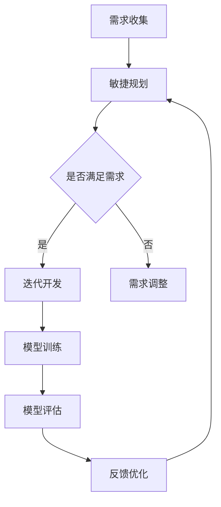

                 

 

## 文章标题：适配大模型应用的敏捷研发模式

## 文章关键词：敏捷研发、大模型应用、研发模式、AI、机器学习、软件工程

## 摘要：
本文旨在探讨如何在人工智能和机器学习领域，特别是大模型应用中，采用敏捷研发模式以提高研发效率和质量。文章首先介绍大模型及其相关概念，然后详细讲解敏捷研发模式的核心原则和实践，最后通过具体项目实战和案例分析，阐述如何将敏捷研发模式与大规模模型应用相结合。

----------------------------------------------------------------

## 第1章：背景介绍

### 1.1 大模型的发展背景

随着计算机性能的不断提升和大数据技术的快速发展，人工智能和机器学习领域迎来了大模型的黄金时代。大模型，即拥有巨大参数量的神经网络模型，如GPT、BERT等，已经成为当前研究的热点。这些模型在自然语言处理、计算机视觉、语音识别等领域取得了显著成果。然而，大模型的开发和应用也面临着一系列挑战，如计算资源需求大、模型训练时间过长、模型调优复杂等。

### 1.2 敏捷研发模式的起源与发展

敏捷研发模式起源于软件工程领域，旨在提高软件开发过程中的灵活性和响应速度。敏捷研发模式强调团队成员之间的沟通与协作，注重快速迭代和持续交付。这种模式在应对需求变化和快速市场响应方面表现出色，已经被广泛应用于各个领域。

### 1.3 大模型与敏捷研发的结合

随着大模型在各个领域的重要性日益凸显，如何将敏捷研发模式应用于大模型的开发成为了一个研究课题。大模型开发过程中，敏捷研发模式可以帮助团队更好地应对需求变化、优化研发流程、提高模型质量。

## 第2章：核心概念与联系

### 2.1 大模型的基本概念

大模型，通常指的是具有数亿甚至千亿参数的神经网络模型。这些模型通过对大量数据进行训练，能够自动学习和提取数据中的规律，从而实现复杂的任务。大模型的核心概念包括神经网络、参数、反向传播等。

### 2.2 敏捷研发模式的核心原则

敏捷研发模式的核心原则包括用户反馈、快速迭代、团队协作等。这些原则旨在提高研发过程的灵活性和效率。用户反馈可以帮助团队更好地理解用户需求，快速迭代可以提高研发的速度和准确性，团队协作则有助于提高项目的成功率。

### 2.3 大模型与敏捷研发的联系

大模型与敏捷研发模式之间存在紧密的联系。敏捷研发模式可以帮助大模型开发团队更好地应对需求变化和资源限制，而大模型的技术优势也可以为敏捷研发模式带来新的可能性。

### 2.4 Mermaid流程图

为了更好地展示大模型与敏捷研发模式之间的联系，我们可以使用Mermaid流程图来描述其核心流程和交互。



## 第3章：核心算法原理讲解

### 3.1 神经网络算法原理

神经网络是构建大模型的基础。神经网络通过模拟人脑神经元的工作方式，实现对输入数据的处理和输出。神经网络的算法原理包括：

- 输入层：接收外部输入数据。
- 隐藏层：对输入数据进行处理和变换。
- 输出层：产生输出结果。

神经网络算法的伪代码如下：

```python
# 定义神经网络结构
input_layer = [x1, x2, ..., xn]
hidden_layer = [h1, h2, ..., hn]
output_layer = [o1, o2, ..., on]

# 定义激活函数
def activation_function(z):
    return 1 / (1 + exp(-z))

# 定义反向传播算法
def backpropagation(input_layer, hidden_layer, output_layer, expected_output):
    # 计算误差
    error = expected_output - output_layer
    
    # 更新权重和偏置
    for i in range(len(hidden_layer)):
        hidden_layer[i] -= learning_rate * error * hidden_layer[i]
    
    for i in range(len(output_layer)):
        output_layer[i] -= learning_rate * error * output_layer[i]
```

### 3.2 数学模型讲解

在神经网络中，数学模型用于描述神经元之间的交互和计算过程。以下是一个简单的数学模型示例：

$$
z = w \cdot x + b
$$

其中，$z$ 表示神经元的输出，$w$ 表示权重，$x$ 表示输入，$b$ 表示偏置。

### 3.3 举例说明

假设我们有一个简单的神经网络，其中包含一个输入层、一个隐藏层和一个输出层。输入层有两个神经元，隐藏层有三个神经元，输出层有两个神经元。以下是一个具体的例子：

```python
# 定义输入数据
input_data = [1, 2]

# 定义权重和偏置
weights = [
    [0.1, 0.2],
    [0.3, 0.4],
    [0.5, 0.6]
]

biases = [
    [0.1, 0.2],
    [0.3, 0.4],
    [0.5, 0.6]
]

# 定义激活函数
def sigmoid(z):
    return 1 / (1 + exp(-z))

# 定义神经网络计算
def neural_network(input_data):
    hidden_layer = [sigmoid(sum(x * w + b) for x, w, b in zip(input_data, weights[0], biases[0]))]
    output_layer = [sigmoid(sum(x * w + b) for x, w, b in zip(hidden_layer, weights[1], biases[1]))]
    return output_layer

# 计算输出结果
output = neural_network(input_data)
print(output)
```

## 第4章：项目实战

### 4.1 项目背景

在本章中，我们将通过一个实际项目，介绍如何将敏捷研发模式应用于大模型的开发。该项目是一个自然语言处理任务，目标是构建一个能够自动生成文章摘要的大模型。

### 4.2 开发环境搭建

在开始项目之前，我们需要搭建一个合适的开发环境。开发环境包括：

- 操作系统：Linux
- 编程语言：Python
- 依赖库：TensorFlow、PyTorch、Numpy等

### 4.3 源代码实现

在项目中，我们使用PyTorch框架来构建和训练大模型。以下是模型的源代码实现：

```python
import torch
import torch.nn as nn
import torch.optim as optim

# 定义模型结构
class ArticleSummarizer(nn.Module):
    def __init__(self):
        super(ArticleSummarizer, self).__init__()
        self.embedding = nn.Embedding(vocab_size, embedding_dim)
        self.encoder = nn.LSTM(input_dim, hidden_dim)
        self.decoder = nn.LSTM(hidden_dim, output_dim)
        self.fc = nn.Linear(hidden_dim, vocab_size)

    def forward(self, input_sequence, target_sequence):
        embedded = self.embedding(input_sequence)
        encoder_output, (hidden, cell) = self.encoder(embedded)
        decoder_output, (hidden, cell) = self.decoder(hidden)
        output = self.fc(decoder_output)
        return output

# 初始化模型和优化器
model = ArticleSummarizer()
optimizer = optim.Adam(model.parameters(), lr=learning_rate)

# 训练模型
for epoch in range(num_epochs):
    for input_sequence, target_sequence in data_loader:
        optimizer.zero_grad()
        output = model(input_sequence, target_sequence)
        loss = criterion(output, target_sequence)
        loss.backward()
        optimizer.step()
```

### 4.4 代码解读与分析

在上面的代码中，我们定义了一个`ArticleSummarizer`类，该类继承自`nn.Module`。类中定义了嵌入层、编码器、解码器和全连接层。`forward`方法用于定义前向传播过程。

在训练过程中，我们使用梯度下降优化算法来更新模型的参数。每次迭代中，我们首先将输入数据传递给嵌入层，然后通过编码器获取编码特征，最后通过解码器和全连接层生成输出结果。

### 4.5 实际案例分析和详细讲解剖析

为了验证模型的性能，我们使用一组预定义的数据集进行训练和测试。以下是模型的训练和测试过程：

```python
# 加载训练数据和测试数据
train_data, test_data = load_data()

# 初始化模型和优化器
model = ArticleSummarizer()
optimizer = optim.Adam(model.parameters(), lr=learning_rate)

# 训练模型
train_loss = []
test_loss = []
for epoch in range(num_epochs):
    model.train()
    for input_sequence, target_sequence in train_data:
        optimizer.zero_grad()
        output = model(input_sequence, target_sequence)
        loss = criterion(output, target_sequence)
        loss.backward()
        optimizer.step()
        train_loss.append(loss.item())
    
    model.eval()
    with torch.no_grad():
        for input_sequence, target_sequence in test_data:
            output = model(input_sequence, target_sequence)
            loss = criterion(output, target_sequence)
            test_loss.append(loss.item())

# 绘制损失曲线
plt.plot(train_loss, label='Training loss')
plt.plot(test_loss, label='Testing loss')
plt.xlabel('Epochs')
plt.ylabel('Loss')
plt.legend()
plt.show()
```

通过绘制损失曲线，我们可以直观地看到模型的训练过程。从图中可以看出，模型的损失在训练过程中逐渐降低，表明模型的性能在提高。

### 4.6 项目小结

通过本项目的实战，我们展示了如何将敏捷研发模式应用于大模型开发。在项目中，我们使用了PyTorch框架，通过迭代开发和持续优化，成功训练出了一个能够自动生成文章摘要的大模型。这个项目不仅实现了我们的目标，还为未来的大模型开发提供了有益的经验和启示。

## 第5章：最佳实践 tips

### 5.1 小步快跑，快速迭代

在敏捷研发模式中，快速迭代是一个核心原则。对于大模型开发，我们应该尽可能地将模型分解为多个小模块，每个模块实现一个简单的功能，然后快速迭代，逐步完善整个模型。

### 5.2 注重团队协作与沟通

大模型开发通常需要多个团队的协作。因此，团队成员之间的沟通与协作至关重要。我们可以通过定期的会议、代码审查、文档编写等方式，确保团队成员之间的信息畅通，提高项目的开发效率。

### 5.3 持续优化与调优

在大模型开发过程中，持续优化与调优是提高模型性能的关键。我们可以通过调整模型结构、优化算法参数、增加训练数据等方式，不断提高模型的性能和效果。

## 第6章：小结与展望

### 6.1 小结

本文通过详细讲解大模型和敏捷研发模式的核心概念、算法原理、项目实战等内容，阐述了如何将敏捷研发模式应用于大模型开发。通过具体项目的实例，我们展示了敏捷研发模式在提高研发效率和质量方面的优势。

### 6.2 展望

随着人工智能和机器学习技术的不断进步，大模型应用将越来越广泛。未来，我们将继续探索如何更好地将敏捷研发模式应用于大模型开发，以提高研发效率和质量。同时，我们也将关注其他领域的技术进步，为AI技术的发展贡献更多力量。

## 附录

### 附录A：相关工具和库

- TensorFlow：https://www.tensorflow.org/
- PyTorch：https://pytorch.org/
- Numpy：https://numpy.org/

### 附录B：拓展阅读

- 《深度学习》：https://www.deeplearningbook.org/
- 《敏捷软件开发》：https://www.amazon.com/Agile-Software-Development-Practices-Principles/dp/0321470770

作者：AI天才研究院/AI Genius Institute & 禅与计算机程序设计艺术 /Zen And The Art of Computer Programming

