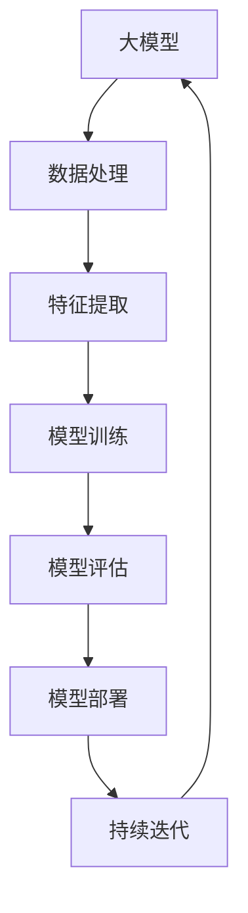

                 


为了撰写一篇符合要求的《适配大模型应用的敏捷研发模式》的技术博客文章，我们将按照以下步骤进行：

### 1. 文章开头部分

- **文章标题**：适配大模型应用的敏捷研发模式
- **关键词**：大模型、敏捷研发、AI、机器学习、软件开发、敏捷方法论
- **摘要**：本文将探讨如何将敏捷研发模式应用于大模型的应用开发中，分析其背景、理论基础、实践流程、工具与技术，并通过案例研究和未来展望来阐述这一模式的适用性和挑战。

### 2. 背景介绍

- **大模型的发展背景**：介绍大模型的发展历程，技术突破和应用趋势。
- **敏捷研发的兴起**：阐述敏捷研发的概念、核心原则及其与传统研发模式的区别。

### 3. 理论基础

#### 核心概念与联系

- **大模型与敏捷研发的关系架构**：使用Mermaid流程图展示大模型在敏捷研发中的位置和作用。



#### 核心算法原理讲解

- **大模型训练的伪代码**：

```python
# 伪代码：大模型训练过程
initialize_model()
for epoch in range(num_epochs):
    for batch in dataset:
        gradients = compute_gradients(batch, model)
        update_model(gradients)
evaluate_model(test_dataset)
```

#### 数学模型和公式详细讲解

- **损失函数**（使用LaTeX格式）：

$$
J(\theta) = -\frac{1}{m} \sum_{i=1}^{m} [y^{(i)} \log(a^{(i)}) + (1 - y^{(i)}) \log(1 - a^{(i)})]
$$

#### 示例说明

- 假设我们有一个包含1000个样本的数据集，每个样本有10个特征。目标是训练一个神经网络模型来预测这些样本的标签。

### 4. 实践流程与工具

#### 敏捷开发流程

- **敏捷开发方法论**：介绍Scrum、Kanban等常见的敏捷开发方法论。
- **敏捷迭代与冲刺**：详细描述敏捷开发的迭代周期和冲刺计划。

#### 敏捷工具与技术

- **敏捷项目管理工具**：如Jira、Trello等。
- **敏捷开发环境搭建**：描述如何在开发环境中集成敏捷工具和框架。

#### 持续集成与持续部署

- **CI/CD流程**：介绍如何实现代码的自动化测试和部署。

### 5. 大模型应用中的敏捷实践

- **敏捷规划**：如何在大模型项目中应用敏捷规划。
- **敏捷训练与部署流程**：详细描述大模型训练和部署的敏捷实践。
- **敏捷监控与优化**：介绍如何在大模型应用中进行实时监控和优化。

### 6. 案例研究

- **案例一：自然语言处理领域**：分析一个NLP项目的敏捷开发实践。
- **案例二：计算机视觉领域**：探讨CV项目的敏捷实践。
- **案例三：推荐系统领域**：研究推荐系统的敏捷研发模式。

### 7. 未来展望与挑战

- **大模型应用的未来趋势**：预测大模型技术发展的方向。
- **挑战与对策**：讨论大模型应用中可能遇到的挑战及其解决方案。

### 8. 结语

- **总结与展望**：对敏捷研发与大模型应用的结合进行总结，并提出未来研究的建议。

### 9. 作者信息

- **作者**：AI天才研究院/AI Genius Institute & 禅与计算机程序设计艺术 /Zen And The Art of Computer Programming

通过上述步骤，我们将逐步构建出内容丰富、逻辑清晰、具有实用价值的技术博客文章。每一步都经过详细的阐述和论证，以确保文章的完整性和专业性。接下来，我们将开始撰写具体的内容。

