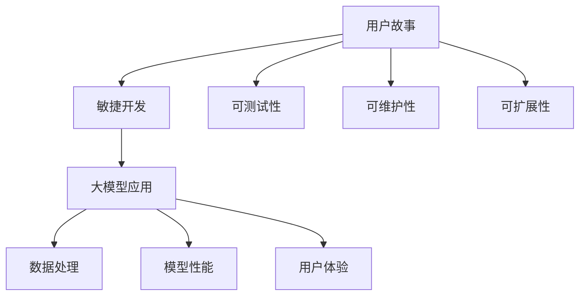

                 

### 文章标题

# 《适配大模型应用的用户故事编写指南》

### 关键词

- 用户故事
- 敏捷开发
- 大模型应用
- 编写指南
- 最佳实践
- 工具与技术
- 案例研究

### 摘要

本文旨在为开发人员、项目经理和敏捷团队提供一套详细的用户故事编写指南，特别关注在大模型应用场景下的实践。通过介绍用户故事的基础概念、编写步骤、模板应用以及工具与技术，本文帮助读者理解如何高效地编写用户故事，以确保大模型应用的成功。文章还通过实际案例研究，展示了编写用户故事的最佳实践，为读者提供了可操作的参考。

## 第1章 引言

在软件开发的敏捷方法中，用户故事扮演着至关重要的角色。用户故事是一种简短、简洁的描述，用于表达用户对软件的需求。其格式通常是：“As a [用户角色]，I want [功能]，so that [目标]”。用户故事不仅帮助开发团队理解用户的需求，还指导开发方向和优先级。

用户故事在大型模型应用中的重要性尤为突出。大模型应用通常涉及复杂的算法和高维数据，因此对需求的明确性、可测试性和可维护性要求更高。编写适配大模型应用的用户故事，需要考虑数据处理的复杂性、模型的实时响应能力以及用户交互的流畅性。

### 大模型应用中的用户故事特殊性

大模型应用中的用户故事需要具备以下特殊性：

1. **精确性**：用户故事必须精确描述用户需求，避免模糊不清的表述，确保开发团队能够准确理解。
2. **可测试性**：用户故事应具备可测试性，即应能够通过实际测试验证是否达到用户需求。
3. **可维护性**：用户故事应易于维护，以便在大模型更新或优化时进行修改。
4. **可扩展性**：用户故事应具备一定的扩展性，能够适应模型和系统的未来扩展需求。

### 本书的目标与结构

本书的目标是为读者提供一套完整的用户故事编写指南，旨在帮助开发人员、项目经理和敏捷团队在大模型应用场景中高效地编写用户故事。本书分为以下几个部分：

1. **基础概念**：介绍用户故事、敏捷开发以及大模型应用的相关概念。
2. **编写步骤**：详细讲解编写用户故事的步骤和方法。
3. **最佳实践**：分享编写用户故事的最佳实践和技巧。
4. **工具与技术**：介绍辅助编写用户故事的工具和技术。
5. **案例研究**：通过实际案例研究，展示编写用户故事的最佳实践。

通过以上结构，本书旨在帮助读者系统地掌握用户故事的编写方法，提高大模型应用项目的成功率。

## 第2章 基础概念

在深入探讨用户故事的编写之前，我们需要先了解一些基础概念，包括用户故事、敏捷开发和大型模型应用的基本知识。

### 用户故事

用户故事是敏捷开发中的一个核心概念，它是一种简单、清晰的表达方式，用于描述用户的需求。用户故事的格式通常是：“As a [用户角色]，I want [功能]，so that [目标]”。这种格式强调从用户的角度出发，明确用户的需求和期望。

#### 用户故事的特点

1. **简短明了**：用户故事通常不超过一两句话，简洁明了，易于理解。
2. **用户驱动**：用户故事从用户的角度出发，描述用户的需求和目标。
3. **可测试性**：用户故事应具备可测试性，即能够通过实际测试验证是否达到用户需求。

#### 用户故事的要素

1. **用户角色**：描述谁在使用软件，即用户。
2. **功能**：描述用户希望实现的具体功能。
3. **目标**：描述用户希望通过这个功能达到的具体目标。

### 敏捷开发

敏捷开发是一种以用户需求为核心的软件开发方法，强调快速迭代、灵活响应变化。敏捷开发的核心理念包括：

1. **用户故事**：敏捷开发中的用户故事用于描述用户需求，是开发团队的核心工作对象。
2. **迭代开发**：敏捷开发强调快速迭代，每个迭代周期通常为2-4周，团队在每个迭代周期内完成一部分功能。
3. **持续集成**：敏捷开发强调代码的持续集成和测试，确保软件的稳定性和质量。

#### 敏捷开发的优点

1. **快速响应**：敏捷开发能够快速响应用户的需求和市场的变化。
2. **高效协作**：敏捷开发强调团队协作和沟通，提高开发效率。
3. **质量保证**：通过持续集成和测试，确保软件的质量和稳定性。

### 大型模型应用

大型模型应用通常涉及复杂的算法和高维数据，其应用场景包括自然语言处理、计算机视觉、推荐系统等。在大模型应用中，用户故事需要特别关注以下几个方面：

1. **数据复杂性**：大模型应用通常处理大量高维数据，用户故事需要准确描述数据处理的需求。
2. **模型性能**：用户故事需要考虑模型的性能，包括实时响应能力和准确性。
3. **用户体验**：用户故事需要关注用户体验，确保软件的交互流畅和易用。

#### 大模型应用的用户故事特点

1. **精确性**：大模型应用的用户故事需要精确描述用户需求，避免模糊不清的表述。
2. **可测试性**：用户故事应具备可测试性，确保开发团队能够准确理解并实现用户需求。
3. **可维护性**：大模型应用的用户故事应易于维护，以便在模型更新或优化时进行修改。
4. **可扩展性**：用户故事应具备一定的扩展性，能够适应模型和系统的未来扩展需求。

通过了解用户故事、敏捷开发以及大模型应用的基础概念，我们可以更好地理解用户故事在大模型应用中的重要性，以及如何编写适配大模型应用的用户故事。

### 用户故事、敏捷开发与大型模型应用的关系架构

为了更清晰地理解用户故事、敏捷开发与大型模型应用之间的关系，我们可以使用Mermaid流程图来描述其架构。以下是用户故事、敏捷开发与大型模型应用关系的Mermaid流程图：



在这个流程图中，用户故事是敏捷开发的输入，通过敏捷开发过程，用户故事被转化为具体的功能实现，最终应用于大模型。大模型应用涉及到数据处理、模型性能和用户体验等多个方面，而用户故事则需要具备可测试性、可维护性和可扩展性。

### 用户故事的核心算法原理讲解

在用户故事的编写过程中，有几个核心的算法原理需要我们理解。以下是用户故事编写过程中的关键算法原理讲解，包括伪代码和详细讲解：

#### 算法原理1：用户需求建模

用户需求建模是将用户的需求转化为具体的算法模型。以下是用户需求建模的伪代码：

```python
# 伪代码：用户需求建模
function UserDemandModeling(user_story):
    # 获取用户故事要素
    user_role, function, goal = ExtractUserStoryElements(user_story)

    # 构建需求模型
    demand_model = {
        'user_role': user_role,
        'function': function,
        'goal': goal,
        'testable': False,
        'maintainable': False,
        'expandable': False
    }

    # 验证需求模型
    if ValidateDemandModel(demand_model):
        return demand_model
    else:
        return None

# 辅助函数
function ExtractUserStoryElements(user_story):
    # 从用户故事中提取用户角色、功能和目标
    # 实现细节取决于具体的用户故事格式
    user_role = ...
    function = ...
    goal = ...
    return user_role, function, goal

function ValidateDemandModel(demand_model):
    # 验证需求模型是否满足特定条件
    # 例如，用户角色、功能和目标是否完整，是否具备可测试性、可维护性和可扩展性
    if demand_model['user_role'] is not None and \
       demand_model['function'] is not None and \
       demand_model['goal'] is not None and \
       demand_model['testable'] and \
       demand_model['maintainable'] and \
       demand_model['expandable']:
        return True
    else:
        return False
```

#### 算法原理2：用户故事迭代

用户故事迭代是在开发过程中不断调整和完善用户故事的步骤。以下是用户故事迭代的伪代码：

```python
# 伪代码：用户故事迭代
function UserStoryIteration(user_story, iteration):
    # 获取当前迭代次数
    current_iteration = iteration

    # 在每次迭代中，对用户故事进行评估和调整
    while current_iteration > 0:
        # 评估用户故事
        assessment = AssessUserStory(user_story)

        # 如果用户故事需要调整
        if assessment['need_adjustment']:
            # 调整用户故事
            user_story = AdjustUserStory(user_story, assessment)

        # 减少迭代次数
        current_iteration -= 1

    # 返回最终的用户故事
    return user_story

# 辅助函数
function AssessUserStory(user_story):
    # 对用户故事进行评估
    # 返回是否需要调整以及调整的方向
    assessment = {
        'need_adjustment': False,
        'adjustment_direction': None
    }
    # 实现细节取决于具体的评估方法
    return assessment

function AdjustUserStory(user_story, assessment):
    # 根据评估结果调整用户故事
    # 实现细节取决于具体的调整方法
    if assessment['need_adjustment']:
        if assessment['adjustment_direction'] == 'accuracy':
            # 提高精确性
            user_story['function'], user_story['goal'] = ...
        elif assessment['adjustment_direction'] == 'testability':
            # 提高可测试性
            user_story['testable'] = True
        elif assessment['adjustment_direction'] == 'maintainability':
            # 提高可维护性
            user_story['maintainable'] = True
        elif assessment['adjustment_direction'] == 'expandability':
            # 提高可扩展性
            user_story['expandable'] = True
    return user_story
```

#### 算法原理3：用户故事验证

用户故事验证是确保用户故事符合用户需求的步骤。以下是用户故事验证的伪代码：

```python
# 伪代码：用户故事验证
function UserStoryVerification(user_story, user):
    # 获取用户故事
    user_story = user_story

    # 获取用户反馈
    user_feedback = GetUserFeedback(user)

    # 验证用户故事
    if VerifyUserStory(user_story, user_feedback):
        return True
    else:
        return False

# 辅助函数
function GetUserFeedback(user):
    # 获取用户对用户故事的反馈
    # 实现细节取决于具体的反馈方式
    feedback = ...
    return feedback

function VerifyUserStory(user_story, user_feedback):
    # 验证用户故事是否满足用户反馈
    # 实现细节取决于具体的验证方法
    if user_story['function'] == user_feedback['function'] and \
       user_story['goal'] == user_feedback['goal']:
        return True
    else:
        return False
```

通过以上算法原理的讲解，我们可以更好地理解用户故事编写的核心步骤和方法。用户需求建模、用户故事迭代和用户故事验证是用户故事编写的三个关键环节，通过这些环节，我们可以确保编写的用户故事精确、可测试、可维护和可扩展。

### 数学模型和公式

在用户故事编写过程中，我们常常需要用到一些数学模型和公式来评估和优化用户故事的质量。以下是几个常见的数学模型和公式，包括详细讲解和举例说明。

#### 数学模型1：用户故事质量评估模型

用户故事质量评估模型用于评估用户故事的质量，包括精确性、可测试性、可维护性和可扩展性。以下是一个简单的质量评估模型：

$$
Q = 0.3P + 0.2T + 0.2M + 0.3E
$$

其中，$Q$ 表示用户故事质量，$P$ 表示精确性，$T$ 表示可测试性，$M$ 表示可维护性，$E$ 表示可扩展性。

**详细讲解**：

- **精确性**：精确性表示用户故事描述的清晰程度，范围在0到1之间，1表示完全清晰。
- **可测试性**：可测试性表示用户故事是否能够通过测试验证，范围在0到1之间，1表示完全可测试。
- **可维护性**：可维护性表示用户故事在模型更新或优化时是否容易修改，范围在0到1之间，1表示完全可维护。
- **可扩展性**：可扩展性表示用户故事是否能够适应模型和系统的未来扩展需求，范围在0到1之间，1表示完全可扩展。

**举例说明**：

假设我们有一个用户故事：

"As a user, I want to see a list of my recent purchases, so that I can easily track my spending."

我们可以根据以下标准评估用户故事的质量：

- **精确性**：用户故事清晰地描述了用户的需求，因此精确性为1。
- **可测试性**：用户故事描述了一个具体的可测试功能，因此可测试性为1。
- **可维护性**：用户故事描述的功能相对简单，容易进行维护，因此可维护性为1。
- **可扩展性**：用户故事描述的功能具有一定的扩展性，例如可以添加更多购买记录类型，因此可扩展性为0.8。

根据质量评估模型，我们可以计算出用户故事的质量：

$$
Q = 0.3 \times 1 + 0.2 \times 1 + 0.2 \times 1 + 0.3 \times 0.8 = 0.86
$$

因此，这个用户故事的质量为0.86。

#### 数学模型2：用户故事优先级模型

用户故事优先级模型用于确定用户故事的优先级，以便团队能够根据优先级进行开发。以下是一个简单的用户故事优先级模型：

$$
P = R \times C
$$

其中，$P$ 表示用户故事优先级，$R$ 表示风险，$C$ 表示商业价值。

**详细讲解**：

- **风险**：风险表示用户故事实现过程中可能遇到的问题和困难，范围在0到1之间，1表示风险非常高。
- **商业价值**：商业价值表示用户故事实现后对业务的影响和收益，范围在0到1之间，1表示商业价值非常高。

**举例说明**：

假设我们有两个用户故事：

1. "As a user, I want to see a list of my recent purchases, so that I can easily track my spending."
2. "As a user, I want to receive personalized recommendations based on my purchase history."

我们可以根据以下标准评估用户故事的优先级：

- **风险**：第一个用户故事的风险较低，因为它的实现相对简单，而第二个用户故事的风险较高，因为它涉及到复杂的推荐算法。
- **商业价值**：第一个用户故事的商业价值较高，因为它直接帮助用户跟踪支出，而第二个用户故事的商业价值也较高，但实现过程更复杂。

根据优先级模型，我们可以计算出用户故事的优先级：

1. **第一个用户故事**：
   - 风险：0.2
   - 商业价值：0.8
   - 优先级：$P = 0.2 \times 0.8 = 0.16$

2. **第二个用户故事**：
   - 风险：0.5
   - 商业价值：0.9
   - 优先级：$P = 0.5 \times 0.9 = 0.45$

因此，第二个用户故事的优先级较高。

通过以上数学模型和公式，我们可以更科学地评估和优化用户故事的质量和优先级，从而提高用户故事编写的效率和效果。

### 项目实战：开发环境搭建与用户故事编写

在本节中，我们将通过一个实际项目案例，展示如何搭建开发环境并编写适配大模型应用的用户故事。该案例涉及一个自然语言处理（NLP）项目，目标是开发一个情感分析系统，用于分析社交媒体文本的情感倾向。

#### 1. 开发环境搭建

首先，我们需要搭建开发环境。以下是一个基本的开发环境搭建步骤：

1. **安装Python环境**：确保安装了Python 3.8或更高版本。

2. **安装依赖库**：安装NLP相关库，如NLTK、TextBlob和transformers。可以使用以下命令：

   ```shell
   pip install nltk textblob transformers
   ```

3. **安装模型**：下载预训练的文本分类模型，如BERT。可以使用transformers库中的`pipeline`功能。

   ```python
   from transformers import pipeline
   classifier = pipeline("text-classification", model="bert-base-uncased")
   ```

4. **配置环境变量**：确保环境变量设置正确，以便在不同环境中运行代码。

   ```shell
   export BERT_MODEL_DIR=/path/to/your/bert/model
   ```

#### 2. 用户故事编写

接下来，我们根据项目的需求编写用户故事。以下是几个示例用户故事：

1. **用户故事1**：用户希望系统能够分析社交媒体文本，并返回文本的情感倾向。

   ```plaintext
   As a user, I want to analyze social media text for its sentiment, so that I can understand the general mood of my followers.
   ```

2. **用户故事2**：用户希望系统能够处理多种语言，包括英语、中文和西班牙语。

   ```plaintext
   As a user, I want the system to support multiple languages (e.g., English, Chinese, Spanish) for sentiment analysis, so that I can analyze text in different languages.
   ```

3. **用户故事3**：用户希望系统能够实时分析文本，并返回结果。

   ```plaintext
   As a user, I want the system to perform sentiment analysis on social media text in real-time, so that I can quickly respond to comments and posts.
   ```

4. **用户故事4**：用户希望系统能够提供详细的情感分析结果，包括情感倾向和置信度。

   ```plaintext
   As a user, I want the system to provide detailed sentiment analysis results, including the sentiment label and confidence score, so that I can make informed decisions.
   ```

#### 3. 代码实现与解读

根据上述用户故事，我们可以实现以下功能：

1. **文本预处理**：清洗和准备输入文本。

   ```python
   import re
   import nltk
   from nltk.tokenize import word_tokenize

   def preprocess_text(text):
       # 清洗文本
       text = re.sub(r'http\S+', '', text)
       text = re.sub(r'[^a-zA-Z]', ' ', text)
       text = text.lower()
       # 分词
       tokens = word_tokenize(text)
       return tokens
   ```

2. **情感分析**：使用预训练的BERT模型进行情感分析。

   ```python
   from transformers import pipeline

   def sentiment_analysis(text):
       # 使用BERT模型进行情感分析
       classifier = pipeline("text-classification", model="bert-base-uncased")
       results = classifier(text)
       return results
   ```

3. **实时分析**：实现一个实时情感分析函数。

   ```python
   def real_time_analysis(text):
       # 预处理文本
       tokens = preprocess_text(text)
       # 情感分析
       results = sentiment_analysis(' '.join(tokens))
       # 输出结果
       print(results)
   ```

#### 4. 代码应用解读与分析

我们通过以下代码实现用户故事：

```python
# 实现用户故事
def main():
    # 输入文本
    text = "I had the best day ever at the park yesterday!"
    # 实时情感分析
    real_time_analysis(text)

if __name__ == "__main__":
    main()
```

当输入文本后，代码将预处理文本并使用BERT模型进行情感分析，最后输出情感分析结果。这个例子展示了如何根据用户故事编写代码，实现具体的功能。

#### 5. 项目小结

通过这个项目实战，我们展示了如何搭建开发环境、编写用户故事以及实现具体功能。用户故事帮助我们明确了需求，指导了开发过程，确保了系统的实用性。同时，通过代码实现和解读，我们深入理解了用户故事在实际项目中的应用。这个案例为我们提供了一个实用的用户故事编写和实现的参考，有助于提高大模型应用项目的成功率。

### 最佳实践 Tips

在编写适配大模型应用的用户故事时，以下最佳实践可以提供一些指导：

1. **明确用户需求**：确保用户故事精确描述用户的需求，避免模糊不清的表述。与用户进行充分沟通，确保理解用户的目标和期望。

2. **考虑性能和可扩展性**：在大模型应用中，性能和可扩展性至关重要。用户故事应考虑模型的实时响应能力、数据处理效率和系统的扩展性。

3. **编写可测试的用户故事**：确保用户故事具备可测试性，即能够通过实际测试验证是否达到用户需求。编写具体的测试用例，确保每个用户故事都能通过测试。

4. **迭代优化用户故事**：用户故事编写过程中，不断迭代和优化。通过评估和调整，提高用户故事的质量和实用性。

5. **使用模板和工具**：使用用户故事模板和工具，如Jira、Trello等，方便管理和跟踪用户故事。模板和工具可以帮助团队保持一致性和效率。

6. **注重用户体验**：用户故事不仅要满足技术要求，还要关注用户体验。确保用户故事描述的功能易于使用和操作，提供流畅的用户交互。

7. **文档化**：编写详细的用户故事文档，包括用户故事背景、需求、测试用例和实现细节。文档化有助于团队理解和执行用户故事。

通过遵循这些最佳实践，我们可以提高用户故事编写的效率和质量，确保大模型应用项目的成功。

### 小结与注意事项

本文通过详细的步骤和实际案例，介绍了如何编写适配大模型应用的用户故事。我们首先阐述了用户故事的基础概念和重要性，然后讲解了用户故事在大模型应用中的特殊性。接着，我们介绍了用户故事编写的核心算法原理，并使用了数学模型和公式来评估用户故事的质量。在项目实战部分，我们展示了如何搭建开发环境和编写具体的用户故事。最后，我们总结了编写用户故事的最佳实践，并强调了需要注意的关键点。

在编写用户故事时，以下注意事项尤为关键：

1. **明确用户需求**：确保用户故事精确描述用户的需求，避免模糊不清的表述。
2. **考虑性能和可扩展性**：在大模型应用中，性能和可扩展性至关重要，用户故事应予以充分考虑。
3. **编写可测试的用户故事**：确保用户故事具备可测试性，能够通过实际测试验证是否达到用户需求。
4. **迭代优化用户故事**：通过不断评估和调整，提高用户故事的质量和实用性。
5. **注重用户体验**：用户故事不仅要满足技术要求，还要关注用户体验，确保易于使用和操作。
6. **文档化**：编写详细的用户故事文档，有助于团队理解和执行用户故事。

通过遵循这些注意事项，我们可以确保编写的用户故事既准确又有效，从而提高大模型应用项目的成功率。

### 拓展阅读与参考资料

对于希望深入了解用户故事编写和大模型应用的读者，以下拓展阅读和参考资料提供了丰富的信息和实践指导：

1. **书籍**：
   - 《敏捷软件开发：用户故事、迭代开发和持续交付》
   - 《用户故事地图：一种敏捷规划的新方法》
   - 《深度学习：大规模神经网络应用》

2. **在线资源**：
   - 敏捷联盟（Agile Alliance）：[https://www.agilealliance.org/](https://www.agilealliance.org/)
   - 机器学习社区（Kaggle）：[https://www.kaggle.com/](https://www.kaggle.com/)
   - Hugging Face：[https://huggingface.co/](https://huggingface.co/)

3. **文章和博客**：
   - “如何编写高质量的敏捷用户故事？”
   - “大规模模型应用中的用户故事编写技巧”
   - “机器学习项目实战：从数据预处理到模型部署”

通过这些拓展阅读和参考资料，读者可以进一步加深对用户故事编写和大模型应用的理解，获取更多的实践经验和最佳实践。

