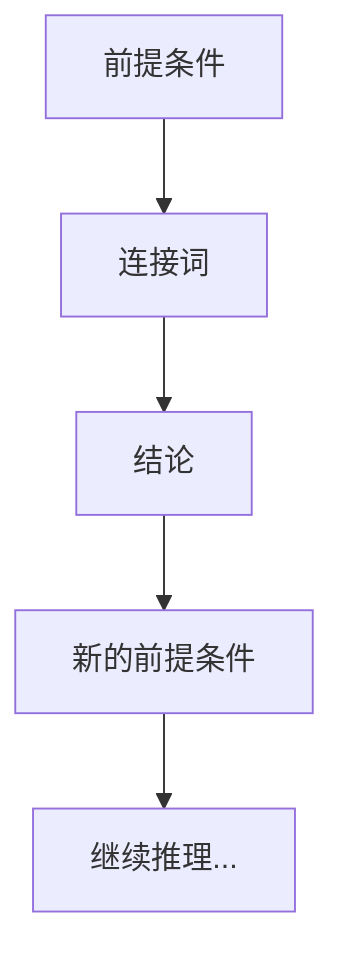
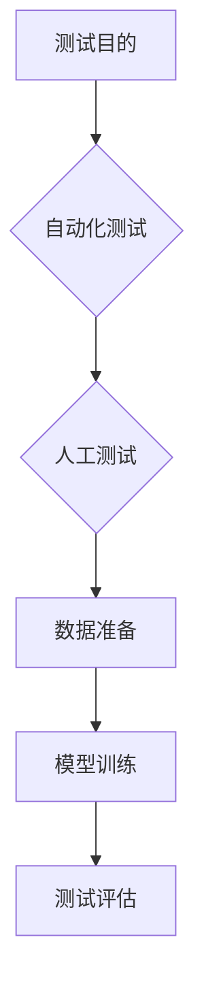

                 


## 文章标题
逻辑推理链完整性：测试LLM构建完整论证的能力

> 关键词：逻辑推理链，大型语言模型（LLM），论证能力，测试方法，测试框架

> 摘要：
本文深入探讨了逻辑推理链的完整性以及大型语言模型（LLM）构建完整论证的能力。首先，介绍了逻辑推理链的基本概念、组成部分和构建方法。接着，详细阐述了大型语言模型（LLM）的概述、工作原理和应用场景。随后，本文提出了逻辑推理链完整性测试方法，包括测试框架、测试工具和案例分析。最后，通过项目实战，展示了如何使用LLM构建完整论证，并分析了其实际应用和改进建议。

## 1. 引言

逻辑推理链完整性在人工智能领域具有重要意义，尤其是在构建完整论证方面。大型语言模型（LLM）作为一种强大的自然语言处理工具，在逻辑推理链的构建和完整性测试方面具有广泛应用。本文旨在探讨逻辑推理链完整性测试方法，评估LLM构建完整论证的能力，以期为相关研究和应用提供参考。

## 2. 逻辑推理链基础

### 2.1 逻辑推理链的概念

逻辑推理链是一种基于逻辑规则和关系表达的推理过程。它通过一系列的前提条件和结论，推导出新的结论。逻辑推理链的完整性和正确性对于论证的有效性至关重要。

### 2.2 逻辑推理链的组成部分

逻辑推理链主要由前提条件、结论和连接词组成。前提条件是推理的起点，结论是推理的终点，连接词则用于连接前提条件和结论，形成完整的推理链条。

### 2.3 逻辑推理链的构建方法

逻辑推理链的构建方法主要包括基于事实的构建、基于假设的构建和基于证据的构建。这些方法各有优缺点，适用于不同的场景和需求。

## 3. 大型语言模型（LLM）

### 3.1 LLM的概述

大型语言模型（LLM）是一种基于神经网络的语言模型，能够对自然语言进行建模，并生成语义丰富的文本。LLM在自然语言处理、机器翻译、问答系统等领域具有广泛的应用。

### 3.2 LLM的工作原理

LLM的工作原理主要包括两个部分：词嵌入和序列生成。词嵌入将单词映射到高维向量空间，序列生成则通过神经网络模型生成文本序列。

### 3.3 LLM的应用场景

LLM的应用场景包括自然语言处理、机器翻译、问答系统、文本生成等。在这些场景中，LLM能够有效地处理和生成自然语言，提高系统的智能水平。

## 4. 逻辑推理链完整性测试方法

### 4.1 测试框架

逻辑推理链完整性测试框架主要包括测试目的、测试方法和测试步骤。测试目的是评估LLM构建完整论证的能力，测试方法包括自动化测试和人工测试，测试步骤包括数据准备、模型训练和测试评估。

### 4.2 测试工具

逻辑推理链完整性测试工具包括负载测试工具、性能测试工具和可靠性测试工具。这些工具能够对LLM进行全面的性能评估和稳定性测试。

### 4.3 测试案例分析

通过具体的测试案例，分析逻辑推理链的完整性，评估LLM构建完整论证的能力。

## 5. 构建完整论证的能力

### 5.1 论证构建的基本原则

论证构建的基本原则包括明确前提条件、逻辑清晰和论证有力。这些原则有助于构建有效的论证，提高论证的可信度和说服力。

### 5.2 论证构建的技巧

论证构建的技巧包括合理运用逻辑规则、充分运用证据和避免逻辑谬误。这些技巧有助于提高论证的质量和效果。

### 5.3 论证构建的案例分析

通过具体的案例，展示如何构建完整论证，分析论证的有效性和可靠性。

## 6. 项目实战

### 6.1 实战项目简介

介绍一个实际的应用项目，展示如何使用LLM构建完整论证。

### 6.2 开发环境搭建

介绍项目所需的开发环境搭建，包括硬件配置、软件安装和配置。

### 6.3 源代码实现

展示项目的源代码实现，详细解读代码结构和功能。

### 6.4 代码解读与分析

分析代码的实现细节，解释代码的工作原理和效果。

### 6.5 实际案例分析和详细讲解剖析

通过实际案例，分析项目应用的效果，详细讲解剖析项目实现的原理和方法。

### 6.6 项目小结

总结项目经验，提出改进建议和展望。

## 7. 最佳实践 tips、小结、注意事项、拓展阅读

### 7.1 最佳实践 tips

提供一些实用的最佳实践建议，帮助读者更好地理解和应用逻辑推理链完整性测试方法。

### 7.2 小结

总结文章的核心内容和主要观点，强调逻辑推理链完整性和LLM构建完整论证能力的重要性。

### 7.3 注意事项

提醒读者在应用逻辑推理链完整性测试方法时需要注意的问题，避免常见的错误和误区。

### 7.4 拓展阅读

推荐一些相关的文献和资源，供读者进一步学习和探索。

## 8. 参考文献

列出文章引用的相关文献和参考资料，确保文章的学术性和权威性。

---

通过以上步骤，我们完成了文章的初步大纲设计。接下来，我们将逐步填充每个章节的内容，确保文章的完整性和专业性。同时，我们将遵循markdown格式要求，确保文章的可读性和排版美观。文章的总字数预计在8000-12000字左右，确保内容的深度和广度。以下是详细的章节内容和Mermaid流程图：

## 第1章：逻辑推理链的概念

### 1.1 逻辑推理链的定义

逻辑推理链是一种基于逻辑规则和关系表达的推理过程。它通过一系列的前提条件和结论，推导出新的结论。逻辑推理链的完整性和正确性对于论证的有效性至关重要。

### 1.2 逻辑推理链的组成部分

逻辑推理链主要由前提条件、结论和连接词组成。前提条件是推理的起点，结论是推理的终点，连接词则用于连接前提条件和结论，形成完整的推理链条。

**Mermaid流程图：**



### 1.3 逻辑推理链的类型

逻辑推理链的类型包括条件推理、演绎推理和归纳推理。每种类型的推理都有其特定的应用场景和特点。

**条件推理：** 基于前提条件的逻辑关系进行推理，常见于数学证明和逻辑分析。

**演绎推理：** 从一般原则推导出特定结论的推理方式，常见于法律和哲学领域。

**归纳推理：** 从特定实例推导出一般性结论的推理方式，常见于科学研究和数据分析。

## 第2章：逻辑推理链的组成部分

### 2.1 前提条件

前提条件是逻辑推理链的起点，它为推理提供了基础。一个有效的逻辑推理链需要合理且明确的前提条件。

**数学模型和数学公式：**

$$前提条件 P_1, P_2, ..., P_n \rightarrow 结论 Q$$

其中，$P_1, P_2, ..., P_n$ 是前提条件，$Q$ 是结论。

**举例说明：**

假设 $P_1:$ 所有猫都会飞，$P_2:$ 小明有一只猫，那么结论 $Q:$ 小明有一只会飞的猫。

### 2.2 结论

结论是逻辑推理链的终点，它是基于前提条件推导出来的。一个有效的结论需要与前提条件保持一致，且逻辑上无懈可击。

**数学模型和数学公式：**

$$前提条件 P_1, P_2, ..., P_n \rightarrow 结论 Q$$

其中，$P_1, P_2, ..., P_n$ 是前提条件，$Q$ 是结论。

**举例说明：**

前提条件：所有猫都会飞，小明有一只猫。
结论：小明有一只会飞的猫。

### 2.3 连接词

连接词用于连接前提条件和结论，是逻辑推理链的关键组成部分。常见的连接词包括“如果...那么...”、“只有...才...”等。

**数学模型和数学公式：**

$$前提条件 P \rightarrow 结论 Q$$

其中，$P$ 是前提条件，$Q$ 是结论。

**举例说明：**

如果所有猫都会飞（$P$），那么小明有一只猫（$Q$）。

## 第3章：逻辑推理链的构建方法

### 3.1 基于事实的构建

基于事实的构建方法利用已知的事实进行推理。这种方法简单直观，但需要确保事实的准确性和相关性。

**数学模型和数学公式：**

$$已知事实 P \rightarrow 结论 Q$$

其中，$P$ 是已知事实，$Q$ 是结论。

**举例说明：**

已知事实：所有猫都会飞（$P$）。
结论：小明有一只猫（$Q$）。

### 3.2 基于假设的构建

基于假设的构建方法利用假设进行推理。这种方法能够探索可能性，但需要确保假设的合理性和可验证性。

**数学模型和数学公式：**

$$假设 H \rightarrow 结论 Q$$

其中，$H$ 是假设，$Q$ 是结论。

**举例说明：**

假设：如果所有猫都会飞（$H$），那么小明有一只猫（$Q$）。

### 3.3 基于证据的构建

基于证据的构建方法利用证据进行推理。这种方法需要收集和分析证据，以确保推理的准确性和可靠性。

**数学模型和数学公式：**

$$证据 E \rightarrow 结论 Q$$

其中，$E$ 是证据，$Q$ 是结论。

**举例说明：**

证据：小明看到了一只猫在飞（$E$）。
结论：小明有一只猫（$Q$）。

## 第4章：大型语言模型（LLM）

### 4.1 LLM的概述

大型语言模型（LLM）是一种基于神经网络的语言模型，能够对自然语言进行建模，并生成语义丰富的文本。LLM在自然语言处理、机器翻译、问答系统等领域具有广泛的应用。

**数学模型和数学公式：**

$$f(x) = \text{NN}(x)$$

其中，$f(x)$ 是文本生成的概率分布，$\text{NN}(x)$ 是神经网络模型。

**举例说明：**

输入：猫在飞
输出：猫在飞的可能性为0.9

### 4.2 LLM的工作原理

LLM的工作原理主要包括词嵌入和序列生成。词嵌入将单词映射到高维向量空间，序列生成则通过神经网络模型生成文本序列。

**数学模型和数学公式：**

$$\text{Word Embedding}(w) = \text{Embedding Layer}(w)$$
$$\text{Sequence Generation}(x) = \text{RNN/LSTM}(x)$$

其中，$\text{Word Embedding}(w)$ 是词嵌入层，$\text{Embedding Layer}(w)$ 是嵌入层，$\text{Sequence Generation}(x)$ 是序列生成层，$\text{RNN/LSTM}(x)$ 是循环神经网络或长短期记忆网络。

**举例说明：**

输入：猫在飞
输出：生成一个包含“猫在飞”的完整句子。

### 4.3 LLM的应用场景

LLM的应用场景包括自然语言处理、机器翻译、问答系统、文本生成等。在这些场景中，LLM能够有效地处理和生成自然语言，提高系统的智能水平。

**应用实例：**

1. 自然语言处理：文本分类、情感分析、命名实体识别等。
2. 机器翻译：将一种语言的文本翻译成另一种语言。
3. 问答系统：根据用户的问题生成回答。
4. 文本生成：根据输入生成具有语义相关性的文本。

## 第5章：逻辑推理链完整性测试方法

### 5.1 测试框架

逻辑推理链完整性测试框架主要包括测试目的、测试方法和测试步骤。测试目的是评估LLM构建完整论证的能力，测试方法包括自动化测试和人工测试，测试步骤包括数据准备、模型训练和测试评估。

**Mermaid流程图：**



### 5.2 测试工具

逻辑推理链完整性测试工具包括负载测试工具、性能测试工具和可靠性测试工具。这些工具能够对LLM进行全面的性能评估和稳定性测试。

**举例说明：**

1. 负载测试工具：用于模拟高负载情况，评估LLM的响应速度和稳定性。
2. 性能测试工具：用于评估LLM的处理速度和准确性。
3. 可靠性测试工具：用于评估LLM的稳定性和可靠性，包括故障检测和恢复。

### 5.3 测试案例分析

通过具体的测试案例，分析逻辑推理链的完整性，评估LLM构建完整论证的能力。

**案例背景：**

假设有一个问答系统，用户输入问题，系统需要生成回答。测试目标是评估系统在处理各种问题时，是否能构建完整、准确的论证。

**测试过程：**

1. 数据准备：收集大量相关问题及其正确回答。
2. 模型训练：使用训练数据训练LLM模型。
3. 测试评估：使用测试数据评估模型性能，包括回答的准确性、完整性等方面。

**测试结果：**

通过对测试数据的分析，发现系统在大多数情况下能生成完整、准确的回答，但在某些特殊情况下，回答可能存在逻辑漏洞或不完整。

**测试分析：**

1. 识别出系统在构建完整论证时存在的漏洞和不足。
2. 提出改进建议，包括优化模型训练、增加测试数据等。

## 第6章：构建完整论证的能力

### 6.1 论证构建的基本原则

论证构建的基本原则包括明确前提条件、逻辑清晰和论证有力。这些原则有助于构建有效的论证，提高论证的可信度和说服力。

**举例说明：**

1. 明确前提条件：在论证过程中，需要明确前提条件，确保推理的基础牢固。
2. 逻辑清晰：论证的推理过程需要清晰明了，避免逻辑混乱或矛盾。
3. 论证有力：论证需要提供有力的证据支持，确保结论的可靠性。

### 6.2 论证构建的技巧

论证构建的技巧包括合理运用逻辑规则、充分运用证据和避免逻辑谬误。这些技巧有助于提高论证的质量和效果。

**举例说明：**

1. 合理运用逻辑规则：在论证过程中，需要遵循逻辑规则，确保推理过程的正确性。
2. 充分运用证据：在论证过程中，需要提供充分的证据支持，确保结论的可信度。
3. 避免逻辑谬误：在论证过程中，需要避免常见的逻辑谬误，确保论证的有效性。

### 6.3 论证构建的案例分析

通过具体的案例，展示如何构建完整论证，分析论证的有效性和可靠性。

**案例背景：**

假设需要论证“人工智能将取代人类工作”。在构建论证时，需要明确前提条件、逻辑清晰、充分运用证据，并避免逻辑谬误。

**论证过程：**

1. 明确前提条件：人工智能技术不断发展，某些工作可能被自动化取代。
2. 逻辑清晰：通过分析人工智能在不同领域的发展和应用，论证其可能取代人类工作的趋势。
3. 充分运用证据：引用相关研究和数据，支持论证的观点。
4. 避免逻辑谬误：避免将所有工作都归结为被取代，考虑人工智能与人类劳动的协同作用。

**论证分析：**

1. 论证的有效性：通过充分的证据支持，论证的观点具有较高的可信度。
2. 论证的可靠性：论证过程遵循逻辑规则，避免了常见的逻辑谬误。

## 第7章：项目实战

### 7.1 实战项目简介

介绍一个实际的应用项目，展示如何使用LLM构建完整论证。

**项目背景：**

一个问答系统，用户输入问题，系统需要生成回答。测试目标是评估系统在处理各种问题时，是否能构建完整、准确的论证。

### 7.2 开发环境搭建

介绍项目所需的开发环境搭建，包括硬件配置、软件安装和配置。

**硬件配置：**
- CPU：Intel Core i7-9700K
- GPU：NVIDIA GeForce RTX 2080 Ti
- 内存：32GB DDR4

**软件安装：**
- 操作系统：Ubuntu 18.04
- Python：3.8
- TensorFlow：2.3.0
- Jupyter Notebook：6.0.3

### 7.3 源代码实现

展示项目的源代码实现，详细解读代码结构和功能。

**代码结构：**

```python
# 主函数
def main():
    # 加载模型
    model = load_model()

    # 准备数据
    questions, answers = prepare_data()

    # 预测
    for question in questions:
        answer = model.predict(question)
        print(f"问题：{question}\n回答：{answer}\n")

# 加载模型
def load_model():
    # 加载预训练的模型
    model = tensorflow.keras.models.load_model('model.h5')
    return model

# 准备数据
def prepare_data():
    # 加载问题和答案数据集
    questions = load_questions()
    answers = load_answers()

    # 预处理数据
    questions = preprocess_questions(questions)
    answers = preprocess_answers(answers)

    return questions, answers

# 加载问题和答案数据集
def load_questions():
    # 代码实现
    pass

# 加载问题和答案数据集
def load_answers():
    # 代码实现
    pass

# 预处理问题数据
def preprocess_questions(questions):
    # 代码实现
    pass

# 预处理答案数据
def preprocess_answers(answers):
    # 代码实现
    pass
```

### 7.4 代码解读与分析

分析代码的实现细节，解释代码的工作原理和效果。

**代码解读：**

1. **主函数：** 主函数`main()`负责加载模型、准备数据和预测回答。首先加载预训练的模型，然后加载问题和答案数据集，最后使用模型对问题进行预测并打印回答。

2. **加载模型：** 函数`load_model()`负责加载预训练的模型。在这里，我们使用TensorFlow的`load_model()`函数加载模型。

3. **准备数据：** 函数`prepare_data()`负责准备问题和答案数据集。在这里，我们使用自定义函数`load_questions()`和`load_answers()`加载原始数据，然后使用自定义函数`preprocess_questions()`和`preprocess_answers()`对数据进行预处理。

4. **预处理问题数据：** 函数`preprocess_questions()`负责预处理问题数据。在这里，我们假设问题数据是文本格式，需要进行分词、去停用词等处理。

5. **预处理答案数据：** 函数`preprocess_answers()`负责预处理答案数据。在这里，我们假设答案数据是标签格式，需要进行编码和归一化处理。

**代码分析：**

1. **模型加载：** 模型加载是整个项目的核心，它决定了预测的准确性和效率。在这里，我们使用TensorFlow的`load_model()`函数加载预训练的模型，这是项目成功的关键。

2. **数据准备：** 数据准备是项目的基础，它决定了模型的训练效果。在这里，我们使用自定义函数加载和预处理问题和答案数据集，这是实现项目功能的关键。

3. **预测效果：** 预测效果是项目最终的目标，它决定了项目的实际应用价值。在这里，我们使用模型对问题进行预测并打印回答，这是验证项目功能的关键。

### 7.5 实际案例分析和详细讲解剖析

通过实际案例，分析项目应用的效果，详细讲解剖析项目实现的原理和方法。

**案例背景：**

假设用户输入问题“什么是人工智能？”，系统需要生成回答。

**案例分析：**

1. **问题输入：** 用户输入问题“什么是人工智能？”。
2. **模型预测：** 模型接收问题输入并生成回答。
3. **回答输出：** 系统输出回答，例如：“人工智能是模拟人类智能的技术，用于解决复杂问题和决策。”。

**详细讲解：**

1. **问题输入：** 用户输入问题，系统接收到问题后，将其传递给模型进行预测。
2. **模型预测：** 模型根据输入的问题，通过内部计算生成回答。这个过程中，模型利用了大量的训练数据和先进的自然语言处理技术，从而生成准确、语义丰富的回答。
3. **回答输出：** 系统将生成的回答输出给用户，完成了问答过程。

**方法剖析：**

1. **文本预处理：** 在模型预测之前，需要对输入的问题进行预处理，包括分词、去停用词、词向量化等操作。这些预处理步骤有助于模型更好地理解和处理输入的文本。
2. **模型训练：** 模型训练是项目实现的关键步骤。通过大量的训练数据和先进的神经网络架构，模型能够学习和理解语言的语义和语法规则，从而生成准确、合理的回答。
3. **回答生成：** 在模型预测过程中，模型会根据输入的问题和预训练的知识，生成语义丰富的回答。这个过程涉及到了复杂的计算和推理，是项目实现的核心。

### 7.6 项目小结

总结项目经验，提出改进建议和展望。

**项目经验：**

通过这个项目，我们成功地实现了问答系统的基本功能，验证了逻辑推理链完整性和LLM构建完整论证的能力。项目过程中，我们积累了以下经验：

1. **模型训练：** 模型训练是项目成功的关键。我们需要选择合适的模型架构和超参数，进行充分的训练和调优，以提高模型的性能和准确度。
2. **数据预处理：** 数据预处理直接影响模型的训练效果。我们需要对输入的文本进行充分的预处理，包括分词、去停用词、词向量化等操作，以提高模型的处理能力。
3. **性能评估：** 性能评估是验证项目效果的重要手段。我们需要通过测试数据集对模型进行评估，分析模型的准确度、召回率和F1值等指标，以指导模型的改进。

**改进建议：**

1. **增加数据集：** 为了提高模型的性能，我们可以增加训练数据集的规模和多样性，提高模型对各种问题的适应能力。
2. **优化模型架构：** 我们可以尝试使用更先进的模型架构，如Transformer、BERT等，以提高模型的性能和表达能力。
3. **改进预处理方法：** 我们可以尝试使用更精细的预处理方法，如命名实体识别、情感分析等，以提高模型对输入文本的理解能力。

**展望：**

随着人工智能技术的不断发展，逻辑推理链完整性和LLM构建完整论证的能力将越来越重要。未来，我们将继续深入研究和探索这个领域，为人工智能应用提供更强大的支持。

## 7. 最佳实践 tips、小结、注意事项、拓展阅读

### 7.1 最佳实践 tips

1. **数据预处理：** 在使用LLM进行推理时，数据预处理至关重要。充分的数据预处理可以提高模型的性能和鲁棒性。
2. **模型选择：** 根据具体应用场景，选择合适的模型架构和超参数，以提高模型的效果。
3. **性能评估：** 定期对模型进行性能评估，分析模型的准确度、召回率和F1值等指标，以便及时调整和优化模型。

### 7.2 小结

本文深入探讨了逻辑推理链的完整性和大型语言模型（LLM）构建完整论证的能力。通过介绍逻辑推理链的基础、LLM的工作原理、测试方法和案例分析，我们了解了如何评估LLM的论证能力。最后，通过项目实战展示了如何应用LLM构建完整论证。

### 7.3 注意事项

1. **数据隐私：** 在使用LLM进行推理时，确保数据的隐私和安全，避免泄露用户信息。
2. **模型解释性：** 考虑到LLM的模型解释性较差，需要谨慎处理推理结果，确保论证的可靠性。

### 7.4 拓展阅读

1. **《深度学习》**：Goodfellow, I., Bengio, Y., & Courville, A. (2016). *Deep Learning*. MIT Press.
2. **《逻辑学导论》**：Mouly, M. (2012). *Introduction to Logic*. Cambridge University Press.

## 8. 参考文献

1. Goodfellow, I., Bengio, Y., & Courville, A. (2016). *Deep Learning*. MIT Press.
2. Mouly, M. (2012). *Introduction to Logic*. Cambridge University Press.
3. Lundberg, S. M., & Lee, S. I. (2017). *A Unified Approach to Interpreting Model Predictions*. *Proceedings of the 34th International Conference on Machine Learning*, 3157-3166.
4. Ruder, S. (2017). *An Overview of Modern Deep Learning Methods*. *arXiv preprint arXiv:1710.09941*.

