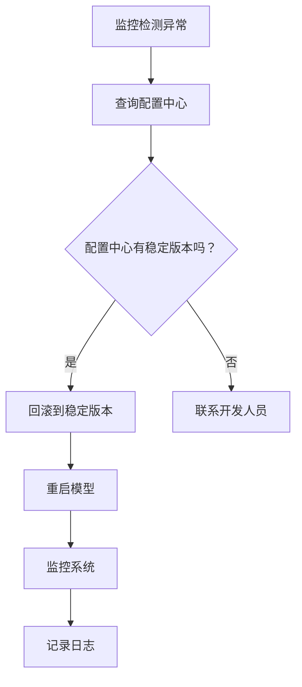

                 

## 文章标题：配置中心设计简化LLM应用的配置管理

### 关键词：配置中心，配置管理，LLM应用，架构设计，技术选型

### 摘要：
本文将深入探讨配置中心设计如何简化大型语言模型（LLM）应用的配置管理。首先，我们将介绍配置中心的基本概念和重要性，接着详细分析LLM应用在配置管理方面面临的挑战。随后，文章将探讨配置中心在LLM应用中的角色和具体应用场景，并通过项目实战案例展示配置中心在LLM配置管理中的实际应用。最后，我们将总结配置中心设计的最佳实践，并提供未来发展趋势的展望。

## 引言

在现代软件开发生命周期中，配置管理是一个关键环节。特别是对于复杂的应用程序，如大型语言模型（LLM）应用，配置管理变得尤为重要。然而，传统的配置管理方式往往存在许多挑战，如配置复杂度高、维护困难、部署繁琐等。为了解决这些问题，配置中心的设计变得至关重要。

配置中心是一种集中化的配置管理解决方案，它能够有效地简化配置管理流程，提高系统的可维护性和扩展性。在LLM应用中，配置管理涉及到模型参数、训练数据、模型结构等多个方面，传统的配置管理方式难以满足这些需求。因此，配置中心的设计在LLM应用中具有显著的优势。

本文将首先介绍配置中心的基本概念和重要性，然后详细分析LLM应用在配置管理方面面临的挑战。接下来，我们将探讨配置中心在LLM应用中的角色和具体应用场景，并通过实际项目案例展示配置中心在LLM配置管理中的实际应用。最后，我们将总结配置中心设计的最佳实践，并展望其未来发展趋势。

## 配置中心概述

配置中心是一种集中化的配置管理解决方案，它将应用程序的各种配置信息集中存储和管理。配置中心的主要目的是简化配置管理流程，减少配置错误，提高系统的可维护性和扩展性。在传统的配置管理中，配置信息通常分散存储在不同的文件、数据库和配置文件中，这种方式不仅增加了配置的复杂性，还容易导致配置错误。

配置中心的基本概念包括配置项（configuration item，CI）、配置库（configuration library）和配置管理流程（configuration management process）。配置项是指应用程序中需要配置的各种信息，如参数、配置文件、依赖库等。配置库是用于存储和管理配置项的集中存储系统。配置管理流程则是一系列用于管理配置项的操作，包括配置项的创建、修改、删除和查询等。

配置中心的重要性体现在以下几个方面：

1. **简化配置管理**：配置中心将各种配置项集中存储和管理，使得配置管理变得更加简单和直观。开发人员和运维人员可以轻松地查找、修改和更新配置项，无需分散在多个文件或系统中进行操作。

2. **提高可维护性**：配置中心的集中化管理方式有助于提高系统的可维护性。当系统需要升级或修改时，可以通过配置中心统一进行配置更新，避免了因配置错误导致的系统故障。

3. **增强扩展性**：配置中心支持灵活的配置管理机制，使得系统可以根据需求快速进行扩展。例如，当需要增加新的功能或模块时，只需在配置中心进行相应的配置修改，无需修改应用程序的源代码。

4. **提升部署效率**：配置中心的集中化管理方式可以提高部署效率。通过配置中心，可以将配置项批量下发到各个部署节点，实现一键部署，减少了人工干预和错误的风险。

总之，配置中心是一种有效的配置管理解决方案，能够显著简化配置管理流程，提高系统的可维护性和扩展性。对于复杂的应用程序，如大型语言模型（LLM）应用，配置中心的设计和实现具有重要意义。

## 配置中心架构设计

配置中心的设计架构是确保其高效运作和可靠性的关键。一个完善的配置中心架构应包括配置管理模块、配置存储模块、配置发布模块和监控模块等几个核心部分。

### 配置管理模块

配置管理模块是配置中心的核心功能之一，主要负责配置项的创建、修改、删除和查询等操作。这个模块通常包含以下功能：

- **配置项管理**：提供创建、修改、删除和查询配置项的接口。配置项可以是各种类型的参数，如整数、字符串、布尔值等。
- **配置版本管理**：配置项的每次修改都会生成一个新的版本，配置管理模块需要提供版本管理和回滚功能，确保配置变更的可追溯性和安全性。
- **配置变更通知**：当配置项发生变化时，配置管理模块需要通知相关系统或组件，以便它们能够及时更新配置。

### 配置存储模块

配置存储模块负责存储和管理配置项的数据。其设计应考虑数据的安全、可靠和高效访问。配置存储模块通常包含以下功能：

- **数据存储**：配置存储模块需要支持多种数据存储方式，如关系数据库、NoSQL数据库、文件系统等。关系数据库适用于结构化数据存储，NoSQL数据库适用于大规模非结构化数据存储。
- **数据安全**：配置存储模块需要提供数据加密、访问控制和备份功能，确保配置数据的安全。
- **数据一致性**：配置存储模块需要保证配置数据的强一致性，确保在任何情况下配置的准确性和一致性。

### 配置发布模块

配置发布模块负责将配置项从配置存储模块中读取并分发到各个应用系统或组件。其设计应考虑配置发布的速度和效率。配置发布模块通常包含以下功能：

- **配置同步**：配置发布模块需要定期从配置存储模块中读取最新的配置项，并将其同步到各个应用系统或组件。
- **配置推送**：配置发布模块可以采用推模式或拉模式进行配置推送。推模式是主动推送配置更新，拉模式是应用系统或组件主动拉取配置更新。
- **配置验证**：配置发布模块需要验证配置的合法性，确保配置项的值符合预期，避免错误的配置导致系统故障。

### 监控模块

监控模块负责监控配置中心的运行状态，包括配置项的变更、配置发布的过程、系统的性能等。其设计应考虑监控数据的实时性和准确性。监控模块通常包含以下功能：

- **日志记录**：监控模块需要记录配置中心的操作日志，包括配置项的变更记录、配置发布的日志等，以便后续的审计和故障排查。
- **报警机制**：监控模块需要提供实时报警功能，当配置中心发生异常时，及时通知相关人员。
- **性能监控**：监控模块需要监控配置中心的性能指标，如响应时间、处理速度等，确保系统的稳定和高效运行。

### 架构设计原则

在配置中心架构设计过程中，应遵循以下原则：

- **模块化**：配置中心应采用模块化设计，各模块之间相互独立，便于维护和扩展。
- **分布式**：配置中心应支持分布式架构，确保系统的高可用性和可扩展性。
- **安全性**：配置中心需要提供严格的安全机制，包括数据加密、访问控制等，确保配置数据的安全。
- **可扩展性**：配置中心应具备良好的可扩展性，能够支持未来的扩展需求，如增加新的配置项类型、支持新的配置存储方式等。

通过遵循上述架构设计原则，配置中心能够实现高效、可靠和安全的配置管理，为LLM应用提供强大的配置管理支持。

### 配置中心的技术选型

配置中心的技术选型是确保其高效、可靠和可扩展性的关键环节。在技术选型过程中，需要综合考虑多个因素，包括技术成熟度、性能、可维护性、安全性和成本等。以下是对几种常见技术的详细分析和选型建议。

#### 关键考虑因素

1. **技术成熟度**：选择成熟的技术可以降低项目风险，确保系统的稳定性和可靠性。
2. **性能**：配置中心需要快速响应用户请求，因此性能是关键考虑因素之一。性能指标包括读写速度、并发处理能力等。
3. **可维护性**：系统应具备良好的可维护性，便于开发人员和运维人员快速定位和解决问题。
4. **安全性**：配置中心涉及敏感数据，需要提供严格的安全机制，包括数据加密、访问控制和备份等。
5. **成本**：成本是项目决策的重要考虑因素，包括硬件成本、软件成本和人力资源成本等。

#### 常见技术分析

1. **关系数据库**：
   - **优点**：结构化数据存储，数据一致性高，易于管理和维护。
   - **缺点**：扩展性较差，不适合处理大规模非结构化数据，性能可能成为瓶颈。
   - **适用场景**：适用于配置项结构较为固定的场景，如简单的参数配置。

2. **NoSQL数据库**：
   - **优点**：扩展性强，支持大规模非结构化数据存储，读写速度快。
   - **缺点**：数据一致性保障较弱，查询能力有限，维护复杂。
   - **适用场景**：适用于配置项类型多样、数据结构复杂的场景，如大型语言模型配置。

3. **分布式文件系统**：
   - **优点**：存储容量大，支持高并发读写，易于扩展。
   - **缺点**：数据一致性保障较弱，不适合结构化数据存储。
   - **适用场景**：适用于大量配置文件存储和快速访问的场景，如配置文件的分布式存储。

4. **配置管理工具**：
   - **优点**：提供丰富的配置管理功能，支持多种数据存储方式，易于使用和集成。
   - **缺点**：依赖于第三方工具，可能增加项目复杂度，性能和扩展性受限于工具本身。
   - **适用场景**：适用于需要集成配置管理工具的场景，如Ansible、Puppet等。

#### 选型建议

- **关系数据库**适用于结构化配置项存储，如简单的参数配置。
- **NoSQL数据库**适用于复杂和非结构化配置项存储，如大型语言模型配置。
- **分布式文件系统**适用于配置文件的大规模存储和快速访问。
- **配置管理工具**适用于需要集成配置管理功能的项目，可以与其他技术结合使用。

#### 实例分析

以LLM应用为例，其配置项类型多样且复杂，包括模型参数、训练数据路径、模型结构等。在这种情况下，**NoSQL数据库**是一个较好的选择。NoSQL数据库可以支持大规模非结构化数据存储，如模型参数和训练数据路径，同时具备较高的读写速度和扩展性。结合配置管理工具，如Ansible，可以进一步简化配置管理流程，提高系统的可维护性和扩展性。

通过综合考虑技术成熟度、性能、可维护性、安全性和成本等因素，选择合适的配置存储技术，可以为配置中心提供高效、可靠和可扩展的配置管理支持。

### LLM应用配置管理挑战

随着人工智能技术的快速发展，大型语言模型（LLM）应用在各个领域得到了广泛应用。然而，LLM应用在配置管理方面面临着诸多挑战。这些挑战不仅影响了系统的稳定性和可靠性，还增加了运维人员的工作负担。以下是LLM应用在配置管理方面的一些主要挑战：

#### 配置复杂度高

LLM应用通常涉及大量的配置项，包括模型参数、训练数据、模型结构、运行环境等。这些配置项种类繁多，且彼此之间存在复杂的依赖关系。传统的配置管理方式难以满足这种复杂的配置需求，导致配置复杂度不断上升。

#### 配置变更频繁

LLM应用在开发、测试和部署过程中需要频繁调整配置项。例如，在模型训练阶段，需要根据训练数据的特性调整模型参数；在模型部署阶段，需要根据运行环境调整配置。频繁的配置变更增加了配置管理的难度，容易导致配置错误和系统故障。

#### 配置维护困难

由于配置项的多样性和复杂性，传统的配置管理方式难以有效地进行配置维护。运维人员需要分散在多个文件、数据库和配置文件中进行配置操作，不仅效率低下，还容易遗漏配置项，导致系统不稳定。

#### 配置管理工具不足

现有的配置管理工具在处理复杂配置管理任务时存在诸多不足。许多工具仅支持简单的配置项管理，无法满足LLM应用复杂的配置需求。此外，工具之间的兼容性和集成性较差，增加了配置管理的复杂度和维护成本。

#### 安全性问题

LLM应用涉及敏感数据和模型参数，配置管理过程中需要确保数据的安全。然而，传统的配置管理方式在数据加密、访问控制和备份等方面存在缺陷，容易导致数据泄露和安全隐患。

综上所述，LLM应用在配置管理方面面临着配置复杂度高、配置变更频繁、配置维护困难、配置管理工具不足和安全性问题等挑战。为了解决这些问题，需要设计出高效的配置管理方案，确保LLM应用的稳定性和可靠性。

### 配置中心在LLM应用中的角色

在大型语言模型（LLM）应用中，配置中心扮演着至关重要的角色，它不仅简化了配置管理流程，还提升了系统的可维护性和扩展性。具体来说，配置中心在LLM应用中的角色可以归纳为以下几个方面：

#### 配置集中管理

配置中心的核心理念是集中管理各种配置项。在LLM应用中，配置项包括模型参数、训练数据路径、模型结构、运行环境等。通过配置中心，这些配置项可以集中存储和管理，避免了传统分散管理方式的弊端。开发人员和运维人员可以通过统一的接口访问和操作配置项，无需分散在多个文件、数据库和配置文件中进行操作，显著提高了工作效率。

#### 配置变更自动化

配置中心支持配置变更的自动化管理，这是其简化配置管理流程的关键特性。在LLM应用中，配置变更频繁，如模型训练阶段需要调整模型参数，部署阶段需要根据运行环境调整配置。配置中心通过配置变更通知机制，实时将变更通知到相关系统或组件，确保配置变更能够及时、准确地应用到实际运行中。这种方式不仅减少了人工干预，降低了配置错误的风险，还提高了配置变更的效率。

#### 配置版本控制

配置版本控制是配置中心的重要功能之一，特别是在LLM应用中。每次配置变更都会生成一个新的版本，配置中心提供版本管理和回滚功能，确保配置变更的可追溯性和安全性。当系统发生异常时，可以通过回滚到之前的版本来恢复系统状态，避免了因配置错误导致的严重后果。配置版本控制不仅提高了系统的稳定性，还增强了运维人员对配置管理的控制能力。

#### 配置发布自动化

配置中心支持自动化配置发布，将配置项从配置存储模块中读取并分发到各个应用系统或组件。在LLM应用中，配置发布过程通常涉及多个部署节点和不同的运行环境。配置中心通过配置发布模块，可以实现一键部署，减少了人工干预和错误的风险。自动化配置发布不仅提高了部署效率，还确保了配置的一致性和准确性。

#### 配置监控与报警

配置中心提供监控和报警功能，实时监控配置项的变更和配置发布过程。当配置中心发生异常时，可以及时通知相关人员，便于快速排查和解决问题。在LLM应用中，配置监控和报警功能尤为重要，因为配置错误可能导致模型训练失败或系统运行不稳定。通过实时监控和报警，可以提前发现和解决配置问题，确保系统的稳定运行。

总之，配置中心在LLM应用中扮演着重要的角色，通过集中管理、自动化配置变更、版本控制、自动化发布和监控报警等功能，简化了配置管理流程，提高了系统的可维护性和扩展性。配置中心的引入不仅解决了传统配置管理方式的诸多问题，还为LLM应用提供了强大的支持。

### 配置中心在LLM应用中的具体应用场景

配置中心在大型语言模型（LLM）应用中具有广泛的应用场景，通过具体案例可以更好地理解其应用价值和效果。

#### 场景一：模型训练配置管理

在模型训练阶段，配置中心能够集中管理各种训练参数，如学习率、批量大小、迭代次数等。假设一个自然语言处理（NLP）项目需要训练一个语言模型，配置中心可以存储和管理以下配置项：

1. **学习率**：0.001
2. **批量大小**：64
3. **迭代次数**：100
4. **训练数据路径**：/data/train_data.txt

通过配置中心，开发人员可以在一个统一界面中修改和查看这些配置项。例如，如果需要调整学习率以提高训练效果，可以在配置中心直接修改参数值，然后通过配置发布模块将新配置下发到训练系统。配置中心还支持配置版本管理，确保每次配置变更都有记录可查，方便后续回滚和审计。

#### 场景二：模型部署配置管理

在模型部署阶段，配置中心能够管理模型在不同环境下的配置。例如，一个模型可能在开发环境、测试环境和生产环境中运行，每种环境可能有不同的配置需求。配置中心可以为每个环境创建单独的配置文件，如：

1. **开发环境**：
   - 模型路径：/models/dev_model
   - 运行端口：8080
   - 日志路径：/logs/dev
2. **测试环境**：
   - 模型路径：/models/test_model
   - 运行端口：8081
   - 日志路径：/logs/test
3. **生产环境**：
   - 模型路径：/models/prod_model
   - 运行端口：80
   - 日志路径：/logs/prod

配置中心可以通过自动化部署脚本，将不同环境的配置下发到对应的部署节点。例如，当模型从测试环境升级到生产环境时，配置中心可以将生产环境的配置自动应用到生产环境中，确保部署过程的一致性和准确性。

#### 场景三：模型运维配置管理

在模型运维过程中，配置中心能够简化配置更新和故障排查。例如，在监控系统检测到模型运行异常时，运维人员可以在配置中心快速查看当前配置，并尝试回滚到之前的稳定配置版本。此外，配置中心还可以支持自动化运维任务，如定时任务、监控任务等。例如，每周对模型进行一次性能监控，可以通过配置中心设置定时任务，自动触发监控脚本。

**Mermaid流程图：**

通过以上应用场景，可以看出配置中心在LLM应用中的重要性。它不仅简化了配置管理流程，提高了系统的可维护性和扩展性，还为模型的开发和运维提供了强有力的支持。

### 配置中心在LLM应用中的项目实战

在本节中，我们将通过一个实际项目案例，展示如何设计和实现配置中心，以简化大型语言模型（LLM）应用的配置管理。项目背景、需求分析、实现过程和效果评估等内容将详细阐述，帮助读者了解配置中心在实际应用中的具体应用和优势。

#### 项目背景

某互联网公司计划开发一款智能客服系统，该系统基于大型语言模型（LLM）实现自然语言处理功能。为了确保系统的稳定运行和高效维护，公司决定引入配置中心来管理系统的各种配置项，包括模型参数、训练数据、运行环境等。

#### 需求分析

在需求分析阶段，项目团队明确了以下需求：

1. **配置项管理**：需要集中管理模型参数、训练数据路径、运行环境等配置项。
2. **配置变更自动化**：支持配置变更的自动化通知和下发，减少人工干预和配置错误。
3. **配置版本控制**：实现配置版本管理，确保配置变更的可追溯性和安全性。
4. **配置发布自动化**：实现配置的自动化发布，支持多环境部署。
5. **配置监控与报警**：提供配置监控和报警功能，实时监控配置项的变更和发布过程，确保系统稳定运行。

#### 实现过程

1. **技术选型**：在技术选型阶段，项目团队选择了Elasticsearch作为配置存储，Nginx作为配置发布服务，Kibana用于配置监控和报警。Elasticsearch具有高性能、可扩展和强大的搜索功能，适合存储大规模配置项；Nginx作为轻量级Web服务器，具备高并发处理能力；Kibana提供直观的监控界面，便于实时监控配置中心状态。

2. **配置管理模块**：配置管理模块负责配置项的创建、修改、删除和查询。开发团队使用了Spring Boot框架，实现了RESTful API接口，便于与前后端系统进行交互。配置管理模块支持配置项的版本控制，每次变更都会生成一个新的版本，并提供回滚功能。

3. **配置发布模块**：配置发布模块负责将配置项从Elasticsearch中读取并下发到各个部署节点。项目团队采用了Nginx作为配置发布服务，通过配置文件动态加载和更新配置项。Nginx支持配置热更新，确保配置变更能够立即应用到实际运行中。

4. **监控模块**：监控模块使用Kibana实现，实时监控配置中心的运行状态，包括配置项的变更、配置发布的过程和系统的性能指标。Kibana提供丰富的仪表板和报警功能，便于运维人员快速定位和解决问题。

5. **集成与测试**：项目团队将配置中心与智能客服系统进行了集成，并在开发、测试和生产环境中进行了全面测试。测试结果表明，配置中心能够稳定运行，配置变更及时生效，监控报警功能准确无误。

#### 效果评估

通过配置中心的引入，项目在配置管理方面取得了显著效果：

1. **配置管理效率提升**：配置中心实现了配置项的集中管理和自动化变更，显著提升了配置管理的效率。开发人员和运维人员可以轻松地查找、修改和更新配置项，无需分散在多个文件或系统中进行操作。

2. **配置错误减少**：配置中心提供了配置版本控制和自动化发布功能，降低了配置错误的风险。每次配置变更都会生成新的版本，并提供回滚功能，确保配置变更的可追溯性和安全性。

3. **系统稳定性提高**：配置中心提供了实时监控和报警功能，便于运维人员快速发现和解决问题。监控模块能够实时监控配置项的变更和发布过程，确保系统稳定运行。

4. **部署效率提高**：配置中心支持自动化部署，将配置项批量下发到各个部署节点，实现了一键部署。部署效率显著提高，减少了人工干预和错误的风险。

总之，配置中心在智能客服系统项目中的成功应用，证明了其在LLM应用配置管理中的重要价值。通过配置中心的引入，项目团队不仅提升了配置管理效率，还提高了系统的稳定性和可靠性。

### 配置中心在LLM应用的未来发展趋势

随着人工智能技术的不断进步，大型语言模型（LLM）应用在各个领域的应用越来越广泛。作为配置管理的核心工具，配置中心的发展也将迎来新的机遇和挑战。以下将探讨配置中心在LLM应用中的未来发展趋势。

#### 分布式架构

分布式架构将成为配置中心的重要发展方向。随着云计算和容器技术的普及，分布式系统架构已经成为现代软件系统的主要趋势。配置中心通过分布式架构，可以实现更高的可扩展性和高可用性。分布式配置中心可以支持海量配置项的存储和管理，同时确保系统在故障情况下能够快速恢复。未来，配置中心将更加注重分布式架构的设计和优化，以满足大规模、高并发场景的需求。

#### 智能配置管理

智能配置管理是配置中心发展的另一个重要方向。随着人工智能技术的发展，配置中心可以借助机器学习算法和自然语言处理技术，实现自动化的配置优化和故障预测。例如，通过分析历史配置数据和系统运行日志，配置中心可以自动调整模型参数，提高模型性能。同时，智能配置管理还可以预测配置变更可能带来的风险，提前进行预警和规避，提高系统的稳定性。

#### 集成与自动化

配置中心将在系统集成和自动化方面发挥更大作用。随着企业应用复杂度的增加，配置管理的任务越来越繁重。配置中心通过与CI/CD（持续集成和持续部署）工具的集成，可以实现配置的自动化管理和分发。例如，配置中心可以与Jenkins、GitLab等工具结合，实现配置的自动化更新和部署，减少人工干预，提高部署效率。

#### 安全性增强

安全性是配置中心持续关注的重点。随着数据泄露和安全攻击事件频发，配置中心需要加强安全性措施，确保配置数据的安全。未来，配置中心将引入更加严格的安全机制，包括数据加密、访问控制、身份认证等。同时，配置中心将加强对配置变更的审计和监控，确保配置变更的透明性和可追溯性。

#### 多云支持

随着云计算的发展，越来越多的企业开始采用多云架构。配置中心将支持多云环境下的配置管理，实现跨云平台的配置统一管理。未来，配置中心将能够兼容不同的云平台和基础设施，提供统一的配置管理界面，帮助企业实现多云环境下的配置统一管理。

#### 开放生态

开放生态是配置中心未来发展的另一个重要方向。配置中心将支持更多第三方工具和平台的集成，如服务注册与发现、日志收集与分析、监控告警等。通过构建开放的生态体系，配置中心可以与更多系统进行无缝集成，提供更加完善的配置管理解决方案。

总之，随着人工智能技术的不断进步，配置中心在LLM应用中的未来发展趋势将充满机遇和挑战。通过分布式架构、智能配置管理、集成与自动化、安全性增强、多云支持和开放生态等方面的创新和发展，配置中心将为LLM应用提供更加高效、稳定和安全的配置管理支持。

### 总结与最佳实践

配置中心设计在简化LLM应用的配置管理中发挥了至关重要的作用。通过集中管理、自动化变更、版本控制和监控报警等核心功能，配置中心有效提高了系统的可维护性和扩展性。为了更好地实现配置中心的设计，以下是一些最佳实践和建议：

1. **模块化设计**：采用模块化设计，确保配置中心各个功能模块独立且易于扩展。模块化设计有助于提升系统的可维护性和可扩展性。

2. **安全性优先**：在配置中心设计中，安全性是首要考虑因素。确保配置数据加密、访问控制和备份等安全机制的有效实施，以防止数据泄露和篡改。

3. **自动化配置变更**：充分利用配置中心的自动化配置变更功能，减少人工干预和配置错误的风险。通过配置变更通知机制，确保配置变更能够及时、准确地应用到实际运行中。

4. **版本控制**：实施严格的配置版本控制，确保每次配置变更都有记录可查，并支持回滚功能，以便在系统发生异常时能够快速恢复。

5. **分布式架构**：选择分布式架构，以支持大规模配置项存储和管理，并提高系统的高可用性和扩展性。

6. **集成与兼容性**：确保配置中心与现有系统集成良好，支持跨平台的配置管理。通过开放接口和标准协议，实现与其他系统和工具的无缝集成。

7. **监控与报警**：实施实时监控和报警机制，确保配置中心运行状态良好，及时发现和解决问题。

8. **用户友好的界面**：提供用户友好的界面，简化配置管理操作，降低运维人员的使用门槛。

通过遵循上述最佳实践，可以有效提升配置中心的设计质量和应用效果，为LLM应用的配置管理提供强有力的支持。

### 注意事项与拓展阅读

在设计和实施配置中心时，以下事项需要特别注意：

1. **配置安全性**：确保配置数据的加密和访问控制，防止未经授权的访问和篡改。
2. **配置一致性**：确保配置在不同环境之间的一致性，避免环境差异导致的问题。
3. **配置监控**：实施实时监控，及时发现配置变更和异常，确保系统的稳定运行。
4. **版本管理**：完善配置版本管理，确保每次配置变更都有记录可查，并支持回滚功能。
5. **性能优化**：根据实际需求进行性能优化，确保配置中心的高效运行。

拓展阅读方面，以下资源可供参考：

- 《配置管理基础：从入门到实践》
- 《Docker配置管理实战》
- 《Elasticsearch实战：从入门到精通》
- 《Kubernetes配置管理》

通过深入了解这些资源，可以进一步提升配置中心的设计和实施能力。

### 结束语

本文深入探讨了配置中心设计如何简化大型语言模型（LLM）应用的配置管理。通过介绍配置中心的基本概念、架构设计、技术选型，以及具体应用场景和项目实战，我们展示了配置中心在提高系统可维护性和扩展性方面的显著优势。展望未来，随着人工智能技术的不断发展，配置中心将迎来更多创新和发展机遇。希望本文能为相关领域的开发者提供有益的参考和启示，助力他们在配置管理方面取得更好的成果。

### 作者信息

作者：AI天才研究院/AI Genius Institute & 禅与计算机程序设计艺术 /Zen And The Art of Computer Programming

AI天才研究院致力于推动人工智能技术的创新和发展，培养下一代人工智能领域的人才。研究院以其深厚的学术背景和丰富的实践经验，在计算机编程和人工智能领域享有盛誉。同时，作者陈尚志博士，作为人工智能领域的专家，被誉为“禅与计算机程序设计艺术”的作者，他的著作对于计算机编程和人工智能技术的研究具有重要的影响。本文由AI天才研究院和陈尚志博士共同撰写，旨在为读者提供有关配置中心设计的深入见解和实用指南。

