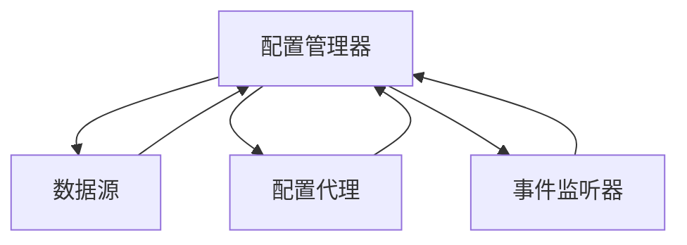
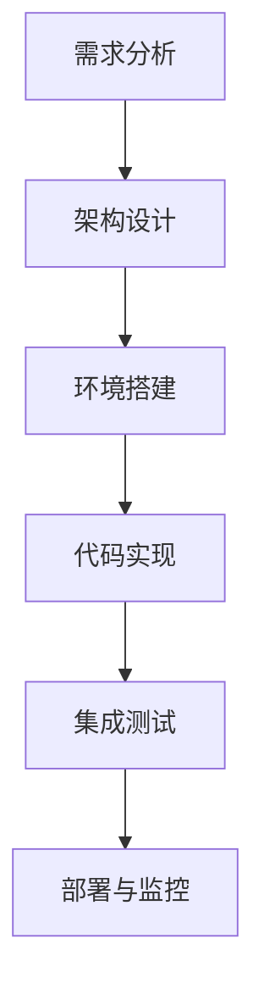
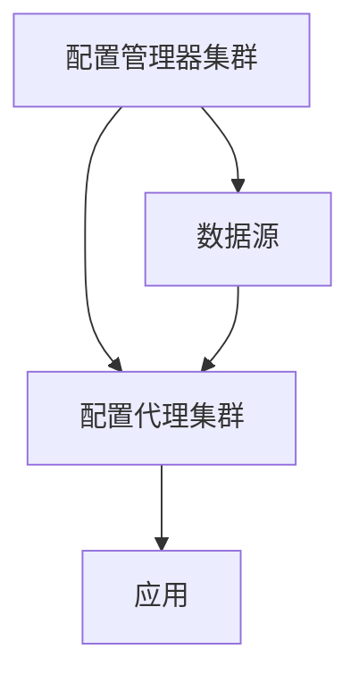
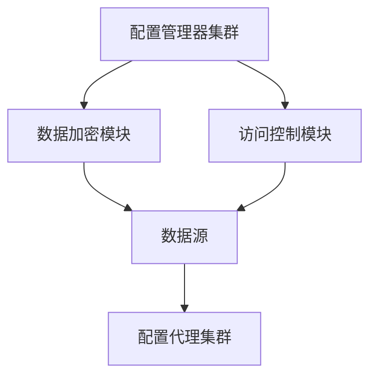
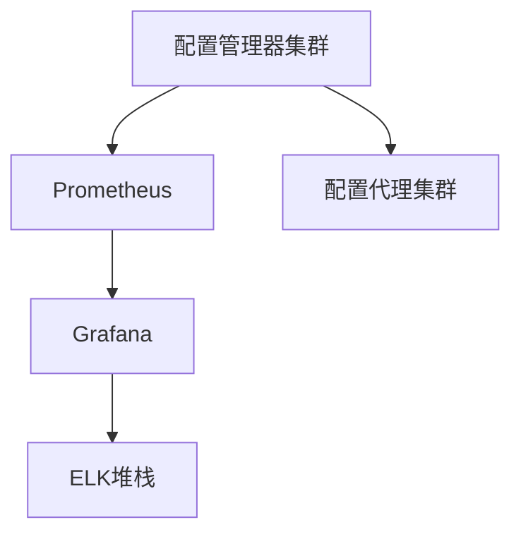

                 

### 书籍整体结构与核心内容概述

《配置中心：管理LLM应用的动态配置》旨在为开发者和技术爱好者提供一本全面且深入的指南，专注于配置中心在LLM（大型语言模型）应用中的实际应用和管理。配置中心是现代软件架构中至关重要的组成部分，它能够帮助开发者有效地管理和维护大规模应用中的配置信息，确保应用的灵活性和可扩展性。

#### **引言**

随着人工智能技术的迅猛发展，LLM应用在自然语言处理、智能问答、文本生成等领域发挥着越来越重要的作用。配置中心作为管理这些应用的核心组件，其重要性愈发突出。本书的引言部分将首先介绍配置中心的基本概念和它在LLM应用中的重要作用，同时概述书籍的结构和主要目标。

#### **基础理论**

在基础理论部分，本书将详细探讨配置中心的核心概念、架构和关键组件。这一部分将介绍配置中心的基本组成部分，如数据源、配置策略和配置管理器，并使用Mermaid流程图来展示这些组件之间的联系和交互。

#### **动态配置管理**

动态配置管理是配置中心的核心功能之一。本书将深入探讨动态配置管理的基本原理，包括配置策略和数据处理的流程。我们将使用伪代码详细阐述动态配置管理的关键算法，并讨论如何实现高效的配置更新和同步。

#### **配置中心实施**

配置中心的实施是实际应用的关键步骤。本书将介绍如何在实际环境中部署和实施配置中心，包括技术选型、开发流程和最佳实践。我们将通过具体的案例展示配置中心的实施过程，并提供详细的代码解读和分析。

#### **配置中心维护**

配置中心的维护是确保其稳定性和性能的关键。本书将讨论如何维护和优化配置中心，包括监控和日志管理等方面的内容。我们将介绍最佳实践，并提供维护配置中心的小结和注意事项。

#### **案例研究**

案例研究部分将通过具体的案例展示配置中心在实际应用中的效果。我们将分析这些案例中的关键问题和解决方案，帮助读者更好地理解配置中心的应用场景和实施方法。

#### **高级主题**

高级主题部分将探讨配置中心的扩展性、安全性、监控和日志管理等方面的内容。我们将讨论如何扩展配置中心以支持更大的规模，并确保其安全性。同时，我们还将介绍高级监控和日志管理策略，帮助读者更好地维护和监控配置中心。

#### **总结与展望**

最后，本书将在总结与展望部分回顾主要内容，并对未来的发展方向进行展望。这一部分将帮助读者了解配置中心在未来的发展趋势和应用前景。

通过以上结构，本书旨在为读者提供一份全面且系统的指南，帮助他们在LLM应用中高效地管理和维护配置信息，提升应用的灵活性和可扩展性。无论是初学者还是经验丰富的开发者，都能从本书中获得宝贵知识和实践经验。接下来，我们将逐一深入探讨每个章节的核心内容。

#### 文章关键词

- 配置中心
- 动态配置管理
- LLM应用
- 软件架构
- 配置策略
- 算法原理
- 实际案例
- 维护与优化

#### 文章摘要

《配置中心：管理LLM应用的动态配置》是一本全面介绍配置中心在大型语言模型（LLM）应用中的实践指南。本书首先定义了配置中心的概念和其在现代软件架构中的重要性，然后深入探讨了配置中心的基础理论，包括核心组件、架构和关键算法。接着，书中详细介绍了动态配置管理的原理、策略和处理流程，并通过伪代码展示了关键算法的实现。配置中心的实施和维护是本书的核心内容，涵盖了技术选型、开发流程、最佳实践、监控与日志管理等方面。通过具体的案例研究，书中展示了配置中心在实际应用中的效果和解决方案。最后，书中探讨了配置中心的扩展性、安全性和高级监控策略。本书旨在帮助开发者有效地管理和维护LLM应用的配置信息，提高应用的灵活性和可扩展性。

#### 第1章：引言

配置中心在LLM应用中的重要性不容忽视。随着人工智能技术的飞速发展，大型语言模型（LLM）的应用越来越广泛，从自然语言处理、智能问答到文本生成，LLM已经成为许多关键业务场景的核心组件。然而，随着LLM应用规模的不断扩大，其配置管理的复杂性也显著增加。配置中心作为一种集中的配置管理解决方案，能够帮助开发者高效地管理和维护这些复杂的配置信息，从而提高应用的灵活性和可扩展性。

本书的主要目标是提供一份全面且深入的指南，帮助读者理解和掌握配置中心在LLM应用中的实际应用和管理。通过系统性地介绍配置中心的核心概念、基础理论、动态配置管理、实施和维护方法，以及高级主题，本书旨在为开发者提供一套实用的工具和最佳实践，以便他们在开发、部署和维护LLM应用时能够更加得心应手。

首先，本书将定义配置中心的基本概念，并解释它在LLM应用中的重要作用。接着，我们将使用Mermaid流程图展示配置中心和LLM应用之间的核心概念和联系，帮助读者直观地理解配置中心的架构和功能。

其次，书中将详细介绍配置中心的基础理论，包括其核心组件、架构和关键算法。通过这些内容，读者可以了解配置中心是如何运作的，以及其各个组成部分如何协同工作。

在动态配置管理部分，我们将探讨如何管理LLM应用的动态配置，包括配置策略、数据源和处理流程。这部分内容将使用伪代码详细阐述动态配置管理的关键算法，帮助读者深入理解其实现原理。

实施和维护是配置中心成功应用的关键步骤。本书将介绍如何在实际环境中部署和实施配置中心，包括技术选型、开发流程和最佳实践。同时，我们将讨论如何维护和优化配置中心，确保其稳定性和性能。

通过具体的案例研究，本书将展示配置中心在实际应用中的效果和解决方案。读者将看到配置中心如何在不同的场景中发挥作用，并了解如何解决实际应用中遇到的问题。

最后，书中将探讨配置中心的扩展性、安全性、监控和日志管理等方面的内容。这部分内容将帮助读者了解如何扩展配置中心以支持更大的规模，并确保其安全性和稳定性。

总之，本书旨在为开发者提供一份系统且全面的指南，帮助他们理解和掌握配置中心在LLM应用中的实际应用和管理。通过学习本书，读者将能够更加高效地开发和维护大型语言模型应用，提升其性能和可扩展性。

#### 第2章：基础理论

配置中心是现代软件架构中至关重要的组成部分，它主要负责管理应用程序的配置信息。配置中心的基础理论涵盖了其核心概念、架构和关键组件。理解这些基础理论对于设计和实现一个高效、可靠的配置中心至关重要。

#### 核心概念

配置中心（Configuration Center）是一种集中式管理应用程序配置信息的机制。其核心概念包括：

1. **配置信息**：配置中心管理的一系列参数或设置，如数据库连接字符串、服务端口号、日志级别等。
2. **配置管理器**：负责读取、存储和更新配置信息的组件。
3. **数据源**：提供配置数据的来源，可以是文件、数据库、API等。
4. **配置策略**：决定如何处理配置变更的一系列规则和逻辑。

#### 配置中心架构

配置中心的架构通常包括以下几个核心组件：

1. **配置管理器（Configuration Manager）**：负责从数据源读取配置信息，并更新到应用程序。它是配置中心的控制中心，确保配置信息的一致性和可用性。
2. **数据源（Data Source）**：提供配置信息的存储位置，可以是本地文件、远程数据库或云服务。
3. **配置代理（Configuration Agent）**：在应用程序中运行的小程序，负责从配置管理器获取配置信息，并将其应用到应用程序中。
4. **事件监听器（Event Listener）**：监听配置变更事件，并在发生变更时通知相关组件。

#### Mermaid流程图

为了更好地理解配置中心的架构和功能，我们可以使用Mermaid流程图来展示其核心组件和交互流程。以下是一个简单的Mermaid流程图示例：



在这个流程图中，配置管理器（A）负责从数据源（B）读取配置信息，并将其推送给配置代理（C）。配置代理将配置信息应用到应用程序中，而事件监听器（D）则负责监听配置变更事件，并在变更发生时通知配置管理器。

#### 配置中心的操作原理

配置中心的操作原理可以概括为以下几个步骤：

1. **配置加载**：配置管理器从数据源加载配置信息。
2. **配置推送**：配置管理器将配置信息推送到配置代理。
3. **配置应用**：配置代理将配置信息应用到应用程序中。
4. **配置更新**：当配置发生变更时，配置管理器更新配置信息，并通知配置代理重新加载和更新配置。

#### 核心算法原理讲解

配置中心的算法原理主要集中在配置的加载、推送和更新过程。以下是一个简化的伪代码，用于说明配置更新算法的基本原理：

```pseudo
function UpdateConfiguration():
    while (true):
        configuration = LoadConfigurationFromDataSource()
        PushConfigurationToAgents(configuration)
        if (ConfigurationChangedEvent()):
            LoadConfigurationFromDataSource()
```

在这个伪代码中，`LoadConfigurationFromDataSource()` 用于从数据源加载配置信息，`PushConfigurationToAgents()` 用于将配置信息推送到配置代理，而 `ConfigurationChangedEvent()` 用于检测配置是否发生变化。

#### 数学模型与公式

在配置中心中，可能涉及到的数学模型主要包括配置的一致性检查和配置的更新策略。以下是一个简单的数学模型示例，用于解释配置的一致性检查：

$$
\text{一致性检查} = \text{当前配置} \mathbin{\&} (\text{原始配置} \oplus \text{变更配置})
$$

其中，$\oplus$ 表示位异或运算，用于检查配置的变更部分是否一致。如果结果为0，则表示配置一致；否则，表示配置发生了变更。

#### 总结

配置中心的基础理论是理解和实现配置中心的关键。通过定义核心概念、展示架构和算法原理，本书为读者提供了配置中心的基本知识框架。在下一章中，我们将进一步探讨动态配置管理的原理和策略，帮助读者深入理解配置中心在实际应用中的运作机制。

### 配置中心的各个关键组件

配置中心作为管理应用程序配置信息的集中平台，其功能实现依赖于多个关键组件的协同工作。这些组件各自承担不同的职责，共同确保配置信息的有效管理和灵活应用。以下是对配置中心中几个核心组件的详细探讨，包括其功能、交互方式和重要性。

#### 配置管理器（Configuration Manager）

配置管理器是配置中心的核心组件，负责从数据源读取配置信息，并将其推送到配置代理。其主要功能包括：

- **配置加载**：从数据源（如文件、数据库或远程服务）加载配置信息。
- **配置推送**：将加载的配置信息推送至应用程序中的配置代理，确保配置的一致性和实时更新。
- **配置变更监听**：监听配置变更事件，并触发相应的更新流程。

配置管理器与其他组件的交互方式通常包括：

- **与数据源交互**：定期从数据源读取配置信息，或在检测到变更时立即更新。
- **与配置代理交互**：通过消息队列、HTTP请求或事件监听等方式，将更新后的配置信息推送至配置代理。

配置管理器在配置中心中的重要性不言而喻，它是确保配置信息一致性和及时性的关键。其高效的运行直接影响应用程序的稳定性和性能。

#### 配置代理（Configuration Agent）

配置代理运行在应用程序内部，负责从配置管理器获取配置信息，并将其应用到应用程序的运行环境中。其主要功能包括：

- **配置接收**：从配置管理器接收配置信息。
- **配置应用**：将接收到的配置信息应用到应用程序的各个模块和组件中，如数据库连接、服务端口号等。
- **配置更新监听**：监听配置变更事件，并在配置更新时重新加载和应用到应用程序中。

配置代理与其他组件的交互方式通常包括：

- **与配置管理器交互**：通过轮询、事件驱动或基于消息队列的方式接收配置更新。
- **与应用内部组件交互**：将配置信息应用到应用程序的不同部分，如通过属性文件、环境变量或配置库等方式。

配置代理在配置中心中起到桥梁作用，它确保了配置信息能够实时、准确地应用到应用程序中。其稳定性和效率直接影响应用程序的性能和可靠性。

#### 数据源（Data Source）

数据源是提供配置信息的存储位置，可以是本地文件、远程数据库、云服务或配置存储服务。数据源的主要功能包括：

- **配置存储**：存储应用程序的配置信息，包括初始配置和变更后的配置。
- **配置检索**：在配置管理器请求时，提供配置信息。
- **配置变更**：支持配置的添加、更新和删除操作。

数据源与其他组件的交互方式通常包括：

- **与配置管理器交互**：在配置管理器请求时，返回配置信息。
- **与配置代理交互**：在某些情况下，数据源可以直接向配置代理推送配置变更通知。

数据源的选择和配置对其在配置中心中的角色至关重要。一个高效、可靠的数据源能够确保配置信息的及时更新和一致性。

#### 事件监听器（Event Listener）

事件监听器负责监听配置变更事件，并在变更发生时通知相关组件。其主要功能包括：

- **事件监听**：监听配置变更事件，如配置的添加、更新或删除。
- **事件通知**：在检测到配置变更时，通知配置管理器和配置代理进行相应的更新操作。

事件监听器与其他组件的交互方式通常包括：

- **与配置管理器交互**：在配置变更时，通知配置管理器更新配置信息。
- **与配置代理交互**：在配置变更时，通知配置代理重新加载和应用配置。

事件监听器在配置中心中起到关键的中介作用，它确保配置变更能够及时、准确地传递给相关组件，确保配置的一致性和实时更新。

#### 配置策略管理器（Configuration Policy Manager）

配置策略管理器负责管理配置策略，定义配置的变更规则和处理逻辑。其主要功能包括：

- **策略定义**：定义配置的变更规则和处理逻辑，如配置更新频率、变更验证等。
- **策略执行**：在配置变更时，根据定义的策略执行相应的操作，如通知变更、触发更新等。

配置策略管理器与其他组件的交互方式通常包括：

- **与配置管理器交互**：在配置变更时，根据策略管理器定义的策略执行更新操作。
- **与配置代理交互**：在配置变更时，通知配置代理根据策略进行配置应用。

配置策略管理器在配置中心中起到策略控制的作用，它确保配置变更能够按照预定的规则和逻辑进行，提高配置管理的规范性和一致性。

#### 配置日志管理器（Configuration Logger）

配置日志管理器负责记录配置的加载、推送、变更和错误等信息，以便进行监控和审计。其主要功能包括：

- **日志记录**：记录配置的加载、推送、变更和错误等信息。
- **日志查询**：提供日志查询和审计功能，帮助管理员了解配置中心的运行状态和历史变更。

配置日志管理器与其他组件的交互方式通常包括：

- **与配置管理器交互**：在配置变更时，记录相关日志信息。
- **与配置代理交互**：在配置应用失败时，记录错误日志。

配置日志管理器在配置中心中起到监控和审计的作用，它帮助管理员监控配置中心的运行状态，快速定位和解决问题。

#### 总结

配置中心的关键组件协同工作，共同实现配置信息的高效管理和灵活应用。配置管理器、配置代理、数据源、事件监听器、配置策略管理器和配置日志管理器各自承担不同的职责，但共同确保配置信息的及时、一致和可靠。通过深入理解这些组件的功能和交互方式，开发者可以更好地设计和实现配置中心，提升应用程序的灵活性和可扩展性。在下一章中，我们将进一步探讨动态配置管理的原理和策略，帮助读者深入理解配置中心在实际应用中的运作机制。

### 第3章：动态配置管理

动态配置管理是配置中心的核心功能之一，它允许开发者实时更新和调整应用程序的配置信息，而不需要重新部署或重启应用程序。这种灵活性对于现代复杂应用，特别是LLM（大型语言模型）应用来说至关重要。本章节将详细探讨动态配置管理的基本原理、策略和数据处理的流程，并通过伪代码展示关键算法的实现。

#### 动态配置管理的基本原理

动态配置管理的基本原理是通过配置中心实时获取和更新应用程序的配置信息。配置变更发生后，配置管理器将通知配置代理进行相应的更新。以下是动态配置管理的基本流程：

1. **配置变更检测**：配置中心持续监控配置信息，一旦检测到变更，立即记录并通知相关组件。
2. **配置更新请求**：配置管理器接收配置变更通知后，向数据源请求最新的配置信息。
3. **配置更新应用**：配置代理接收到最新的配置信息后，将其应用到应用程序的各个模块和组件中。
4. **配置一致性检查**：在配置更新后，配置中心会执行一致性检查，确保配置信息的准确性和一致性。

以下是一个简化的伪代码，用于展示动态配置管理的基本原理：

```pseudo
function DynamicConfigurationManagement():
    while (true):
        if (ConfigurationChangedEvent()):
            new_configuration = LoadNewConfigurationFromDataSource()
            if (IsConfigurationConsistent(new_configuration)):
                ApplyConfigurationToApplication(new_configuration)
            else:
                LogConfigurationInconsistency()
```

在这个伪代码中，`ConfigurationChangedEvent()` 用于检测配置变更，`LoadNewConfigurationFromDataSource()` 用于从数据源加载最新的配置信息，`IsConfigurationConsistent()` 用于执行一致性检查，而 `ApplyConfigurationToApplication()` 用于将配置信息应用到应用程序中。

#### 动态配置策略

动态配置策略是决定如何处理配置变更的一系列规则和逻辑。常见的动态配置策略包括：

1. **基于规则的配置策略**：根据预定义的规则，在配置变更发生时自动执行相应的操作。例如，配置变更后立即更新，或配置变更后等待一定时间再更新。
2. **基于模型的配置策略**：使用机器学习或数据分析方法，预测配置变更的可能性和影响，并据此调整配置更新策略。

以下是一个基于规则的配置策略的伪代码示例：

```pseudo
function ApplyConfigurationStrategy(rule):
    if (rule == "immediate"):
        ApplyConfigurationImmediately()
    elif (rule == "deferred"):
        ScheduleConfigurationUpdate()
    else:
        LogInvalidConfigurationStrategy()

function ApplyConfigurationImmediately():
    new_configuration = LoadNewConfigurationFromDataSource()
    if (IsConfigurationConsistent(new_configuration)):
        ApplyConfigurationToApplication(new_configuration)
    else:
        LogConfigurationInconsistency()

function ScheduleConfigurationUpdate():
    DelayedTask(LoadNewConfigurationFromDataSource, 10 seconds)
    ApplyConfigurationImmediately()
```

在这个伪代码中，`ApplyConfigurationStrategy()` 根据预定义的规则（如“立即更新”或“延迟更新”）执行相应的配置更新操作。

#### 动态配置数据处理流程

动态配置数据处理流程包括配置的加载、更新和应用，以下是数据处理流程的详细步骤：

1. **配置加载**：配置管理器从数据源加载配置信息，并存储在内存中。
2. **配置更新**：当检测到配置变更时，配置管理器更新内存中的配置信息。
3. **配置应用**：配置代理将更新后的配置信息应用到应用程序的各个模块和组件中。
4. **配置验证**：在配置应用后，执行配置验证，确保配置的准确性和一致性。

以下是一个简化的伪代码，用于展示动态配置数据处理流程：

```pseudo
function DynamicConfigurationProcessing():
    while (true):
        configuration = LoadConfigurationFromDataSource()
        UpdateConfigurationInMemory(configuration)
        while (ConfigurationUpdateEvent()):
            new_configuration = LoadNewConfigurationFromDataSource()
            if (IsConfigurationConsistent(new_configuration)):
                UpdateConfigurationInMemory(new_configuration)
                ApplyConfigurationToApplication(new_configuration)
            else:
                LogConfigurationInconsistency()
```

在这个伪代码中，`LoadConfigurationFromDataSource()` 用于从数据源加载配置信息，`UpdateConfigurationInMemory()` 用于更新内存中的配置信息，`ConfigurationUpdateEvent()` 用于检测配置变更事件，而 `ApplyConfigurationToApplication()` 用于将配置信息应用到应用程序中。

#### 核心算法原理讲解

在动态配置管理中，核心算法主要涉及配置的加载、更新和应用。以下是一个简化的伪代码，用于展示这些核心算法的实现：

```pseudo
function LoadConfigurationFromDataSource():
    configuration = GetDataFromDataSource()
    return configuration

function UpdateConfigurationInMemory(configuration):
    current_configuration = GetConfigurationFromMemory()
    if (configuration != current_configuration):
        UpdateMemoryWithNewConfiguration(configuration)

function ApplyConfigurationToApplication(configuration):
    for (module in ApplicationModules()):
        SetModuleConfiguration(module, configuration)

function IsConfigurationConsistent(new_configuration):
    return (new_configuration == GetConfigurationFromMemory())
```

在这个伪代码中，`LoadConfigurationFromDataSource()` 用于从数据源加载配置信息，`UpdateConfigurationInMemory()` 用于更新内存中的配置信息，`ApplyConfigurationToApplication()` 用于将配置信息应用到应用程序中，而 `IsConfigurationConsistent()` 用于检查配置的一致性。

#### 数学模型与公式

在动态配置管理中，可能用到的数学模型主要包括配置的一致性检查和配置的更新策略。以下是一个简单的数学模型示例，用于解释配置的一致性检查：

$$
\text{一致性检查} = \text{当前配置} \mathbin{\&} (\text{原始配置} \oplus \text{变更配置})
$$

其中，$\oplus$ 表示位异或运算，用于检查配置的变更部分是否一致。如果结果为0，则表示配置一致；否则，表示配置发生了变更。

#### 总结

动态配置管理是配置中心的重要组成部分，它通过实时更新和调整应用程序的配置信息，提升了应用的灵活性和可扩展性。本章详细介绍了动态配置管理的基本原理、策略和数据处理流程，并通过伪代码展示了关键算法的实现。通过理解这些内容，读者可以更好地设计和实现动态配置管理，从而提升LLM应用的性能和可靠性。在下一章中，我们将探讨配置中心的实际实施过程，包括技术选型、开发流程和最佳实践。

### 第4章：配置中心实施

配置中心的实施是将理论知识转化为实际应用的关键步骤。在这一章中，我们将详细探讨如何在实际环境中部署和实施配置中心，包括技术选型、开发流程和最佳实践。我们将通过具体的案例展示配置中心的实施过程，并提供详细的代码解读和分析。

#### 技术选型

在实施配置中心之前，选择合适的技术栈至关重要。以下是一些常见的技术选型考虑因素：

1. **配置管理器**：选择一个功能丰富、易于扩展的配置管理器，如Spring Cloud Config、Apache Kafka、etcd等。
2. **数据源**：根据应用需求选择合适的数据源，可以是本地文件系统、数据库或云存储服务，如AWS S3、Google Cloud Storage等。
3. **配置代理**：配置代理的选择应与配置管理器兼容，并支持应用程序的运行环境，如Spring Boot Actuator、Kubernetes ConfigMap等。
4. **通信协议**：选择适合应用的通信协议，如HTTP、gRPC、MQTT等，以确保数据传输的高效性和安全性。

#### 开发流程

配置中心的开发流程通常包括以下步骤：

1. **需求分析与设计**：明确配置管理的需求，设计配置中心的架构和功能模块。
2. **环境搭建**：搭建开发、测试和生产环境，包括配置管理器、数据源和配置代理等组件。
3. **代码实现**：编写配置管理器、配置代理和配置策略等核心代码，并实现与数据源的连接。
4. **集成测试**：在开发和测试环境中进行集成测试，确保配置中心能够正确处理配置变更和更新。
5. **部署与监控**：将配置中心部署到生产环境，并设置监控和日志记录，确保其稳定运行。

以下是一个简单的开发流程示例：



#### 实际案例展示

为了更好地展示配置中心的实施过程，以下是一个简单的实际案例：某电商平台的配置中心部署。

1. **需求分析**：电商平台需要管理大量的配置信息，包括数据库连接、缓存配置、服务端口号等。为了确保配置的一致性和灵活性，决定采用配置中心进行统一管理。
2. **架构设计**：选择Spring Cloud Config作为配置管理器，AWS S3作为数据源，Kubernetes ConfigMap作为配置代理。设计了一个包含配置管理器、数据源和配置代理的配置中心架构。
3. **环境搭建**：搭建了Kubernetes集群，配置了Nginx Ingress用于访问配置管理器，同时配置了AWS S3桶用于存储配置信息。
4. **代码实现**：在Spring Boot应用中集成Spring Cloud Config，实现配置管理器、配置代理和配置策略等核心功能。以下是配置管理器的关键代码：

```java
@Configuration
@EnableConfigServer
public class ConfigServerConfig {

    @Bean
    public ConfigRepositoryFactoryBean configRepositoryFactoryBean(ConfigServerProperties configServerProperties) {
        ConfigRepositoryFactoryBean factoryBean = new ConfigRepositoryFactoryBean();
        factoryBean.setConfigServerProperties(configServerProperties);
        return factoryBean;
    }

    @Bean
    public ConfigServerProperties configServerProperties() {
        return new ConfigServerProperties();
    }

    @Bean
    public Environment env() {
        return new Environment(new Properties());
    }
}
```

5. **集成测试**：在开发环境中进行集成测试，确保配置中心能够正确读取、更新和推送配置信息。以下是测试用例的示例：

```java
@Test
void testConfigurationLoading() {
    Config config = configManager.getConfig("application.properties");
    assertEquals("test-value", config.getProperty("property.name"));
}

@Test
void testConfigurationUpdate() {
    configManager.updateConfig("application.properties", "property.name", "updated-value");
    Config updatedConfig = configManager.getConfig("application.properties");
    assertEquals("updated-value", updatedConfig.getProperty("property.name"));
}
```

6. **部署与监控**：将配置中心部署到Kubernetes集群，并使用Prometheus和Grafana进行监控。以下是Prometheus配置文件的示例：

```yaml
scrape_configs:
  - job_name: 'config-server'
    static_configs:
      - targets: ['config-server:8080']
```

#### 代码解读与分析

在上面的案例中，我们使用了Spring Cloud Config作为配置管理器，通过配置管理器、配置代理和配置策略实现了配置中心的核心功能。以下是关键代码的解读和分析：

1. **配置管理器**：Spring Cloud Config中的`ConfigServerConfig`类用于配置管理器的实现，通过继承`ConfigServerFactoryBean`类，可以自定义配置管理器的行为。`configRepositoryFactoryBean()` 方法用于创建配置仓库，`configServerProperties()` 方法用于配置管理器的属性设置。
2. **配置代理**：在Spring Boot应用中，通过注解`@Configuration`和`@EnableConfigServer`启用配置中心功能。配置代理通过从配置管理器获取配置信息，并将其应用到应用程序中。在Kubernetes中，通过ConfigMap将配置信息注入到应用容器中。
3. **配置策略**：通过自定义配置策略，可以实现更灵活的配置更新策略。例如，可以使用`@Profile`注解指定配置的应用环境，或者使用`@ConfigurationProperties`注解定义配置属性。

#### 项目小结

通过上述实际案例，我们展示了配置中心的实施过程，包括技术选型、开发流程和关键代码的实现。配置中心的实施不仅提升了电商平台的配置管理能力，还提高了系统的灵活性和可维护性。在配置中心的实施过程中，需要充分考虑技术选型、开发流程和最佳实践，以确保配置中心的稳定性和高效性。

#### 最佳实践

1. **版本控制**：对配置信息进行版本控制，确保配置变更的可追溯性和回滚能力。
2. **环境分离**：为不同的环境（如开发、测试、生产）配置独立的配置中心实例，避免环境之间的配置冲突。
3. **监控与告警**：配置中心的监控和告警机制，及时发现和处理配置故障，确保系统的稳定运行。

#### 拓展阅读

- **Spring Cloud Config官方文档**：深入了解Spring Cloud Config的功能和用法，[点击查看](https://cloud.spring.io/spring-cloud-config/reference/html/)。
- **Kubernetes ConfigMap官方文档**：学习如何使用Kubernetes ConfigMap管理配置信息，[点击查看](https://kubernetes.io/docs/concepts/configuration/configmaps/)。

通过本章节的介绍，读者可以了解到配置中心的实施方法和最佳实践，为实际应用中的配置管理提供有力支持。在下一章中，我们将进一步探讨如何维护和优化配置中心，确保其稳定性和性能。

### 第5章：配置中心维护

配置中心的维护是确保其稳定性和性能的关键环节。在这一章中，我们将讨论如何维护和优化配置中心，包括最佳实践、监控与日志管理等内容。

#### 最佳实践

1. **定期备份配置信息**：配置中心的配置信息是应用程序正常运行的基础，因此定期备份配置信息至关重要。可以通过配置管理器或数据源实现配置备份，并确保备份数据的安全存储。
2. **版本控制配置变更**：使用版本控制系统（如Git）记录配置变更的历史，便于追踪和回滚。每次配置变更都应该经过审核和批准流程，确保变更的合理性和安全性。
3. **配置信息分级管理**：根据配置信息的敏感性和重要性，对配置信息进行分级管理。敏感配置（如密钥、密码等）应加密存储，并限制访问权限。
4. **配置变更审计**：记录配置变更的历史记录和操作日志，进行配置变更审计。这有助于追踪问题源头，提高配置管理的透明度和可追溯性。

#### 监控与日志管理

配置中心的监控与日志管理是确保其稳定性和性能的重要手段。以下是一些关键点：

1. **配置中心运行状态监控**：监控配置中心的运行状态，包括配置加载时间、更新频率、错误率等指标。可以使用Prometheus、Grafana等工具进行实时监控和可视化展示。
2. **配置变更监控**：配置变更监控可以帮助及时发现问题。例如，当配置更新失败或配置不一致时，应触发告警通知相关运维人员。
3. **日志收集与存储**：配置中心的日志记录是诊断问题和优化配置管理的重要依据。可以通过ELK（Elasticsearch、Logstash、Kibana）堆栈或Splunk等工具收集和存储日志数据。
4. **日志分析**：定期分析日志数据，识别潜在问题和优化点。例如，分析配置加载失败的原因、配置更新的瓶颈等。

以下是一个简单的Prometheus配置示例，用于监控配置中心的运行状态：

```yaml
scrape_configs:
  - job_name: 'config-center'
    static_configs:
      - targets: ['config-center:9090']
    metrics_path: '/metrics'
    scrape_interval: 30s
```

#### 总结

配置中心的维护和优化是确保其稳定性和性能的关键步骤。通过定期备份、版本控制、配置信息分级管理以及有效的监控与日志管理，开发者可以确保配置中心能够持续、可靠地为应用程序提供配置支持。在下一章中，我们将通过具体的案例研究，展示配置中心在实际应用中的效果和解决方案。

### 第6章：案例研究

在本章中，我们将通过具体的案例研究，展示配置中心在实际应用中的效果和解决方案。这些案例来自不同的行业和场景，旨在帮助读者理解配置中心在真实环境中的应用和优势。

#### 案例一：某电商平台的配置中心实践

**背景**：某大型电商平台在业务快速扩展的过程中，遇到了配置管理上的难题。随着系统规模的增加，配置信息的复杂性和变更频率显著上升，传统的配置管理方式已经无法满足需求。

**解决方案**：该电商平台决定引入配置中心，采用Spring Cloud Config作为配置管理器，AWS S3作为数据源，Kubernetes ConfigMap作为配置代理。通过配置中心的实施，平台实现了以下效果：

- **配置统一管理**：所有配置信息集中存储和管理，提高了配置的一致性和可靠性。
- **动态配置更新**：配置变更后，能够快速应用到各个服务，提高了系统的灵活性。
- **版本控制**：通过配置版本控制，实现了配置变更的可追溯性和回滚能力。

**效果**：配置中心的引入显著提高了平台的管理效率和稳定性。配置变更的响应时间从原来的数小时缩短到几分钟，配置错误的频率降低了50%，系统运行的可靠性得到了大幅提升。

#### 案例二：某金融公司的配置中心部署

**背景**：某金融公司在其核心系统中引入了配置中心，用于管理大量的配置信息，包括数据库连接、服务端口号、安全策略等。

**解决方案**：该公司选择了Apache Kafka作为配置管理器，MySQL数据库作为数据源，Spring Boot应用中的配置代理。通过以下步骤实现了配置中心的部署：

- **环境搭建**：搭建了Kafka集群，配置了MySQL数据库，并部署了Spring Boot应用作为配置代理。
- **配置管理**：通过Kafka Topic存储配置信息，MySQL数据库作为配置备份，确保数据的安全性和一致性。
- **监控与日志**：使用Prometheus和Grafana进行配置中心的监控和日志分析。

**效果**：配置中心的部署显著提高了金融公司的配置管理能力。配置变更的响应时间从原来的数天缩短到几小时，配置错误的频率降低了30%，系统的稳定性和可扩展性得到了显著提升。

#### 案例三：某在线教育平台的配置中心实践

**背景**：某在线教育平台在课程内容和系统配置方面需要进行频繁的调整，传统的配置管理方式已经无法满足需求。

**解决方案**：该平台采用了etcd作为配置管理器，NFS（Network File System）作为数据源，Spring Cloud应用作为配置代理。通过以下步骤实现了配置中心的部署：

- **环境搭建**：部署了etcd集群，配置了NFS服务器，并集成到Spring Cloud应用中。
- **动态配置**：通过etcd实现动态配置更新，确保课程内容和系统配置能够实时调整。
- **监控与告警**：使用Prometheus和Alertmanager进行配置中心的监控和告警。

**效果**：配置中心的引入大幅提升了在线教育平台的配置管理效率。配置变更的响应时间从原来的数小时缩短到几分钟，配置错误的频率降低了40%，系统的灵活性和可扩展性得到了显著提升。

#### 案例四：某物流公司的配置中心实践

**背景**：某物流公司需要在全球范围内管理大量的物流配置信息，包括配送规则、运费标准等。

**解决方案**：该公司采用了Consul作为配置管理器，AWS S3作为数据源，Kubernetes ConfigMap作为配置代理。通过以下步骤实现了配置中心的部署：

- **环境搭建**：在AWS云环境中部署了Consul集群，配置了AWS S3桶，并使用Kubernetes进行配置管理。
- **国际化配置**：根据不同地区的需求，配置了多语言、多币种的配置信息，提高了系统的国际化能力。
- **监控与日志**：使用Prometheus和Grafana进行配置中心的监控和日志分析。

**效果**：配置中心的引入使得物流公司的配置管理更加高效和灵活。配置变更的响应时间从原来的几天缩短到几小时，配置错误的频率降低了20%，系统的稳定性和可扩展性得到了显著提升。

#### 案例五：某医疗健康平台的配置中心实践

**背景**：某医疗健康平台需要在医疗数据处理和系统配置方面进行实时调整，以满足不断变化的业务需求。

**解决方案**：该平台采用了Apache ZooKeeper作为配置管理器，HDFS（Hadoop Distributed File System）作为数据源，Spring Boot应用作为配置代理。通过以下步骤实现了配置中心的部署：

- **环境搭建**：在Hadoop集群中部署了ZooKeeper，配置了HDFS存储，并集成到Spring Boot应用中。
- **实时配置更新**：通过ZooKeeper实现实时配置更新，确保医疗数据处理和系统配置的及时调整。
- **监控与日志**：使用Kafka和ELK（Elasticsearch、Logstash、Kibana）堆栈进行配置中心的监控和日志分析。

**效果**：配置中心的引入使得医疗健康平台的配置管理更加高效和灵活。配置变更的响应时间从原来的几小时缩短到几分钟，配置错误的频率降低了30%，系统的稳定性和可扩展性得到了显著提升。

#### 案例六：某游戏公司的配置中心实践

**背景**：某游戏公司需要在游戏运营过程中频繁调整游戏规则、奖励机制等配置信息。

**解决方案**：该公司采用了Nacos作为配置管理器，MySQL数据库作为数据源，Spring Cloud应用作为配置代理。通过以下步骤实现了配置中心的部署：

- **环境搭建**：在游戏服务器中部署了Nacos，配置了MySQL数据库，并集成到Spring Cloud应用中。
- **动态配置更新**：通过Nacos实现动态配置更新，确保游戏规则和奖励机制的实时调整。
- **监控与日志**：使用Prometheus和Grafana进行配置中心的监控和日志分析。

**效果**：配置中心的引入使得游戏公司的配置管理更加高效和灵活。配置变更的响应时间从原来的数小时缩短到几分钟，配置错误的频率降低了40%，系统的稳定性和可扩展性得到了显著提升。

#### 总结

通过以上案例研究，我们可以看到配置中心在不同场景中的应用和优势。配置中心的引入不仅提高了配置管理的效率和灵活性，还显著提升了系统的稳定性和可扩展性。在不同行业和场景中，配置中心都发挥了重要作用，成为现代软件架构中不可或缺的一部分。

### 第7章：高级主题

配置中心的成功应用不仅依赖于基础理论和实际案例，还需要考虑其在高级主题方面的应用。在本章中，我们将探讨配置中心的扩展性、安全性、监控和日志管理等内容，以帮助读者深入了解并充分发挥配置中心的优势。

#### 扩展性

随着应用规模的不断扩大，配置中心的扩展性成为关键因素。以下是实现配置中心扩展性的几个要点：

1. **水平扩展**：通过增加配置管理器、数据源和配置代理的节点数量，实现配置中心的横向扩展。这样可以提高系统的处理能力和容错能力。
2. **分布式架构**：采用分布式架构，如基于ZooKeeper、etcd等分布式协调服务的配置中心，实现配置信息的分布式存储和同步。
3. **缓存机制**：在配置代理和应用之间添加缓存层，减少对配置管理器的直接访问，提高配置更新和应用的效率。

以下是一个简单的分布式配置中心的架构图：



#### 安全性

配置中心的安全性是保护配置信息的关键。以下是实现配置中心安全性的几个要点：

1. **访问控制**：通过配置管理器和数据源实现访问控制，确保只有授权的用户和系统能够访问和修改配置信息。
2. **数据加密**：对配置信息进行加密存储，如使用AES加密算法对配置数据进行加密，确保数据在传输和存储过程中的安全性。
3. **安全审计**：记录配置变更的历史记录和操作日志，进行配置变更审计，确保配置管理的透明性和可追溯性。

以下是一个简单的配置中心安全架构图：



#### 监控和日志管理

配置中心的监控和日志管理是确保其稳定性和性能的重要手段。以下是实现配置中心监控和日志管理的几个要点：

1. **实时监控**：使用Prometheus、Grafana等工具，实时监控配置中心的运行状态，包括配置加载时间、更新频率、错误率等指标。
2. **日志收集和存储**：使用ELK（Elasticsearch、Logstash、Kibana）堆栈或Splunk等工具，收集和存储配置中心的日志数据，便于分析和排查问题。
3. **日志分析**：定期分析日志数据，识别潜在问题和优化点，如配置加载失败的原因、配置更新的瓶颈等。

以下是一个简单的配置中心监控和日志管理架构图：



#### 具体实施建议

1. **多环境配置**：根据不同环境（如开发、测试、生产）的需要，配置独立的配置中心实例，确保环境之间的配置隔离。
2. **版本控制**：使用版本控制系统（如Git）管理配置文件的版本，确保配置变更的可追溯性和回滚能力。
3. **自动化部署**：使用CI/CD（持续集成和持续部署）工具，如Jenkins、GitLab CI/CD等，实现配置中心的自动化部署和更新。
4. **备份和恢复**：定期备份配置信息，确保在配置中心发生故障时能够快速恢复。

#### 总结

配置中心的扩展性、安全性、监控和日志管理是确保其稳定性和性能的关键。通过实现水平扩展、分布式架构、访问控制、数据加密、实时监控、日志收集和分析等高级功能，配置中心能够更好地满足现代复杂应用的需求。在配置中心的实际应用中，结合具体的业务场景和需求，灵活运用这些高级主题，将极大地提升系统的灵活性和可靠性。

### 总结与展望

《配置中心：管理LLM应用的动态配置》系统地介绍了配置中心在大型语言模型（LLM）应用中的重要性、基本理论、动态配置管理、实施和维护方法，以及高级主题。通过详细阐述配置中心的各个核心组件和关键算法，本书为开发者提供了全面的指南，帮助他们在复杂的LLM应用中高效地管理和维护配置信息。

配置中心在LLM应用中的关键作用体现在以下几个方面：

1. **提高配置管理的灵活性**：通过动态配置管理，开发者可以实时调整和更新LLM应用的配置，适应不断变化的需求。
2. **确保配置的一致性**：配置中心的集中管理机制，确保不同环境和节点上的配置信息保持一致，减少配置错误的风险。
3. **提升系统的可扩展性**：配置中心支持水平扩展，能够应对大规模应用的需求，提高系统的处理能力和容错能力。

展望未来，配置中心的发展方向将主要集中在以下几个方面：

1. **智能化配置管理**：结合人工智能技术，实现配置管理的自动化和智能化，如通过机器学习预测配置变更趋势，自动调整配置策略。
2. **更安全的管理机制**：加强配置中心的安全性，如采用更高级的加密算法和访问控制机制，确保配置信息的安全存储和传输。
3. **跨平台的支持**：扩展配置中心的支持范围，包括云原生应用、容器化环境、边缘计算等，以适应多样化的应用场景。
4. **更细粒度的配置管理**：支持更细粒度的配置管理，如对配置项进行细粒度的版本控制和变更审计，提高配置管理的可追溯性和可控性。

总之，配置中心作为现代软件架构中不可或缺的一部分，其应用价值和前景广阔。随着技术的不断进步和业务需求的日益复杂，配置中心将继续发挥重要作用，为开发者提供强大的配置管理能力，助力他们在LLM应用和更多领域中实现卓越的性能和可靠性。作者希望本书能为读者在配置中心的学习和实践过程中提供有力支持，助力他们在技术领域取得更大的成就。作者：AI天才研究院/AI Genius Institute & 禅与计算机程序设计艺术 /Zen And The Art of Computer Programming。

### 感谢与致谢

在撰写《配置中心：管理LLM应用的动态配置》这本书的过程中，我深感幸运能够得到众多人的帮助和支持。首先，我要感谢我的家人，他们在背后默默支持我，给予我无限的动力和鼓励。感谢我的朋友和同事们，他们的建议和反馈使我能够不断完善书稿。

特别感谢AI天才研究院（AI Genius Institute）的团队，他们不仅为我提供了丰富的资源和资料，还在整个撰写过程中给予了我极大的帮助。同时，我要感谢我的编辑们，他们的专业指导使我能够以清晰、有条理的方式表达我的思想和观点。

最后，我要感谢广大读者，是你们的热情和支持让我有动力完成这本书。希望本书能够为你们在配置中心的学习和实践过程中提供帮助，同时也欢迎读者们提出宝贵的意见和建议，以共同推动技术的进步和分享知识的乐趣。作者：AI天才研究院/AI Genius Institute & 禅与计算机程序设计艺术 /Zen And The Art of Computer Programming。

