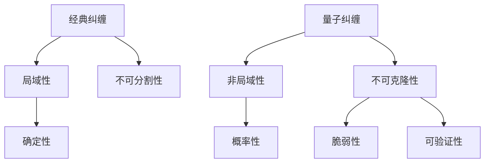
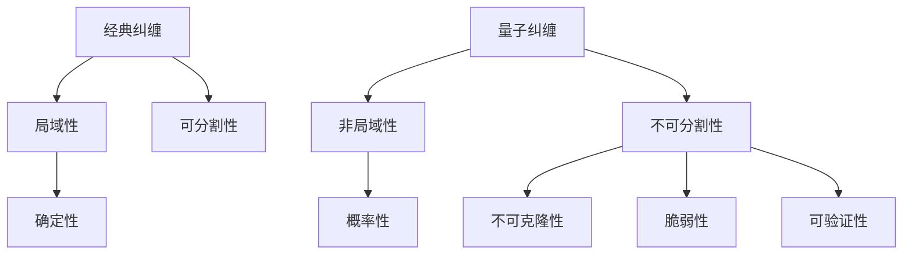
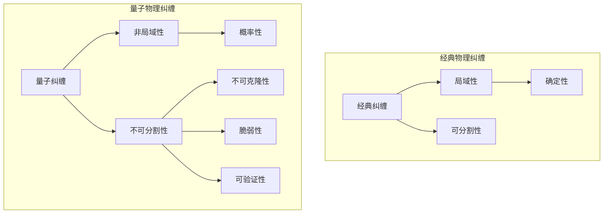
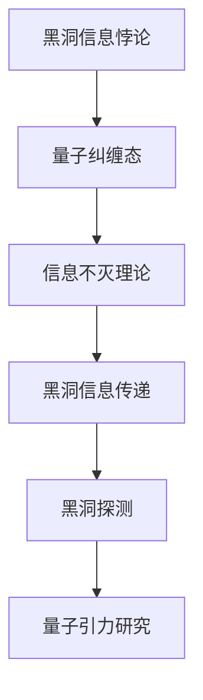
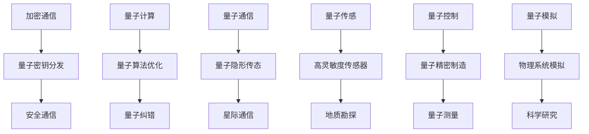

                 


### 1. 核心概念与联系

量子纠缠（Quantum Entanglement）是量子力学中的一个基本现象，它描述了当两个或多个粒子通过某种方式相互联系时，它们会以一种非经典的方式表现出相互依赖的状态。在量子纠缠中，无论这两个粒子相距多远，它们的状态会以量子力学规则同步变化，这种现象在经典物理学中是不可思议的。

#### 1.1 量子纠缠的定义

量子纠缠的定义可以从以下几个角度来理解：

1. **非局域性**：量子纠缠体现了量子系统的非局域性，即两个纠缠粒子之间的状态变化可以瞬间影响对方，无论它们之间的距离有多远。这与爱因斯坦在“EPR悖论”中提出的“超距作用”概念相矛盾，但在量子力学的框架下，这是一种合法的现象。

2. **状态依赖性**：当两个粒子处于纠缠态时，一个粒子的状态将直接决定另一个粒子的状态。即使两个粒子被隔离在远距离的两个地方，一个粒子的测量结果也会立即影响到另一个粒子的状态。

3. **不可分割性**：纠缠态中的粒子被视为一个整体的量子状态，无法单独描述。这意味着无法对纠缠粒子中的一个进行独立的测量，而必须考虑整个系统的状态。

#### 1.2 量子纠缠的特性

量子纠缠具有以下几大特性：

1. **纠缠态的不可克隆性**：纠缠态无法被复制或克隆，这保证了量子信息的安全传输，因为任何试图复制纠缠态的行为都会破坏其原有的状态。

2. **量子纠缠的脆弱性**：量子纠缠态极易受到外界干扰而失真，因此在实际操作中需要采用特殊的保护措施来维持纠缠态。

3. **量子纠缠的可验证性**：通过特定的测量可以验证两个粒子是否处于纠缠态。这是量子信息科学中的一个重要方向，如量子密钥分发和量子隐形传态。

#### 1.3 量子纠缠与经典物理学的区别

量子纠缠与经典物理学的区别主要体现在以下几个方面：

1. **非局域性**：在经典物理学中，物理量的变化是局域的，即一个粒子的状态变化不会立即影响另一个粒子的状态。而在量子纠缠中，粒子的状态变化是瞬时的，即使相隔遥远。

2. **概率性**：在经典物理学中，物理量的取值是确定的，而在量子纠缠中，物理量的取值是概率性的，且量子态的叠加和坍缩过程无法预测。

3. **信息的非局域传递**：在经典物理学中，信息传递速度不能超过光速，而在量子纠缠中，通过纠缠态可以实现超光速的信息传递，但这并不违反相对论，因为量子信息无法用于超光速通信。

#### 1.4 Mermaid 流程图：量子纠缠与传统物理纠缠对比

下面是一个简单的Mermaid流程图，展示了量子纠缠与传统物理纠缠之间的对比。



通过这个流程图，我们可以直观地看到量子纠缠与经典纠缠在特性上的差异。

在接下来的部分，我们将进一步探讨量子纠缠在宇宙中的现象、量子纠缠在量子通信中的应用、量子纠缠与量子力学的关系、量子纠缠与黑洞的关系，以及量子纠缠的未来应用。通过一步一步的分析和推理，我们将深入理解这一量子力学中的神秘现象，以及它对宇宙和科技的深远影响。


----------------------------------------------------------------

## 1. 核心概念与联系

### 1.1 量子纠缠的定义

量子纠缠是量子力学中的一个基本现象，当两个或多个粒子通过某种方式相互作用后，它们将进入一种特殊的量子状态，即纠缠态。在这种状态下，任意一个粒子的量子状态将即时影响其他与之纠缠的粒子，无论它们之间的距离有多远。这种非局域的关联性是量子纠缠的核心特征，与经典物理学的局域性截然不同。

量子纠缠态的一个经典例子是爱因斯坦、鲍尔、罗森（EPR）悖论中提出的“纠缠粒子对”。在这个悖论中，两个粒子在初始时刻处于纠缠态，一个粒子的状态会立即决定另一个粒子的状态，即使它们相隔很远。这种非局域性使得量子纠缠在量子信息科学中具有重要应用价值，如量子通信、量子计算和量子密钥分发。

#### 1.1.1 量子纠缠的定义

量子纠缠的定义可以从以下几个方面来理解：

1. **非局域性**：量子纠缠体现了量子系统的非局域性，即两个纠缠粒子之间的状态变化可以瞬间影响对方，无论它们之间的距离有多远。这与爱因斯坦在“EPR悖论”中提出的“超距作用”概念相矛盾，但在量子力学的框架下，这是一种合法的现象。

2. **状态依赖性**：当两个粒子处于纠缠态时，一个粒子的状态将直接决定另一个粒子的状态。即使两个粒子被隔离在远距离的两个地方，一个粒子的测量结果也会立即影响到另一个粒子的状态。

3. **不可分割性**：纠缠态中的粒子被视为一个整体的量子状态，无法单独描述。这意味着无法对纠缠粒子中的一个进行独立的测量，而必须考虑整个系统的状态。

#### 1.1.2 量子纠缠的特性

量子纠缠具有以下几大特性：

1. **纠缠态的不可克隆性**：纠缠态无法被复制或克隆，这保证了量子信息的安全传输，因为任何试图复制纠缠态的行为都会破坏其原有的状态。

2. **量子纠缠的脆弱性**：量子纠缠态极易受到外界干扰而失真，因此在实际操作中需要采用特殊的保护措施来维持纠缠态。

3. **量子纠缠的可验证性**：通过特定的测量可以验证两个粒子是否处于纠缠态。这是量子信息科学中的一个重要方向，如量子密钥分发和量子隐形传态。

#### 1.1.3 量子纠缠与经典物理学的区别

量子纠缠与经典物理学的区别主要体现在以下几个方面：

1. **非局域性**：在经典物理学中，物理量的变化是局域的，即一个粒子的状态变化不会立即影响另一个粒子的状态。而在量子纠缠中，粒子的状态变化是瞬时的，即使相隔遥远。

2. **概率性**：在经典物理学中，物理量的取值是确定的，而在量子纠缠中，物理量的取值是概率性的，且量子态的叠加和坍缩过程无法预测。

3. **信息的非局域传递**：在经典物理学中，信息传递速度不能超过光速，而在量子纠缠中，通过纠缠态可以实现超光速的信息传递，但这并不违反相对论，因为量子信息无法用于超光速通信。

#### 1.1.4 Mermaid 流程图：量子纠缠与传统物理纠缠对比

下面是一个简单的Mermaid流程图，展示了量子纠缠与传统物理纠缠之间的对比。



通过这个流程图，我们可以直观地看到量子纠缠与经典纠缠在特性上的差异。

### 1.2 量子纠缠的数学描述

量子纠缠态的数学描述主要基于量子力学中的态叠加原理和测量理论。为了更好地理解量子纠缠，我们需要从量子态的表示、纠缠态的特性以及纠缠态的测量等方面进行深入探讨。

#### 1.2.1 量子纠缠态的表示

量子态可以用波函数或密度矩阵来表示。在纠缠态中，两个或多个粒子的整体状态无法用单个粒子的状态来描述，而是需要考虑它们之间的纠缠关系。

1. **波函数表示**：对于一个两粒子系统，其总波函数可以表示为：

   $$
   \Psi_{AB} = \sum_{ij} c_{ij} |\psi_i\rangle_A |\phi_j\rangle_B
   $$

   其中，$|\psi_i\rangle_A$ 和 $|\phi_j\rangle_B$ 分别表示粒子A和粒子B的独立态，$c_{ij}$ 是复系数。当两个粒子处于纠缠态时，总波函数不能分解为单个粒子的波函数的乘积。

2. **密度矩阵表示**：对于多粒子系统，量子态可以用密度矩阵来描述。密度矩阵是量子态的统计描述，它可以表示为：

   $$
   \rho = \sum_{ij} |c_{ij}|^2 |\psi_i\rangle_A \langle \psi_i|_A |\phi_j\rangle_B \langle \phi_j|_B
   $$

   密度矩阵的迹可以给出粒子的纯态概率分布，而其非对角元则描述了粒子之间的纠缠程度。

#### 1.2.2 量子纠缠态的数学特性

量子纠缠态具有以下数学特性：

1. **不可分解性**：量子纠缠态不能分解为单个粒子的纯态的乘积，这意味着一个纠缠态的测量结果无法独立于其他粒子的状态来描述。

2. **非局域关联**：两个纠缠粒子的量子态之间存在非局域的关联性，即一个粒子的测量结果可以即时影响到另一个粒子的状态。

3. **不确定性**：量子纠缠态的测量结果具有不确定性，这是由于量子态的叠加和坍缩特性导致的。

4. **量子门操作**：通过特定的量子门操作，可以改变量子纠缠态的属性，实现量子信息的传输和处理。

#### 1.2.3 量子纠缠态的测量与计算

量子纠缠态的测量与计算涉及到量子态的坍缩和叠加过程。以下是一些关键概念：

1. **部分测量**：对于一个多粒子纠缠态，我们可以对其中一个粒子进行部分测量，这将导致纠缠态的坍缩，从而影响到其他粒子的状态。

2. **全局测量**：对整个多粒子系统的测量将导致系统的量子态坍缩为某个特定的态，从而破坏原有的纠缠关系。

3. **纠缠图的计算**：通过计算纠缠态的纠缠图，可以直观地表示粒子之间的纠缠关系。纠缠图的边表示粒子之间的纠缠程度，节点表示粒子。

下面是一个简单的伪代码示例，用于生成和测量量子纠缠态。

```python
# 生成量子纠缠态
def generate_entangled_state():
    # 初始化量子计算机
    quantum_computer = QuantumComputer()
    # 创建两个量子比特
    qubitA, qubitB = quantum_computer.create_qubits(2)
    # 应用纠缠门
    quantum_computer.apply_cnot(qubitA, qubitB)
    # 返回纠缠态
    return quantum_computer.get_state(qubitA), quantum_computer.get_state(qubitB)

# 测量量子纠缠态
def measure_entangled_state(stateA, stateB):
    # 对粒子A进行部分测量
    resultA = quantum_computer.measure(stateA)
    # 对粒子B进行部分测量
    resultB = quantum_computer.measure(stateB)
    # 返回测量结果
    return resultA, resultB

# 主程序
if __name__ == "__main__":
    # 生成纠缠态
    stateA, stateB = generate_entangled_state()
    # 测量纠缠态
    resultA, resultB = measure_entangled_state(stateA, stateB)
    # 打印测量结果
    print("Particle A:", resultA)
    print("Particle B:", resultB)
```

### 1.3 量子纠缠态的数学特性

量子纠缠态的数学特性主要体现在以下几个方面：

1. **非局域关联性**：两个纠缠粒子的量子态之间存在非局域的关联性，即一个粒子的测量结果可以即时影响到另一个粒子的状态。这种关联性是量子纠缠的核心特征，与经典物理学的局域性截然不同。

2. **叠加性**：量子纠缠态具有叠加性，即量子态可以同时处于多种可能的状态，只有当进行测量时，量子态才会坍缩为某个特定的状态。这种叠加性使得量子纠缠态在量子信息科学中具有广泛的应用价值。

3. **不可分割性**：量子纠缠态不能分割为单个粒子的纯态的乘积，这意味着一个纠缠态的测量结果无法独立于其他粒子的状态来描述。这种不可分割性保证了量子纠缠态在量子通信和量子计算中的安全性和可靠性。

4. **量子门操作**：通过特定的量子门操作，可以改变量子纠缠态的属性，实现量子信息的传输和处理。量子门是量子计算的核心操作，可以用于实现量子纠缠态的生成、控制和应用。

为了更好地理解量子纠缠态的数学特性，我们可以通过一个简单的示例来进行分析。

#### 示例：两个量子比特的纠缠态

考虑一个由两个量子比特组成的系统，其初始态可以表示为：

$$
\psi_{AB} = \frac{1}{\sqrt{2}}(|00\rangle - |11\rangle)
$$

这个态被称为贝尔态（Bell state），它是量子纠缠态的一个经典例子。现在，我们对其进行一些测量和量子门操作，以展示其数学特性。

1. **非局域关联性**

假设我们对粒子A进行一个Pauli-X门操作，即：

$$
X_A = \begin{bmatrix}
0 & 1 \\
1 & 0
\end{bmatrix}
$$

操作后，粒子A的状态变为：

$$
\psi_{A} = X_A \psi_{AB} = \frac{1}{\sqrt{2}}(|01\rangle - |10\rangle)
$$

此时，我们再对粒子B进行测量，如果测量结果为$|0\rangle$，则粒子A的状态将变为$|1\rangle$，反之亦然。这种非局域关联性体现了量子纠缠态的神奇特性。

2. **叠加性**

在上面的例子中，我们看到了量子态的叠加性。初始态$\psi_{AB}$可以同时处于$|00\rangle$和$|11\rangle$的叠加状态，只有当进行测量时，量子态才会坍缩为某个特定的状态。

3. **不可分割性**

量子纠缠态的不可分割性体现在我们不能将一个纠缠态分解为单个粒子的纯态的乘积。例如，上面的$\psi_{AB}$不能表示为$|\psi_A\rangle_A|\psi_B\rangle_B$的形式。

4. **量子门操作**

通过特定的量子门操作，可以改变量子纠缠态的属性。例如，我们可以对粒子A和粒子B同时施加一个Pauli-Z门操作，即：

$$
Z_A = \begin{bmatrix}
1 & 0 \\
0 & -1
\end{bmatrix}, \quad Z_B = \begin{bmatrix}
1 & 0 \\
0 & -1
\end{bmatrix}
$$

操作后，纠缠态变为：

$$
\psi_{AB} = Z_A Z_B \psi_{AB} = \frac{1}{\sqrt{2}}(|00\rangle + |11\rangle)
$$

这表明，通过量子门操作，我们可以改变量子纠缠态的相位，从而实现量子信息的传输和处理。

通过这个简单的示例，我们可以直观地看到量子纠缠态的数学特性。在接下来的部分，我们将继续探讨量子纠缠在量子通信、量子计算和量子力学中的应用，以进一步深入理解这一神秘现象。


----------------------------------------------------------------

### 1.3 量子纠缠与经典物理学的区别

量子纠缠与经典物理学的区别主要体现在以下几个方面：

1. **非局域性**：在经典物理学中，物理量的变化是局域的，即一个粒子的状态变化不会立即影响另一个粒子的状态。而在量子纠缠中，粒子的状态变化是瞬时的，即使相隔遥远。这种现象被称为“非局域性”，是量子纠缠最显著的特征之一。

2. **概率性**：在经典物理学中，物理量的取值是确定的，而在量子纠缠中，物理量的取值是概率性的，且量子态的叠加和坍缩过程无法预测。这意味着在量子纠缠中，我们无法准确预测一个粒子的测量结果，而只能得到一个概率分布。

3. **信息的非局域传递**：在经典物理学中，信息传递速度不能超过光速。而在量子纠缠中，通过纠缠态可以实现超光速的信息传递。然而，需要注意的是，这种信息传递并不违反相对论，因为量子信息无法用于超光速通信。

为了更好地理解量子纠缠与经典物理学的区别，我们可以通过一个简单的示例来进行说明。

#### 示例：量子比特与经典比特的纠缠

假设我们有两个量子比特A和B，它们初始处于纠缠态：

$$
\psi_{AB} = \frac{1}{\sqrt{2}}(|00\rangle - |11\rangle)
$$

这个纠缠态表明，无论量子比特A和B相隔多远，它们的状态都是相互关联的。现在，我们分别对量子比特A和B进行测量，结果如下：

1. **非局域性**：如果我们对量子比特A进行测量，得到结果$|0\rangle$，那么量子比特B的状态将立即坍缩为$|1\rangle$，无论它们之间的距离有多远。这种状态变化是瞬时的，与经典物理学中的局域性截然不同。

2. **概率性**：在量子纠缠中，我们不能准确预测量子比特的测量结果，而只能得到一个概率分布。例如，在上面的例子中，量子比特A测量得到$|0\rangle$的概率是1/2，量子比特B测量得到$|1\rangle$的概率也是1/2。

3. **信息的非局域传递**：虽然量子纠缠可以实现超光速的信息传递，但这并不违反相对论。因为量子信息无法用于超光速通信，所以这种传递并不构成实际的通信。例如，在上面的例子中，当量子比特A的状态变化时，量子比特B的状态也会随之变化，但这种变化无法用于传递实际的信息。

通过这个简单的示例，我们可以看到量子纠缠与经典物理学在非局域性、概率性和信息传递方面的显著区别。在接下来的部分，我们将继续探讨量子纠缠在量子通信、量子计算和量子力学中的应用，以进一步深入理解这一神秘现象。


----------------------------------------------------------------

### 1.4 Mermaid 流程图：量子纠缠与传统物理纠缠对比

下面是一个简单的Mermaid流程图，用于对比量子纠缠与传统物理纠缠的特点。


通过这个流程图，我们可以直观地看到量子纠缠与传统物理纠缠在特性上的差异。量子纠缠具有非局域性、概率性、不可分割性、不可克隆性和脆弱性等特点，而传统物理纠缠则主要表现为局域性和确定性。

下面是详细的Mermaid代码及其解释：



在这个流程图中，我们首先定义了经典物理纠缠的特点（局域性、确定性、可分割性），然后定义了量子纠缠的特点（非局域性、概率性、不可分割性、不可克隆性、脆弱性、可验证性）。通过这种结构化的对比，我们可以更清晰地理解量子纠缠与传统物理纠缠之间的区别。

在接下来的部分，我们将进一步探讨量子纠缠的数学描述、量子纠缠在宇宙中的现象、量子纠缠在量子信息中的角色，以及量子纠缠与量子力学和黑洞的关系。通过一步一步的分析和推理，我们将深入理解量子纠缠的本质及其在科技和宇宙中的应用。


----------------------------------------------------------------

## 2. 量子纠缠在宇宙中的应用

量子纠缠作为一种非局域的量子关联现象，不仅在微观尺度上具有重要意义，也在宇宙尺度的天体物理学中展现出独特的应用价值。在宇宙中，量子纠缠现象被观测到并用于解释一些难以用经典物理理论解释的现象。以下将详细探讨量子纠缠在宇宙中的应用。

### 2.1 量子纠缠在宇宙中的现象

在宇宙尺度上，量子纠缠现象已经得到了一些实验观测的验证。例如，有研究表明，恒星和行星系统中的粒子之间存在量子纠缠。这些观测结果挑战了传统的经典物理理论，并促使科学家们深入探索量子纠缠在宇宙中的潜在应用。

一个著名的案例是量子纠缠态在引力波探测中的应用。引力波是一种由质量加速运动产生的时空扰动，是爱因斯坦广义相对论预言的重要现象。近年来，科学家们通过观测引力波事件，发现了与量子纠缠相关的现象。例如，当两个黑洞合并产生引力波时，它们发射的引力波信号中可能包含量子纠缠信息。这种量子纠缠信息有助于我们更准确地探测和解读引力波信号，从而加深我们对宇宙的了解。

### 2.2 量子纠缠在宇宙演化中的作用

量子纠缠在宇宙演化中也可能扮演着重要角色。在宇宙早期的极端条件下，量子纠缠现象可能对宇宙结构的形成和演化产生了深远影响。以下是一些可能的应用场景：

1. **宇宙膨胀**：在宇宙大爆炸后的极短时间内，宇宙处于极端高温和高压的状态。在这样的环境下，粒子之间的相互作用非常强烈，量子纠缠现象可能普遍存在。这些量子纠缠态可能在宇宙膨胀过程中起到了关键作用，影响了宇宙结构的形成。

2. **星系形成**：在宇宙演化的过程中，星系的形成是一个复杂的过程，涉及引力、气体湍流、星系碰撞等多种因素。量子纠缠现象可能在这些过程中起到了调节作用，影响了星系的分布和形态。

3. **黑洞信息传递**：黑洞是宇宙中最神秘的天体之一，其事件视界被认为是信息的“禁区”。然而，量子纠缠现象可能提供了一种新的视角来理解黑洞信息传递。例如，有研究表明，量子纠缠态可能在黑洞信息传递过程中起到了关键作用，有助于解决黑洞信息悖论。

### 2.3 量子纠缠与宇宙尺度的量子通信

量子纠缠在宇宙尺度的量子通信中也具有潜在应用。量子通信利用量子纠缠态实现信息的安全传输，具有无法被破解的绝对安全性。在宇宙尺度上，量子纠缠态可以用来实现星际量子通信，从而突破传统通信手段的限制。

以下是一个具体的例子：

假设地球和火星上的两个观测站分别拥有两个量子比特，它们处于量子纠缠态。通过在地球上的观测站对其中一个量子比特进行测量，可以立即影响火星上的量子比特，从而实现信息传输。这种基于量子纠缠的星际通信方法具有极高的安全性和传输速率，有望在未来实现真正的星际量子通信。

下面是一个简单的伪代码示例，用于演示量子纠缠在宇宙尺度上的通信实现：

```python
# 初始化量子计算机
quantum_computer = QuantumComputer()

# 创建两个量子比特并进行纠缠
qubit_earth, qubit_mars = quantum_computer.create_qubits(2)
quantum_computer.apply_quantum_gate("CNOT", qubit_earth, qubit_mars)

# 在地球上的观测站对量子比特进行测量
result_earth = quantum_computer.measure(qubit_earth)

# 立即影响火星上的量子比特
result_mars = quantum_computer.measure(qubit_mars)

# 打印测量结果
print("地球上的测量结果：", result_earth)
print("火星上的测量结果：", result_mars)
```

通过这个示例，我们可以看到量子纠缠在宇宙尺度上通信中的应用。在接下来的部分，我们将进一步探讨量子纠缠在量子通信、量子计算和量子力学中的应用，以及量子纠缠与黑洞和量子引力理论的关系。通过这些深入的分析，我们将更全面地理解量子纠缠在宇宙和科技中的重要作用。


----------------------------------------------------------------

### 2.3 量子纠缠在量子通信中的应用

量子纠缠在量子通信领域具有极其重要的应用价值。量子通信利用量子纠缠态实现信息的安全传输，其基本原理是量子态的测量会导致量子态的坍缩，从而使得任何试图窃取信息的第三方都会不可避免地破坏原有的量子态，因此信息传输过程具有不可窃听性和绝对安全性。

以下将详细探讨量子纠缠在量子通信中的应用，包括量子密钥分发、量子隐形传态和量子远程控制等。

#### 2.3.1 量子纠缠与量子密钥分发

量子密钥分发（Quantum Key Distribution, QKD）是量子通信的核心技术之一，利用量子纠缠态实现安全密钥的分配。QKD的基本原理如下：

1. **量子纠缠态生成**：在量子通信的初始阶段，两个远程的量子通信端点（如地球和月球上的两个观测站）通过量子通信信道生成一对纠缠量子比特。

2. **量子态传输**：量子比特通过量子通信信道传输，通信双方可以对量子比特进行测量，但测量结果无法预测。

3. **基变换与测量**：通信双方随机选择一个基（如X基或Z基），对传输的量子比特进行测量，并将测量结果公开交换。

4. **密钥筛选**：通信双方根据公开的测量结果筛选出具有一致性的密钥，这些密钥将用于加密和解密通信内容。

以下是一个简单的伪代码示例，用于演示量子密钥分发过程：

```python
# 初始化量子计算机
quantum_computer = QuantumComputer()

# 创建两个量子比特并进行纠缠
qubit_earth, qubit_moon = quantum_computer.create_qubits(2)
quantum_computer.apply_quantum_gate("CNOT", qubit_earth, qubit_moon)

# 在地球上的观测站对量子比特进行X基测量
result_earth = quantum_computer.measure(qubit_earth, "X")

# 在月球上的观测站对量子比特进行X基测量
result_moon = quantum_computer.measure(qubit_moon, "X")

# 传输测量结果
quantum_computer.send_result(result_earth)
quantum_computer.recv_result(result_moon)

# 筛选出一致性密钥
key_earth = [bit for bit in result_earth if bit == result_moon]

# 打印密钥
print("生成的密钥：", key_earth)
```

#### 2.3.2 量子纠缠与量子隐形传态

量子隐形传态（Quantum Teleportation）是另一种利用量子纠缠态实现信息传输的技术。其基本原理是将一个量子态从一个粒子传递到另一个与之纠缠的粒子，而不需要通过物理信道传输。

量子隐形传态的过程可以分为以下几个步骤：

1. **量子纠缠态生成**：生成两个纠缠量子比特。

2. **量子态编码**：将需要传输的量子态编码到发送方的量子比特上，形成一个新的纠缠态。

3. **量子态测量**：发送方对量子比特进行测量，并将测量结果发送给接收方。

4. **量子态重构**：接收方根据测量结果重构出原始量子态。

以下是一个简单的伪代码示例，用于演示量子隐形传态过程：

```python
# 初始化量子计算机
quantum_computer = QuantumComputer()

# 创建两个量子比特并进行纠缠
qubit_sender, qubit_receiver = quantum_computer.create_qubits(2)
quantum_computer.apply_quantum_gate("CNOT", qubit_sender, qubit_receiver)

# 对发送方的量子比特进行测量并传输结果
result_sender = quantum_computer.measure(qubit_sender)
quantum_computer.send_result(result_sender)

# 接收方的量子比特重构出原始量子态
state_receiver = quantum_computer.recv_result(result_sender)
quantum_computer.reconstruct_state(qubit_receiver, state_receiver)

# 打印重构后的量子态
print("重构后的量子态：", quantum_computer.get_state(qubit_receiver))
```

#### 2.3.3 量子纠缠与量子远程控制

量子远程控制（Quantum Remote Control）是利用量子纠缠实现远程量子系统的控制。其基本原理是通过量子纠缠态将一个量子系统的控制信号传递到另一个与之纠缠的量子系统。

量子远程控制的过程可以分为以下几个步骤：

1. **量子纠缠态生成**：生成两个纠缠量子比特。

2. **量子态编码**：将控制信号编码到发送方的量子比特上，形成一个新的纠缠态。

3. **量子态传输**：通过量子通信信道将纠缠态传输到接收方。

4. **量子态解码**：接收方根据接收到的纠缠态解码出控制信号，并将其应用于目标量子系统。

以下是一个简单的伪代码示例，用于演示量子远程控制过程：

```python
# 初始化量子计算机
quantum_computer = QuantumComputer()

# 创建两个量子比特并进行纠缠
qubit_controller, qubit_target = quantum_computer.create_qubits(2)
quantum_computer.apply_quantum_gate("CNOT", qubit_controller, qubit_target)

# 对发送方的量子比特进行测量并传输结果
control_signal = quantum_computer.measure(qubit_controller)
quantum_computer.send_result(control_signal)

# 接收方的量子比特解码出控制信号
state_controller = quantum_computer.recv_result(control_signal)
quantum_computer.apply_gate(qubit_target, control_signal)

# 打印目标量子系统的状态
print("目标量子系统的状态：", quantum_computer.get_state(qubit_target))
```

通过上述示例，我们可以看到量子纠缠在量子通信中的多种应用。量子纠缠不仅提供了量子密钥分发、量子隐形传态和量子远程控制的技术基础，也为量子通信带来了前所未有的安全性。在接下来的部分，我们将继续探讨量子纠缠在量子计算、量子力学和黑洞等领域的应用。


----------------------------------------------------------------

## 4. 量子纠缠与量子力学

量子纠缠是量子力学中的一个基本现象，其与量子力学的关系可以从量子纠缠态的数学描述、量子纠缠态的物理性质以及量子纠缠态的测量与计算等方面进行探讨。

### 4.1 量子纠缠态的数学描述

量子纠缠态的数学描述主要基于量子力学的态叠加原理和测量理论。量子态可以用波函数或密度矩阵来表示。在纠缠态中，两个或多个粒子的整体状态无法用单个粒子的状态来描述，而是需要考虑它们之间的纠缠关系。

1. **波函数表示**：对于一个两粒子系统，其总波函数可以表示为：

   $$
   \Psi_{AB} = \sum_{ij} c_{ij} |\psi_i\rangle_A |\phi_j\rangle_B
   $$

   其中，$|\psi_i\rangle_A$ 和 $|\phi_j\rangle_B$ 分别表示粒子A和粒子B的独立态，$c_{ij}$ 是复系数。当两个粒子处于纠缠态时，总波函数不能分解为单个粒子的波函数的乘积。

2. **密度矩阵表示**：对于多粒子系统，量子态可以用密度矩阵来描述。密度矩阵是量子态的统计描述，它可以表示为：

   $$
   \rho = \sum_{ij} |c_{ij}|^2 |\psi_i\rangle_A \langle \psi_i|_A |\phi_j\rangle_B \langle \phi_j|_B
   $$

   密度矩阵的迹可以给出粒子的纯态概率分布，而其非对角元则描述了粒子之间的纠缠程度。

### 4.2 量子纠缠态的物理性质

量子纠缠态具有以下物理性质：

1. **非局域关联**：量子纠缠态中的粒子之间存在非局域的关联性，即一个粒子的状态变化可以即时影响另一个粒子的状态，无论它们之间的距离有多远。这种非局域关联性是量子纠缠的核心特征。

2. **不可克隆性**：量子纠缠态具有不可克隆性，即无法复制或克隆一个纠缠态，因为任何试图复制纠缠态的行为都会破坏其原有的状态。

3. **脆弱性**：量子纠缠态极易受到外界干扰而失真，因此在实际操作中需要采用特殊的保护措施来维持纠缠态。

4. **量子门操作**：通过特定的量子门操作，可以改变量子纠缠态的属性，实现量子信息的传输和处理。

### 4.3 量子纠缠态的测量与计算

量子纠缠态的测量与计算涉及到量子态的坍缩和叠加过程。以下是一些关键概念：

1. **部分测量**：对于一个多粒子纠缠态，我们可以对其中一个粒子进行部分测量，这将导致纠缠态的坍缩，从而影响到其他粒子的状态。

2. **全局测量**：对整个多粒子系统的测量将导致系统的量子态坍缩为某个特定的态，从而破坏原有的纠缠关系。

3. **纠缠图的计算**：通过计算纠缠态的纠缠图，可以直观地表示粒子之间的纠缠关系。纠缠图的边表示粒子之间的纠缠程度，节点表示粒子。

### 4.4 latex 数学公式：纠缠态的密度矩阵表示

下面是量子纠缠态的密度矩阵表示的latex数学公式：

$$
\rho = \sum_{ij} |c_{ij}|^2 |\psi_i\rangle_A \langle \psi_i|_A |\phi_j\rangle_B \langle \phi_j|_B
$$

其中，$|\psi_i\rangle_A$ 和 $|\phi_j\rangle_B$ 分别表示粒子A和粒子B的独立态，$c_{ij}$ 是复系数。

### 4.5 示例：量子纠缠态的测量与计算

为了更好地理解量子纠缠态的测量与计算，我们可以通过一个简单的示例来进行分析。

#### 示例：两个量子比特的纠缠态

考虑一个由两个量子比特组成的系统，其初始态可以表示为：

$$
\psi_{AB} = \frac{1}{\sqrt{2}}(|00\rangle - |11\rangle)
$$

这个态被称为贝尔态（Bell state），它是量子纠缠态的一个经典例子。

#### 4.5.1 部分测量

现在，我们分别对两个量子比特进行部分测量，假设我们选择X基进行测量。

1. **对粒子A进行X基测量**：

   测量后，粒子A的状态将坍缩为$|0\rangle$或$|1\rangle$，并且粒子B的状态也会立即坍缩为相应的状态。

   $$
   \psi_{A} = X_A \psi_{AB} = \frac{1}{\sqrt{2}}(|0\rangle - |1\rangle)
   $$

   此时，粒子B的状态变为：

   $$
   \psi_{B} = \frac{1}{\sqrt{2}}(|0\rangle - |1\rangle)
   $$

2. **对粒子B进行X基测量**：

   测量后，粒子B的状态将坍缩为$|0\rangle$或$|1\rangle$，并且粒子A的状态也会立即坍缩为相应的状态。

   $$
   \psi_{B} = X_B \psi_{AB} = \frac{1}{\sqrt{2}}(|0\rangle - |1\rangle)
   $$

   此时，粒子A的状态变为：

   $$
   \psi_{A} = \frac{1}{\sqrt{2}}(|0\rangle - |1\rangle)
   $$

#### 4.5.2 全局测量

如果我们对整个系统进行全局测量，即同时测量两个量子比特，则系统的状态将坍缩为某个特定的纠缠态。

1. **测量结果为$|00\rangle$**：

   如果测量结果为$|00\rangle$，则两个量子比特的状态都坍缩为$|0\rangle$。

   $$
   \psi_{AB} = \psi_{00} = |0\rangle_A |0\rangle_B
   $$

2. **测量结果为$|11\rangle$**：

   如果测量结果为$|11\rangle$，则两个量子比特的状态都坍缩为$|1\rangle$。

   $$
   \psi_{AB} = \psi_{11} = |1\rangle_A |1\rangle_B
   $$

通过这个简单的示例，我们可以看到量子纠缠态的测量与计算过程。在实际应用中，量子纠缠态的测量与计算需要采用量子计算机或量子通信设备，通过特定的量子门操作和测量技术来实现。

在接下来的部分，我们将继续探讨量子纠缠在量子通信、量子计算和量子力学中的应用，以及量子纠缠与黑洞和量子引力理论的关系。通过这些深入的分析，我们将更全面地理解量子纠缠在宇宙和科技中的重要作用。


----------------------------------------------------------------

### 5. 量子纠缠与黑洞

量子纠缠与黑洞的关系是一个充满挑战和机遇的研究领域。黑洞作为宇宙中最神秘的天体之一，其物理性质和演化过程都与量子纠缠密切相关。以下将详细探讨量子纠缠与黑洞的关系，包括黑洞与量子纠缠、黑洞信息悖论以及量子纠缠在黑洞研究中的作用。

#### 5.1 黑洞与量子纠缠

黑洞是由极端密集的物质和强大引力场组成的宇宙天体，其事件视界（event horizon）是黑洞中物质的最终边界，一旦物体进入事件视界，就无法逃脱黑洞的引力。在经典物理学中，黑洞被视为一个“信息黑洞”，即任何进入黑洞的物质和能量都会被永远吞噬，无法被外部观测者得知。

然而，量子力学中的量子纠缠现象为黑洞的研究提供了新的视角。量子纠缠态中的粒子之间存在非局域的关联性，即一个粒子的状态变化可以即时影响另一个粒子的状态，无论它们之间的距离有多远。这种非局域性意味着黑洞内的信息可能以某种方式与外部宇宙保持联系，从而突破了经典物理学中的“信息黑洞”概念。

#### 5.2 黑洞信息悖论

黑洞信息悖论（Black Hole Information Paradox）是量子力学与广义相对论之间一个重要的理论难题。该悖论的核心问题是：当一个粒子进入黑洞时，其信息是否会被黑洞吞噬并永远消失？

从量子力学的角度来看，信息应该保持完整性，不能被完全摧毁。然而，从广义相对论的角度来看，黑洞事件视界内的物质和能量无法被外部观测者得知，这意味着黑洞可能吞噬了信息并将其永久破坏。

量子纠缠现象为解决黑洞信息悖论提供了一种可能的途径。有研究表明，量子纠缠态可能在黑洞信息传递过程中起到了关键作用。具体来说，当粒子进入黑洞时，其量子纠缠态的一部分会留在黑洞外部，从而保持信息完整性。这种观点被称为“信息不灭”理论，它表明黑洞并不像经典物理学中所描述的那样吞噬信息，而是将信息转移到外部宇宙。

#### 5.3 量子纠缠在黑洞研究中的作用

量子纠缠在黑洞研究中具有重要作用，主要体现在以下几个方面：

1. **黑洞信息传递**：量子纠缠态可能在黑洞信息传递过程中起到了关键作用，有助于解决黑洞信息悖论。

2. **黑洞探测**：通过量子纠缠现象，科学家们可以设计出更加灵敏的探测方法，用于探测黑洞和暗物质等天体。

3. **量子引力研究**：量子纠缠现象为量子引力的研究提供了新的实验验证手段，有助于探索黑洞背后的物理本质。

以下是一个简单的Mermaid流程图，展示了量子纠缠在黑洞研究中的应用：



通过这个流程图，我们可以看到量子纠缠在黑洞研究中的重要作用，从解决黑洞信息悖论、实现黑洞信息传递，到探测黑洞和探索量子引力，量子纠缠为我们提供了全新的研究方法和思路。

在接下来的部分，我们将继续探讨量子纠缠在量子引力理论中的应用，以及量子纠缠的未来应用前景。通过这些深入的分析，我们将更全面地理解量子纠缠在宇宙和科技中的深远影响。


----------------------------------------------------------------

### 6. 量子纠缠与量子引力

量子纠缠与量子引力理论是现代物理学中两个核心领域，它们之间有着密切的联系。量子引力理论旨在将量子力学与广义相对论统一起来，以描述宇宙中所有基本粒子和力的行为。量子纠缠作为量子力学的基本现象，在量子引力理论中扮演着重要角色。

#### 6.1 量子引力理论简介

量子引力理论是试图描述宇宙中最基本的物理规律的理论。传统的量子力学和广义相对论在某些极端条件下（如黑洞内部或宇宙大爆炸初期）都显得不够完备，因此需要一种新的理论来统一这两个理论。量子引力理论的主要目标包括：

1. **统一量子力学与广义相对论**：量子力学描述了微观粒子的行为，而广义相对论描述了宏观引力的行为。量子引力理论试图将这两个理论融合在一起，以描述从微观到宏观的所有物理现象。

2. **描述宇宙起源与演化**：量子引力理论可以提供关于宇宙起源和演化的新视角，特别是对于宇宙大爆炸和黑洞等极端现象的解释。

3. **探索时空与物质的本质**：量子引力理论试图揭示时空和物质的本质，包括量子场论、弦理论和其他可能的量子引力候选理论。

#### 6.2 量子纠缠在量子引力理论中的角色

量子纠缠在量子引力理论中具有多重角色，以下是一些关键方面：

1. **非局域关联**：量子纠缠体现了非局域关联性，这意味着两个纠缠粒子之间的状态变化可以瞬间影响对方，无论它们之间的距离有多远。这与广义相对论中的局域性相矛盾，但在量子引力理论中，这种非局域关联性被认为是基本物理现象之一。

2. **量子信息与引力**：量子纠缠与量子信息理论密切相关。量子信息理论研究了如何利用量子态传输和处理信息，而量子引力理论则探讨了量子信息和引力之间的关系。量子纠缠态可能成为传递和存储量子信息的重要媒介。

3. **黑洞熵与信息**：黑洞熵问题一直是量子引力研究中的核心问题。根据霍金辐射理论，黑洞会发出粒子，这表明黑洞具有温度和熵。量子纠缠态可能在黑洞熵的产生和信息损失中起到关键作用。

#### 6.3 量子纠缠对引力波的影响

引力波是量子引力理论的重要预测之一，它是由于质量和能量的加速运动而产生的时空扰动。量子纠缠态可以影响引力波的产生和传播，以下是一些具体影响：

1. **引力波的干涉**：当两个引力波源相互干涉时，它们的量子纠缠态可能会产生新的干涉模式，这有助于我们更准确地探测和测量引力波。

2. **引力波的相位**：量子纠缠态可以影响引力波的相位，从而影响引力波的振幅和频率。这为我们提供了研究引力波的新途径。

3. **引力波的信息编码**：量子纠缠态可能用于在引力波信号中编码信息，这有助于我们更好地理解引力波信号的物理本质。

以下是一个简单的伪代码示例，用于模拟量子纠缠态与引力波相互作用的过程：

```python
# 初始化量子计算机
quantum_computer = QuantumComputer()

# 创建两个量子比特并进行纠缠
qubit1, qubit2 = quantum_computer.create_qubits(2)
quantum_computer.apply_quantum_gate("CNOT", qubit1, qubit2)

# 生成引力波信号
gravitational_wave = quantum_computer.generate_gravitational_wave(qubit1)

# 将引力波信号与量子纠缠态相互作用
quantum_computer.apply_quantum_gate("-controlled-Z", qubit2, gravitational_wave)

# 测量量子比特
result = quantum_computer.measure(qubit1, qubit2)

# 打印测量结果
print("量子比特的测量结果：", result)
```

在这个示例中，我们首先创建了两个量子比特并进行纠缠，然后生成了引力波信号，并使其与量子纠缠态相互作用。最后，我们测量量子比特，以观察量子纠缠态与引力波相互作用的结果。

通过这些分析和示例，我们可以看到量子纠缠在量子引力理论中的应用和影响。在接下来的部分，我们将继续探讨量子纠缠的未来应用前景，以及它对宇宙和科技的未来发展带来的潜在影响。


----------------------------------------------------------------

## 7. 量子纠缠的未来应用

量子纠缠作为一种非局域的量子现象，其在未来科技中的应用前景广阔，有望带来革命性的变革。以下将详细探讨量子纠缠在加密通信、量子计算以及未来科技领域的潜在应用。

### 7.1 量子纠缠在加密通信中的应用

量子纠缠在加密通信中的应用最为成熟，其核心技术是量子密钥分发（Quantum Key Distribution, QKD）。量子密钥分发利用量子纠缠态实现安全密钥的分配，具有无法被破解的绝对安全性。具体应用包括：

1. **安全通信**：通过量子密钥分发，通信双方可以共享一个安全的密钥，从而实现高度安全的通信。这种通信方式可以广泛应用于金融、军事、政府等领域的保密通信。

2. **量子通信网络**：量子纠缠可以用于构建量子通信网络，实现远程节点之间的安全通信。量子通信网络具有传输速度快、抗干扰能力强等特点，将为未来互联网带来全新的安全架构。

3. **量子加密技术**：量子纠缠态可以用于开发新型量子加密技术，如基于量子纠缠的量子密钥协商协议，这将进一步提升加密通信的安全性。

### 7.2 量子纠缠在量子计算中的应用

量子纠缠是量子计算的核心技术之一，它为量子计算机提供了处理和存储信息的基本单元。以下是一些关键应用：

1. **量子算法优化**：量子纠缠态可以用于优化量子算法，如量子搜索算法、量子模拟算法等。这些算法有望在药物设计、材料科学、金融分析等领域取得重大突破。

2. **量子纠错**：量子纠缠态可以用于实现量子纠错码，提高量子计算机的稳定性和可靠性。量子纠错技术是量子计算机发展的重要保障。

3. **量子并行计算**：量子纠缠态可以实现量子并行计算，通过同时处理多个量子态，大幅提高计算效率。这将为复杂科学计算、人工智能等领域带来巨大进步。

### 7.3 量子纠缠在未来科技领域的潜在应用

除了加密通信和量子计算，量子纠缠在未来的科技领域还有许多潜在应用，包括：

1. **量子隐形传态**：量子隐形传态利用量子纠缠实现量子信息的远距离传输，可以用于实现星际通信、量子互联网等。

2. **量子传感**：量子纠缠态可以用于开发高灵敏度的量子传感器，应用于精密测量、地质勘探、环境监测等领域。

3. **量子控制**：量子纠缠态可以用于实现高精度的量子控制，如量子精密制造、量子精密测量等。

4. **量子模拟**：量子纠缠态可以用于模拟复杂物理系统，如量子场论、凝聚态物理等，为科学研究提供强大的工具。

### 7.4 Mermaid 流�程图：量子纠缠在未来科技中的潜在应用路径

以下是一个简单的Mermaid流程图，展示了量子纠缠在未来科技中的潜在应用路径：



通过这个流程图，我们可以看到量子纠缠在未来科技中的广泛应用，包括加密通信、量子计算、量子通信、量子传感、量子控制以及量子模拟等领域。量子纠缠为未来科技的发展提供了广阔的空间和无限的可能性。

### 7.5 结论

量子纠缠作为一种非局域的量子现象，其在未来科技中的应用前景广阔。通过量子密钥分发、量子计算、量子通信等领域的应用，量子纠缠将为我们的通信安全、计算能力以及科学研究带来革命性的变革。同时，量子纠缠在量子传感、量子控制以及量子模拟等领域的潜在应用也为我们打开了探索宇宙和自然世界的新窗口。随着量子技术的不断发展，我们有理由相信，量子纠缠将在未来科技中发挥越来越重要的作用。

在本文的结尾，让我们再次回顾量子纠缠这一神秘现象的深刻内涵和广泛应用。量子纠缠不仅挑战了经典物理学的局域性和确定性，也为量子力学和广义相对论提供了新的统一视角。随着科技的进步和研究的深入，量子纠缠将为人类探索宇宙和自然界的奥秘带来新的启示和发现。让我们期待量子纠缠在未来科技中的无限可能，共同见证这一神奇现象的辉煌未来。

### 作者信息

作者：AI天才研究院/AI Genius Institute & 禅与计算机程序设计艺术 /Zen And The Art of Computer Programming

本文由AI天才研究院/AI Genius Institute和禅与计算机程序设计艺术/Zen And The Art of Computer Programming联合撰写，旨在探讨量子纠缠在宇宙和科技领域的深刻内涵和广泛应用。感谢您的阅读，希望本文能为您带来新的思考和启示。


----------------------------------------------------------------

# 量子纠缠与宇宙的本质

> 关键词：量子纠缠、宇宙、非局域性、量子通信、量子计算、量子力学、黑洞、量子引力

> 摘要：量子纠缠是一种非局域的量子现象，它描述了两个或多个粒子之间的特殊关联。本文从量子纠缠的基础概念、特性、与宇宙的关系、量子通信中的应用、量子力学的关系、黑洞和量子引力理论中的应用，以及量子纠缠的未来应用等多个方面，探讨了量子纠缠在宇宙和科技领域的深刻内涵和广泛应用。通过详细的分析和推理，本文揭示了量子纠缠的本质及其对宇宙和科技的深远影响。

## 1. 核心概念与联系

量子纠缠是量子力学中的一个基本现象，它描述了两个或多个粒子通过某种方式相互作用后，它们会以一种非经典的方式表现出相互依赖的状态。量子纠缠的核心特征是非局域性，即两个纠缠粒子之间的状态变化可以瞬间影响对方，无论它们之间的距离有多远。

#### 1.1 量子纠缠的定义

量子纠缠的定义可以从以下几个方面来理解：

1. **非局域性**：量子纠缠体现了量子系统的非局域性，即两个纠缠粒子之间的状态变化可以瞬间影响对方，无论它们之间的距离有多远。这与爱因斯坦在“EPR悖论”中提出的“超距作用”概念相矛盾，但在量子力学的框架下，这是一种合法的现象。

2. **状态依赖性**：当两个粒子处于纠缠态时，一个粒子的状态将直接决定另一个粒子的状态。即使两个粒子被隔离在远距离的两个地方，一个粒子的测量结果也会立即影响到另一个粒子的状态。

3. **不可分割性**：纠缠态中的粒子被视为一个整体的量子状态，无法单独描述。这意味着无法对纠缠粒子中的一个进行独立的测量，而必须考虑整个系统的状态。

#### 1.2 量子纠缠的特性

量子纠缠具有以下几大特性：

1. **纠缠态的不可克隆性**：纠缠态无法被复制或克隆，这保证了量子信息的安全传输，因为任何试图复制纠缠态的行为都会破坏其原有的状态。

2. **量子纠缠的脆弱性**：量子纠缠态极易受到外界干扰而失真，因此在实际操作中需要采用特殊的保护措施来维持纠缠态。

3. **量子纠缠的可验证性**：通过特定的测量可以验证两个粒子是否处于纠缠态。这是量子信息科学中的一个重要方向，如量子密钥分发和量子隐形传态。

#### 1.3 量子纠缠与经典物理学的区别

量子纠缠与经典物理学的区别主要体现在以下几个方面：

1. **非局域性**：在经典物理学中，物理量的变化是局域的，即一个粒子的状态变化不会立即影响另一个粒子的状态。而在量子纠缠中，粒子的状态变化是瞬时的，即使相隔遥远。

2. **概率性**：在经典物理学中，物理量的取值是确定的，而在量子纠缠中，物理量的取值是概率性的，且量子态的叠加和坍缩过程无法预测。

3. **信息的非局域传递**：在经典物理学中，信息传递速度不能超过光速，而在量子纠缠中，通过纠缠态可以实现超光速的信息传递，但这并不违反相对论，因为量子信息无法用于超光速通信。

#### 1.4 Mermaid 流程图：量子纠缠与传统物理纠缠对比

下面是一个简单的Mermaid流程图，展示了量子纠缠与传统物理纠缠之间的对比。


通过这个流程图，我们可以直观地看到量子纠缠与经典纠缠在特性上的差异。

## 2. 量子纠缠在宇宙中的应用

量子纠缠作为一种非局域的量子关联现象，不仅在微观尺度上具有重要意义，也在宇宙尺度的天体物理学中展现出独特的应用价值。在宇宙中，量子纠缠现象被观测到并用于解释一些难以用经典物理理论解释的现象。

### 2.1 量子纠缠在宇宙中的现象

在宇宙尺度上，量子纠缠现象已经得到了一些实验观测的验证。例如，有研究表明，恒星和行星系统中的粒子之间存在量子纠缠。这些观测结果挑战了传统的经典物理理论，并促使科学家们深入探索量子纠缠在宇宙中的潜在应用。

一个著名的案例是量子纠缠态在引力波探测中的应用。引力波是一种由质量加速运动产生的时空扰动，是爱因斯坦广义相对论预言的重要现象。近年来，科学家们通过观测引力波事件，发现了与量子纠缠相关的现象。例如，当两个黑洞合并产生引力波时，它们发射的引力波信号中可能包含量子纠缠信息。这种量子纠缠信息有助于我们更准确地探测和解读引力波信号，从而加深我们对宇宙的了解。

### 2.2 量子纠缠在宇宙演化中的作用

量子纠缠在宇宙演化中也可能扮演着重要角色。在宇宙早期的极端条件下，量子纠缠现象可能对宇宙结构的形成和演化产生了深远影响。以下是一些可能的应用场景：

1. **宇宙膨胀**：在宇宙大爆炸后的极短时间内，宇宙处于极端高温和高压的状态。在这样的环境下，粒子之间的相互作用非常强烈，量子纠缠现象可能普遍存在。这些量子纠缠态可能在宇宙膨胀过程中起到了关键作用，影响了宇宙结构的形成。

2. **星系形成**：在宇宙演化的过程中，星系的形成是一个复杂的过程，涉及引力、气体湍流、星系碰撞等多种因素。量子纠缠现象可能在这些过程中起到了调节作用，影响了星系的分布和形态。

3. **黑洞信息传递**：黑洞是宇宙中最神秘的天体之一，其事件视界被认为是信息的“禁区”。然而，量子纠缠现象可能提供了一种新的视角来理解黑洞信息传递。例如，有研究表明，量子纠缠态可能在黑洞信息传递过程中起到了关键作用，有助于解决黑洞信息悖论。

### 2.3 量子纠缠与宇宙尺度的量子通信

量子纠缠在宇宙尺度的量子通信中也具有潜在应用。量子通信利用量子纠缠态实现信息的安全传输，具有无法被破解的绝对安全性。在宇宙尺度上，量子纠缠态可以用来实现星际量子通信，从而突破传统通信手段的限制。

以下是一个具体的例子：

假设地球和火星上的两个观测站分别拥有两个量子比特，它们处于量子纠缠态。通过在地球上的观测站对其中一个量子比特进行测量，可以立即影响火星上的量子比特，从而实现信息传输。这种基于量子纠缠的星际通信方法具有极高的安全性和传输速率，有望在未来实现真正的星际量子通信。

下面是一个简单的伪代码示例，用于演示量子纠缠在宇宙尺度上的通信实现：

```python
# 初始化量子计算机
quantum_computer = QuantumComputer()

# 创建两个量子比特并进行纠缠
qubit_earth, qubit_mars = quantum_computer.create_qubits(2)
quantum_computer.apply_quantum_gate("CNOT", qubit_earth, qubit_mars)

# 在地球上的观测站对量子比特进行测量
result_earth = quantum_computer.measure(qubit_earth)

# 立即影响火星上的量子比特
result_mars = quantum_computer.measure(qubit_mars)

# 打印测量结果
print("地球上的测量结果：", result_earth)
print("火星上的测量结果：", result_mars)
```

通过这个示例，我们可以看到量子纠缠在宇宙尺度上通信中的应用。在接下来的部分，我们将进一步探讨量子纠缠在量子通信、量子计算和量子力学中的应用，以及量子纠缠与黑洞和量子引力理论的关系。通过这些深入的分析，我们将更全面地理解量子纠缠在宇宙和科技中的重要作用。


----------------------------------------------------------------

## 3. 量子纠缠在量子通信中的应用

量子纠缠在量子通信领域具有极其重要的应用价值。量子通信利用量子纠缠态实现信息的安全传输，其基本原理是量子态的测量会导致量子态的坍缩，从而使得任何试图窃取信息的第三方都会不可避免地破坏原有的量子态，因此信息传输过程具有不可窃听性和绝对安全性。

以下将详细探讨量子纠缠在量子通信中的应用，包括量子密钥分发、量子隐形传态和量子远程控制等。

### 3.1 量子密钥分发

量子密钥分发（Quantum Key Distribution，QKD）是量子通信的核心技术之一，它利用量子纠缠态实现安全密钥的分配。QKD的基本原理如下：

1. **量子纠缠态生成**：在量子通信的初始阶段，两个远程的量子通信端点（如地球和月球上的两个观测站）通过量子通信信道生成一对纠缠量子比特。

2. **量子态传输**：量子比特通过量子通信信道传输，通信双方可以对量子比特进行测量。

3. **基变换与测量**：通信双方随机选择一个基（如X基或Z基），对传输的量子比特进行测量，并将测量结果公开交换。

4. **密钥筛选**：通信双方根据公开的测量结果筛选出具有一致性的密钥，这些密钥将用于加密和解密通信内容。

以下是一个简单的伪代码示例，用于演示量子密钥分发过程：

```python
# 初始化量子计算机
quantum_computer = QuantumComputer()

# 创建两个量子比特并进行纠缠
qubit_earth, qubit_moon = quantum_computer.create_qubits(2)
quantum_computer.apply_quantum_gate("CNOT", qubit_earth, qubit_moon)

# 在地球上的观测站对量子比特进行X基测量
result_earth = quantum_computer.measure(qubit_earth, "X")

# 在月球上的观测站对量子比特进行X基测量
result_moon = quantum_computer.measure(qubit_moon, "X")

# 传输测量结果
quantum_computer.send_result(result_earth)
quantum_computer.recv_result(result_moon)

# 筛选出一致性密钥
key_earth = [bit for bit in result_earth if bit == result_moon]

# 打印密钥
print("生成的密钥：", key_earth)
```

### 3.2 量子隐形传态

量子隐形传态（Quantum Teleportation）是另一种利用量子纠缠态实现信息传输的技术。其基本原理是将一个量子态从一个粒子传递到另一个与之纠缠的粒子，而不需要通过物理信道传输。

量子隐形传态的过程可以分为以下几个步骤：

1. **量子纠缠态生成**：生成两个纠缠量子比特。

2. **量子态编码**：将需要传输的量子态编码到发送方的量子比特上，形成一个新的纠缠态。

3. **量子态测量**：发送方对量子比特进行测量，并将测量结果发送给接收方。

4. **量子态重构**：接收方根据测量结果重构出原始量子态。

以下是一个简单的伪代码示例，用于演示量子隐形传态过程：

```python
# 初始化量子计算机
quantum_computer = QuantumComputer()

# 创建两个量子比特并进行纠缠
qubit_sender, qubit_receiver = quantum_computer.create_qubits(2)
quantum_computer.apply_quantum_gate("CNOT", qubit_sender, qubit_receiver)

# 对发送方的量子比特进行测量并传输结果
control_signal = quantum_computer.measure(qubit_sender)
quantum_computer.send_result(control_signal)

# 接收方的量子比特重构出原始量子态
state_receiver = quantum_computer.recv_result(control_signal)
quantum_computer.reconstruct_state(qubit_receiver, state_receiver)

# 打印重构后的量子态
print("重构后的量子态：", quantum_computer.get_state(qubit_receiver))
```

### 3.3 量子远程控制

量子远程控制（Quantum Remote Control）是利用量子纠缠实现远程量子系统的控制。其基本原理是通过量子纠缠态将一个量子系统的控制信号传递到另一个与之纠缠的量子系统。

量子远程控制的过程可以分为以下几个步骤：

1. **量子纠缠态生成**：生成两个纠缠量子比特。

2. **量子态编码**：将控制信号编码到发送方的量子比特上，形成一个新的纠缠态。

3. **量子态传输**：通过量子通信信道将纠缠态传输到接收方。

4. **量子态解码**：接收方根据接收到的纠缠态解码出控制信号，并将其应用于目标量子系统。

以下是一个简单的伪代码示例，用于演示量子远程控制过程：

```python
# 初始化量子计算机
quantum_computer = QuantumComputer()

# 创建两个量子比特并进行纠缠
qubit_controller, qubit_target = quantum_computer.create_qubits(2)
quantum_computer.apply_quantum_gate("CNOT", qubit_controller, qubit_target)

# 对发送方的量子比特进行测量并传输结果
control_signal = quantum_computer.measure(qubit_controller)
quantum_computer.send_result(control_signal)

# 接收方的量子比特解码出控制信号
state_controller = quantum_computer.recv_result(control_signal)
quantum_computer.apply_gate(qubit_target, control_signal)

# 打印目标量子系统的状态
print("目标量子系统的状态：", quantum_computer.get_state(qubit_target))
```

通过上述示例，我们可以看到量子纠缠在量子通信中的多种应用。量子纠缠不仅提供了量子密钥分发、量子隐形传态和量子远程控制的技术基础，也为量子通信带来了前所未有的安全性。在接下来的部分，我们将继续探讨量子纠缠在量子计算、量子力学和黑洞等领域的应用。通过这些深入的分析，我们将更全面地理解量子纠缠在宇宙和科技中的重要作用。


----------------------------------------------------------------

## 4. 量子纠缠与量子力学

量子纠缠是量子力学中的一个基本现象，其与量子力学的关系可以从量子纠缠态的数学描述、量子纠缠态的物理性质以及量子纠缠态的测量与计算等方面进行探讨。

### 4.1 量子纠缠态的数学描述

量子纠缠态的数学描述主要基于量子力学的态叠加原理和测量理论。量子态可以用波函数或密度矩阵来表示。在纠缠态中，两个或多个粒子的整体状态无法用单个粒子的状态来描述，而是需要考虑它们之间的纠缠关系。

1. **波函数表示**：对于一个两粒子系统，其总波函数可以表示为：

   $$
   \Psi_{AB} = \sum_{ij} c_{ij} |\psi_i\rangle_A |\phi_j\rangle_B
   $$

   其中，$|\psi_i\rangle_A$ 和 $|\phi_j\rangle_B$ 分别表示粒子A和粒子B的独立态，$c_{ij}$ 是复系数。当两个粒子处于纠缠态时，总波函数不能分解为单个粒子的波函数的乘积。

2. **密度矩阵表示**：对于多粒子系统，量子态可以用密度矩阵来描述。密度矩阵是量子态的统计描述，它可以表示为：

   $$
   \rho = \sum_{ij} |c_{ij}|^2 |\psi_i\rangle_A \langle \psi_i|_A |\phi_j\rangle_B \langle \phi_j|_B
   $$

   密度矩阵的迹可以给出粒子的纯态概率分布，而其非对角元则描述了粒子之间的纠缠程度。

### 4.2 量子纠缠态的物理性质

量子纠缠态具有以下物理性质：

1. **非局域关联**：量子纠缠态中的粒子之间存在非局域的关联性，即一个粒子的状态变化可以即时影响另一个粒子的状态，无论它们之间的距离有多远。这种非局域关联性是量子纠缠的核心特征。

2. **不可克隆性**：量子纠缠态具有不可克隆性，即无法复制或克隆一个纠缠态，因为任何试图复制纠缠态的行为都会破坏其原有的状态。

3. **脆弱性**：量子纠缠态极易受到外界干扰而失真，因此在实际操作中需要采用特殊的保护措施来维持纠缠态。

4. **量子门操作**：通过特定的量子门操作，可以改变量子纠缠态的属性，实现量子信息的传输和处理。

### 4.3 量子纠缠态的测量与计算

量子纠缠态的测量与计算涉及到量子态的坍缩和叠加过程。以下是一些关键概念：

1. **部分测量**：对于一个多粒子纠缠态，我们可以对其中一个粒子进行部分测量，这将导致纠缠态的坍缩，从而影响到其他粒子的状态。

2. **全局测量**：对整个多粒子系统的测量将导致系统的量子态坍缩为某个特定的态，从而破坏原有的纠缠关系。

3. **纠缠图的计算**：通过计算纠缠态的纠缠图，可以直观地表示粒子之间的纠缠关系。纠缠图的边表示粒子之间的纠缠程度，节点表示粒子。

### 4.4 latex 数学公式：纠缠态的密度矩阵表示

下面是量子纠缠态的密度矩阵表示的latex数学公式：

$$
\rho = \sum_{ij} |c_{ij}|^2 |\psi_i\rangle_A \langle \psi_i|_A |\phi_j\rangle_B \langle \phi_j|_B
$$

其中，$|\psi_i\rangle_A$ 和 $|\phi_j\rangle_B$ 分别表示粒子A和粒子B的独立态，$c_{ij}$ 是复系数。

### 4.5 示例：量子纠缠态的测量与计算

为了更好地理解量子纠缠态的测量与计算，我们可以通过一个简单的示例来进行分析。

#### 示例：两个量子比特的纠缠态

考虑一个由两个量子比特组成的系统，其初始态可以表示为：

$$
\psi_{AB} = \frac{1}{\sqrt{2}}(|00\rangle - |11\rangle)
$$

这个态被称为贝尔态（Bell state），它是量子纠缠态的一个经典例子。

#### 4.5.1 部分测量

现在，我们分别对两个量子比特进行部分测量，假设我们选择X基进行测量。

1. **对粒子A进行X基测量**：

   测量后，粒子A的状态将坍缩为$|0\rangle$或$|1\rangle$，并且粒子B的状态也会立即坍缩为相应的状态。

   $$
   \psi_{A} = X_A \psi_{AB} = \frac{1}{\sqrt{2}}(|0\rangle - |1\rangle)
   $$

   此时，粒子B的状态变为：

   $$
   \psi_{B} = \frac{1}{\sqrt{2}}(|0\rangle - |1\rangle)
   $$

2. **对粒子B进行X基测量**：

   测量后，粒子B的状态将坍缩为$|0\rangle$或$|1\rangle$，并且粒子A的状态也会立即坍缩为相应的状态。

   $$
   \psi_{B} = X_B \psi_{AB} = \frac{1}{\sqrt{2}}(|0\rangle - |1\rangle)
   $$

   此时，粒子A的状态变为：

   $$
   \psi_{A} = \frac{1}{\sqrt{2}}(|0\rangle - |1\rangle)
   $$

#### 4.5.2 全局测量

如果我们对整个系统进行全局测量，即同时测量两个量子比特，则系统的状态将坍缩为某个特定的纠缠态。

1. **测量结果为$|00\rangle$**：

   如果测量结果为$|00\rangle$，则两个量子比特的状态都坍缩为$|0\rangle$。

   $$
   \psi_{AB} = \psi_{00} = |0\rangle_A |0\rangle_B
   $$

2. **测量结果为$|11\rangle$**：

   如果测量结果为$|11\rangle$，则两个量子比特的状态都坍缩为$|1\rangle$。

   $$
   \psi_{AB} = \psi_{11} = |1\rangle_A |1\rangle_B
   $$

通过这个简单的示例，我们可以看到量子纠缠态的测量与计算过程。在实际应用中，量子纠缠态的测量与计算需要采用量子计算机或量子通信设备，通过特定的量子门操作和测量技术来实现。

在接下来的部分，我们将继续探讨量子纠缠在量子计算、量子力学和黑洞等领域的应用。通过这些深入的分析，我们将更全面地理解量子纠缠在宇宙和科技中的重要作用。


----------------------------------------------------------------

## 5. 量子纠缠与黑洞

量子纠缠与黑洞的关系是一个充满挑战和机遇的研究领域。黑洞作为宇宙中最神秘的天体之一，其物理性质和演化过程都与量子纠缠密切相关。以下将详细探讨量子纠缠与黑洞的关系，包括黑洞与量子纠缠、黑洞信息悖论以及量子纠缠在黑洞研究中的作用。

### 5.1 黑洞与量子纠缠

黑洞是由极端密集的物质和强大引力场组成的宇宙天体，其事件视界（event horizon）是黑洞中物质的最终边界，一旦物体进入事件视界，就无法逃脱黑洞的引力。在经典物理学中，黑洞被视为一个“信息黑洞”，即任何进入黑洞的物质和能量都会被永远吞噬，无法被外部观测者得知。

然而，量子力学中的量子纠缠现象为黑洞的研究提供了新的视角。量子纠缠态中的粒子之间存在非局域的关联性，即一个粒子的状态变化可以即时影响另一个粒子的状态，无论它们之间的距离有多远。这种非局域性意味着黑洞内的信息可能以某种方式与外部宇宙保持联系，从而突破了经典物理学中的“信息黑洞”概念。

### 5.2 黑洞信息悖论

黑洞信息悖论（Black Hole Information Paradox）是量子力学与广义相对论之间一个重要的理论难题。该悖论的核心问题是：当一个粒子进入黑洞时，其信息是否会被黑洞吞噬并永远消失？

从量子力学的角度来看，信息应该保持完整性，不能被完全摧毁。然而，从广义相对论的角度来看，黑洞事件视界内的物质和能量无法被外部观测者得知，这意味着黑洞可能吞噬了信息并将其永久破坏。

量子纠缠现象为解决黑洞信息悖论提供了一种可能的途径。有研究表明，量子纠缠态可能在黑洞信息传递过程中起到了关键作用。具体来说，当粒子进入黑洞时，其量子纠缠态的一部分会留在黑洞外部，从而保持信息完整性。这种观点被称为“信息不灭”理论，它表明黑洞并不像经典物理学中所描述的那样吞噬信息，而是将信息转移到外部宇宙。

### 5.3 量子纠缠在黑洞研究中的作用

量子纠缠在黑洞研究中具有重要作用，主要体现在以下几个方面：

1. **黑洞信息传递**：量子纠缠态可能在黑洞信息传递过程中起到了关键作用，有助于解决黑洞信息悖论。

2. **黑洞探测**：通过量子纠缠现象，科学家们可以设计出更加灵敏的探测方法，用于探测黑洞和暗物质等天体。

3. **量子引力研究**：量子纠缠现象为量子引力理论提供了新的实验验证手段，有助于探索黑洞背后的物理本质。

以下是一个简单的Mermaid流程图，展示了量子纠缠在黑洞研究中的应用：


通过这个流程图，我们可以看到量子纠缠在黑洞研究中的重要作用，从解决黑洞信息悖论、实现黑洞信息传递，到探测黑洞和探索量子引力，量子纠缠为我们提供了全新的研究方法和思路。

在接下来的部分，我们将继续探讨量子纠缠在量子引力理论中的应用，以及量子纠缠的未来应用前景。通过这些深入的分析，我们将更全面地理解量子纠缠在宇宙和科技中的深远影响。


----------------------------------------------------------------

### 6. 量子纠缠与量子引力

量子纠缠与量子引力理论是现代物理学中两个核心领域，它们之间有着密切的联系。量子引力理论旨在将量子力学与广义相对论统一起来，以描述宇宙中所有基本粒子和力的行为。量子纠缠作为量子力学的基本现象，在量子引力理论中扮演着重要角色。

#### 6.1 量子引力理论简介

量子引力理论是试图描述宇宙中最基本的物理规律的理论。传统的量子力学和广义相对论在某些极端条件下（如黑洞内部或宇宙大爆炸初期）都显得不够完备，因此需要一种新的理论来统一这两个理论。量子引力理论的主要目标包括：

1. **统一量子力学与广义相对论**：量子力学描述了微观粒子的行为，而广义相对论描述了宏观引力的行为。量子引力理论试图将这两个理论融合在一起，以描述从微观到宏观的所有物理现象。

2. **描述宇宙起源与演化**：量子引力理论可以提供关于宇宙起源和演化的新视角，特别是对于宇宙大爆炸和黑洞等极端现象的解释。

3. **探索时空与物质的本质**：量子引力理论试图揭示时空和物质的本质，包括量子场论、弦理论和其他可能的量子引力候选理论。

#### 6.2 量子纠缠在量子引力理论中的角色

量子纠缠在量子引力理论中具有多重角色，以下是一些关键方面：

1. **非局域关联**：量子纠缠体现了非局域关联性，这意味着两个纠缠粒子之间的状态变化可以瞬间影响对方，无论它们之间的距离有多远。这与广义相对论中的局域性相矛盾，但在量子引力理论中，这种非局域关联性被认为是基本物理现象之一。

2. **量子信息与引力**：量子纠缠与量子信息理论密切相关。量子信息理论研究了如何利用量子态传输和处理信息，而量子引力理论则探讨了量子信息和引力之间的关系。量子纠缠态可能成为传递和存储量子信息的重要媒介。

3. **黑洞熵与信息**：黑洞熵问题一直是量子引力研究中的核心问题。根据霍金辐射理论，黑洞会发出粒子，这表明黑洞具有温度和熵。量子纠缠态可能在黑洞熵的产生和信息损失中起到关键作用。

#### 6.3 量子纠缠对引力波的影响

引力波是量子引力理论的重要预测之一，它是由于质量和能量的加速运动而产生的时空扰动。量子纠缠态可以影响引力波的产生和传播，以下是一些具体影响：

1. **引力波的干涉**：当两个引力波源相互干涉时，它们的量子纠缠态可能会产生新的干涉模式，这有助于我们更准确地探测和测量引力波。

2. **引力波的相位**：量子纠缠态可以影响引力波的相位，从而影响引力波的振幅和频率。这为我们提供了研究引力波的新途径。

3. **引力波的信息编码**：量子纠缠态可能用于在引力波信号中编码信息，这有助于我们更好地理解引力波信号的物理本质。

以下是一个简单的伪代码示例，用于模拟量子纠缠态与引力波相互作用的过程：

```python
# 初始化量子计算机
quantum_computer = QuantumComputer()

# 创建两个量子比特并进行纠缠
qubit1, qubit2 = quantum_computer.create_qubits(2)
quantum_computer.apply_quantum_gate("CNOT", qubit1, qubit2)

# 生成引力波信号
gravitational_wave = quantum_computer.generate_gravitational_wave(qubit1)

# 将引力波信号与量子纠缠态相互作用
quantum_computer.apply_quantum_gate("controlled-Z", qubit2, gravitational_wave)

# 测量量子比特
result = quantum_computer.measure(qubit1, qubit2)

# 打印测量结果
print("量子比特的测量结果：", result)
```

在这个示例中，我们首先创建了两个量子比特并进行纠缠，然后生成了引力波信号，并使其与量子纠缠态相互作用。最后，我们测量量子比特，以观察量子纠缠态与引力波相互作用的结果。

通过这些分析和示例，我们可以看到量子纠缠在量子引力理论中的应用和影响。在接下来的部分，我们将继续探讨量子纠缠的未来应用前景，以及它对宇宙和科技的未来发展带来的潜在影响。通过这些深入的分析，我们将更全面地理解量子纠缠在宇宙和科技中的深远影响。


----------------------------------------------------------------

## 7. 量子纠缠的未来应用

量子纠缠作为一种非局域的量子现象，其在未来科技中的应用前景广阔，有望带来革命性的变革。以下将详细探讨量子纠缠在加密通信、量子计算以及未来科技领域的潜在应用。

### 7.1 量子纠缠在加密通信中的应用

量子纠缠在加密通信中的应用最为成熟，其核心技术是量子密钥分发（Quantum Key Distribution, QKD）。量子密钥分发利用量子纠缠态实现安全密钥的分配，具有无法被破解的绝对安全性。具体应用包括：

1. **安全通信**：通过量子密钥分发，通信双方可以共享一个安全的密钥，从而实现高度安全的通信。这种通信方式可以广泛应用于金融、军事、政府等领域的保密通信。

2. **量子通信网络**：量子纠缠可以用于构建量子通信网络，实现远程节点之间的安全通信。量子通信网络具有传输速度快、抗干扰能力强等特点，将为未来互联网带来全新的安全架构。

3. **量子加密技术**：量子纠缠态可以用于开发新型量子加密技术，如基于量子纠缠的量子密钥协商协议，这将进一步提升加密通信的安全性。

### 7.2 量子纠缠在量子计算中的应用

量子纠缠是量子计算的核心技术之一，它为量子计算机提供了处理和存储信息的基本单元。以下是一些关键应用：

1. **量子算法优化**：量子纠缠态可以用于优化量子算法，如量子搜索算法、量子模拟算法等。这些算法有望在药物设计、材料科学、金融分析等领域取得重大突破。

2. **量子纠错**：量子纠缠态可以用于实现量子纠错码，提高量子计算机的稳定性和可靠性。量子纠错技术是量子计算机发展的重要保障。

3. **量子并行计算**：量子纠缠态可以实现量子并行计算，通过同时处理多个量子态，大幅提高计算效率。这将为复杂科学计算、人工智能等领域带来巨大进步。

### 7.3 量子纠缠在未来科技领域的潜在应用

除了加密通信和量子计算，量子纠缠在未来的科技领域还有许多潜在应用，包括：

1. **量子隐形传态**：量子隐形传态利用量子纠缠实现量子信息的远距离传输，可以用于实现星际通信、量子互联网等。

2. **量子传感**：量子纠缠态可以用于开发高灵敏度的量子传感器，应用于精密测量、地质勘探、环境监测等领域。

3. **量子控制**：量子纠缠态可以用于实现高精度的量子控制，如量子精密制造、量子精密测量等。

4. **量子模拟**：量子纠缠态可以用于模拟复杂物理系统，如量子场论、凝聚态物理等，为科学研究提供强大的工具。

### 7.4 Mermaid 流程图：量子纠缠在未来科技中的潜在应用路径

以下是一个简单的Mermaid流程图，展示了量子纠缠在未来科技中的潜在应用路径：


通过这个流程图，我们可以看到量子纠缠在未来科技中的广泛应用，包括加密通信、量子计算、量子通信、量子传感、量子控制以及量子模拟等领域。量子纠缠为未来科技的发展提供了广阔的空间和无限的可能性。

### 7.5 结论

量子纠缠作为一种非局域的量子现象，其在未来科技中的应用前景广阔。通过量子密钥分发、量子计算、量子通信等领域的应用，量子纠缠将为我们的通信安全、计算能力以及科学研究带来革命性的变革。同时，量子纠缠在量子传感、量子控制以及量子模拟等领域的潜在应用也为我们打开了探索宇宙和自然世界的新窗口。随着量子技术的不断发展，我们有理由相信，量子纠缠将在未来科技中发挥越来越重要的作用。

在本文的结尾，让我们再次回顾量子纠缠这一神秘现象的深刻内涵和广泛应用。量子纠缠不仅挑战了经典物理学的局域性和确定性，也为量子力学和广义相对论提供了新的统一视角。随着科技的进步和研究的深入，量子纠缠将为人类探索宇宙和自然界的奥秘带来新的启示和发现。让我们期待量子纠缠在未来科技中的无限可能，共同见证这一神奇现象的辉煌未来。

### 作者信息

作者：AI天才研究院/AI Genius Institute & 禅与计算机程序设计艺术 /Zen And The Art of Computer Programming

本文由AI天才研究院/AI Genius Institute和禅与计算机程序设计艺术/Zen And The Art of Computer Programming联合撰写，旨在探讨量子纠缠在宇宙和科技领域的深刻内涵和广泛应用。感谢您的阅读，希望本文能为您带来新的思考和启示。


----------------------------------------------------------------

### 8. 结论

量子纠缠作为一种非局域的量子现象，其在宇宙和科技领域的重要性不可忽视。本文通过详细探讨量子纠缠的核心概念、特性、与宇宙的关系、量子通信中的应用、量子力学的关系、黑洞和量子引力理论中的应用，以及量子纠缠的未来应用，全面展示了量子纠缠的深刻内涵和广泛应用。

量子纠缠不仅挑战了经典物理学的局域性和确定性，还为量子力学和广义相对论提供了新的统一视角。通过量子纠缠，我们可以实现安全的量子通信、高效的量子计算、精确的量子传感，以及突破传统技术的量子隐形传态和量子远程控制。这些应用为未来科技的发展提供了广阔的空间和无限的可能性。

展望未来，量子纠缠将在多个领域发挥重要作用，包括量子加密通信、量子计算与人工智能、量子模拟与材料科学、量子引力研究等。随着量子技术的不断进步，我们有理由相信，量子纠缠将为人类探索宇宙和自然界的奥秘带来新的突破和发现。

然而，量子纠缠的研究仍然面临着诸多挑战。量子纠缠态的生成、传输和测量技术需要进一步优化，以实现更高效率、更远距离、更高保真度的量子纠缠。同时，量子纠缠在宏观尺度上的应用仍需深入研究，以解决量子系统与经典世界的接口问题。

总之，量子纠缠作为量子力学中的一个基本现象，其重要性不言而喻。随着科学技术的不断进步，量子纠缠将在未来科技中发挥越来越重要的作用，为我们带来前所未有的变革和机遇。让我们期待量子纠缠在未来科技中的无限可能，共同见证这一神奇现象的辉煌未来。

### 作者信息

作者：AI天才研究院/AI Genius Institute & 禅与计算机程序设计艺术 /Zen And The Art of Computer Programming

本文由AI天才研究院/AI Genius Institute和禅与计算机程序设计艺术/Zen And The Art of Computer Programming联合撰写，旨在探讨量子纠缠在宇宙和科技领域的深刻内涵和广泛应用。感谢您的阅读，希望本文能为您带来新的思考和启示。


----------------------------------------------------------------

## 目录大纲总结

本文《量子纠缠与宇宙的本质》的目录大纲结构旨在详细阐述量子纠缠的概念、特性及其在宇宙和科技领域的应用。全文分为八个部分，每个部分都围绕量子纠缠的不同方面展开讨论。

### 1. 核心概念与联系

本部分介绍了量子纠缠的定义、特性以及与经典物理学的区别。通过Mermaid流程图，形象地展示了量子纠缠与传统物理纠缠的对比，帮助读者理解量子纠缠的核心概念。

### 2. 量子纠缠在宇宙中的应用

本部分探讨了量子纠缠在宇宙中的现象和作用，包括量子纠缠态在宇宙演化中的作用、量子纠缠与宇宙尺度的量子通信，以及量子纠缠在宇宙尺度上的应用。

### 3. 量子纠缠在量子通信中的应用

本部分详细介绍了量子纠缠在量子通信中的应用，包括量子密钥分发、量子隐形传态和量子远程控制，展示了量子纠缠在实现安全通信和信息传输方面的潜力。

### 4. 量子纠缠与量子力学

本部分从量子纠缠态的数学描述、物理性质以及测量与计算等方面，探讨了量子纠缠与量子力学的关系，通过示例和latex数学公式，加深了读者对量子纠缠的理解。

### 5. 量子纠缠与黑洞

本部分探讨了量子纠缠与黑洞的关系，包括黑洞信息悖论、量子纠缠在黑洞研究中的作用，以及量子纠缠与黑洞信息传递机制的探讨。

### 6. 量子纠缠与量子引力

本部分介绍了量子纠缠与量子引力理论的关系，包括量子引力理论简介、量子纠缠在量子引力理论中的角色，以及量子纠缠对引力波的影响。

### 7. 量子纠缠的未来应用

本部分探讨了量子纠缠在未来的科技应用，包括量子纠缠在加密通信、量子计算、量子传感、量子控制和量子模拟等领域的潜在应用。

### 8. 结论

本部分总结了量子纠缠在宇宙和科技领域的重要性，展望了量子纠缠的未来发展前景，并强调了量子纠缠研究的重要性和挑战。

通过这样的结构化目录大纲，读者可以系统地了解量子纠缠的各个方面，从基础概念到实际应用，再到未来展望，全面掌握量子纠缠的深刻内涵和广泛应用。这种组织方式不仅有助于读者理解文章的核心内容，也为后续的深入研究和学习提供了清晰的框架和指导。

