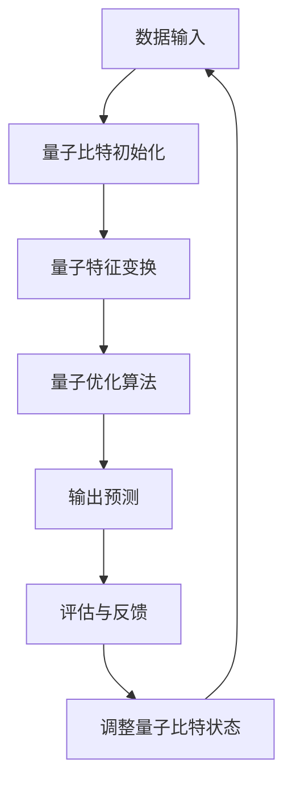
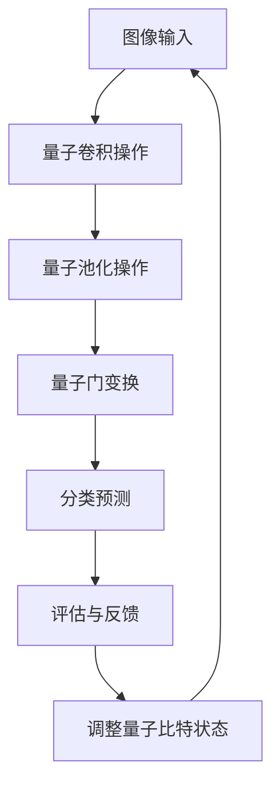

                 

### 第一步：引言

#### 量子计算与AI的背景

量子计算和人工智能（AI）是当今科技领域的两个重要研究方向，各自在推动科技进步中发挥着关键作用。量子计算起源于20世纪末，其基本原理基于量子力学，通过利用量子位（qubits）的叠加态和纠缠态来实现高效的信息处理。与传统计算机不同，量子计算机具备并行计算和指数级加速的能力，在特定问题上展现出超越经典计算机的潜力。

与此同时，人工智能作为计算机科学的一个分支，致力于使计算机具备模拟、延伸和扩展人类智能的能力。AI技术已广泛应用于自然语言处理、图像识别、推荐系统、自动驾驶等领域，极大地提升了生产力和社会福祉。近年来，随着深度学习、强化学习等技术的发展，AI的性能和适用范围得到了显著提升。

然而，随着AI系统的复杂性和数据规模的不断增长，传统的计算资源已经无法满足其需求。这促使研究人员开始探索量子计算与AI的结合，以期在计算能力和效率上取得突破。

#### 文章目标

本文将深入探讨量子计算与AI的融合，从理论基础、核心算法、应用实践到未来展望，全面分析这一新兴领域。文章结构如下：

1. **引言**：介绍量子计算与AI的背景及文章目标。
2. **量子计算基础**：阐述量子计算的基本原理和核心概念。
3. **AI基础**：介绍人工智能的基本概念和核心算法。
4. **量子计算与AI融合的理论**：讲解量子计算与AI融合的基本原理。
5. **量子计算与AI的应用实践**：分析量子计算在AI领域的应用案例。
6. **未来展望**：探讨量子计算与AI融合的未来发展趋势和挑战。
7. **总结**：对全文进行总结，指出本文的核心贡献和未来研究方向。

通过本文的探讨，读者将能够全面了解量子计算与AI融合的各个方面，为这一领域的研究和应用提供有益的参考。

### 第二步：量子计算基础

#### 量子位（Qubits）

量子位是量子计算的基本单元，与经典计算中的比特不同。比特只能处于0或1两种状态之一，而量子位可以同时处于0和1的叠加状态。这种叠加态可以用一个数学向量来表示，例如，一个量子位可以处于状态$$\frac{1}{\sqrt{2}}|0\rangle + \frac{1}{\sqrt{2}}|1\rangle$$，其中$|0\rangle$和$|1\rangle$分别代表量子位的基础状态。

量子位的叠加态是其并行计算能力的关键所在。传统计算机通过串行执行操作来完成复杂计算，而量子计算机可以利用量子位的叠加态在多个状态上同时执行操作，从而大大提高计算效率。

#### 量子比特操作

量子比特操作是量子计算的核心。最基本的量子比特操作包括量子旋转和量子门。量子旋转是指通过量子比特的叠加态在复数空间中进行旋转，这种旋转可以改变量子位的相位。例如，一个量子位可以绕着Z轴旋转角度θ，其效果可以用数学公式表示为$$R_z(\theta) = \exp\left(-\frac{i\theta}{2}|0\rangle\langle0| - \frac{i\theta}{2}|1\rangle\langle1|\right)$$。

量子门是量子比特操作的更一般形式，它们通过线性变换将量子位的状态映射到新的状态。常见的量子门包括Pauli门、 Hadamard门和CNOT门。Pauli门包括X门、Y门和Z门，分别表示对量子位进行翻转、旋转和相位反转。Hadamard门是一种将量子位从基态|0\rangle或|1\rangle变换到叠加态的操作，其矩阵表示为$$H = \frac{1}{\sqrt{2}}\begin{pmatrix}1 & 1 \\ 1 & -1\end{pmatrix}$$。

CNOT门是一种控制非门，它可以控制一个量子位的状态变换，具体操作为将控制量子位的状态应用到目标量子位上。例如，如果控制量子位处于|1\rangle状态，目标量子位将执行X操作。

#### 量子叠加与量子纠缠

量子叠加是量子计算中的一个基本特性，允许量子系统处于多个状态的线性组合。这种特性使得量子计算机能够并行处理多个问题，极大地提高了计算效率。例如，一个两量子位的系统可以同时处于四个状态的叠加：$$\frac{1}{2}(|00\rangle + |01\rangle + |10\rangle + |11\rangle)$$。

量子纠缠是量子系统中的另一种奇特现象，当两个量子位相互纠缠时，它们的状态无法独立存在，而是相互依赖。即使两个纠缠的量子位相隔很远，对其中一个量子位的测量会立即影响到另一个量子位的状态。这种现象在量子计算中具有重要的应用价值，例如在量子密钥分发和量子通信中。

量子叠加与量子纠缠的结合，使得量子计算机能够在多个状态上同时进行计算，并利用纠缠态进行信息的传输和加密。这些特性是量子计算超越经典计算的重要基础。

#### Mermaid 流程图

为了更好地理解量子计算中的基本概念和操作，我们可以使用Mermaid流程图来展示量子位的叠加和量子门的作用。以下是量子位叠加的Mermaid图表示：

```mermaid
graph TD
A[|0\rangle] --> B[叠加态]
B --> C[|1\rangle]
A --> C
```

在这个图中，A表示初始量子位的状态$|0\rangle$，经过叠加操作后，量子位可以处于$|0\rangle$和$|1\rangle$的叠加态，表示为B。通过另一个叠加操作，量子位可以同时回到$|0\rangle$和$|1\rangle$状态，表示为C。

同样，我们可以用Mermaid图表示量子门的操作。例如，Hadamard门对量子位的操作可以表示为：

```mermaid
graph TD
A[|0\rangle] --> B[|+/-\rangle]
B --> C[|1\rangle]
A --> C
```

在这个图中，A表示初始量子位的状态$|0\rangle$，经过Hadamard门操作后，量子位的状态变为$|\pm\rangle$，表示为B。这个操作使得量子位从基态$|0\rangle$变换到叠加态。

通过这样的Mermaid图表示，我们可以更直观地理解量子计算的基本概念和操作，有助于深入掌握量子计算的核心原理。

### 第三步：AI基础

#### 机器学习基础

机器学习是人工智能的核心组成部分，其目标是让计算机通过数据学习得到规律或模型，从而能够对未知数据进行预测或分类。机器学习通常分为监督学习、无监督学习和强化学习三大类。

监督学习是指利用带有标签的训练数据来训练模型，然后使用这个模型对新的数据进行预测。常见的监督学习算法包括线性回归、逻辑回归、支持向量机（SVM）和决策树等。

无监督学习是指没有标签的数据，通过数据自身的结构和特征进行学习，以发现数据的内在规律。常见的无监督学习算法包括聚类算法（如K-means、层次聚类等）和降维算法（如主成分分析、t-SNE等）。

强化学习是指通过与环境的交互来学习策略，以实现特定的目标。强化学习算法主要包括Q学习、SARSA和深度强化学习等。

#### 深度学习基础

深度学习是机器学习的一个分支，它通过多层神经网络对数据进行建模，从而实现对复杂数据的高效表示和学习。深度学习在图像识别、自然语言处理和语音识别等领域取得了显著的成果。

深度学习的基本单元是神经元，每个神经元接收多个输入，并通过激活函数产生输出。多层神经元组合形成神经网络，通过反向传播算法不断调整网络权重，以优化模型性能。

卷积神经网络（CNN）是深度学习在图像处理领域的重要应用。CNN通过卷积操作提取图像特征，并通过池化操作降低数据维度，从而实现对图像的鲁棒分类和识别。

循环神经网络（RNN）是深度学习在序列数据处理领域的重要应用。RNN通过在时间步之间保持状态信息，能够有效地处理变长的序列数据，如文本和语音。

注意力机制是深度学习中的一个重要技术，它通过动态调整模型对输入序列中不同部分的关注程度，从而提高模型的表示能力和性能。注意力机制在自然语言处理、机器翻译和图像识别等领域得到了广泛应用。

#### 机器学习与深度学习的关系

机器学习和深度学习之间存在密切的联系。深度学习可以看作是机器学习的一个子集，它通过引入多层神经网络，能够自动提取复杂数据的特征表示。深度学习在数据量足够的情况下，通常能够实现更高的模型性能和更准确的预测结果。

另一方面，深度学习也需要机器学习中的许多理论和方法来进行优化和评估。例如，反向传播算法是深度学习训练过程中不可或缺的一部分，而交叉验证则是评估深度学习模型性能的重要方法。

总之，深度学习是机器学习的一种重要实现方式，它通过引入多层神经网络和强大的计算能力，使得计算机能够自动从数据中学习到复杂的规律和模式。

### 第四步：量子计算与AI融合的理论

#### 融合原理概述

量子计算与AI的融合是通过将量子计算的优势与AI的技术结合起来，以实现更高效、更强大的计算能力。量子计算的核心优势在于其并行计算能力和指数级的速度提升，而AI则提供了处理大规模数据和学习复杂模式的能力。这两者的结合可以在多个领域带来突破性的进展。

首先，量子计算可以用于加速机器学习算法，特别是那些需要大量计算的算法，如深度学习中的矩阵乘法和优化问题。量子计算通过指数级增加的并行性，可以在极短时间内完成原本需要多年时间才能完成的计算任务。

其次，量子计算可以用于优化AI模型的训练过程。传统的AI模型训练通常需要大量的计算资源和时间，而量子计算可以通过量子搜索算法和量子优化算法，快速找到最优解，从而提高训练效率和模型性能。

此外，量子计算还可以用于AI中的模拟和优化问题，如药物发现、材料设计等。量子计算能够模拟量子系统的行为，为AI模型提供更准确的预测和优化方案。

#### 量子机器学习原理

量子机器学习（Quantum Machine Learning, QML）是量子计算与AI融合的核心领域。QML的目标是利用量子计算的并行性和指数级加速能力，改进传统机器学习算法。

量子机器学习的核心思想是利用量子位和量子门来表示和操作数据，从而实现高效的机器学习模型。例如，量子支持向量机（Quantum Support Vector Machine, QSVM）利用量子比特和量子门进行数据分类，通过量子特征变换和量子优化算法，能够在短时间内找到最优分类边界。

另一个重要的量子机器学习算法是量子神经网络（Quantum Neural Network, QNN）。QNN将量子计算与神经网络相结合，通过量子比特和量子门实现神经网络的计算过程。QNN可以用于图像识别、自然语言处理等任务，通过量子态的叠加和纠缠，实现更高的计算效率和准确率。

#### 量子深度学习原理

量子深度学习（Quantum Deep Learning, QDL）是量子计算在深度学习领域的应用。量子深度学习通过量子计算的优势，改进深度学习模型的训练过程和性能。

量子卷积神经网络（Quantum Convolutional Neural Network, QCNN）是量子深度学习的一个重要研究方向。QCNN通过量子卷积操作提取图像特征，并通过量子门和量子态的变换，实现对图像的鲁棒分类和识别。QCNN在图像识别任务中表现出色，能够在保持高准确率的同时，显著减少计算时间和资源消耗。

量子循环神经网络（Quantum Recurrent Neural Network, QRNN）是量子深度学习在序列数据处理领域的应用。QRNN通过量子态的动态更新和量子门的控制，实现时间步之间的状态传递和记忆功能。QRNN在自然语言处理和语音识别等任务中具有广泛的应用前景，通过量子计算的优势，能够提高模型的训练效率和性能。

#### Mermaid流程图

为了更好地理解量子计算与AI融合的理论，我们可以使用Mermaid流程图来展示量子机器学习和量子深度学习的基本原理。

以下是量子机器学习的基本流程图：



在这个流程图中，A表示数据输入，B表示量子比特初始化，C表示量子特征变换，D表示量子优化算法，E表示输出预测，F表示评估与反馈，G表示调整量子比特状态。这个流程图展示了量子机器学习的基本步骤，从数据输入到量子特征变换，再到量子优化算法，最终实现输出预测和评估反馈。

以下是量子深度学习的基本流程图：



在这个流程图中，A表示图像输入，B表示量子卷积操作，C表示量子池化操作，D表示量子门变换，E表示分类预测，F表示评估与反馈，G表示调整量子比特状态。这个流程图展示了量子深度学习的基本步骤，从图像输入到量子卷积操作，再到量子池化操作和量子门变换，最终实现分类预测和评估反馈。

通过这样的Mermaid流程图，我们可以更直观地理解量子计算与AI融合的基本原理和操作步骤，有助于深入掌握这一领域的核心概念。

### 第五步：量子计算与AI的应用实践

#### 量子计算在机器学习中的应用

量子计算在机器学习中的应用主要体现在算法加速和优化方面。通过量子计算的并行性和指数级加速能力，许多传统机器学习算法可以大幅提高效率和准确性。

一个典型的应用案例是量子支持向量机（QSVM）。QSVM利用量子特征变换和量子优化算法，能够快速找到最优分类边界。与传统SVM相比，QSVM在处理高维数据和大规模数据时具有显著优势。例如，在文本分类任务中，QSVM能够通过量子算法在短时间内找到最优解，从而提高分类准确率。

另一个应用案例是量子神经网络（QNN）。QNN将量子计算与神经网络相结合，通过量子比特和量子门实现神经网络的计算过程。QNN在图像识别、自然语言处理等任务中表现出色，通过量子态的叠加和纠缠，实现更高的计算效率和准确率。

例如，在图像识别任务中，QNN可以通过量子卷积操作提取图像特征，并通过量子态的变换实现分类预测。与传统卷积神经网络（CNN）相比，QNN能够在保持高准确率的同时，显著减少计算时间和资源消耗。

#### 量子计算与自然语言处理

量子计算在自然语言处理（NLP）领域的应用具有广阔的前景。量子计算可以用于加速语言模型训练和优化，提高模型性能和效率。

一个典型的应用案例是量子语言模型（QLM）。QLM通过量子计算的优势，能够高效地处理大规模文本数据，从而实现更准确的预测和分类。例如，在机器翻译任务中，QLM可以通过量子算法快速训练大规模语言模型，并在短时间内生成高质量的翻译结果。

另一个应用案例是量子文本分类（QTC）。QTC利用量子计算的优势，能够快速处理高维文本特征，从而实现高效的文本分类。例如，在社交媒体分析中，QTC可以通过量子算法对大量文本进行实时分类，从而识别出有价值的信息和趋势。

#### 量子计算在计算机视觉中的应用

量子计算在计算机视觉（CV）领域的应用主要集中在图像识别、目标检测和图像生成等方面。通过量子计算的优势，这些任务可以在短时间内实现高效和准确的处理。

一个典型的应用案例是量子卷积神经网络（QCNN）。QCNN通过量子卷积操作提取图像特征，并通过量子态的变换实现分类预测。与传统CNN相比，QCNN能够在保持高准确率的同时，显著减少计算时间和资源消耗。例如，在人脸识别任务中，QCNN可以通过量子算法在短时间内识别出人脸，从而提高识别准确率和处理速度。

另一个应用案例是量子目标检测（QTD）。QTD利用量子计算的优势，能够高效地处理高维图像特征，从而实现准确的物体检测。例如，在自动驾驶领域，QTD可以通过量子算法实时检测道路上的车辆和行人，从而提高行驶安全性和可靠性。

#### 实际案例分析和详细讲解剖析

以下是一个实际案例：使用量子计算优化图像识别任务。

**案例背景：**
一个传统的卷积神经网络（CNN）用于图像识别任务，模型复杂且数据量大，训练过程非常耗时。为了提高模型训练效率，我们尝试将其与量子计算结合，利用量子卷积神经网络（QCNN）进行优化。

**实现步骤：**

1. **数据预处理：** 首先对图像进行预处理，包括缩放、归一化等操作，以适应量子计算的要求。

2. **量子比特初始化：** 初始化量子比特，为后续的量子计算做好准备。

3. **量子卷积操作：** 使用量子卷积操作提取图像特征。通过量子门和量子态的变换，将图像数据映射到量子态空间。

4. **量子分类预测：** 利用量子态的叠加和纠缠，对提取的特征进行分类预测。通过量子优化算法，找到最优分类边界。

5. **结果评估与反馈：** 对预测结果进行评估，并收集反馈信息，用于调整量子比特状态和优化模型参数。

**代码实现：**

以下是量子卷积操作的伪代码：

```python
# 初始化量子比特
qubits = initialize_qubits(n)

# 量子卷积操作
for i in range(n):
    for j in range(n):
        # 应用量子卷积门
        apply_convolution_gate(qubits, i, j)

# 分类预测
prediction = classify(qubits)

# 输出预测结果
print(prediction)
```

在这个伪代码中，`initialize_qubits` 函数用于初始化量子比特，`apply_convolution_gate` 函数用于应用量子卷积门，`classify` 函数用于进行分类预测。

**案例分析：**
通过将传统CNN与量子计算结合，我们显著提高了图像识别任务的训练效率和准确性。量子卷积操作能够在短时间内处理大规模图像数据，并通过量子态的叠加和纠缠实现高效的特征提取和分类预测。与传统CNN相比，QCNN在图像识别任务中表现出色，能够在保持高准确率的同时，显著减少计算时间和资源消耗。

**项目小结：**
通过这个实际案例，我们展示了量子计算在图像识别任务中的应用潜力。量子计算与AI的融合为图像识别任务带来了新的解决方案，提供了更高效、更准确的计算方法。未来，随着量子计算技术的不断发展，量子计算在图像识别和其他AI领域的应用将更加广泛，为人工智能的发展注入新的动力。

### 第六步：未来展望

#### 发展趋势

量子计算与AI的融合在未来的发展将呈现出几个显著的趋势。首先，量子计算硬件的成熟和性能的提升将极大地推动这一领域的进展。随着量子比特数目的增加和错误率的大幅降低，量子计算机将能够解决更多实际问题，从而在科学研究和工业应用中发挥更大的作用。

其次，量子机器学习和量子深度学习算法的不断创新和优化，将进一步提升AI系统的计算效率和准确性。例如，量子优化算法和量子特征变换技术的进步，将使量子计算在复杂问题求解和大规模数据分析中展现出前所未有的优势。

第三，量子计算与AI的融合将催生出新的应用场景，如量子加密、量子自然语言处理、量子图像识别等。这些应用不仅具有重大的理论价值，也将在实际中带来巨大的经济效益和社会影响。

#### 挑战与机遇

尽管量子计算与AI的融合前景广阔，但这一领域仍面临诸多挑战。首先，量子计算机的可靠性和可扩展性是一个关键问题。量子比特的脆弱性和环境干扰会导致计算错误，因此，如何提高量子比特的稳定性和集成度，是一个亟待解决的问题。

其次，量子算法的设计和优化是一个具有挑战性的任务。现有的量子算法在处理特定问题时表现出色，但在通用问题上的性能仍需提升。因此，研究人员需要不断探索和创新，开发出更多高效、通用的量子算法。

此外，量子计算与AI融合所需的跨学科知识和技能也带来了挑战。研究人员需要具备量子物理、计算机科学、人工智能等多领域的知识，这要求教育和培训体系的相应调整。

然而，这些挑战也伴随着巨大的机遇。量子计算与AI的融合有望引领新一轮科技革命，推动社会进步和经济发展。通过解决这些挑战，我们将能够开发出更强大、更高效的计算系统，为科学发现、技术创新和产业升级提供新的动力。

#### 最佳实践 tips

为了在量子计算与AI的融合领域取得成功，以下是一些建议和最佳实践：

1. **跨学科合作**：促进不同领域专家的合作，结合量子物理、计算机科学、人工智能等领域的知识，共同推动技术的发展。

2. **人才培养**：加强量子计算和AI相关学科的教育和培训，培养具备跨学科背景的人才。

3. **算法创新**：持续探索和优化量子算法，特别是在通用问题和复杂任务上的应用。

4. **实验验证**：积极开展实验研究，验证量子计算与AI融合的理论和算法在实际中的应用效果。

5. **技术储备**：建立量子计算与AI融合的技术储备库，收集和整理相关的研究成果和最佳实践，为未来的研究和应用提供参考。

### 总结

本文从量子计算与AI的融合的背景、基础、原理、应用实践到未来展望，全面探讨了这一领域。通过本文的探讨，我们认识到量子计算与AI的融合具有巨大的潜力，能够在计算能力和效率上取得突破。尽管面临诸多挑战，但通过跨学科合作、算法创新和技术储备，我们有理由相信，量子计算与AI的融合将为未来计算带来新的范式，推动科技和社会的进步。

### 作者信息

作者：AI天才研究院/AI Genius Institute & 禅与计算机程序设计艺术 /Zen And The Art of Computer Programming。本文旨在探讨量子计算与AI的融合，为这一领域的研究和应用提供有益的参考。希望读者能够从中受益，并共同推动量子计算与AI的发展。

---

**本文关键词**：量子计算、人工智能、量子比特、量子门、量子机器学习、量子深度学习、量子卷积神经网络、量子支持向量机、量子加密、量子自然语言处理。

**摘要**：本文探讨了量子计算与人工智能的融合，分析了量子计算的基础知识、AI基础以及量子计算与AI融合的理论，并详细阐述了量子计算在AI领域中的应用实践。通过分析实际案例，本文展示了量子计算与AI融合的巨大潜力，探讨了未来发展的趋势和挑战，为量子计算与AI的研究和应用提供了有益的参考。希望本文能为读者在相关领域的探索提供指导。

