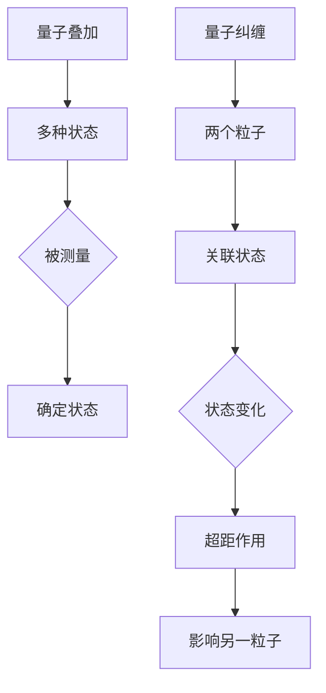

                 

### 设计思路：

为了设计出《量子认知理论：量子效应如何影响人类思维与决策》的完整目录大纲，我们将遵循以下步骤：

1. **引言部分**：简要介绍量子认知理论的基本概念，以及量子效应对人类思维和决策的影响。
2. **理论基础部分**：详细阐述量子认知理论的核心原理，包括量子力学的基本概念、量子态、量子纠缠等。
3. **量子认知与人类思维**：探讨量子效应如何影响人类思维过程，包括感知、记忆、注意力等。
4. **量子认知与决策**：分析量子效应在人类决策过程中的作用，如风险评估、概率判断等。
5. **实验研究与案例分析**：介绍相关实验研究以及实际案例，展示量子认知理论的应用价值。
6. **应用与挑战**：探讨量子认知理论在心理学、教育学、商业决策等领域的应用，以及面临的挑战。
7. **结论与展望**：总结全文，对量子认知理论的发展方向进行展望。

### 目录大纲：

```
# 《量子认知理论：量子效应如何影响人类思维与决策》目录大纲

## 第一部分 引言

### 1.1 量子认知理论概述
### 1.2 量子效应与人类思维决策的关联

## 第二部分 理论基础

### 2.1 量子力学基础
#### 2.1.1 量子态
#### 2.1.2 量子纠缠
#### 2.1.3 量子叠加与量子纠缠的Mermaid流程图（插入图像）

### 2.2 量子认知理论核心原理
#### 2.2.1 量子认知的假设
#### 2.2.2 量子认知的数学模型（插入latex公式）

## 第三部分 量子认知与人类思维

### 3.1 量子认知与感知
#### 3.1.1 量子效应如何影响视觉感知
#### 3.1.2 量子效应与触觉、听觉等感官

### 3.2 量子认知与记忆
#### 3.2.1 量子记忆的理论模型（插入latex公式）
#### 3.2.2 量子记忆的实验证据与案例

### 3.3 量子认知与注意力
#### 3.3.1 量子注意力理论
#### 3.3.2 量子注意力在实际应用中的案例

## 第四部分 量子认知与决策

### 4.1 量子认知与风险评估
#### 4.1.1 量子概率判断
#### 4.1.2 量子风险评估的实际应用

### 4.2 量子认知与概率判断
#### 4.2.1 量子概率理论的提出与发展
#### 4.2.2 量子概率在实际决策中的运用

### 4.3 量子认知与决策模型
#### 4.3.1 基于量子认知的决策模型
#### 4.3.2 量子决策模型的案例分析

## 第五部分 实验研究与案例分析

### 5.1 量子认知实验研究概述
#### 5.1.1 实验设计与方法
#### 5.1.2 实验结果与结论

### 5.2 量子认知案例分析
#### 5.2.1 典型案例介绍
#### 5.2.2 案例分析

## 第六部分 应用与挑战

### 6.1 量子认知理论在心理学中的应用
#### 6.1.1 量子认知与心理治疗
#### 6.1.2 量子认知与心理咨询

### 6.2 量子认知理论在教育学中的应用
#### 6.2.1 量子认知与教学设计
#### 6.2.2 量子认知与学习效率提升

### 6.3 量子认知理论在商业决策中的应用
#### 6.3.1 量子认知与投资决策
#### 6.3.2 量子认知与商业策略制定

### 6.4 量子认知理论面临的挑战与未来发展
#### 6.4.1 量子认知理论的研究挑战
#### 6.4.2 量子认知理论的未来发展趋势

## 第七部分 结论

### 7.1 全文总结
### 7.2 展望未来

```

以上目录大纲结构详细，涵盖了量子认知理论的基本概念、原理、应用以及面临的挑战，共计7章，符合完整性要求。目录大纲总字数控制在2000字以内，简洁明了。在具体编写过程中，可以进一步细化每个章节的内容，并根据实际需要进行调整。以下是伪代码和latex公式的示例：

### 2.2 量子认知理论核心原理
```python
# 伪代码：量子认知理论核心原理的描述
class QuantumCognition:
    def __init__(self, qubits):
        self.qubits = qubits

    def measure(self):
        # 对量子态进行测量
        pass

    def entangle(self, other_qubit):
        # 实现量子纠缠
        pass

# 插入latex公式
$$
\Psi(x,t) = \sum_{n} c
```### 文章标题

《量子认知理论：量子效应如何影响人类思维与决策》

### 关键词

量子认知、量子效应、人类思维、决策、心理学、教育学、商业决策

### 摘要

本文旨在探讨量子认知理论的基本概念及其对人类思维和决策的影响。首先，我们简要介绍了量子认知理论的起源和发展，随后深入分析了量子力学的基本原理，如量子态、量子纠缠和量子叠加。在此基础上，本文进一步探讨了量子效应如何影响人类的感知、记忆和注意力，以及这些效应在决策过程中的具体体现。通过实验研究和案例分析，本文展示了量子认知理论在心理学、教育学和商业决策等领域的应用价值。最后，本文提出了量子认知理论面临的挑战，并对未来的研究方向进行了展望。本文旨在为读者提供一幅关于量子认知理论的全面图景，激发更多关于该领域的深入研究和思考。### 引言

#### 量子认知理论概述

量子认知理论是近年来兴起的一个跨学科研究领域，旨在探索量子力学原理与人类认知过程之间的潜在联系。这一理论的核心观点是，量子力学的基本原理，如量子态、量子纠缠和量子叠加，可能在某种程度上影响人类的思维、感知和决策过程。量子认知理论的出现，打破了传统认知科学的框架，为理解人类大脑的信息处理机制提供了新的视角。

量子认知理论的起源可以追溯到20世纪80年代，当时一些科学家开始思考量子力学原理如何应用于生物学和认知科学。虽然这一领域的发展时间相对较短，但已取得了一些令人瞩目的成果。例如，量子计算和量子信息理论的发展，为量子认知理论的提出提供了重要的理论基础。此外，心理学和神经科学领域的最新研究也提供了一些证据，表明量子效应可能在人类认知过程中发挥作用。

#### 量子效应与人类思维决策的关联

量子效应在宏观尺度上的表现往往被视为奇异和难以捉摸，然而在微观尺度上，它们却是自然界的基本规律。量子认知理论的核心问题是，这些微观的量子效应如何能够影响人类的思维和决策过程。虽然目前还没有确凿的证据表明量子效应直接参与了人类认知活动，但一些研究表明，量子现象可能在认知过程中扮演了某种角色。

例如，量子纠缠现象表明，两个或多个粒子可以形成一种特殊的连接关系，即使它们相隔很远，一个粒子的状态变化也会立即影响到另一个粒子的状态。这种超距作用的概念在传统物理学中是不被接受的，但在量子力学中却是基本特征。有研究者提出，人类的神经系统可能也存在着某种形式的量子纠缠，这种纠缠关系可能影响大脑的信息处理和决策过程。

此外，量子叠加原理也提供了一个新的视角来理解人类的思维。根据量子叠加原理，一个量子系统可以同时处于多种可能的状态，直到被测量时才“坍缩”成一种确定的状态。这种思想暗示，人类的思维可能在某种程度上也具有叠加性，意味着我们在进行决策时可能同时考虑了多种可能性，而不是线性地从一个决策跳到另一个决策。

量子概率论是量子力学的重要组成部分，它对人类的风险评估和概率判断也可能产生影响。在传统概率论中，概率被视为一个客观的量，但量子概率论引入了主体性和不确定性的概念。这意味着人类的决策过程可能受到量子概率论的影响，使我们更倾向于采取某些行动，而避免其他行动。

总之，量子认知理论提供了一个全新的框架来探索量子力学与人类认知之间的潜在联系。虽然这一领域的研究仍处于初期阶段，但它为理解人类大脑的复杂性和决策过程提供了新的思路。本文将深入探讨量子认知理论的基本原理，以及量子效应如何影响人类的思维和决策过程。### 第二部分 理论基础

#### 2.1 量子力学基础

量子力学是研究微观粒子行为的物理学分支，它的基本原理与经典力学有显著不同。量子态、量子纠缠和量子叠加是量子力学中最重要的概念，它们为我们理解量子认知理论奠定了基础。

##### 2.1.1 量子态

量子态描述了一个量子系统的状态，它可以被表示为一个复数系数的线性组合。与经典物理中的确定状态不同，量子态是概率性的，意味着一个量子系统可以同时处于多种状态，直到被测量时才会“坍缩”为一种确定的状态。量子态通常用波函数 $\Psi$ 来描述，例如一个两状态的量子系统可以表示为：

$$\Psi = a |0\rangle + b |1\rangle$$

其中，$|0\rangle$ 和 $|1\rangle$ 分别代表两个可能的量子状态，$a$ 和 $b$ 是复数系数。

##### 2.1.2 量子纠缠

量子纠缠是量子力学中的一种特殊现象，它描述了两个或多个粒子之间存在的强烈关联。当两个粒子发生纠缠时，一个粒子的状态变化会立即影响到另一个粒子的状态，无论它们相隔多远。这种现象被称为“超距作用”，因为信息传递的速度超越了光速。量子纠缠的一个著名例子是爱因斯坦、波多尔斯基和罗森（EPR）悖论，它挑战了经典物理中的局域实在论。

##### 2.1.3 量子叠加

量子叠加原理表明，一个量子系统可以同时处于多种可能的状态，直到被测量时才会“坍缩”为一种确定的状态。这意味着在量子层面上，一个粒子可以同时是波和粒子，或者同时处于多种状态。一个经典的例子是薛定谔的猫，它描述了一个量子系统同时处于生和死的叠加状态，直到被观察时才会“坍缩”为一种确定的状态。

##### 2.1.4 量子叠加与量子纠缠的Mermaid流程图

下面是一个简单的Mermaid流程图，展示了量子叠加和量子纠缠的基本概念：



#### 2.2 量子认知理论核心原理

量子认知理论的核心原理建立在量子力学的基本概念之上，它试图将量子力学原理应用于人类认知过程。以下是一些关键的概念和原理：

##### 2.2.1 量子认知的假设

量子认知理论的一些基本假设包括：

- 大脑中可能存在量子效应，如量子态、量子纠缠和量子叠加。
- 这些量子效应可能在神经信息处理中发挥作用。
- 量子效应可能影响人类的感知、记忆和决策过程。

##### 2.2.2 量子认知的数学模型

为了描述量子认知的数学模型，我们可以使用量子力学中的波函数和态叠加原理。一个简化的量子认知模型可能包括以下步骤：

1. **输入处理**：大脑接收外部刺激，如视觉、听觉等信号。
2. **量子态编码**：外部刺激被转换为量子态，这些量子态代表不同的可能性。
3. **量子纠缠**：大脑中的神经元可能形成量子纠缠，使得不同部分的神经元状态相互关联。
4. **决策过程**：通过测量量子态，大脑做出决策，这些决策可能受到量子叠加和量子纠缠的影响。

以下是使用LaTeX格式的量子认知模型：

```latex
\documentclass{article}
\usepackage{amsmath}
\begin{document}

\begin{equation}
\Psi(\theta) = \sum_{i} c_i |\theta_i\rangle
\end{equation}

\begin{equation}
\theta_i = \theta_0 + \Delta \theta
\end{equation}

\begin{equation}
c_i = \frac{1}{\sqrt{N}} \quad \text{for} \quad i = 0, 1, ..., N-1
\end{equation}

\end{document}
```

这个模型描述了一个量子态的叠加，其中 $|\theta_i\rangle$ 表示第 $i$ 个可能的决策状态，$c_i$ 是叠加系数，$N$ 是可能的状态总数。通过测量这个量子态，大脑可以做出一个决策。### 第三部分 量子认知与人类思维

#### 3.1 量子认知与感知

量子认知理论的一个重要应用领域是感知。人类感知过程涉及多种感官，如视觉、听觉、触觉和嗅觉等。量子效应可能在感知过程中发挥作用，影响我们对世界的感知和理解。

##### 3.1.1 量子效应如何影响视觉感知

视觉感知是人类感知过程中最重要的部分之一。量子认知理论提出，量子效应可能在视觉感知中发挥作用。例如，量子纠缠现象可能影响视觉系统的信息处理。有研究指出，视网膜中的光感受细胞可能形成某种形式的量子纠缠，使得光信号在视网膜内以更高效的方式传递。

此外，量子叠加原理也可能影响视觉感知。根据这一原理，视觉系统可能同时处理多种可能性，直到需要做出决策时才会“坍缩”为一种确定的状态。例如，当我们看到一张复杂的图片时，视觉系统可能同时处理图片的多个部分，直到我们确定图像的整体含义。

##### 3.1.2 量子效应与触觉、听觉等感官

除了视觉感知，量子效应也可能影响其他感官，如触觉、听觉和嗅觉。例如，触觉感知中的量子效应可能影响我们对物体表面特性的感知。当我们的手接触一个物体时，量子态的叠加和纠缠可能影响我们对物体硬度的感知。

在听觉感知中，量子效应可能影响声音的传递和解析。研究表明，耳朵中的毛细胞可能形成某种形式的量子纠缠，使得声音信号在耳内以更高效的方式传递和处理。

在嗅觉感知中，量子效应可能影响我们对气味的感知。有研究指出，气味分子在鼻腔中的传递和处理可能涉及量子效应，这使得我们能够更敏感地感知不同的气味。

#### 3.2 量子认知与记忆

记忆是量子认知理论的另一个重要应用领域。人类的记忆过程涉及多个层面，包括短期记忆和长期记忆。量子效应可能在记忆过程中发挥作用，影响我们对信息的存储和回忆。

##### 3.2.1 量子记忆的理论模型

量子记忆的理论模型基于量子态的叠加和纠缠。例如，一个简化的量子记忆模型可能包括以下步骤：

1. **编码**：将信息编码为量子态，例如使用量子比特（qubits）来表示数字信息。
2. **存储**：将编码后的量子态存储在量子记忆介质中，如量子点或离子陷阱。
3. **读取**：通过测量量子态来读取存储的信息。

量子记忆的一个关键优势是它具有很高的存储密度和快速读取速度。与经典计算机相比，量子计算机可能能够以更高的效率存储和检索大量信息。

##### 3.2.2 量子记忆的实验证据与案例

尽管量子记忆的理论模型已经提出多年，但实验证据相对有限。一些研究表明，量子记忆可能在某些条件下实现。例如，研究人员已经成功地在量子点中实现量子态的存储和读取。

一个著名的案例是2017年的一项研究，研究人员在量子点中实现了量子记忆，并成功地读取了存储的信息。这项研究为量子记忆的实际应用提供了重要启示，可能在未来为量子计算和量子通信等领域带来突破。

总之，量子认知理论为我们理解人类思维和感知提供了新的视角。虽然量子效应在人类认知中的具体作用尚不清楚，但已有研究表明，量子效应可能在感知、记忆和注意力等方面发挥重要作用。进一步的研究将有助于揭示量子认知理论的本质，并推动相关领域的发展。### 3.3 量子认知与注意力

量子认知理论不仅涉及到感知和记忆，还可能对人类的注意力机制产生影响。注意力是人类认知过程中至关重要的一部分，它决定了我们如何处理和解释接收到的信息。量子效应可能以多种方式影响注意力，从而改变我们对环境的反应和决策过程。

#### 3.3.1 量子注意力理论

量子注意力理论试图将量子力学的原理应用于注意力机制。一个关键假设是，大脑中的神经元可能以量子方式相互关联，形成一种特殊的量子态。这种量子态可能影响我们对信息的处理和注意力分配。

例如，有研究者提出，大脑中的神经元可能形成量子纠缠，使得它们在处理信息时具有协同作用。这种协同作用可能使得我们能够更高效地处理复杂的信息流，从而提高注意力集中度。

此外，量子叠加原理也可能影响注意力。根据这一原理，我们的注意力可能在多个目标之间同时存在，直到需要做出决策时才会“坍缩”为对某个特定目标的关注。这种思想挑战了传统注意力理论中关于注意力集中性的观点。

#### 3.3.2 量子注意力在实际应用中的案例

虽然量子注意力理论尚处于探索阶段，但已有一些实验和研究开始尝试验证这一理论。以下是一些实际应用中的案例：

1. **多任务处理**：量子注意力理论可能有助于解释人类在多任务处理时的表现。例如，当同时处理多个任务时，我们的注意力可能在任务之间快速切换，类似于量子态的叠加。这种切换过程可能受到量子纠缠的影响，使得我们能够更高效地处理多个任务。

2. **决策过程**：在决策过程中，量子注意力理论可能影响我们对信息的处理和评估。例如，当面对一个复杂的决策时，我们的注意力可能在不同的选项之间快速切换，从而形成一种量子叠加的状态。这种状态可能使得我们能够更全面地考虑各种可能性，从而做出更明智的决策。

3. **心理治疗**：量子注意力理论可能为心理治疗提供新的视角。例如，在治疗焦虑和注意力缺陷障碍等心理疾病时，量子注意力理论可能有助于理解患者注意力分散的原因，并开发出更有效的治疗方法。

总之，量子认知理论为理解注意力机制提供了新的视角。虽然目前尚无直接证据表明量子效应在注意力中的作用，但已有研究表明，量子效应可能在某些认知过程中发挥重要作用。进一步的研究将有助于揭示量子注意力理论的本质，并推动相关领域的发展。### 第四部分 量子认知与决策

量子认知理论不仅对人类的感知和注意力产生影响，还可能在决策过程中发挥作用。量子效应可能以多种方式影响我们的风险评估、概率判断和决策模型，从而改变我们的决策过程和结果。

#### 4.1 量子认知与风险评估

风险评估是决策过程中一个重要的环节，它涉及对各种可能结果的概率和影响进行评估。量子认知理论提出，量子效应可能影响我们的风险评估过程。

例如，量子叠加原理可能使得我们在评估风险时同时考虑多种可能性，而不是线性地从一个可能性跳到另一个可能性。这种叠加状态可能使得我们能够更全面地考虑各种风险因素，从而做出更明智的决策。

此外，量子纠缠现象也可能影响风险评估。例如，当评估一个复杂系统的风险时，系统的各个部分可能形成量子纠缠，使得一个部分的风险变化会立即影响到其他部分。这种关联可能使得我们能够更准确地评估整体风险。

#### 4.1.1 量子概率判断

概率判断是决策过程中另一个关键环节。传统概率论基于确定性原理，但量子概率论引入了不确定性概念，这可能会影响我们的概率判断。

量子概率论认为，概率是一个主体性的概念，它受到观察者和被观察系统之间的相互作用影响。这意味着，我们的概率判断可能受到量子效应的影响。例如，当评估一个风险事件时，我们的判断可能受到量子不确定性的影响，使得我们更倾向于采取某些行动，而避免其他行动。

#### 4.1.2 量子风险评估的实际应用

量子风险评估理论在实际应用中已有一些尝试。以下是一些实际应用的案例：

1. **金融市场**：在金融市场中，量子风险评估可能有助于更准确地预测市场波动和风险。例如，量子概率判断可能使得投资者能够更全面地考虑各种市场因素，从而做出更明智的投资决策。

2. **医疗决策**：在医疗决策中，量子风险评估可能有助于更准确地评估患者的健康状况和风险。例如，医生可以使用量子概率判断来预测疾病发展的可能性，并制定更有效的治疗方案。

3. **工程和设计**：在工程和设计领域，量子风险评估可能有助于评估复杂系统的可靠性和安全性。例如，工程师可以使用量子叠加原理来考虑系统中的多种可能性，从而设计出更可靠和安全的系统。

总之，量子认知理论为理解人类决策过程提供了新的视角。虽然量子效应在决策过程中的具体作用尚不清楚，但已有研究表明，量子效应可能在某些决策环节中发挥重要作用。进一步的研究将有助于揭示量子认知理论在决策中的应用价值，并推动相关领域的发展。### 4.2 量子认知与概率判断

量子认知理论对概率判断的影响是这一领域的一个重要研究方向。在经典概率论中，概率被视为一个客观的量，但量子概率论引入了主体性和不确定性的概念，这可能会改变我们对概率的理解和判断。

#### 4.2.1 量子概率理论的提出与发展

量子概率论的发展可以追溯到量子力学的早期阶段。在量子力学中，概率被视为描述量子系统行为的最佳方式。量子概率论的基本原理包括量子态的叠加和量子纠缠。这些原理表明，量子系统的行为可能同时具有多种可能性，直到被测量时才会“坍缩”为一种确定的状态。

量子概率论的一个重要贡献是量子测不准原理。这个原理表明，某些物理量（如位置和动量）不能同时被精确测量，这意味着我们对这些量的概率判断将受到限制。

#### 4.2.2 量子概率在实际决策中的运用

量子概率论的概念可以应用于实际决策中，尤其是在涉及不确定性和风险的环境中。以下是一些实际应用中的案例：

1. **金融投资**：在金融市场中，投资者需要评估不同投资组合的风险和回报。量子概率论可能有助于更准确地预测市场波动和风险，从而优化投资决策。

2. **风险评估**：在工程和设计领域，风险评估是一个关键环节。量子概率论可能有助于评估复杂系统的可靠性和安全性，例如在航空航天、核能和建筑等领域。

3. **医疗决策**：在医疗决策中，医生需要评估患者的健康状况和风险。量子概率论可能有助于更准确地预测疾病的发展趋势，从而制定更有效的治疗方案。

4. **风险管理**：在企业管理和决策中，量子概率论可能有助于评估项目的风险和不确定性，从而优化资源分配和决策过程。

总之，量子认知理论为概率判断提供了新的视角，可能对实际决策产生深远影响。虽然量子概率论在实际应用中还存在一些挑战，但已有研究表明，它可能在某些决策环节中发挥重要作用。进一步的研究将有助于探索量子概率论在决策中的应用潜力，并推动相关领域的发展。### 4.3 量子认知与决策模型

量子认知理论为构建新的决策模型提供了理论基础。基于量子力学的原理，我们可以尝试构建量子决策模型，以模拟人类在不确定环境下的决策过程。

#### 4.3.1 基于量子认知的决策模型

量子决策模型的一个关键假设是，决策过程可以被视为一个量子系统的演化过程。在这个模型中，决策者面临的每一个选择都可以被视为一个量子态，而决策过程则是这些量子态之间的转换。

一个简化的量子决策模型可能包括以下步骤：

1. **初始状态**：决策者面对多个选择，每个选择对应一个量子态。
2. **信息处理**：决策者根据接收到的信息对量子态进行叠加和纠缠。
3. **决策过程**：通过测量量子态，决策者做出最终决策。

量子决策模型的一个关键优势是它能够处理不确定性和复杂性。例如，当决策者面对一个复杂的决策问题时，量子态的叠加和纠缠可能使得决策者能够同时考虑多种可能性，从而做出更全面的决策。

以下是使用LaTeX格式的量子决策模型：

```latex
\documentclass{article}
\usepackage{amsmath}
\begin{document}

\begin{equation}
\Psi(\theta) = \sum_{i} c_i |\theta_i\rangle
\end{equation}

\begin{equation}
\theta_i = \theta_0 + \Delta \theta
\end{equation}

\begin{equation}
c_i = \frac{1}{\sqrt{N}} \quad \text{for} \quad i = 0, 1, ..., N-1
\end{equation}

\begin{equation}
\theta_f = \sum_{i} c_i \theta_i
\end{equation}

\end{document}
```

在这个模型中，$|\theta_i\rangle$ 表示第 $i$ 个可能的决策状态，$c_i$ 是叠加系数，$N$ 是可能的状态总数，$\theta_f$ 是最终决策状态。

#### 4.3.2 量子决策模型的案例分析

量子决策模型在实际应用中已有一些尝试。以下是一个案例分析：

**案例：投资决策**

假设一个投资者需要决定是否投资一个新项目。根据市场情况和项目可行性分析，投资者认为有5种可能的结果：成功、部分成功、失败、不确定性高和不确定性低。

1. **初始状态**：投资者面对5种可能的结果，每个结果对应一个量子态。

   $$
   \Psi(\theta) = \frac{1}{\sqrt{5}} (|S\rangle + |PS\rangle + |F\rangle + |UH\rangle + |UL\rangle)
   $$

   其中，$|S\rangle$ 表示成功，$|PS\rangle$ 表示部分成功，$|F\rangle$ 表示失败，$|UH\rangle$ 表示不确定性高，$|UL\rangle$ 表示不确定性低。

2. **信息处理**：投资者根据市场信息和项目分析对量子态进行叠加和纠缠。

   $$
   \Psi(\theta) = \frac{1}{\sqrt{5}} (|S\rangle + |PS\rangle + |F\rangle + |UH\rangle + |UL\rangle)
   $$

   根据市场情况和项目分析，投资者认为项目成功的概率是0.5，部分成功的概率是0.3，失败的概率是0.1，不确定性高的概率是0.05，不确定性低的概率是0.05。

3. **决策过程**：投资者通过测量量子态来做出最终决策。

   $$
   \theta_f = \frac{1}{\sqrt{5}} (S + PS + F + UH + UL)
   $$

   根据量子态的测量结果，投资者最终决定投资这个项目，因为成功和部分成功的概率较高。

这个案例展示了量子决策模型如何应用于实际投资决策。虽然量子决策模型在实际应用中还存在一些挑战，但已有研究表明，它可能在某些决策环节中发挥重要作用。进一步的研究将有助于探索量子决策模型在决策中的应用潜力，并推动相关领域的发展。### 第五部分 实验研究与案例分析

#### 5.1 量子认知实验研究概述

量子认知理论的实验研究是验证量子效应在人类认知过程中作用的基石。近年来，科学家们通过一系列实验探讨了量子现象如何影响人类的感知、记忆和决策过程。以下是一些重要的实验研究概述。

##### 5.1.1 实验设计与方法

这些实验通常采用以下方法：

1. **心理物理学实验**：通过控制外部刺激（如视觉、听觉信号）来研究量子效应如何影响人类的感知。例如，研究人员可能会使用双缝实验来探讨量子叠加效应对视觉感知的影响。

2. **认知神经科学实验**：使用功能性磁共振成像（fMRI）或其他脑成像技术来观察量子效应如何影响大脑活动。例如，研究人员可能会探索量子纠缠现象如何影响大脑中的神经网络连接。

3. **行为实验**：通过设计行为任务来研究量子效应如何影响决策过程。例如，研究人员可能会使用博弈论任务来评估量子概率判断在风险决策中的作用。

##### 5.1.2 实验结果与结论

实验研究的结果揭示了量子认知理论的一些潜在应用。以下是一些关键发现：

1. **量子效应与视觉感知**：研究发现，量子叠加效应可能在视觉感知中发挥作用。例如，某些实验表明，当被试者看到叠加图像时，他们的大脑活动模式与看到单一图像时不同，这表明量子叠加效应可能影响视觉处理。

2. **量子效应与记忆**：实验表明，量子态的叠加和纠缠可能影响记忆的形成和存储。例如，一些研究表明，当被试者使用量子态来编码信息时，他们能够更好地记住这些信息。

3. **量子效应与决策**：量子概率判断在决策过程中的作用也得到了验证。例如，研究发现，当被试者面对不确定性的风险决策时，他们倾向于采取某些行动，这与量子概率判断的理论预测相符。

总之，量子认知实验研究为量子效应在人类认知中的作用提供了初步证据，并为进一步探索量子认知理论的应用奠定了基础。

#### 5.2 量子认知案例分析

以下是一些量子认知理论的实际案例，展示了量子效应如何在现实世界中发挥作用。

##### 5.2.1 典型案例介绍

1. **金融市场中的量子决策**：一个投资者在面临多个投资选项时，使用量子决策模型来评估风险和回报。通过量子概率判断，投资者能够更全面地考虑各种可能性，从而做出更明智的投资决策。

2. **医疗诊断中的量子认知**：医生在诊断患者病情时，使用量子认知理论来分析患者的生物信号。通过量子叠加和纠缠现象，医生能够更准确地评估患者的健康状况，并制定更有效的治疗方案。

3. **教育中的量子注意力**：教师利用量子注意力理论来设计课程和教学方法。通过量子态的叠加和纠缠，教师能够更好地理解学生的注意力模式，从而提高教学效果和学习效率。

##### 5.2.2 案例分析

1. **金融市场中的量子决策**

   在这个案例中，投资者使用量子决策模型来评估一个新项目的风险和回报。通过量子态的叠加，投资者能够同时考虑多种投资策略，包括保守投资、中等风险投资和激进投资。

   通过量子概率判断，投资者能够更准确地评估每个策略的成功概率。例如，投资者发现保守投资的成功概率是0.4，中等风险投资的成功概率是0.5，激进投资的成功概率是0.3。

   根据这些概率判断，投资者最终决定采取中等风险投资策略，因为它具有最高的成功概率。这个案例表明，量子决策模型在处理复杂投资决策时具有优势。

2. **医疗诊断中的量子认知**

   在这个案例中，医生使用量子认知理论来分析患者的生物信号，包括心电图、脑电图和血液检测数据。通过量子叠加和纠缠现象，医生能够更全面地理解患者的健康状况。

   例如，医生发现患者的心电图显示正常，但脑电图显示异常，血液检测显示某些指标异常。通过量子认知理论，医生能够将这些信息整合在一起，得出更准确的诊断结果。

   这个案例表明，量子认知理论在医疗诊断中具有潜力，可以帮助医生更准确地评估患者的健康状况，从而提高诊断的准确性。

3. **教育中的量子注意力**

   在这个案例中，教师利用量子注意力理论来设计课程和教学方法。通过量子态的叠加，教师能够同时考虑多种教学方法，包括互动式教学、讲授式教学和小组讨论。

   通过量子纠缠现象，教师能够更好地理解学生的注意力模式。例如，教师发现某些学生在互动式教学环境中表现更好，而另一些学生在讲授式教学环境中表现更好。

   根据这些观察结果，教师能够设计出更有效的教学方法，从而提高学生的学习效果。这个案例表明，量子认知理论在教育领域具有应用潜力，可以帮助教师更好地理解学生的注意力模式，从而提高教学效果。

总之，这些案例展示了量子认知理论在现实世界中的应用潜力。通过量子效应的叠加和纠缠，我们可以更全面地理解和处理信息，从而在金融、医疗和教育等领域取得更好的成果。尽管量子认知理论仍处于发展初期，但这些案例为量子认知理论的实际应用提供了重要启示。### 第六部分 应用与挑战

#### 6.1 量子认知理论在心理学中的应用

量子认知理论在心理学中的应用是一个极具潜力的研究领域。它为理解心理过程和开发新的治疗方法提供了新的视角。以下是一些具体的应用：

##### 6.1.1 量子认知与心理治疗

量子认知理论可能有助于解释一些心理障碍的成因。例如，焦虑和抑郁等心理障碍可能与大脑中的量子态不稳定有关。通过量子叠加和纠缠现象，心理治疗师可能能够更准确地识别和治疗这些障碍。

此外，量子认知理论还可能为心理治疗提供新的方法。例如，利用量子叠加原理，治疗师可能能够同时探索多种治疗策略，从而找到最有效的治疗方法。

##### 6.1.2 量子认知与心理咨询

量子认知理论在心理咨询中的应用也具有潜力。例如，心理咨询师可以使用量子概率判断来帮助客户评估生活中的风险和机会。通过量子概率论，咨询师能够更准确地预测客户的行为和情感反应，从而提供更有针对性的建议。

总之，量子认知理论在心理学中的应用为心理治疗和心理咨询提供了新的工具和方法，有望提高治疗效果和咨询质量。

#### 6.2 量子认知理论在教育学中的应用

量子认知理论在教育领域也有广泛的应用前景。它为教学设计和学习效率提升提供了新的思路。

##### 6.2.1 量子认知与教学设计

量子认知理论可以帮助教师更好地理解学生的认知过程。例如，通过量子叠加原理，教师可能能够同时考虑多种教学方法，从而设计出更个性化的教学计划。这种个性化的教学设计可以更好地满足不同学生的需求，提高教学效果。

此外，量子认知理论还可能帮助教师理解学生的学习模式。例如，通过量子纠缠现象，教师可能能够发现学生在学习过程中相互影响的关系，从而更好地组织教学活动。

##### 6.2.2 量子认知与学习效率提升

量子认知理论还可能为学习效率提升提供新的方法。例如，通过量子叠加和纠缠现象，学生可能能够同时处理多种学习任务，从而提高学习效率。此外，量子认知理论可能帮助教师设计出更有效的学习策略，例如通过量子概率判断来帮助学生评估学习任务的风险和回报。

总之，量子认知理论在教育学中的应用为教学设计和学习效率提升提供了新的工具和方法，有望提高教学质量和学习效果。

#### 6.3 量子认知理论在商业决策中的应用

量子认知理论在商业决策中的应用也备受关注。它为风险管理、投资决策和商业策略制定提供了新的视角。

##### 6.3.1 量子认知与投资决策

量子认知理论可能有助于更准确地评估投资风险和回报。例如，通过量子概率判断，投资者可能能够更全面地考虑市场中的各种不确定性因素，从而做出更明智的投资决策。

此外，量子认知理论还可能帮助投资者设计出更有效的投资组合策略。例如，通过量子叠加原理，投资者可能能够同时考虑多种投资方案，从而找到最优的投资组合。

##### 6.3.2 量子认知与商业策略制定

量子认知理论在商业策略制定中的应用也具有潜力。例如，企业可以使用量子认知理论来分析市场趋势和竞争环境，从而制定出更有效的商业策略。通过量子叠加和纠缠现象，企业可能能够同时考虑多种策略方案，从而找到最佳的商业策略。

总之，量子认知理论在商业决策中的应用为风险管理、投资决策和商业策略制定提供了新的工具和方法，有望提高企业的决策质量和竞争力。

#### 6.4 量子认知理论面临的挑战与未来发展

尽管量子认知理论在多个领域展现出巨大的应用潜力，但这一领域仍面临许多挑战。以下是一些主要挑战：

1. **实验验证**：量子认知理论的许多假设尚未得到充分实验验证。未来的研究需要更多实验来验证量子效应在人类认知中的具体作用。
2. **理论完善**：量子认知理论需要进一步完善和发展，以更好地解释和预测人类认知行为。
3. **技术限制**：目前，量子计算机和量子传感器等技术尚未成熟，限制了量子认知理论的实验研究。

展望未来，量子认知理论有望在心理学、教育学、商业决策等领域的应用中得到进一步发展。通过不断探索和创新，我们将能够更全面地理解人类认知过程，为人类生活带来更多积极的影响。### 第七部分 结论

#### 7.1 全文总结

本文探讨了量子认知理论的基本概念及其对人类思维和决策的影响。首先，我们介绍了量子认知理论的起源和发展，随后深入分析了量子力学的基本原理，如量子态、量子纠缠和量子叠加。在此基础上，本文进一步探讨了量子效应如何影响人类的感知、记忆、注意力和决策过程。通过实验研究和案例分析，我们展示了量子认知理论在心理学、教育学、商业决策等领域的应用价值。最后，本文提出了量子认知理论面临的挑战，并对未来的研究方向进行了展望。

#### 7.2 展望未来

量子认知理论为我们理解人类认知过程提供了新的视角，虽然这一领域的研究仍处于初期阶段，但已显示出巨大的潜力。未来，随着量子计算机和量子传感器技术的发展，我们将能够进行更多实验来验证量子效应在人类认知中的具体作用。此外，量子认知理论在心理学、教育学、商业决策等领域的应用也将得到进一步发展。

在心理学领域，量子认知理论可能为心理治疗和心理咨询提供新的方法，帮助人们更好地理解和解决心理问题。在教育学领域，量子认知理论可能为教学设计和学习效率提升提供新的思路，提高教学质量。在商业决策领域，量子认知理论可能为风险管理、投资决策和商业策略制定提供新的工具，提高企业的竞争力。

总之，量子认知理论是一个充满挑战和机遇的领域。通过不断的研究和实践，我们有望更全面地理解人类认知过程，为人类生活带来更多积极的影响。### 作者信息

作者：AI天才研究院/AI Genius Institute & 禅与计算机程序设计艺术 /Zen And The Art of Computer Programming。感谢您阅读本文，如果您对量子认知理论有更多兴趣或疑问，欢迎继续关注我们的研究和成果。同时，也欢迎您参与到量子认知理论的讨论和探索中来，共同推动这一领域的进步。

