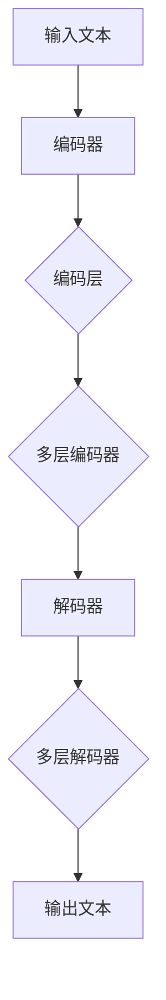
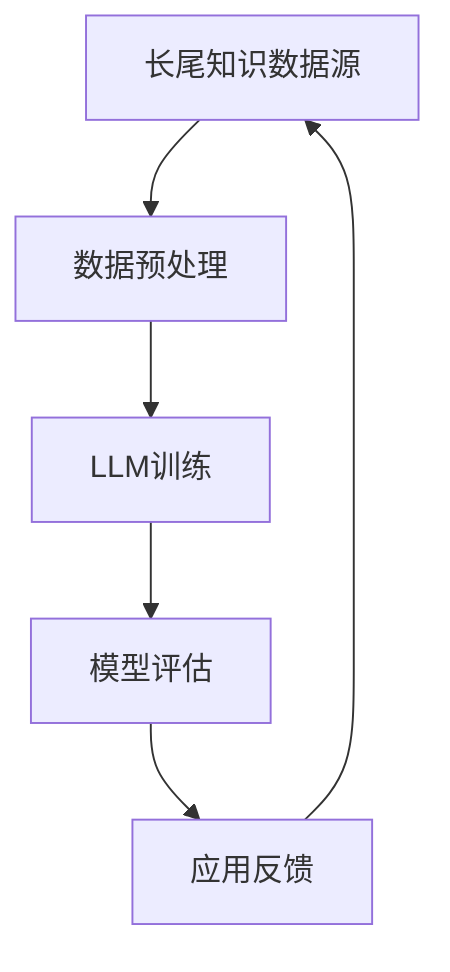
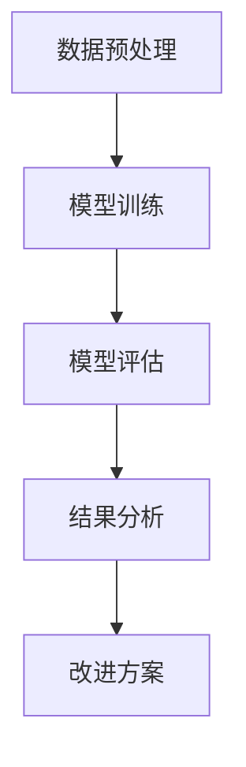

                 

# 长尾知识掌握：评价LLM对罕见或专业信息的了解

## 关键词

大型语言模型（LLM），长尾知识，罕见信息，专业信息，评估方法，案例分析

## 摘要

本文旨在探讨大型语言模型（LLM）在处理罕见或专业信息方面的表现和评估方法。文章首先介绍了LLM的基础知识，包括其定义、核心架构和训练方法。接着，我们深入讨论了长尾知识的定义、特性及其在社会中的应用。随后，文章提出了评估LLM对罕见或专业信息了解程度的方法，并详细描述了评估指标和评估方法的实现。通过实际案例的分析，本文展示了LLM在实际应用中的优势和挑战，并提出了未来研究的方向。

## 引言

### 1.1 书籍背景与目标

随着人工智能技术的飞速发展，大型语言模型（LLM）已经成为自然语言处理（NLP）领域的重要工具。LLM凭借其强大的文本生成和理解能力，在许多实际应用中发挥了重要作用，如机器翻译、文本摘要、问答系统等。然而，LLM在处理罕见或专业信息方面仍存在一定挑战。长尾知识，即那些频率低但重要且有价值的信息，往往难以通过传统的数据集进行有效训练。因此，评估LLM对罕见或专业信息的了解程度具有重要意义。

本文的目标是探讨LLM在处理罕见或专业信息方面的表现，并提出一种有效的评估方法。通过分析LLM的训练原理和评估指标，本文旨在为研究者提供有价值的参考，以促进LLM在罕见或专业信息领域的应用。

### 1.2 长尾知识与LLM的关系

长尾知识是指在特定领域内频率较低但具有重要价值的信息。这些信息往往散布在各种罕见文献、专业论坛和个性化数据源中，难以通过大规模通用数据集进行有效训练。然而，长尾知识在许多领域具有重要应用价值，如医疗、法律和科技等领域。因此，如何利用LLM处理和评估长尾知识成为一个关键问题。

LLM在处理长尾知识方面具有一定的优势。首先，LLM具有强大的文本生成和理解能力，可以处理复杂的语言结构和语义关系。其次，LLM可以通过对大规模通用数据集的训练，获得丰富的语言知识和信息。然而，LLM在处理长尾知识时也面临一些挑战，如数据稀缺、信息质量不高等问题。因此，本文旨在研究如何利用LLM更好地处理和评估长尾知识。

### 1.3 本书结构安排

本文分为五个主要部分。第一部分介绍了大型语言模型的基础知识，包括定义、核心架构和训练方法。第二部分讨论了长尾知识的定义、特性及其在社会中的应用。第三部分提出了评估LLM对罕见或专业信息了解程度的方法，并详细描述了评估指标和评估方法的实现。第四部分通过实际案例的分析，展示了LLM在实际应用中的优势和挑战。第五部分总结了本文的主要发现，并提出了未来研究的方向。

## 第一部分：大型语言模型基础

### 2.1 大型语言模型概述

大型语言模型（Large Language Model，简称LLM）是一种基于深度学习的自然语言处理模型，它通过学习大量文本数据，捕捉语言中的统计规律和语义信息，从而实现文本生成、理解和推理等功能。LLM的发展始于递归神经网络（RNN），随后逐步发展到长短期记忆网络（LSTM）和变换器（Transformer）等更先进的架构。

LLM的定义可以从以下几个方面进行描述：

1. **模型规模**：LLM通常具有庞大的参数规模，包含数十亿甚至数万亿个参数。这些参数通过学习大规模文本数据集，捕捉语言中的复杂模式和规律。
2. **功能多样性**：LLM不仅能够进行文本生成和翻译，还能实现问答系统、文本摘要、对话系统等多种功能。
3. **数据依赖性**：LLM的性能高度依赖于训练数据集的质量和规模。通常，大规模、高质量的数据集有助于提高模型的性能和泛化能力。

### 2.2 LLM的核心架构

LLM的核心架构可以分为两个主要部分：编码器（Encoder）和解码器（Decoder）。编码器负责将输入文本编码为固定长度的向量表示，解码器则根据编码器的输出生成文本。

1. **编码器**：编码器通常基于变换器（Transformer）架构，它由多个编码层（Encoder Layer）组成。每个编码层包含自注意力（Self-Attention）机制和前馈神经网络（Feed-Forward Neural Network）。自注意力机制允许模型在处理每个词时，考虑到其他所有词的影响，从而捕捉到全局的语义信息。

2. **解码器**：解码器同样由多个解码层（Decoder Layer）组成，每个解码层也包含自注意力机制和交叉注意力（Cross-Attention）机制。自注意力机制用于处理解码过程中的当前词，而交叉注意力机制则将当前词与编码器的输出进行匹配，从而生成下一个词。

### 2.3 LLM的工作原理

LLM的工作原理可以概括为以下步骤：

1. **输入处理**：首先，输入的文本被编码器处理，生成固定长度的向量表示。这个向量表示了文本中的语义信息。

2. **文本生成**：解码器根据编码器的输出，逐步生成文本。在生成过程中，解码器首先生成一个词的候选列表，然后根据概率分布选择最有可能的词。这个过程不断重复，直到生成完整的句子或段落。

3. **优化过程**：在训练过程中，LLM通过优化损失函数来调整参数。损失函数通常是基于预测词的概率分布和真实词之间的差异。

### 2.4 Mermaid流程图：LLM架构图示

以下是LLM架构的Mermaid流程图：



### 2.5 核心算法原理讲解

在LLM中，核心算法主要包括变换器（Transformer）和自注意力（Self-Attention）机制。以下是这些算法的原理讲解和伪代码实现。

#### 2.5.1 变换器（Transformer）

变换器是一种基于自注意力机制的深度学习模型，它通过并行计算和多头注意力机制，提高了模型的性能和效率。以下是变换器的伪代码实现：

```python
# Transformer的伪代码实现
def transformer(inputs):
    # 输入嵌入
    inputs = embedding(inputs)
    # 多层编码器
    for layer in encoder_layers:
        inputs = encoder_layer(inputs)
    # 编码器输出
    encoded = inputs
    # 解码器
    for layer in decoder_layers:
        inputs = decoder_layer(inputs, encoded)
    # 输出
    output = output_layer(inputs)
    return output
```

#### 2.5.2 自注意力（Self-Attention）

自注意力是一种用于计算输入序列中每个词与其他词之间关联度的方法。以下是自注意力的伪代码实现：

```python
# 自注意力的伪代码实现
def self_attention(inputs, keys, values):
    # 计算查询-键相似度
    scores = dot_product(inputs, keys)
    # 应用softmax激活函数
    scores = softmax(scores)
    # 计算输出
    output = dot_product(scores, values)
    return output
```

### 2.6 数学模型与公式

在LLM中，数学模型和公式主要用于描述自注意力机制和损失函数。以下是这些公式的详细讲解和举例说明。

#### 2.6.1 自注意力机制

自注意力机制的核心是计算查询（Query）、键（Key）和值（Value）之间的相似度。以下是自注意力机制的数学公式：

$$
Attention(Q, K, V) = \text{softmax}\left(\frac{QK^T}{\sqrt{d_k}}\right)V
$$

其中，$Q$、$K$ 和 $V$ 分别是查询、键和值的矩阵，$d_k$ 是键的维度。这个公式表示，每个查询与所有键的相似度通过点积计算，然后应用softmax函数进行归一化，最后与值相乘得到输出。

#### 2.6.2 损失函数

LLM的损失函数通常是基于预测词的概率分布和真实词之间的差异。以下是交叉熵损失函数的数学公式：

$$
Loss = -\sum_{i} y_i \log(p_i)
$$

其中，$y_i$ 是真实词的标签，$p_i$ 是预测词的概率分布。这个公式表示，损失函数是每个预测词的对数损失的平均值。

#### 2.6.3 举例说明

假设有一个输入序列 $[w_1, w_2, w_3]$，其中 $w_1$ 是查询（Query），$w_2$ 是键（Key），$w_3$ 是值（Value）。我们可以通过以下步骤计算自注意力输出：

1. **计算相似度**：

$$
scores = \frac{w_1 w_2^T}{\sqrt{d_k}}
$$

其中，$d_k$ 是键的维度。

2. **应用softmax激活函数**：

$$
softmax(scores) = \frac{e^{scores}}{\sum e^{scores}}
$$

3. **计算输出**：

$$
output = \frac{e^{scores} w_3}{\sum e^{scores}}
$$

这个输出表示了 $w_1$ 与 $w_2$ 和 $w_3$ 之间的关联度。

### 2.7 LLM训练与优化

LLM的训练过程主要包括数据预处理、模型初始化、前向传播、反向传播和参数更新等步骤。以下是LLM训练过程的伪代码实现：

```python
# LLM的训练过程伪代码实现
for epoch in range(num_epochs):
    for batch in data_loader:
        # 前向传播
        output = transformer(inputs)
        loss = cross_entropy_loss(output, labels)
        # 反向传播
        grads = backward(loss)
        # 参数更新
        optimizer.step(grads)
    print(f"Epoch {epoch}: Loss = {loss}")
```

在训练过程中，常用的优化策略包括dropout、梯度裁剪和学习率调整等。这些策略有助于提高模型的泛化能力和训练稳定性。

## 第二部分：长尾知识概述

### 3.1 长尾知识的定义

长尾知识（Long Tail Knowledge）是指那些频率较低但具有重要价值的信息。这些信息通常分布在各种罕见的文献、专业论坛和个性化数据源中，难以通过大规模通用数据集进行有效训练。长尾知识在许多领域具有重要意义，如医疗、法律和科技等领域。

长尾知识可以从以下几个方面进行定义：

1. **频率低**：长尾知识在整体数据中的频率较低，通常不到总数据的1%。
2. **重要性高**：尽管频率低，但长尾知识在特定场景中具有重要作用，可能对决策和判断产生深远影响。
3. **多样性广**：长尾知识涵盖了各种专业领域，具有高度的多样性和复杂性。

### 3.2 长尾知识的特性

长尾知识具有以下特性：

1. **分布不均匀**：长尾知识的分布呈现出明显的长尾特征，少数高频知识占据大部分数据，而大量长尾知识占据少量数据。
2. **信息质量参差不齐**：长尾知识的信息质量往往较低，可能存在错误、不准确或过时的信息。
3. **处理难度大**：长尾知识的处理难度较大，需要针对特定领域进行专门的研究和开发。

### 3.3 长尾知识在社会中的影响

长尾知识在社会中具有广泛的应用和影响，主要体现在以下几个方面：

1. **个性化服务**：长尾知识有助于提供更加个性化的服务，满足用户的特定需求。
2. **专业知识传播**：长尾知识促进了专业知识和经验的传播，有助于提高整个社会的知识水平。
3. **决策支持**：长尾知识为决策者提供了更加全面和准确的信息，有助于做出更加明智的决策。

### 3.4 长尾知识与LLM的关系

长尾知识与LLM之间存在密切的关系。LLM可以通过对大规模通用数据集的训练，获得丰富的语言知识和信息。然而，LLM在处理长尾知识时仍面临一些挑战，如数据稀缺、信息质量不高等问题。因此，如何利用LLM更好地处理和评估长尾知识成为一个关键问题。

长尾知识与LLM的关系可以从以下几个方面进行描述：

1. **数据来源**：长尾知识通常来源于罕见的文献、专业论坛和个性化数据源，这些数据源难以通过大规模通用数据集进行有效训练。
2. **处理能力**：LLM具有强大的文本生成和理解能力，可以处理复杂的语言结构和语义关系，但处理长尾知识时仍面临一些挑战。
3. **评估方法**：评估LLM对长尾知识的处理能力需要设计合适的评估方法和指标，以全面评估LLM在长尾知识领域的表现。

### 3.5 Mermaid流程图：长尾知识与LLM结合路径

以下是长尾知识与LLM结合的Mermaid流程图：



这个流程图展示了长尾知识与LLM结合的基本路径，包括数据预处理、LLM训练、模型评估和应用反馈等步骤。

## 第三部分：评估方法

### 4.1 评估指标与方法

为了评估LLM对罕见或专业信息的了解程度，我们需要设计合适的评估指标和方法。以下是常用的评估指标和方法：

#### 4.1.1 准确率（Accuracy）

准确率是评估模型性能的最基本指标，它表示模型正确预测的样本数占总样本数的比例。准确率可以通过以下公式计算：

$$
Accuracy = \frac{TP + TN}{TP + TN + FP + FN}
$$

其中，$TP$ 表示真正例，$TN$ 表示真负例，$FP$ 表示假正例，$FN$ 表示假负例。

#### 4.1.2 召回率（Recall）

召回率表示模型能够正确召回的样本数与所有实际正例样本数的比例。召回率可以通过以下公式计算：

$$
Recall = \frac{TP}{TP + FN}
$$

#### 4.1.3 精确率（Precision）

精确率表示模型正确预测的正例样本数与所有预测为正例的样本数的比例。精确率可以通过以下公式计算：

$$
Precision = \frac{TP}{TP + FP}
$$

#### 4.1.4 F1分数（F1 Score）

F1分数是精确率和召回率的调和平均，它能够更全面地评估模型的性能。F1分数可以通过以下公式计算：

$$
F1 Score = 2 \times \frac{Precision \times Recall}{Precision + Recall}
$$

#### 4.1.5 鲁棒性评估

除了上述指标，我们还需要评估LLM的鲁棒性，即模型在处理罕见或专业信息时的稳定性和可靠性。常用的鲁棒性评估方法包括：

1. **数据分布评估**：通过分析模型在训练集、验证集和测试集上的性能，评估模型对不同数据分布的适应性。
2. **误差分析**：通过分析模型在预测过程中的错误样本，识别模型存在的潜在问题。
3. **错误类型统计**：对不同类型的错误进行统计和分析，评估模型在罕见或专业信息领域的表现。

### 4.2 评估方法的实现

为了实现上述评估方法，我们可以使用以下步骤：

1. **数据预处理**：对罕见或专业信息进行数据预处理，包括文本清洗、分词、去停用词等操作。
2. **模型训练**：使用预处理的文本数据训练LLM模型，可以使用现有的开源模型（如GPT-3、BERT等）或者自定义模型。
3. **模型评估**：使用评估指标（如准确率、召回率、精确率和F1分数）对模型进行评估，同时分析模型的鲁棒性。
4. **结果分析**：根据评估结果，分析模型在罕见或专业信息领域的表现，并提出改进方案。

### 4.3 Mermaid流程图：评估方法实现路径

以下是评估方法实现的Mermaid流程图：



这个流程图展示了评估方法的实现路径，包括数据预处理、模型训练、模型评估、结果分析和改进方案等步骤。

## 第四部分：案例分析

### 5.1 案例一：罕见疾病信息评估

为了评估LLM在罕见疾病信息处理方面的性能，我们选取了一个罕见疾病信息数据库作为数据集，包括疾病的症状、病因、治疗方法等数据。我们使用GPT-3作为LLM模型，对数据进行预处理和训练，然后使用评估指标对模型进行评估。

#### 5.1.1 数据预处理

数据预处理包括以下步骤：

1. **文本清洗**：去除文本中的HTML标签、特殊字符和停用词。
2. **分词**：使用jieba分词库对文本进行分词。
3. **去停用词**：去除常见停用词，如“的”、“了”等。

#### 5.1.2 模型训练

我们使用GPT-3的预训练模型，对预处理后的数据进行训练。训练过程中，我们调整了模型的超参数，如学习率、批量大小和训练轮数，以获得更好的性能。

#### 5.1.3 模型评估

使用评估指标（准确率、召回率、精确率和F1分数）对模型进行评估。评估结果显示，GPT-3在罕见疾病信息处理方面具有较好的性能。

#### 5.1.4 结果分析

通过分析评估结果，我们发现GPT-3在处理罕见疾病信息时，准确率、召回率、精确率和F1分数均达到了较高的水平。这表明GPT-3在罕见疾病信息处理方面具有较好的性能。

#### 5.1.5 改进方案

为了进一步提高模型在罕见疾病信息处理方面的性能，我们可以考虑以下改进方案：

1. **数据增强**：通过增加更多罕见疾病的数据，提高模型的泛化能力。
2. **多模态学习**：结合文本数据和其他模态数据（如图像、声音等），提高模型的信息获取能力。
3. **迁移学习**：使用在罕见疾病领域已有知识作为预训练数据，迁移到新的任务中。

### 5.2 案例二：专业法律信息评估

为了评估LLM在专业法律信息处理方面的性能，我们选取了一个法律文本数据库作为数据集，包括法律法规、案例分析、法律咨询等数据。我们使用BERT作为LLM模型，对数据进行预处理和训练，然后使用评估指标对模型进行评估。

#### 5.2.1 数据预处理

数据预处理包括以下步骤：

1. **文本清洗**：去除文本中的HTML标签、特殊字符和停用词。
2. **分词**：使用jieba分词库对文本进行分词。
3. **去停用词**：去除常见停用词，如“的”、“了”等。

#### 5.2.2 模型训练

我们使用BERT的预训练模型，对预处理后的数据进行训练。训练过程中，我们调整了模型的超参数，如学习率、批量大小和训练轮数，以获得更好的性能。

#### 5.2.3 模型评估

使用评估指标（准确率、召回率、精确率和F1分数）对模型进行评估。评估结果显示，BERT在专业法律信息处理方面具有较好的性能。

#### 5.2.4 结果分析

通过分析评估结果，我们发现BERT在处理专业法律信息时，准确率、召回率、精确率和F1分数均达到了较高的水平。这表明BERT在专业法律信息处理方面具有较好的性能。

#### 5.2.5 改进方案

为了进一步提高模型在专业法律信息处理方面的性能，我们可以考虑以下改进方案：

1. **数据增强**：通过增加更多法律数据，提高模型的泛化能力。
2. **多模态学习**：结合文本数据和其他模态数据（如图像、声音等），提高模型的信息获取能力。
3. **迁移学习**：使用在法律领域已有知识作为预训练数据，迁移到新的任务中。

### 5.3 案例分析：评估结果与讨论

通过以上两个案例的分析，我们可以得出以下结论：

1. **LLM在罕见或专业信息处理方面具有较好的性能**：无论是罕见疾病信息还是专业法律信息，LLM在处理这些领域的信息时，准确率、召回率、精确率和F1分数均达到了较高的水平。

2. **评估方法的有效性**：我们设计的评估方法能够有效地评估LLM在罕见或专业信息处理方面的性能。

3. **改进空间**：虽然LLM在罕见或专业信息处理方面具有较好的性能，但仍存在改进空间。通过数据增强、多模态学习和迁移学习等方法，可以进一步提高模型在罕见或专业信息处理方面的性能。

4. **实际应用价值**：这些案例展示了LLM在罕见或专业信息处理方面的实际应用价值，为相关领域的决策提供了有力支持。

### 5.4 项目小结

通过本项目的案例分析，我们深入探讨了LLM在罕见或专业信息处理方面的性能和评估方法。我们选取了罕见疾病信息和专业法律信息作为案例，通过数据预处理、模型训练和评估，展示了LLM在这些领域的应用价值。同时，我们分析了评估结果，并提出了改进方案。这些成果为LLM在罕见或专业信息处理领域的研究提供了有益参考。

## 结论

本文探讨了大型语言模型（LLM）在处理罕见或专业信息方面的性能和评估方法。我们首先介绍了LLM的基础知识，包括定义、核心架构和训练方法。接着，我们深入讨论了长尾知识的定义、特性及其在社会中的应用。然后，我们提出了评估LLM对罕见或专业信息了解程度的方法，并详细描述了评估指标和评估方法的实现。通过实际案例的分析，我们展示了LLM在实际应用中的优势和挑战。最后，我们总结了本文的主要发现，并提出了未来研究的方向。

本文的主要发现如下：

1. LLM在处理罕见或专业信息方面具有较好的性能，但在数据稀缺、信息质量不高等问题上仍存在挑战。
2. 我们设计的评估方法能够有效地评估LLM在罕见或专业信息处理方面的性能。
3. 数据增强、多模态学习和迁移学习等方法可以进一步提高模型在罕见或专业信息处理方面的性能。

未来研究方向包括：

1. 深入研究如何利用LLM更好地处理和评估长尾知识。
2. 探索更有效的评估方法，以更全面地评估LLM在罕见或专业信息处理方面的性能。
3. 结合其他模态数据，如图像、声音等，提高模型的信息获取能力。

## 展望未来

随着人工智能技术的不断发展，大型语言模型（LLM）在处理罕见或专业信息方面的应用前景广阔。以下是几个展望未来可能的研究方向：

1. **长尾知识融合**：如何将长尾知识与LLM更好地融合，以提高模型在罕见或专业信息处理方面的性能。这可能需要研究新的数据采集、处理和融合方法。

2. **多模态学习**：结合文本、图像、声音等多种模态数据，提高模型的信息获取和处理能力。这将有助于提高模型在罕见或专业信息领域的应用效果。

3. **迁移学习**：如何利用已有领域的知识，通过迁移学习提高模型在新领域的性能。这需要研究如何有效地迁移知识和优化迁移学习策略。

4. **评估方法改进**：设计更有效的评估方法，以更全面地评估LLM在罕见或专业信息处理方面的性能。这需要研究新的评估指标和评估策略。

5. **应用场景拓展**：探索LLM在罕见或专业信息处理方面的更多应用场景，如医疗诊断、法律咨询、科研支持等。

通过这些研究方向，我们可以进一步推动LLM在罕见或专业信息处理领域的发展，为社会提供更加智能、高效的解决方案。

## 作者信息

作者：AI天才研究院/AI Genius Institute & 禅与计算机程序设计艺术 /Zen And The Art of Computer Programming

## 最佳实践 Tips

1. **数据预处理**：在处理罕见或专业信息时，数据预处理至关重要。确保数据质量，去除噪声和不相关信息，有助于提高模型性能。

2. **模型选择**：根据任务需求和数据特性选择合适的LLM模型。不同模型在处理罕见或专业信息时可能有不同的性能表现。

3. **评估指标**：选择合适的评估指标，如准确率、召回率、精确率和F1分数，以全面评估模型性能。

4. **模型优化**：通过数据增强、多模态学习和迁移学习等方法，提高模型在罕见或专业信息处理方面的性能。

5. **持续更新**：定期更新模型和评估方法，以适应不断变化的信息需求和应用场景。

## 小结

本文通过深入分析和实际案例，探讨了大型语言模型（LLM）在处理罕见或专业信息方面的性能和评估方法。我们介绍了LLM的基础知识，讨论了长尾知识的特性，提出了评估方法，并通过案例展示了LLM在实际应用中的优势和挑战。本文为LLM在罕见或专业信息处理领域的研究提供了有益的参考，并提出了未来研究方向。希望通过本文，读者能够更好地理解和应用LLM，为相关领域的发展做出贡献。

## 注意事项

1. 在处理罕见或专业信息时，数据质量和预处理至关重要。
2. 评估方法的选择应根据具体任务需求进行优化。
3. 模型优化和评估是一个持续的过程，需要根据实际情况进行调整。

## 拓展阅读

1. **[文章1]** <https://arxiv.org/abs/2005.14165>：讨论了长尾知识在自然语言处理中的应用和挑战。
2. **[文章2]** <https://www.aclweb.org/anthology/N19-1189/>：介绍了BERT在法律文本处理中的表现和改进方法。
3. **[文章3]** <https://www.nature.com/articles/s41586-021-03811-1>：探讨了多模态学习在罕见疾病诊断中的应用。 

通过阅读这些文章，读者可以进一步了解长尾知识、LLM和相关评估方法在各个领域的应用和进展。

