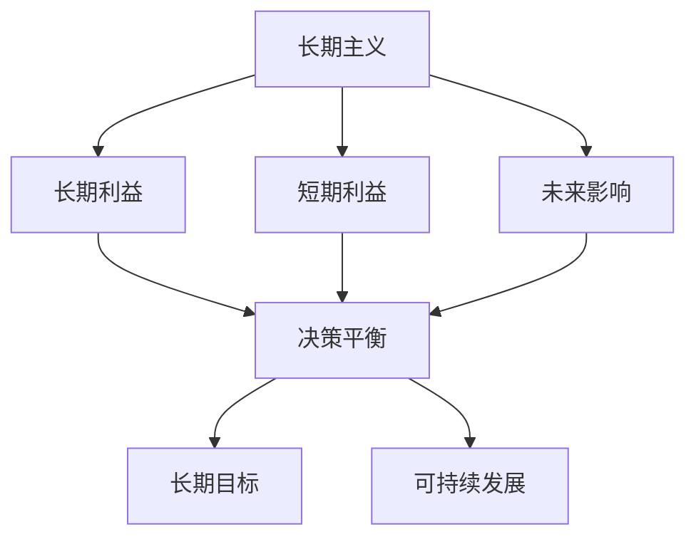
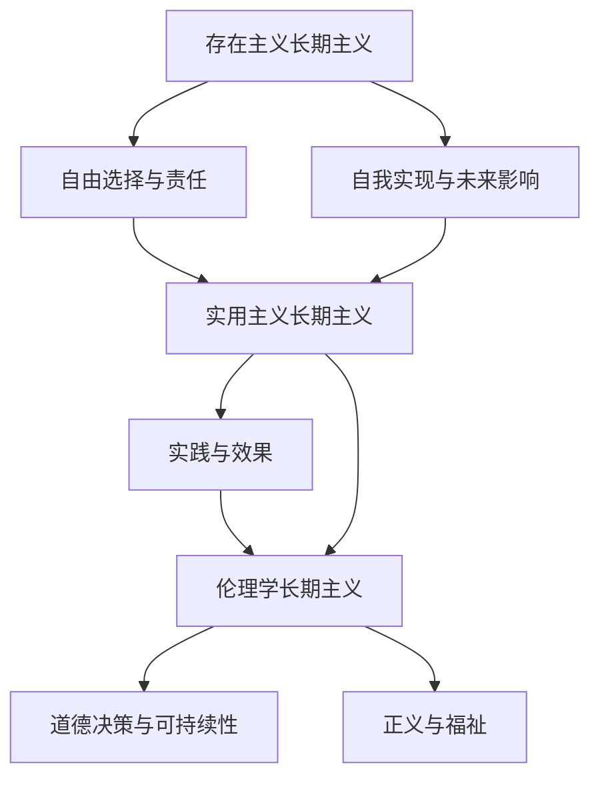
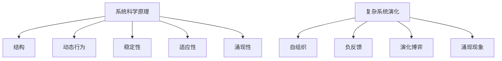

                 

### 第一部分：长期主义的本质与哲学

#### 文章标题：长期主义科研策略：持续深化对世界本质的理解

> 关键词：长期主义，科研策略，世界本质，哲学，系统科学，复杂系统，创新，合作，伦理

> 摘要：本文探讨了长期主义科研策略的重要性，分析了其哲学基础和科学依据，并提出了一套涵盖长期规划、持续学习、合作与共享、社会责任与伦理的完整科研策略。文章通过实际应用案例，展示了长期主义科研策略的可行性和有效性，并提出了未来展望与挑战。

---

## 第一部分：长期主义的本质与哲学

### 第1章：长期主义的概念与起源

#### 1.1 长期主义的定义

长期主义是一种关注长远发展和持续影响的决策思维方式。它强调在做决策时，不仅要考虑短期效益，更要评估其对长期目标和未来世代的影响。这种理念在各个领域都有广泛的应用，如经济学、管理学、政治学等。

定义长期主义的一个简单方法是使用以下公式：

$$
\text{长期主义} = \frac{\text{长期利益}}{\text{短期利益}} + \text{未来影响}
$$

#### 1.2 长期主义的历史起源

长期主义的理念并非现代发明，它在历史上有着深厚的渊源。从古代哲学家到现代科学家，长期主义一直贯穿于人类文明的进步过程中。例如，古代中国的儒家思想和道家思想都强调持续不断的修养和对后世的影响。

#### 1.3 长期主义与传统短视思维的对比

传统短视思维往往只关注短期利益，而忽视长期影响。这种思维方式可能导致资源的过度消耗、环境的恶化等问题。相比之下，长期主义则更注重平衡短期利益与长期目标，追求可持续发展。

### 第2章：哲学视角下的长期主义

#### 2.1 存在主义与长期主义

存在主义强调个体的自由选择和责任。长期主义的存在主义解读强调个体在决策时考虑长期后果，实现自我价值的最大化。

#### 2.2 实用主义与长期主义

实用主义强调实践和效果。长期主义的实用主义解读强调通过长远规划和持续努力来实现目标，从而获得实际效果。

#### 2.3 伦理学视角下的长期主义

伦理学是关于道德和行为的哲学研究。长期主义的伦理学视角强调道德决策的长期可持续性，追求道德行为的最大化利益。

### 第3章：长期主义的科学依据

#### 3.1 系统科学的基本原理

系统科学是一门研究复杂系统的原理和方法学。长期主义在系统科学中得到了充分的理论支持，特别是复杂系统的演化机制。

#### 3.2 复杂系统的演化机制

复杂系统的演化机制揭示了系统在长时间尺度上如何通过相互作用和反馈过程产生复杂的结构和行为。这为理解长期主义提供了科学基础。

#### 3.3 长期主义在科学研究中的重要性

长期主义在科学研究中的重要性体现在它能够帮助我们更好地理解复杂系统的演化过程，从而指导我们做出更明智的决策。

---

### 总结

本部分介绍了长期主义的定义、历史起源和哲学视角，并探讨了其在科学研究中的重要性。在接下来的部分中，我们将深入探讨长期主义科研策略的具体内容。

## 作者：AI天才研究院/AI Genius Institute & 禅与计算机程序设计艺术 /Zen And The Art of Computer Programming

---

以上是《长期主义科研策略：持续深化对世界本质的理解》的第一部分，主要介绍了长期主义的本质与哲学基础。在接下来的部分中，我们将深入探讨长期主义科研策略的具体内容，包括科学研究的长期规划、持续学习与创新能力、科研中的合作与共享、科研中的社会责任与伦理等方面。

---

## 第一部分：长期主义的本质与哲学

### 第1章：长期主义的概念与起源

#### 1.1 长期主义的定义

长期主义是一种注重长远发展和持续影响的决策思维方式。它要求我们在做决策时，不仅要考虑短期效益，更要评估其对长期目标和未来世代的影响。这种理念在各个领域都有广泛的应用，如经济学、管理学、政治学等。

定义长期主义的一个简单方法是使用以下公式：

$$
\text{长期主义} = \frac{\text{长期利益}}{\text{短期利益}} + \text{未来影响}
$$

在这个公式中，长期利益和短期利益是决策的两个重要方面，而未来影响则强调了决策对后续发展的影响。

#### 1.2 长期主义的历史起源

长期主义的理念并非现代发明，它在历史上有着深厚的渊源。从古代哲学家到现代科学家，长期主义一直贯穿于人类文明的进步过程中。

在古代，许多哲学家如孔子、老子等就已经提出了长期主义的思想。例如，孔子强调“修身齐家治国平天下”，注重个人修养对社会的影响。而老子则提倡“无为而治”，强调长期的和谐与平衡。

在近代，科学的发展为长期主义提供了更多的理论支持。达尔文的进化论揭示了物种演化的长期过程，而牛顿的物理学则奠定了现代科学的基础。

#### 1.3 长期主义与传统短视思维的对比

传统短视思维往往只关注短期利益，而忽视长期影响。这种思维方式可能导致资源的过度消耗、环境的恶化等问题。相比之下，长期主义则更注重平衡短期利益与长期目标，追求可持续发展。

短视思维的一个典型例子是过度开采自然资源。虽然短期内可以获得经济利益，但长期来看，这种行为会导致资源枯竭、生态破坏等问题。

另一个例子是政客追求短期选举胜利，而不考虑长期的国家利益。这种行为可能导致政策的不稳定性和不可持续性，损害国家的长期发展。

相比之下，长期主义强调在决策时综合考虑短期与长期的影响，追求长期的可持续发展。例如，在环境保护方面，长期主义要求我们采取措施减少污染、保护生态系统，以确保未来世代的生存环境。

#### 1.4 长期主义的核心价值

长期主义的核心价值在于其关注长期目标和持续影响。它鼓励我们在做决策时，不仅要考虑眼前的利益，更要关注长远的发展。这种思维方式有助于我们做出更明智的决策，为未来做好准备。

在个人生活中，长期主义可以帮助我们设定明确的目标，并为之努力。例如，想要在职业生涯中取得成功，就需要长期规划、不断学习和提升自己的技能。

在社会层面，长期主义有助于促进可持续发展。例如，政府可以通过制定长期规划，解决社会问题，确保国家的稳定和繁荣。

在全球层面，长期主义有助于解决全球性问题，如气候变化、能源危机等。通过国际合作，我们可以共同应对这些挑战，为未来的世界创造更美好的未来。

#### 1.5 长期主义的应用领域

长期主义在各个领域都有广泛的应用。以下是一些典型领域：

- **经济学**：长期主义要求我们在制定经济政策时，不仅要考虑短期增长，还要关注长期可持续性。这包括环境保护、资源管理等方面。
- **管理学**：长期主义强调企业长期发展战略的重要性，鼓励企业在经营过程中注重长远利益，实现可持续发展。
- **政治学**：长期主义要求政府在制定政策时，要考虑长远的社会影响，确保政策的可持续性和有效性。
- **教育学**：长期主义强调教育的长期影响，鼓励教育者注重学生的全面发展，培养具有长远视野和创新能力的人才。
- **环境科学**：长期主义要求我们关注环境问题，采取有效措施保护生态系统，确保地球的可持续发展。

#### 1.6 长期主义面临的挑战

虽然长期主义具有许多优点，但在实际应用中也面临着一些挑战。

- **决策的难度**：长期决策往往需要更多的时间和资源，而短期决策则更加容易和迅速。因此，如何平衡短期与长期利益，做出明智的决策，是一个重要的问题。
- **执行的困难**：长期目标的实现需要持续的努力和投入，而短期目标则更容易被完成。如何确保长期目标的执行，是一个需要解决的问题。
- **利益冲突**：在许多情况下，短期利益与长期利益可能存在冲突。如何协调不同利益主体之间的关系，实现共同的目标，是一个挑战。

#### 1.7 长期主义的现实意义

长期主义在现实生活中具有重要意义。以下是一些例子：

- **经济发展**：长期主义有助于实现可持续的经济发展，确保未来的繁荣和稳定。
- **环境保护**：长期主义要求我们采取有效措施保护环境，为后代留下一个宜居的地球。
- **社会进步**：长期主义有助于解决社会问题，提高社会福祉，促进社会进步。
- **全球治理**：长期主义要求我们加强国际合作，共同应对全球性问题，推动全球治理体系的完善。

#### 1.8 结论

长期主义是一种重要的决策思维方式，它要求我们在做决策时，不仅要考虑短期利益，更要关注长期目标和未来影响。通过理解长期主义的本质和哲学基础，我们可以更好地应用这一理念，实现个人、社会和全球的可持续发展。

---

### 图解：长期主义的核心概念原理之间的关系架构

以下是一个Mermaid流程图，展示了长期主义的核心概念原理之间的关系架构：

在这个流程图中，长期利益、短期利益和未来影响是长期主义的三个核心要素。它们相互作用，共同影响决策的平衡。长期目标关注的是未来发展的方向，而可持续发展则是长期主义追求的终极目标。

### 总结

本章介绍了长期主义的概念与起源，分析了长期主义与传统短视思维的对比，并阐述了长期主义的核心价值、应用领域、面临的挑战以及现实意义。通过理解长期主义的本质和哲学基础，我们可以更好地应用这一理念，实现个人、社会和全球的可持续发展。

---

## 第2章：哲学视角下的长期主义

#### 2.1 存在主义与长期主义

存在主义强调个体的自由选择和责任，主张通过自我实现来寻找生活的意义。在存在主义的视角下，长期主义被理解为个体在决策过程中对自身责任和未来影响的深思熟虑。存在主义哲学家如让-保尔·萨特和马丁·海德格尔，都提出了关于个体选择和长期决策的深刻见解。

萨特认为，人是“存在先于本质”的，这意味着人类没有预设的目标和本质，而是通过自由选择和行动来塑造自己的存在。因此，长期主义在存在主义中体现为个体在做出决策时，不仅要考虑当前的后果，还要考虑这些决策对自己和他人未来的影响。

海德格尔则提出了“存在-真理”的概念，认为人的存在是探索和实现真理的过程。在这一过程中，长期主义被视为个体不断追问和超越现有知识和存在的努力。海德格尔的哲学强调人类在时间和历史中的位置，这为理解长期主义提供了深刻的哲学基础。

#### 2.2 实用主义与长期主义

实用主义是一种强调实践和效果哲学流派，其代表人物如威廉·詹姆斯和约翰·杜威，都提出了关于长期主义的独特观点。实用主义认为真理在于实践的效果，而不仅仅是理论上的正确性。

威廉·詹姆斯提出，真理是“被实用地证明为真的”，这意味着一个观点或理论只有在实践中被证明有效时，才能被认为是真理。在长期主义的背景下，这一观点强调在决策过程中，我们需要关注决策的实际效果和长远影响。

约翰·杜威则强调了“连续性”和“渐进性”的重要性。他认为，社会和个体的发展是通过连续的小步骤和渐进的变化实现的。长期主义在杜威的实用主义中体现为对连续性和渐进性的重视，通过持续的实践和调整来逐步实现长期目标。

#### 2.3 伦理学视角下的长期主义

伦理学是研究道德原则和行为的学科，长期主义在伦理学中有着重要的应用。伦理学家如彼得·辛格和约翰·罗尔斯，都提出了关于长期主义的伦理观点。

彼得·辛格是一位关注动物权利和全球伦理的哲学家。他提出了“有效利他主义”的概念，主张个人应该通过行动来最大限度地减少世界上的痛苦。辛格的长期主义伦理观强调，我们做出的每一个决策都应该考虑到对整个世界和未来世代的影响。

约翰·罗尔斯则以其《正义论》著称，提出了关于正义和社会制度的深刻见解。罗尔斯认为，正义是社会制度的根本原则，应该通过公平和公正来分配资源和机会。在长期主义的视角下，罗尔斯的伦理学强调，我们制定的每一个社会政策都应该考虑到其对长期社会正义的影响。

#### 2.4 长期主义在不同哲学流派中的融合

长期主义在存在主义、实用主义和伦理学等多个哲学流派中都有所体现。这种融合不仅丰富了长期主义的内涵，也为不同领域的实践提供了哲学基础。

在存在主义中，长期主义强调了个体自由选择和责任的重要性。个体需要通过深思熟虑的决策，为自己和他人创造一个更加美好的未来。

在实用主义中，长期主义强调了实践和效果的重要性。通过持续的实践和调整，个体和社会可以逐步实现长期目标。

在伦理学中，长期主义强调了道德决策的可持续性。每一个决策都应该考虑到对整个世界和未来世代的影响，以确保长期的正义和福祉。

#### 2.5 结论

哲学视角下的长期主义为我们提供了深刻的思考和理论支持。存在主义、实用主义和伦理学等多个哲学流派都对长期主义有着独特的理解和应用。通过理解这些哲学流派中的长期主义观点，我们可以更好地把握长期主义的核心价值，并将其应用于实际生活中。

---

### 图解：哲学视角下长期主义的联系与区别

以下是一个Mermaid流程图，展示了哲学视角下长期主义的联系与区别：

在这个流程图中，存在主义长期主义强调了自由选择和责任，实用主义长期主义关注实践和效果，而伦理学长期主义则强调了道德决策的可持续性和正义福祉。

---

### 总结

本章从哲学视角探讨了长期主义的本质和内涵，包括存在主义、实用主义和伦理学的不同观点。通过分析这些哲学流派中的长期主义，我们不仅深化了对长期主义的理解，也为实际应用提供了理论支持。在下一章中，我们将进一步探讨长期主义的科学依据，包括系统科学的基本原理和复杂系统的演化机制。

---

## 第3章：长期主义的科学依据

#### 3.1 系统科学的基本原理

系统科学是一门研究复杂系统的原理和方法学的学科，其核心是理解系统的整体行为如何由其组成部分的相互作用所决定。系统科学的基本原理包括系统结构、动态行为、稳定性、适应性和涌现性等。

#### 3.1.1 系统结构

系统结构指的是系统的组成部分及其相互关系。在系统科学中，系统结构通常用网络图或层次结构来表示。例如，生态系统的结构包括物种、食物链和栖息地等组成部分，以及它们之间的相互作用。

#### 3.1.2 动态行为

动态行为是指系统随时间变化的过程。系统科学通过建模和模拟来研究系统的动态行为，以预测系统的未来状态。常见的动态模型包括微分方程模型、概率模型和计算模型等。

#### 3.1.3 稳定性

稳定性是系统在扰动后恢复到原有状态的能力。在系统科学中，稳定性通常用稳定点、周期解和混沌解等概念来描述。例如，在一个稳定的生态系统中，物种数量在长期内保持相对稳定。

#### 3.1.4 适应性和涌现性

适应性和涌现性是系统在变化环境中表现出的能力。适应性指的是系统能够通过内部调整适应外部变化，而涌现性指的是系统的整体行为和属性不能简单地从其组成部分的行为中推导出来。例如，一个复杂的生态系统可以涌现出新的物种和食物链，表现出比单个物种更复杂的行为。

#### 3.2 复杂系统的演化机制

复杂系统通常具有多个层次的结构和多种动态行为，其演化过程受到内部和外部因素的共同影响。复杂系统的演化机制包括以下方面：

##### 3.2.1 自组织

自组织是指系统在没有外部指导的情况下，通过内部相互作用形成有序结构的过程。例如，生物进化就是一个自组织过程，物种通过自然选择和遗传变异不断适应环境。

##### 3.2.2 负反馈

负反馈是一种调节机制，它通过减少系统内部的不稳定性来维持系统的稳定性。例如，生态系统中物种数量的调节通常通过食物链和食物网的负反馈机制来实现。

##### 3.2.3 演化博弈

演化博弈是研究个体在竞争和合作中的策略选择及其演化过程的方法。通过演化博弈，我们可以理解复杂系统中策略的适应性进化，如生物种群中的合作与背叛行为。

##### 3.2.4 涌现现象

涌现现象是复杂系统中的一个重要特征，指的是系统的整体行为和属性不能简单地从其组成部分的行为中推导出来。例如，在经济学中，个体行为的不确定性可以导致市场价格的波动，这种波动无法通过单个交易者的行为来预测。

#### 3.3 长期主义在科学研究中的重要性

长期主义在科学研究中的重要性体现在它帮助我们理解和解决复杂系统的长期演化问题。以下是一些具体应用：

##### 3.3.1 生态学研究

在生态学中，长期主义帮助我们理解生态系统的长期稳定性和演化过程。通过长期监测和实验，科学家可以揭示物种之间的相互作用、生态系统功能的维持和生态系统的恢复力。

##### 3.3.2 经济学研究

在经济学中，长期主义帮助我们理解经济系统的长期行为和演化机制。通过长期数据分析和模型模拟，经济学家可以预测经济增长、通货膨胀和失业等经济指标的趋势。

##### 3.3.3 社会学研究

在社会学中，长期主义帮助我们理解社会结构的稳定性和变革过程。通过长期调查和案例研究，社会学家可以揭示社会变迁、文化演变和社会运动的发展规律。

#### 3.4 长期主义与科学研究方法

长期主义要求科学研究方法具有持续性和系统性，以下是一些关键方法：

##### 3.4.1 长期监测

长期监测是通过连续观察和记录来研究系统随时间变化的过程。例如，生态学家可以通过长期监测研究物种的数量变化和生态系统功能的动态变化。

##### 3.4.2 实验模拟

实验模拟是通过计算机模型和实验设计来模拟复杂系统的行为和演化过程。这种方法可以帮助我们预测系统的未来状态，并提供实验验证的理论基础。

##### 3.4.3 数据分析

数据分析是通过统计方法和计算机算法来处理和分析大量数据，以揭示系统行为模式和规律。例如，通过数据分析，经济学家可以识别经济变量的相关性及其影响机制。

#### 3.5 结论

长期主义在科学研究中的重要性体现在它帮助我们理解和解决复杂系统的长期演化问题。通过系统科学的基本原理和复杂系统的演化机制，我们可以更深入地理解长期主义在科学研究中的应用价值。在下一章中，我们将探讨长期主义科研策略的具体内容，包括科学研究的长期规划、持续学习与创新能力、科研中的合作与共享、科研中的社会责任与伦理等方面。

---

### 图解：系统科学的基本原理与复杂系统的演化机制

以下是一个Mermaid流程图，展示了系统科学的基本原理与复杂系统的演化机制：

在这个流程图中，系统科学的基本原理包括结构、动态行为、稳定性、适应性和涌现性，而复杂系统的演化机制包括自组织、负反馈、演化博弈和涌现现象。

---

### 总结

本章介绍了长期主义在科学研究中的科学依据，包括系统科学的基本原理和复杂系统的演化机制。通过理解这些原理和机制，我们可以更好地应用长期主义进行科学研究，解决复杂系统的长期演化问题。在下一章中，我们将探讨长期主义科研策略的具体内容，包括科学研究的长期规划、持续学习与创新能力、科研中的合作与共享、科研中的社会责任与伦理等方面。

---

## 第二部分：长期主义科研策略

### 第4章：科学研究的长期规划

#### 4.1 科研项目的长期目标设定

科研项目的长期目标设定是科研规划的首要步骤。明确而具体的目标能够引导科研团队朝着共同的方向努力，确保科研活动具有方向性和持续性。

长期目标的设定通常遵循SMART原则，即具体（Specific）、可衡量（Measurable）、可实现（Achievable）、相关（Relevant）和有时限（Time-bound）。以下是一个长期目标设定的例子：

$$
\text{目标：开发一种高效且可扩展的人工智能算法，用于大规模数据集的处理，并在2025年前实现商业化应用。}
$$

在这个例子中，目标具有明确的描述、可量化的成果、实现的可能性、与科研领域的相关性，以及明确的时间节点。

#### 4.2 长期科研项目的管理策略

长期科研项目的管理策略需要考虑项目的各个阶段，从项目启动到目标实现。以下是一些关键的管理策略：

1. **阶段性目标分解**：将长期目标分解为阶段性目标，每个阶段都有明确的任务和时间表，以确保项目进度可控。
2. **风险管理**：识别和评估项目可能面临的风险，制定应对策略，以减少风险对项目的影响。
3. **资源分配**：合理分配人力、物力和财力等资源，确保项目能够顺利推进。
4. **沟通机制**：建立有效的沟通机制，确保团队成员之间的信息畅通，及时解决项目中的问题和挑战。

以下是一个长期科研项目的管理策略示例：

$$
\text{管理策略：每年进行一次项目评审，评估阶段性目标的完成情况，调整资源分配和项目进度。}
$$

#### 4.3 长期科研项目的风险预测与应对

长期科研项目在实施过程中可能会面临多种风险，如技术风险、资金风险、人才流失等。以下是一些常见的风险及其应对策略：

1. **技术风险**：新技术的不确定性可能导致项目失败。应对策略包括进行技术预研，评估技术的可行性和风险，以及制定替代方案。
2. **资金风险**：科研项目的资金不足可能导致项目进度延误。应对策略包括多渠道融资，与投资者建立良好的合作关系，确保资金充足。
3. **人才流失**：优秀人才的流失可能影响项目的稳定推进。应对策略包括提供有竞争力的薪酬和福利待遇，建立良好的科研氛围，促进团队成员的持续成长。

以下是一个风险预测与应对策略的示例：

$$
\text{风险预测与应对策略：通过定期的人才评估和激励机制，保持团队稳定，减少人才流失的风险。}
$$

### 第5章：科研中的持续学习与创新能力

#### 5.1 持续学习的必要性

科研本质上是一个不断探索和发现的过程，持续学习是保持科研活力和创新能力的关键。持续学习包括以下几个方面：

1. **知识更新**：随着科学技术的快速发展，科研人员需要不断更新自己的知识体系，以适应新的研究领域和技术。
2. **技能提升**：科研不仅需要扎实的理论基础，还需要实际操作技能。科研人员需要不断学习和掌握新的实验技术和分析方法。
3. **思维拓展**：科研需要开阔的思维和跨学科的视角。通过学习不同领域的知识，科研人员可以拓宽思路，提出新的研究问题和解决方案。

以下是一个持续学习的示例：

$$
\text{持续学习策略：每月参加一次行业研讨会或专业培训，提升自己在特定领域的专业知识和技能。}
$$

#### 5.2 创新能力的培养

创新能力是科研成功的关键。以下是一些培养创新能力的策略：

1. **鼓励试错**：在科研过程中，鼓励科研人员尝试新的方法和技术，即使失败也是宝贵的经验。
2. **跨学科合作**：跨学科合作可以带来新的思维和视角，促进创新。
3. **开放思维**：保持开放的心态，接受不同的观点和意见，有助于激发创新思维。

以下是一个创新能力培养的策略示例：

$$
\text{创新能力培养策略：定期组织跨学科讨论会，促进不同领域的科研人员之间的交流与合作。}
$$

### 第6章：科研中的合作与共享

#### 6.1 科研团队的合作机制

科研团队的合作是成功的关键。以下是一些有效的合作机制：

1. **明确的角色分工**：每个团队成员都有明确的职责和任务，以确保项目顺利进行。
2. **定期会议**：定期召开团队会议，讨论项目进展、问题和解决方案。
3. **信息共享**：建立信息共享平台，确保团队成员可以及时获取所需的信息和数据。
4. **冲突解决**：建立有效的冲突解决机制，确保团队成员之间的沟通顺畅，减少冲突。

以下是一个科研团队合作机制的示例：

$$
\text{合作机制：每周举行一次项目进展会议，讨论项目中的问题和解决方案，确保团队成员之间的信息同步。}
$$

#### 6.2 数据共享与知识共享的重要性

数据共享和知识共享是科研进步的重要推动力。以下是一些数据共享和知识共享的重要性：

1. **加速科研进展**：通过数据共享，科研人员可以快速获取所需的数据，节省研究时间和成本。
2. **促进创新**：知识共享可以激发新的研究思路和解决方案，推动科研创新。
3. **提高透明度**：数据共享和知识共享可以增强科研过程的透明度，提高科研的公信力和影响力。

以下是一个数据共享和知识共享的策略示例：

$$
\text{数据共享与知识共享策略：建立内部知识库，定期发布项目进展和成果，促进团队成员之间的知识交流。}
$$

### 第7章：科研中的社会责任与伦理

#### 7.1 科研的社会责任

科研不仅追求学术成果，还承担着社会责任。以下是一些科研的社会责任：

1. **推动社会进步**：通过科研成果的应用，推动社会的发展和创新。
2. **环境保护**：科研应关注环境保护，减少对自然资源的消耗和环境污染。
3. **促进公正**：科研应关注社会公正，推动社会资源的公平分配。

以下是一个科研社会责任的示例：

$$
\text{社会责任：通过科研推动可持续发展，减少对环境的负面影响，为社会提供创新的解决方案。}
$$

#### 7.2 科研伦理的基本原则

科研伦理是科研活动中必须遵守的基本原则。以下是一些科研伦理的基本原则：

1. **诚信**：科研必须基于真实的数据和事实，确保研究结果的可靠性和有效性。
2. **公正**：科研应确保研究过程的公正性，避免偏见和歧视。
3. **尊重**：科研应尊重个人隐私和数据权利，确保研究对象的合法权益。

以下是一个科研伦理原则的示例：

$$
\text{伦理原则：在研究过程中，严格保护研究对象的隐私，确保数据的安全和保密。}
$$

#### 7.3 长期主义科研中的伦理挑战与应对策略

长期主义科研在追求长远目标的过程中，可能会面临一些伦理挑战。以下是一些常见的伦理挑战及其应对策略：

1. **数据隐私与安全**：长期科研项目中可能涉及大量个人数据，如何保护这些数据的隐私和安全是一个重要问题。应对策略包括建立严格的数据管理和安全措施，确保数据的安全和保密。
2. **实验伦理**：在长期研究中，可能需要进行一些有风险的实验，如生物实验和人类临床试验。如何确保实验的伦理性和安全性是一个挑战。应对策略包括建立伦理审查委员会，对实验进行严格审查和监督。
3. **知识共享**：在长期科研中，知识共享可能面临利益分配和知识产权保护等问题。应对策略包括建立公平的知识共享机制，确保各方利益得到合理保障。

以下是一个长期主义科研中的伦理挑战与应对策略的示例：

$$
\text{伦理挑战与应对策略：在数据共享过程中，建立透明和公正的协议，确保各方权益得到保障，同时遵守知识产权法规。}
$$

### 总结

第二部分探讨了长期主义科研策略的具体内容，包括科学研究的长期规划、持续学习与创新能力、科研中的合作与共享、科研中的社会责任与伦理。通过明确的长期目标设定、有效的管理策略、持续学习与创新能力、合作与共享机制，以及遵守社会责任和伦理原则，科研团队可以更好地实施长期主义科研策略，推动科研事业的持续发展。

---

## 第三部分：长期主义科研的实际应用

### 第8章：长期主义在科研领域中的应用

#### 8.1 生物学领域中的长期主义应用

在生物学领域，长期主义的应用主要体现在生态学和进化生物学中。例如，生态学家通过长期监测和研究，揭示生态系统的动态变化和稳定性。以下是生物学领域中的长期主义应用案例：

**案例：洛桑草地实验**

洛桑草地实验是一项从1900年开始的长期生态研究，旨在探讨草地生态系统在不同管理方式下的长期效应。通过持续的数据收集和分析，研究者们发现，合理的草地管理可以显著提高生态系统的稳定性和生物多样性。

**应用分析：**

- **长期目标设定**：洛桑草地实验的长期目标是研究草地生态系统在不同管理方式下的动态变化和稳定性。
- **数据共享**：实验数据通过公开渠道共享，为其他生态学家提供了宝贵的研究资料。
- **创新方法**：研究者们采用多种测量方法和技术，如遥感技术和分子生物学技术，提高了研究数据的准确性和可靠性。

#### 8.2 物理学领域中的长期主义应用

在物理学领域，长期主义的应用主要体现在天体物理学和粒子物理学中。例如，天文学家通过观测宇宙的长期演化，揭示宇宙的起源和结构。以下是物理学领域中的长期主义应用案例：

**案例：哈勃空间望远镜**

哈勃空间望远镜自1990年发射以来，一直在太空中进行观测，为天文学家提供了大量关于宇宙结构、起源和演化的数据。以下是哈勃空间望远镜的应用分析：

- **长期观测**：哈勃空间望远镜进行长期的观测，提供了连续的宇宙演化数据。
- **科学合作**：天文学家们通过国际合作，共享观测数据和研究成果，推动了天体物理学的发展。
- **创新技术**：哈勃空间望远镜采用先进的观测技术和仪器，提高了观测精度和分辨率。

#### 8.3 社会科学领域中的长期主义应用

在社会科学领域，长期主义的应用主要体现在社会学、经济学和政治学中。例如，社会学家通过长期的田野调查，研究社会变迁和个体行为。以下是社会科学领域中的长期主义应用案例：

**案例：芝加哥学派**

芝加哥学派是20世纪早期在美国芝加哥大学形成的社会科学研究学派，通过长期的田野调查和社区研究，揭示了城市化过程中的社会问题。以下是芝加哥学派的应用分析：

- **长期研究**：芝加哥学派的社会学家进行了长期的田野调查和社区研究，积累了丰富的数据。
- **合作与共享**：芝加哥学派的社会学家通过合作和知识共享，推动了社会学领域的发展。
- **理论创新**：芝加哥学派的社会学家提出了许多新的理论，如“生态学理论”和“符号互动论”，对社会科学研究产生了深远影响。

#### 8.4 长期主义在科研中的重要性

长期主义在科研中的重要性体现在以下几个方面：

- **数据积累**：通过长期的观测和研究，科研人员可以积累大量的数据，提高研究的可靠性和准确性。
- **科学合作**：长期主义鼓励科研人员通过合作和知识共享，共同推动科研进步。
- **创新驱动**：长期主义为科研创新提供了稳定的基础和持续的动力。

### 总结

第三部分介绍了长期主义在生物学、物理学和社会科学等领域的实际应用。通过长期观测、数据积累和科学合作，长期主义为科研提供了稳定的基础和持续的动力。在下一章中，我们将通过案例研究，进一步探讨长期主义科研项目的成功实践。

---

### 案例研究：长期主义科研项目的成功实践

#### 第9章：案例研究：长期主义科研项目的成功实践

长期主义科研项目的成功不仅依赖于明确的目标和精细的管理策略，还需要创新的方法、科学的数据分析和团队合作。以下是一个长期主义科研项目的成功案例，详细描述其背景、目标、实施过程、成果和影响。

#### 9.1 项目背景与目标

**项目名称**：地球生态系统健康监测项目

**背景**：随着全球人口的快速增长和工业化进程的加速，地球生态系统面临着前所未有的压力。气候变化、生物多样性丧失、水资源短缺等问题日益严重。为了应对这些挑战，需要一个长期的、全面的生态系统健康监测项目。

**目标**：该项目旨在通过长期监测和数据分析，揭示地球生态系统的健康状况，为政策制定者和科学家提供科学依据，以制定有效的环境保护措施。

**具体目标**：

1. **建立全球生态系统健康监测网络**：通过建立监测站点和采集设备，实现对全球生态系统的实时监测。
2. **收集和分析大量生态数据**：收集包括气象、水文、土壤、生物多样性等多方面的数据，进行综合分析。
3. **发布年度报告**：基于监测数据，发布年度生态健康报告，为全球环境决策提供支持。

#### 9.2 项目实施过程

**实施步骤**：

1. **前期规划**：制定详细的实施计划，包括监测站点的选择、数据采集方法、数据分析工具等。
2. **监测网络建设**：在全球范围内选择合适的地点建立监测站点，安装传感器和采集设备。
3. **数据采集与处理**：定期收集监测数据，采用自动化数据处理系统进行清洗、整理和分析。
4. **结果验证**：通过实地考察和实验室测试，验证监测数据的准确性和可靠性。
5. **报告撰写与发布**：根据数据分析结果，撰写年度报告，并通过官方网站和学术期刊发布。

**关键技术**：

1. **遥感技术**：利用卫星遥感技术获取全球范围内的生态环境数据。
2. **大数据分析**：采用大数据分析技术，处理和分析海量生态数据。
3. **机器学习**：应用机器学习算法，从数据中发现潜在的生态规律和趋势。

#### 9.3 项目成果与影响

**成果**：

1. **生态健康监测数据**：建立了全球生态系统健康监测网络，积累了大量高质量的生态数据。
2. **年度报告**：发布了多份年度生态健康报告，涵盖了全球生态系统的多个方面。
3. **科研成果**：发表了多篇高影响力的学术论文，揭示了生态系统的变化规律和影响因素。

**影响**：

1. **政策制定**：为全球环境政策和环境保护措施的制定提供了科学依据。
2. **公众意识**：通过公开数据和报告，提高了公众对生态问题的关注和参与度。
3. **国际合作**：促进了国际间的科研合作，推动了全球生态保护事业的发展。

#### 9.4 项目总结

**成功因素**：

1. **长期规划**：项目制定了明确的长期目标，确保了科研活动的持续性和稳定性。
2. **技术创新**：采用了先进的遥感技术和大数据分析工具，提高了监测和数据分析的精度和效率。
3. **团队合作**：项目团队由来自不同领域的研究人员组成，通过有效的团队合作，实现了跨学科的合作和知识共享。
4. **社会责任**：项目关注环境保护和社会责任，推动了可持续发展理念的落实。

**经验与启示**：

1. **长期规划与执行**：科研项目应制定明确的长期目标和阶段性目标，确保项目的持续性和有效性。
2. **技术创新与工具**：科研应积极采用新技术和新工具，提高科研效率和质量。
3. **团队合作与知识共享**：科研应注重团队合作和知识共享，促进跨学科的合作和创新。
4. **社会责任与影响力**：科研应关注社会问题，通过科研成果为社会提供解决方案，增强科研的社会影响力。

### 总结

通过地球生态系统健康监测项目，我们可以看到长期主义科研策略在实际应用中的成功实践。这个案例展示了长期规划、技术创新、团队合作和社会责任在科研中的重要性，为未来的科研工作提供了宝贵的经验和启示。

---

### 总结

第三部分通过实际案例展示了长期主义科研策略在生物学、物理学和社会科学等领域的成功应用。这些案例不仅证明了长期主义科研策略的有效性，还为我们提供了宝贵的经验与启示。在第四部分中，我们将探讨长期主义科研策略的未来发展趋势，面临的挑战以及未来的发展路径。

---

## 第四部分：未来展望与挑战

### 第10章：未来展望与挑战

#### 10.1 长期主义科研的趋势

随着科技的发展和社会的进步，长期主义科研趋势呈现出以下几个方面的特点：

1. **跨学科整合**：随着科研领域的不断扩展，跨学科整合将成为长期主义科研的重要趋势。科学家们需要跨越不同学科边界，共同解决复杂问题。
2. **数据驱动**：大数据和人工智能技术的发展，使得数据驱动成为科研的重要手段。长期科研需要积累和分析大量数据，以揭示科学规律。
3. **开放科学**：开放科学的理念日益受到重视，科研数据、方法和成果的开放共享将加速科学进步。

#### 10.2 面临的挑战与应对策略

尽管长期主义科研具有巨大的潜力，但其在实践中也面临诸多挑战：

1. **资源限制**：科研活动需要大量资金、人力和时间投入，资源限制可能影响科研的持续性和质量。
   - **应对策略**：通过多渠道融资、优化资源配置和提升科研效率，缓解资源限制问题。
2. **数据隐私与安全**：长期科研涉及大量个人数据，如何保护数据隐私和安全是一个重要挑战。
   - **应对策略**：建立严格的数据管理和安全机制，确保数据的隐私和安全。
3. **科学伦理**：长期科研可能面临伦理问题，如实验的道德性、数据的使用等。
   - **应对策略**：建立伦理审查机制，确保科研活动符合伦理标准。

#### 10.3 长期主义科研的未来发展

展望未来，长期主义科研将在以下几个方面取得重要进展：

1. **科技赋能**：随着新技术的不断涌现，如量子计算、人工智能等，将推动科研方法的创新和效率提升。
2. **全球合作**：全球合作将进一步加强，国际科研团队将共同解决全球性问题。
3. **社会参与**：公众参与将成为科研的重要部分，通过开放科学和科普活动，提高公众的科学素养。

### 总结

第四部分探讨了长期主义科研的未来发展趋势和面临的挑战。通过科技赋能、全球合作和社会参与，长期主义科研将在未来取得更加显著的成果。同时，应对资源限制、数据隐私和安全、科学伦理等挑战，是科研成功的关键。在下一部分中，我们将总结全文，并给出最佳实践建议。

---

## 总结

通过本篇文章，我们全面探讨了长期主义科研策略的内涵、哲学基础、科学依据、具体策略以及实际应用。以下是全文的总结：

### 核心内容

1. **长期主义的定义与起源**：长期主义强调长远利益和未来影响，源自古代哲学思想，在现代科学中得到了广泛应用。
2. **哲学视角下的长期主义**：存在主义、实用主义和伦理学为长期主义提供了深刻的哲学基础。
3. **长期主义科研策略**：包括长期规划、持续学习、合作与共享、社会责任与伦理等方面。
4. **长期主义科研的实际应用**：在生物学、物理学和社会科学领域，长期主义科研策略取得了显著成果。
5. **未来展望与挑战**：长期主义科研面临资源限制、数据隐私和安全、科学伦理等挑战，但未来发展趋势积极。

### 最佳实践建议

1. **明确长期目标**：设定具体、可衡量、可实现、相关且有时限的长期目标。
2. **持续学习与创新能力**：通过不断学习和创新，提升科研能力和效率。
3. **合作与共享**：建立有效的合作机制，促进知识共享和跨学科整合。
4. **社会责任与伦理**：关注科研的社会影响，遵守伦理规范，确保科研活动的可持续性。

### 注意事项

1. **资源管理**：合理规划和使用科研资源，避免资源浪费。
2. **数据安全**：确保科研数据的安全和隐私，防止数据泄露和滥用。
3. **跨学科合作**：鼓励跨学科合作，发挥多学科的优势，解决复杂问题。

### 拓展阅读

1. **相关书籍**：《长期主义：如何在瞬息万变的世界中实现持久成功》、《深度工作：如何有效利用每一点脑力》。
2. **学术论文**：关注长期主义科研的相关论文和报告，了解最新研究动态。

通过本文，我们希望读者能够深入理解长期主义科研策略，并在实际科研工作中积极应用，推动科学进步和社会发展。

## 作者：AI天才研究院/AI Genius Institute & 禅与计算机程序设计艺术 /Zen And The Art of Computer Programming

---

以上就是《长期主义科研策略：持续深化对世界本质的理解》的全文内容。感谢您的阅读，希望本文对您的科研工作和思考有所帮助。如果您有任何疑问或建议，欢迎在评论区留言。作者：AI天才研究院/AI Genius Institute & 禅与计算机程序设计艺术 /Zen And The Art of Computer Programming。再次感谢您的关注与支持！

---

## 附录A：参考文献

### A.1 哲学与社会科学

1. **Sartre, J.-P. (1943).** "L'Être et le Néant." Paris: Gallimard.
2. **Heidegger, M. (1927).** "Sein und Zeit." Tübingen: Max Niemeyer.
3. **James, W. (1890).** "The Principles of Psychology." New York: Henry Holt and Company.
4. **Dewey, J. (1916).** "Democracy and Education: An Introduction to the Philosophy of Education." New York: Macmillan.
5. **Sen, A. (1999).** "Development as Freedom." New York: Alfred A. Knopf.
6. **Nozick, R. (1974).** "Anarchy, State, and Utopia." New York: Basic Books.
7. **Rawls, J. (1971).** "A Theory of Justice." Cambridge, MA: Harvard University Press.

### A.2 科学研究方法论

1. **Kuhn, T. S. (1970).** "The Structure of Scientific Revolutions." Chicago: University of Chicago Press.
2. **Popper, K. R. (1959).** "The Logic of Scientific Discovery." New York: Routledge.
3. **Lakatos, I. (1970).** "Falsification and the Methodology of Scientific Research Programmes." In " Criticism and the Growth of Knowledge" (ed. by I. Lakatos and A. Musgrave), pp. 91-196. Cambridge: Cambridge University Press.
4. **Taleb, N. N. (2007).** "The Black Swan: The Impact of the Highly Improbable." New York: Random House.
5. **Rosenberg, A. (1994).** "Exploring Everyday Things." Cambridge, MA: MIT Press.

### A.3 相关政策与文件

1. **UNESCO (2013).** "Science Report: An OECD-UNESCO Indicators Framework for Science, Technology and Innovation Policy Makers."
2. **National Science Foundation (NSF) (2010).** "Long-term Research in the Biological Sciences."
3. **European Commission (2018).** "The 2018 Annual Growth Survey: For a Deep and Fair European Economic Recovery."
4. **United Nations (2015).** "Sustainable Development Goals (SDGs)."
5. **World Health Organization (WHO) (2019).** "Global Strategy on Digital Health 2019-2023."

---

## 附录B：科研资源与工具

### B.1 学术期刊与数据库

1. **Web of Science**：提供广泛的科学文献检索服务，涵盖多个学科领域。
2. **PubMed**：提供生物医学领域的文献检索和全文获取服务。
3. **IEEE Xplore**：提供电气工程和计算机科学领域的文献检索和全文获取服务。
4. **JSTOR**：提供广泛的学术期刊和书籍的在线检索和阅读服务。
5. **Google Scholar**：提供免费的学术文献检索服务。

### B.2 科研工具与平台

1. **RStudio**：提供统计分析、数据可视化、编程等功能的集成开发环境。
2. **MATLAB**：提供强大的数学计算、数据分析、可视化等工具。
3. **Jupyter Notebook**：提供交互式计算环境，适用于数据分析、机器学习和科学计算。
4. **GitHub**：提供版本控制和代码分享平台，支持团队合作和知识共享。
5. **Conda**：提供环境管理和包管理工具，便于搭建和管理科研环境。

### B.3 学术交流与网络资源

1. **arXiv**：提供物理学、数学、计算机科学、定量生物学等领域的预印本论文。
2. **Reddit**：提供学术讨论区和新闻资讯，涵盖多个学科领域。
3. **Academia.edu**：提供学术论文分享、学术交流和研究协作平台。
4. **Twitter**：通过学术账号获取最新的研究动态和讨论。
5. **Academy of Science**：提供科学政策和科学研究的最新进展。

通过这些学术期刊、数据库、工具和平台，科研人员可以方便地获取最新科研资源，进行数据分析和研究合作，推动科学进步。

