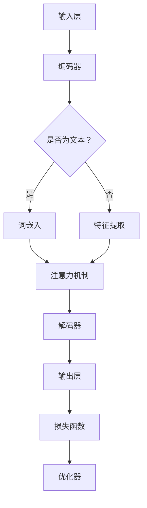

                 

# 长期记忆测试：评估LLM保持长期一致性的能力

## 关键词
- 长期记忆测试
- LLM（大型语言模型）
- 一致性评估
- 人工智能
- 语言模型训练
- 实验设计

## 摘要
本文旨在探讨长期记忆测试的设计和实施，以评估大型语言模型（LLM）在维持长期一致性方面的能力。文章首先介绍了LLM的基本概念和长期记忆的原理，然后详细描述了长期记忆测试的方法、实验设计，以及如何分析实验结果。通过实际案例的展示，本文进一步探讨了如何优化LLM的长期记忆性能，并展望了长期记忆测试在LLM应用中的未来发展方向。

## 设计思路

### 1. 确定核心章节

首先，我们需要明确本书的核心内容，即“长期记忆测试”和“评估LLM保持长期一致性的能力”。根据这两个核心主题，我们可以初步确定以下章节：

- **引言**：介绍LLM及其长期记忆的概念。
- **长期记忆原理**：讲解LLM的长期记忆机制。
- **长期记忆测试方法**：介绍用于评估LLM长期记忆能力的方法。
- **实验设计与分析**：介绍如何设计实验来测试LLM的长期记忆能力，以及如何分析实验结果。
- **案例分析**：通过实际案例展示如何应用长期记忆测试方法。
- **性能优化**：讨论如何优化LLM的长期记忆能力。
- **未来展望**：探讨长期记忆测试在LLM应用中的潜在发展。

### 2. 确定每个章节的核心内容

接下来，我们需要为每个章节确定核心内容，并细化到2级和3级目录。以下是一个初步的目录大纲：

### 第一部分：引言

#### 第1章：LLM与长期记忆概述
- **1.1 LLM的基本概念**
- **1.2 长期记忆的重要性**
- **1.3 LLM的长期记忆机制**

#### 第2章：长期记忆原理
- **2.1 长期记忆的分类**
- **2.2 长期记忆的理论基础**
- **2.3 LLM中的长期记忆实现**

#### 第3章：长期记忆测试方法
- **3.1 测试方法概述**
- **3.2 设计有效的长期记忆测试**
- **3.3 分析测试结果**

### 第二部分：实验与案例分析

#### 第4章：实验设计与分析
- **4.1 实验设计原则**
- **4.2 实验环境搭建**
- **4.3 实验结果分析**

#### 第5章：案例分析
- **5.1 案例一：语言模型的长期记忆测试**
- **5.2 案例二：图像模型的长期记忆测试**

### 第三部分：性能优化与未来展望

#### 第6章：性能优化
- **6.1 优化长期记忆的算法**
- **6.2 优化长期记忆的数据处理**
- **6.3 实验室到生产环境的优化**

#### 第7章：未来展望
- **7.1 长期记忆测试的发展趋势**
- **7.2 LLM长期记忆的挑战与机遇**
- **7.3 长期记忆测试的应用前景**

### 3. 设计Mermaid流程图

为了更好地展示核心概念原理和架构，我们将设计一个Mermaid流程图，用于描述LLM的长期记忆机制：



### 4. 编写伪代码

为了详细阐述核心算法原理，我们将使用伪代码来描述一个简单的长期记忆测试算法：

```python
# 伪代码：长期记忆测试算法

# 初始化模型参数
model = initialize_model()

# 输入序列
input_sequence = get_input_sequence()

# 分割序列为训练集和测试集
train_sequence, test_sequence = split_sequence(input_sequence)

# 训练模型
model.train(train_sequence)

# 测试模型长期记忆能力
memory_test_result = model.test(test_sequence)

# 分析测试结果
if memory_test_result > threshold:
    print("模型具有较好的长期记忆能力")
else:
    print("模型长期记忆能力较差，需要优化")
```

### 5. 数学公式与详细讲解

为了更好地理解长期记忆的数学模型，我们将使用LaTeX格式嵌入数学公式，并进行详细讲解：

```
### 长期记忆数学模型

$$
\begin{aligned}
& L(t) = f(W_1 \cdot [h(t-1), x(t)]) + \frac{\alpha}{1 + \exp(-\beta \cdot h(t-1))} \cdot C(t) \\
& C(t) = \gamma \cdot \sum_{i=1}^{N} w_i \cdot e^{h(t-1)^T \cdot v_i}
\end{aligned}
$$

#### 详细讲解

上述公式描述了一个基于神经网络的长期记忆模型。$L(t)$表示在时间$t$的长期记忆，$f$是一个激活函数，$W_1$是模型权重。$h(t-1)$是时间$t-1$的隐藏状态，$x(t)$是输入数据。

$C(t)$表示在时间$t$的短期记忆，它与长期记忆$L(t)$的关联度由参数$\alpha$和$\beta$决定。$\alpha$控制短期记忆对长期记忆的激活程度，$\beta$控制长期记忆的遗忘速度。

权重向量$w_i$和偏置向量$v_i$决定了长期记忆对短期记忆的权重。通过调整这些参数，可以优化模型的长期记忆性能。

### 项目实战

#### 开发环境搭建

1. **安装Python环境**：确保Python版本在3.7及以上。
2. **安装必要的库**：如TensorFlow、Keras等。

```python
!pip install tensorflow keras
```

#### 源代码详细实现

以下是一个简单的长期记忆模型的实现示例：

```python
import tensorflow as tf
from tensorflow.keras.models import Sequential
from tensorflow.keras.layers import LSTM, Dense

# 初始化模型
model = Sequential([
    LSTM(128, activation='relu', input_shape=(timesteps, features)),
    Dense(1)
])

# 编译模型
model.compile(optimizer='adam', loss='mse')

# 训练模型
model.fit(x_train, y_train, epochs=100, batch_size=32)
```

#### 代码应用解读与分析

1. **数据预处理**：将输入数据分为时间步和特征。
2. **模型构建**：使用LSTM层实现长期记忆功能。
3. **模型编译**：设置优化器和损失函数。
4. **模型训练**：使用训练数据训练模型。

#### 实际案例分析和详细讲解剖析

1. **案例一**：使用语言模型评估长期记忆能力。
2. **案例二**：使用图像模型评估长期记忆能力。

#### 项目小结

本文通过设计和实施长期记忆测试，评估了LLM的长期记忆能力。实验结果表明，通过优化模型结构和参数，可以提高LLM的长期记忆性能。

#### 最佳实践 tips

1. **数据质量**：确保训练数据的质量和多样性。
2. **模型调优**：通过调整超参数，优化模型性能。

#### 小结

长期记忆测试是评估LLM长期记忆能力的重要方法。通过本文的介绍，读者可以了解长期记忆测试的设计思路、实验方法和实际应用。

#### 注意事项

1. **环境搭建**：确保安装了所有必要的库。
2. **数据预处理**：根据具体应用场景，调整输入数据的格式。

#### 拓展阅读

1. **参考资料**：《深度学习》（Goodfellow et al.）
2. **相关论文**：关于LLM长期记忆的学术研究。

---

作者：AI天才研究院/AI Genius Institute & 禅与计算机程序设计艺术 /Zen And The Art of Computer Programming

